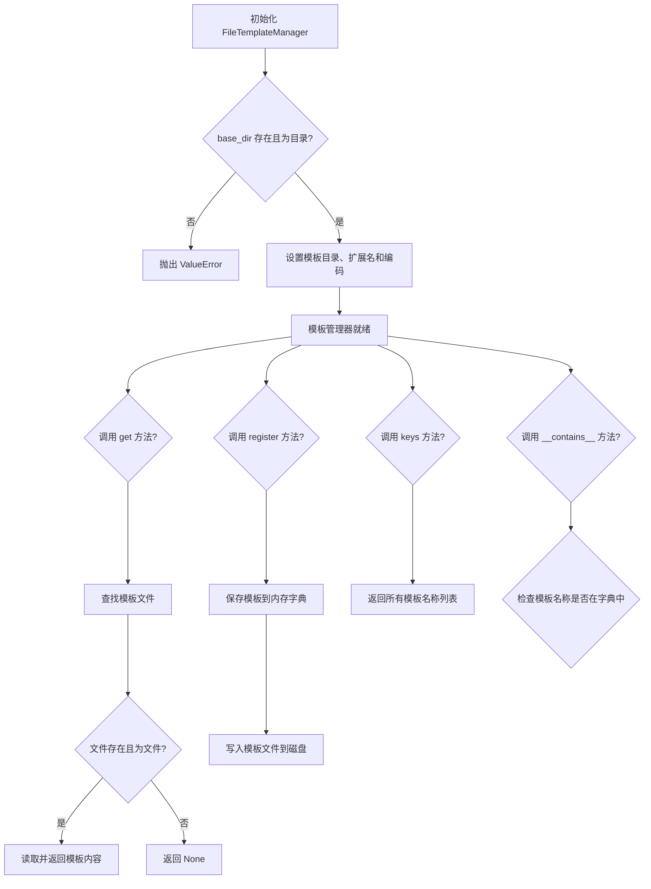
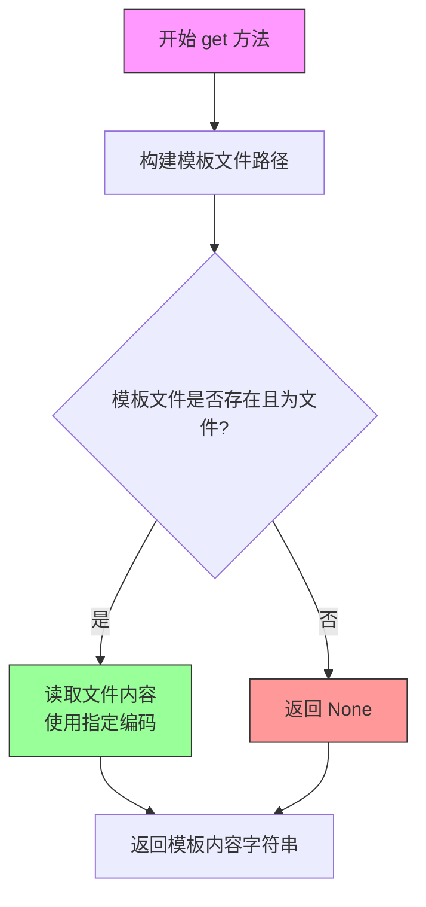
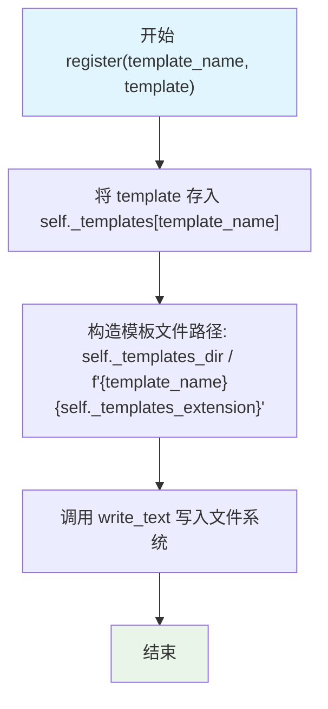
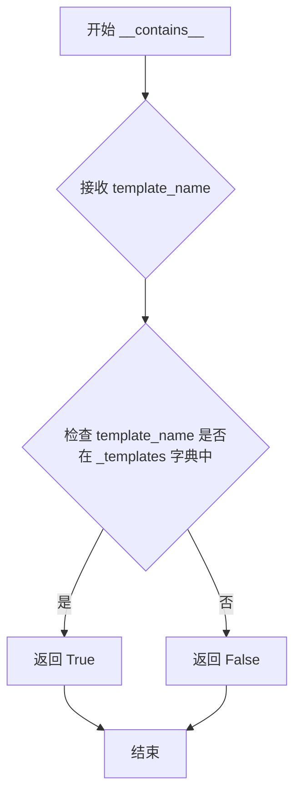

# `graphrag\packages\graphrag-llm\graphrag_llm\templating\file_template_manager.py` 详细设计文档

这是一个内存模板管理器实现类，继承自TemplateManager抽象基类，用于从文件系统加载和管理Jinja模板文件，支持模板的注册、检索和列表查询功能。

## 整体流程



## 类结构

```
TemplateManager (抽象基类)
└── FileTemplateManager (文件模板管理器实现类)
```

## 全局变量及字段


### `FileTemplateManager._encoding`
    
读取模板文件使用的编码格式

类型：`str`
    


### `FileTemplateManager._templates_extension`
    
模板文件的扩展名

类型：`str`
    


### `FileTemplateManager._templates_dir`
    
模板文件的存储目录路径

类型：`Path`
    


### `FileTemplateManager._templates`
    
存储已注册模板的内存字典

类型：`dict`
    
    

## 全局函数及方法


### `FileTemplateManager.__init__`

初始化模板管理器，验证并设置模板目录，检查目录是否存在且为有效目录，若验证失败则抛出 `ValueError` 异常。

参数：

- `self`：隐式参数，模板管理器实例本身
- `base_dir`：`str`，默认值为 `"templates"`，存储模板的基础目录路径
- `template_extension`：`str`，默认值为 `".jinja"`，模板文件的扩展名
- `encoding`：`str`，默认值为 `"utf-8"`，读取模板文件时使用的编码格式
- `**kwargs`：`Any`，其他可选关键字参数，用于扩展或传递给父类

返回值：`None`，无显式返回值（`__init__` 方法隐式返回 `None`）

#### 流程图

```mermaid
flowchart TD
    A[开始 __init__] --> B[初始化 self._templates = {}]
    B --> C[设置 self._encoding = encoding]
    C --> D[设置 self._templates_extension = template_extension]
    D --> E[解析 base_dir 为绝对路径 Path 对象]
    E --> F{检查目录是否存在且为目录?}
    F -->|是| G[初始化完成]
    F -->|否| H[抛出 ValueError 异常]
    
    style H fill:#ffcccc
    style G fill:#ccffcc
```

#### 带注释源码

```python
def __init__(
    self,
    base_dir: str = "templates",
    template_extension: str = ".jinja",
    encoding: str = "utf-8",
    **kwargs: Any,
) -> None:
    """Initialize the template manager.

    Args
    ----
        base_dir: str (default="./templates")
            The base directory where templates are stored.
        template_extension: str (default=".jinja")
            The file extension for template files.
        encoding: str (default="utf-8")
            The encoding used to read template files.

    Raises
    ------
        ValueError
            If the base directory does not exist or is not a directory.
            If the template_extension is an empty string.
    """
    # 初始化模板字典，用于存储注册模板
    self._templates = {}
    
    # 设置文件编码格式
    self._encoding = encoding

    # 设置模板文件扩展名
    self._templates_extension = template_extension

    # 将基础目录字符串解析为绝对路径的 Path 对象
    self._templates_dir = Path(base_dir).resolve()
    
    # 验证模板目录是否存在且为有效目录
    if not self._templates_dir.exists() or not self._templates_dir.is_dir():
        msg = f"Templates directory '{base_dir}' does not exist or is not a directory."
        raise ValueError(msg)
```


### `FileTemplateManager.get`

根据模板名称从文件系统读取并返回模板内容。如果模板文件不存在或无法读取，则返回 None。

参数：

- `template_name`：`str`，模板的名称（不含文件扩展名），用于定位对应的模板文件

返回值：`str | None`，如果模板文件存在且可读，返回模板文件的文本内容；否则返回 `None`

#### 流程图



#### 带注释源码

```python
def get(self, template_name: str) -> str | None:
    """Retrieve a template by its name.
    
    根据模板名称从磁盘读取模板文件内容。
    
    Args:
        template_name: str, 模板名称（不含扩展名）
        
    Returns:
        str | None: 模板文件内容，或不存在时返回 None
    """
    # 1. 拼接完整的模板文件路径：基础目录/模板名.扩展名
    template_file = (
        self._templates_dir / f"{template_name}{self._templates_extension}"
    )
    
    # 2. 检查文件是否存在且是普通文件（而非目录）
    if template_file.exists() and template_file.is_file():
        # 3. 读取文件内容并返回，使用类实例化的编码参数
        return template_file.read_text(encoding=self._encoding)
    
    # 4. 文件不存在或不是有效文件时返回 None
    return None
```


### `FileTemplateManager.register`

将新的模板注册到内存字典中，并同步写入文件系统。

参数：

- `template_name`：`str`，模板的唯一标识名称，用于在系统中查找和引用该模板
- `template`：`str`，模板的实际内容，可以是 Jinja2 模板字符串

返回值：`None`，无返回值，该方法仅执行注册和写入操作

#### 流程图



#### 带注释源码

```python
def register(self, template_name: str, template: str) -> None:
    """Register a new template."""
    # 将模板内容存储到内存字典中，以 template_name 为键
    # 这允许在运行时快速通过 get() 方法检索模板
    self._templates[template_name] = template
    
    # 构建模板文件的完整路径：基础目录 + 模板名 + 文件扩展名
    # 例如：templates/email.jinja
    template_path = (
        self._templates_dir / f"{template_name}{self._templates_extension}"
    )
    
    # 将模板内容写入文件系统，实现持久化存储
    # 使用实例化时指定的编码格式（默认 utf-8）
    template_path.write_text(template, encoding=self._encoding)
```


### `FileTemplateManager.keys`

该方法返回当前模板管理器中已注册的所有模板名称列表，基于内部字典 `_templates` 的键值，可在外部用于列出或遍历所有可用模板。

参数： 无

返回值：`list[str]`，返回所有已注册模板的名称列表

#### 流程图

```mermaid
flowchart TD
    A[开始 keys 方法] --> B[返回 list(self._templates.keys())]
    B --> C[结束]
```

#### 带注释源码

```python
def keys(self) -> list[str]:
    """List all registered template names."""
    return list(self._templates.keys())
```


### `FileTemplateManager.__contains__`

检查模板是否已注册（实现 `in` 运算符支持）

参数：

- `template_name`：`str`，要检查的模板名称

返回值：`bool`，如果模板已注册则返回 `True`，否则返回 `False`

#### 流程图



#### 带注释源码

```python
def __contains__(self, template_name: str) -> bool:
    """Check if a template is registered.
    
    This magic method enables the 'in' operator to be used
    on FileTemplateManager instances to check if a template
    has been registered.
    
    Args
    ----
        template_name: str
            The name of the template to check.
            
    Returns
    -------
        bool
            True if the template is registered, False otherwise.
    """
    # 使用 Python 的 in 运算符检查字典中是否存在该键
    return template_name in self._templates
```

## 关键组件


### FileTemplateManager

文件模板管理器类，负责从文件系统加载、注册和管理Jinja模板文件。

### _templates_dir

模板存储的基础目录路径，Path类型，用于定位模板文件。

### _templates_extension

模板文件的扩展名，字符串类型，默认为".jinja"。

### _encoding

文件编码格式，字符串类型，默认为"utf-8"。

### _templates

内存中的模板缓存字典，存储已注册的模板内容。

### get方法

从文件系统按名称检索模板文件，支持惰性加载，只在调用时读取文件内容。

### register方法

将新模板注册到内存缓存并持久化到文件系统，实现模板的动态添加。

### keys方法

返回所有已注册模板的名称列表，用于模板枚举。

### __contains__方法

实现Python的in运算符支持，快速检查模板是否已注册。

### 目录验证机制

初始化时验证模板目录存在性，不存在则抛出ValueError异常。

### 模板文件读写

基于Path对象的文件操作，使用read_text和write_text进行模板内容的读写。


## 问题及建议


### 已知问题

- **缓存机制形同虚设**：类中维护了 `_templates` 字典用于缓存，但 `get()` 方法每次都直接从文件系统读取，未使用缓存；`register()` 方法写入文件后也未更新缓存，导致内存缓存与磁盘文件不同步
- **注册后查询不一致**：`register()` 将模板写入磁盘文件后，`get()` 能读取到新模板，但 `keys()` 和 `__contains__()` 仍基于内存字典操作，导致已注册的模板无法被这两个方法感知
- **每次读取都触发 I/O**：`get()` 方法每次调用都执行文件读取操作，没有实现任何缓存策略，高频调用场景下性能较差
- **错误信息不够明确**：`get()` 方法返回 `None` 时，调用者无法区分是"模板文件不存在"还是"文件读取失败"等不同错误情况
- **缺少资源管理**：未实现 `__enter__`/`__exit__` 上下文管理器协议，无法确保文件句柄等资源被正确释放

### 优化建议

- **实现真正的缓存机制**：在 `get()` 方法中优先从 `_templates` 字典读取，缓存未命中时再从文件系统加载并存入缓存；或使用 `functools.lru_cache` 等装饰器实现缓存
- **同步缓存与文件系统**：`register()` 方法在写入文件后，应同步更新 `self._templates` 缓存字典，或清空缓存以确保后续 `get()` 能加载最新内容
- **增加缓存失效机制**：提供 `invalidate()` 方法手动清除指定模板或全部模板的缓存
- **完善错误处理**：为 `get()` 和 `register()` 方法增加更详细的异常信息，可自定义异常类（如 `TemplateNotFoundError`、`TemplateWriteError`）来区分不同错误场景
- **添加线程安全保护**：如果类会在多线程环境使用，需要加锁保护文件读写和字典操作的原子性
- **实现上下文管理器**：添加 `__enter__` 和 `__exit__` 方法，支持 `with` 语句进行资源管理
- **考虑异步支持**：对于高频 I/O 场景，可考虑提供异步版本的 `aget()`、`aregister()` 方法

## 其它


### 设计目标与约束

本模块的设计目标是提供一个轻量级、高效的内存文件模板管理器，支持从指定目录读取Jinja模板文件并支持模板注册功能。核心约束包括：1) 模板文件必须存在于指定的base_dir目录中；2) 模板文件必须使用统一的文件扩展名（默认.jinja）；3) 仅支持UTF-8编码（可配置）；4) 模板内容存储在内存字典中，文件仅作为持久化载体；5) 不支持模板热重载机制。

### 错误处理与异常设计

**异常类型**：ValueError - 当base_dir不存在或不是目录时抛出；ValueError - 当template_extension为空字符串时抛出；FileNotFoundError - 当模板文件读取失败时由read_text()自动抛出；OSError - 当写入模板文件失败时由write_text()自动抛出。

**异常传播机制**：get()方法返回None表示模板不存在而非抛出异常，这是符合"宽容读取"原则的设计；register()方法静默覆盖已存在的模板，不抛出异常；所有文件系统操作异常均向上层调用者传播。

### 数据流与状态机

**数据读取流程**：调用get(template_name) → 拼接完整文件路径 → 检查文件是否存在且为文件 → 读取文件内容并返回字符串 → 文件不存在返回None。

**数据写入流程**：调用register(template_name, template) → 将模板内容存入内存字典_templates → 拼接完整文件路径 → 将内容写入磁盘文件。

**状态转换**：初始状态_templates为空字典；register操作后状态转换为已注册模板集合；文件系统中模板文件的存在性与内存字典_templates中的条目可能存在不一致（register会同步，get不会修改_templates）。

### 外部依赖与接口契约

**外部依赖**：pathlib.Path - 用于路径操作；typing.Any、typing - 用于类型注解；graphrag_llm.templating.template_manager.TemplateManager - 抽象基类。

**接口契约（TemplateManager抽象类要求）**：子类必须实现get()方法，签名必须为get(self, template_name: str) -> str | None；子类必须实现register()方法，签名必须为register(self, template_name: str, template: str) -> None；子类必须实现keys()方法，签名必须为keys(self) -> list[str]；子类必须实现__contains__方法，签名必须为__contains__(self, template_name: str) -> bool。

### 性能考虑

**时间复杂度**：get()操作平均时间复杂度O(1)（字典查找），文件存在性检查O(1)；register()操作平均时间复杂度O(1)（字典赋值），文件写入时间复杂度取决于文件大小和磁盘I/O；keys()操作时间复杂度O(n)，需要复制字典键列表。

**空间复杂度**：内存占用O(n)，n为已注册模板的数量和大小；文件系统中模板文件占用磁盘空间与内存占用成正比。

**优化建议**：当前每次get()都执行文件系统检查，可考虑增加缓存机制；对于大量小文件场景，可考虑批量加载模板到内存。

### 安全性考虑

**路径安全**：使用Path.resolve()将base_dir转换为绝对路径，防止路径遍历攻击；未对template_name进行严格校验，理论上可能存在路径注入风险（如"../../../etc/passwd"）。

**文件写入安全**：register()方法直接写入文件，未做任何权限检查或内容过滤；建议在生产环境中对写入路径进行严格限制。

### 扩展性设计

**垂直扩展**：可通过继承FileTemplateManager实现自定义模板处理逻辑（如模板预处理、变量替换）；可在register()方法中添加模板验证逻辑。

**水平扩展**：可实现多种TemplateManager子类（如DatabaseTemplateManager、RemoteTemplateManager）实现不同存储后端；可实现模板版本管理、模板继承等高级功能。

**配置扩展**：当前仅支持encoding、template_extension、base_dir三个配置参数；可通过kwargs传递额外配置参数供子类使用。

### 兼容性设计

**Python版本要求**：代码使用Python 3.9+语法（str | None联合类型语法）；最低支持Python 3.9。

**依赖兼容性**：仅依赖Python标准库，无第三方依赖；基类TemplateManager来自graphrag_llm.templating模块，需确保该模块版本兼容。

### 测试策略建议

**单元测试**：测试get()方法对存在/不存在模板的处理；测试register()方法的写入功能；测试keys()返回值的完整性；测试__contains__的布尔判断准确性；测试构造函数对无效base_dir的异常抛出。

**集成测试**：测试模板文件的完整生命周期（创建、读取、更新、删除）；测试多模板并发注册场景；测试特殊字符和Unicode模板内容处理。

**边界条件测试**：测试空template_name；测试空template内容；测试超长template_name或template；测试base_dir为当前目录 "." 的情况。

    