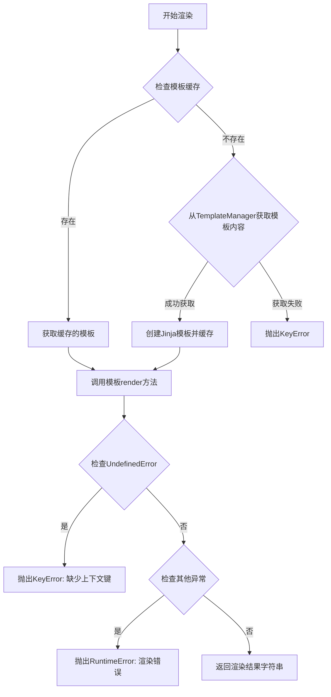
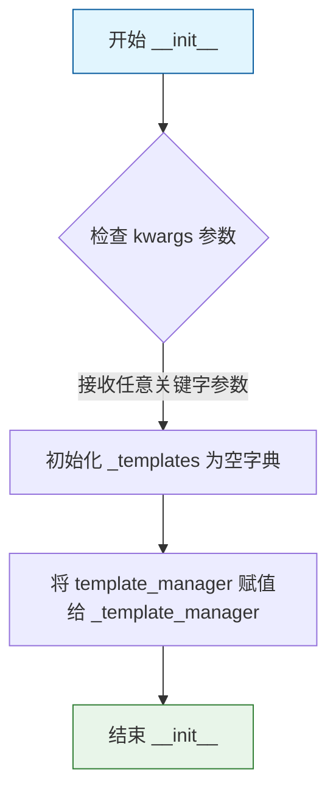
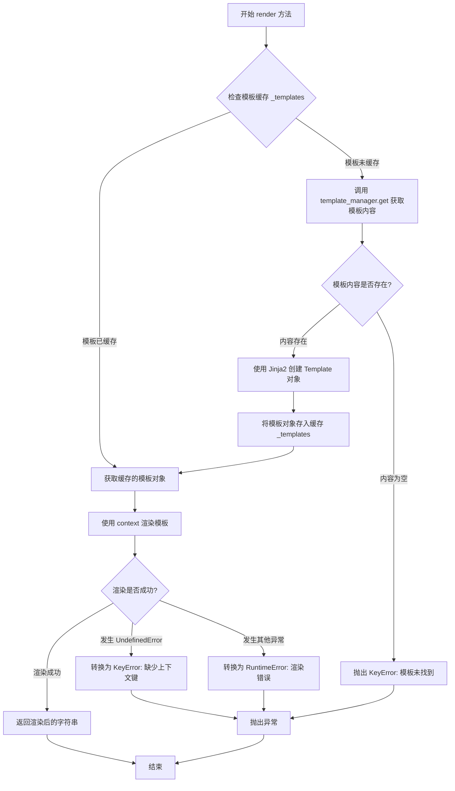
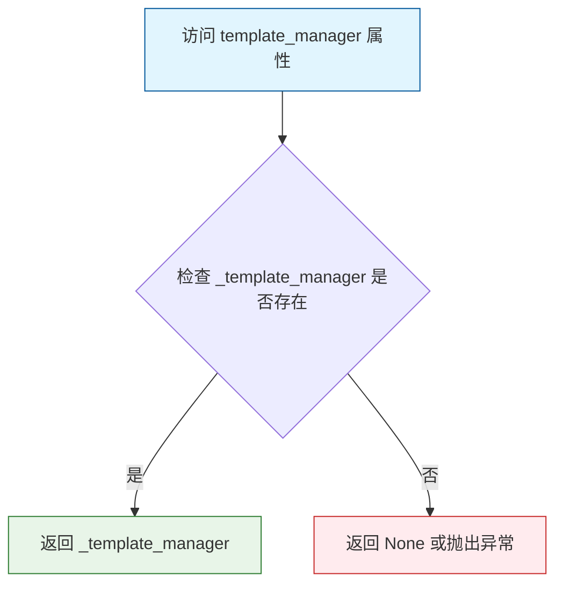

# `graphrag\packages\graphrag-llm\graphrag_llm\templating\jinja_template_engine.py` 详细设计文档

基于Jinja2的模板引擎实现，继承自TemplateEngine抽象基类，用于通过模板管理器和上下文数据渲染Jinja模板，支持模板缓存和错误处理。

## 整体流程



## 类结构

```
TemplateEngine (抽象基类)
└── JinjaTemplateEngine (Jinja2实现)
```

## 全局变量及字段


### `JinjaTemplateEngine._templates`
    
缓存的Jinja模板字典

类型：`dict[str, Template]`
    


### `JinjaTemplateEngine._template_manager`
    
模板管理器实例

类型：`TemplateManager`
    
    

## 全局函数及方法


### `JinjaTemplateEngine.__init__`

初始化 Jinja 模板引擎，接受模板管理器实例并初始化内部模板缓存字典，为后续模板渲染做好准备。

参数：

- `template_manager`：`TemplateManager`，用于加载模板的模板管理器实例
- `**kwargs`：`Any`，接收额外的关键字参数（当前未被使用，保留以支持扩展）

返回值：`None`，无返回值（构造函数）

#### 流程图



#### 带注释源码

```python
def __init__(self, *, template_manager: "TemplateManager", **kwargs: Any) -> None:
    """Initialize the template engine.

    Args
    ----
        template_manager: TemplateManager
            The template manager to use for loading templates.
    """
    # 初始化模板缓存字典，用于存储已编译的 Jinja 模板对象
    # 键为模板名称，值为编译后的 Template 对象
    self._templates: dict[str, Template] = {}
    
    # 存储模板管理器引用，用于按需加载模板内容
    # TemplateManager 负责从文件系统或其他来源读取模板文件
    self._template_manager: "TemplateManager" = template_manager
```


### `JinjaTemplateEngine.render`

该方法是 Jinja 模板引擎的核心渲染方法，负责根据模板名称和上下文数据渲染模板。方法首先检查模板缓存，若缓存未命中则从模板管理器加载模板，然后使用 Jinja2 进行渲染，并处理可能出现的未定义变量错误和其他渲染错误。

参数：

- `template_name`：`str`，要渲染的模板名称
- `context`：`dict[str, Any]`，渲染模板时使用的上下文数据字典

返回值：`str`，渲染后的模板内容字符串

#### 流程图



#### 带注释源码

```python
def render(self, template_name: str, context: dict[str, Any]) -> str:
    """Render a template with the given context."""
    # 第1步：从缓存中尝试获取已编译的 Jinja 模板对象
    jinja_template = self._templates.get(template_name)
    
    # 第2步：如果缓存中没有该模板
    if jinja_template is None:
        # 通过模板管理器加载模板内容
        template_contents = self._template_manager.get(template_name)
        
        # 第3步：检查模板内容是否存在
        if template_contents is None:
            # 模板不存在，抛出 KeyError 异常
            msg = f"Template '{template_name}' not found."
            raise KeyError(msg)
        
        # 第4步：使用 Jinja2 创建模板对象，使用 StrictUndefined
        # StrictUndefined 会在模板中引用未定义变量时抛出异常
        jinja_template = Template(template_contents, undefined=StrictUndefined)
        
        # 第5步：将新创建的模板对象缓存到字典中
        self._templates[template_name] = jinja_template
    
    # 第6步：尝试使用提供的 context 渲染模板
    try:
        # 使用上下文字典的关键字参数渲染模板
        return jinja_template.render(**context)
    except UndefinedError as e:
        # 第7步：处理未定义变量错误，转换为更友好的 KeyError
        msg = f"Missing key in context for template '{template_name}': {e.message}"
        raise KeyError(msg) from e
    except Exception as e:
        # 第8步：处理其他所有渲染错误，转换为 RuntimeError
        msg = f"Error rendering template '{template_name}': {e!s}"
        raise RuntimeError(msg) from e
```


### `JinjaTemplateEngine.template_manager`

获取与该引擎关联的模板管理器。

参数：

- `self`：实例本身，无需显式传递

返回值：`TemplateManager`，返回当前模板引擎关联的模板管理器实例

#### 流程图



#### 带注释源码

```python
@property
def template_manager(self) -> "TemplateManager":
    """Template manager associated with this engine."""
    return self._template_manager
```

**代码解析：**

- **`@property` 装饰器**：将方法转换为属性，允许通过 `instance.template_manager` 的方式访问，而无需使用方法调用的括号形式
- **`def template_manager(self) -> "TemplateManager"`：定义属性 getter 方法，返回类型为 `TemplateManager`，使用前向引用字符串以避免循环导入
- **`"""Template manager associated with this engine."""`：文档字符串，说明该属性的用途
- **`return self._template_manager`：返回私有属性 `_template_manager`，该属性在 `__init__` 方法中被初始化为传入的 `template_manager` 参数**

## 关键组件


### JinjaTemplateEngine 类

Jinja2 模板引擎的实现类，继承自 TemplateEngine 基类，负责使用 Jinja2 模板引擎渲染模板，支持模板缓存和惰性加载。

### 模板缓存机制 (_templates: dict[str, Template])

存储已编译的 Jinja2 模板对象的字典，实现编译结果的缓存，避免重复编译相同模板，提升渲染性能。

### 模板管理器集成 (_template_manager: TemplateManager)

关联的模板管理器实例，负责按需加载模板文件内容，实现模板来源的抽象管理。

### 渲染方法 (render)

核心模板渲染方法，支持模板缓存与惰性编译，处理模板缺失、上下文键缺失等异常情况，返回渲染后的字符串结果。

### 错误处理机制

使用 StrictUndefined 配置使未定义变量在渲染时抛出异常，配合自定义错误消息提供更清晰的调试信息。


## 问题及建议


### 已知问题

- **无限缓存增长**：`_templates` 字典作为缓存没有大小限制，当模板数量增多时会导致内存持续增长，存在内存泄漏风险
- **线程不安全**：缓存字典的读写操作在多线程并发场景下缺乏同步保护，可能导致数据竞争
- **模板更新困难**：没有提供清除缓存或重新加载模板的接口，无法支持动态更新模板内容
- **编译错误处理缺失**：`Template()` 构造时若模板内容有语法错误会直接抛出异常，没有预编译验证机制
- **kwargs 滥用**：`__init__` 接收 `**kwargs: Any` 但未实际使用，且没有文档说明支持的额外参数

### 优化建议

- 引入 LRU 缓存机制限制缓存大小，或实现缓存淘汰策略
- 使用线程锁（如 `threading.RLock`）保护缓存访问，或改用线程安全的数据结构
- 添加 `clear_cache()` 和 `reload_template()` 方法支持动态更新
- 在模板编译时捕获 `TemplateSyntaxError` 并转换为更友好的错误信息
- 移除未使用的 `**kwargs` 或明确其用途和支持的参数列表

## 其它


### 设计目标与约束

本模块的设计目标是提供一个基于Jinja2的模板渲染引擎，实现模板的缓存管理和上下文渲染。核心约束包括：1) 必须继承自TemplateEngine基类以保持模板引擎接口一致性；2) 使用StrictUndefined来强制检查模板变量是否定义，防止运行时出现未预期的未定义变量；3) 模板内容从TemplateManager获取，支持模板内容的动态加载；4) 通过内存缓存机制避免重复解析相同模板，提高渲染性能。

### 错误处理与异常设计

本类的异常处理策略采用层级转换机制。当模板上下文缺少必要变量时，Jinja2的UndefinedError被捕获并重新抛出为KeyError，保持调用方处理异常的一致性。当TemplateManager返回None（模板不存在）时，抛出KeyError并包含模板名称信息。对于渲染过程中出现的其他任何异常，统一转换为RuntimeError并保留原始异常作为原因链（cause），便于调试和问题追溯。所有异常消息都包含模板名称，便于定位问题模板。

### 数据流与状态机

数据流遵循三级处理流程：首先是模板查找阶段，通过template_name在_templates缓存字典中查找已编译的Template对象；其次是模板加载阶段，若缓存未命中则调用template_manager.get()获取原始模板内容，创建Template实例并存入缓存；最后是渲染阶段，调用jinja_template.render()方法将context字典展开为模板变量并生成最终字符串。状态机包含三种状态：缓存命中（直接渲染）、缓存未命中（加载并缓存后渲染）、模板不存在（抛出异常）。

### 外部依赖与接口契约

外部依赖包括：1) jinja2包中的Template类和StrictUndefined类，用于模板编译和严格未定义检查；2) graphrag_llm.templating.template_engine.TemplateEngine基类，定义模板引擎的标准接口；3) graphrag_llm.templating.template_manager.TemplateManager，提供模板内容的加载接口。接口契约方面，render方法接收template_name（str类型）和context（dict类型）两个参数，返回渲染后的字符串；template_manager属性提供对关联管理器实例的只读访问。

### 性能考虑

性能优化主要体现在模板缓存机制上。_templates字典作为内存缓存，存储已编译的Template对象，避免对同一模板重复进行词法分析和编译操作。首次渲染某模板时需要经历加载和编译的开销，后续渲染直接命中缓存。潜在的性能瓶颈包括：1) 缓存字典的线程安全访问；2) 模板内容过大时的内存占用；3) TemplateManager.get()的I/O性能。建议在高并发场景下考虑使用线程安全的缓存数据结构或引入缓存淘汰策略。

### 安全性考虑

安全性设计主要通过StrictUndefined实现。该配置使Jinja2在渲染时对任何未定义的变量抛出异常而非默认渲染为空字符串，有效防止因变量遗漏导致的模板注入或信息泄露问题。调用方必须确保context中包含模板所需的所有变量。此外，建议对template_name进行输入验证，防止路径遍历等恶意输入，尽管当前实现依赖TemplateManager的安全性保证。

### 并发与线程安全

当前实现中的_templates字典和template_manager属性均非线程安全。多个线程同时调用render方法时可能产生竞态条件：1) 多线程同时检查缓存未命中并创建Template实例；2) TemplateManager本身在多线程环境下的并发访问。建议在多线程环境下使用时添加锁保护，或考虑使用线程安全的缓存实现（如threading.RLock或concurrent.futures的线程池管理）。若应用场景涉及大量并发渲染，考虑使用单例模式或依赖注入容器管理模板引擎实例。

### 配置与扩展性

配置通过__init__方法的**kwargs参数传递，支持向基类或未来扩展传递额外配置参数。当前实现中kwargs未被使用，保留了接口扩展的灵活性。扩展方向包括：1) 支持自定义Jinja2环境配置（如过滤器、自定义语法）；2) 支持不同的Undefined处理策略；3) 支持缓存大小限制和淘汰策略。TemplateEngine基类定义了标准接口，子类可通过覆盖方法实现差异化功能。

### 测试策略

测试应覆盖以下关键场景：1) 正常渲染测试，验证模板变量正确替换；2) 模板不存在测试，验证抛出KeyError；3) 上下文缺少变量测试，验证StrictUndefined触发KeyError；4) 模板缓存测试，验证多次渲染使用缓存而非重复加载；5) 异常链测试，验证原始异常信息在cause中保留；6) 并发渲染测试，验证多线程场景下的行为。建议使用pytest框架，配合unittest.mock模拟TemplateManager的行为。

### 版本兼容性

需要考虑的版本兼容性包括：1) Python版本要求，当前代码使用类型注解和dict类型参数，需要Python 3.9+；2) jinja2版本兼容性，StrictUndefined在jinja2 3.0+版本中稳定可用；3) 与TemplateEngine基类的接口兼容性，确保子类方法签名与父类一致。建议在项目依赖管理中明确指定jinja2>=3.0.0和python>=3.9的版本要求。

### 日志与监控

当前实现缺少日志记录功能。建议在关键节点添加日志：1) 模板加载时记录debug级别日志；2) 缓存命中时记录trace级别日志；3) 异常发生时记录error级别日志并包含模板名称和错误详情。监控指标建议包括：模板渲染次数、缓存命中率、平均渲染耗时、异常发生频率。这些指标可集成到项目级别的监控系统中，便于运维人员了解模板引擎的运行状态。


    