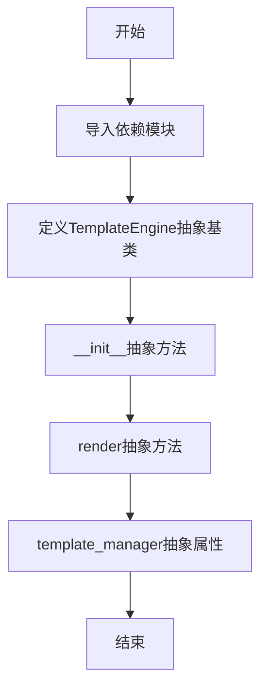
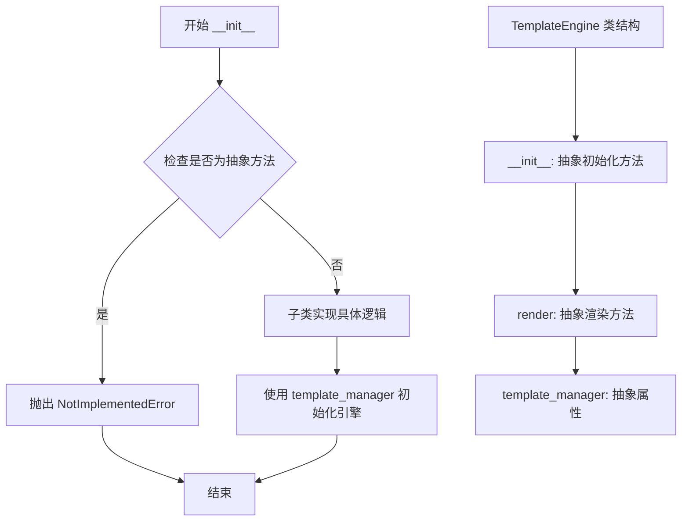
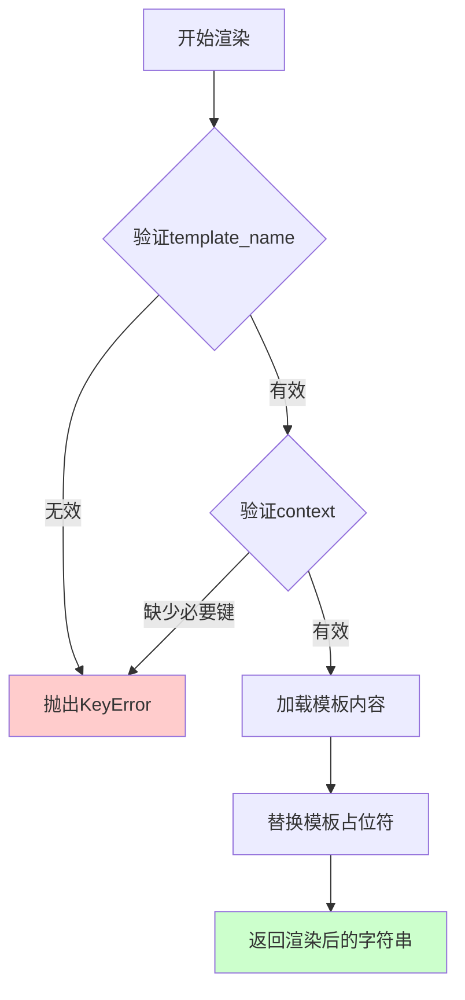
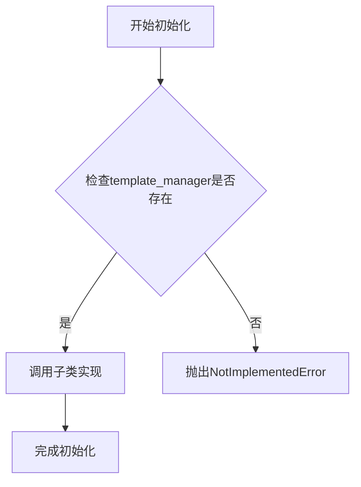
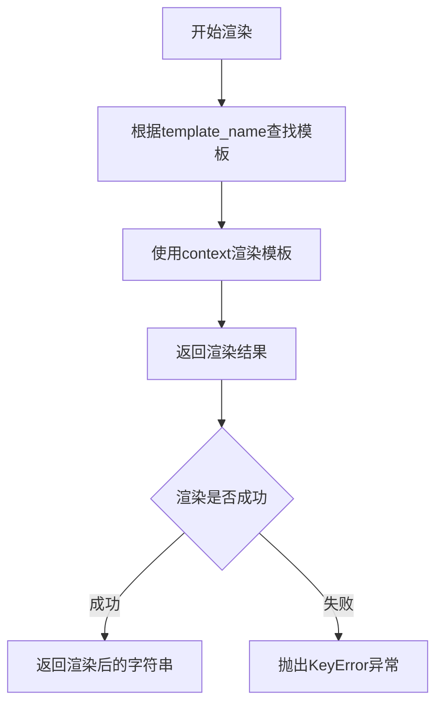

# `graphrag\packages\graphrag-llm\graphrag_llm\templating\template_engine.py` 详细设计文档

定义了一个抽象基类TemplateEngine，用于模板引擎的抽象接口。该类规定了模板引擎必须实现的初始化、渲染和模板管理器属性等核心功能，为具体的模板引擎实现提供了统一的接口规范。

## 整体流程



## 类结构

```
TemplateEngine (抽象基类)
└── [具体实现类待定义]
```

## 全局变量及字段


    

## 全局函数及方法


### `TemplateEngine.__init__`

初始化模板引擎的抽象方法，作为所有模板引擎子类的基类接口，接收模板管理器实例用于加载和管理模板。

参数：

- `template_manager`：`TemplateManager`，模板管理器实例，用于加载和管理模板
- `**kwargs`：`Any`，其他可选关键字参数，用于扩展子类初始化行为

返回值：`None`，无返回值

#### 流程图



#### 带注释源码

```python
@abstractmethod
def __init__(self, *, template_manager: "TemplateManager", **kwargs: Any) -> None:
    """Initialize the template engine.

    Args
    ----
        template_manager: TemplateManager
            The template manager to use for loading templates.

    """
    raise NotImplementedError
```

#### 说明

这是一个**抽象方法**（使用 `@abstractmethod` 装饰器），不能直接实例化调用。所有继承 `TemplateEngine` 的子类必须实现此方法。

- `*` 表示后续参数必须使用关键字参数（keyword-only arguments）传递
- `"TemplateManager"` 使用字符串引用以避免循环导入（通过 `TYPE_CHECKING` 条件导入）
- `**kwargs` 允许子类接受额外的初始化参数，增加扩展性
- `raise NotImplementedError` 表明这是接口定义，具体实现由子类完成


### `TemplateEngine.render`

渲染一个模板，使用提供的上下文数据填充模板占位符。

参数：

- `template_name`：`str`，要渲染的模板名称
- `context`：`dict[str, Any]`，渲染模板所需的上下文数据

返回值：`str`，渲染后的模板字符串

#### 流程图



#### 带注释源码

```python
@abstractmethod
def render(self, template_name: str, context: dict[str, Any]) -> str:
    """Render a template with the given context.

    Args
    ----
        template_name: str
            The name of the template to render.
        context: dict[str, str]
            The context to use for rendering the template.

    Returns
    -------
        str: The rendered template.

    Raises
    ------
        KeyError: If the template is not found or a required key is missing in the context.
    """
    raise NotImplementedError
```

**注释说明：**

- `@abstractmethod`：装饰器，表示这是一个抽象方法，必须由子类实现
- `template_name: str`：模板名称，用于定位要渲染的模板文件
- `context: dict[str, Any]`：字典类型，包含模板中占位符所需的值
- 返回值 `str`：填充了上下文数据后的完整模板字符串
- 异常 `KeyError`：当模板不存在或上下文缺少必要键时抛出
- `raise NotImplementedError`：由于是抽象方法，此行不会执行，仅作为接口定义存在

## 关键组件


## 一段话描述

该代码定义了一个用于模板引擎的抽象基类（ABC）`TemplateEngine`，它强制所有子类实现模板初始化、渲染和模板管理器属性的抽象方法，为上层应用提供了标准化的模板渲染接口。

## 文件的整体运行流程

该文件本身是一个接口定义文件，不执行具体业务逻辑。其运行流程体现为：子类继承`TemplateEngine`后，实现具体的`__init__`（初始化模板引擎和模板管理器）、`render`（根据模板名和上下文渲染模板）和`template_manager`（获取关联的模板管理器）方法，供外部调用者通过多态机制使用。

## 类的详细信息

### TemplateEngine

**描述**：用于模板引擎的抽象基类，定义了模板引擎的标准接口。

#### 类字段

| 名称 | 类型 | 描述 |
|------|------|------|
| 无类字段 | - | - |

#### 类方法

##### __init__

- **参数名称**: template_manager
- **参数类型**: TemplateManager
- **参数描述**: 用于加载模板的模板管理器实例
- **参数名称**: kwargs
- **参数类型**: Any
- **参数描述**: 其他可选的初始化参数
- **返回值类型**: None
- **返回值描述**: 无返回值

**mermaid流程图**：


**带注释源码**：
```python
@abstractmethod
def __init__(self, *, template_manager: "TemplateManager", **kwargs: Any) -> None:
    """Initialize the template engine.

    Args
    ----
        template_manager: TemplateManager
            The template manager to use for loading templates.

    """
    raise NotImplementedError
```

##### render

- **参数名称**: template_name
- **参数类型**: str
- **参数描述**: 要渲染的模板名称
- **参数名称**: context
- **参数类型**: dict[str, Any]
- **参数描述**: 用于渲染模板的上下文数据
- **返回值类型**: str
- **返回值描述**: 渲染后的模板字符串

**mermaid流程图**：


**带注释源码**：
```python
@abstractmethod
def render(self, template_name: str, context: dict[str, Any]) -> str:
    """Render a template with the given context.

    Args
    ----
        template_name: str
            The name of the template to render.
        context: dict[str, str]
            The context to use for rendering the template.

    Returns
    -------
        str: The rendered template.

    Raises
    ------
        KeyError: If the template is not found or a required key is missing in the context.
    """
    raise NotImplementedError
```

#### 抽象属性

##### template_manager

- **类型**: TemplateManager
- **描述**: 与此引擎关联的模板管理器

**带注释源码**：
```python
@property
@abstractmethod
def template_manager(self) -> "TemplateManager":
    """Template manager associated with this engine."""
    raise NotImplementedError
```

## 关键组件信息

### 抽象基类设计模式

通过ABC和abstractmethod装饰器实现接口约束，确保子类必须实现所有抽象方法

### 模板管理器集成

通过template_manager参数和属性实现模板加载与管理的解耦

### 渲染接口抽象

render方法定义了标准化的模板渲染契约，支持任意模板名称和上下文数据

### 类型提示支持

使用TYPE_CHECKING和字符串前向引用解决循环导入问题

## 潜在的技术债务或优化空间

1. **异常处理不完善**：__init__和render方法中的raise NotImplementedError只是占位实现，应在子类中用具体异常替换
2. **文档与类型不一致**：render方法文档声明context类型为dict[str, str]，但函数签名使用dict[str, Any]
3. **缺少默认值支持**：render方法未提供默认值或默认模板的fallback机制
4. **日志与监控缺失**：未定义模板渲染过程中的日志记录和性能监控接口

## 其它项目

### 设计目标与约束

- **设计目标**：为多种模板引擎实现（如Jinja2、Mustache等）提供统一接口
- **约束**：所有子类必须实现所有抽象方法和属性

### 错误处理与异常设计

- NotImplementedError：表示抽象方法尚未实现
- KeyError：文档声明在模板未找到或上下文缺少必要键时抛出，但具体实现依赖子类

### 数据流与状态机

- 数据流：外部调用者 → render方法 → 子类实现 → 返回渲染结果
- 无状态机设计，模板引擎实例应保持无状态以支持并发

### 外部依赖与接口契约

- 依赖`graphrag_llm.templating.template_manager.TemplateManager`
- 接口契约：子类必须提供template_manager属性和render方法实现


## 问题及建议


### 已知问题

-   **类型注解不一致**：`render` 方法的参数 `context` 类型注解为 `dict[str, Any]`，但 docstring 中描述为 `dict[str, str]`，存在不一致
-   **抽象方法实现不当**：`__init__` 方法使用 `raise NotImplementedError` 实现，但作为抽象方法这没有意义，子类实现时不会调用此方法
-   **装饰器顺序问题**：`@property` 在 `@abstractmethod` 之后，这种顺序在某些 Python 版本中可能导致属性无法正确被识别为抽象属性
-   **抽象方法返回值类型**：`__init__` 方法标注返回 `None` 但实际抛出异常，语义上存在矛盾

### 优化建议

-   统一 `render` 方法的 `context` 参数类型注解与 docstring 描述，建议保持 `dict[str, Any]` 以支持更灵活的上下文
-   移除 `__init__` 方法中的 `raise NotImplementedError`，或将其改为普通方法而非抽象方法；如需强制子类实现，可完全依赖抽象方法声明而不提供实现
-   调整装饰器顺序，将 `@property` 放在 `@abstractmethod` 之前，确保抽象属性正确生效
-   为 `template_manager` 属性添加 docstring，说明其在引擎中的角色和用途
-   考虑添加更多抽象方法声明，如 `list_templates`、`clear_cache` 等，以完善模板引擎的接口契约

## 其它


### 设计目标与约束

本类作为模板引擎的抽象基类，定义了模板引擎的标准接口规范，旨在解耦具体模板实现与上层调用逻辑，遵循依赖倒置原则（DIP），使TemplateManager能够通过抽象接口调用不同的模板引擎实现（如Jinja2、Mustache等）。设计约束包括：所有具体实现必须继承此类并实现所有抽象方法；template_manager必须通过构造函数注入；render方法必须返回字符串类型的渲染结果。

### 错误处理与异常设计

代码中定义了两种预期的异常场景：KeyError用于模板未找到或上下文缺少必要键时抛出；NotImplementedError用于防止直接实例化抽象类。当前的异常设计符合Python惯例，但缺少自定义异常类定义，建议在具体实现类中定义更细粒度的异常（如TemplateNotFoundError、RenderError等），并考虑添加异常链（exception chaining）以保留原始错误上下文。

### 外部依赖与接口契约

主要依赖包括：abc模块（用于定义抽象基类）、typing模块（用于类型注解）、graphrag_llm.templating.template_manager模块（循环导入时的类型检查）。接口契约方面：__init__接受template_manager参数和任意关键字参数kwargs；render方法接受template_name(str)和context(dict[str, Any])参数，返回str；template_manager属性为只读，返回TemplateManager类型。所有实现类必须严格遵循此接口签名。

### 线程安全/并发考虑

当前代码未包含任何线程安全机制。由于模板引擎的具体实现可能涉及文件I/O或内部状态修改，建议在具体实现类中明确标注线程安全性。若template_manager或渲染结果存在共享状态，应考虑添加锁或使用线程局部存储（threading.local）。

### 性能要求与基准

作为接口定义，性能考量依赖于具体实现。render方法作为核心操作，其性能直接影响整体效率。建议在具体实现中关注：模板缓存机制、上下文复制开销、渲染过程中的I/O优化。基准测试应覆盖单次渲染、批量渲染、不同模板大小和上下文复杂度的场景。

### 版本兼容性

代码使用TYPE_CHECKING避免循环导入，支持Python 3.9+的类型注解语法（dict[str, Any]）。kwargs参数提供了向前兼容性，允许未来在不影响接口的情况下扩展初始化参数。建议在具体实现中明确支持的Python版本范围。

### 测试策略

由于此类为抽象基类，测试策略应包括：验证所有抽象方法被正确定义；使用mock测试具体实现类是否符合抽象接口；测试NotImplementedError在调用未实现方法时正确抛出；测试类型注解的正确性。建议使用pytest结合abc模块的ABCMeta测试功能验证类层次结构的正确性。

### 使用示例

```python
# 抽象基类不能直接实例化，会抛出TypeError
engine = TemplateEngine(template_manager=None)  # TypeError

# 正确用法：实现具体子类
class Jinja2Engine(TemplateEngine):
    def __init__(self, *, template_manager, **kwargs):
        self._template_manager = template_manager
        
    @property
    def template_manager(self):
        return self._template_manager
        
    def render(self, template_name: str, context: dict[str, Any]) -> str:
        # 具体实现
        pass

# 使用
manager = TemplateManager(...)
engine = Jinja2Engine(template_manager=manager)
result = engine.render("hello.html", {"name": "World"})
```

### 扩展点与插件机制

当前设计通过抽象基类和kwargs提供了良好的扩展性。扩展点包括：可通过在具体实现类中重写render方法添加自定义渲染逻辑；可通过kwargs传递引擎特定配置（如缓存策略、语法选项等）；可通过继承TemplateEngine创建新的模板引擎类型。建议在未来添加模板引擎注册机制，允许TemplateManager动态发现和加载不同的引擎实现。


    