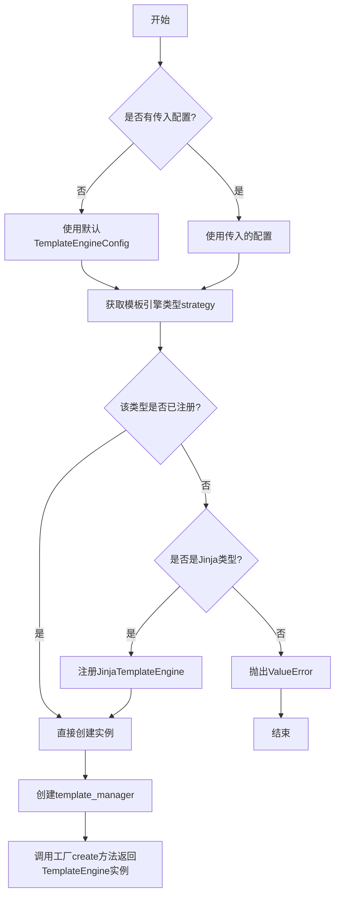
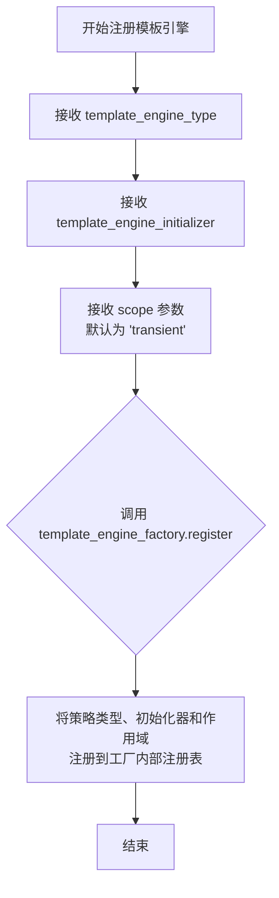
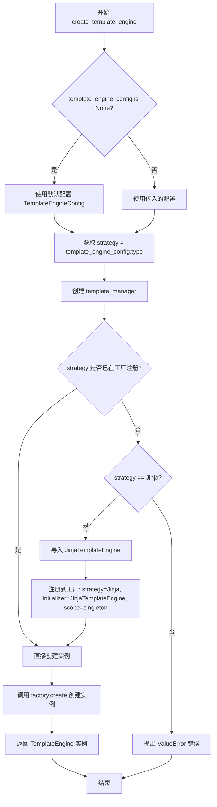
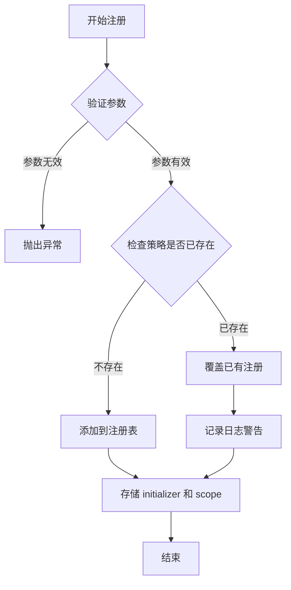
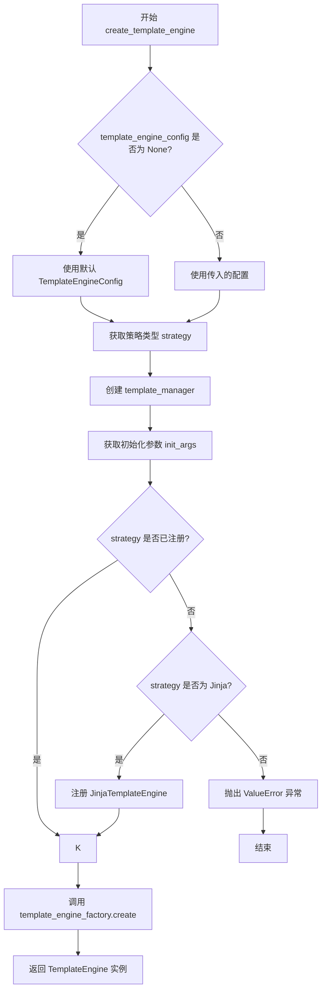
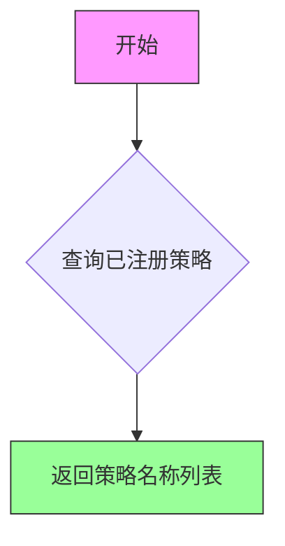
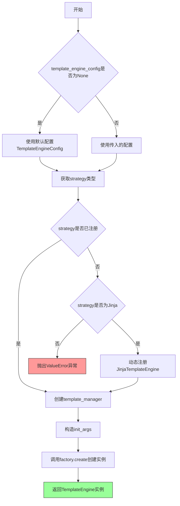
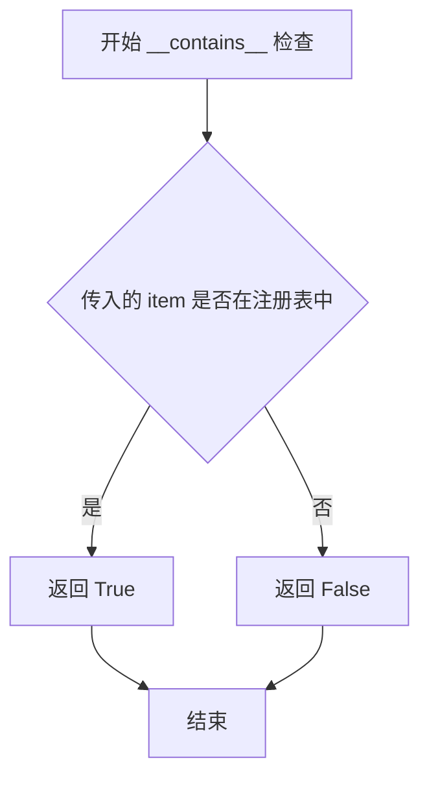

# `graphrag\packages\graphrag-llm\graphrag_llm\templating\template_engine_factory.py` 详细设计文档

这是一个模板引擎工厂实现模块，通过工厂模式创建和管理不同类型的模板引擎（如Jinja2）实例，支持自定义模板引擎的注册和动态创建。

## 整体流程



## 类结构

```
Factory<T> (抽象基类)
└── TemplateEngineFactory
        
TemplateEngine (抽象基类)
└── JinjaTemplateEngine
```

## 全局变量及字段


### `template_engine_factory`
    
全局工厂实例，用于创建和注册模板引擎实现

类型：`TemplateEngineFactory`
    


    

## 全局函数及方法


### `register_template_engine`

注册自定义模板引擎实现到模板引擎工厂中，允许系统动态扩展支持的模板引擎类型。

参数：

-  `template_engine_type`：`str`，要注册的模板引擎类型标识符
-  `template_engine_initializer`：`Callable[..., TemplateEngine]`，用于创建模板引擎实例的可调用对象（初始化器）
-  `scope`：`ServiceScope`，服务作用域，默认为 `"transient"`，决定模板引擎实例的生命周期

返回值：`None`，无返回值

#### 流程图



#### 带注释源码

```python
def register_template_engine(
    template_engine_type: str,
    template_engine_initializer: Callable[..., TemplateEngine],
    scope: "ServiceScope" = "transient",
) -> None:
    """Register a custom template engine implementation.

    Args
    ----
        template_engine_type: str
            The template engine id to register.
        template_engine_initializer: Callable[..., TemplateEngine]
            The template engine initializer to register.
        scope: ServiceScope (default: "transient")
            The service scope for the template engine instance.
    """
    # 调用模板引擎工厂的 register 方法，将自定义模板引擎注册到系统中
    # strategy: 模板引擎的类型标识符
    # initializer: 用于创建模板引擎实例的可调用对象
    # scope: 服务作用域，控制实例的生命周期（transient/singleton 等）
    template_engine_factory.register(
        strategy=template_engine_type,
        initializer=template_engine_initializer,
        scope=scope,
    )
```


### `create_template_engine`

该函数是一个模板引擎工厂函数，用于根据配置创建对应的模板引擎实例。它首先处理配置参数，然后创建模板管理器，接着检查目标模板引擎类型是否已在工厂中注册，如未注册且类型为 Jinja 则自动注册，最后通过工厂方法创建并返回模板引擎实例。

参数：

- `template_engine_config`：`TemplateEngineConfig | None`，模板引擎的配置对象。如果为 `None`，则使用默认配置 `TemplateEngineConfig()`。

返回值：`TemplateEngine`，返回创建的模板引擎实例，具体类型由配置中的 `type` 字段决定。

#### 流程图



#### 带注释源码

```python
def create_template_engine(
    template_engine_config: TemplateEngineConfig | None = None,
) -> TemplateEngine:
    """Create a TemplateEngine instance.

    Args
    ----
        template_engine_config: TemplateEngineConfig | None
            The configuration for the template engine. If None, defaults will be used.

    Returns
    -------
        TemplateEngine:
            An instance of a TemplateEngine subclass.
    """
    # 如果未提供配置，则使用默认配置
    template_engine_config = template_engine_config or TemplateEngineConfig()

    # 从配置中获取模板引擎类型策略
    strategy = template_engine_config.type
    
    # 创建模板管理器，传入配置对象
    template_manager = create_template_manager(
        template_engine_config=template_engine_config
    )
    
    # 将配置序列化为字典，作为初始化参数
    init_args = template_engine_config.model_dump()

    # 检查该策略是否已在工厂中注册
    if strategy not in template_engine_factory:
        # 匹配策略类型
        match strategy:
            # 如果是 Jinja 类型，则自动注册
            case TemplateEngineType.Jinja:
                # 延迟导入 Jinja 模板引擎实现
                from graphrag_llm.templating.jinja_template_engine import (
                    JinjaTemplateEngine,
                )

                # 将 JinjaTemplateEngine 注册到工厂，使用单例模式
                template_engine_factory.register(
                    strategy=TemplateEngineType.Jinja,
                    initializer=JinjaTemplateEngine,
                    scope="singleton",
                )
            # 其他未识别的类型，抛出错误
            case _:
                msg = f"TemplateEngineConfig.type '{strategy}' is not registered in the TemplateEngineFactory. Registered strategies: {', '.join(template_engine_factory.keys())}"
                raise ValueError(msg)

    # 通过工厂创建模板引擎实例，传入策略名称和初始化参数
    return template_engine_factory.create(
        strategy=strategy,
        init_args={
            **init_args,
            "template_manager": template_manager,  # 将模板管理器注入到引擎中
        },
    )
```


### `TemplateEngineFactory.register`

描述：继承自 `Factory` 基类的方法，用于注册模板引擎实现到工厂注册表中，支持通过策略名称（template_engine_type）来创建对应的模板引擎实例。

参数：

- `strategy`：`str`，模板引擎类型标识符，用于唯一标识要注册的模板引擎实现
- `initializer`：`Callable[..., TemplateEngine]`，模板引擎的初始化函数或类构造器，用于创建模板引擎实例
- `scope`：`ServiceScope`，服务作用域，默认为 "transient"，控制模板引擎实例的生命周期（transient/singleton 等）

返回值：`None`，无返回值，执行注册操作

#### 流程图



#### 带注释源码

```python
def register(
    self,
    strategy: str,
    initializer: Callable[..., T],
    scope: ServiceScope = "transient",
) -> None:
    """Register a strategy with its initializer and scope.
    
    This method stores the template engine initializer and its scope
    in the factory's internal registry, keyed by the strategy name.
    The registered strategy can then be used with create() to
    instantiate the template engine.
    
    Args:
        strategy: Unique identifier for the template engine type
        initializer: Factory function or class to create the engine
        scope: Service lifecycle - "transient" or "singleton"
    """
    # The actual implementation is in the Factory base class
    # from graphrag_common.factory import Factory
    # This is inherited by TemplateEngineFactory
    pass
```


### `create_template_engine`

该函数是模板引擎工厂的便捷封装函数，用于根据配置创建相应的模板引擎实例。它首先确保所需的模板引擎类型已注册，然后通过工厂创建并返回模板引擎实例。

参数：

- `template_engine_config`：`TemplateEngineConfig | None`，模板引擎的配置对象。如果为 `None`，则使用默认的 `TemplateEngineConfig`。

返回值：`TemplateEngine`，返回模板引擎的实例，具体类型由配置中的 `type` 字段决定（如 Jinja）。

#### 流程图



#### 带注释源码

```python
def create_template_engine(
    template_engine_config: TemplateEngineConfig | None = None,
) -> TemplateEngine:
    """Create a TemplateEngine instance.

    Args
    ----
        template_engine_config: TemplateEngineConfig | None
            The configuration for the template engine. If None, defaults will be used.

    Returns
    -------
        TemplateEngine:
            An instance of a TemplateEngine subclass.
    """
    # 如果没有提供配置，使用默认配置
    template_engine_config = template_engine_config or TemplateEngineConfig()

    # 从配置中获取模板引擎类型（策略）
    strategy = template_engine_config.type

    # 根据配置创建模板管理器
    template_manager = create_template_manager(
        template_engine_config=template_engine_config
    )

    # 将配置模型导出为字典作为初始化参数
    init_args = template_engine_config.model_dump()

    # 检查该策略是否已在工厂中注册
    if strategy not in template_engine_factory:
        # 根据策略类型进行匹配
        match strategy:
            # 如果是 Jinja 类型，注册默认的 JinjaTemplateEngine
            case TemplateEngineType.Jinja:
                from graphrag_llm.templating.jinja_template_engine import (
                    JinjaTemplateEngine,
                )

                template_engine_factory.register(
                    strategy=TemplateEngineType.Jinja,
                    initializer=JinjaTemplateEngine,
                    scope="singleton",
                )
            # 如果是未知类型，抛出 ValueError 异常
            case _:
                msg = f"TemplateEngineConfig.type '{strategy}' is not registered in the TemplateEngineFactory. Registered strategies: {', '.join(template_engine_factory.keys())}"
                raise ValueError(msg)

    # 调用工厂的 create 方法创建模板引擎实例
    # 将 template_manager 作为额外的初始化参数传入
    return template_engine_factory.create(
        strategy=strategy,
        init_args={
            **init_args,
            "template_manager": template_manager,
        },
    )
```


### TemplateEngineFactory.keys

该方法继承自基类 `Factory`，用于获取当前工厂中已注册的所有模板引擎策略（类型）名称列表。

参数： 无

返回值： `list[str]`，返回已注册的所有模板引擎类型标识符列表

#### 流程图



#### 带注释源码

```python
# 从 template_engine_factory.keys() 的使用处可以看出其返回值
# 位于 create_template_engine 函数中的错误处理部分

# 当指定的 strategy 未注册时，会获取已注册的策略列表并包含在错误信息中
if strategy not in template_engine_factory:
    match strategy:
        case TemplateEngineType.Jinja:
            # 动态注册 Jinja 模板引擎
            from graphrag_llm.templating.jinja_template_engine import (
                JinjaTemplateEngine,
            )
            template_engine_factory.register(
                strategy=TemplateEngineType.Jinja,
                initializer=JinjaTemplateEngine,
                scope="singleton",
            )
        case _:
            # 构造错误信息，包含已注册的策略列表
            # keys() 方法返回所有已注册策略的名称列表
            msg = f"TemplateEngineConfig.type '{strategy}' is not registered in the TemplateEngineFactory. Registered strategies: {', '.join(template_engine_factory.keys())}"
            raise ValueError(msg)
```

---

### create_template_engine

创建并返回一个模板引擎实例，根据配置自动选择或注册相应的模板引擎类型。

参数：

- `template_engine_config`：`TemplateEngineConfig | None`，模板引擎的配置对象。如果为 None，则使用默认配置

返回值：`TemplateEngine`，返回模板引擎实例

#### 流程图



#### 带注释源码

```python
def create_template_engine(
    template_engine_config: TemplateEngineConfig | None = None,
) -> TemplateEngine:
    """Create a TemplateEngine instance.

    Args
    ----
        template_engine_config: TemplateEngineConfig | None
            The configuration for the template engine. If None, defaults will be used.

    Returns
    -------
        TemplateEngine:
            An instance of a TemplateEngine subclass.
    """
    # 如果没有提供配置，使用默认配置
    template_engine_config = template_engine_config or TemplateEngineConfig()

    # 从配置中获取策略类型
    strategy = template_engine_config.type
    
    # 创建模板管理器
    template_manager = create_template_manager(
        template_engine_config=template_engine_config
    )
    
    # 将配置转换为字典作为初始化参数
    init_args = template_engine_config.model_dump()

    # 检查该策略是否已经注册
    if strategy not in template_engine_factory:
        match strategy:
            case TemplateEngineType.Jinja:
                # 如果是Jinja类型，动态导入并注册
                from graphrag_llm.templating.jinja_template_engine import (
                    JinjaTemplateEngine,
                )

                template_engine_factory.register(
                    strategy=TemplateEngineType.Jinja,
                    initializer=JinjaTemplateEngine,
                    scope="singleton",
                )
            case _:
                # 策略未注册，抛出异常
                # 注意：此处调用了 template_engine_factory.keys() 方法
                msg = f"TemplateEngineConfig.type '{strategy}' is not registered in the TemplateEngineFactory. Registered strategies: {', '.join(template_engine_factory.keys())}"
                raise ValueError(msg)

    # 使用工厂创建模板引擎实例
    return template_engine_factory.create(
        strategy=strategy,
        init_args={
            **init_args,
            "template_manager": template_manager,
        },
    )
```


### TemplateEngineFactory.__contains__

检查给定的模板引擎类型是否已注册在工厂中。

参数：

- `item`：`str`，要检查的模板引擎类型标识符

返回值：`bool`，如果指定的模板引擎类型已在工厂中注册返回 True，否则返回 False

#### 流程图



#### 带注释源码

```python
def __contains__(self, item: str) -> bool:
    """Check if a template engine type is registered in the factory.

    Args
    ----
        item: str
            The template engine type identifier to check.

    Returns
    -------
        bool:
            True if the template engine type is registered, False otherwise.
    
    Note
    ----
        This method is typically called implicitly when using the 'in' operator:
        e.g., 'if strategy not in template_engine_factory:'
        
        The actual implementation is inherited from the Factory base class
        in graphrag_common.factory.Factory, which maintains an internal registry
        of registered strategies.
    """
    # Implementation inherited from Factory base class
    # The factory maintains a registry mapping strategy names to their
    # initializers, and __contains__ checks if the given key exists
    # in this registry.
    return item in self._strategies  # type: ignore[has-type]
```

## 关键组件


### TemplateEngineFactory

工厂类，继承自Factory基类，用于创建和管理TemplateEngine实例的工厂模式实现。

### template_engine_factory

全局工厂实例，TemplateEngineFactory的单例对象，用于存储和管理已注册的模板引擎类型。

### register_template_engine

注册函数，用于将自定义模板引擎实现注册到工厂中，支持指定服务作用域（scope）。

### create_template_engine

核心创建函数，根据配置创建相应的TemplateEngine实例，支持动态注册Jinja模板引擎并自动处理模板管理器的初始化。

### TemplateEngineConfig

配置类，存储模板引擎的配置参数，包括类型和其他模型参数。

### TemplateEngineType

枚举类型，定义支持的模板引擎类型，当前包含Jinja类型。

### TemplateEngine

模板引擎基类，定义模板引擎的标准接口和行为。

### create_template_manager

模板管理器工厂函数，根据配置创建相应的模板管理器实例。

### JinjaTemplateEngine

Jinja模板引擎的具体实现类，用于处理Jinja2模板渲染。


## 问题及建议


### 已知问题

- **硬编码的模板引擎类型处理**：在 `create_template_engine` 函数中，Jinja 模板引擎的导入和注册逻辑被硬编码在 `match-case` 语句中，违反开闭原则，新增模板引擎类型需要修改此函数
- **参数类型不一致**：`register_template_engine` 函数的 `template_engine_type` 参数声明为 `str`，但调用时传入的是 `TemplateEngineType` 枚举值，类型安全性不足
- **缺少异常处理**：`create_template_manager` 和 `model_dump()` 调用缺乏 try-except 保护，可能导致隐藏的错误根因
- **重复注册逻辑冗余**：在 `create_template_engine` 中先手动注册 Jinja 引擎，而 `register_template_engine` 函数已提供公共注册接口，设计上有冗余

### 优化建议

- **引入插件式架构**：将模板引擎的注册逻辑移至独立配置文件或自动发现机制，通过插件注册表动态加载，而非在函数中硬编码
- **统一类型定义**：将 `template_engine_type` 参数改为 `TemplateEngineType` 类型，或提供类型别名增强类型安全
- **添加日志记录**：在关键节点（注册、创建、异常）添加日志，便于问题排查和运行时监控
- **增加缓存层**：对 `template_manager` 实例增加缓存机制，避免重复创建相同配置的资源
- **完善错误处理**：为 `create_template_manager` 和配置解析添加异常捕获和自定义错误信息

## 其它


### 设计目标与约束

该模块采用工厂模式实现模板引擎的动态创建与注册，旨在解耦模板引擎的使用与具体实现，支持运行时扩展。设计约束包括：仅支持继承自TemplateEngine的子类；scope仅支持"transient"和"singleton"；template_engine_type必须与TemplateEngineType枚举值匹配。

### 错误处理与异常设计

当传入的template_engine_type未注册且不是内置的Jinja类型时，抛出ValueError异常，错误信息包含当前策略名和已注册的策略列表。工厂的register方法可能在类型不匹配时抛出相关异常。create方法在策略不存在且无法自动注册时传播ValueError。

### 数据流与状态机

数据流：TemplateEngineConfig -> create_template_engine() -> 判断strategy是否已注册 -> 未注册则自动注册Jinja -> template_engine_factory.create() -> 返回TemplateEngine实例。状态机包含：未注册 -> 自动注册中 -> 已注册。

### 外部依赖与接口契约

依赖graphrag_common.factory.Factory基类；依赖graphrag_llm.config中的TemplateEngineConfig和TemplateEngineType；依赖graphrag_llm.templating.template_engine.TemplateEngine抽象类；依赖graphrag_llm.templating.template_manager_factory.create_template_manager。接口契约：register_template_engine接受str类型的template_engine_type和Callable类型的initializer；create_template_engine接受Optional[TemplateEngineConfig]返回TemplateEngine实例。

### 配置说明

TemplateEngineConfig包含type字段（TemplateEngineType枚举）和model_dump()方法返回的配置字典。默认scope为"transient"，Jinja引擎默认scope为"singleton"。配置通过model_dump()展开为init_args传递给引擎初始化器。

### 线程安全考虑

Factory基类的register和create方法需考虑线程安全，当前代码未显式实现锁机制。在多线程环境下，register操作可能导致竞态条件，建议在并发场景下使用外部同步或确保单线程初始化。

### 性能考虑

每次调用create_template_engine都会调用template_engine_factory.keys()获取已注册策略列表，在高频调用场景下可能有轻微性能影响。Jinja引擎采用singleton scope可复用实例，减少重复初始化开销。

    