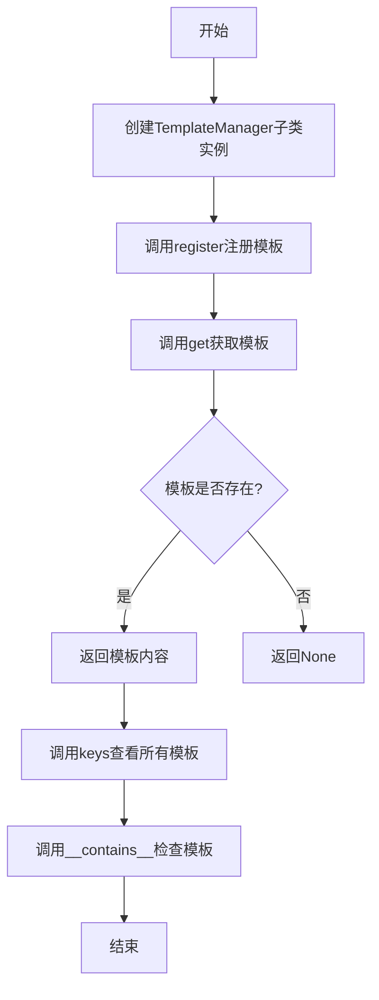
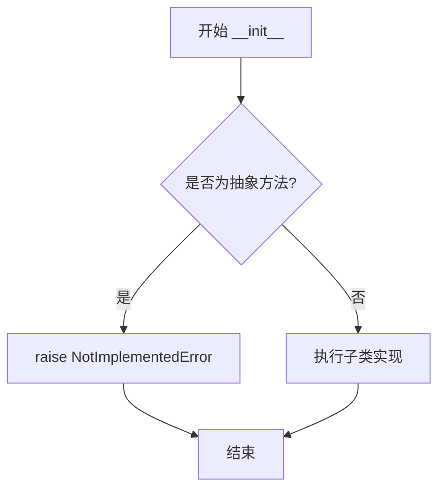
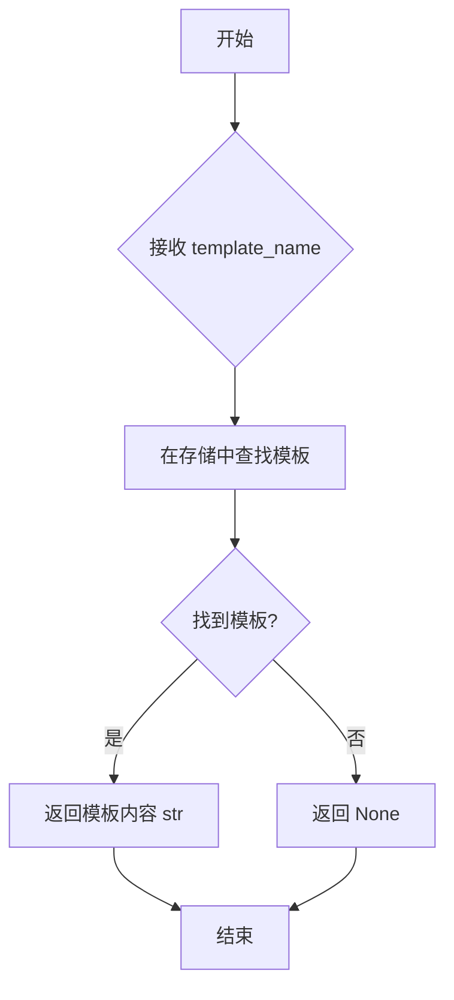
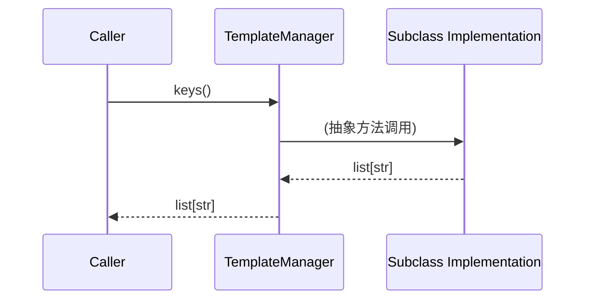
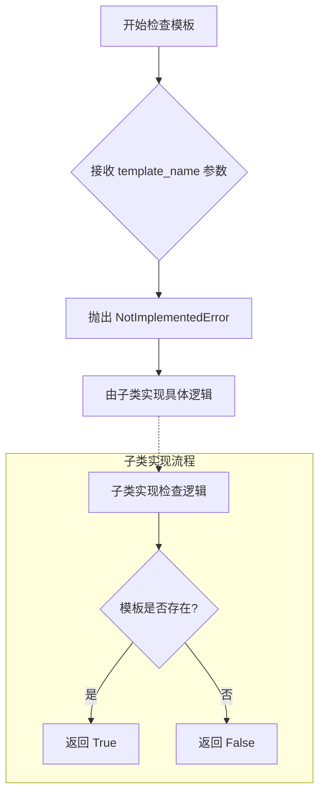
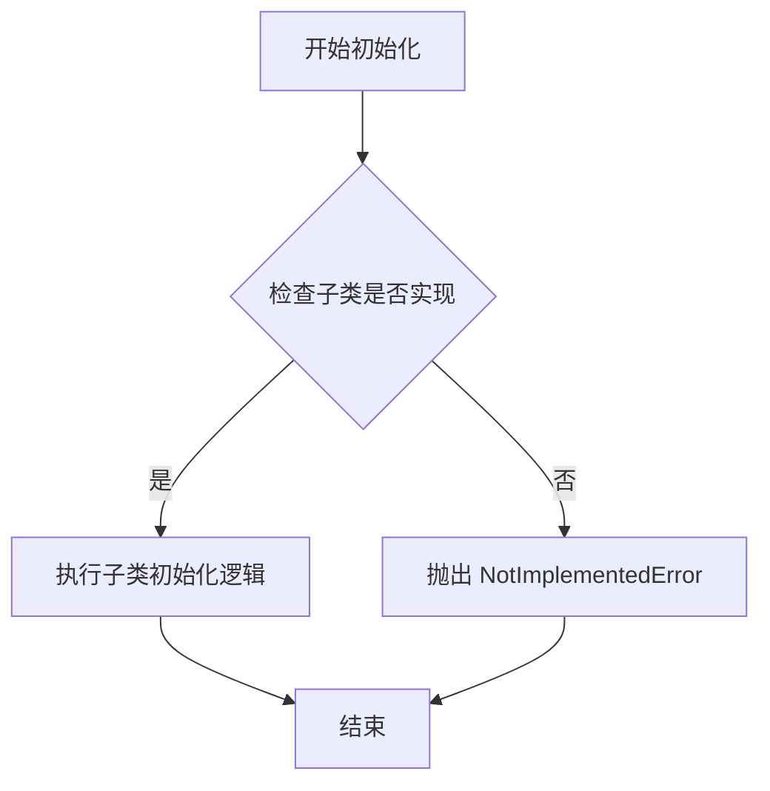
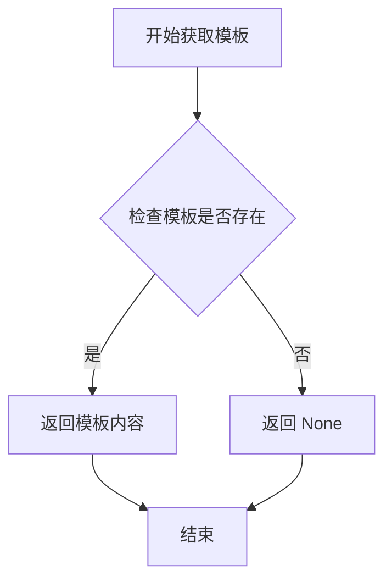
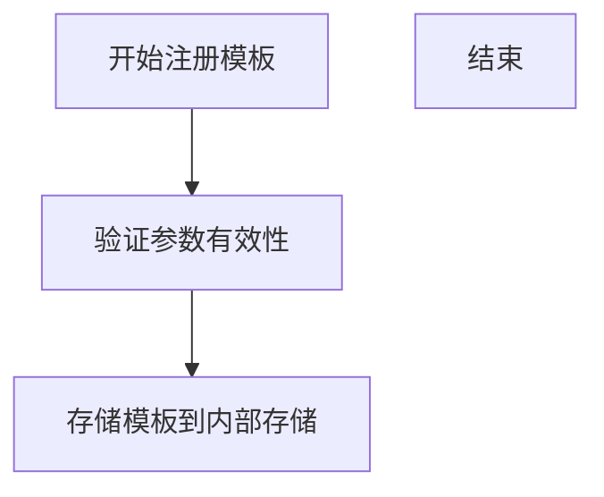
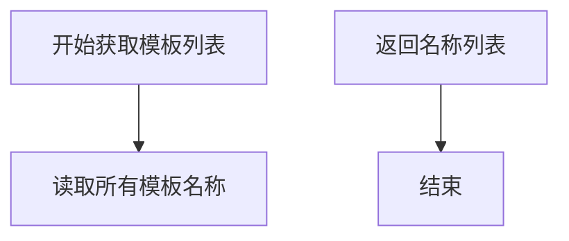
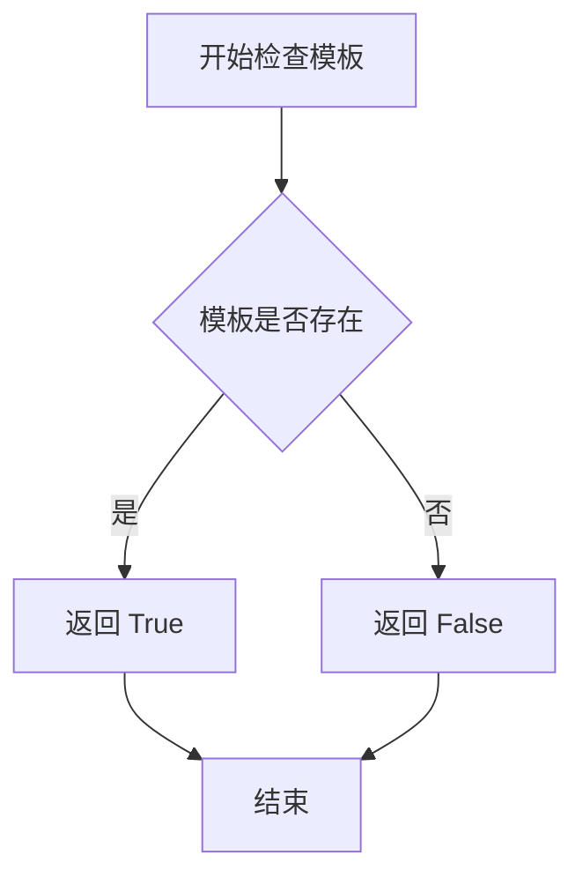

# `graphrag\packages\graphrag-llm\graphrag_llm\templating\template_manager.py` 详细设计文档

这是一个模板管理器的抽象基类，定义了模板管理器的基本接口规范，包括模板的注册、获取、列表查看和存在性检查等核心操作，具体的模板存储和检索逻辑由子类实现。

## 整体流程



## 类结构

```
TemplateManager (抽象基类)
```

## 全局变量及字段


    

## 全局函数及方法


### `TemplateManager.__init__`

Abstract method to initialize the template manager. Subclasses must implement this method to provide concrete initialization logic.

参数：

- `**kwargs`：`Any`，关键字参数，用于初始化模板管理器的配置选项

返回值：`None`，无返回值

#### 流程图



#### 带注释源码

```python
@abstractmethod
def __init__(self, **kwargs: Any) -> None:
    """Initialize the template manager."""
    raise NotImplementedError
```

**代码说明：**

- `@abstractmethod`：装饰器，标记该方法为抽象方法，必须由子类实现
- `**kwargs: Any`：使用可变关键字参数，允许子类接受任意数量的命名参数进行初始化配置
- `-> None`：显式声明返回类型为 None
- `raise NotImplementedError`：由于是抽象方法，调用时会抛出该异常，强制子类实现具体的初始化逻辑


### `TemplateManager.get`

检索指定名称的模板内容。

参数：

-  `template_name`：`str`，要检索的模板名称

返回值：`str | None`，如果找到则返回模板内容，否则返回 `None`

#### 流程图



#### 带注释源码

```python
@abstractmethod
def get(self, template_name: str) -> str | None:
    """Retrieve a template by its name.

    Args
    ----
        template_name: str
            The name of the template to retrieve.

    Returns
    -------
        str | None: The content of the template, if found.
    """
    raise NotImplementedError
```

#### 说明

- 这是一个**抽象方法**，定义在 `TemplateManager` 抽象基类中
- 使用 `@abstractmethod` 装饰器标记，要求子类必须实现此方法
- 方法签名声明返回类型为 `str | None`，表示要么返回字符串（模板内容），要么返回 `None`（未找到时）
- 当前实现直接 `raise NotImplementedError`，实际逻辑需由子类实现
- 该方法是模板管理器的核心接口之一，用于**读取**已注册的模板内容


### `TemplateManager.register`

注册一个新的模板到模板管理器中。该方法是一个抽象方法，定义了在模板管理器中注册模板的接口，子类需要实现具体的注册逻辑。

参数：

- `template_name`：`str`，模板的名称，用于唯一标识模板
- `template`：`str`，模板的内容，即模板的实际文本

返回值：`None`，无返回值

#### 流程图

```mermaid
flowchart TD
    A[开始] --> B{检查参数有效性}
    B -->|无效参数| C[抛出异常]
    B -->|有效参数| D[执行注册逻辑]
    D --> E[返回None]
    C --> E
    note: 此流程图展示抽象方法的预期行为，具体实现由子类决定
```

#### 带注释源码

```python
@abstractmethod
def register(self, template_name: str, template: str) -> None:
    """Register a new template.

    Args
    ----
        template_name: str
            The name of the template.
        template: str
            The content of the template.
    """
    raise NotImplementedError
```

#### 附加说明

| 项目 | 说明 |
|------|------|
| **所属类** | `TemplateManager` |
| **方法类型** | 抽象方法（Abstract Method） |
| **设计意图** | 定义模板注册的接口规范，子类必须实现具体的注册逻辑 |
| **约束** | 必须被子类重写，否则无法实例化 |
| **异常处理** | 抽象方法本身抛出 `NotImplementedError`，实际异常处理由子类实现 |
| **线程安全** | 未定义，取决于具体实现 |


### `TemplateManager.keys`

获取所有已注册的模板名称列表

参数： 无（仅包含隐式参数 `self`）

返回值：`list[str]`，已注册的模板名称列表

#### 流程图



#### 带注释源码

```python
@abstractmethod
def keys(self) -> list[str:
    """List all registered template names.

    Returns
    -------
        list[str]: A list of registered template names.
    """
    raise NotImplementedError
```

**说明**：这是一个抽象方法，定义了模板管理器需要实现的接口。具体实现由子类提供，用于返回当前已注册的所有模板名称。调用此方法时，实际执行的是子类中实现的具体逻辑。


### `TemplateManager.__contains__`

检查模板是否已注册的抽象方法，用于支持 `in` 操作符。

参数：

-  `template_name`：`str`，要检查的模板名称

返回值：`bool`，如果模板已注册则返回 True，否则返回 False

#### 流程图



#### 带注释源码

```python
@abstractmethod
def __contains__(self, template_name: str) -> bool:
    """Check if a template is registered.

    Args
    ----
        template_name: str
            The name of the template to check.
    """
    raise NotImplementedError
```

**注释说明：**

- `@abstractmethod`：装饰器，标识此方法为抽象方法，必须由子类实现
- `template_name: str`：参数，要检查的模板名称，类型为字符串
- `-> bool`：返回类型注解，表示返回布尔值
- `raise NotImplementedError`：抛出未实现异常，因为这是抽象方法，具体逻辑由子类实现
- 此方法支持 Python 的 `in` 操作符，例如：`if "template_name" in template_manager:`


## 关键组件


### TemplateManager

抽象基类，定义了模板管理器的接口规范，强制子类实现模板的获取、注册、列出和包含检查功能。

### __init__

抽象初始化方法，接收任意关键字参数，用于初始化模板管理器。

### get

抽象方法，根据模板名称检索模板内容，返回字符串或None。

### register

抽象方法，接受模板名称和模板内容，用于注册新模板到管理器中。

### keys

抽象方法，返回已注册模板名称的列表。

### __contains__

抽象方法，实现Python的in操作符支持，检查指定名称的模板是否已注册。

## 问题及建议


### 已知问题

-   **抽象方法实现不当**：所有抽象方法体都使用 `raise NotImplementedError`，这是反模式。抽象方法应该不提供实现（pass 或 ...），而不是抛出异常。这会导致如果子类实现有误（如忘记实现某个方法），错误信息会误导开发者。
-   **缺少抽象基类的整体文档**：类文档字符串过于简略，未说明子类的职责、预期行为和错误约定。
-   **类型注解兼容性问题**：`list[str]` 类型提示仅在 Python 3.9+ 可用，若需支持更低版本应使用 `typing.List[str]`。
-   **__contains__ 未提供默认实现**：可以通过委托给 `keys()` 提供默认实现，遵循 Python 的"开闭原则"。
-   **迭代器协议支持缺失**：未实现 `__iter__` 方法，无法直接迭代模板管理器中的模板。

### 优化建议

-   将所有抽象方法体中的 `raise NotImplementedError` 替换为 `pass`，确保真正的抽象方法语义。
-   为 `TemplateManager` 类添加详细的文档字符串，说明子类必须实现的接口契约、异常规范和使用示例。
-   考虑在 Python 3.9 以下版本运行，使用 `from typing import List` 替代内建的 `list[str]`。
-   为 `__contains__` 提供默认实现：`def __contains__(self, template_name: str) -> bool: return template_name in self.keys()`。
-   添加 `__iter__` 方法：`def __iter__(self) -> Iterator[str]: return iter(self.keys())`，并导入 `from typing import Iterator`。
-   统一文档格式：为 `register` 方法添加明确的返回值类型注解（如 `None`）。


## 其它


### 一段话描述

TemplateManager 是一个抽象基类（ABC），定义了模板管理器的标准接口，提供了模板的获取、注册、列表查看和存在性检查等核心功能，用于统一管理应用程序中的文本模板资源。

### 文件的整体运行流程

该文件定义了一个抽象基类，本身不直接执行具体业务逻辑。其运行流程如下：
1. 开发者创建 TemplateManager 的具体实现子类（如 FileTemplateManager、MemoryTemplateManager 等）
2. 子类实现继承的五个抽象方法
3. 客户端代码通过抽象基类引用具体的实现类，调用 get()、register()、keys()、__contains__() 等方法操作模板
4. 具体实现类负责模板的实际存储和检索（可以是内存、文件系统、数据库等）

### 类的详细信息

**类名**: TemplateManager
**类类型**: 抽象基类 (ABC)
**父类**: ABC
**描述**: 用于模板管理的抽象基类，定义了模板管理器必须实现的接口规范。

### 类字段

该类为抽象基类，不包含实例字段。子类可根据需要添加实现相关的字段。

### 类方法

#### 1. __init__

**名称**: __init__
**参数**: 
  - kwargs: Any - 关键字参数，用于子类初始化配置
**参数类型**: **kwargs: Any
**参数描述**: 接受任意关键字参数，用于初始化模板管理器的配置选项
**返回值类型**: None
**返回值描述**: 无返回值（仅抛出 NotImplementedError）
**mermaid 流程图**:

**带注释源码**:
```python
@abstractmethod
def __init__(self, **kwargs: Any) -> None:
    """Initialize the template manager."""
    raise NotImplementedError
```

#### 2. get

**名称**: get
**参数**:
  - template_name: str - 模板名称
**参数类型**: template_name: str
**参数描述**: 要检索的模板的唯一标识名称
**返回值类型**: str | None
**返回值描述**: 返回模板内容，如果未找到则返回 None
**mermaid 流程图**:

**带注释源码**:
```python
@abstractmethod
def get(self, template_name: str) -> str | None:
    """Retrieve a template by its name.

    Args
    ----
        template_name: str
            The name of the template to retrieve.

    Returns
    -------
        str | None: The content of the template, if found.
    """
    raise NotImplementedError
```

#### 3. register

**名称**: register
**参数**:
  - template_name: str - 模板名称
  - template: str - 模板内容
**参数类型**: template_name: str, template: str
**参数描述**: template_name 是模板的唯一标识，template 是模板的文本内容
**返回值类型**: None
**返回值描述**: 无返回值，注册操作完成后直接返回
**mermaid 流程图**:

**带注释源码**:
```python
@abstractmethod
def register(self, template_name: str, template: str) -> None:
    """Register a new template.

    Args
    ----
        template_name: str
            The name of the template.
        template: str
            The content of the template.
    """
    raise NotImplementedError
```

#### 4. keys

**名称**: keys
**参数**: 无
**参数类型**: 
**参数描述**: 
**返回值类型**: list[str]
**返回值描述**: 返回所有已注册模板名称的列表
**mermaid 流程图**:

**带注释源码**:
```python
@abstractmethod
def keys(self) -> list[str]:
    """List all registered template names.

    Returns
    -------
        list[str]: A list of registered template names.
    """
    raise NotImplementedError
```

#### 5. __contains__

**名称**: __contains__
**参数**:
  - template_name: str - 模板名称
**参数类型**: template_name: str
**参数描述**: 要检查存在性的模板名称
**返回值类型**: bool
**返回值描述**: 如果模板存在返回 True，否则返回 False
**mermaid 流程图**:

**带注释源码**:
```python
@abstractmethod
def __contains__(self, template_name: str) -> bool:
    """Check if a template is registered.

    Args
    ----
        template_name: str
            The name of the template to check.
    """
    raise NotImplementedError
```

### 全局变量

该文件不包含全局变量。

### 全局函数

该文件不包含全局函数。

### 关键组件信息

1. **TemplateManager (抽象基类)**: 核心组件，定义模板管理器的接口规范，确保所有实现类提供一致的模板操作方法。

### 潜在的技术债务或优化空间

1. **缺少默认实现**: 所有方法都抛出 NotImplementedError，没有提供任何默认实现或基础功能，子类需要完全重写所有方法。
2. **缺乏错误处理机制**: 抽象方法中没有定义具体的异常类型，子类实现时可能缺乏统一的错误处理模式。
3. **模板验证缺失**: register 方法没有对模板内容进行验证（如格式检查、变量占位符验证等）的钩子。
4. **批量操作支持不足**: 缺少批量注册、批量获取、删除模板等常用操作的方法。
5. **模板元数据支持**: 缺少对模板元数据（如创建时间、修改时间、版本号、描述等）的管理能力。
6. **并发安全未定义**: 没有定义线程安全性的要求，子类实现可能存在并发访问问题。

### 设计目标与约束

1. **设计目标**: 提供一个统一的模板管理接口，使得应用程序可以在不同存储介质（内存、文件系统、数据库等）之间切换模板提供者，而无需修改业务代码。
2. **约束条件**: 
   - 所有方法必须由子类实现
   - 模板名称（template_name）应为唯一标识符
   - 模板内容（template）为字符串类型
   - 必须继承自 ABC 以支持抽象方法检查

### 错误处理与异常设计

1. **当前实现**: 抽象方法中使用 NotImplementedError 提示子类必须实现该方法。
2. **建议改进**: 
   - 定义自定义异常类（如 TemplateNotFoundError、TemplateAlreadyExistsError、InvalidTemplateNameError 等）
   - 在方法文档中明确标注可能抛出的异常类型
   - 提供异常处理的最佳实践指导

### 数据流与状态机

1. **数据流**:
   - **输入**: 模板名称（str）和模板内容（str）通过 register 方法输入
   - **处理**: 子类实现负责将模板存储到具体的存储介质
   - **输出**: 通过 get 方法输出模板内容，通过 keys 输出模板名称列表
2. **状态机**: 该类为工具类，不涉及复杂的状态管理。子类的实现可能涉及状态（如缓存状态、文件句柄状态等），但基类未定义状态转换规则。

### 外部依赖与接口契约

1. **外部依赖**:
   - `abc`: Python 标准库，用于定义抽象基类
   - `typing`: Python 标准库，用于类型注解（Any、str、list 等）
2. **接口契约**:
   - 实现类必须实现所有五个抽象方法
   - get 方法返回 str | None 类型
   - register 方法接受两个字符串参数，无返回值
   - keys 方法返回 list[str] 类型
   - __contains__ 方法返回 bool 类型

### 继承关系与使用建议

1. **典型子类实现**:
   - MemoryTemplateManager: 基于内存字典的简单实现
   - FileTemplateManager: 基于文件系统的实现，从磁盘读取模板文件
   - DatabaseTemplateManager: 基于数据库的实现
   - CachedTemplateManager: 带缓存层的实现，可包装其他管理器
2. **使用建议**:
   - 客户端代码应依赖抽象基类而非具体实现
   - 可结合工厂模式或依赖注入创建具体的模板管理器实例

### 版本与许可证信息

- **版权**: Copyright (c) 2024 Microsoft Corporation
- **许可证**: MIT License
- **文件用途**: 作为模板管理的基础抽象层，供其他模块继承和扩展


    