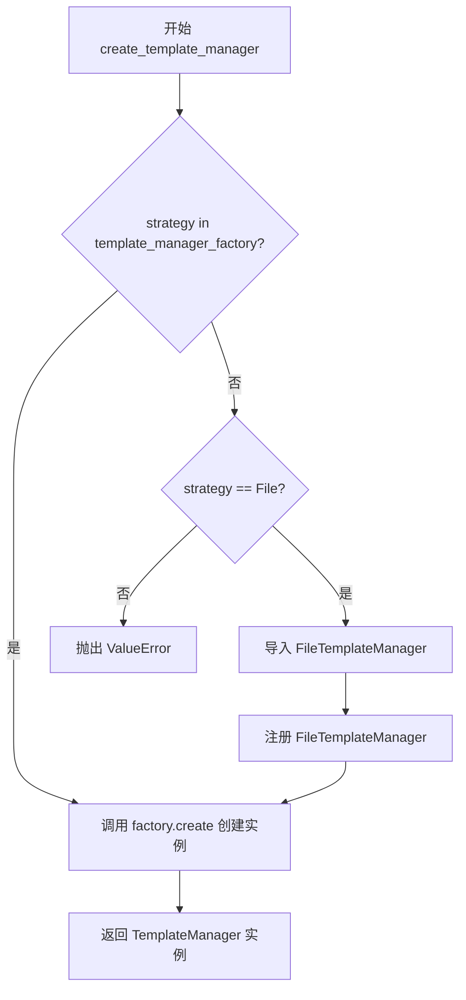
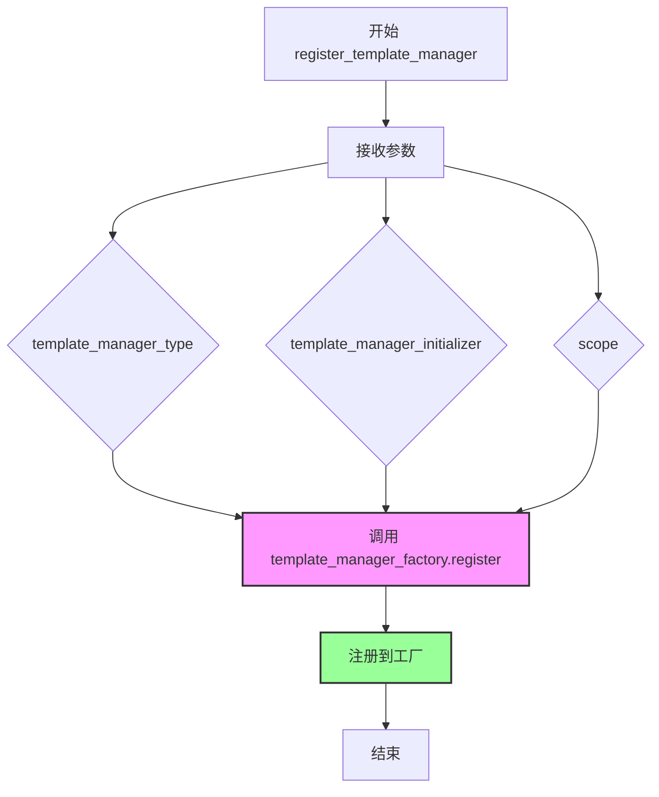
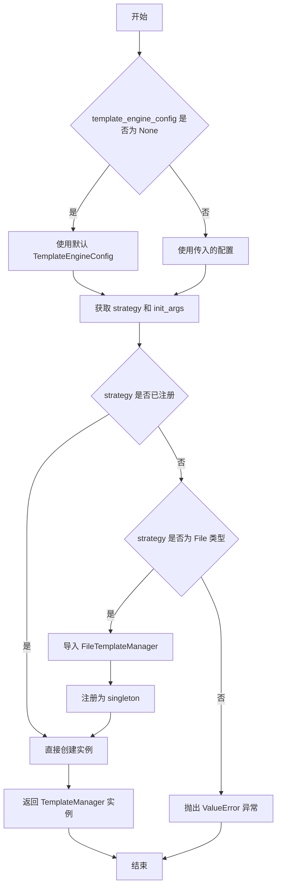
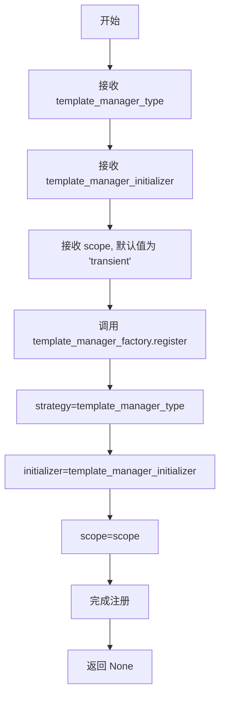
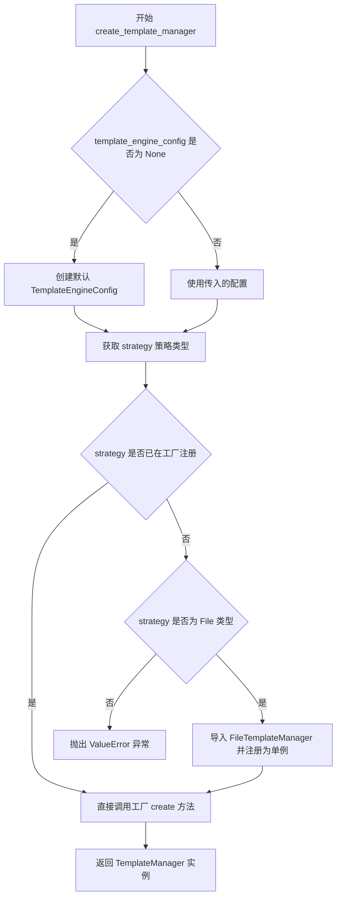
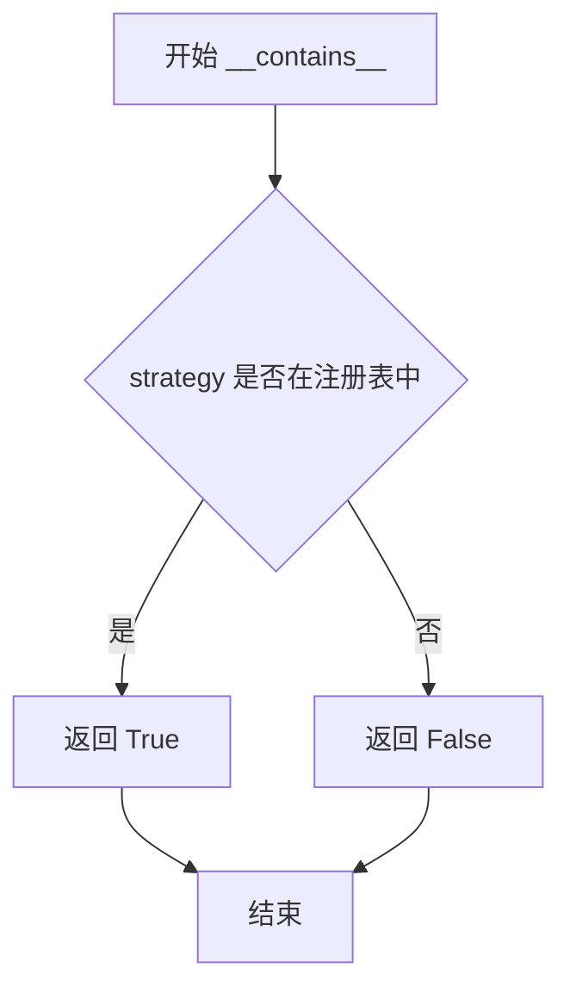
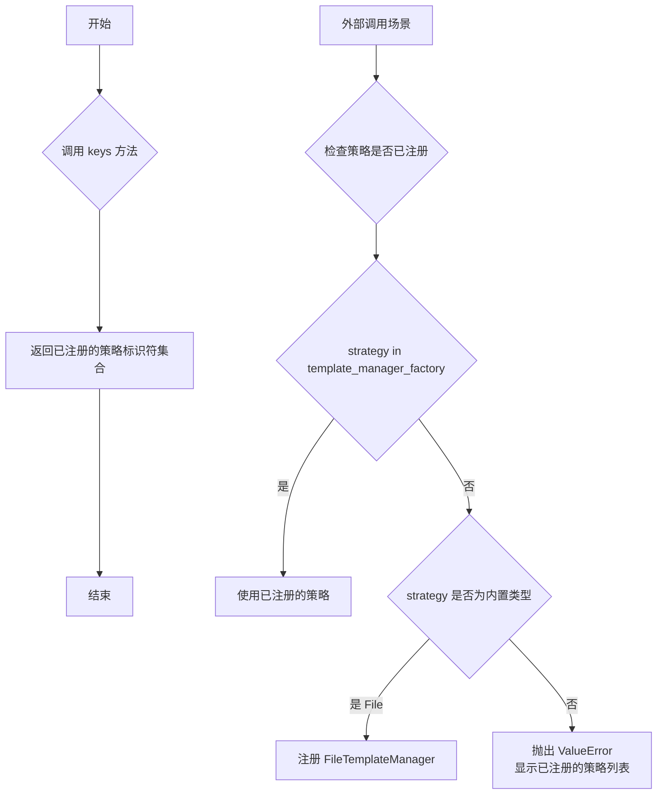

# `graphrag\packages\graphrag-llm\graphrag_llm\templating\template_manager_factory.py` 详细设计文档

该文件实现了一个模板管理器工厂（TemplateManagerFactory），用于根据配置动态创建和管理不同类型的模板管理器（TemplateManager）实例，支持注册自定义实现和按策略创建。

## 整体流程



## 类结构

```
Factory[抽象基类] (graphrag_common)
└── TemplateManagerFactory
        │
        └── TemplateManager (抽象基类)
                └── FileTemplateManager
```

## 全局变量及字段


### `template_manager_factory`
    
模板管理器工厂单例实例，用于注册和创建不同类型的模板管理器

类型：`TemplateManagerFactory`
    


### `template_engine_config`
    
模板引擎配置对象，包含模板管理器的类型和初始化参数

类型：`TemplateEngineConfig | None`
    


### `strategy`
    
模板管理器类型策略标识符，用于从工厂中获取对应的模板管理器实现

类型：`str`
    


### `init_args`
    
模板管理器初始化参数字典，由配置对象序列化而来，用于实例化模板管理器

类型：`dict`
    


    

## 全局函数及方法


### `register_template_manager`

该函数用于将自定义的模板管理器实现注册到模板管理器工厂中，以便后续可以通过 `create_template_manager` 函数根据类型创建相应的实例。

参数：

- `template_manager_type`：`str`，要注册的模板管理器的类型标识符
- `template_manager_initializer`：`Callable[..., TemplateManager]，用于初始化模板管理器的可调用对象（工厂函数或类构造器）
- `scope`：`ServiceScope`，服务作用域，默认为 `"transient"`（瞬态），可选择 `"singleton"`（单例）

返回值：`None`，该函数无返回值，仅执行注册逻辑

#### 流程图



#### 带注释源码

```python
def register_template_manager(
    template_manager_type: str,  # 模板管理器类型标识符，如 'file', 'memory' 等
    template_manager_initializer: Callable[..., TemplateManager],  # 初始化函数或类构造器
    scope: "ServiceScope" = "transient",  # 服务作用域，默认为瞬态模式
) -> None:
    """Register a custom template manager implementation.
    
    该函数为模板管理器工厂提供自定义实现注册能力，允许扩展默认的模板管理行为。
    注册后可通过 create_template_manager 函数使用已注册的实现。

    Args
    ----
        - template_manager_type: str
            The template manager id to register.
        - template_manager_initializer: Callable[..., TemplateManager]
            The template manager initializer to register.
    """
    # 调用工厂实例的 register 方法完成注册
    # 参数 strategy 对应 template_manager_type
    # 参数 initializer 对应 template_manager_initializer
    # 参数 scope 对应服务生命周期管理
    template_manager_factory.register(
        strategy=template_manager_type,
        initializer=template_manager_initializer,
        scope=scope,
    )
```


### `create_template_manager`

该函数是模板管理器工厂的核心创建方法，负责根据配置创建相应的 TemplateManager 实例，支持动态注册和按需加载不同的模板管理器实现。

参数：

- `template_engine_config`：`TemplateEngineConfig | None`，模板引擎配置对象，如果为 None 则使用默认配置

返回值：`TemplateManager`，返回模板管理器实例

#### 流程图



#### 带注释源码

```python
def create_template_manager(
    template_engine_config: TemplateEngineConfig | None = None,
) -> TemplateManager:
    """Create a TemplateManager instance.

    Args
    ----
        template_engine_config: TemplateEngineConfig
            The configuration for the template engine.

    Returns
    -------
        TemplateManager:
            An instance of a TemplateManager subclass.
    """
    # 如果未提供配置，则使用默认配置
    template_engine_config = template_engine_config or TemplateEngineConfig()
    
    # 从配置中获取模板管理器类型策略
    strategy = template_engine_config.template_manager
    
    # 将配置模型导出为字典，作为初始化参数
    init_args = template_engine_config.model_dump()

    # 检查该策略是否已在工厂中注册
    if strategy not in template_manager_factory:
        # 根据策略类型进行动态注册
        match strategy:
            case TemplateManagerType.File:
                # 延迟导入，避免循环依赖
                from graphrag_llm.templating.file_template_manager import (
                    FileTemplateManager,
                )

                # 注册 FileTemplateManager 为单例模式
                template_manager_factory.register(
                    strategy=TemplateManagerType.File,
                    initializer=FileTemplateManager,
                    scope="singleton",
                )
            case _:
                # 未知的策略类型，抛出详细错误信息
                msg = f"TemplateEngineConfig.template_manager '{strategy}' is not registered in the TemplateManagerFactory. Registered strategies: {', '.join(template_manager_factory.keys())}"
                raise ValueError(msg)

    # 使用工厂模式创建模板管理器实例
    return template_manager_factory.create(strategy=strategy, init_args=init_args)
```


### `register_template_manager`

该函数用于注册自定义的模板管理器实现，允许在模板管理器工厂中动态添加新的模板管理器类型。

参数：

- `template_manager_type`：`str`，要注册的模板管理器的唯一标识符
- `template_manager_initializer`：`Callable[..., TemplateManager]`，用于创建模板管理器实例的可调用对象（初始化器）
- `scope`：`ServiceScope`，服务生命周期范围，默认为 "transient"（瞬态）

返回值：`None`，无返回值

#### 流程图



#### 带注释源码

```python
def register_template_manager(
    template_manager_type: str,
    template_manager_initializer: Callable[..., TemplateManager],
    scope: "ServiceScope" = "transient",
) -> None:
    """Register a custom template manager implementation.

    Args
    ----
        - template_manager_type: str
            The template manager id to register.
        - template_manager_initializer: Callable[..., TemplateManager]
            The template manager initializer to register.
    """
    # 调用模板管理器工厂的 register 方法进行注册
    # 将传入的模板管理器类型、初始化器和作用域传递给工厂的注册方法
    template_manager_factory.register(
        strategy=template_manager_type,
        initializer=template_manager_initializer,
        scope=scope,
    )
```


### `create_template_manager`

该函数是模板管理器工厂的核心创建方法，根据传入的 `TemplateEngineConfig` 配置动态创建并返回对应的 `TemplateManager` 实例。如果指定的模板管理器类型尚未注册，则自动注册默认实现；若类型未定义且无对应注册器，则抛出 `ValueError` 异常。

#### 参数

- `template_engine_config`：`TemplateEngineConfig | None`，模板引擎配置对象，默认为 `None`，此时使用默认配置的 `TemplateEngineConfig()`

#### 返回值：`TemplateManager`，返回模板管理器实例

#### 流程图



#### 带注释源码

```python
def create_template_manager(
    template_engine_config: TemplateEngineConfig | None = None,
) -> TemplateManager:
    """Create a TemplateManager instance.

    Args
    ----
        template_engine_config: TemplateEngineConfig
            The configuration for the template engine.

    Returns
    -------
        TemplateManager:
            An instance of a TemplateManager subclass.
    """
    # 如果未提供配置，使用默认配置（懒加载配置默认值）
    template_engine_config = template_engine_config or TemplateEngineConfig()
    
    # 从配置中获取模板管理器类型策略
    strategy = template_engine_config.template_manager
    
    # 将配置对象序列化为字典，作为初始化参数
    init_args = template_engine_config.model_dump()

    # 检查该策略是否已在工厂注册
    if strategy not in template_manager_factory:
        # 策略未注册，尝试匹配已知类型并自动注册
        match strategy:
            case TemplateManagerType.File:
                # 延迟导入避免循环依赖，按需加载文件模板管理器
                from graphrag_llm.templating.file_template_manager import (
                    FileTemplateManager,
                )
                # 将文件模板管理器注册为单例（全局共享实例）
                template_manager_factory.register(
                    strategy=TemplateManagerType.File,
                    initializer=FileTemplateManager,
                    scope="singleton",
                )
            case _:
                # 未知策略类型，抛出明确错误信息
                msg = f"TemplateEngineConfig.template_manager '{strategy}' is not registered in the TemplateManagerFactory. Registered strategies: {', '.join(template_manager_factory.keys())}"
                raise ValueError(msg)

    # 调用工厂基类的 create 方法创建实例
    return template_manager_factory.create(strategy=strategy, init_args=init_args)
```


### `TemplateManagerFactory.__contains__`

检查指定的模板管理器类型是否已在工厂中注册。

参数：

- `strategy`：`str`，要检查的模板管理器类型标识符

返回值：`bool`，如果指定的策略已在工厂中注册则返回 `True`，否则返回 `False`

#### 流程图



#### 带注释源码

```
# 由于 __contains__ 方法继承自父类 Factory，在当前代码文件中未直接定义
# 该方法通过 'in' 操作符调用，用于检查策略是否已注册

# 使用示例（来自 create_template_manager 函数）:
# if strategy not in template_manager_factory:
#     ...

# 推断的父类方法签名（来自 Factory 基类）:
# def __contains__(self, strategy: str) -> bool:
#     """Check if a strategy is registered in the factory."""
#     return strategy in self._strategies
```


### `TemplateManagerFactory.keys`

获取已注册的所有模板管理器策略键（标识符）列表。

参数：此方法无参数

返回值：`Collection[str]`，返回已注册的模板管理器类型标识符集合，用于检查或列出所有可用的模板管理器实现。

#### 流程图



#### 带注释源码

```
def keys(self) -> Collection[str]:
    """获取所有已注册的策略键。
    
    此方法继承自 Factory 基类，返回当前已注册的所有模板管理器
    类型标识符。在代码中用于：
    1. 检查某个策略是否已注册（通过 in 操作符间接使用）
    2. 当策略未注册时，提供已注册策略的列表供调试参考
    
    Returns
    -------
    Collection[str]:
        已注册的策略标识符集合，例如 ['file', 'memory', ...]
    """
    # 具体实现继承自 Factory 基类
    # 通常返回类似 dict.keys() 的视图对象
    # 可迭代，支持 len() 操作
```

## 关键组件


### TemplateManagerFactory

工厂类，继承自通用Factory基类，负责创建TemplateManager实例的工厂模式实现。

### template_manager_factory

全局工厂实例，用于注册和创建模板管理器的单例对象。

### register_template_manager

全局注册函数，允许用户注册自定义的模板管理器实现，支持自定义策略名称、初始化函数和服务作用域。

### create_template_manager

核心创建函数，根据配置动态创建TemplateManager实例，支持按需自动注册FileTemplateManager，并处理未注册策略的异常。

### TemplateEngineConfig

配置类，定义模板引擎的配置结构，包含模板管理器类型等参数。

### TemplateManagerType

枚举类型，定义模板管理器的类型，当前支持File类型。

### FileTemplateManager

文件模板管理器实现，在策略未注册时自动注册为单例模式的模板管理器。

### Factory 抽象基类

通用工厂基类，提供策略注册、实例创建、作用域管理的核心工厂模式基础设施。


## 问题及建议


### 已知问题

-   **循环导入风险**：在`create_template_manager`函数内部动态导入`FileTemplateManager`，这种做法虽然解决了导入顺序问题，但可能导致潜在的循环导入风险，且不易于维护
-   **Scope 不一致**：在 `create_template_manager` 中注册 `FileTemplateManager` 时使用 `"singleton"` scope，而 `register_template_manager` 函数的默认 scope 是 `"transient"`，这种不一致可能导致意外的单例行为
-   **魔法字符串与类型混合**：使用 `TemplateManagerType.File` 枚举与字符串 `"singleton"` 进行比较和注册，但工厂内部使用字符串作为 strategy key，存在类型不一致的潜在问题
-   **重复注册逻辑**：在 `create_template_manager` 中手动注册 `FileTemplateManager`，如果其他地方也调用 `register_template_manager`，可能导致重复注册或覆盖
-   **配置序列化风险**：`template_engine_config.model_dump()` 将配置转为字典，可能无法正确处理所有配置对象，尤其是包含复杂嵌套或自定义类型的配置
-   **类型提示不够精确**：`template_manager_initializer: Callable[..., TemplateManager]` 使用 `...` 不够具体，应明确参数类型

### 优化建议

-   将动态导入移至文件顶部或使用延迟导入模式，避免函数内部导入
-   统一 scope 策略，在文档中明确说明不同 manager 类型的生命周期
-   考虑使用枚举或常量替代字符串字面量，提高类型安全性
-   在 `TemplateManagerFactory` 中添加已注册类型的预检查机制，避免运行时动态注册
-   添加注册前的类型检查和验证逻辑，确保 `template_manager_initializer` 可调用
-   考虑使用 Pydantic v2 的 `model_dump(mode='python')` 或显式指定序列化方式，确保配置正确序列化

## 其它


### 设计目标与约束

该模块采用工厂模式实现解耦，支持通过配置动态创建不同类型的 TemplateManager 实例。核心约束包括：依赖 graphrag_common 包中的 Factory 基类；TemplateManagerType.File 是内置支持的标准实现；自定义模板管理器需实现 TemplateManager 接口；scope 参数支持 "singleton" 和 "transient" 两种生命周期管理策略。

### 错误处理与异常设计

当传入的 strategy 不存在于工厂注册表中时，代码会检查是否为 TemplateManagerType.File 若是则自动注册 FileTemplateManager；若仍不在注册表中则抛出 ValueError 并列出所有已注册的策略 key。register_template_manager 函数本身不进行参数校验，假设调用者传入合法参数。

### 外部依赖与接口契约

依赖项包括：graphrag_common.factory.Factory（工厂基类，提供 register 和 create 方法）、graphrag_llm.config.TemplateEngineConfig（配置类，包含 template_manager 字段）、graphrag_llm.config.types.TemplateManagerType（枚举类型，定义支持的模板管理器类型）、graphrag_llm.templating.TemplateManager（抽象基类，定义模板管理器接口）、graphrag_llm.templating.FileTemplateManager（文件模板管理器实现）。Factory 接口需支持 register(strategy, initializer, scope)、create(strategy, init_args)、__contains__(strategy)、keys() 方法。

### 数据流与状态机

数据流路径：首先加载或创建 TemplateEngineConfig，若未提供则使用默认配置；提取 config.template_manager 作为 strategy；将 config 序列化为 dict 作为 init_args；检查 strategy 是否已注册；如未注册且为 File 类型则自动注册；最后调用 factory.create 创建实例。工厂内部维护 strategy 到 initializer 的映射关系。

### 配置管理

TemplateEngineConfig 包含 template_manager 字段用于指定策略类型，其他配置字段通过 model_dump() 序列化为字典传递给初始化器。支持运行时动态注册新策略，但已创建的实例不受影响。

### 线程安全性

未在代码中显式实现线程安全机制。Factory 基类通常非线程安全，在多线程环境下需外部加锁或使用线程局部存储。

### 性能考量

每次调用 create_template_manager 都会执行 strategy not in template_manager_factory 检查和 model_dump() 序列化操作。对于高频调用场景可考虑缓存策略。

### 使用示例与调用流程

典型调用链：业务层创建/获取 TemplateEngineConfig → 调用 create_template_manager(config) → 工厂查找/注册策略 → 创建实例返回。注册自定义管理器：调用 register_template_manager("custom_type", CustomTemplateManagerInitializer, scope)。

### 版本兼容性说明

该代码使用 Python 3.10+ 的 | 联合类型语法和 match-case 语法。依赖的 TYPE_CHECKING 条件导入确保运行时仅加载必要模块。


    