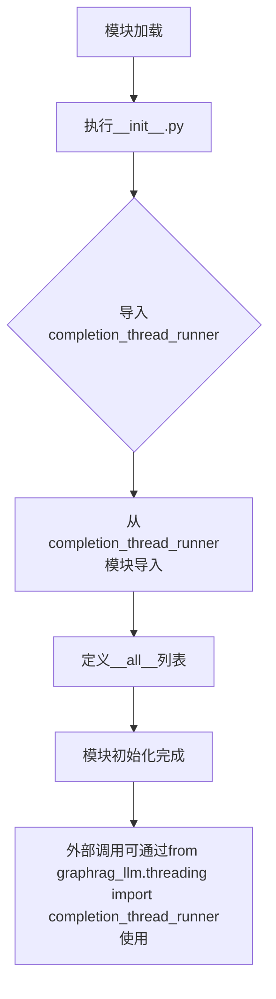

# `graphrag\packages\graphrag-llm\graphrag_llm\threading\__init__.py` 详细设计文档

这是graphrag_llm项目的线程模块入口文件，作为threading子模块的初始化文件，通过导入completion_thread_runner函数并将其添加到__all__列表中，为上层调用者提供统一的导出接口。该模块的主要作用是封装底层线程运行器的实现细节，使得外部调用可以更方便地从graphrag_llm.threading模块导入所需功能。

## 整体流程



## 类结构

```
graphrag_llm.threading (包)
└── __init__.py (模块入口)
    └── completion_thread_runner (从completion_thread_runner模块导入)
```

## 全局变量及字段


    

## 全局函数及方法


# 分析结果

我需要指出一个问题：您提供的代码只是一个**导入模块文件**，并不包含 `completion_thread_runner` 函数的实际实现代码。

该文件的内容是：

```python
# Copyright (c) 2024 Microsoft Corporation.
# Licensed under the MIT License

"""Threading module."""

from graphrag_llm.threading.completion_thread_runner import completion_thread_runner

__all__ = [
    "completion_thread_runner",
]
```

这段代码只是从 `graphrag_llm.threading.completion_thread_runner` 模块导入 `completion_thread_runner` 函数，但**该函数的实际源代码并未在此文件中**。

---

## 我能提供的信息

根据导入语句，我可以推断以下信息：

### `completion_thread_runner`

**描述**

这是一个线程运行器函数，可能用于在独立线程中执行某个 completion 任务（可能与 LLM 调用相关）。

**模块位置**

- 所属模块：`graphrag_llm.threading.completion_thread_runner`
- 被导入位置：`graphrag_llm.threading` 包

---

## 需要的补充信息

为了生成完整的文档（包括参数、返回值、流程图和带注释源码），请您提供：

1. **完整的函数实现代码** - 即 `graphrag_llm/threading/completion_thread_runner.py` 文件的实际内容
2. **相关的类型定义**（如果有）
3. **调用方代码**（如果有，用于理解上下文）

---

如果您能提供 `completion_thread_runner` 函数的完整源代码，我将能够生成符合您要求格式的详细设计文档，包括：

- ✅ 完整的参数信息（名称、类型、描述）
- ✅ 返回值信息（类型、描述）
- ✅ Mermaid 流程图
- ✅ 带注释的源代码
- ✅ 潜在的技术债务和优化建议

## 关键组件


### 核心功能概述

该模块是graphrag_llm线程处理模块的入口文件，通过导入并导出`completion_thread_runner`来提供Completion任务的线程化执行能力。

### 文件运行流程

该文件作为线程模块的公共接口，首先定义模块文档字符串声明其用途，然后从同包下的`completion_thread_runner`模块导入同名的运行器函数或类，最后通过`__all__`列表显式声明导出接口供外部使用。

### 全局函数

#### completion_thread_runner
- **名称**: completion_thread_runner
- **类型**: 函数或类（需查看源码）
- **描述**: 从graphrag_llm.threading.completion_thread_runner模块导入的线程运行器，用于在独立线程中执行LLM Completion任务

#### __all__
- **名称**: __all__
- **类型**: list
- **描述**: 模块公开接口列表，定义允许外部导入的符号

### 关键组件信息

#### Threading Module (线程模块)
提供基于线程的异步Completion执行能力，将耗时的LLM completion操作分流到独立线程，避免阻塞主流程。

#### completion_thread_runner (Completion线程运行器)
从子模块导入的核心组件，负责创建和管理Completion任务的执行线程，处理线程生命周期和结果回调。

### 潜在技术债务与优化空间

1. **模块粒度较粗**: 当前仅暴露单一接口，若需支持多种线程模式（如线程池、进程池）需重构
2. **缺乏错误处理层**: 作为入口文件未包含异常捕获逻辑
3. **依赖隐蔽**: 真实依赖的completion_thread_runner实现对调用方不可见

### 其它项目

- **设计目标**: 提供线程化的Completion执行能力，实现非阻塞的LLM调用
- **约束**: 依赖graphrag_llm.threading.completion_thread_runner模块的存在
- **接口契约**: 外部通过from graphrag_llm.threading import completion_thread_runner使用


## 问题及建议


### 已知问题

-   **模块职责不明确**：该 threading 模块仅作为一个简单的重导出封装器，直接导入并导出 `completion_thread_runner`，这种模式增加了不必要的间接层，可能导致维护成本
-   **缺乏模块级文档**：虽然有模块 docstring "Threading module."，但过于简洁，未说明该模块的具体用途和设计意图
-   **无错误处理机制**：如果 `completion_thread_runner` 导入失败（如依赖缺失），模块会直接抛出 ImportError，缺乏友好的错误提示
-   **缺少类型注解**：在 `__all__` 声明中未使用类型注解，调用方无法获得静态类型检查支持
-   **导出函数无文档说明**：被导出的 `completion_thread_runner` 没有任何注释或文档说明其功能、参数和返回值

### 优化建议

-   **考虑直接依赖**：如果 `completion_thread_runner` 是该模块的唯一导出内容，建议使用方直接导入 `from graphrag_llm.threading.completion_thread_runner import completion_thread_runner`，消除不必要的封装层
-   **增强文档**：为模块添加详细的文档说明，包括该模块的职责、核心功能、以及 `completion_thread_runner` 的简要说明
-   **添加错误处理**：考虑添加try-except块，提供更友好的错误信息或回退机制
-   **添加类型注解**：在 Python 3.9+ 可以添加类型注解，或使用 typing 模块进行类型声明
-   **添加子模块索引**：如果该模块未来会扩展，建议添加 `__init__.py` 的模块级文档说明导出的内容和用途


## 其它


### 设计目标与约束

本模块旨在提供线程化的任务执行能力，支持异步完成回调的线程管理。设计约束包括：1) 必须继承MIT开源许可；2) 需要与graphrag_llm项目其他模块保持一致的代码风格；3) 应支持Python 3.8+版本；4) 线程池管理需考虑资源限制和超时控制。

### 错误处理与异常设计

模块级错误处理策略：导入时验证依赖模块可用性；运行时错误通过completion_thread_runner函数返回特定错误码或抛出自定义异常（如ThreadExecutionError）；线程内未捕获异常应记录至日志并触发回调通知。建议定义异常类：ThreadPoolExhaustedError（线程池耗尽）、TaskTimeoutError（任务超时）、CallbackExecutionError（回调执行失败）。

### 数据流与状态机

线程任务状态流转：PENDING（等待执行）→ RUNNING（执行中）→ COMPLETED（成功完成）/ FAILED（执行失败）/ CANCELLED（已取消）。completion_thread_runner负责维护任务状态机，状态变更需记录时间戳和上下文信息。数据流向：主线程提交任务 → 线程池分配worker → 执行任务 → 触发completion_callback → 返回结果给主线程。

### 外部依赖与接口契约

核心依赖：graphrag_llm.threading.completion_thread_runner模块。接口契约：completion_thread_runner必须接受task（可调用对象）、callback（完成回调，可选）、timeout（超时时间，可选）参数；返回值包含status（状态枚举）、result（执行结果）、error（错误信息，可选）。第三方库依赖需在requirements.txt中明确声明版本约束。

### 性能考虑

线程池大小应根据CPU核心数和IO密集型任务特性动态配置；建议默认线程数=CPU核心数*2；任务队列应设置最大长度防止内存溢出；长时间运行任务需实现心跳检测机制；completion_callback应支持异步非阻塞模式避免阻塞worker线程。

### 安全考虑

输入验证：task参数必须可调用，callback参数必须为可调用对象或None；资源限制：单个任务执行时间和线程总数应有上限配置；敏感信息：线程本地存储中不应保存敏感数据；拒绝服务防护：防止恶意高频任务提交导致线程池耗尽。

### 测试策略

单元测试：覆盖completion_thread_runner的各种输入场景（正常执行、超时、异常）；集成测试：验证线程池与callback的交互正确性；性能测试：模拟高并发场景评估线程池吞吐量和响应延迟；压力测试：验证极端情况下的资源清理和错误恢复能力。

### 配置管理

建议配置文件（config.yaml）支持以下参数：thread_pool_size（线程池大小，默认CPU核心数*2）、default_timeout（默认超时时间，单位秒）、max_queue_size（任务队列最大长度）、enable_metrics（是否启用性能指标收集）、log_level（日志级别）。配置应支持环境变量覆盖和环境特定配置文件。

    