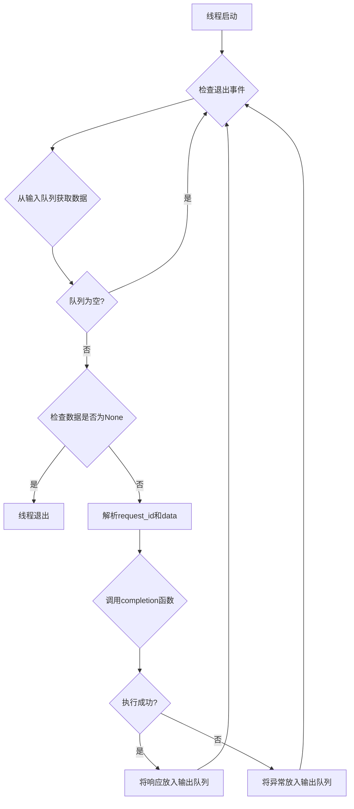

# `graphrag\packages\graphrag-llm\graphrag_llm\threading\completion_thread.py` 详细设计文档

这是一个LLM完成请求处理线程模块，通过线程方式从输入队列获取LLM完成请求，调用指定的completion函数处理请求，并将响应或异常结果放入输出队列，用于实现异步非阻塞的LLM调用机制。

## 整体流程



## 类结构

```
threading.Thread (Python内置基类)
└── CompletionThread (LLM完成请求处理线程)
```

## 全局变量及字段


### `LLMCompletionRequestQueue`
    
LLM完成请求队列类型定义，用于跟踪待处理的完成请求

类型：`Queue[tuple[str, LLMCompletionArgs] | None]`
    


### `LLMCompletionResponseQueue`
    
LLM完成响应队列类型定义，用于跟踪完成请求的响应

类型：`Queue[tuple[str, LLMCompletionResponse | Iterator[LLMCompletionChunk] | Exception] | None]`
    


### `CompletionThread._quit_process_event`
    
退出进程事件，用于控制线程终止

类型：`threading.Event`
    


### `CompletionThread._input_queue`
    
输入队列，存储待处理的LLM完成请求

类型：`LLMCompletionRequestQueue`
    


### `CompletionThread._output_queue`
    
输出队列，存储LLM完成响应或异常

类型：`LLMCompletionResponseQueue`
    


### `CompletionThread._completion`
    
LLM完成函数，用于实际执行完成请求

类型：`LLMCompletionFunction`
    
    

## 全局函数及方法


### `CompletionThread.__init__`

初始化方法，用于设置线程的参数和队列，将传入的事件对象、输入输出队列以及完成函数绑定到线程实例的属性上，以便在线程运行时使用。

参数：

- `quit_process_event`：`threading.Event`，用于通知线程退出的事件对象，当设置时线程将停止处理
- `input_queue`：`LLMCompletionRequestQueue`，输入队列，包含待处理的LLM完成请求，队列元素为请求ID和参数的元组，或None表示终止信号
- `output_queue`：`LLMCompletionResponseQueue`，输出队列，用于存放LLM完成请求的响应，队列元素为请求ID和响应/异常的元组，或None表示终止信号
- `completion`：`LLMCompletionFunction`，LLM完成函数，用于实际执行LLM调用，接收参数字典并返回完成响应或异常

返回值：`None`，无返回值（`__init__`方法）

#### 流程图

```mermaid
flowchart TD
    A[开始 __init__] --> B[调用 super().__init__ 初始化线程基类]
    B --> C[设置 self._quit_process_event = quit_process_event]
    C --> D[设置 self._input_queue = input_queue]
    D --> E[设置 self._output_queue = output_queue]
    E --> F[设置 self._completion = completion]
    F --> G[结束初始化]
```

#### 带注释源码

```python
def __init__(
    self,
    *,
    quit_process_event: threading.Event,
    input_queue: LLMCompletionRequestQueue,
    output_queue: LLMCompletionResponseQueue,
    completion: "LLMCompletionFunction",
) -> None:
    """初始化完成线程。
    
    参数:
        quit_process_event: 线程退出信号事件，用于优雅停止线程
        input_queue: LLM完成请求输入队列
        output_queue: LLM完成响应输出队列
        completion: LLM完成函数，用于执行实际的模型调用
    """
    # 调用父类threading.Thread的初始化方法，将当前实例配置为一个新线程
    super().__init__()
    
    # 保存退出事件对象，用于在线程运行时检查是否需要退出
    self._quit_process_event = quit_process_event
    
    # 保存输入队列引用，线程将从该队列获取待处理的完成请求
    self._input_queue = input_queue
    
    # 保存输出队列引用，线程将把处理结果放入该队列返回给调用者
    self._output_queue = output_queue
    
    # 保存LLM完成函数引用，线程将使用此函数执行实际的模型调用
    self._completion = completion
```


### CompletionThread.run

该方法是`CompletionThread`类的主线程方法，负责从输入队列获取LLM完成请求，调用completion函数处理，并将响应或异常放入输出队列。

参数：无（仅使用实例属性 `self`）

返回值：`None`，无返回值（线程方法）

#### 流程图

```mermaid
flowchart TD
    A[开始 run 方法] --> B{_quit_process_event.is_set?}
    B -->|是| Z[结束线程]
    B -->|否| C[从输入队列获取数据 timeout=1]
    C --> D{捕获 Empty 异常?}
    D -->|是| B
    D -->|否| E{input_data is None?}
    E -->|是| Z
    E -->|否| F[解包 request_id, data]
    F --> G[调用 self._completion(**data)]
    G --> H{捕获异常?}
    H -->|是| I[将异常放入输出队列]
    H -->|否| J[将响应放入输出队列]
    I --> B
    J --> B
```

#### 带注释源码

```python
def run(self):
    """Run the completion thread."""
    # 持续循环直到quit_process_event被设置
    while True and not self._quit_process_event.is_set():
        try:
            # 从输入队列获取请求，超时1秒
            # 如果队列为空，抛出Empty异常
            input_data = self._input_queue.get(timeout=1)
        except Empty:
            # 捕获队列为空异常，继续等待新请求
            continue
        # 如果收到None，表示收到终止信号
        if input_data is None:
            break
        # 解析请求ID和请求数据
        request_id, data = input_data
        try:
            # 调用completion函数执行LLM请求
            response = self._completion(**data)

            # 将成功响应放入输出队列
            self._output_queue.put((request_id, response))
        except Exception as e:  # noqa: BLE001
            # 将异常放入输出队列供上层处理
            self._output_queue.put((request_id, e))
```

## 关键组件


### LLMCompletionRequestQueue

输入队列，用于跟踪发送到完成端点的请求。队列中的每个元素是一个元组，包含请求ID和完成参数字典，None值表示线程应终止。

### LLMCompletionResponseQueue

输出队列，用于跟踪完成请求的响应。队列中的每个元素是一个元组，包含请求ID和相应的响应（完整响应、流式块或异常），None值表示线程应终止。

### CompletionThread

处理LLM完成的线程类。继承自threading.Thread，从输入队列获取完成请求，调用completion函数处理请求，并将响应或异常放入输出队列。


## 问题及建议


### 已知问题

-   **冗余的循环条件**：`while True and not self._quit_process_event.is_set()` 中的 `True` 是多余的，增加了代码理解的复杂度。
-   **异常捕获过于宽泛**：使用 `except Exception as e` 捕获所有异常是不良实践，应该捕获更具体的异常类型，以便进行针对性的错误处理。
-   **缺乏输入验证**：直接从队列获取的 `data` 字典直接解包传递给 `_completion` 函数，没有验证必需参数或数据类型，可能导致运行时错误。
-   **无优先级区分**：所有请求同等处理，没有考虑请求的优先级或超时要求。
-   **线程名称未设置**：线程没有设置有意义的名称，不利于调试和监控。
-   **轮询效率低下**：使用 `get(timeout=1)` 即使在空闲时也会持续轮询，消耗 CPU 资源。

### 优化建议

-   移除 `while` 条件中的 `True`，简化为 `while not self._quit_process_event.is_set()`。
-   将通用异常捕获改为捕获更具体的异常类型（如 `TimeoutError`、`ConnectionError` 等），并根据异常类型采取不同的处理策略。
-   在处理请求前添加输入验证逻辑，检查 `data` 字典中是否包含必要的参数。
-   为线程设置有意义的名称，如 `self.name = "CompletionThread-{id}"`。
-   考虑使用 `self._input_queue.get()` 无超时阻塞等待，或使用更大的超时时间以减少轮询开销。
-   考虑实现优先级队列或超时机制，以处理不同紧急程度的请求。
-   添加适当的日志记录，记录请求开始、完成和失败的情况，便于问题排查和性能监控。

## 其它


### 设计目标与约束

本模块的设计目标是为LLM（大型语言模型）完成请求提供异步处理能力，采用生产者-消费者模式解耦请求发送与响应处理。主要设计约束包括：1) 线程生命周期由外部事件控制，支持优雅关闭；2) 使用队列进行异步通信，避免阻塞调用；3) 单个请求的异常不影响其他请求处理；4) 支持流式响应（Iterator）和完整响应两种模式。

### 错误处理与异常设计

本模块采用"捕获-传递"异常设计策略。所有在`run`方法中调用的`self._completion(**data)`产生的异常均被捕获，并作为异常对象存储在输出队列中，格式为`(request_id, exception)`。调用方负责从输出队列中识别并处理异常。设计要点：1) 使用裸`except Exception`捕获所有异常，确保线程不会因未知异常而终止；2) 异常信息通过队列传递，不在当前线程中直接抛出；3) 使用`# noqa: BLE001`标记故意使用裸except的代码。潜在改进：可区分不同异常类型（如超时、网络错误、LLM API错误），提供更精细的错误处理机制。

### 数据流与状态机

数据流遵循标准的生产-消费模式：请求发起方将`(request_id, completion_args)`放入输入队列 → CompletionThread从输入队列消费请求 → 调用completion函数处理 → 将`(request_id, response|exception)`放入输出队列 → 响应处理方从输出队列消费结果。状态机包含三种状态：1) 运行态（RUNNING）：持续从输入队列获取并处理请求；2) 终止信号接收态：收到`None`输入时跳出循环；3) 退出态（EXITED）：线程执行完毕。状态转换由`quit_process_event`和输入队列的`None`哨兵值共同控制。

### 外部依赖与接口契约

本模块依赖以下外部接口：1) `LLMCompletionFunction`：签名类似于`(LLMCompletionArgs) -> LLMCompletionResponse | Iterator[LLMCompletionChunk]`，具体签名由调用方定义；2) `LLMCompletionArgs`：传递给completion函数的参数字典；3) `threading.Event`：用于外部控制线程退出；4) `Queue`：线程安全的队列实现。接口契约：输入队列接收`tuple[str, dict]`或`None`，输出队列返回`tuple[str, Response|Iterator|Exception]`或`None`。调用方必须确保输入队列和输出队列的生命周期覆盖线程的整个运行期间。

### 性能考虑

当前实现的性能特点：1) 输入队列获取超时设为1秒，平衡了响应延迟和CPU空转开销；2) 队列操作是阻塞式的，避免忙等；3) 单线程模型，适合I/O密集型任务（等待LLM响应）。潜在优化方向：1) 可根据实际LLM响应时间调整超时值；2) 如需更高吞吐量，可扩展为线程池（多个CompletionThread实例共享输入队列）；3) 可添加请求优先级机制。

### 线程安全考量

本模块的线程安全性依赖Python `Queue`类的内置线程安全实现。设计保证：1) 输入队列的`get`操作线程安全；2) 输出队列的`put`操作线程安全；3) `quit_process_event`是线程安全的Event对象。注意事项：1) `self._completion`调用本身需要调用方保证线程安全（如LLM客户端是否支持并发调用）；2) 多个CompletionThread实例共享输出队列时，响应顺序不保证与请求顺序一致（需要通过request_id匹配）。

### 生命周期管理

线程生命周期管理：1) 创建：实例化`CompletionThread`对象；2) 启动：调用`start()`方法（继承自`threading.Thread`）；3) 运行：循环处理队列请求；4) 终止：两种触发方式——a) 外部设置`quit_process_event`；b) 输入队列收到`None`哨兵值；5) 清理：线程自然退出后，队列中可能仍有未处理的消息，需要调用方负责处理。设计建议：停止时应先设置退出事件，再向输入队列发送终止信号，确保线程有几率处理完当前请求后再退出。

### 配置参数说明

| 参数名 | 类型 | 描述 |
|--------|------|------|
| quit_process_event | threading.Event | 外部控制事件，设置为True时线程将退出主循环 |
| input_queue | LLMCompletionRequestQueue | 输入请求队列，存储待处理的完成请求 |
| output_queue | LLMCompletionResponseQueue | 输出响应队列，存储处理结果或异常 |
| completion | LLMCompletionFunction | LLM调用函数，负责实际完成请求 |

### 使用示例

```python
# 创建队列和事件
request_queue = LLMCompletionRequestQueue()
response_queue = LLMCompletionResponseQueue()
quit_event = threading.Event()

# 定义completion函数
def my_completion(**kwargs):
    return llm_client.complete(**kwargs)

# 创建并启动线程
thread = CompletionThread(
    quit_process_event=quit_event,
    input_queue=request_queue,
    output_queue=response_queue,
    completion=my_completion
)
thread.start()

# 发送请求
request_queue.put(("req-001", {"prompt": "Hello"}))

# 接收响应
response = response_queue.get()
request_id, result = response

# 停止线程
request_queue.put(None)  # 发送终止信号
thread.join()
```

### 并发模型

本模块采用单一消费者线程模型，适用于I/O密集型的LLM调用场景。并发特点：1) 输入队列可被多个生产者同时写入；2) 输出队列可被多个消费者同时读取；3) 单一消费者保证请求处理的顺序性（先入先出）。如需更高并发，可创建多个CompletionThread实例共享同一个输入队列，形成消费者池。

### 边界条件处理

本模块处理的边界条件：1) 空队列：使用`timeout=1`的阻塞获取，避免空队列时线程卡死；2) 终止信号：`None`作为哨兵值表示关闭信号；3) 异常传递：任何异常都被捕获并传递给调用方；4) 超时退出：`quit_process_event`用于强制退出，避免无限等待。调用方需注意的边界：1) 线程退出后队列中可能残留消息；2) 发送终止信号后可能仍有请求在处理中。

### 监控与日志

当前实现未包含日志记录，建议添加以下监控点：1) 请求处理开始日志（request_id、处理耗时）；2) 请求处理完成日志（成功/失败、耗时）；3) 队列长度监控（输入队列积压预警）；4) 线程状态监控（运行/退出）。可使用Python标准库`logging`模块实现，示例：`logging.info(f"Processing request {request_id}")`。


    