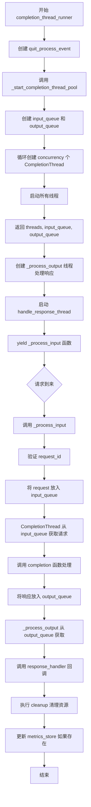
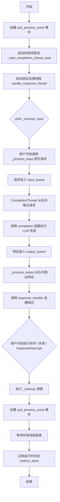
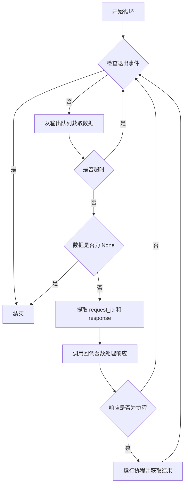
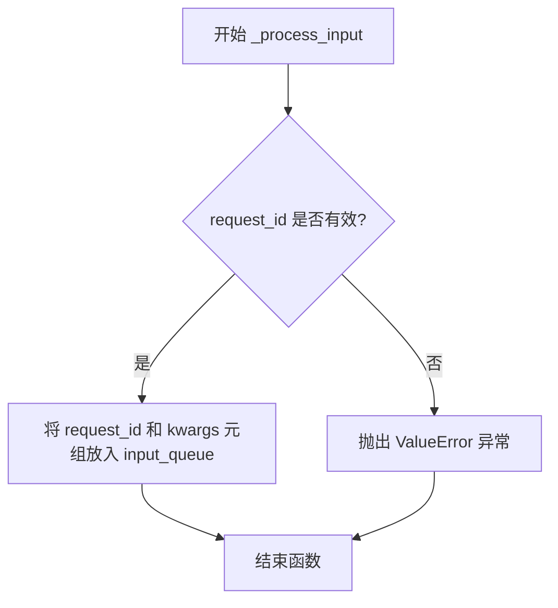
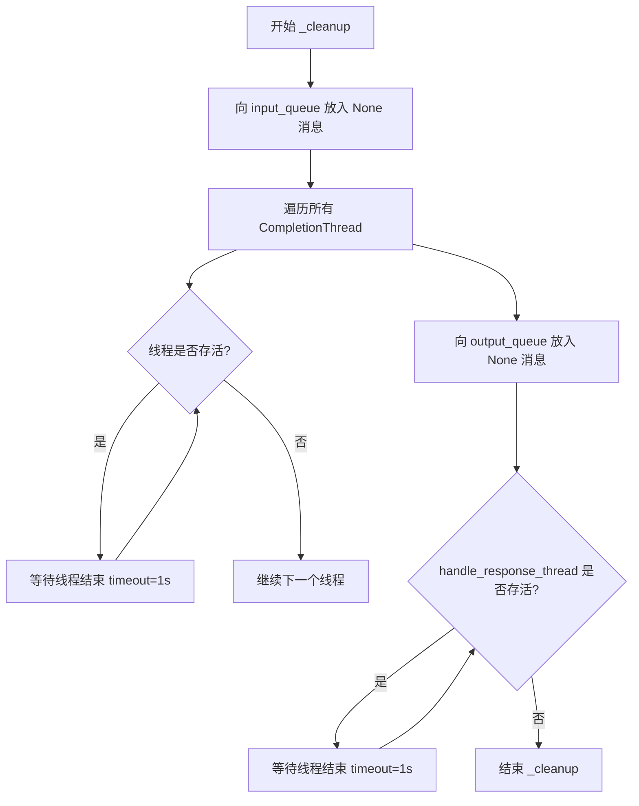
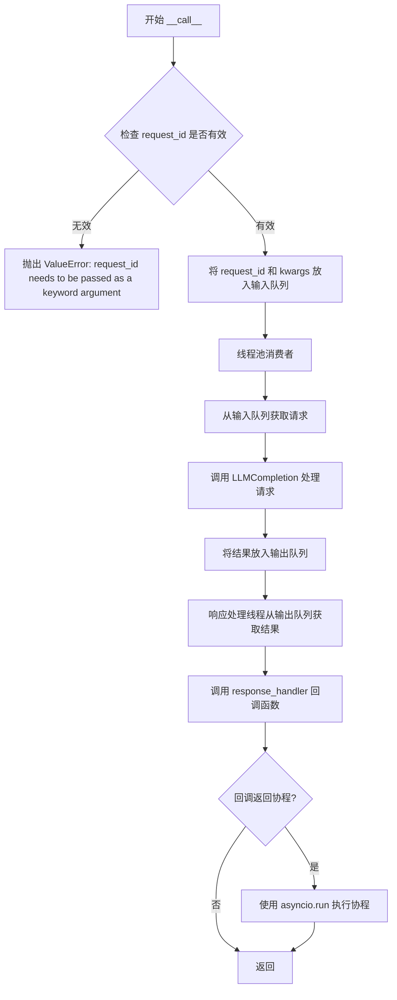

# `graphrag\packages\graphrag-llm\graphrag_llm\threading\completion_thread_runner.py` 详细设计文档

一个用于在thread pool中运行LLM completion请求的模块，通过线程池并发处理completion请求，并使用回调函数处理响应，支持可选的metrics记录。

## 整体流程



## 类结构

```
Protocol
├── ThreadedLLMCompletionResponseHandler
└── ThreadedLLMCompletionFunction
Function (模块级)
├── _start_completion_thread_pool
└── completion_thread_runner (context manager)
```

## 全局变量及字段


### `quit_process_event`
    
用于通知线程池退出的事件标志，通过set()方法触发线程停止

类型：`threading.Event`
    


### `threads`
    
存储线程池中所有工作线程的列表，用于管理和控制并发执行

类型：`list[CompletionThread]`
    


### `input_queue`
    
接收LLM完成请求的输入队列，生产者将请求放入此队列供工作线程消费

类型：`LLMCompletionRequestQueue (Queue)`
    


### `output_queue`
    
发送LLM完成响应的输出队列，工作线程将处理结果放入此队列供回调消费

类型：`LLMCompletionResponseQueue (Queue)`
    


### `start_time`
    
记录线程池启动时的时间戳，用于计算运行时长

类型：`float`
    


### `end_time`
    
记录线程池结束时的瞬间时间戳，用于计算运行时长

类型：`float`
    


### `runtime`
    
线程池从启动到关闭的总运行时长（秒），用于性能指标记录

类型：`float`
    


    

## 全局函数及方法


### `_start_completion_thread_pool`

这是一个私有函数，用于初始化并启动一个由多个工作线程组成的线程池，这些线程负责处理LLM完成请求。它创建指定数量的`CompletionThread`实例，每个线程共享同一个输入队列和输出队列，并使用提供的完成函数处理请求。

参数：

- `completion`：`LLMCompletionFunction`，用于执行LLM完成调用的函数
- `quit_process_event`：`threading.Event`，用于发出关闭信号的事件
- `concurrency`：`int`，要启动的线程数量
- `queue_limit`：`int`，输入队列的最大容量限制

返回值：`tuple[list[CompletionThread], LLMCompletionRequestQueue, LLMCompletionResponseQueue]`，返回包含线程列表、输入队列和输出队列的元组

#### 流程图

```mermaid
flowchart TD
    A[开始] --> B[创建空线程列表]
    B --> C[创建输入队列 Queue(queue_limit)]
    C --> D[创建输出队列 Queue()]
    D --> E{循环次数 < concurrency?}
    E -->|是| F[创建CompletionThread实例]
    F --> G[启动线程]
    G --> H[将线程添加到列表]
    H --> E
    E -->|否| I[返回 threads, input_queue, output_queue]
    I --> J[结束]
```

#### 带注释源码

```python
def _start_completion_thread_pool(
    *,
    completion: "LLMCompletionFunction",  # LLM完成函数，用于处理实际请求
    quit_process_event: threading.Event,   # 线程退出信号事件
    concurrency: int,                      # 线程池中线程的数量
    queue_limit: int,                      # 输入队列的最大容量
) -> tuple[
    list[CompletionThread],                # 线程实例列表
    "LLMCompletionRequestQueue",           # 请求输入队列
    "LLMCompletionResponseQueue",         # 响应输出队列
]:
    """初始化并启动线程池。
    
    该函数创建一个指定数量的CompletionThread实例集合，每个线程从
    共享的输入队列中获取请求，处理后将结果放入输出队列。
    """
    threads: list[CompletionThread] = []  # 存储所有工作线程
    # 创建带容量限制的请求输入队列
    input_queue: LLMCompletionRequestQueue = Queue(queue_limit)
    # 创建无限制的响应输出队列
    output_queue: LLMCompletionResponseQueue = Queue()
    
    # 根据并发数量创建相应数量的工作线程
    for _ in range(concurrency):
        thread = CompletionThread(
            quit_process_event=quit_process_event,  # 传递退出事件
            input_queue=input_queue,                # 共享输入队列
            output_queue=output_queue,              # 共享输出队列
            completion=completion,                  # LLM完成函数
        )
        thread.start()  # 启动线程
        threads.append(thread)  # 添加到线程列表

    # 返回线程列表和队列供调用方使用
    return threads, input_queue, output_queue
```


### `completion_thread_runner`

这是一个上下文管理器函数，用于创建一个线程池来处理 LLM 完成请求。它启动指定数量的工作线程，从输入队列获取请求，调用 LLM 完成函数，并通过回调函数返回响应，同时支持指标收集和优雅关闭。

参数：

- `completion`：`LLMCompletionFunction`，用于实际执行 LLM 完成的函数
- `response_handler`：`ThreadedLLMCompletionResponseHandler`，处理完成响应或异常的回调函数
- `concurrency`：`int`，线程池中工作线程的数量
- `queue_limit`：`int`，输入队列的最大大小，0 表示无限制
- `metrics_store`：`MetricsStore | None`，可选的指标存储，用于记录运行时长

返回值：`Iterator[ThreadedLLMCompletionFunction]`，返回一个函数用于向线程池提交完成请求

#### 流程图



#### 带注释源码

```python
@contextmanager
def completion_thread_runner(
    *,
    completion: "LLMCompletionFunction",
    response_handler: ThreadedLLMCompletionResponseHandler,
    concurrency: int,
    queue_limit: int = 0,
    metrics_store: "MetricsStore | None" = None,
) -> Iterator[ThreadedLLMCompletionFunction]:
    """Run a completion thread pool.

    Args
    ----
        completion: LLMCompletion
            The LLMCompletion instance to use for processing requests.
        response_handler: ThreadedLLMCompletionResponseHandler
            The callback function to handle completion responses.
            (request_id, response|exception) -> Awaitable[None] | None
        concurrency: int
            The number of threads to spin up in a thread pool.
        queue_limit: int (default=0)
            The maximum number of items allowed in the input queue.
            0 means unlimited.
            Set this to a value to create backpressure on the caller.
        metrics_store: MetricsStore | None (default=None)
            Optional metrics store to record runtime duration.

    Yields
    ------
        ThreadedLLMCompletionFunction:
            A function that can be used to submit completion requests to the thread pool.
            (messages, request_id, **kwargs) -> None

            The thread pool will process the requests and invoke the provided callback
            with the responses.

            same signature as LLMCompletionFunction but requires a `request_id` parameter
            to identify the request and does not return anything.
    """
    # 创建退出事件，用于优雅关闭线程池
    quit_process_event = threading.Event()
    # 启动完成线程池，获取线程列表、输入队列和输出队列
    threads, input_queue, output_queue = _start_completion_thread_pool(
        completion=completion,
        quit_process_event=quit_process_event,
        concurrency=concurrency,
        queue_limit=queue_limit,
    )

    def _process_output(
        quit_process_event: threading.Event,
        output_queue: "LLMCompletionResponseQueue",
        callback: ThreadedLLMCompletionResponseHandler,
    ):
        """从输出队列读取响应并调用回调函数处理"""
        while True and not quit_process_event.is_set():
            try:
                # 从输出队列获取响应，超时时间1秒
                data = output_queue.get(timeout=1)
            except Empty:
                continue
            # None 表示队列关闭信号
            if data is None:
                break
            request_id, response = data
            # 调用回调处理响应
            response = callback(request_id, response)

            # 如果回调返回协程，则同步执行它
            if asyncio.iscoroutine(response):
                response = asyncio.run(response)

    def _process_input(request_id: str, **kwargs: Unpack["LLMCompletionArgs"]):
        """将请求放入输入队列"""
        if not request_id:
            msg = "request_id needs to be passed as a keyword argument"
            raise ValueError(msg)
        input_queue.put((request_id, kwargs))

    # 启动响应处理线程
    handle_response_thread = threading.Thread(
        target=_process_output,
        args=(quit_process_event, output_queue, response_handler),
    )
    handle_response_thread.start()

    def _cleanup():
        """清理函数：关闭线程池并等待所有线程结束"""
        # 发送结束信号到输入队列
        for _ in threads:
            input_queue.put(None)

        # 等待所有工作线程结束
        for thread in threads:
            while thread.is_alive():
                thread.join(timeout=1)

        # 发送结束信号到输出队列
        output_queue.put(None)

        # 等待响应处理线程结束
        while handle_response_thread.is_alive():
            handle_response_thread.join(timeout=1)

    # 记录开始时间
    start_time = time.time()
    try:
        # 将 _process_input 函数yield给调用者使用
        yield _process_input
        # 执行清理
        _cleanup()
    except KeyboardInterrupt:
        # 捕获键盘中断，设置退出事件并退出
        quit_process_event.set()
        sys.exit(1)
    finally:
        # 计算运行时长并更新指标
        end_time = time.time()
        runtime = end_time - start_time
        if metrics_store:
            metrics_store.update_metrics(metrics={"runtime_duration_seconds": runtime})
```


### `_process_output`

`_process_output` 是一个内部辅助函数，用于从输出队列中获取处理结果并通过回调函数处理响应。它运行在独立的线程中，持续监听输出队列，直到收到退出信号或队列中的 None 哨兵值。

参数：

- `quit_process_event`：`threading.Event`，控制线程退出的事件对象，当设置时表示需要停止处理
- `output_queue`：`LLMCompletionResponseQueue`，LLM 完成的响应队列，包含 (request_id, response) 元组
- `callback`：`ThreadedLLMCompletionResponseHandler`，处理响应的回调函数，签名为 (request_id, response) -> Awaitable[None] | None

返回值：`None`，该函数不返回任何值，主要通过回调函数处理结果

#### 流程图



#### 带注释源码

```python
def _process_output(
    quit_process_event: threading.Event,          # 退出事件，用于优雅停止线程
    output_queue: "LLMCompletionResponseQueue",   # 输出队列，存储待处理的响应
    callback: ThreadedLLMCompletionResponseHandler,  # 回调函数，处理响应结果
):
    # 持续循环直到收到退出信号
    while True and not quit_process_event.is_set():
        try:
            # 从输出队列获取数据，设置1秒超时避免阻塞
            data = output_queue.get(timeout=1)
        except Empty:
            # 超时则继续循环检查退出事件
            continue
        
        # None 作为哨兵值表示队列关闭
        if data is None:
            break
        
        # 解包队列中的数据：request_id 和 response
        request_id, response = data
        
        # 调用回调函数处理响应
        response = callback(request_id, response)

        # 如果回调返回协程，则同步运行它
        if asyncio.iscoroutine(response):
            response = asyncio.run(response)
```


### `_process_input`

这是一个内部函数，用于验证请求 ID 并将请求参数放入输入队列，以便线程池中的工作线程处理。

参数：

- `request_id`：`str`，请求的唯一标识符，用于跟踪和关联响应
- `**kwargs`：`Unpack["LLMCompletionArgs"]`，解包的 LLM 完成参数（如消息、temperature、stream 等）

返回值：`None`，该函数不返回任何值，仅执行队列操作

#### 流程图



#### 带注释源码

```python
def _process_input(request_id: str, **kwargs: Unpack["LLMCompletionArgs"]):
    """将请求放入输入队列的内部处理函数。
    
    该函数在 completion_thread_runner 上下文管理器内部定义，
    作为 ThreadedLLMCompletionFunction 协议的实现被 yield 出来，
    供调用者提交 LLM 完成请求。
    
    Args:
        request_id: 请求的唯一标识符，用于在响应处理时关联请求和响应
        **kwargs: LLMCompletionArgs 的解包参数，包含发送给 LLM 的所有参数
                  如 messages, temperature, max_tokens, stream 等
    
    Returns:
        None: 该函数不返回值，通过队列异步处理请求
    """
    # 验证 request_id 不为空，这是必需参数
    if not request_id:
        msg = "request_id needs to be passed as a keyword argument"
        raise ValueError(msg)
    
    # 将请求元组 (request_id, kwargs) 放入输入队列
    # CompletionThread 工作线程会从队列中取出并处理
    input_queue.put((request_id, kwargs))
```


### `_cleanup`

`_cleanup` 是一个嵌套在 `completion_thread_runner` 上下文管理器内部的清理函数，负责优雅地关闭线程池。它通过向工作线程发送终止信号、等待线程完成以及清理相关资源，确保整个CompletionThreadRunner系统在退出时不会留下僵尸线程或未释放的资源。

参数：

- 无参数（该函数为闭包，通过捕获外部作用域的变量 `threads`、`input_queue`、`output_queue` 和 `handle_response_thread` 进行操作）

返回值：无返回值（`None`）

#### 流程图



#### 带注释源码

```python
def _cleanup():
    """清理线程池资源，确保所有线程安全退出。
    
    该函数作为闭包访问外部变量:
    - threads: CompletionThread 列表
    - input_queue: LLMCompletionRequestQueue
    - output_queue: LLMCompletionResponseQueue
    - handle_response_thread: threading.Thread
    """
    # 向输入队列发送 None，通知所有工作线程停止
    # None 作为哨兵值(sentinel value)表示退出信号
    for _ in threads:
        input_queue.put(None)

    # 等待所有 CompletionThread 工作线程安全结束
    # 使用 timeout=1s 避免无限阻塞
    for thread in threads:
        while thread.is_alive():
            thread.join(timeout=1)

    # 向输出队列发送 None，通知响应处理线程停止
    output_queue.put(None)

    # 等待响应处理线程结束
    while handle_response_thread.is_alive():
        handle_response_thread.join(timeout=1)
```


### `ThreadedLLMCompletionResponseHandler.__call__`

这是一个线程化 LLM 完成的响应处理器接口（Protocol），用于处理来自线程池完成器的响应。该接口定义了处理 LLM 完成的回调函数签名，支持同步或异步处理，可以接收完整的响应、流式块或异常。

参数：

- `request_id`：`str`，与完成请求关联的请求 ID
- `response`：`LLMCompletionResponse | Iterator[LLMCompletionChunk] | Exception`，完成响应，可以是完整响应、流式块迭代器，或请求失败时的异常

返回值：`Awaitable[None] | None`，回调可以是异步的或同步的

#### 流程图

```mermaid
flowchart TD
    A[CompletionThread 处理完成] --> B{是否有异常?}
    B -->|是| C[将 Exception 放入 output_queue]
    B -->|否| D{是否流式响应?}
    D -->|是| E[将 Iterator[LLMCompletionChunk] 放入 output_queue]
    D -->|否| F[将 LLMCompletionResponse 放入 output_queue]
    
    C --> G[_process_output 线程取出数据]
    E --> G
    F --> G
    
    G --> H[调用 response_handler]
    H --> I{response 是协程?}
    I -->|是| J[asyncio.run 执行协程]
    I -->|否| K[直接忽略返回值]
    J --> K
    
    K --> L[继续等待下一个响应]
```

#### 带注释源码

```python
@runtime_checkable
class ThreadedLLMCompletionResponseHandler(Protocol):
    """Threaded completion response handler.

    This function is used to handle responses from the threaded completion runner.

    Args
    ----
        request_id: str
            The request ID associated with the completion request.
        resp: LLMCompletionResponse | Iterator[LLMCompletionChunk] | Exception
            The completion response, which can be a full response, a stream of chunks,
            or an exception if the request failed.

    Returns
    -------
        Awaitable[None] | None
            The callback can be asynchronous or synchronous.
    """

    def __call__(
        self,
        request_id: str,
        response: "LLMCompletionResponse | Iterator[LLMCompletionChunk] | Exception",
        /,
    ) -> Awaitable[None] | None:
        """Threaded completion response handler."""
        ...
```

#### 使用示例上下文源码

以下代码展示该接口在 `completion_thread_runner` 中的实际使用方式：

```python
def _process_output(
    quit_process_event: threading.Event,
    output_queue: "LLMCompletionResponseQueue",
    callback: ThreadedLLMCompletionResponseHandler,
):
    """从输出队列取出响应并调用回调处理"""
    while True and not quit_process_event.is_set():
        try:
            # 阻塞等待获取输出队列中的响应数据
            data = output_queue.get(timeout=1)
        except Empty:
            continue
        
        # None 表示关闭信号
        if data is None:
            break
            
        # 取出请求ID和响应内容
        request_id, response = data
        
        # 调用用户的回调处理响应
        response = callback(request_id, response)

        # 如果回调返回协程，则同步执行它
        if asyncio.iscoroutine(response):
            response = asyncio.run(response)
```


### `ThreadedLLMCompletionFunction.__call__`

这是一个线程安全的 LLM Completion 调用接口，用于将请求提交到线程池进行处理。线程池处理完请求后会通过回调函数返回结果。

参数：

-  `request_id`：`str`，请求的唯一标识符，用于追踪和关联响应
-  `**kwargs`：`Unpack["LLMCompletionArgs"]`，包含所有 LLM Completion 参数的可变关键字参数，包括：
  - `messages`: 发送给 LLM 的消息
  - `response_format`: 结构化响应格式（可选）
  - `stream`: 是否流式响应（可选）
  - `max_completion_tokens`: 最大生成 token 数（可选）
  - `temperature`: 温度参数（可选）
  - `top_p`: 核采样参数（可选）
  - `n`: 生成数量（可选）
  - `tools`: 工具列表（可选）

返回值：`None`，该方法不返回任何内容，结果通过回调函数异步返回

#### 流程图



#### 带注释源码

```python
def __call__(
    self,
    /,
    request_id: str,
    **kwargs: Unpack["LLMCompletionArgs"],
) -> None:
    """Threaded Chat completion function.
    
    将完成请求提交到线程池进行处理。
    
    Args:
        request_id: 请求的唯一标识符
        **kwargs: LLMCompletionArgs 类型的任意关键字参数
        
    Returns:
        None: 不直接返回结果，结果通过 response_handler 回调传递
    """
    # 注意：实际的实现逻辑在 completion_thread_runner 上下文管理器中
    # 这里的 Protocol 定义只是声明了接口契约
    # 实际的方法实现在 _process_input 函数中：
    # def _process_input(request_id: str, **kwargs: Unpack["LLMCompletionArgs"]):
    #     if not request_id:
    #         msg = "request_id needs to be passed as a keyword argument"
    #         raise ValueError(msg)
    #     input_queue.put((request_id, kwargs))
    ...
```

## 关键组件


### ThreadedLLMCompletionResponseHandler

用于处理线程化完成响应的回调协议。定义了处理LLMCompletionResponse或Iterator[LLMCompletionChunk]或Exception的函数签名，支持异步和同步两种回调方式。

### ThreadedLLMCompletionFunction

用于向线程池提交请求的协议。拥有与LLMCompletionFunction相同的签名，但要求传入request_id参数来标识请求，且不返回任何内容。

### _start_completion_thread_pool

内部函数，负责初始化线程池。创建指定数量的CompletionThread、输入队列和输出队列，并将所有线程启动。

### completion_thread_runner

上下文管理器，核心组件。用于运行完成线程池，接受completion函数、响应处理器、并发数、队列限制和可选的指标存储。 yield出一个ThreadedLLMCompletionFunction用于提交请求，并管理线程池的生命周期。

### CompletionThread

被引用的工作线程类，实际执行LLM完成请求的处理。从输入队列获取请求，调用completion函数，将结果放入输出队列。

### _process_output

内部函数，运行在独立线程中。从输出队列获取响应数据，调用回调函数处理响应，如果是协程则同步运行。

### _process_input

内部函数，作为yield给调用方的函数。验证request_id非空，将请求放入输入队列。

### MetricsStore集成

可选的指标存储集成，在线程池运行结束后记录运行时长。


## 问题及建议


### 已知问题

-   **异步回调同步调用风险**：`_process_output` 方法中使用 `asyncio.run(response)` 同步运行异步回调，这会在回调中创建新的事件循环，可能与外部 asyncio 环境冲突，且会阻塞响应处理线程
-   **字典引用传递陷阱**：`_process_input` 将 `kwargs` 字典直接放入队列，如果调用者在请求入队后修改了字典，可能导致不可预期的行为
-   **线程清理可能无限等待**：`thread.join(timeout=1)` 在循环中执行，但如果线程因异常未正确退出，外层循环最多只等待有限时间后继续，可能导致线程资源泄漏
-   **空队列轮询浪费CPU**：`_process_output` 中使用 `timeout=1` 的 `get()` 反复轮询，在队列长时间为空时会无意义地占用CPU周期
-   **缺乏输入参数验证**：未对 `concurrency` 参数进行正整数校验，传入负数或零时会导致创建无效的线程池
-   **异常处理不完整**：工作线程 `CompletionThread` 内部抛出的异常未在该模块中捕获和处理，可能导致线程静默退出
-   **无队列大小限制的OOM风险**：当 `queue_limit=0` 时队列大小无限制，高并发场景下可能导致内存溢出
-   **指标存储失败无降级**：如果 `metrics_store.update_metrics` 抛出异常，会导致整个上下文管理器失败

### 优化建议

-   **重构异步处理逻辑**：使用 `asyncio.create_task()` 将异步回调调度到外部事件循环，或要求调用者提供事件循环，避免在非异步上下文中使用 `asyncio.run()`
-   **深拷贝输入参数**：在将 `kwargs` 放入队列前进行深拷贝，确保请求参数在入队后不被外部修改影响
-   **添加线程健康检查**：在清理时检查线程是否正常退出，引入标记机制追踪线程状态，对异常退出的线程进行记录和告警
-   **优化空队列轮询**：考虑使用 `queue.join()` 或条件变量机制，或增加动态调整的超时策略以平衡响应延迟和CPU占用
-   **添加参数校验**：在函数入口处验证 `concurrency > 0` 和 `queue_limit >= 0`，对无效参数抛出明确的 `ValueError`
-   **完善异常传播机制**：在响应队列中传递异常信息，调用方可通过 `response_handler` 统一处理工作线程的错误
-   **实现背压控制**：提供默认的队列大小限制，并允许调用方通过回调实现自定义的背压策略（如拒绝新请求或阻塞提交）
-   **增强指标存储容错性**：将指标更新包装在 try-except 中，记录失败但不影响主流程，或使用异步非阻塞方式更新

## 其它


### 设计目标与约束

本模块的设计目标是在多线程环境中高效处理LLM（大型语言模型）完成请求，通过线程池模式实现并发处理，提高系统吞吐量。核心约束包括：1) 必须支持同步和异步两种响应处理方式；2) 输入队列支持可选的队列限制以实现背压控制；3) 线程池生命周期需通过上下文管理器管理，确保资源正确释放；4) 每个请求必须关联唯一的request_id用于追踪。

### 错误处理与异常设计

代码中的错误处理机制包含以下几个方面：1) ValueError异常：当request_id为空或未提供时抛出ValueError并附带明确错误信息"request_id needs to be passed as a keyword argument"；2) KeyboardInterrupt处理：当捕获到键盘中断时，设置退出事件并调用sys.exit(1)立即终止程序；3) Queue.Empty异常：在处理输出队列时使用try-except捕获Empty异常，继续循环而非中断；4) 异步协程处理：使用asyncio.iscoroutine()检测响应是否为协程，若则是用asyncio.run()执行。设计中未对LLMCompletionArgs参数验证失败、队列满无法入队、线程启动失败等情况进行显式处理。

### 数据流与状态机

数据流模型采用生产者-消费者模式：主线程通过yield返回的_process_input函数作为生产者，将(request_id, kwargs)元组放入输入队列；多个CompletionThread作为消费者从输入队列获取请求并调用LLM完成功能；完成结果放入输出队列；handle_response_thread从输出队列获取结果并调用response_handler回调。状态机转换：初始化状态（创建线程和队列）→ 运行状态（线程运行，处理请求）→ 清理状态（发送None信号唤醒线程）→ 结束状态（所有线程退出）。quit_process_event事件用于协调所有线程的退出。

### 外部依赖与接口契约

本模块依赖以下外部组件：1) graphrag_llm.threading.completion_thread.CompletionThread：实际执行LLM请求的工作线程类；2) graphrag_llm.metrics.MetricsStore：可选的指标存储接口，需支持update_metrics方法；3) graphrag_llm.types中的LLMCompletionArgs、LLMCompletionChunk、LLMCompletionResponse等类型定义；4) Python标准库：asyncio、threading、queue、contextlib、typing、collections.abc。接口契约：completion参数必须实现__call__方法签名与LLMCompletionFunction一致；response_handler参数必须实现__call__(request_id, response)方法，可返回Awaitable[None]或None；concurrency参数必须为正整数；queue_limit必须为非负整数。

### 性能考量与优化空间

性能特征：1) 使用Queue进行线程间通信存在锁竞争，高并发时可能成为瓶颈；2) output_queue.get(timeout=1)的1秒超时可能导致响应延迟增加；3) 每个请求都创建新的协程并用asyncio.run()执行，同步回调也会触发事件循环，有一定开销。优化建议：1) 考虑使用无锁队列（如disruptor模式）替代标准Queue提升吞吐量；2) 调整output_queue超时时间，根据实际SLA要求优化；3) 对于大量同步回调场景，可提供选项跳过asyncio.run()直接执行；4) 可添加请求优先级支持，高优先级请求优先处理；5) 考虑使用线程池而非固定数量线程，实现弹性伸缩。

### 资源管理与生命周期

资源管理采用上下文管理器模式确保资源正确释放：1) 线程资源：启动时创建指定数量的CompletionThread，退出时等待所有线程结束（join timeout 1秒）；2) 队列资源：输入队列和输出队列在上下文结束时清空并关闭；3) 事件资源：quit_process_event用于信号通知线程退出。生命周期：enter时创建线程池并启动处理线程，yield返回提交函数，exit时执行_cleanup()进行资源清理，最后更新metrics_store中的runtime_duration_seconds指标。cleanup过程分步骤执行：先向输入队列放入None唤醒所有工作线程，再join等待线程退出，最后向输出队列放入None唤醒响应处理线程。

### 配置参数说明

completion参数：必填，LLMCompletionFunction实例，用于执行实际的LLM调用。response_handler参数：必填，ThreadedLLMCompletionResponseHandler类型，处理LLM响应或异常的回调函数。concurrency参数：必填，正整数，指定线程池中线程数量，建议根据CPU核心数和LLM API并发限制设置。queue_limit参数：可选，默认0（无限制），正整数，设置输入队列最大长度实现背压，0表示不限长度。metrics_store参数：可选，默认None，MetricsStore实例，用于记录运行时长指标。

### 并发安全与线程同步

并发安全机制：1) 使用threading.Event作为退出信号，所有工作线程通过检查quit_process_event.is_set()响应退出；2) 使用Queue进行线程间通信，Queue本身是线程安全的；3) 响应处理使用单独的handle_response_thread，避免与工作线程竞争。潜在竞态条件：1) _cleanup()中先放None再join线程，如果线程在put None前已处理完所有请求并退出，可能导致永远阻塞；2) metrics_store.update_metrics()调用在主线程，非线程安全的metrics_store可能导致数据竞争。

### 使用示例与典型场景

典型使用场景：1) 并发调用多个LLM请求提高API利用率；2) 将同步LLM调用封装为异步接口；3) 实现请求去重和缓存前的并发获取层。使用示例模式：
```python
with completion_thread_runner(
    completion=llm_completion,
    response_handler=handle_response,
    concurrency=4,
    queue_limit=100,
    metrics_store=metrics
) as submit_request:
    submit_request(request_id="req1", messages=[{"role": "user", "content": "Hello"}])
    submit_request(request_id="req2", messages=[{"role": "user", "content": "World"}])
```
其中handle_response接收(request_id, response_or_exception)参数，可同步或异步处理。

### 扩展性与未来考虑

扩展性设计：1) 通过Protocol定义接口，支持自定义completion和response_handler实现；2) concurrency和queue_limit参数可配置适应不同负载；3) 支持metrics_store插件以集成不同监控系统。未来扩展方向：1) 添加请求超时控制和重试机制；2) 支持请求优先级和公平调度；3) 增加监控指标如队列深度、请求延迟分布；4) 支持流式响应（streaming）在线程池中的处理；5) 提供分布式版本支持多进程部署。


    