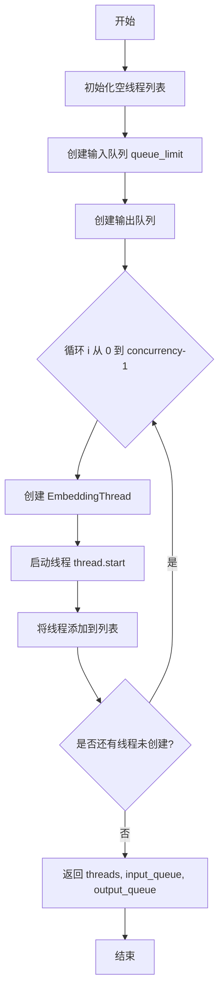
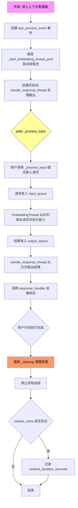
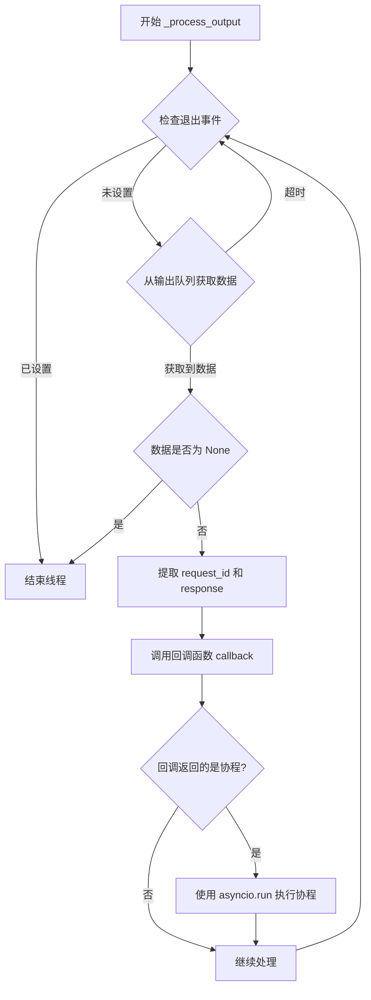
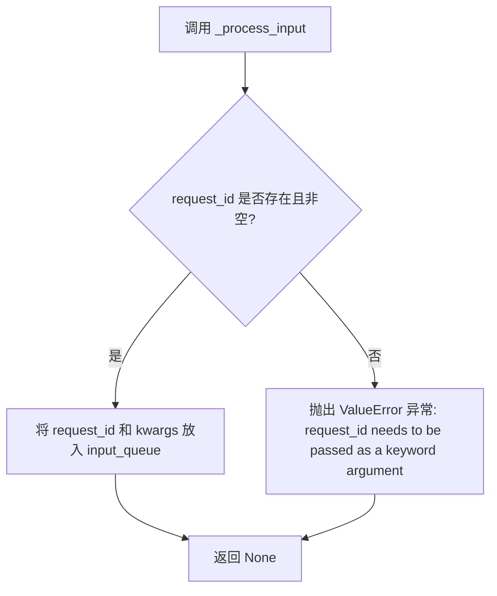
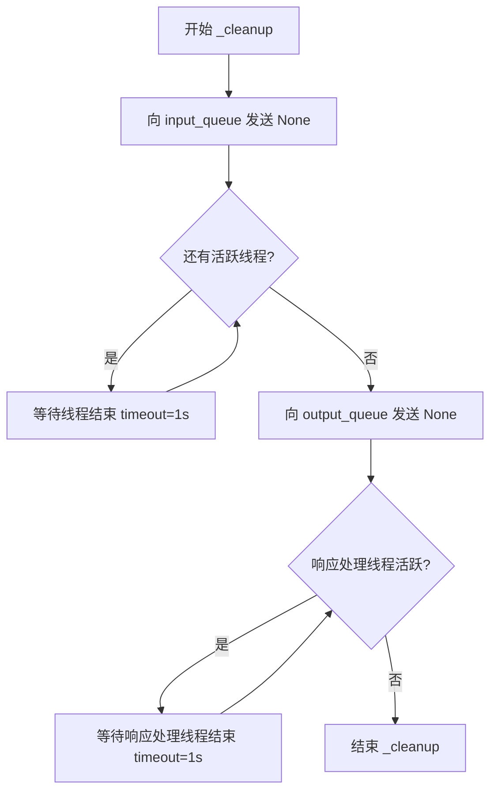
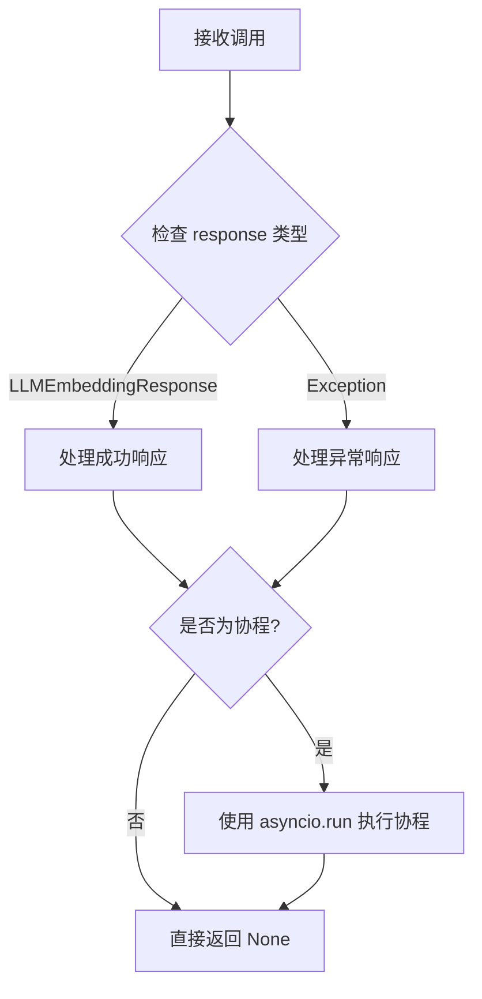
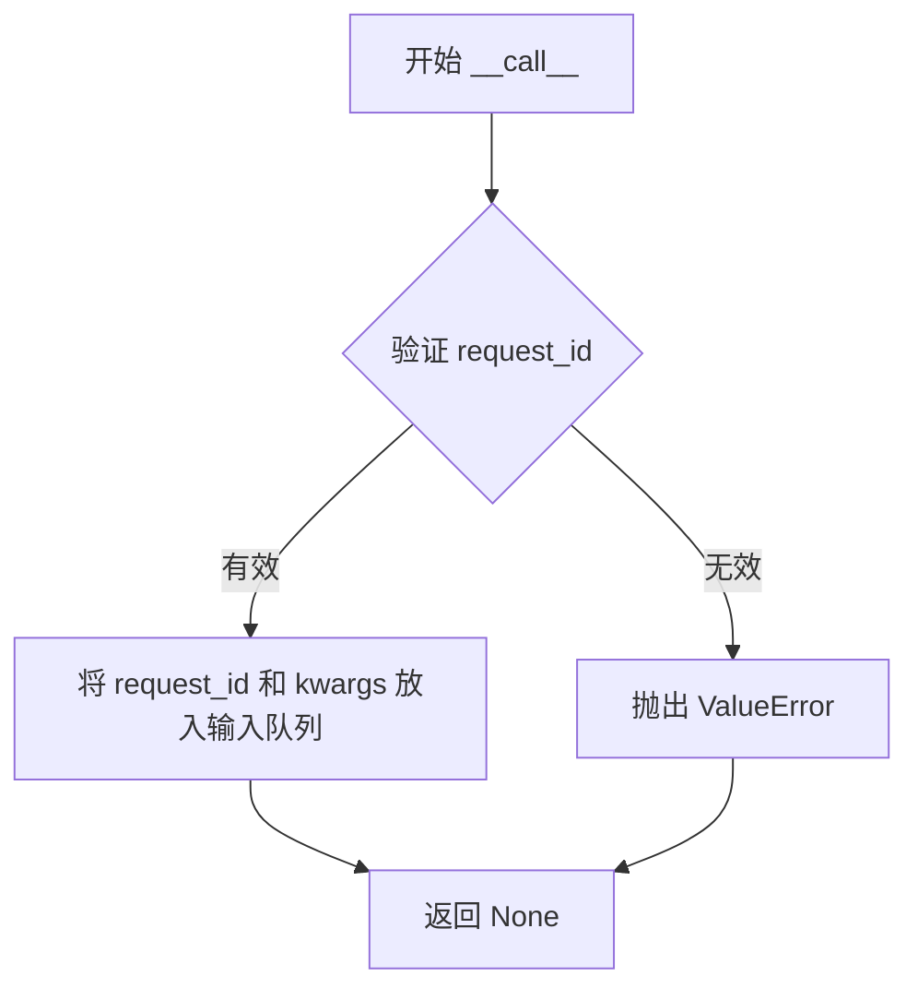

# `graphrag\packages\graphrag-llm\graphrag_llm\threading\embedding_thread_runner.py` 详细设计文档

一个嵌入任务线程池运行器，通过上下文管理器管理多线程并发处理嵌入请求，使用队列进行任务分发和结果收集，并通过回调函数处理响应。

## 整体流程

```mermaid
graph TD
    A[开始 embedding_thread_runner] --> B[创建 quit_process_event 事件]
    B --> C[调用 _start_embedding_thread_pool]
    C --> D[初始化 input_queue 和 output_queue]
    D --> E[创建并发数为 concurrency 的 EmbeddingThread 线程池并启动]
    E --> F[启动 handle_response_thread 处理输出队列]
    F --> G{Yield _process_input 函数给调用者}
    G --> H[用户调用 _process_input 提交请求]
    H --> I[将 (request_id, kwargs) 放入 input_queue]
    I --> J[EmbeddingThread 线程消费 input_queue]
    J --> K[调用 embedding 函数执行嵌入处理]
    K --> L[将结果放入 output_queue]
    L --> M[handle_response_thread 从 output_queue 获取结果]
    M --> N{调用 response_handler 回调}
    N --> O[如果是协程则用 asyncio.run 执行]
    O --> P[用户处理完成，退出上下文管理器]
    P --> Q[执行 _cleanup 清理函数]
    Q --> R[向 input_queue 放入 None 通知线程退出]
    R --> S[等待所有 EmbeddingThread 结束]
    S --> T[向 output_queue 放入 None]
    T --> U[等待 handle_response_thread 结束]
    U --> V[计算运行时长]
    V --> W[如果 metrics_store 存在则更新指标]
    W --> X[结束]
```

## 类结构

```
Protocol (Protocol)
├── ThreadedLLMEmbeddingResponseHandler (响应处理协议)
└── ThreadedLLMEmbeddingFunction (嵌入函数协议)
EmbeddingThread (被导入的线程类)
```

## 全局变量及字段


### `embedding`
    
用户提供的嵌入函数，用于处理嵌入请求

类型：`LLMEmbeddingFunction`
    


### `response_handler`
    
响应回调处理函数，用于处理嵌入响应或异常

类型：`ThreadedLLMEmbeddingResponseHandler`
    


### `concurrency`
    
线程池并发数量，指定要启动的线程数

类型：`int`
    


### `queue_limit`
    
输入队列限制，0表示无限制，用于控制背压

类型：`int`
    


### `metrics_store`
    
可选的指标存储，用于记录运行时长等指标

类型：`MetricsStore | None`
    


### `quit_process_event`
    
线程退出信号事件，用于协调线程优雅退出

类型：`threading.Event`
    


### `threads`
    
嵌入线程列表，包含所有启动的嵌入处理线程

类型：`list[EmbeddingThread]`
    


### `input_queue`
    
嵌入请求输入队列，用于接收待处理的嵌入请求

类型：`LLMEmbeddingRequestQueue`
    


### `output_queue`
    
嵌入响应输出队列，用于存储处理完成的响应

类型：`LLMEmbeddingResponseQueue`
    


### `start_time`
    
开始时间戳，记录线程池启动时的时间

类型：`float`
    


### `end_time`
    
结束时间戳，记录线程池结束时的运行时长

类型：`float`
    


### `runtime`
    
运行时长，线程池从启动到结束的总耗时（秒）

类型：`float`
    


### `handle_response_thread`
    
响应处理线程，负责从输出队列消费响应并调用回调

类型：`threading.Thread`
    


    

## 全局函数及方法


### `_start_embedding_thread_pool`

该函数是内部辅助函数，用于创建并启动一个嵌入线程池。它根据指定的并发数量创建多个 `EmbeddingThread` 实例，并为每个线程配置共享的输入队列和输出队列，然后启动所有线程，最后返回线程列表和队列供调用方使用。

参数：

-  `embedding`：`LLMEmbeddingFunction`，嵌入函数，用于处理实际的嵌入请求
-  `quit_process_event`：`threading.Event`，用于通知线程停止运行的事件信号
-  `concurrency`：`int`，要启动的线程数量
-  `queue_limit`：`int`，输入队列的最大容量限制

返回值：`tuple[list[EmbeddingThread], LLMEmbeddingRequestQueue, LLMEmbeddingResponseQueue]`，包含线程列表、嵌入请求队列和嵌入响应队列的元组

#### 流程图



#### 带注释源码

```python
def _start_embedding_thread_pool(
    *,
    embedding: "LLMEmbeddingFunction",
    quit_process_event: threading.Event,
    concurrency: int,
    queue_limit: int,
) -> tuple[
    list["EmbeddingThread"],
    "LLMEmbeddingRequestQueue",
    "LLMEmbeddingResponseQueue",
]:
    """启动嵌入线程池的内部函数。

    Args:
        embedding: LLMEmbeddingFunction，用于处理嵌入请求的函数
        quit_process_event: threading.Event，用于通知所有线程退出的事件
        concurrency: int，要创建的线程数量
        queue_limit: int，输入队列的最大容量，0表示无限制

    Returns:
        tuple: 包含线程列表、输入队列和输出队列的元组
    """
    # 初始化空列表用于存储所有工作线程
    threads: list[EmbeddingThread] = []
    # 创建带容量限制的输入队列，用于接收嵌入请求
    input_queue: LLMEmbeddingRequestQueue = Queue(queue_limit)
    # 创建无容量限制的输出队列，用于存储嵌入响应
    output_queue: LLMEmbeddingResponseQueue = Queue()
    # 循环创建指定数量的工作线程
    for _ in range(concurrency):
        # 为每个线程创建 EmbeddingThread 实例
        # 传入退出事件、输入队列、输出队列和嵌入函数
        thread = EmbeddingThread(
            quit_process_event=quit_process_event,
            input_queue=input_queue,
            output_queue=output_queue,
            embedding=embedding,
        )
        # 启动线程，开始处理请求
        thread.start()
        # 将线程添加到列表中管理
        threads.append(thread)

    # 返回线程列表、输入队列和输出队列
    # 供 embedding_thread_runner 函数使用
    return threads, input_queue, output_queue
```


### `embedding_thread_runner`

这是一个上下文管理器入口函数，用于创建并运行一个嵌入线程池（Embedding Thread Pool），通过多线程方式并发处理嵌入请求，并使用回调函数处理响应结果。

参数：

- `embedding`：`LLMEmbeddingFunction`，嵌入函数实例，用于实际执行嵌入计算
- `response_handler`：`ThreadedLLMEmbeddingResponseHandler`，响应处理回调函数，接收 request_id 和响应/异常
- `concurrency`：`int`，线程池中并发运行的线程数量
- `queue_limit`：`int`，输入队列的最大允许条目数，默认为 0（表示无限制），用于实现背压机制
- `metrics_store`：`MetricsStore | None`，可选的指标存储，用于记录运行时长

返回值：`Iterator[ThreadedLLMEmbeddingFunction]`，返回一个生成器迭代器，其中包含一个 `_process_input` 函数，可用于向线程池提交嵌入请求

#### 流程图



#### 带注释源码

```python
@contextmanager
def embedding_thread_runner(
    *,
    embedding: "LLMEmbeddingFunction",
    response_handler: ThreadedLLMEmbeddingResponseHandler,
    concurrency: int,
    queue_limit: int = 0,
    metrics_store: "MetricsStore | None" = None,
) -> Iterator[ThreadedLLMEmbeddingFunction]:
    """Run an embedding thread pool.

    Args
    ----
        embedding: LLMEmbeddingFunction
            The LLMEmbeddingFunction instance to use for processing requests.
        response_handler: ThreadedLLMEmbeddingResponseHandler
            The callback function to handle embedding responses.
            (request_id, response|exception) -> Awaitable[None] | None
        concurrency: int
            The number of threads to spin up in a thread pool.
        queue_limit: int (default=0)
            The maximum number of items allowed in the input queue.
            0 means unlimited.
            Set this to a value to create backpressure on the caller.
        metrics_store: MetricsStore | None (default=None)
            Optional metrics store to record runtime duration.

    Yields
    ------
        ThreadedLLMEmbeddingFunction:
            A function that can be used to submit embedding requests to the thread pool.
            (input, request_id, **kwargs) -> None

            The thread pool will process the requests and invoke the provided callback
            with the responses.

            same signature as LLMEmbeddingFunction but requires a `request_id` parameter
            to identify the request and does not return anything.
    """
    # 创建退出信号事件，用于优雅关闭线程
    quit_process_event = threading.Event()
    
    # 启动嵌入线程池，返回线程列表、输入队列和输出队列
    threads, input_queue, output_queue = _start_embedding_thread_pool(
        embedding=embedding,
        quit_process_event=quit_process_event,
        concurrency=concurrency,
        queue_limit=queue_limit,
    )

    def _process_output(
        quit_process_event: threading.Event,
        output_queue: "LLMEmbeddingResponseQueue",
        callback: ThreadedLLMEmbeddingResponseHandler,
    ):
        """处理输出队列的内部函数，在独立线程中运行"""
        # 持续轮询直到收到退出信号
        while True and not quit_process_event.is_set():
            try:
                # 从输出队列获取结果，设置超时以允许检查退出事件
                data = output_queue.get(timeout=1)
            except Empty:
                continue
            
            # None 表示队列关闭信号
            if data is None:
                break
            
            # 解析请求ID和响应
            request_id, response = data
            
            # 调用回调处理响应
            response = callback(request_id, response)

            # 如果回调返回协程，则同步执行它
            if asyncio.iscoroutine(response):
                response = asyncio.run(response)

    def _process_input(request_id: str, **kwargs: Unpack["LLMEmbeddingArgs"]):
        """提交嵌入请求到输入队列的内部函数"""
        # 验证 request_id 必须提供
        if not request_id:
            msg = "request_id needs to be passed as a keyword argument"
            raise ValueError(msg)
        
        # 将请求放入输入队列
        input_queue.put((request_id, kwargs))

    # 创建并启动响应处理线程
    handle_response_thread = threading.Thread(
        target=_process_output,
        args=(quit_process_event, output_queue, response_handler),
    )
    handle_response_thread.start()

    def _cleanup():
        """清理资源的内部函数：停止所有工作线程和响应处理线程"""
        # 向输入队列发送 None 信号，通知工作线程退出
        for _ in threads:
            input_queue.put(None)

        # 等待所有工作线程结束
        for thread in threads:
            while thread.is_alive():
                thread.join(timeout=1)

        # 向输出队列发送 None 信号
        output_queue.put(None)

        # 等待响应处理线程结束
        while handle_response_thread.is_alive():
            handle_response_thread.join(timeout=1)

    # 记录开始时间
    start_time = time.time()
    try:
        # yield 出输入处理函数，供调用者使用
        yield _process_input
        # 调用者代码执行完毕后进行清理
        _cleanup()
    except KeyboardInterrupt:
        # 处理键盘中断，设置退出事件并退出
        quit_process_event.set()
        sys.exit(1)
    finally:
        # 计算运行时长并更新指标
        end_time = time.time()
        runtime = end_time - start_time
        if metrics_store:
            metrics_store.update_metrics(metrics={"runtime_duration_seconds": runtime})
```


### `_process_output`

这是一个内部线程处理函数，用于从输出队列中获取嵌入请求的响应，并通过回调函数处理这些响应。如果回调返回协程，则同步运行该协程。

参数：

-  `quit_process_event`：`threading.Event`，控制线程退出的事件信号
-  `output_queue`：`LLMEmbeddingResponseQueue`，存放嵌入请求响应的输出队列
-  `callback`：`ThreadedLLMEmbeddingResponseHandler`，处理嵌入响应的回调函数

返回值：`None`，无返回值

#### 流程图



#### 带注释源码

```python
def _process_output(
    quit_process_event: threading.Event,
    output_queue: "LLMEmbeddingResponseQueue",
    callback: ThreadedLLMEmbeddingResponseHandler,
):
    """处理输出队列中的响应.
    
    这是一个线程函数,持续从输出队列中获取嵌入请求的响应,
    并通过回调函数处理这些响应。如果回调返回协程,则同步运行该协程。
    
    参数
    ----
        quit_process_event: threading.Event
            控制线程退出的事件信号,当设置时线程将退出
        output_queue: LLMEmbeddingResponseQueue
            存放嵌入请求响应的输出队列
        callback: ThreadedLLMEmbeddingResponseHandler
            处理嵌入响应的回调函数,签名为 (request_id, response) -> Awaitable[None] | None
    """
    # 持续循环处理输出,直到收到退出信号
    while True and not quit_process_event.is_set():
        try:
            # 从输出队列获取数据,超时时间为1秒
            # 如果队列为空且未超时,会抛出 Empty 异常
            data = output_queue.get(timeout=1)
        except Empty:
            # 超时后继续循环,重新检查退出事件
            continue
        
        # 如果收到 None,表示队列已关闭,退出循环
        if data is None:
            break
            
        # 解包数据: request_id 和 response
        request_id, response = data
        
        # 调用回调函数处理响应
        response = callback(request_id, response)

        # 检查回调是否返回协程(即异步函数)
        # 如果是异步的,则使用 asyncio.run 同步执行
        if asyncio.iscoroutine(response):
            response = asyncio.run(response)
```


### `_process_input`

处理输入请求的内部函数，将请求ID和参数放入输入队列，以供嵌入线程池中的工作线程处理。

参数：

-  `request_id`：`str`，请求的唯一标识符，不能为空
-  `**kwargs`：`Unpack["LLMEmbeddingArgs"]`，嵌入函数的其他关键字参数

返回值：`None`，无返回值，仅将请求放入队列

#### 流程图



#### 带注释源码

```python
def _process_input(request_id: str, **kwargs: Unpack["LLMEmbeddingArgs"]):
    """处理输入请求的内部函数，处理输入请求的提交，输出名称。
    
    Args:
        request_id: str - 请求的唯一标识符
        **kwargs: Unpack[LLMEmbeddingArgs] - 嵌入函数的其他参数
    
    Returns:
        None - 无返回值，仅将请求放入队列
    """
    # 验证 request_id 是否有效，如果为空则抛出异常
    if not request_id:
        msg = "request_id needs to be passed as a keyword argument"
        raise ValueError(msg)
    
    # 将请求 ID 和参数元组放入输入队列，供工作线程处理
    input_queue.put((request_id, kwargs))
```


### `_cleanup`

` _cleanup` 是 `embedding_thread_runner` 上下文管理器内部的清理函数，负责优雅地停止线程池：向工作线程发送终止信号、等待所有工作线程和响应处理线程安全结束、确保资源正确释放。

参数：无

返回值：无

#### 流程图



#### 带注释源码

```python
def _cleanup():
    """清理资源并等待线程结束."""
    # 1. 向输入队列发送 None，通知所有工作线程停止
    # 每个工作线程在接收到 None 后会退出其运行循环
    for _ in threads:
        input_queue.put(None)

    # 2. 等待所有工作线程完全结束
    # 使用轮询方式检查线程是否存活，每次等待超时为1秒
    for thread in threads:
        while thread.is_alive():
            thread.join(timeout=1)

    # 3. 向输出队列发送 None，通知响应处理线程停止
    # 这是一个信号，表示不再有新的输出需要处理
    output_queue.put(None)

    # 4. 等待响应处理线程完全结束
    # 该线程负责从输出队列取出结果并调用回调函数
    while handle_response_thread.is_alive():
        handle_response_thread.join(timeout=1)
```


### `ThreadedLLMEmbeddingResponseHandler.__call__`

该方法是线程化嵌入响应的处理函数协议，作为回调函数用于接收来自线程化嵌入运行器的响应。它接收请求ID和嵌入响应（或异常），并可选地以同步或异步方式处理这些响应。

参数：

- `self`：`ThreadedLLMEmbeddingResponseHandler`，协议实例本身
- `request_id`：`str`，与嵌入请求关联的请求ID，用于标识和追踪请求
- `response`：`LLMEmbeddingResponse | Exception`，嵌入响应，可以是成功的 `LLMEmbeddingResponse` 对象或请求失败时的 `Exception` 异常

返回值：`Awaitable[None] | None`，回调函数的返回值，可以是异步函数（返回协程）或同步函数（返回 None）

#### 流程图



#### 带注释源码

```python
def __call__(
    self,
    request_id: str,
    response: "LLMEmbeddingResponse | Exception",
    /,
) -> Awaitable[None] | None:
    """Threaded embedding response handler.
    
    This method is part of the Protocol class that defines the signature
    for handling threaded embedding responses. It can be implemented as
    either a synchronous or asynchronous function.
    
    Args:
        request_id: str - The unique identifier for the embedding request
        response: LLMEmbeddingResponse | Exception - The embedding response 
                  object or an exception if the request failed
    
    Returns:
        Awaitable[None] | None - Can return None synchronously or an 
        awaitable that resolves to None
    """
    ...  # 抽象方法，由具体实现类提供
```


### `ThreadedLLMEmbeddingFunction.__call__`

在多线程上下文中处理嵌入请求的协议方法。该方法接收请求ID和嵌入参数，将请求放入输入队列，由嵌入线程池异步处理，并通过回调函数返回响应。

参数：

- `self`：隐式的实例对象，代表协议实例
- `request_id`：`str`，请求的唯一标识符，用于追踪和关联响应
- `**kwargs`：`Unpack["LLMEmbeddingArgs"]`，包含输入文本列表和其他嵌入参数的可变关键字参数

返回值：`None`，该方法不直接返回结果，而是通过回调函数异步返回嵌入响应

#### 流程图



#### 带注释源码

```python
def __call__(
    self, /, request_id: str, **kwargs: Unpack["LLMEmbeddingArgs"]
) -> None:
    """Threaded embedding function.
    
    在多线程上下文中处理嵌入请求的函数。
    
    参数:
        self: 协议实例本身
        request_id: str, 请求的唯一标识符
        **kwargs: Unpack[LLMEmbeddingArgs], 嵌入参数，包含输入文本等
        
    返回:
        None: 不直接返回结果，通过回调函数异步返回响应
    """
    ...
```

## 关键组件


### ThreadedLLMEmbeddingResponseHandler

线程嵌入响应处理协议，定义了对嵌入请求响应进行处理回调的接口，支持同步或异步处理方式。

### ThreadedLLMEmbeddingFunction

线程嵌入函数协议，定义了在线程上下文中执行嵌入请求的接口，接受request_id和嵌入参数。

### _start_embedding_thread_pool

内部函数，用于创建并启动嵌入线程池，初始化指定数量的EmbeddingThread线程，并返回线程列表、输入队列和输出队列。

### embedding_thread_runner

上下文管理器函数，用于运行嵌入线程池。创建线程池、管理线程生命周期、处理输入输出，并通过回调函数处理响应。支持队列限制和指标存储。

### _process_output

内部函数，用于从输出队列中获取嵌入响应并调用回调函数处理，使用轮询方式从队列获取数据，支持异步响应处理。

### _process_input

内部函数，用于将嵌入请求放入输入队列，接收request_id和嵌入参数，验证request_id有效性后加入队列。

### _cleanup

内部函数，用于清理线程池资源，包括停止所有工作线程和响应处理线程，确保资源正确释放。


## 问题及建议


### 已知问题

- **异常处理缺失**：`_process_output`函数中的回调执行没有异常保护，若`response_handler`抛出异常会导致响应处理线程崩溃，整个线程池无法继续工作。
- **资源泄漏风险**：当发生`KeyboardInterrupt`时直接调用`sys.exit(1)`，这会立即终止进程，导致`finally`块中的metrics记录逻辑无法执行，同时可能造成线程资源未正确释放。
- **参数校验不足**：对`concurrency`和`queue_limit`参数缺少校验，`concurrency`为0时会创建0个线程的线程池，`queue_limit`为0表示无限制可能引发内存溢出。
- **队列操作无超时处理**：`input_queue.put`操作没有超时机制，当队列满时会导致调用线程阻塞甚至死锁，缺乏背压处理的灵活性。
- **线程退出竞态条件**：`quit_process_event.set()`后立即调用`sys.exit(1)`，没有给工作线程和响应处理线程优雅退出的机会，可能导致数据不一致。
- **类型定义与实现不符**：`ThreadedLLMEmbeddingFunction`协议定义返回类型为`None`，但实际调用方可能期望有返回值或知道请求是否成功提交。

### 优化建议

- 为`concurrency`和`queue_limit`添加参数校验逻辑，确保`concurrency > 0`并在`queue_limit`过大时给出警告或使用默认值。
- 在`_process_output`的回调调用外层添加`try-except`块，记录异常日志并确保线程不会因单个请求失败而崩溃。
- 移除`sys.exit(1)`调用，改为设置退出事件并等待线程自然退出，或捕获异常后执行完整的清理逻辑。
- 为`input_queue.put`添加超时参数（如`block=True, timeout=...`），并在超时时抛出明确的异常或返回失败状态。
- 考虑使用`asyncio`原生的线程池执行器替代手动线程管理，可以更好地与现代异步框架集成并简化资源管理。
- 添加日志记录关键操作节点，便于排查问题和监控运行时状态。
- 考虑在类或函数级别添加`__slots__`以减少内存开销，尤其是在高并发场景下。

## 其它


### 设计目标与约束

**设计目标**：
- 提供一个线程池机制来并发处理LLM嵌入请求，提高嵌入任务的吞吐量
- 通过队列机制实现生产者-消费者模式，支持背压（backpressure）控制
- 支持同步和异步两种响应处理方式
- 提供可选的运行时指标记录功能

**设计约束**：
- 线程数量（concurrency）和队列限制（queue_limit）必须在创建时指定，后续不可动态调整
- 要求调用方必须传入request_id参数用于请求追踪
- 响应处理函数可能是同步或异步的，但最终都会以同步方式执行
- 当队列满时，生产者会被阻塞（取决于queue_limit的值）

### 错误处理与异常设计

**异常传播机制**：
- 嵌入请求执行过程中的异常会被捕获并作为`LLMEmbeddingResponse | Exception`传递给响应处理器
- 异常不会中断线程池的运行，其他请求仍可继续处理

**关键异常点**：
- `ValueError`: 当`request_id`为空时抛出
- `Empty`: 从输出队列获取数据时的超时异常，内部捕获继续循环
- `KeyboardInterrupt`: 捕获后设置退出事件并调用`sys.exit(1)`终止进程

**资源清理**：
- 使用`try/finally`确保即使发生异常也会执行清理逻辑
- 清理过程包括：停止所有工作线程、等待线程安全退出、关闭输出队列

### 数据流与状态机

**数据流转**：
```
调用方 -> _process_input (入队) -> input_queue (Queue) 
-> EmbeddingThread (消费) -> output_queue (Queue) 
-> _process_output (出队) -> response_handler (回调)
```

**线程状态**：
- **初始化状态**: 创建线程池，启动工作线程和响应处理线程
- **运行状态**: 接受请求并处理，线程持续从队列消费
- **关闭状态**: 接收到None信号（毒丸模式），线程逐步退出
- **完全退出**: 所有线程终止，资源释放

### 外部依赖与接口契约

**依赖的外部组件**：
- `EmbeddingThread`: 工作线程实现类，负责实际的嵌入处理
- `MetricsStore`: 可选的指标存储接口，用于记录运行时长
- `LLMEmbeddingFunction`: 嵌入函数接口，由调用方提供
- Python标准库: `asyncio`, `queue`, `threading`, `contextlib`

**接口契约**：
- `embedding`参数必须实现`LLMEmbeddingFunction`协议
- `response_handler`参数必须实现`ThreadedLLMEmbeddingResponseHandler`协议
- 返回的`ThreadedLLMEmbeddingFunction`只需接受`request_id`和`**kwargs`参数
- `concurrency`必须为正整数
- `queue_limit`为0表示无限制，为正整数时表示队列最大容量

### 并发模型与线程安全

**并发策略**：
- 采用生产者-消费者模式，使用Python的`queue.Queue`作为线程安全的队列
- 多工作线程（默认为concurrency数量）并发消费输入队列
- 单一响应处理线程从输出队列消费并调用回调

**线程安全考量**：
- `Queue`本身是线程安全的，无需额外加锁
- `quit_process_event`使用`threading.Event`用于线程间信号传递
- 响应处理函数如果是协程，使用`asyncio.run()`在线程中同步执行

### 资源管理

**生命周期管理**：
- 通过上下文管理器`embedding_thread_runner`自动管理资源
- 进入时：创建线程池、启动线程
- 退出时（正常或异常）：发送停止信号、等待线程结束、记录指标

**资源释放**：
- 使用"毒丸"模式（None）通知线程停止
- 设置超时等待（timeout=1秒）防止无限阻塞
- 确保输出队列也发送None信号以停止响应处理线程

### 配置参数说明

| 参数名 | 类型 | 必填 | 默认值 | 说明 |
|--------|------|------|--------|------|
| embedding | LLMEmbeddingFunction | 是 | - | 实际的嵌入函数实现 |
| response_handler | ThreadedLLMEmbeddingResponseHandler | 是 | - | 响应回调函数 |
| concurrency | int | 是 | - | 线程池大小 |
| queue_limit | int | 否 | 0 | 输入队列大小限制，0表示无限制 |
| metrics_store | MetricsStore | 否 | None | 可选的指标存储对象 |

### 使用示例

```python
# 示例1：基本使用
def my_embedding(request_id: str, input: list[str], **kwargs):
    # 调用实际的嵌入服务
    return embedding_client.embed(input)

def handle_response(request_id: str, response):
    print(f"Request {request_id}: {response}")

with embedding_thread_runner(
    embedding=my_embedding,
    response_handler=handle_response,
    concurrency=4,
    queue_limit=100
) as submit_request:
    submit_request(request_id="req1", input=["text1", "text2"])
    submit_request(request_id="req2", input=["text3"])

# 示例2：带指标记录
with embedding_thread_runner(
    embedding=my_embedding,
    response_handler=handle_response,
    concurrency=4,
    metrics_store=my_metrics_store
) as submit_request:
    # 使用线程池处理请求
    pass
```
    