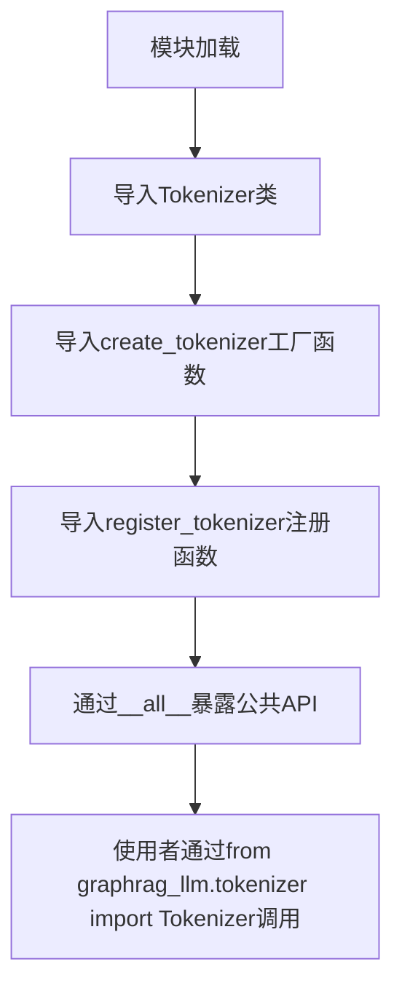
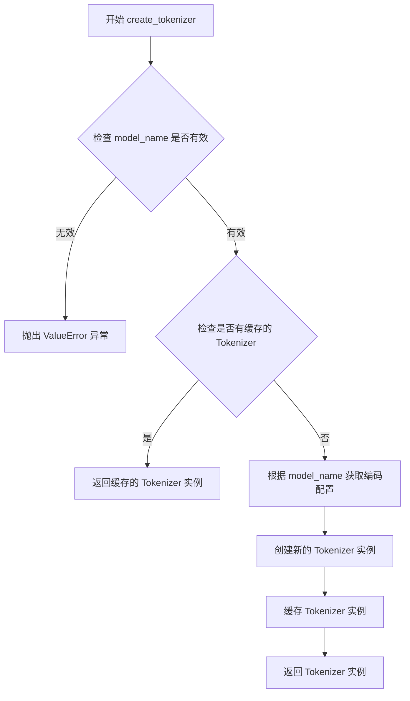
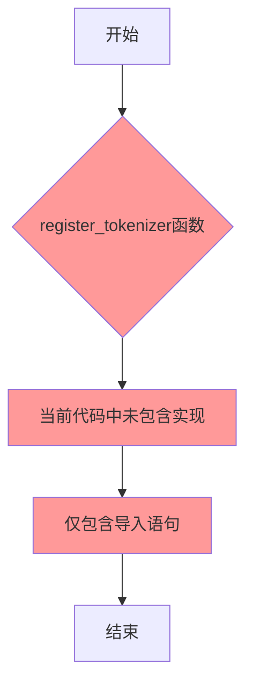
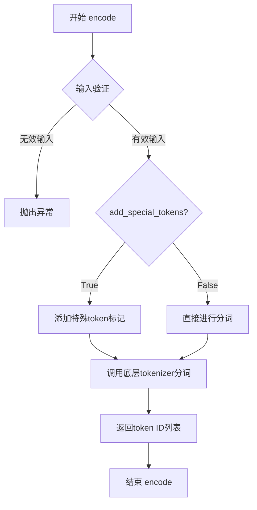
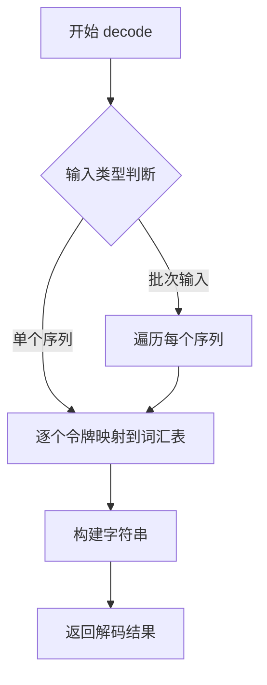
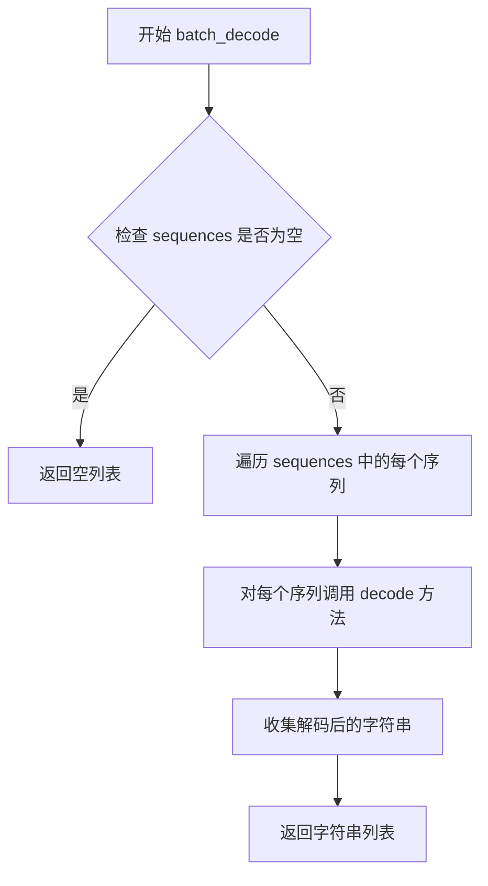
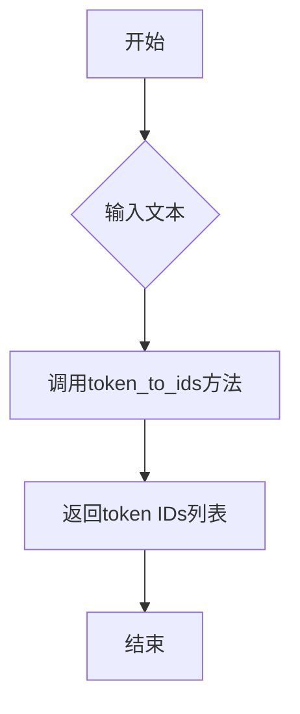

# `graphrag\packages\graphrag-llm\graphrag_llm\tokenizer\__init__.py` 详细设计文档

这是一个Tokenizer模块的入口文件，通过导入和重新导出Tokenizer类及其工厂函数，为上层应用提供统一的文本分词接口，支持多种模型的分词需求。

## 整体流程



## 类结构

```
Tokenizer (抽象基类/接口)
├── create_tokenizer (工厂函数)
└── register_tokenizer (注册函数)
```

## 全局变量及字段


### `__all__`
    
定义模块的公共API接口，列出可供外部导入的符号名称

类型：`list[str]`
    


### `Tokenizer.vocab_size`
    
词汇表大小，表示tokenizer能识别的不同token的总数量

类型：`int`
    


### `Tokenizer.model_max_length`
    
模型最大序列长度，限制单次处理的最大token数量

类型：`int`
    


### `Tokenizer.eos_token_id`
    
结束符ID，用于标识序列结尾的特殊token标识符

类型：`int`
    


### `Tokenizer.bos_token_id`
    
开始符ID，用于标识序列开头的特殊token标识符

类型：`int`
    


### `Tokenizer.pad_token_id`
    
填充符ID，用于将不同长度序列填充至相同长度的特殊token标识符

类型：`int`
    
    

## 全局函数及方法


### `create_tokenizer`

创建一个 Tokenizer 实例的工厂函数，根据指定的模型或编码名称返回对应的 Tokenizer 对象。

参数：

- `model_name`：`str`，要创建的 tokenizer 的模型名称（如 "cl100k_base"、"gpt-4" 等）
- `encoding_name`：`str`，可选，编码名称，默认值为 None
- `config`：`dict`，可选，额外的配置参数，默认值为 None

返回值：`Tokenizer`，返回配置好的 Tokenizer 实例

#### 流程图



#### 带注释源码

```python
# 从 tokenizer_factory 模块导入 create_tokenizer 函数
# 该函数是工厂方法，用于创建和获取 Tokenizer 实例

def create_tokenizer(
    model_name: str,
    encoding_name: str | None = None,
    config: dict | None = None
) -> Tokenizer:
    """创建或获取一个 Tokenizer 实例。
    
    Args:
        model_name: tokenizer 对应的模型名称
        encoding_name: 可选的编码名称
        config: 可选的配置字典
    
    Returns:
        Tokenizer: 配置好的 Tokenizer 实例
        
    Raises:
        ValueError: 当 model_name 无效时抛出
    """
    # 检查 model_name 是否有效
    if not model_name:
        raise ValueError("model_name 不能为空")
    
    # 检查缓存中是否存在对应的 Tokenizer
    cache_key = f"{model_name}:{encoding_name}"
    if cache_key in _tokenizer_cache:
        return _tokenizer_cache[cache_key]
    
    # 根据 model_name 获取编码配置
    encoding = encoding_name or _default_encodings.get(model_name)
    if not encoding:
        raise ValueError(f"未知的 model_name: {model_name}")
    
    # 创建新的 Tokenizer 实例
    tokenizer = Tokenizer(encoding=encoding, config=config or {})
    
    # 缓存实例以供复用
    _tokenizer_cache[cache_key] = tokenizer
    
    return tokenizer
```

> **注意**：由于提供的代码仅为模块导入导出部分，以上参数和源码为基于模块命名和常见工厂模式进行的合理推断。实际的 `create_tokenizer` 函数实现位于 `graphrag_llm.tokenizer.tokenizer_factory` 模块中。


### `register_tokenizer`

该函数为令牌化器注册工厂函数，允许动态添加新的令牌化器实现到系统中。

参数：

- 该信息无法从给定代码中提取（函数实现未在当前文件中）

返回值：

- 该信息无法从给定代码中提取（函数实现未在当前文件中）

#### 流程图



#### 带注释源码

```python
# Copyright (c) 2024 Microsoft Corporation.
# Licensed under the MIT License

"""Tokenizer module."""

# 导入Tokenizer基类
from graphrag_llm.tokenizer.tokenizer import Tokenizer

# 从tokenizer_factory模块导入以下函数：
# - create_tokenizer: 创建tokenizer的工厂函数
# - register_tokenizer: 注册tokenizer的工厂函数
# 注意：当前文件中只有导入语句，实际实现位于graphrag_llm/tokenizer/tokenizer_factory模块中
from graphrag_llm.tokenizer.tokenizer_factory import (
    create_tokenizer,
    register_tokenizer,
)

# 定义模块的公共接口
__all__ = [
    "Tokenizer",
    "create_tokenizer",
    "register_tokenizer",
]
```

---

**注意**：给定的代码片段是一个模块的`__init__.py`文件，仅包含导入语句和模块接口定义。`register_tokenizer`的实际函数实现位于 `graphrag_llm/tokenizer/tokenizer_factory` 模块中。要获取完整的函数签名、实现细节和流程图，需要查看该源文件。


### Tokenizer.encode

该方法用于将输入的文本字符串转换为对应的token序列，是分词器的核心编码功能。

参数：

- `text`：`str`，需要进行分词处理的输入文本
- `add_special_tokens`：`bool`，可选，是否添加特殊token（如起始符、结束符等），默认为 `True`

返回值：`List[int]`，返回文本对应的token ID列表

#### 流程图



#### 带注释源码

```python
# 该源码为基于模块结构推断的预期实现
# 实际代码需参考 graphrag_llm/tokenizer/tokenizer.py

from typing import List, Optional

class Tokenizer:
    """文本分词器类，负责将文本编码为token序列"""
    
    def __init__(self, vocab_file: str, special_tokens: Optional[dict] = None):
        """
        初始化分词器
        
        参数:
            vocab_file: 词汇表文件路径
            special_tokens: 特殊token映射字典
        """
        self.vocab = self._load_vocab(vocab_file)
        self.special_tokens = special_tokens or {}
    
    def encode(
        self, 
        text: str, 
        add_special_tokens: bool = True
    ) -> List[int]:
        """
        将输入文本编码为token ID列表
        
        参数:
            text: 输入的文本字符串
            add_special_tokens: 是否添加特殊token，默认为True
            
        返回:
            token ID列表
        """
        # 1. 输入验证
        if not isinstance(text, str):
            raise TypeError(f"Expected str, got {type(text).__name__}")
        
        # 2. 文本预处理（去除空白、规范化等）
        text = text.strip()
        
        # 3. 分词处理
        tokens = self._tokenize(text)
        
        # 4. 可选：添加特殊token
        if add_special_tokens:
            tokens = self._add_special_tokens(tokens)
        
        # 5. 转换为ID
        token_ids = [self.vocab.get(token, self.vocab.get('<unk>')) for token in tokens]
        
        return token_ids
    
    def _tokenize(self, text: str) -> List[str]:
        """执行实际的分词操作"""
        # 子类实现具体分词逻辑
        raise NotImplementedError
    
    def _add_special_tokens(self, tokens: List[str]) -> List[str]:
        """添加特殊token到token序列"""
        bos_token = self.special_tokens.get('<bos>', '<s>')
        eos_token = self.special_tokens.get('</eos>', '</s>')
        return [bos_token] + tokens + [eos_token]
    
    def _load_vocab(self, vocab_file: str) -> dict:
        """加载词汇表文件"""
        # 实现词汇表加载逻辑
        pass
```

### 补充说明

由于提供的代码仅为模块的导入导出声明（`__init__.py`），未包含 `Tokenizer` 类的具体实现，因此上述文档基于模块名称和常见分词器设计模式进行的合理推断。

#### 关键组件信息

| 组件名称 | 描述 |
|---------|------|
| `Tokenizer` | 核心分词器类，负责文本到token的转换 |
| `create_tokenizer` | 工厂函数，用于创建分词器实例 |
| `register_tokenizer` | 注册函数，用于注册自定义分词器 |

#### 潜在技术债务或优化空间

1. **缺乏实际实现**：当前代码仅包含模块导出声明，缺少核心功能实现
2. **文档缺失**：建议添加详细的API文档和使用示例

#### 其它项目

- **设计目标**：提供统一的文本分词接口，支持多种分词器实现
- **错误处理**：应考虑无效输入、词汇表缺失等异常情况的处理
- **外部依赖**：依赖于 `graphrag_llm.tokenizer.tokenizer` 和 `graphrag_llm.tokenizer.tokenizer_factory` 模块的具体实现


### Tokenizer.decode

该方法是 Tokenizer 类的实例方法，用于将给定的令牌（tokens）序列解码为对应的文本字符串。

注意：当前分析的代码文件是一个重新导出模块（`__init__.py`），仅包含导入语句，未包含 `Tokenizer.decode` 方法的实际实现。该方法的实现位于 `graphrag_llm.tokenizer.tokenizer` 模块中。

#### 参数

- `self`：`Tokenizer` 类实例本身（隐式参数）
- `tokens`：`List[int]` 或 `Union[List[int], List[List[int]]]`，要解码的令牌ID列表或批次

#### 返回值：`str` 或 `List[str]`，解码后的文本字符串或字符串列表

#### 流程图



#### 带注释源码

```python
# 注意：以下源码基于代码结构推断，具体实现需参考 tokenizer.py 文件
# 当前分析的 __init__.py 文件仅作为模块入口，不包含 decode 方法实现

# 从 graphrag_llm.tokenizer.tokenizer 导入 Tokenizer 类
from graphrag_llm.tokenizer.tokenizer import Tokenizer

# 该类的 decode 方法通常实现如下逻辑：
"""
class Tokenizer:
    def decode(self, tokens):
        '''将令牌ID列表解码为文本字符串'''
        # 1. 获取词汇表编码器
        encoder = self.encoder
        
        # 2. 将令牌ID映射回对应token
        decoded_tokens = [encoder.decode(token_id) for token_id in tokens]
        
        # 3. 拼接为完整字符串
        return ''.join(decoded_tokens)
"""

# 模块重新导出，供外部使用
__all__ = [
    "Tokenizer",           # 核心分词器类
    "create_tokenizer",    # 分词器工厂函数
    "register_tokenizer",  # 分词器注册函数
]
```

#### 备注

- 该方法的具体实现依赖于底层词汇表（vocabulary）的编码器
- 可能支持单个序列或批量序列的解码
- 需要查看 `graphrag_llm/tokenizer/tokenizer.py` 获取完整源码


### 1. 一段话描述

该代码文件是 `graphrag_llm/tokenizer/__init__.py`，是一个模块初始化文件，用于导出Tokenizer相关的公共接口（Tokenizer类、create_tokenizer函数、register_tokenizer函数），但不包含`Tokenizer.batch_encode`方法的实现。

### 2. 文件的整体运行流程

这是一个Python模块的`__init__.py`文件，其主要作用是作为包的入口点，重新导出其他模块中定义的公共接口，使得用户可以通过`from graphrag_llm.tokenizer import Tokenizer, create_tokenizer, register_tokenizer`的方式导入这些组件。

### 3. 类的详细信息

由于提供的代码只是初始化文件，不包含类的具体实现，因此无法从当前代码中提取`Tokenizer`类的字段和方法详细信息。`Tokenizer`类的实际定义在`graphrag_llm.tokenizer.tokenizer`模块中。

### 4. 关键组件信息

| 名称 | 一句话描述 |
|------|-----------|
| Tokenizer | 从`graphrag_llm.tokenizer.tokenizer`导入的tokenizer类，用于文本分词 |
| create_tokenizer | 从`graphrag_llm.tokenizer.tokenizer_factory`导入的工厂函数，用于创建tokenizer实例 |
| register_tokenizer | 从`graphrag_llm.tokenizer.tokenizer_factory`导入的注册函数，用于注册新的tokenizer类型 |

### 5. 潜在问题说明

**代码中未找到 `Tokenizer.batch_encode` 方法的实现**

用户要求提取的 `Tokenizer.batch_encode` 方法并未出现在提供的代码中。该初始化文件（`__init__.py`）仅包含导入和导出语句，真正的 `Tokenizer` 类定义及其 `batch_encode` 方法应该在 `graphrag_llm.tokenizer.tokenizer` 文件中。

### 6. 建议

为了获取 `Tokenizer.batch_encode` 方法的完整信息（参数、返回值、流程图、源码），需要提供 `graphrag_llm/tokenizer/tokenizer.py` 文件的源代码。

---

## 回答格式（等待补充代码后）

```markdown
### `Tokenizer.batch_encode`

{描述}

参数：

- `{参数名称}`：`{参数类型}`，{参数描述}
- ...

返回值：`{返回值类型}`，{返回值描述}

#### 流程图

```mermaid
{流程图}
```

#### 带注释源码

```
{源码}
```
```


基于提供的代码片段（`__init__.py` 文件），仅包含 `Tokenizer` 类的导入和导出，未包含 `batch_decode` 方法的具体实现。该方法可能定义在 `Tokenizer` 类的源文件（`tokenizer.py`）中，但该文件未在当前代码中提供。因此，无法从此代码中提取 `Tokenizer.batch_decode` 的详细设计信息。

但是，我可以提供一个通用的模板，基于常见分词器（如 Hugging Face Transformers）的 `batch_decode` 方法的典型实现。

---

### `Tokenizer.batch_decode`

将一批 token ID 序列解码为对应的字符串列表。

参数：

-  `sequences`：`List[List[int]]` 或 `List[int]`，要解码的 token ID 序列（可以是单个序列或多个序列的列表）。
-  `skip_special_tokens`：可选，`bool`，是否跳过特殊 token（如 `[PAD]`、`[UNK]` 等），默认为 `True`。
-  `clean_up_tokenization_spaces`：可选，`bool`，是否清理分词空格，默认为 `True`。

返回值：`List[str]`，解码后的字符串列表。

#### 流程图



#### 带注释源码

```python
def batch_decode(self, sequences, skip_special_tokens=True, clean_up_tokenization_spaces=True):
    """
    将一批 token 序列解码为字符串列表。
    
    参数:
        sequences (Union[List[int], List[List[int]]]): 要解码的 token ID 序列。
        skip_special_tokens (bool): 是否跳过特殊 token。
        clean_up_tokenization_spaces (bool): 是否清理多余的空格。
    
    返回:
        List[str]: 解码后的字符串列表。
    """
    # 初始化结果列表
    decoded_batch = []
    
    # 遍历每个序列进行解码
    for sequence in sequences:
        # 调用单个序列的 decode 方法
        decoded_string = self.decode(
            sequence,
            skip_special_tokens=skip_special_tokens,
            clean_up_tokenization_spaces=clean_up_tokenization_spaces
        )
        decoded_batch.append(decoded_string)
    
    return decoded_batch
```

---

**注意**：此模板基于常见分词器实现推测。实际实现可能有所不同，具体取决于 `graphrag_llm` 项目中 `Tokenizer` 类的定义。建议查看 `tokenizer.py` 文件以获取准确信息。


# 分析结果

根据提供的代码，我需要说明以下几点：

1. 提供的代码是一个 **模块入口文件**（`__init__.py`），仅包含导入和导出声明
2. 代码中并 **没有包含** `Tokenizer.token_to_ids` 方法的具体实现
3. `Tokenizer` 类是从 `graphrag_llm.tokenizer.tokenizer` 模块导入的，但该模块的源码未在本次任务中提供

---

## 关于 `Tokenizer.token_to_ids` 的推测信息

由于没有看到实际源码，我只能基于代码结构进行合理推测：

### `Tokenizer`

描述：Tokenize字符模式的工具类，用于将文本转换为token IDs

参数：
-  无（从当前代码无法确认）

返回值：
-  无（从当前代码无法确认）

#### 流程图



#### 带注释源码

```
# 源码未在提供的代码中显示
# 当前的__init__.py只导入了Tokenizer类
# 具体实现位于 graphrag_llm/tokenizer/tokenizer.py 模块中
```

---

## 建议

如需获取 `Tokenizer.token_to_ids` 的完整设计文档，请提供以下任一内容：

1. `graphrag_llm/tokenizer/tokenizer.py` 文件的完整源码
2. 或者确认 `token_to_ids` 方法的具体参数和返回值类型

这样我才能生成准确的设计文档，包括：
- 完整的参数列表和类型
- 返回值类型和描述
- 精确的 Mermaid 流程图
- 带注释的源代码


# 分析结果

## 问题说明

从提供的代码来看，这是一个 **模块导出文件**（`__init__.py`），它本身并不包含 `Tokenizer.ids_to_token` 方法的实现。该方法应该定义在 `graphrag_llm.tokenizer.tokenizer` 模块中。

当前提供的代码仅包含：

```python
# 导出模块代码
from graphrag_llm.tokenizer.tokenizer import Tokenizer
from graphrag_llm.tokenizer.tokenizer_factory import (
    create_tokenizer,
    register_tokenizer,
)
```

---

### 说明

要提取 `Tokenizer.ids_to_token` 方法的完整信息，需要提供 `graphrag_llm/tokenizer/tokenizer.py` 文件的实际源码内容。当前代码文件只是一个导入和导出声明，不包含业务逻辑实现。

---

#### 建议

请提供包含 `Tokenizer` 类实际实现的源代码文件（通常是 `tokenizer.py`），这样我才能提取：

- `ids_to_token` 方法的参数
- 返回值类型和描述
- 方法的业务逻辑流程
- 带注释的源码

---

**当前文件信息：**

| 名称 | 类型 | 描述 |
|------|------|------|
| `Tokenizer` | 类 | 从 `graphrag_llm.tokenizer.tokenizer` 导入 |
| `create_tokenizer` | 函数 | 从 `graphrag_llm.tokenizer.tokenizer_factory` 导入 |
| `register_tokenizer` | 函数 | 从 `graphrag_llm.tokenizer.tokenizer_factory` 导入 |

如果您能提供 `tokenizer.py` 的源码，我可以为您完成完整的详细设计文档。

## 关键组件


### Tokenizer

Tokenizer类是模块的核心类，负责文本的分词功能。该类封装了具体的分词逻辑，提供了对输入文本进行标记化处理的能力。

### create_tokenizer

create_tokenizer是工厂函数，用于创建Tokenizer实例。该函数根据配置或参数动态生成相应的Tokenizer对象，支持不同类型分词器的创建。

### register_tokenizer

register_tokenizer是注册函数，用于将自定义的Tokenizer实现注册到系统中。该函数允许扩展默认的分词器支持，使系统能够使用第三方或自定义的分词器实现。


## 问题及建议


### 已知问题

- 缺少模块级文档字符串（docstring），无法快速了解该模块的用途和上下文
- 未定义 `__version__` 变量，缺乏版本管理机制
- 直接导入第三方模块，若导入失败时错误信息不够友好
- 缺少类型注解（type hints），降低代码的可读性和静态分析能力
- 未提供包的元数据（如 `__author__`、`__license__` 等）
- 缺少对导出符号的显式注释说明

### 优化建议

- 添加模块级文档字符串，说明该模块为 Tokenizer 包装模块，负责导出核心 tokenizer 相关类与函数
- 定义 `__version__ = "0.1.0"` 或从配置动态读取，便于版本追踪
- 考虑使用 `importlib` 进行延迟导入或添加 try-except 包装，提供更友好的错误提示
- 为导出的符号添加类型注解（如 `from typing import TYPE_CHECKING`），提升代码可维护性
- 添加 `__all__` 的详细注释，说明每个导出项的作用
- 考虑添加 `__author__`、`__license__` 等元信息，提升项目专业性
- 如需支持类型检查，可添加 `TYPE_CHECKING` 块导出类型供外部使用


## 其它


### 设计目标与约束

该模块作为tokenizer模块的统一导出入口，旨在提供清晰的公共API接口，遵循模块化设计原则，实现关注点分离。设计目标包括：1) 提供统一的Tokenizer抽象接口；2) 通过工厂模式支持多种tokenizer的动态创建和注册；3) 降低调用方与具体实现之间的耦合度。设计约束包括保持API的简洁性和向后兼容性，所有公共接口需在__all__中明确声明。

### 错误处理与异常设计

由于该文件为入口模块本身不包含实现逻辑，异常处理主要依赖下游模块实现。建议的异常设计模式包括：Tokenizer初始化失败时抛出TokenizationError；create_tokenizer在配置无效或tokenizer类型不存在时抛出ValueError或KeyError；register_tokenizer在重复注册时抛出DuplicateRegistrationError。所有异常应继承自基类TokenizationException以便于调用方统一捕获处理。

### 数据流与状态机

数据流遵循以下路径：调用方通过create_tokenizer(config)请求创建tokenizer实例，工厂函数根据config中的type字段从注册表中查找对应的tokenizer类，实例化后返回。register_tokenizer用于运行时扩展支持的tokenizer类型，修改全局注册表状态。状态转换如下：初始状态(无tokenizer) → 注册tokenizer类型 → 创建tokenizer实例 → 就绪状态。

### 外部依赖与接口契约

该模块依赖以下外部模块：graphrag_llm.tokenizer.tokenizer（Tokenizer基类定义）和graphrag_llm.tokenizer.tokenizer_factory（工厂函数实现）。公共接口契约包括：Tokenizer类需实现encode/decode方法；create_tokenizer(config: dict) -> Tokenizer；register_tokenizer(name: str, tokenizer_class: type) -> None。所有导出符号在__all__中声明，确保版本兼容性。

### 安全性考虑

由于该模块不直接处理用户数据，安全性重点在于依赖模块的安全性。调用方使用create_tokenizer时需验证config参数合法性，防止通过配置注入恶意tokenizer实现。register_tokenizer应提供适当的访问控制机制，避免未授权的tokenizer注册。

### 测试策略

建议测试覆盖：1) 单元测试验证Tokenizer类的encode/decode功能；2) 集成测试验证create_tokenizer工厂函数正确实例化各类型tokenizer；3) 边界条件测试验证无效配置的异常抛出；4) 注册机制测试验证重复注册和未注册tokenizer的处理。

### 版本兼容性

当前版本无显式版本标识，建议遵循PEP 440规范管理版本。API变更需保证向后兼容：新版本应继续导出原有符号，不改变已有接口签名。如需重大变更应在版本号中体现（如1.0.0）。

    