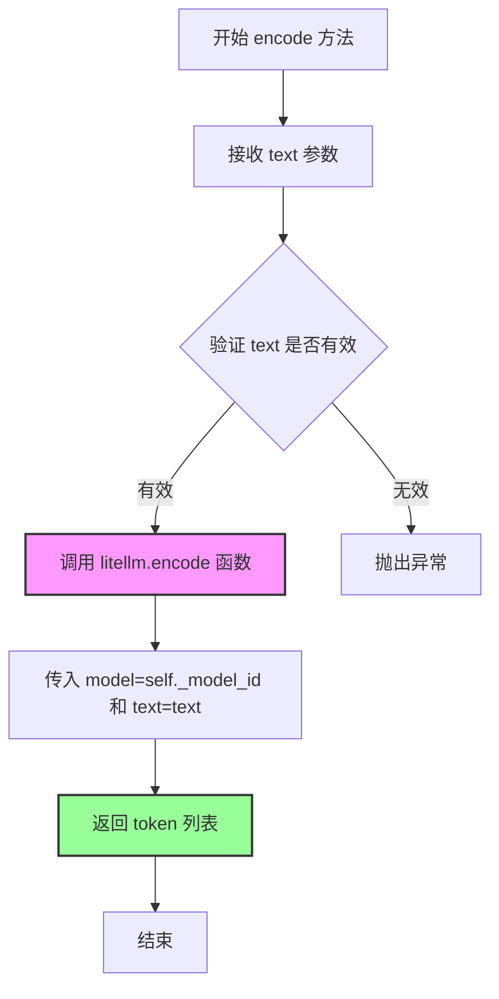
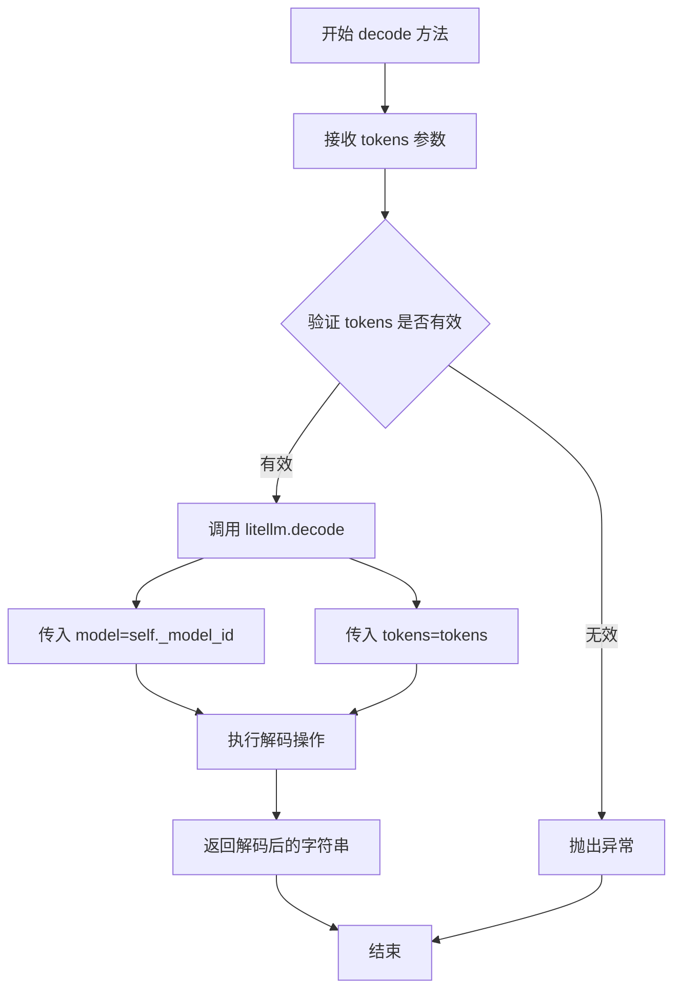
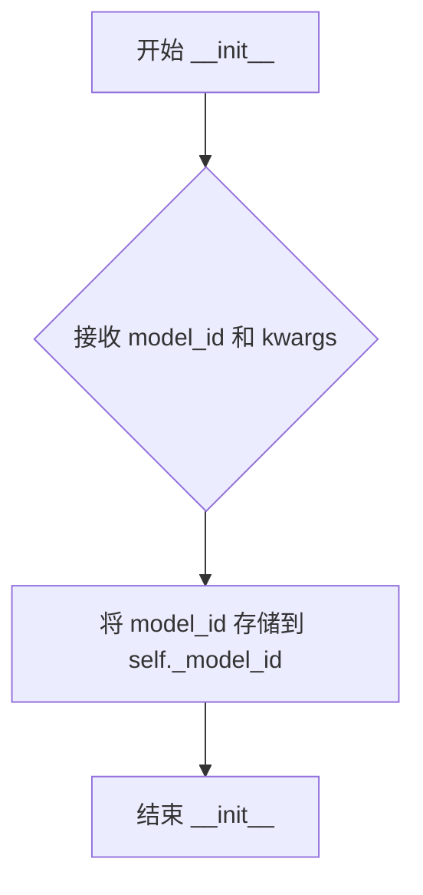
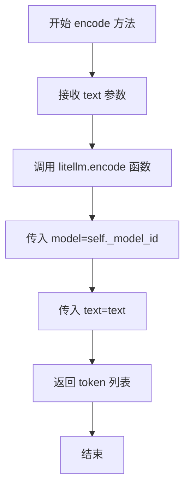

# `graphrag\packages\graphrag-llm\graphrag_llm\tokenizer\lite_llm_tokenizer.py` 详细设计文档

这是一个基于LiteLLM库的文本分词器实现，继承自Tokenizer基类，通过LiteLLM的encode和decode方法实现文本与token之间的相互转换，支持任意LiteLLM模型ID的分词操作。

## 整体流程

```mermaid
graph TD
    A[开始] --> B[初始化LiteLLMTokenizer]
    B --> C{调用encode或decode}
    C --> D[encode: 文本转token]
    C --> E[decode: token转文本]
    D --> F[调用litellm.encode方法]
    E --> G[调用litellm.decode方法]
    F --> H[返回list[int] tokens]
    G --> I[返回str文本]
```

## 类结构

```
Tokenizer (抽象基类)
└── LiteLLMTokenizer (LiteLLM分词器实现)
```

## 全局变量及字段


### `LiteLLMTokenizer._model_id`
    
LiteLLM模型ID

类型：`str`
    
    

## 全局函数及方法


### `LiteLLMTokenizer.encode`

该方法是 `LiteLLMTokenizer` 类的核心编码方法，继承自 `Tokenizer` 抽象基类。它接收一个文本字符串作为输入，通过调用 `litellm` 库的 `encode` 函数将文本转换为 token 列表，并返回该列表。

参数：

- `text`：`str`，要编码的输入文本

返回值：`list[int]`，编码后的 token 列表

#### 流程图



#### 带注释源码

```python
def encode(self, text: str) -> list[int]:
    """Encode the given text into a list of tokens.

    Args
    ----
        text: str
            The input text to encode.

    Returns
    -------
        list[int]: A list of tokens representing the encoded text.
    """
    # 调用 litellm 库的 encode 函数进行编码
    # model 参数指定使用的 LiteLLM 模型 ID
    # text 参数指定要编码的文本内容
    return encode(model=self._model_id, text=text)
```


### `LiteLLMTokenizer.decode`

该方法是 `LiteLLMTokenizer` 类的核心解码方法，用于将 Token 列表转换回原始文本字符串，通过调用 `litellm` 库的 `decode` 函数实现对特定语言模型的逆 Token 化操作。

参数：

- `tokens`：`list[int]`，待解码的 Token 整数列表

返回值：`str`，从 Token 列表还原出的文本字符串

#### 流程图



#### 带注释源码

```python
def decode(self, tokens: list[int]) -> str:
    """Decode a list of tokens back into a string.

    Args
    ----
        tokens: list[int]
            A list of tokens to decode.

    Returns
    -------
        str: The decoded string from the list of tokens.
    """
    # 调用 litellm 库的 decode 函数，传入模型 ID 和 Token 列表
    # model 参数指定使用的语言模型，不同模型有不同的词表和编码规则
    # tokens 参数是编码后的整数列表
    return decode(model=self._model_id, tokens=tokens)
```

---

## 完整文档

### 一段话描述

该代码实现了一个基于 LiteLLM 的 Tokenizer 封装类，通过调用 `litellm` 库的 `encode` 和 `decode` 函数，实现对文本的编码（Text→Tokens）和解码（Tokens→Text）功能，支持多种语言模型的 Token 化操作。

### 文件的整体运行流程

1. **导入依赖**：从 `litellm` 导入 `decode` 和 `encode` 函数，从自定义模块导入 `Tokenizer` 基类
2. **类初始化**：创建 `LiteLLMTokenizer` 实例时，传入 `model_id` 参数指定要使用的语言模型
3. **编码流程**：调用 `encode` 方法将文本转换为 Token 列表
4. **解码流程**：调用 `decode` 方法将 Token 列表还原为文本
5. **底层调用**：所有编解码操作均委托给 `litellm` 库执行

### 类的详细信息

#### 类字段

| 名称 | 类型 | 描述 |
|------|------|------|
| `_model_id` | `str` | 存储 LiteLLM 模型 ID，用于指定解码所使用的语言模型 |

#### 类方法

| 名称 | 参数 | 返回值 | 描述 |
|------|------|--------|------|
| `__init__` | `model_id: str`, `**kwargs: Any` | `None` | 初始化 Tokenizer，配置模型 ID |
| `encode` | `text: str` | `list[int]` | 将文本编码为 Token 列表 |
| `decode` | `tokens: list[int]` | `str` | 将 Token 列表解码为文本 |

### 关键组件信息

| 名称 | 描述 |
|------|------|
| `LiteLLMTokenizer` | 基于 LiteLLM 库的 Tokenizer 实现类 |
| `Tokenizer` | 抽象基类，定义 Tokenizer 的接口规范 |
| `litellm.decode` | 底层解码函数，负责实际的 Token 到文本转换 |
| `litellm.encode` | 底层编码函数，负责实际的文本到 Token 转换 |

### 潜在的技术债务或优化空间

1. **缺乏错误处理**：未对无效输入（如空列表、None 值、非整数元素）进行验证，可能导致运行时错误
2. **缺少缓存机制**：每次调用都重新加载模型配置，高频调用场景下性能可能受影响
3. **类型注解不完整**：`encode` 和 `decode` 函数使用 `# type: ignore` 忽略类型检查，可能导致静态分析困难
4. **无连接池管理**：依赖外部 `litellm` 服务，无重试机制和超时配置
5. **文档可改进**：缺少异常抛出说明和使用示例

### 其它项目

#### 设计目标与约束

- **设计目标**：提供统一的 Tokenizer 接口，屏蔽不同模型编码实现的差异
- **约束条件**：
  - 必须继承自 `Tokenizer` 抽象基类
  - 模型 ID 必须为有效的 LiteLLM 模型标识符（如 "openai/gpt-4o"）

#### 错误处理与异常设计

- 当前实现依赖 `litellm` 库的默认异常传播机制
- 建议添加输入验证：
  - `tokens` 不应为 `None` 或空列表
  - `tokens` 内部元素应为有效整数范围
  - 网络异常应有适当的超时和重试策略

#### 数据流与状态机

```
User Input (Text)
    ↓
encode() → Token List
    ↓
[Processing/Storage]
    ↓
decode() → Original Text
    ↓
User Output
```

#### 外部依赖与接口契约

| 依赖项 | 版本要求 | 用途 |
|--------|----------|------|
| `litellm` | 最新版 | 提供 `encode`/`decode` 函数 |
| `graphrag_llm.tokenizer` | - | 提供 `Tokenizer` 基类 |
| `typing` | 标准库 | 类型注解支持 |

#### 使用示例

```python
# 初始化 Tokenizer
tokenizer = LiteLLMTokenizer(model_id="openai/gpt-4o")

# 编码
text = "Hello, world!"
tokens = tokenizer.encode(text)  # 返回 [9906, 11, 14957, 0]

# 解码
decoded = tokenizer.decode(tokens)  # 返回 "Hello, world!"
```


### `LiteLLMTokenizer`

LiteLLMTokenizer 是一个基于 LiteLLM 的 Tokenizer 实现类，继承自抽象基类 Tokenizer，用于通过指定的 LiteLLM 模型对文本进行编码（encode）和解码（decode）操作。

参数：

- `model_id`：`str`，LiteLLM 模型 ID，例如 "openai/gpt-4o"，用于指定用于编解码的模型
- `**kwargs`：`Any`，可选的额外关键字参数（当前未使用）

返回值：`LiteLLMTokenizer` 实例

#### 流程图

```mermaid
graph TD
    A[创建 LiteLLMTokenizer 实例] --> B[设置 _model_id]
    
    C[encode 方法] --> C1[接收 text: str]
    C1 --> C2[调用 litellm.encode]
    C2 --> C3[返回 list[int]]
    
    D[decode 方法] --> D1[接收 tokens: list[int]]
    D1 --> D2[调用 litellm.decode]
    D2 --> D3[返回 str]
```

#### 带注释源码

```python
# 从 litellm 库导入 encode 和 decode 函数，用于文本与 token 的互转
from litellm import decode, encode  # type: ignore

# 从项目内部导入 Tokenizer 抽象基类，LiteLLMTokenizer 将继承该基类
from graphrag_llm.tokenizer.tokenizer import Tokenizer


class LiteLLMTokenizer(Tokenizer):
    """LiteLLM Tokenizer."""
    
    # 模型 ID 字段，存储用于编解码的 LiteLLM 模型标识
    _model_id: str

    def __init__(self, *, model_id: str, **kwargs: Any) -> None:
        """Initialize the LiteLLM Tokenizer.

        Args
        ----
            model_id: str
                The LiteLLM model ID, e.g., "openai/gpt-4o".
        """
        # 初始化时保存模型 ID
        self._model_id = model_id

    def encode(self, text: str) -> list[int]:
        """Encode the given text into a list of tokens.

        Args
        ----
            text: str
                The input text to encode.

        Returns
        -------
            list[int]: A list of tokens representing the encoded text.
        """
        # 调用 litellm 的 encode 函数，使用当前实例的模型 ID 进行编码
        return encode(model=self._model_id, text=text)

    def decode(self, tokens: list[int]) -> str:
        """Decode a list of tokens back into a string.

        Args
        ----
            tokens: list[int]
                A list of tokens to decode.

        Returns
        -------
            str: The decoded string from the list of tokens.
        """
        # 调用 litellm 的 decode 函数，使用当前实例的模型 ID 进行解码
        return decode(model=self._model_id, tokens=tokens)
```


### `LiteLLMTokenizer.__init__`

初始化 LiteLLM 分词器，接受模型 ID 并将其存储为实例属性。

参数：

- `model_id`：`str`，LiteLLM 模型标识符，例如 "openai/gpt-4o"（关键字参数）
- `**kwargs`：`Any`，额外的关键字参数，用于传递额外配置（可选）

返回值：`None`，构造函数无返回值

#### 流程图



#### 带注释源码

```python
def __init__(self, *, model_id: str, **kwargs: Any) -> None:
    """Initialize the LiteLLM Tokenizer.

    Args
    ----
        model_id: str
            The LiteLLM model ID, e.g., "openai/gpt-4o".
    """
    # 将传入的 model_id 存储为实例属性 _model_id
    # 供 encode 和 decode 方法使用
    self._model_id = model_id
```


### `LiteLLMTokenizer.encode`

将输入的文本字符串通过LiteLLM模型编码为对应的token ID列表。

参数：

- `text`：`str`，要编码的输入文本

返回值：`list[int]`，表示编码后的token ID列表

#### 流程图



#### 带注释源码

```python
def encode(self, text: str) -> list[int]:
    """Encode the given text into a list of tokens.

    Args
    ----
        text: str
            The input text to encode.

    Returns
    -------
        list[int]: A list of tokens representing the encoded text.
    """
    # 调用 litellm 库的 encode 函数，传入模型ID和文本
    # 返回编码后的 token 列表
    return encode(model=self._model_id, text=text)
```


### `LiteLLMTokenizer.decode`

将令牌列表解码为文本字符串。该方法接收一个整数令牌列表，通过调用 LiteLLM 库的 decode 函数将其转换回对应的文本内容。

参数：

- `tokens`：`list[int]`，要解码的令牌列表，每个元素为整数类型的令牌

返回值：`str`，从令牌列表解码后的文本字符串

#### 流程图

```mermaid
flowchart TD
    A[开始 decode] --> B[接收 tokens: list[int]]
    B --> C[调用 litellm.decode]
    C --> D[传入 model=self._model_id]
    C --> E[传入 tokens=token列表]
    E --> F[执行解码]
    F --> G[返回解码后的字符串]
    G --> H[结束 decode]
```

#### 带注释源码

```python
def decode(self, tokens: list[int]) -> str:
    """Decode a list of tokens back into a string.

    Args
    ----
        tokens: list[int]
            A list of tokens to decode.

    Returns
    -------
        str: The decoded string from the list of tokens.
    """
    # 调用 litellm 库的 decode 函数，将令牌列表解码为字符串
    # 参数 model: LiteLLM 模型标识符
    # 参数 tokens: 要解码的整数令牌列表
    return decode(model=self._model_id, tokens=tokens)
```

## 关键组件


### LiteLLMTokenizer 类

LiteLLMTokenizer 是对 LiteLLM 库编解码功能的封装类，提供了文本到令牌（tokens）的编码和令牌到文本的解码功能，充当 Tokenizer 抽象接口的具体实现。

### _model_id 字段

存储 LiteLLM 模型标识符，用于指定要使用的模型版本（如 "openai/gpt-4o"），决定了编解码所使用的分词器。

### encode 方法

将输入文本编码为令牌列表，调用 litellm 库的 encode 函数完成实际的编码工作。

### decode 方法

将令牌列表解码为原始文本字符串，调用 litellm 库的 decode 函数完成实际的解码工作。

### Tokenizer 抽象接口

定义了 Tokenizer 的抽象接口规范，要求子类实现 encode 和 decode 方法，提供了统一的分词器抽象。


## 问题及建议


### 已知问题

-   **缺少错误处理**：`encode` 和 `decode` 方法直接调用 `litellm` 的 `encode`/`decode` 函数，没有任何 try-except 块来捕获网络异常、API 错误或无效输入，可能导致程序直接崩溃
-   **无效的参数验证**：`model_id` 参数没有进行有效性检查（如空字符串、None 值），若传入无效 model_id，错误信息不够友好
-   **未调用父类构造函数**：继承自 `Tokenize` 基类但未调用 `super().__init__()`，可能导致基类初始化逻辑被跳过
-   **未使用的参数**：`__init__` 方法接收 `**kwargs: Any` 参数但完全未使用，造成代码冗余
-   **缺少类型注解一致性**：使用 Python 内置的 `list[int]` 类型注解（Python 3.9+），但项目可能需要兼容更低版本 Python
-   **硬编码依赖**：直接导入并调用 `litellm` 的 `encode`/`decode` 函数，未进行抽象或依赖注入，导致单元测试困难，无法 mock 外部依赖
-   **缺少缓存机制**：每次调用都直接调用外部 API，没有考虑token编码结果的缓存，尤其在重复处理相同文本时影响性能

### 优化建议

-   **添加错误处理**：为 `encode` 和 `decode` 方法添加 try-except 块，捕获并处理可能的异常，提供明确的错误信息和降级策略
-   **参数验证**：在 `__init__` 方法中添加 `model_id` 的有效性验证，检查非空且符合预期格式，抛出有意义的 `ValueError`
-   **调用父类构造函数**：添加 `super().__init__(**kwargs)` 调用，确保基类正确初始化
-   **移除未使用参数**：如果 `**kwargs` 确实不需要，直接移除，保持接口简洁
-   **统一类型注解**：使用 `from typing import List` 增强兼容性，或明确声明支持的 Python 版本
-   **依赖注入**：通过构造函数或属性注入 tokenizer 逻辑，便于单元测试和 mock，可考虑实现接口或使用工厂模式
-   **添加缓存机制**：考虑使用 `functools.lru_cache` 或自定义缓存层来缓存常见文本的编码结果，提升性能

## 其它


### 设计目标与约束

本模块的设计目标是提供一个统一的Tokenizer接口抽象，通过LiteLLM库实现文本的编码和解码功能，支持任意LiteLLM支持的模型。核心约束包括：必须实现Tokenizer基类定义的所有接口方法；model_id参数必须指向有效的LiteLLM模型标识；依赖litellm库的encode和decode函数进行实际的编解码操作。

### 错误处理与异常设计

本模块的错误处理主要依赖litellm库自身抛出的异常。当model_id无效或不存在时，encode和decode方法会向上传播litellm抛出的异常。调用方需要处理可能的异常情况，如网络错误、模型不支持、API密钥无效等。建议在调用层捕获通用异常并进行具体错误类型判断。

### 外部依赖与接口契约

主要外部依赖为litellm库（提供encode和decode函数）和graphrag_llm.tokenizer.tokenizer.Tokenizer基类。接口契约方面：encode方法接受str类型文本返回list[int]类型的token列表；decode方法接受list[int]类型的token列表返回str类型的文本。model_id必须在初始化时提供且不为空。

### 性能考虑

本模块的性能主要取决于litellm库的encode和decode函数实现和网络延迟。对于大规模文本处理，建议在调用方实现批处理机制或缓存机制以提高性能。当前实现为同步调用，未包含异步支持。

### 线程安全性

encode和decode方法本身为无状态方法，但model_id存储在实例属性中。在多线程环境下使用同一实例时是安全的，因为_model_id为只读属性不涉及竞态条件。但建议每个线程使用独立的Tokenizer实例以避免潜在的共享状态问题。

### 配置说明

model_id为必需配置参数，格式为"provider/model-name"，例如"openai/gpt-4o"、"anthropic/claude-3-opus"等。具体支持的模型列表需参考LiteLLM官方文档。kwargs参数用于传递额外的literml配置选项，如API密钥、基础URL等。

### 使用示例

```python
# 初始化tokenizer
tokenizer = LiteLLMTokenizer(model_id="openai/gpt-4o")

# 编码文本
text = "Hello, world!"
tokens = tokenizer.encode(text)
print(f"Tokens: {tokens}")

# 解码tokens
decoded_text = tokenizer.decode(tokens)
print(f"Decoded: {decoded_text}")
```

### 版本历史

初始版本（2024）实现基本的encode和decode功能，遵循Tokenizer抽象接口。

    