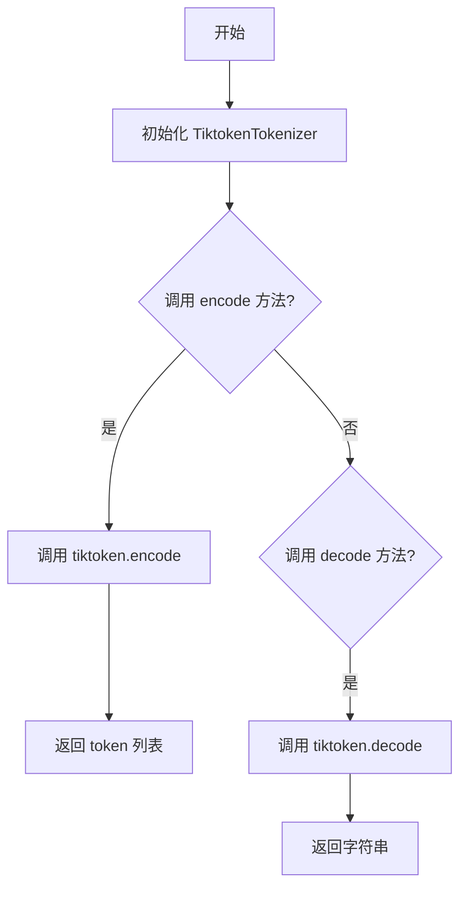
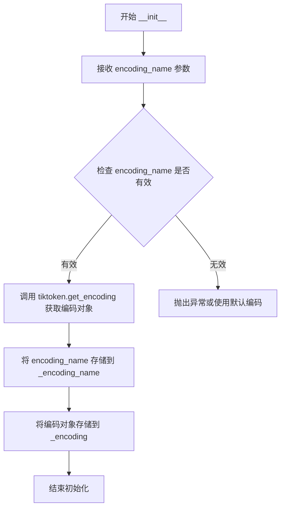
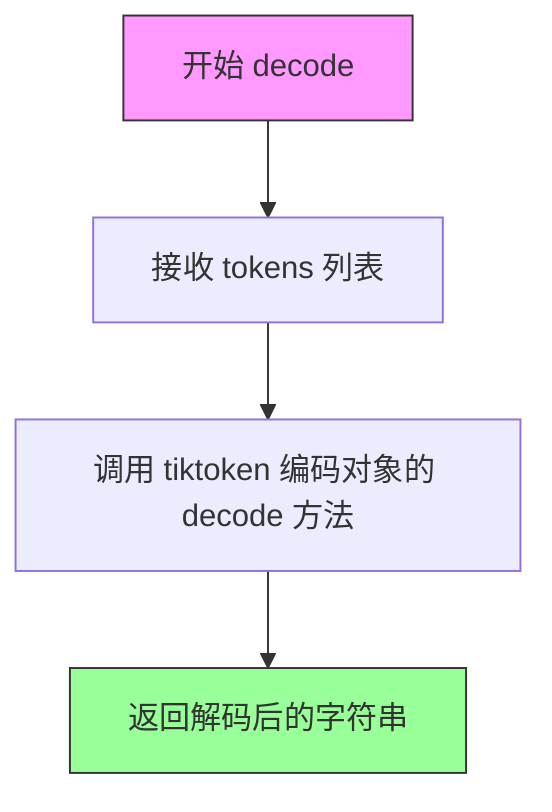

# `graphrag\packages\graphrag-llm\graphrag_llm\tokenizer\tiktoken_tokenizer.py` 详细设计文档

基于tiktoken库的文本分词器实现，继承自Tokenizer基类，提供文本到token的编码和token到文本的解码功能。

## 整体流程



## 类结构

```
Tokenizer (抽象基类/接口)
└── TiktokenTokenizer (具体实现类)
```

## 全局变量及字段


### `TiktokenTokenizer._encoding_name`
    
存储编码名称，如'gpt-4o'

类型：`str`
    


### `TiktokenTokenizer._encoding`
    
tiktoken编码对象，用于实际编解码操作

类型：`tiktoken.Encoding`
    
    

## 全局函数及方法


### `TiktokenTokenizer.__init__`

初始化 Tiktoken 分词器，设置编码名称并通过 tiktoken 库获取对应的编码对象供后续编码/解码使用。

参数：

- `encoding_name`：`str`，编码名称，例如 "gpt-4o"、"cl100k_base" 等 tiktoken 支持的编码格式
- `**kwargs`：`Any`，其他可选关键字参数（当前未使用，保留用于未来扩展）

返回值：`None`，构造函数无返回值，仅初始化实例属性

#### 流程图



#### 带注释源码

```python
def __init__(self, *, encoding_name: str, **kwargs: Any) -> None:
    """Initialize the Tiktoken Tokenizer.

    Args
    ----
        encoding_name: str
            The encoding name, e.g., "gpt-4o".
    """
    # 将传入的编码名称保存到实例变量 _encoding_name
    # 注意：encoding_name 前面的 * 表示该参数只能作为关键字参数传入
    self._encoding_name = encoding_name
    
    # 调用 tiktoken 库的 get_encoding 方法获取编码对象
    # tiktoken.get_encoding 会根据 encoding_name 返回对应的编码器实例
    # 该编码对象包含 encode() 和 decode() 方法用于文本与token的相互转换
    self._encoding = tiktoken.get_encoding(encoding_name)
```


### `TiktokenTokenizer.encode`

将输入的文本字符串通过 tiktoken 编码器转换为对应的 token ID 列表，是文本分词的核心方法。

参数：

- `text`：`str`，需要进行编码的输入文本

返回值：`list[int]`，表示编码后的 token ID 列表

#### 流程图

```mermaid
flowchart TD
    A[开始 encode] --> B[输入: text str]
    B --> C{调用 self._encoding.encode}
    C --> D[执行 tiktoken 编码]
    D --> E[输出: tokens list[int]]
    E --> F[结束 encode]
```

#### 带注释源码

```python
def encode(self, text: str) -> list[int]:
    """Encode the given text into a list of tokens.

    Args
    ----
        text: str
            The input text to encode.

    Returns
    -------
        list[int]: A list of tokens representing the encoded text.
    """
    # 调用 tiktoken 编码器的 encode 方法，将文本转换为 token ID 列表
    # self._encoding 是在 __init__ 中通过 tiktoken.get_encoding(encoding_name) 初始化的
    return self._encoding.encode(text)
```


### `TiktokenTokenizer.decode`

将 token 列表解码为对应的字符串文本。

参数：

- `tokens`：`list[int]`，要解码的 token 列表

返回值：`str`，从 token 列表解码得到的字符串

#### 流程图



#### 带注释源码

```python
def decode(self, tokens: list[int]) -> str:
    """Decode a list of tokens back into a string.

    Args
    ----
        tokens: list[int]
            A list of tokens to decode.

    Returns
    -------
        str: The decoded string from the list of tokens.
    """
    # 使用 tiktoken 编码对象的 decode 方法将 token 列表转换为字符串
    # decode 方法内部调用 tiktoken 库的解码逻辑
    return self._encoding.decode(tokens)
```

#### 说明

该方法是 `TiktokenTokenizer` 类的核心方法之一，负责将整数 token 列表转换回原始文本。它内部调用了 `tiktoken` 库的 `decode` 方法完成实际的解码工作。该方法是 `encode` 方法的逆操作，共同构成了完整的文本编解码功能。

## 关键组件


### TiktokenTokenizer 类

这是代码的核心类，继承自Tokenizer基类，封装了tiktoken库的编码功能，提供文本与token之间的相互转换能力。

### tiktoken.get_encoding 函数

全局函数，用于根据编码名称获取对应的tiktoken编码器实例。

### _encoding 字段

类型：tiktoken.Encoding

缓存tiktoken编码器实例，避免重复创建。

### _encoding_name 字段

类型：str

存储编码名称，用于标识所使用的分词方案。

### encode 方法

将输入文本编码为token列表。

### decode 方法

将token列表解码为文本字符串。

### Tokenizer 抽象基类

定义分词器的抽象接口，规定encode和decode方法的标准签名。


## 问题及建议


### 已知问题

- **错误处理缺失**：`tiktoken.get_encoding()` 在传入无效 `encoding_name` 时会抛出异常，但构造函数未做验证和异常捕获，可能导致程序崩溃
- **类型提示不精确**：`encode` 方法的返回值类型仅为 `list[int]`，未标注元素取值范围；`**kwargs: Any` 未明确允许哪些参数
- **资源管理缺陷**：未实现 `__del__` 或上下文管理器接口，无法确保 Encoding 对象被正确释放
- **并发安全性未知**：未说明 `tiktoken.Encoding` 对象是否线程安全，多线程环境下直接共享实例可能导致问题

### 优化建议

- 添加 `try-except` 捕获 `ValueError` 等异常，提供有意义的错误信息或回退机制
- 使用 `typing.List[int]` 并添加类型常量约束；明确定义 `kwargs` 的允许参数
- 考虑实现 `__enter__`/`__exit__` 方法或添加 `close()` 方法以支持资源清理
- 添加线程安全注释或使用线程本地存储（threading.local）保证并发安全
- 考虑添加 `@lru_cache` 或类级别缓存相同 `encoding_name` 的 Encoding 实例，减少重复创建开销

## 其它


### 设计目标与约束

本模块旨在提供一个统一的Tokenizer抽象接口的具体实现，使用tiktoken库进行高效的文本编码和解码。设计目标包括：保持与基类Tokenizer接口的一致性、支持多种编码格式（如gpt-4o等）、提供轻量级的tokenize能力。约束条件包括：依赖tiktoken库、仅支持tiktoken支持的编码格式、编码名称必须在tiktoken中注册。

### 错误处理与异常设计

本类主要依赖tiktoken库的异常机制。当传入无效的encoding_name时，tiktoken.get_encoding()会抛出KeyError或其他相关异常。建议在调用方进行异常捕获和处理，或在文档中明确说明有效的编码名称列表。当前实现未进行额外的错误处理，属于透明传递tiktoken异常的设计模式。

### 外部依赖与接口契约

主要外部依赖为tiktoken库，需要确保tiktoken已正确安装。接口契约方面：本类继承自Tokenizer基类，必须实现encode()和decode()两个抽象方法。encode()方法接收str类型文本，返回list[int]类型的token列表；decode()方法接收list[int]类型的token列表，返回str类型的解码文本。encoding_name参数为必需参数，用于指定具体的编码格式。

### 性能考虑

encode()和decode()方法的时间复杂度由tiktoken库决定，通常为O(n)。_encoding在初始化时创建并缓存，避免重复创建。大量文本处理时建议批量操作以减少调用开销。

### 安全性考虑

本模块不直接处理敏感数据，但作为文本处理组件，应注意：输入文本需确保来源可信；decode()方法输出的字符串应进行适当的输入验证（如防止XSS等场景）。

### 测试策略

建议包含以下测试用例：使用有效编码名称初始化、验证encode()和decode()的互逆性、使用无效编码名称触发异常、使用空字符串和空列表边界条件测试、验证与基类接口的兼容性。

### 配置管理

encoding_name通过构造函数参数传入，属于必需配置项。建议在文档中列出支持的编码名称列表（如cl100k_base、gpt-4o等），便于使用者正确配置。

### 版本兼容性

需要确保tiktoken库的版本兼容性。不同版本的tiktoken可能支持不同的编码名称列表。建议在项目依赖中锁定tiktoken版本，并记录测试通过的版本范围。

### 使用示例

```python
# 初始化tokenizer
tokenizer = TiktokenTokenizer(encoding_name="gpt-4o")

# 编码文本
text = "Hello, world!"
tokens = tokenizer.encode(text)
print(f"Tokens: {tokens}")

# 解码 tokens
decoded_text = tokenizer.decode(tokens)
print(f"Decoded: {decoded_text}")
```

    