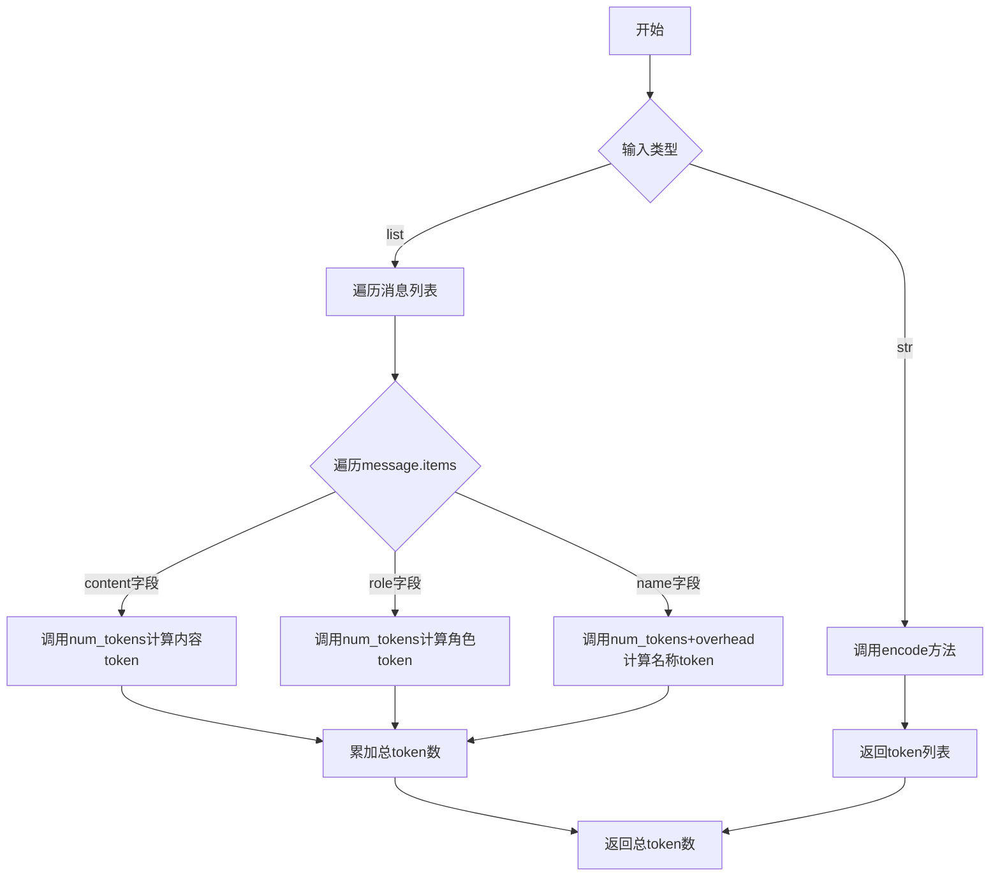
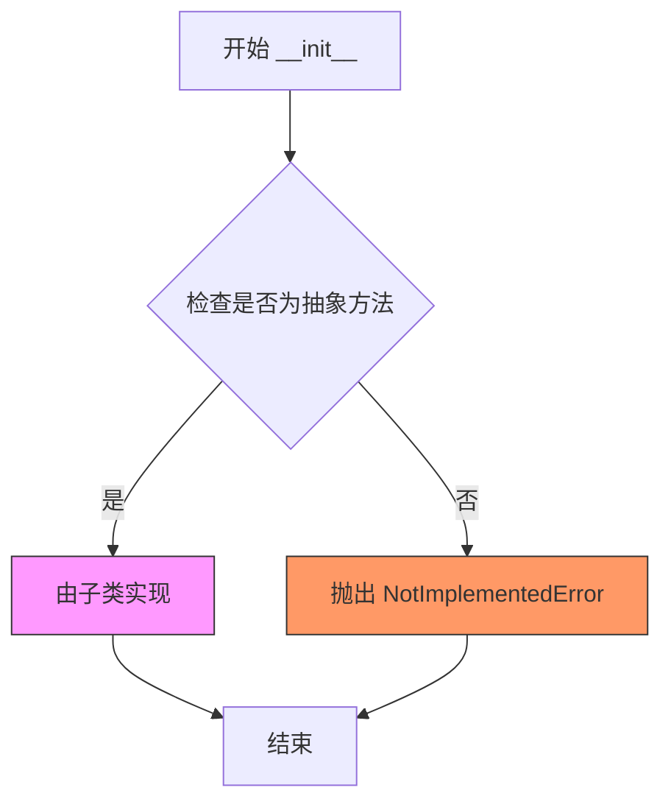
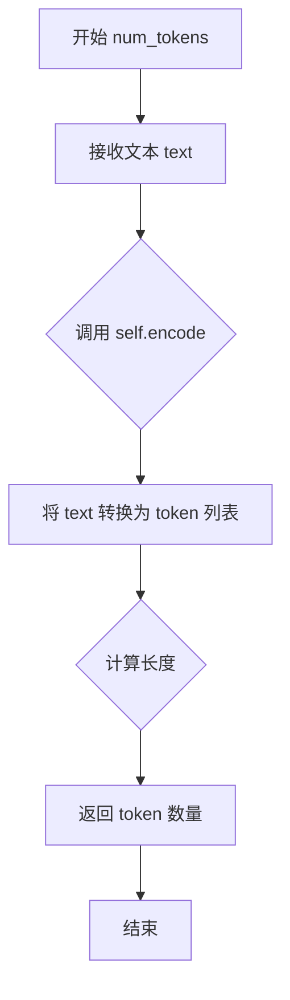

# `graphrag\packages\graphrag-llm\graphrag_llm\tokenizer\tokenizer.py` 详细设计文档

这是一个抽象的Tokenizer基类，提供了文本编码为token、token解码为文本、以及统计文本和提示词中token数量的通用接口，供具体实现类继承并实现具体的编解码逻辑。

## 整体流程



## 类结构

```
Tokenizer (抽象基类)
├── __init__ (抽象方法)
├── encode (抽象方法)
├── decode (抽象方法)
├── num_prompt_tokens (具体方法)
└── num_tokens (具体方法)
```

## 全局变量及字段


### `total_tokens`
    
累计的总token数量，包含固定开销

类型：`int`
    


### `tokens_per_message`
    
每条消息的固定token开销，值为3

类型：`int`
    


### `tokens_per_name`
    
每个name字段的固定token开销，值为1

类型：`int`
    


### `text`
    
需要编码或计算token数的输入文本

类型：`str`
    


### `tokens`
    
编码后的token列表或待解码的token列表

类型：`list[int]`
    


### `messages`
    
LLM消息列表或字符串，用于计算prompt的token数

类型：`LLMCompletionMessagesParam`
    


### `message`
    
单条消息对象或字典

类型：`dict | Message`
    


### `key`
    
消息字典中的键名

类型：`str`
    


### `value`
    
消息字典中键对应的值

类型：`Any`
    


### `part`
    
消息内容列表中的单个内容块

类型：`dict`
    


    

## 全局函数及方法


### `Tokenizer.__init__`

这是 Tokenizer 抽象基类的初始化方法，采用抽象方法设计，用于初始化具体的 Tokenizer 实现类。该方法接受任意关键字参数，具体实现由子类完成。

参数：

- `**kwargs`：`Any`，可变关键字参数，用于传递 Tokenizer 初始化所需的配置参数，具体参数由子类实现决定

返回值：`None`，该方法不返回值，仅用于对象初始化

#### 流程图



#### 带注释源码

```python
@abstractmethod
def __init__(self, **kwargs: Any) -> None:
    """Initialize the LiteLLM Tokenizer.
    
    这是一个抽象方法，具体实现由子类完成。
    使用 **kwargs 允许子类定义所需的任意初始化参数，
    提供了良好的扩展性。
    
    Args:
        **kwargs: Any - 可变关键字参数，用于传递初始化配置
        
    Returns:
        None - 该方法不返回值
    """
```


### `Tokenizer.encode`

将输入文本编码为token列表的抽象方法，由子类实现具体编码逻辑。

参数：

- `text`：`str`，要编码的输入文本

返回值：`list[int]`，表示编码文本的token列表

#### 流程图

```mermaid
flowchart TD
    A[开始 encode] --> B{检查text是否有效}
    B -->|有效| C[调用子类实现的编码逻辑]
    B -->|无效| D[抛出异常]
    C --> E[返回token列表 list[int]]
    D --> E
```

#### 带注释源码

```python
@abstractmethod
def encode(self, text: str) -> list[int]:
    """Encode the given text into a list of tokens.

    Args
    ----
        text: str
            The input text to encode.

    Returns
    -------
        list[int]: A list of tokens representing the encoded text.
    """
    raise NotImplementedError
```


### `Tokenizer.decode`

将令牌列表解码为字符串的抽象方法，由子类实现具体解码逻辑。

参数：

- `self`：Tokenizerself，解码器实例
- `tokens`：`list[int]`，要解码的令牌列表

返回值：`str`，从令牌列表解码得到的字符串

#### 流程图

```mermaid
flowchart TD
    A[开始] --> B[接收 tokens: list[int]]
    B --> C{子类实现解码逻辑}
    C --> D[返回 decoded_string: str]
    D --> E[结束]
    
    style C fill:#f9f,stroke:#333,stroke-width:2px
    style D fill:#9f9,stroke:#333,stroke-width:2px
```

#### 带注释源码

```python
@abstractmethod
def decode(self, tokens: list[int]) -> str:
    """Decode a list of tokens back into a string.

    Args
    ----
        tokens: list[int]
            A list of tokens to decode.

    Returns
    -------
        str: The decoded string from the list of tokens.
    """
    raise NotImplementedError
```


### `Tokenizer.num_prompt_tokens`

计算给定模型的提示信息中的token数量。统计消息中角色(role)、名称(name)和内容(content)所使用的token数量，基于OpenAI的token计算方式建模。

参数：

- `messages`：`LLMCompletionMessagesParam`，组成提示的消息。可以是字符串或消息字典列表。

返回值：`int`，提示中的token总数。

#### 流程图

```mermaid
flowchart TD
    A[开始] --> B[初始化 total_tokens = 3]
    B --> C[初始化 tokens_per_message = 3]
    C --> D[初始化 tokens_per_name = 1]
    D --> E{判断 messages 是否为字符串?}
    E -->|是| F[返回 num_tokens + total_tokens + tokens_per_message + tokens_per_name]
    E -->|否| G[遍历每条消息]
    G --> H[total_tokens += tokens_per_message]
    H --> I{消息是否为字典?}
    I -->|否| J[转换为字典 model_dump]
    I -->|是| K[遍历消息的键值对]
    J --> K
    K --> L{键 == 'content'?}
    L -->|是| M{value 是字符串?}
    L -->|否| N{键 == 'role'?}
    M -->|是| O[total_tokens += num_tokens(value)]
    M -->|否| P{value 是列表?}
    O --> Q[继续下一条消息]
    P -->|是| R[遍历列表中的每个部分]
    P -->|否| Q
    R --> S{部分是字典且包含 'text'?}
    S -->|是| T[total_tokens += num_tokens[part['text']]]
    S -->|否| Q
    N -->|是| U[total_tokens += num_tokens(str(value))]
    N -->|否| V{键 == 'name'?}
    V -->|是| W[total_tokens += num_tokens(str(value)) + tokens_per_name]
    V -->|否| Q
    Q --> X{还有更多消息?}
    X -->|是| H
    X -->|否| Y[返回 total_tokens]
    F --> Z[结束]
    Y --> Z
```

#### 带注释源码

```python
def num_prompt_tokens(
    self,
    messages: "LLMCompletionMessagesParam",
) -> int:
    """Count the number of tokens in a prompt for a given model.

    Counts the number of tokens used for roles, names, and content in the messages.

    modeled after: https://github.com/openai/openai-cookbook/blob/main/examples/How_to_count_tokens_with_tiktoken.ipynb

    Args
    ----
        messages: LLMCompletionMessagesParam
            The messages comprising the prompt. Can either be a string or a list of message dicts.

    Returns
    -------
        int: The number of tokens in the prompt.
    """
    # OpenAI API 调用的固定开销（回复开始标记）
    total_tokens = 3  
    # 每条消息的固定开销（角色定义和消息分隔）
    tokens_per_message = 3  
    # 名称字段的额外开销
    tokens_per_name = 1  

    # 如果输入是字符串，直接计算其token数量并加上开销
    if isinstance(messages, str):
        return (
            self.num_tokens(messages)
            + total_tokens
            + tokens_per_message
            + tokens_per_name
        )

    # 遍历每条消息进行token计数
    for message in messages:
        # 累加每条消息的基础开销
        total_tokens += tokens_per_message
        
        # 兼容：如果是对象而非字典，转换为字典
        if not isinstance(message, dict):
            message = message.model_dump()
        
        # 遍历消息的各个字段（role, content, name等）
        for key, value in message.items():
            # 处理内容字段
            if key == "content":
                # 字符串类型直接计算token
                if isinstance(value, str):
                    total_tokens += self.num_tokens(value)
                # 列表类型（如多模态内容），处理其中的text部分
                elif isinstance(value, list):
                    for part in value:
                        if isinstance(part, dict) and "text" in part:
                            total_tokens += self.num_tokens(part["text"])
            # 处理角色字段
            elif key == "role":
                total_tokens += self.num_tokens(str(value))
            # 处理名称字段，需要额外加上名称开销
            elif key == "name":
                total_tokens += self.num_tokens(str(value)) + tokens_per_name
    
    return total_tokens
```


### `Tokenizer.num_tokens`

该方法接收一段文本作为输入，通过调用内部的 `encode` 方法将文本转换为 token 列表，然后返回该列表的长度（即 token 的数量）。

参数：

-  `text`：`str`，需要分析其 token 数量的输入文本

返回值：`int`，输入文本所包含的 token 数量

#### 流程图



#### 带注释源码

```python
def num_tokens(self, text: str) -> int:
    """Return the number of tokens in the given text.

    Args
    ----
        text: str
            The input text to analyze.

    Returns
    -------
        int: The number of tokens in the input text.
    """
    # 调用 encode 方法将文本编码为 token 列表
    # 然后使用 len() 函数获取列表长度作为 token 数量
    return len(self.encode(text))
```

## 关键组件


### Tokenizer抽象基类

定义tokenizer的抽象接口基类，提供了文本编码、解码以及token数量计算的核心功能，是所有具体tokenizer实现的标准接口。

### encode抽象方法

将输入文本字符串编码为token ID列表的抽象方法，由子类实现具体编码逻辑。

### decode抽象方法

将token ID列表解码为原始文本字符串的抽象方法，由子类实现具体解码逻辑。

### num_prompt_tokens方法

计算给定消息列表的prompt token总数，实现了OpenAI推荐的token计数逻辑，包含固定开销、角色、名称和内容部分的token计算，支持字符串和消息字典两种输入格式。

### num_tokens方法

返回给定文本的token数量，通过调用encode方法并返回编码后列表的长度来计算。

### LLMCompletionMessagesParam类型

从graphrag_llm.types导入的消息参数类型定义，用于描述LLM对话消息的结构，支持字符串或消息字典列表格式。


## 问题及建议


### 已知问题

-   **硬编码的 token 计算规则**：`num_prompt_tokens` 方法中的 `total_tokens = 3`、`tokens_per_message = 3`、`tokens_per_name = 1` 是基于特定模型（如GPT-4）的硬编码值，不适用于所有模型，缺乏灵活性和可配置性。
-   **字符串消息处理逻辑错误**：当 `messages` 是字符串时，方法中额外加了 `tokens_per_message` 和 `tokens_per_name`，但字符串消息不应包含这些开销。
-   **缺少类型注解**：`__init__` 方法的 `kwargs` 使用了宽泛的 `Any` 类型，缺少对具体参数类型的约束；缺少类属性定义。
-   **缺乏错误处理**：没有对 `messages` 格式的验证，如果传入无效格式可能导致运行时错误；`encode`/`decode` 的 `NotImplementedError` 抛出方式不标准。
-   **性能优化不足**：`num_tokens` 方法每次调用都会重新编码文本，如果对相同文本重复计数 token，会造成重复计算的性能开销。
-   **抽象定义不完整**：缺少对子类必须实现的属性的抽象定义（如 `name` 或 `模型类型`）。

### 优化建议

-   将 token 计算的常量提取为可选参数，允许调用者传入特定模型的 token 规则，或提供配置接口。
-   修正字符串消息的 token 计算逻辑，移除不必要的开销。
-   为 `__init__` 添加具体参数类型注解，定义抽象属性以约束子类。
-   在 `num_prompt_tokens` 中添加输入验证，检查 `messages` 的类型和结构。
-   考虑添加 token 缓存机制（如同一个文本的 token 计数结果进行缓存），或提供批量编码方法。
-   使用标准的 `raise NotImplementedError()` 而不带参数，并添加子类实现的示例或文档。

## 其它


### 设计目标与约束

1. **设计目标**：为语言模型提供统一的令牌化（Tokenization）接口，使得不同的tokenizer实现可以互换使用，同时提供通用的token计数功能以支持prompt长度计算和成本估算。

2. **设计约束**：
   - 必须继承自ABC（Abstract Base Class），强制子类实现encode和decode方法
   - encode方法必须接受str类型并返回list[int]类型
   - decode方法必须接受list[int]类型并返回str类型
   - 所有方法必须兼容Python 3.10+的类型注解
   - 必须支持TYPE_CHECKING以避免循环导入

### 错误处理与异常设计

1. **NotImplementedError**：encode和decode方法在基类中抛出NotImplementedError，强制子类实现具体逻辑

2. **TypeError**：当传入的messages类型不符合预期（str或list）时，可能在迭代过程中引发类型错误

3. **AttributeError**：当message不是dict且没有model_dump()方法时可能引发异常

4. **建议改进**：
   - 在num_prompt_tokens方法中添加类型检查和异常处理
   - 对非标准格式的message提供更友好的错误提示
   - 考虑添加自定义异常类如TokenizerError

### 数据流与状态机

1. **编码流程**：text(str) → encode() → tokens(list[int])

2. **解码流程**：tokens(list[int]) → decode() → text(str)

3. **Token计数流程**：
   - 若输入为str：直接调用num_tokens计算
   - 若输入为list：遍历每个message，解析role、name、content字段，累加token数量

4. **状态机**：该类为无状态工具类，不维护内部状态，所有方法均为纯函数

### 外部依赖与接口契约

1. **依赖项**：
   - abc：Python内置抽象基类
   - typing：Python内置类型注解
   - graphrag_llm.types：LLMCompletionMessagesParam类型定义

2. **接口契约**：
   - 子类必须实现encode(text: str) -> list[int]
   - 子类必须实现decode(tokens: list[int]) -> str
   - num_tokens方法依赖encode方法的存在

3. **类型约束**：
   - LLMCompletionMessagesParam可以为str或list类型
   - message中的content字段可以为str或list类型

### 性能考量与优化空间

1. **潜在性能问题**：
   - num_tokens方法每次调用都会执行encode操作，重复计算相同文本的token数效率低下
   - num_prompt_tokens方法在处理大量messages时可能存在重复编码

2. **优化建议**：
   - 考虑添加缓存机制（lru_cache）存储已编码的文本结果
   - 可以预先计算固定token开销（total_tokens、tokens_per_message等）作为类属性
   - 建议在子类中实现缓存策略

### 扩展性与未来考虑

1. **多语言支持**：当前设计未考虑特殊语言或编码格式的处理

2. **流式处理**：缺少对流式输入的支持

3. **批量编码**：建议添加batch_encode和batch_decode方法以提升批量处理效率

4. **配置化**：可考虑在__init__中添加max_length等配置参数

    