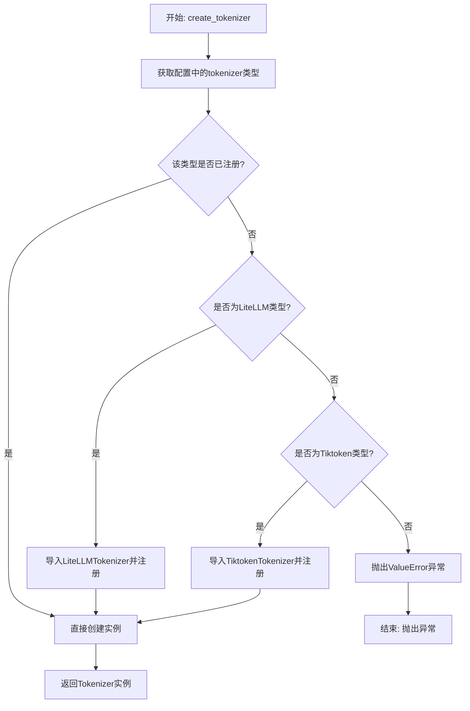
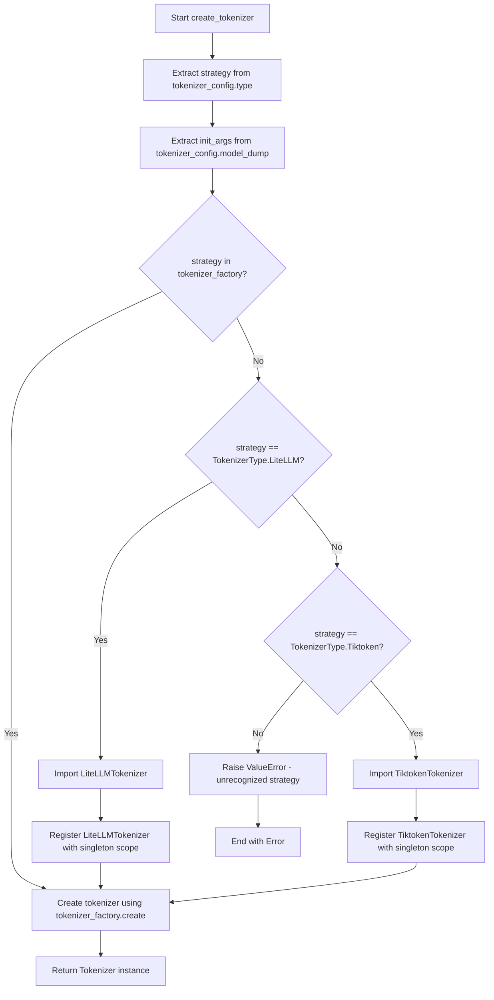
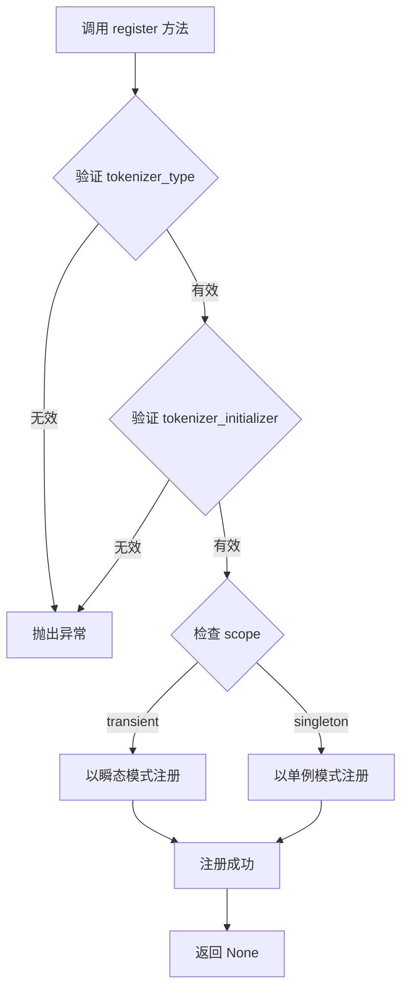
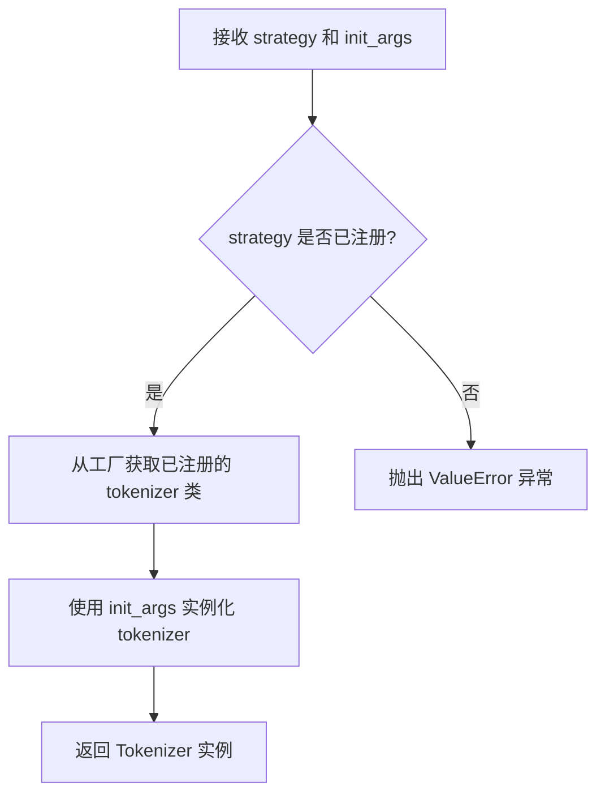
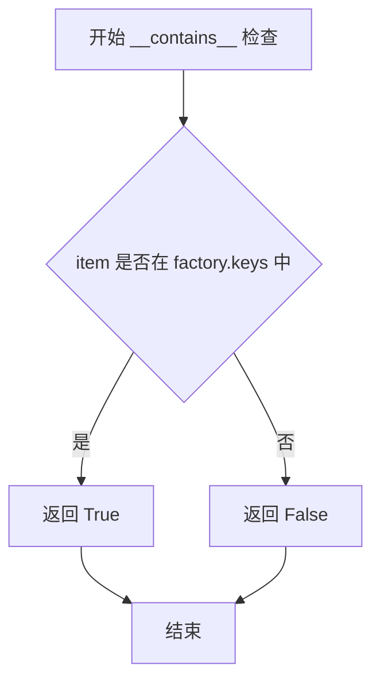

# `graphrag\packages\graphrag-llm\graphrag_llm\tokenizer\tokenizer_factory.py` 详细设计文档

这是一个Tokenizer工厂模块，通过工厂模式和注册机制动态创建不同类型的Tokenizer实例（如LiteLLM、Tiktoken等），支持自定义tokenizer的注册和按需加载。

## 整体流程



## 类结构

```
Factory (抽象基类)
└── TokenizerFactory (Tokenizer工厂类)

相关依赖类:
├── Tokenizer (抽象基类)
├── LiteLLMTokenizer (LiteLLM实现)
├── TiktokenTokenizer (Tiktoken实现)
└── TokenizerConfig (配置类)
```

## 全局变量及字段


### `tokenizer_factory`
    
Tokenizer工厂的单例实例，用于注册和创建不同类型的Tokenizer实现（如LiteLLM、Tiktoken等）

类型：`TokenizerFactory`
    


    

## 全局函数及方法


### `register_tokenizer`

注册自定义的 tokenizer 实现到 TokenizerFactory 工厂中，以便根据配置创建相应的 Tokenizer 实例。

参数：

- `tokenizer_type`：`str`，要注册的 tokenizer 类型标识符
- `tokenizer_initializer`：`Callable[..., Tokenizer]`， tokenizer 的初始化函数
- `scope`：`ServiceScope`，服务作用域，默认为 `"transient"`（可选值：`"transient"` | `"singleton"`）

返回值：`None`，无返回值

#### 流程图

```mermaid
flowchart TD
    A[开始 register_tokenizer] --> B[接收 tokenizer_type]
    B --> C[接收 tokenizer_initializer]
    C --> D[接收 scope 参数]
    D --> E{scope 是否为 None?}
    E -->|是| F[使用默认值 "transient"]
    E -->|否| G[使用传入的 scope]
    F --> H[调用 tokenizer_factory.register]
    G --> H
    H --> I[在工厂中注册 tokenizer_type 与 tokenizer_initializer]
    I --> J[结束，返回 None]
```

#### 带注释源码

```python
def register_tokenizer(
    tokenizer_type: str,
    tokenizer_initializer: Callable[..., Tokenizer],
    scope: "ServiceScope" = "transient",
) -> None:
    """Register a custom tokenizer implementation.

    Args
    ----
        tokenizer_type: str
            The tokenizer id to register.
        tokenizer_initializer: Callable[..., Tokenizer]
            The tokenizer initializer to register.
        scope: ServiceScope, optional
            The service scope for the tokenizer, defaults to "transient".
            Can be "transient" or "singleton".
    """
    # 将 tokenizer 类型、初始化器和作用域注册到工厂中
    tokenizer_factory.register(tokenizer_type, tokenizer_initializer, scope)
```


### `create_tokenizer`

该函数根据提供的 `TokenizerConfig` 配置创建一个 Tokenizer 实例。它首先从配置中获取 tokenizer 类型，然后检查该类型是否已注册到工厂中；如果未注册，则根据类型动态导入并注册相应的 tokenizer 实现，最后通过工厂方法创建并返回 Tokenizer 实例。

参数：

- `tokenizer_config`：`TokenizerConfig`，用于配置 tokenizer 的参数，包含 tokenizer 类型和其他初始化参数

返回值：`Tokenizer`，返回创建的 Tokenizer 子类实例

#### 流程图



#### 带注释源码

```python
def create_tokenizer(tokenizer_config: "TokenizerConfig") -> Tokenizer:
    """Create a Tokenizer instance based on the configuration.

    Args
    ----
        tokenizer_config: TokenizerConfig
            The configuration for the tokenizer.

    Returns
    -------
        Tokenizer:
            An instance of a Tokenizer subclass.
    """
    # 从配置中获取 tokenizer 类型策略
    strategy = tokenizer_config.type
    
    # 将配置对象序列化为字典，作为初始化参数
    init_args = tokenizer_config.model_dump()

    # 检查该策略是否已在工厂中注册
    if strategy not in tokenizer_factory:
        # 根据不同的策略类型动态导入并注册对应的 tokenizer
        match strategy:
            case TokenizerType.LiteLLM:
                # 动态导入 LiteLLMTokenizer 实现类
                from graphrag_llm.tokenizer.lite_llm_tokenizer import (
                    LiteLLMTokenizer,
                )

                # 将 LiteLLMTokenizer 注册到工厂，使用单例模式
                register_tokenizer(
                    TokenizerType.LiteLLM,
                    LiteLLMTokenizer,
                    scope="singleton",
                )
            case TokenizerType.Tiktoken:
                # 动态导入 TiktokenTokenizer 实现类
                from graphrag_llm.tokenizer.tiktoken_tokenizer import (
                    TiktokenTokenizer,
                )

                # 将 TiktokenTokenizer 注册到工厂，使用单例模式
                register_tokenizer(
                    TokenizerType.Tiktoken,
                    TiktokenTokenizer,
                    scope="singleton",
                )
            case _:
                # 策略类型未识别，抛出详细的错误信息
                msg = f"TokenizerConfig.type '{strategy}' is not registered in the TokenizerFactory. Registered strategies: {', '.join(tokenizer_factory.keys())}"
                raise ValueError(msg)

    # 使用工厂模式创建 tokenizer 实例
    return tokenizer_factory.create(
        strategy=strategy,
        init_args=init_args,
    )
```


### TokenizerFactory.register

描述：`TokenizerFactory` 类继承自 `Factory` 基类，该方法用于将特定的 tokenizers 初始化器注册到工厂中，以便根据 tokenizer 类型创建相应的 Tokenizer 实例。

参数：

- `tokenizer_type`：`str`，tokenizer 的唯一标识符，用于后续创建时匹配（如 "LiteLLM"、"Tiktoken"）
- `tokenizer_initializer`：`Callable[..., Tokenizer]`，tokenizer 的初始化器或类构造函数，接受可变参数并返回 Tokenizer 实例
- `scope`：`str`，服务作用域，指定 tokenizers 的生命周期（"transient" 表示每次创建新实例，"singleton" 表示单例模式）

返回值：`None`，该方法仅执行注册操作，无返回值

#### 流程图



#### 带注释源码

```python
# 在 register_tokenizer 函数中调用 register 方法的示例
def register_tokenizer(
    tokenizer_type: str,
    tokenizer_initializer: Callable[..., Tokenizer],
    scope: "ServiceScope" = "transient",
) -> None:
    """注册一个自定义的 tokenizer 实现。
    
    Args:
        tokenizer_type: tokenizer 的唯一标识符
        tokenizer_initializer: tokenizer 的初始化器/类
        scope: 服务作用域，默认为瞬态模式
    """
    # 调用 Factory 基类的 register 方法进行注册
    # 该方法继承自 graphrag_common.factory.Factory 类
    tokenizer_factory.register(tokenizer_type, tokenizer_initializer, scope)


# 实际调用示例 - 注册 LiteLLM Tokenizer
register_tokenizer(
    TokenizerType.LiteLLM,      # tokenizer_type: "LiteLLM"
    LiteLLMTokenizer,           # tokenizer_initializer: LiteLLMTokenizer 类
    scope="singleton",          # scope: 单例模式
)

# 实际调用示例 - 注册 Tiktoken Tokenizer
register_tokenizer(
    TokenizerType.Tiktoken,     # tokenizer_type: "Tiktoken"
    TiktokenTokenizer,          # tokenizer_initializer: TiktokenTokenizer 类
    scope="singleton",          # scope: 单例模式
)
```


### TokenizerFactory.create

这是继承自 `Factory` 基类的方法，用于根据策略和初始化参数创建具体的 `Tokenizer` 实例。

参数：

-  `strategy`：`str`，tokenizer 类型标识符（如 "lite_llm" 或 "tiktoken"）
-  `init_args`：`dict[str, Any]`，用于初始化 tokenizer 的配置参数

返回值：`Tokenizer`，返回具体 tokenizer 子类的实例

#### 流程图



#### 带注释源码

```
# Factory 基类中的 create 方法实现（推断）
def create(self, strategy: str, init_args: dict[str, Any]) -> Tokenizer:
    """根据策略和初始化参数创建 Tokenizer 实例。

    Args:
        strategy: str
            Tokenizer 类型标识符，对应注册时的 key
        init_args: dict[str, Any]
            传递给 tokenizer 构造函数的参数

    Returns:
        Tokenizer:
            具体 Tokenizer 子类的实例
    """
    # 从注册表中获取 strategy 对应的 tokenizer 类
    tokenizer_class = self._registry[strategy]
    
    # 使用 init_args 实例化 tokenizer
    return tokenizer_class(**init_args)
```


### `TokenizerFactory.keys`

获取工厂中已注册的所有 Tokenizer 类型的键（标识符）列表。

参数：此方法无参数

返回值：`list[str]`，返回已注册的 tokenizer 类型标识符列表，可用于迭代或检查某个策略是否已注册。

#### 流程图

```mermaid
flowchart TD
    A[调用 tokenizer_factory.keys] --> B{Factory 基类实现}
    B --> C[返回内部注册表中所有键的列表]
    C --> D[示例: ['lite_llm', 'tiktoken']]
```

#### 带注释源码

```python
# keys 方法继承自 Factory 基类
# 在 graphrag_common/factory.py 中定义（假设）
# 以下是基于代码中调用方式的推断实现

# 实际调用处（在 create_tokenizer 函数中）:
# Registered strategies: {', '.join(tokenizer_factory.keys())}

# 推断的基类方法签名:
def keys(self) -> list[str]:
    """Return a list of all registered strategy keys.
    
    Returns:
        list[str]: A list of tokenizer type identifiers that have been
                   registered with the factory.
    """
    # 返回内部注册表的键列表
    # 可能是 dict_keys 或 list 类型
    return list(self._strategies.keys()) if hasattr(self, '_strategies') else []
```

> **注意**: 由于 `keys` 方法定义在 `Factory` 基类（来自 `graphrag_common.factory` 模块）中，而该基类的源码未在当前代码片段中提供，上述源码是基于代码中调用方式（`tokenizer_factory.keys()`）和 Python 工厂模式的常见实现方式进行的合理推断。该方法通常返回已注册的所有策略名称的集合。


### `TokenizerFactory.__contains__`

该方法继承自父类 `Factory`，用于检查指定的 `tokenizer_type` 是否已在工厂中注册。`create_tokenizer` 函数中使用 `strategy not in tokenizer_factory` 表达式时会调用此方法来判断是否需要动态注册新的 tokenizer。

参数：

-  `item`：`str`，要检查的tokenizer类型标识符（如 "LiteLLM"、"Tiktoken"）

返回值：`bool`，如果指定的tokenizer类型已在工厂中注册返回 `True`，否则返回 `False`

#### 流程图



#### 带注释源码

由于 `__contains__` 方法继承自父类 `Factory`，在当前代码文件中未显式定义。该方法通常通过调用内部的 `keys()` 方法实现，示例逻辑如下：

```python
# 继承自 Factory 基类的方法，未在此文件中显式定义
# 其实现逻辑大致如下：

def __contains__(self, item: str) -> bool:
    """检查指定的 tokenizer 类型是否已注册。
    
    Args:
        item: str - 要检查的tokenizer类型标识符
        
    Returns:
        bool - 如果已注册返回True，否则返回False
    """
    return item in self.keys()  # keys() 返回已注册的所有tokenizer类型列表
```

#### 在 `create_tokenizer` 中的使用

```python
# 使用示例：检查 strategy 是否已注册
if strategy not in tokenizer_factory:
    # 如果未注册，则动态注册新的 tokenizer 类型
    match strategy:
        case TokenizerType.LiteLLM:
            # ... 注册 LiteLLMTokenizer
        case TokenizerType.Tiktoken:
            # ... 注册 TiktokenTokenizer
```

#### 补充说明

| 项目 | 说明 |
|------|------|
| **定义位置** | 父类 `Factory` (来自 `graphrag_common.factory`) |
| **调用场景** | 在 `create_tokenizer` 函数中通过 `in` 操作符隐式调用 |
| **关联数据** | `tokenizer_factory.keys()` - 返回已注册的tokenizer类型列表 |
| **设计意图** | 实现惰性注册（Lazy Registration）模式，按需动态注册tokenizer实现 |


## 关键组件


### TokenizerFactory

工厂类，继承自Factory基类，用于创建Tokenizer实例的工厂模式实现。

### tokenizer_factory

全局工厂单例实例，用于管理tokenizer的注册和创建。

### register_tokenizer

全局注册函数，用于将自定义tokenizer实现注册到工厂中，支持指定作用域（transient/singleton）。

### create_tokenizer

核心创建函数，根据TokenizerConfig配置动态创建相应的Tokenizer实例，支持LiteLLM和Tiktoken两种策略的惰性注册与加载。

### TokenizerType 枚举

枚举类型，定义支持的tokenizer类型（LiteLLM、Tiktoken），作为策略模式的类型标识。

### Tokenizer 基类

抽象基类，定义tokenizer的统一接口规范，具体实现包括LiteLLMTokenizer和TiktokenTokenizer。

### 量化策略支持

通过工厂模式动态加载不同的tokenizer实现，支持在运行时根据配置选择合适的量化/非量化tokenizer策略。

### 惰性加载机制

在create_tokenizer中通过match-case实现按需导入和注册tokenizer模块，避免启动时加载所有依赖。


## 问题及建议


### 已知问题

- **重复的条件判断逻辑**：在 `create_tokenizer` 函数中，先判断 `if strategy not in tokenizer_factory`，然后在分支中又进行注册操作。这导致每次调用时都会先检查再注册，即使策略已经注册过，逻辑上有冗余。
- **类型注解不够精确**：`tokenizer_initializer: Callable[..., Tokenizer]` 使用 `...` 作为占位符，这不是标准的类型提示用法，缺乏明确的参数类型定义。
- **隐式的动态导入副作用**：在 `create_tokenizer` 中根据不同的 strategy 动态导入模块并注册，这种方式在模块级别导入了具体的 tokenizer 实现类，可能导致循环依赖或延迟加载问题。
- **缺少对已注册策略的 scope 控制**：在 `create_tokenizer` 中硬编码注册为 `scope="singleton"`，但没有考虑配置文件中可能指定的 scope 需求。
- **异常信息可以更友好**：虽然抛出了 ValueError 并列出了已注册的策略，但没有提供如何注册新策略的指引。

### 优化建议

- **重构注册逻辑**：将策略的注册移到工厂初始化阶段或模块加载时，避免在运行时每次调用都检查和注册。或者在注册前检查是否已存在，避免重复注册。
- **改进类型注解**：使用 `TypeVar` 定义泛型函数或使用 `Protocol` 来精确描述 `tokenizer_initializer` 的签名，例如 `Callable[[], Tokenizer]` 或定义具体的参数类型。
- **使用延迟导入优化**：将动态导入移至函数内部或使用更清晰的导入策略，确保只有实际使用的 tokenizer 才会被导入。
- **支持 scope 配置**：从 `TokenizerConfig` 中读取 scope 配置，或者提供参数允许调用者指定 scope，而不是硬编码。
- **增强错误信息**：在 ValueError 中添加如何注册自定义 tokenizer 的说明，或提供文档链接。

## 其它


### 设计目标与约束

本模块采用工厂模式实现Tokenizer实例的创建，支持运行时动态注册和选择不同的Tokenizer实现。设计目标包括：1) 提供统一的Tokenizer创建接口，隐藏具体实现细节；2) 支持可扩展的Tokenizer类型注册机制；3) 内置支持LiteLLM和Tiktoken两种常用Tokenizer；4) 支持依赖注入和服务作用域管理（transient/singleton）。约束条件：依赖graphrag_common的Factory基类，需要与TokenizerConfig配置类配合使用，且Tokenizer实现需符合统一的Tokenizer接口规范。

### 错误处理与异常设计

代码中主要通过ValueError异常处理未注册的Tokenizer类型。当传入的strategy不在工厂注册表中时，会抛出包含详细错误信息的ValueError，提示可用的注册策略列表。异常信息格式为：`"TokenizerConfig.type '{strategy}' is not registered in the TokenizerFactory. Registered strategies: {keys}"`。建议增加对tokenizer_initializer调用时的异常捕获，处理初始化失败的情况，并考虑定义专用的TokenizerException异常类以区分不同错误场景。

### 外部依赖与接口契约

主要外部依赖包括：1) `graphrag_common.factory.Factory`：工厂基类，提供注册和创建实例的核心逻辑；2) `graphrag_llm.config.types.TokenizerType`：枚举类型，定义支持的Tokenizer类型；3) `graphrag_llm.tokenizer.tokenizer.Tokenizer`：Tokenizer基类接口，所有具体实现需继承此类；4) `graphrag_llm.config.tokenizer_config.TokenizerConfig`：配置类，提供tokenizer类型和初始化参数。接口契约要求：Tokenizer实现类必须提供可调用接口（__call__或类似初始化方法），且返回对象需符合Tokenizer基类规范。

### 数据流与状态机

数据流如下：1) 调用方传入TokenizerConfig配置对象；2) create_tokenizer函数提取strategy类型和init_args参数；3) 检查该strategy是否已注册，未注册则尝试自动注册内置的LiteLLM或Tiktoken实现；4) 调用tokenizer_factory.create()方法创建实例，传入strategy和init_args；5) Factory内部根据scope（singleton/transient）决定是否复用已创建的实例；6) 返回Tokenizer实例供调用方使用。状态转换：首次创建时从未注册状态→已注册状态→已创建状态；singleton作用域下后续创建直接复用已创建实例。

### 配置管理

TokenizerConfig通过model_dump()方法将配置序列化为字典，作为init_args传递给Tokenizer初始化器。配置应包含type字段（TokenizerType枚举值）以及具体Tokenizer所需的参数（如model名称、编码类型等）。内置的LiteLLMTokenizer和TiktokenTokenizer均以singleton作用域注册，意味着同一类型tokenizer在应用中只会创建一次实例。

### 扩展性考虑

当前支持LiteLLM和Tiktoken两种内置Tokenizer，通过register_tokenizer函数可动态注册自定义Tokenizer。扩展方式：1) 创建新的Tokenizer实现类；2) 调用register_tokenizer注册到工厂，指定作用域；3) 在TokenizerConfig中指定对应的type值即可使用。建议未来考虑：1) 支持更多的内置Tokenizer（如HuggingFace、SentencePiece等）；2) 增加tokenizer优先级/回退机制；3) 支持配置验证和类型提示增强。

### 线程安全性

Factory基类通常需要考虑线程安全问题，singleton作用域下的实例复用需要确保线程安全。当前代码中未显式处理并发访问，建议在Factory基类实现中使用线程锁（如threading.RLock）保护注册和创建逻辑。对于多线程环境，建议在应用启动时完成所有内置Tokenizer的预注册，避免运行时竞争条件。

### 版本兼容性

代码基于Python 3.10+的typing.TYPE_CHECKING模式，用于优化运行时性能。依赖的graphrag_common、graphrag_llm等包需保持版本兼容。建议在文档中明确标注Python版本要求（3.10+）和关键依赖包的版本范围，并提供变更日志记录Tokenizer类型的增减历史。


    