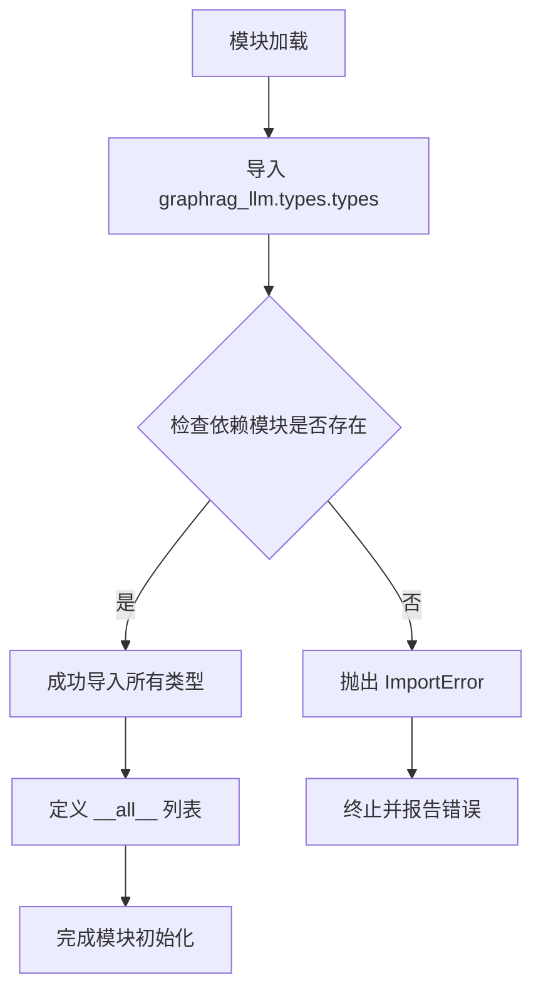

# `graphrag\packages\graphrag-llm\graphrag_llm\types\__init__.py` 详细设计文档

这是graphrag-llm项目的类型定义模块（types包），主要功能是重新导出graphrag_llm.types.types子模块中定义的所有LLM相关类型，包括异步/同步LLM完成函数、LLM嵌入函数、消息、响应、令牌详情、使用统计等数据类型，为上层业务逻辑提供统一的类型接口定义。

## 整体流程



## 类结构

```
该文件为类型定义包入口（__init__.py）
不涉及类层次结构
所有导出项均为类型别名（Type Alias）或数据类（Dataclass）
类型定义源: graphrag_llm.types.types
```

## 全局变量及字段


### `__all__`
    
定义模块公开导出的符号列表，控制from module import *时导入的内容

类型：`list`
    


    

## 全局函数及方法


## 关键组件


### AsyncLLMCompletionFunction

异步大型语言模型完成函数类型定义，用于处理异步的LLM完成请求

### AsyncLLMEmbeddingFunction

异步大型语言模型嵌入函数类型定义，用于处理异步的LLM嵌入请求

### LLMCompletionFunction

同步大型语言模型完成函数类型定义，用于处理同步的LLM完成请求

### LLMEmbeddingFunction

同步大型语言模型嵌入函数类型定义，用于处理同步的LLM嵌入请求

### LLMCompletionMessage

LLM完成请求的消息类型，定义对话消息的结构

### LLMCompletionResponse

LLM完成响应的类型定义，包含模型生成的内容和使用信息

### LLMEmbeddingResponse

LLM嵌入响应的类型定义，包含嵌入向量和使用信息

### LLMCompletionUsage

LLM完成令牌使用量统计类型，记录提示令牌、完成令牌等数量

### Metrics

度量标准类型，用于追踪LLM调用性能指标

### ResponseFormat

响应格式类型定义，控制LLM输出的结构化格式


## 问题及建议


### 已知问题

- **缺少模块文档字符串**：该模块没有提供任何文档说明其用途和职责，用户难以理解该模块在项目中的定位。
- **手动维护导入列表**：所有类型导入需要手动维护，如果 `graphrag_llm.types.types` 中的类型发生变化，此文件必须同步更新，容易出现遗漏或不一致。
- **无版本控制机制**：对于可能发生变更的类型定义，没有提供弃用警告或版本追踪机制。
- **完全依赖上游模块**：该模块的存在价值完全取决于 `graphrag_llm.types.types` 模块，缺少独立的抽象或增强。
- **运行时导入开销**：所有类型在模块导入时即被加载，可能带来不必要的运行时开销。

### 优化建议

- **添加模块文档字符串**：在文件开头添加模块级 docstring，说明该模块是类型定义的统一导出入口。
- **使用动态导入或生成脚本**：考虑编写脚本自动从 `types` 模块提取 `__all__` 或使用动态导入机制，减少手动维护成本。
- **添加类型检查**：使用 `mypy` 或 `pyright` 在 CI 中验证类型导出的一致性。
- **引入 TYPE_CHECKING 条件导入**：如果某些类型仅用于类型注解，可考虑使用 `if TYPE_CHECKING:` 延迟导入以优化导入时间。
- **建立弃用标记机制**：如果未来某些类型会被弃用，使用 `warnings.warn` 或 `DeprecationWarning` 进行提示。
- **考虑重构为简单重导出**：如果该模块不包含任何增强逻辑，可考虑直接让用户从 `graphrag_llm.types.types` 导入，移除这一层间接引用。


## 其它


### 设计目标与约束

本模块作为graphrag-llm项目的类型定义入口文件，旨在统一管理和导出LLM相关的类型定义，为整个项目提供类型安全性和开发体验。约束包括：仅做类型重新导出，不包含任何运行时逻辑；必须与graphrag_llm.types.types模块保持同步更新；所有导出类型需符合Python类型注解标准（PEP 484）。

### 错误处理与异常设计

本模块作为纯类型导出模块，不涉及运行时错误处理。所有类型定义本身在导入时不会抛出异常。类型使用方需自行处理类型不匹配、类型转换失败等场景。建议使用静态类型检查工具（如mypy）在开发阶段捕获类型错误。

### 外部依赖与接口契约

本模块依赖graphrag_llm.types.types模块中定义的所有类型。接口契约包括：所有导入的符号均为公开API；types模块必须提供__all__中列出的所有类型；类型版本与主包版本保持同步。外部依赖为Python标准库typing模块（types模块内部使用）。

### 性能考量

由于本模块仅包含import和export语句，不涉及任何计算逻辑或对象实例化，因此不存在运行时性能开销。类型检查工具（如mypy、pyright）的性能取决于项目规模。

### 安全性考虑

本模块不涉及敏感数据处理、网络请求或文件操作，安全性风险较低。类型定义本身不包含任何业务逻辑或数据验证，符合最小权限原则。

### 版本兼容性

本模块遵循语义化版本控制（SemVer）。主要版本升级可能涉及类型签名的不兼容变更。次要版本升级可能添加新类型。补丁版本仅修复类型定义错误或文档问题。建议锁定主版本号以确保类型稳定性。

### 测试策略

由于本模块特性，单元测试需求较少。主要测试包括：验证所有__all__中的类型可正常导入；验证类型导出的完整性；与类型检查工具集成进行静态验证。可通过简单的导入测试脚本验证模块完整性。

### 配置说明

本模块无需运行时配置。开发时需配置类型检查工具（如mypy）的配置文件，确保正确识别graphrag_llm包路径。推荐配置：python_version >= 3.9，strict_optional = True，warn_return_any = True。

### 使用示例

```python
# 导入所需的LLM类型
from graphrag_llm import (
    LLMCompletionResponse,
    LLMEmbeddingFunction,
    LLMCompletionMessage,
)

# 使用类型注解
def process_completion(response: LLMCompletionResponse) -> str:
    return response.choices[0].message.content
```

### 常见问题解答

Q: 为什么不直接在需要的地方从graphrag_llm.types.types导入？
A: 通过统一的入口文件导入可以简化调用方代码，提供一致的导入路径，便于未来重构和类型管理。

Q: 如何添加新的类型定义？
A: 需要同时修改graphrag_llm.types.types模块和本模块的导入/导出列表，确保__all__保持同步更新。

Q: 类型版本与包版本如何对应？
A: 类型定义作为API的一部分，随包版本统一管理。重大类型变更会随主版本号升级发布。

    