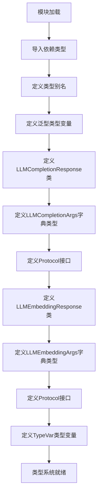
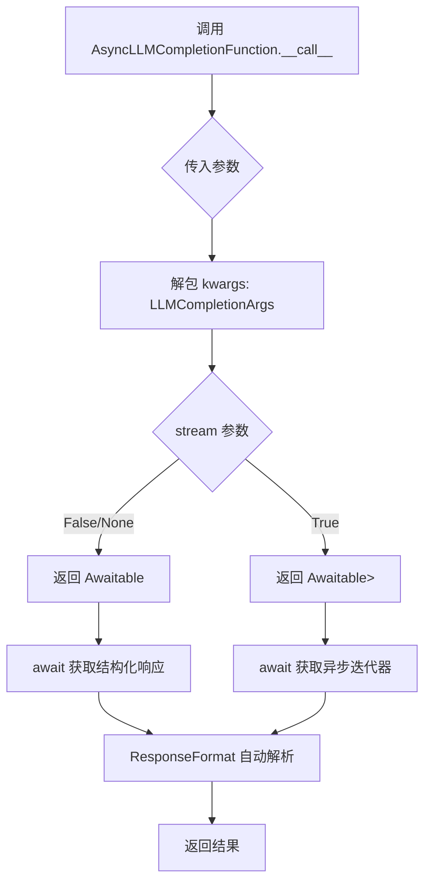
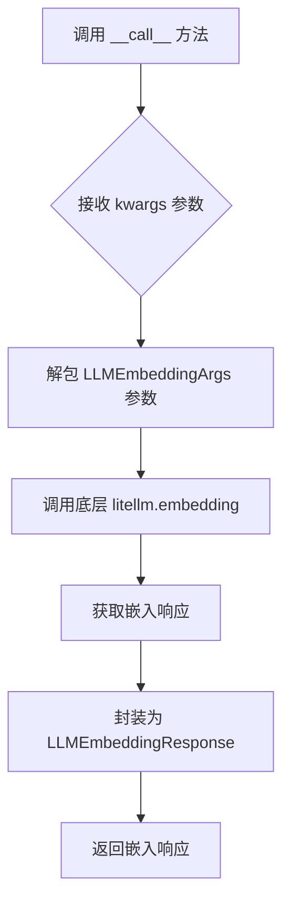

# `graphrag\packages\graphrag-llm\graphrag_llm\types\types.py` 详细设计文档

该文件是graphrag-llm项目的类型定义模块，定义了用于LLM调用和嵌入的各种类型别名、泛型类以及Protocol接口，封装了OpenAI和litellm的类型，为上层提供统一的类型抽象。

## 整体流程



## 类结构

```
类型定义模块 (types.py)
├── 类型别名 (Type Aliases)
│   ├── LLMCompletionMessagesParam
│   ├── LLMChoice
│   ├── LLMCompletionMessage
│   ├── LLMCompletionChunk
│   ├── LLMChoiceChunk
│   ├── LLMChoiceDelta
│   ├── LLMCompletionUsage
│   ├── LLMPromptTokensDetails
│   ├── LLMCompletionTokensDetails
│   ├── LLMEmbedding
│   ├── LLMEmbeddingUsage
│   └── LLMCompletionFunctionToolParam
├── 类型变量 (TypeVars)
│   ├── ResponseFormat
│   ├── LLMFunction
│   └── AsyncLLMFunction
├── 泛型类 (Generic Classes)
│   ├── LLMCompletionResponse
│   ├── LLMCompletionArgs
│   ├── LLMEmbeddingResponse
│   └── LLMEmbeddingArgs
└── Protocol接口 (Protocols)
    ├── LLMCompletionFunction
    ├── AsyncLLMCompletionFunction
    ├── LLMEmbeddingFunction
    └── AsyncLLMEmbeddingFunction
```

## 全局变量及字段


### `LLMCompletionMessagesParam`
    
LLM完成消息参数，支持字符串或消息参数序列

类型：`str | Sequence[ChatCompletionMessageParam | dict[str, Any]]`
    


### `LLMChoice`
    
LLM选项类型，继承自OpenAI的Choice

类型：`Choice`
    


### `LLMCompletionMessage`
    
LLM完成消息类型，继承自OpenAI的ChatCompletionMessage

类型：`ChatCompletionMessage`
    


### `LLMCompletionChunk`
    
LLM完成块类型，用于流式响应

类型：`ChatCompletionChunk`
    


### `LLMChoiceChunk`
    
LLM选项块类型，用于流式响应的选项

类型：`ChunkChoice`
    


### `LLMChoiceDelta`
    
LLM选项增量类型，用于流式响应中的增量数据

类型：`ChoiceDelta`
    


### `LLMCompletionUsage`
    
LLM完成使用统计类型

类型：`CompletionUsage`
    


### `LLMPromptTokensDetails`
    
LLM提示令牌详细信息类型

类型：`PromptTokensDetails`
    


### `LLMCompletionTokensDetails`
    
LLM完成令牌详细信息类型

类型：`CompletionTokensDetails`
    


### `LLMEmbedding`
    
LLM嵌入向量类型

类型：`Embedding`
    


### `LLMEmbeddingUsage`
    
LLM嵌入使用统计类型

类型：`Usage`
    


### `LLMCompletionFunctionToolParam`
    
LLM完成函数工具参数类型

类型：`ChatCompletionFunctionToolParam`
    


### `Metrics`
    
指标字典类型，用于存储请求指标和聚合指标

类型：`dict[str, float]`
    


### `ResponseFormat`
    
结构化响应格式的泛型类型变量

类型：`TypeVar[ResponseFormat, bound=BaseModel]`
    


### `LLMFunction`
    
同步LLM函数的泛型类型变量

类型：`TypeVar[LLMFunction, LLMCompletionFunction, LLMEmbeddingFunction]`
    


### `AsyncLLMFunction`
    
异步LLM函数的泛型类型变量

类型：`TypeVar[AsyncLLMFunction, AsyncLLMCompletionFunction, AsyncLLMEmbeddingFunction]`
    


### `LLMCompletionResponse.formatted_response`
    
根据响应格式JSON schema格式化的响应

类型：`ResponseFormat | None`
    


### `LLMCompletionArgs.messages`
    
LLM完成所需的消息列表

类型：`Required[LLMCompletionMessagesParam]`
    


### `LLMCompletionArgs.response_format`
    
响应格式的pydantic模型类型

类型：`type[ResponseFormat] | None`
    


### `LLMCompletionArgs.timeout`
    
请求超时时间（秒）

类型：`float | None`
    


### `LLMCompletionArgs.temperature`
    
采样温度参数

类型：`float | None`
    


### `LLMCompletionArgs.top_p`
    
核采样参数

类型：`float | None`
    


### `LLMCompletionArgs.n`
    
生成选项数量

类型：`int | None`
    


### `LLMCompletionArgs.stream`
    
是否启用流式响应

类型：`bool | None`
    


### `LLMCompletionArgs.stream_options`
    
流式响应的选项配置

类型：`dict | None`
    


### `LLMCompletionArgs.stop`
    
停止序列（保留字段）

类型：`None`
    


### `LLMCompletionArgs.max_completion_tokens`
    
最大完成令牌数

类型：`int | None`
    


### `LLMCompletionArgs.max_tokens`
    
最大输出令牌数

类型：`int | None`
    


### `LLMCompletionArgs.modalities`
    
响应的模态类型列表

类型：`list[ChatCompletionModality] | None`
    


### `LLMCompletionArgs.prediction`
    
预测内容参数

类型：`ChatCompletionPredictionContentParam | None`
    


### `LLMCompletionArgs.audio`
    
音频参数

类型：`ChatCompletionAudioParam | None`
    


### `LLMCompletionArgs.presence_penalty`
    
存在惩罚参数

类型：`float | None`
    


### `LLMCompletionArgs.frequency_penalty`
    
频率惩罚参数

类型：`float | None`
    


### `LLMCompletionArgs.logit_bias`
    
令牌偏差映射

类型：`dict | None`
    


### `LLMCompletionArgs.user`
    
终端用户标识

类型：`str | None`
    


### `LLMCompletionArgs.reasoning_effort`
    
推理努力级别

类型：`Literal[none, minimal, low, medium, high, default] | None`
    


### `LLMCompletionArgs.seed`
    
随机种子值

类型：`int | None`
    


### `LLMCompletionArgs.tools`
    
可用的工具函数列表

类型：`list | None`
    


### `LLMCompletionArgs.tool_choice`
    
工具选择策略

类型：`str | dict | None`
    


### `LLMCompletionArgs.logprobs`
    
是否返回对数概率

类型：`bool | None`
    


### `LLMCompletionArgs.top_logprobs`
    
返回顶部对数概率数量

类型：`int | None`
    


### `LLMCompletionArgs.parallel_tool_calls`
    
是否并行执行工具调用

类型：`bool | None`
    


### `LLMCompletionArgs.web_search_options`
    
网络搜索选项

类型：`OpenAIWebSearchOptions | None`
    


### `LLMCompletionArgs.deployment_id`
    
部署标识符

类型：`Any`
    


### `LLMCompletionArgs.extra_headers`
    
额外的请求头

类型：`dict | None`
    


### `LLMCompletionArgs.safety_identifier`
    
安全标识符

类型：`str | None`
    


### `LLMCompletionArgs.functions`
    
可用的函数列表（已弃用）

类型：`list | None`
    


### `LLMCompletionArgs.function_call`
    
函数调用策略（已弃用）

类型：`str | None`
    


### `LLMCompletionArgs.thinking`
    
思考参数配置

类型：`AnthropicThinkingParam | None`
    


### `LLMEmbeddingArgs.input`
    
嵌入操作的输入文本列表

类型：`Required[list[str]]`
    


### `LLMEmbeddingArgs.dimensions`
    
嵌入向量的维度

类型：`int | None`
    


### `LLMEmbeddingArgs.encoding_format`
    
编码格式（float或base64）

类型：`str | None`
    


### `LLMEmbeddingArgs.timeout`
    
请求超时时间（秒）

类型：`int`
    


### `LLMEmbeddingArgs.user`
    
终端用户标识

类型：`str | None`
    
    

## 全局函数及方法


### `LLMCompletionResponse.content`

这是一个计算属性（computed_property），用于从 LLM 响应中获取第一个选项消息的内容。如果内容为空或 None，则返回空字符串。

参数：

- `self`：`LLMCompletionResponse` 类型，类的实例本身

返回值：`str`，返回第一个选择消息的内容，如果内容为 None 则返回空字符串

#### 流程图

```mermaid
flowchart TD
    A[开始] --> B{self.choices[0].message.content}
    B -->|非空/非None| C[返回 content 内容]
    B -->|空/None| D[返回空字符串 ""]
    C --> E[结束]
    D --> E
```

#### 带注释源码

```python
@computed_field
@property
def content(self) -> str:
    """Get the content of the first choice message."""
    # 访问 self.choices 列表中第一个元素的 message 属性的 content 字段
    # 使用 Python 的 or 运算符，如果 content 为 None 或其他 falsy 值，则返回空字符串
    # 这确保了返回值始终是 str 类型，不会返回 None
    return self.choices[0].message.content or ""
```


### `LLMCompletionFunction.__call__`

同步完成函数接口方法，用于调用 LLM 完成请求。该方法是 Protocol 定义的抽象接口，支持流式和非流式响应两种模式，通过 `stream` 参数区分，返回相应的响应类型。

参数：

- `self`：隐式参数，Protocol 实例本身
- `/`：位置参数分隔符，表示其前面的参数为位置专用参数
- `**kwargs`：`Unpack[LLMCompletionArgs[ResponseFormat]]`，可变关键字参数，包含以下可选参数：
  - `messages`：`LLMCompletionMessagesParam`（必需），聊天消息列表
  - `response_format`：`type[ResponseFormat] | None`，结构化响应格式模型类型
  - `timeout`：`float | None`，请求超时时间（秒）
  - `temperature`：`float | None`，采样温度
  - `top_p`：`float | None`，核采样参数
  - `n`：`int | None`，生成候选数量
  - `stream`：`bool | None`，是否启用流式响应
  - `stream_options`：`dict | None`，流式响应选项
  - `stop`：`None`，停止序列
  - `max_completion_tokens`：`int | None`，最大生成 token 数
  - `max_tokens`：`int | None`，最大 token 数（别名）
  - `modalities`：`list[ChatCompletionModality] | None`，响应模态
  - `prediction`：`ChatCompletionPredictionContentParam | None`，预测内容参数
  - `audio`：`ChatCompletionAudioParam | None`，音频参数
  - `presence_penalty`：`float | None`，存在惩罚
  - `frequency_penalty`：`float | None`，频率惩罚
  - `logit_bias`：`dict | None`，logit 偏置
  - `user`：`str | None`，用户标识
  - `reasoning_effort`：`Literal["none", "minimal", "low", "medium", "high", "default"] | None`，推理 effort
  - `seed`：`int | None`，随机种子
  - `tools`：`list | None`，工具列表
  - `tool_choice`：`str | dict | None`，工具选择
  - `logprobs`：`bool | None`，是否返回 logprobs
  - `top_logprobs`：`int | None`，top logprobs 数量
  - `parallel_tool_calls`：`bool | None`，是否并行调用工具
  - `web_search_options`：`OpenAIWebSearchOptions | None`，网页搜索选项
  - `deployment_id`：`Any`，部署 ID
  - `extra_headers`：`dict | None`，额外请求头
  - `safety_identifier`：`str | None`，安全标识符
  - `functions`：`list | None`，函数列表（旧版）
  - `function_call`：`str | None`，函数调用（旧版）
  - `thinking`：`AnthropicThinkingParam | None`，思考参数

返回值：`LLMCompletionResponse[ResponseFormat] | Iterator[LLMCompletionChunk]`，非流式模式下返回格式化的 LLM 响应对象，流式模式下返回聊天完成块迭代器

#### 流程图

```mermaid
flowchart TD
    A[开始 __call__] --> B{stream 参数是否为 true?}
    B -->|是| C[返回 Iterator[LLMCompletionChunk]<br/>流式响应迭代器]
    B -->|否| D[返回 LLMCompletionResponse[ResponseFormat]<br/>格式化响应对象]
    C --> E[结束]
    D --> E
```

#### 带注释源码

```python
@runtime_checkable
class LLMCompletionFunction(Protocol):
    """Synchronous completion function.

    Same signature as litellm.completion but without the `model` parameter
    as this is already set in the model configuration.
    """

    def __call__(
        self, /, **kwargs: Unpack[LLMCompletionArgs[ResponseFormat]]
    ) -> LLMCompletionResponse[ResponseFormat] | Iterator[LLMCompletionChunk]:
        """Completion function."""
        ...
        # 参数说明：
        # - self: Protocol 实例本身
        # - /: 位置参数分隔符，确保前面的参数只能按位置传递
        # - **kwargs: 解包的 LLMCompletionArgs 泛型参数，支持多种可选参数
        #
        # 返回值说明：
        # - LLMCompletionResponse[ResponseFormat]: 非流式响应，包含格式化解析后的响应
        # - Iterator[LLMCompletionChunk]: 流式响应迭代器，用于逐步获取响应块
        #
        # 使用示例：
        # # 非流式调用
        # response = completion_func(messages=[{"role": "user", "content": "Hello"}])
        # # 流式调用
        # for chunk in completion_func(messages=[{"role": "user", "content": "Hello"}], stream=True):
        #     print(chunk)
```


### `AsyncLLMCompletionFunction.__call__`

这是一个异步协议方法，定义了异步 LLM 补全函数的调用签名，兼容 litellm.completion 的参数格式（但省略了 `model` 参数，因为模型已在配置中指定）。该方法支持返回结构化响应或流式响应。

参数：

- `self`：`AsyncLLMCompletionFunction` 实例，代表异步补全函数本身
- `/`：位置参数分隔符，表示其后的参数只能通过位置传递
- `**kwargs`：`Unpack[LLMCompletionArgs[ResponseFormat]]`，可变关键字参数，解包 LLMCompletionArgs 字典定义的参数（如 messages、temperature、response_format 等）

返回值：`Awaitable[LLMCompletionResponse[ResponseFormat] | AsyncIterator[ChatCompletionChunk]]`，一个可等待对象，结果为结构化 LLM 响应或异步迭代器（用于流式输出）

#### 流程图



#### 带注释源码

```python
@runtime_checkable
class AsyncLLMCompletionFunction(Protocol):
    """Asynchronous completion function.

    Same signature as litellm.completion but without the `model` parameter
    as this is already set in the model configuration.
    """

    def __call__(
        self,  # self: AsyncLLMCompletionFunction 实例
        /,      # 位置参数分隔符，之后的参数只能按位置传递
        **kwargs: Unpack[LLMCompletionArgs[ResponseFormat]]  # 解包可变关键字参数
    ) -> Awaitable[
        LLMCompletionResponse[ResponseFormat] | AsyncIterator[ChatCompletionChunk]
    ]:  # 返回可等待对象，结果为结构化响应或异步流迭代器
        """Completion function."""
        ...
```


### `LLMEmbeddingResponse.embeddings`

获取嵌入向量数据，将其转换为浮点数列表的列表形式返回。

参数：
- (无 - 这是一个计算属性，无需参数)

返回值：`list[list[float]]`，嵌入向量列表，每个嵌入向量是一个浮点数列表

#### 流程图

```mermaid
flowchart TD
    A[开始] --> B{访问 embeddings 属性}
    B --> C[读取 self.data]
    C --> D{self.data 是否存在}
    D -->|是| E[遍历 self.data 中的每个 Embedding 对象]
    D -->|否| F[返回空列表 []]
    E --> G[提取每个对象的 .embedding 属性]
    G --> H[将所有 embedding 组装成列表]
    H --> I[返回 list[list[float]]]
```

#### 带注释源码

```python
@computed_field
@property
def embeddings(self) -> list[list[float]]:
    """Get the embeddings as a list of lists of floats.
    
    这是一个计算属性，将 OpenAI CreateEmbeddingResponse 中的 data 字段
    （包含 Embedding 对象的列表）转换为纯浮点数列表的列表。
    
    Returns:
        list[list[float]]: 嵌入向量列表，每个元素是一个浮点数列表（向量）
    """
    # self.data 继承自 CreateEmbeddingResponse，是 list[Embedding] 类型
    # 每个 Embedding 对象有 embedding 属性，类型为 list[float]
    # 本方法将其展平为 list[list[float]]
    return [data.embedding for data in self.data]
```

---

#### 补充说明

| 项目 | 说明 |
|------|------|
| **所属类** | `LLMEmbeddingResponse` |
| **父类** | `CreateEmbeddingResponse` (来自 `openai.types.create_embedding_response`) |
| **数据来源** | `self.data` 字段（继承自父类，类型为 `list[Embedding]`） |
| **底层类型** | `Embedding` 对象包含 `embedding: list[float]` 属性 |
| **错误处理** | 如果 `self.data` 为空或不存在，返回空列表 `[]`（Python 列表推导式自动处理空列表情况） |
| **设计意图** | 提供便捷的接口，将 OpenAI 原始响应转换为更易用的纯数值格式，屏蔽掉 `Embedding` 对象的额外元数据（如 index、object 等） |


### `LLMEmbeddingResponse.first_embedding`

获取 LLMEmbeddingResponse 中的第一个嵌入向量。如果存在嵌入数据，则返回第一个嵌入向量；否则返回空列表。

参数：

- `self`：`LLMEmbeddingResponse`，调用该计算属性的类实例本身

返回值：`list[float]`，返回第一个嵌入向量（float 类型的列表），如果没有嵌入数据则返回空列表

#### 流程图

```mermaid
flowchart TD
    A[开始访问 first_embedding] --> B{self.embeddings 是否存在且非空?}
    B -->|是| C[返回 self.embeddings[0]]
    B -->|否| D[返回空列表 []]
    C --> E[结束]
    D --> E
```

#### 带注释源码

```python
@computed_field
@property
def first_embedding(self) -> list[float]:
    """Get the first embedding."""
    # 使用条件表达式：如果 embeddings 列表存在且非空，则返回第一个元素；否则返回空列表
    return self.embeddings[0] if self.embeddings else []
```


### `LLMEmbeddingFunction.__call__`

这是一个同步嵌入函数协议方法，定义了 embedding 函数的调用接口。该方法接收任意关键字参数（符合 LLMEmbeddingArgs 类型规范），调用底层的 embedding 模型生成文本嵌入向量，并返回 LLMEmbeddingResponse 响应对象。

参数：

- `self`：隐式参数，Protocol 实例本身
- `/`：表示其后的参数只能作为关键字参数传递
- `**kwargs`：`Unpack[LLMEmbeddingArgs]`，解包后的关键字参数，包含以下字段：
  - `input`：`list[str]`，必需，要嵌入的文本列表
  - `dimensions`：`int | None`，可选，嵌入向量的维度
  - `encoding_format`：`str | None`，可选，编码格式
  - `timeout`：`int`，可选，请求超时时间
  - `user`：`str | None`，可选，用户标识

返回值：`LLMEmbeddingResponse`，包含嵌入结果的响应对象，提供 `embeddings`（list[list[float]]）和 `first_embedding`（list[float]）属性

#### 流程图



#### 带注释源码

```python
@runtime_checkable
class LLMEmbeddingFunction(Protocol):
    """Synchronous embedding function.

    Same signature as litellm.embedding but without the `model` parameter
    as this is already set in the model configuration.
    """

    def __call__(
        self,
        /,
        **kwargs: Unpack[LLMEmbeddingArgs],
    ) -> LLMEmbeddingResponse:
        """Embedding function."""
        ...
```

> **说明**：这是一个 Protocol 定义的接口方法，实际实现由外部注入的 embedding 函数提供。该方法使用 `runtime_checkable` 装饰器，使其可以在运行时进行类型检查。`/` 符号表示其前没有位置参数，所有参数必须以关键字参数形式传递。返回值 `LLMEmbeddingResponse` 继承自 OpenAI 的 `CreateEmbeddingResponse`，并添加了便捷的 `embeddings` 和 `first_embedding` 计算属性。


### `AsyncLLMEmbeddingFunction.__call__`

这是一个异步嵌入函数协议方法，用于调用底层的异步嵌入模型服务（如 litellm.aembedding），生成输入文本的向量表示。该方法遵循 Protocol 接口定义，允许通过统一的函数调用方式执行异步嵌入操作，无需直接指定模型参数（模型已在配置中预设）。

参数：

- `self`：`AsyncLLMEmbeddingFunction`，Protocol 实例本身，代表异步嵌入函数的调用者
- `/`：`Literal`，用于分隔位置参数和关键字参数（Python 语法特性）
- `**kwargs`：`Unpack[LLMEmbeddingArgs]`（即 `input: Required[list[str]]`, `dimensions: int | None`, `encoding_format: str | None`, `timeout: int`, `user: str | None`），可变关键字参数，包含嵌入请求的所有配置

返回值：`Awaitable[LLMEmbeddingResponse]`，一个异步可等待对象，最终返回 `LLMEmbeddingResponse`（继承自 `CreateEmbeddingResponse`），包含嵌入向量数据和使用统计信息

#### 流程图

```mermaid
flowchart TD
    A[调用 AsyncLLMEmbeddingFunction.__call__] --> B{传入 input 参数}
    B -->|是| C[构建 LLMEmbeddingArgs 参数集]
    B -->|否| D[抛出 TypeError 缺少必需参数]
    C --> E[调用底层异步嵌入服务 litellm.aembedding]
    E --> F{服务响应成功}
    F -->|是| G[封装为 LLMEmbeddingResponse 对象]
    F -->|否| H[传播底层异常]
    G --> I[返回 Awaitable[LLMEmbeddingResponse]]
    I --> J[await 获取实际嵌入结果]
    J --> K[访问 embeddings 或 first_embedding 属性]
```

#### 带注释源码

```python
@runtime_checkable
class AsyncLLMEmbeddingFunction(Protocol):
    """Asynchronous embedding function.

    Same signature as litellm.aembedding but without the `model` parameter
    as this is already set in the model configuration.
    """

    async def __call__(
        self,
        /,
        **kwargs: Unpack[LLMEmbeddingArgs],
    ) -> LLMEmbeddingResponse:
        """Embedding function."""
        ...
```

**源码解析：**

- `@runtime_checkable`：装饰器，使 Protocol 类支持运行时类型检查（`isinstance` 检查）
- `class AsyncLLMEmbeddingFunction(Protocol)`：定义异步嵌入函数的接口协议，遵循 Protocol 模式实现结构化类型定义
- `async def __call__`：将实例变为可调用对象，支持异步调用（`await instance(...)` 语法）
- `/`：Python 3.8+ 语法特性，明确区分位置参数和后续关键字参数
- `**kwargs: Unpack[LLMEmbeddingArgs]`：使用 `Unpack` 展开 `LLMEmbeddingArgs` TypedDict，允许传入任意嵌入参数（`input` 为必需参数，其余可选）
- `-> LLMEmbeddingResponse`：返回封装后的嵌入响应，包含 `embeddings`（list[list[float]]）和 `first_embedding` 等计算属性

## 关键组件


### LLMCompletionResponse

扩展 OpenAI ChatCompletion 的 LLM 完成响应类型。自动处理基于提供的 ResponseFormat 模型的结构化响应解析，包含 formatted_response 字段和计算属性 content。

### LLMCompletionArgs

TypedDict 类型的 LLM 完成函数参数定义。与 litellm.completion 签名相同，但不含 model 参数（已在模型配置中设置），包含消息、响应格式、温度、token 限制等完整参数。

### LLMCompletionFunction

runtime_checkable 协议类，定义同步 LLM 完成函数的签名。约束 LLMCompletionArgs 参数，返回 LLMCompletionResponse 或 ChatCompletionChunk 迭代器。

### AsyncLLMCompletionFunction

runtime_checkable 协议类，定义异步 LLM 完成函数的签名。返回 awaitable 对象，解析为 LLMCompletionResponse 或 AsyncIterator[ChatCompletionChunk]。

### LLMEmbeddingResponse

扩展 OpenAI CreateEmbeddingResponse 的嵌入响应类型。添加计算属性 embeddings（返回二维浮点数列表）和 first_embedding（返回第一个嵌入向量）。

### LLMEmbeddingArgs

TypedDict 类型的嵌入函数参数定义。与 litellm.embedding 签名相同但不含 model 参数，包含 input、dimensions、encoding_format 等参数。

### LLMEmbeddingFunction

runtime_checkable 协议类，定义同步嵌入函数的签名。接受 LLMEmbeddingArgs 参数，返回 LLMEmbeddingResponse。

### AsyncLLMEmbeddingFunction

runtime_checkable 协议类，定义异步嵌入函数的签名。使用 async def 定义，返回 awaitable LLMEmbeddingResponse。

### 类型别名集合

从 openai、litellm 等库导入的类型重命名集合，包括 LLMChoice、LLMCompletionMessage、LLMCompletionChunk、LLMEmbedding、Metrics 等，提供统一的命名空间。


## 问题及建议


### 已知问题

-   **泛型继承冲突**：`LLMCompletionResponse` 同时继承 `ChatCompletion` 和 `Generic[ResponseFormat]`，而 `ChatCompletion` 本身在 OpenAI SDK 中已是泛型类，可能导致 MRO（方法解析顺序）问题和类型推断混乱
-   **类型安全缺失**：`deployment_id: Any` 完全丢失了类型安全，应使用更具体的类型
-   **废弃参数混用**：`LLMCompletionArgs` 同时包含新版 `tools`/`tool_choice` 和已废弃的 `functions`/`function_call` 参数，易导致误用
-   **类型不一致**：`LLMCompletionArgs` 中 `timeout` 为 `float | None`，而 `LLMEmbeddingArgs` 中为 `int`，存在不一致
-   **静默失败风险**：`LLMEmbeddingResponse.first_embedding` 属性在 embeddings 为空时静默返回空列表，可能导致调用方难以察觉异常
-   **TypedDict 宽松度过高**：`LLMCompletionArgs` 和 `LLMEmbeddingArgs` 设置了 `extra_items=Any`，允许任意额外键入，削弱了类型检查的意义
-   **字段类型错误**：`LLMCompletionArgs` 中 `stop` 被硬编码为 `None`，但 litellm 实际支持 `list[str]` 类型

### 优化建议

-   重构 `LLMCompletionResponse` 的泛型实现，避免与 `ChatCompletion` 的泛型冲突，可考虑组合模式而非继承
-   将 `deployment_id` 类型具体化，或使用 `str | None` 替代 `Any`
-   移除废弃的 `functions` 和 `function_call` 参数，统一使用 `tools` 和 `tool_choice`
-   统一 `timeout` 类型，建议两者均使用 `float | None` 以保持一致性
-   为 `LLMEmbeddingResponse.first_embedding` 添加明确的异常或警告，而非静默返回空列表
-   考虑为 `encoding_format` 等字段使用 `Literal` 类型定义具体可选值
-   评估 `LLMChoice`、`LLMCompletionMessage` 等类型别名的必要性，部分别名可能增加维护成本而未提供实质价值

## 其它


### 设计目标与约束

本模块旨在为graphrag-llm提供完整的类型定义系统，确保在LLM调用过程中的类型安全性和开发体验。设计约束包括：1）必须兼容OpenAI和litellm的类型定义；2）使用Pydantic v2的BaseModel和computed_field；3）遵循Python typing模块的最佳实践；4）支持结构化响应解析；5）提供同步和异步两种调用模式的类型定义。

### 错误处理与异常设计

本模块为类型定义文件，不包含业务逻辑错误处理。类型层面的错误通过Pydantic验证实现，当ResponseFormat不符合BaseModel约束时，会在运行时抛出ValidationError。Protocol接口定义了函数签名，调用方需确保传入参数符合LLMCompletionArgs和LLMEmbeddingArgs的约束条件，否则会导致类型检查失败。

### 数据流与状态机

本模块定义了三种主要的数据流：1）Completion流程：输入LLMCompletionMessagesParam → LLMCompletionArgs → 通过LLMCompletionFunction调用 → 返回LLMCompletionResponse；2）Embedding流程：输入list[str] → LLMEmbeddingArgs → 通过LLMEmbeddingFunction调用 → 返回LLMEmbeddingResponse；3）流式响应流程：设置stream=True时返回Iterator[LLMCompletionChunk]或AsyncIterator[LLMCompletionChunk]。状态机由LLMCompletionResponse的content属性和choices字段驱动。

### 外部依赖与接口契约

本模块依赖以下外部包：1）openai>=1.0提供ChatCompletion、CreateEmbeddingResponse等基础类型；2）litellm提供AnthropicThinkingParam、ChatCompletionModality等扩展参数；3）pydantic>=2.0提供BaseModel和computed_field；4）typing_extensions提供TypedDict、TypeVar等类型扩展。接口契约方面：LLMCompletionFunction和AsyncLLMCompletionFunction必须接受Unpack[LLMCompletionArgs[ResponseFormat]]参数并返回相应类型；LLMEmbeddingFunction和AsyncLLMEmbeddingFunction必须接受Unpack[LLMEmbeddingArgs]参数并返回LLMEmbeddingResponse。

### 兼容性说明

本模块类型定义基于OpenAI Python SDK v1.x和litellm构建。版本兼容性要求：Python 3.9+（支持TypedDict和TypeVar），Pydantic 2.x，OpenAI SDK 1.x。由于使用@runtime_checkable装饰器，Protocol类可在运行时进行实例检查。注意某些类型如ChatCompletionPredictionContentParam、OpenAIWebSearchOptions来自litellm而非openai包，需确保litellm版本支持。

    