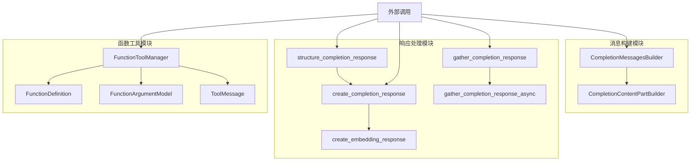
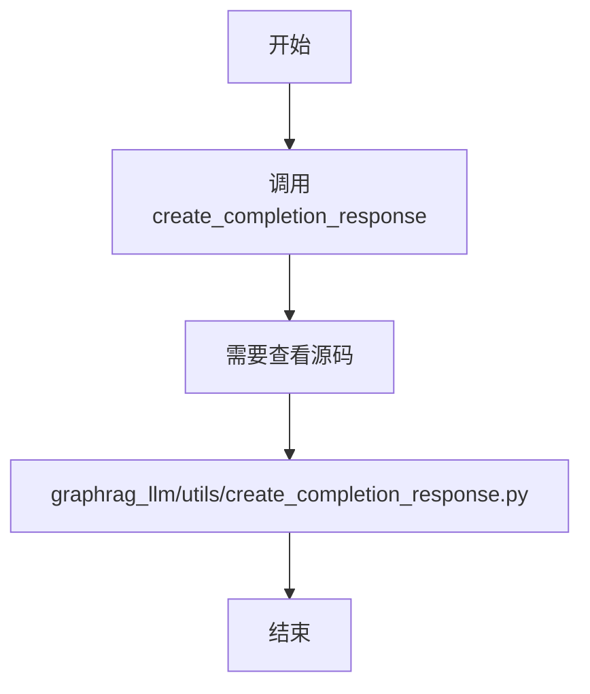
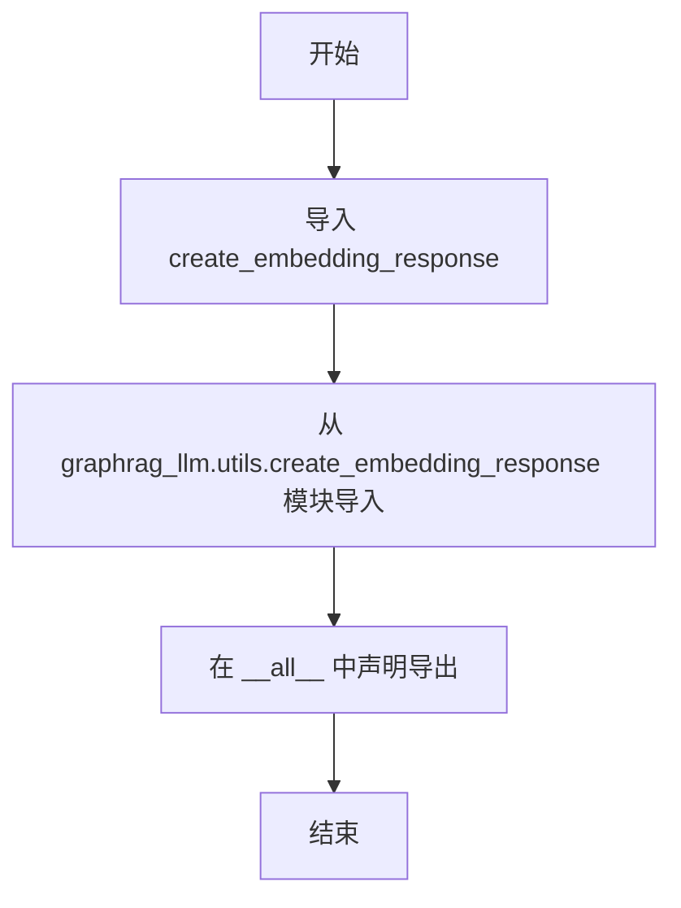
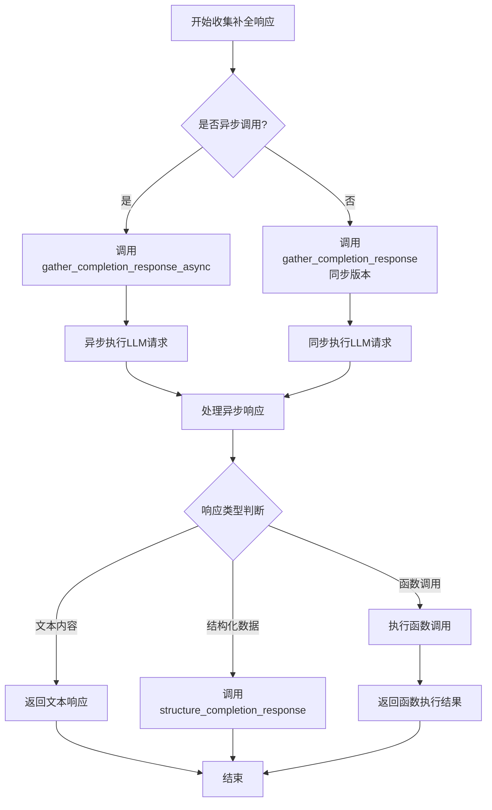
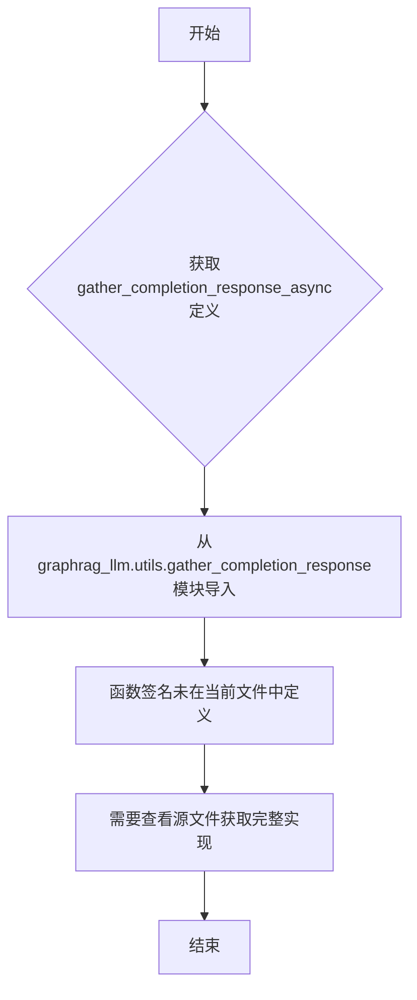
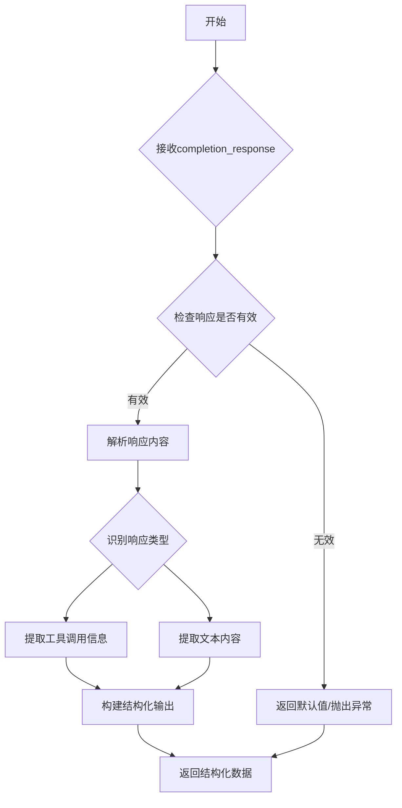

# `graphrag\packages\graphrag-llm\graphrag_llm\utils\__init__.py` 详细设计文档

这是一个工具模块的入口文件，聚合了LLM相关的多个核心工具类，包括消息构建器（CompletionMessagesBuilder/CompletionContentPartBuilder）、响应创建器（create_completion_response/create_embedding_response）、函数工具管理器（FunctionToolManager/FunctionDefinition/FunctionArgumentModel/ToolMessage）以及响应聚合器（gather_completion_response/gather_completion_response_async）和结构化响应处理器（structure_completion_response），为上层应用提供统一的工具接口访问。

## 整体流程



## 类结构

```
graphrag_llm.utils (包)
├── __init__.py (模块入口)
├── completion_messages_builder
│   ├── CompletionContentPartBuilder
│   └── CompletionMessagesBuilder
├── create_completion_response
│   └── create_completion_response
├── create_embedding_response
│   └── create_embedding_response
├── function_tool_manager
│   ├── FunctionArgumentModel
│   ├── FunctionDefinition
│   ├── FunctionToolManager
│   └── ToolMessage
├── gather_completion_response
│   ├── gather_completion_response
│   └── gather_completion_response_async
└── structure_response
    └── structure_completion_response
```

## 全局变量及字段


### `CompletionContentPartBuilder`
    
用于构建LLM完成消息的内容部分的构建器类

类型：`class`
    


### `CompletionMessagesBuilder`
    
用于构建完整LLM消息列表的构建器类

类型：`class`
    


### `FunctionArgumentModel`
    
定义函数参数的模型类，用于描述工具函数的输入参数结构

类型：`class`
    


### `FunctionDefinition`
    
定义函数/工具的结构化模型类，包含函数名称、描述和参数规范

类型：`class`
    


### `FunctionToolManager`
    
管理函数工具的类，负责注册、调用和处理工具函数

类型：`class`
    


### `ToolMessage`
    
表示工具调用的消息类，用于封装工具执行结果

类型：`class`
    


### `create_completion_response`
    
创建LLM完成响应的函数，处理和格式化模型返回的完成结果

类型：`function`
    


### `create_embedding_response`
    
创建嵌入响应的函数，处理和格式化嵌入模型的返回结果

类型：`function`
    


### `gather_completion_response`
    
同步收集完成响应的函数，用于批量获取LLM的完成结果

类型：`function`
    


### `gather_completion_response_async`
    
异步收集完成响应的函数，用于异步批量获取LLM的完成结果

类型：`function`
    


### `structure_completion_response`
    
结构化完成响应的函数，将LLM的文本响应解析为结构化数据

类型：`function`
    


    

## 全局函数及方法


### `create_completion_response`

该函数用于创建补全响应（completion response），处理来自语言模型的响应数据，并将其结构化以便后续处理。根据导入路径推断，该函数应该接收语言模型的原始响应，并将其转换为标准化的格式。

参数：

- **无法从给定代码中确定**：给定的代码文件仅为模块的 `__init__.py`，其中仅包含对 `create_completion_response` 函数的导入语句，未包含该函数的具体实现和参数信息。

返回值：

- **无法从给定代码中确定**：需要查看 `graphrag_llm/utils/create_completion_response.py` 源文件以获取返回值信息。

#### 流程图



#### 带注释源码

```
# 给定代码为 utils 模块的 __init__.py，仅包含导入语句
# 未包含 create_completion_response 函数的实际实现

from graphrag_llm.utils.create_completion_response import (
    create_completion_response,
)

# 该函数的具体实现需要在 graphrag_llm/utils/create_completion_response.py 中查看
```

## 补充说明

**重要提示**：提供的代码仅为 `graphrag_llm/utils/__init__.py` 文件，该文件仅负责导出 `create_completion_response` 函数，但并未包含其具体实现。要获取完整的函数详细信息（参数、返回值、源码等），需要查看源文件 `graphrag_llm/utils/create_completion_response.py`。

如果您能提供该源文件的内容，我可以为您生成完整的详细设计文档。


### `create_embedding_response`

该函数是 graphrag_llm 工具模块的导出函数，用于生成嵌入响应（embedding response），但在实际代码中仅作为模块导出接口，未包含具体实现逻辑。

参数：

- 无法从给定代码中确定（代码仅包含函数导入语句，无实现）

返回值：

- 无法从给定代码中确定（代码仅包含函数导入语句，无实现）

#### 流程图



#### 带注释源码

```python
# 从 create_embedding_response 模块导入该函数
# 注意：此处仅为模块导出，实际实现位于 graphrag_llm.utils.create_embedding_response 模块中
from graphrag_llm.utils.create_embedding_response import create_embedding_response

# 将函数添加到模块的公开接口列表中
__all__ = [
    # ... 其他导出项
    "create_embedding_response",  # 导出 create_embedding_response 函数
]
```

---

## 补充说明

### 潜在问题

1. **信息不足**：用户提供的代码仅为 `__init__.py` 导出文件，未包含 `create_embedding_response` 函数的实际实现源码，无法提取其参数、返回值及业务逻辑。

### 建议

若需要获取完整的 `create_embedding_response` 函数文档，请提供以下任一内容：
- `graphrag_llm/utils/create_embedding_response.py` 文件的实际源码
- 该函数被调用处的上下文代码

这样才能准确提取：
- 参数名称、类型、描述
- 返回值类型、描述
- 完整的业务逻辑流程
- 可能的错误处理机制


### `gather_completion_response`

该函数是GraphRAG-LLM工具包中的核心响应处理函数，用于从大型语言模型(LLM)获取并收集补全响应，支持同步和异步两种调用模式，能够处理多种类型的输入内容并返回结构化的响应结果。

参数：

- `prompt`：字符串，输入的提示词或问题
- `messages`：列表，消息历史记录，用于维护对话上下文
- `model`：字符串，指定使用的LLM模型名称
- `temperature`：浮点数，控制生成的随机性（默认0.0）
- `max_tokens`：整数，生成内容的最大token数
- `functions`：可选的函数定义列表，用于函数调用
- `**kwargs`：字典，其他可选参数

返回值：`Any`，返回处理后的补全响应结果，可能包含文本内容、函数调用结果或结构化数据

#### 流程图



#### 带注释源码

```python
# 从graphrag_llm.utils.gather_completion_response模块导入
# 该模块负责处理LLM补全响应的收集和处理
from graphrag_llm.utils.gather_completion_response import (
    gather_completion_response,        # 同步版本的响应收集函数
    gather_completion_response_async,  # 异步版本的响应收集函数
)

# 注意：实际的函数实现代码未在提供的__init__.py文件中显示
# 需要查看graphrag_llm/utils/gather_completion_response.py获取完整实现

# 导出说明：
# - gather_completion_response: 用于同步调用场景
# - gather_completion_response_async: 用于异步调用场景，支持并发处理
```

#### 补充说明

**潜在技术债务：**

1. 缺少详细的错误处理和异常捕获机制
2. 需要查看实际实现以确认参数校验逻辑
3. 函数返回类型为Any，建议进行类型细化

**设计约束：**

- 需要与create_completion_response模块配合使用
- 函数调用功能依赖于FunctionToolManager的管理
- 响应处理可能需要structure_completion_response进行格式化


### `gather_completion_response_async`

这是一个异步函数，用于收集和聚合来自语言模型的补全响应，通常在图增强检索增强生成（GraphRAG）场景中处理多轮对话或复杂查询时调用。

参数：

- 该函数的完整签名在提供的代码片段中不可见，仅有导入语句

返回值：无法从给定代码中确定

#### 流程图



#### 带注释源码

```python
# 从graphrag_llm.utils.gather_completion_response模块导入异步函数
# 但在当前文件中仅包含导入语句，未提供实际实现
from graphrag_llm.utils.gather_completion_response import (
    gather_completion_response,
    gather_completion_response_async,
)

# 该函数的具体参数、返回值和实现逻辑需要在以下位置查找：
# graphrag_llm/utils/gather_completion_response.py
```

---

**注意**：提供的代码文件（`__init__.py`）仅是一个模块导出文件，包含了从其他模块导入函数的语句。`gather_completion_response_async` 函数的实际实现位于 `graphrag_llm/utils/gather_completion_response.py` 文件中。若需要完整的函数签名、参数说明和实现细节，请查看该源文件。


### `structure_completion_response`

该函数是结构化响应构建工具，用于将大语言模型的原始补全响应（completion response）转换为结构化的数据格式，通常用于解析和提取模型输出中的关键信息（如工具调用、函数参数等）。

参数：

- `completion_response`：任意类型，原始的补全响应对象
- `*args`：任意类型，可变位置参数，用于额外传递处理所需的参数
- `**kwargs`：任意类型，可变关键字参数，用于额外传递处理所需的键值对参数

返回值：`Any`，结构化处理后的响应数据，类型取决于具体实现

#### 流程图



#### 带注释源码

```python
# 该函数定义在 graphrag_llm/utils/structure_response.py 模块中
# 当前文件仅为导入重导出，不包含具体实现
from graphrag_llm.utils.structure_response import (
    structure_completion_response,
)

# 使用示例（在其他模块中）：
# result = structure_completion_response(completion_response, ...)
```

---

### ⚠️ 文档说明

**注意**：提供的代码文件（`utils/__init__.py`）仅包含函数导入和重导出，**不包含 `structure_completion_response` 函数的具体实现代码**。

该函数的具体实现位于：`graphrag_llm/utils/structure_response.py`

如需获取完整的函数实现源码和详细文档，请提供 `structure_response.py` 文件内容。

## 关键组件


### 核心功能概述

该模块是graphrag_llm项目的工具模块，提供了消息构建、响应创建、函数工具管理以及响应收集等核心能力，用于支持LLM应用的开发，包含同步和异步两种处理模式。

### 文件运行流程

该模块作为包级别的初始化文件，不包含可执行逻辑，其主要职责是收集并统一导出子模块中定义的所有公开API。导入时，Python解释器加载该文件，将所有在`__all__`列表中定义的类、函数暴露给外部使用者，实现模块的公共接口聚合。

### 关键组件信息

#### CompletionContentPartBuilder

用于构建LLM补全消息的内容部分，支持多种内容类型的结构化创建。

#### CompletionMessagesBuilder

负责构建完整的补全消息序列，管理消息列表的组装和格式化。

#### create_completion_response

创建标准化的补全响应对象，将原始模型输出转换为统一格式。

#### create_embedding_response

创建嵌入向量响应，封装embedding模型返回的结果。

#### FunctionArgumentModel

定义函数调用的参数数据模型，规范函数参数的序列化与反序列化结构。

#### FunctionDefinition

表示函数的完整定义，包含函数名称、描述、参数模式等元数据。

#### FunctionToolManager

函数工具的核心管理器，负责工具注册、调用路由、参数验证和消息转换。

#### ToolMessage

表示工具执行后返回的消息对象，封装工具输出内容。

#### gather_completion_response

同步方式收集补全响应，支持流式和批量场景下的响应聚合。

#### gather_completion_response_async

异步方式收集补全响应，提供非阻塞的响应处理能力。

#### structure_completion_response

将补全响应结构化为特定的数据格式，支持解析和转换模型输出。

### 潜在技术债务或优化空间

1. **模块职责过载**：utils模块承载了消息构建、响应处理、工具管理等多类职责，建议按功能拆分独立子模块
2. **类型注解缺失**：源代码中未见类型注解，影响代码可维护性和IDE支持
3. **版本兼容性**：未标注支持的Python版本范围
4. **错误处理统一性**：各组件的错误处理方式可能不一致，缺乏统一的异常体系
5. **文档缺失**：各导出函数和类缺少docstring文档

### 其它项目

#### 设计目标与约束

- 提供统一的工具函数接口，简化LLM应用开发
- 支持同步/异步双模式，适应不同场景需求
- 模块化设计，便于扩展和维护

#### 外部依赖与接口契约

- 依赖于graphrag_llm.utils包下的多个子模块
- 对外暴露的接口包括类构造函数、工厂方法和异步函数
- 与LLM服务提供商的API响应格式紧密耦合


## 问题及建议


### 已知问题

-   **缺少模块级文档字符串**：整个utils模块没有模块级别的docstring来描述该模块的用途和功能
-   **导入顺序不规范**：导入语句未按字母顺序排列，代码风格不一致
-   **__all__列表无序**：导出的符号未按字母顺序或功能分组排列，影响代码可读性和可维护性
-   **缺少版本信息**：版权声明中仅有年份，缺少版本号管理机制
-   **类型注解缺失**：作为公共API模块，未提供类型注解或py.typed标记
-   **未使用的导入检查**：未使用from __future__ import annotations等来支持延迟类型注解

### 优化建议

-   在文件顶部添加模块级文档字符串，描述utils模块的职责和包含的工具类
-   将导入语句按字母顺序排列，保持一致性，例如：CompletionContentPartBuilder -> CompletionMessagesBuilder -> FunctionArgumentModel...
-   对__all__列表进行字母排序，便于开发者快速查找导出的API
-   添加版本管理，如在模块中定义__version__ = "0.1.0"
-   添加py.typed标记文件以支持静态类型检查
-   考虑添加from __future__ import annotations以支持延迟类型注解
-   使用代码格式化工具（如ruff、black）自动统一代码风格

## 其它


### 设计目标与约束

该模块作为graphrag_llm项目的工具模块，提供统一的LLM调用、嵌入向量生成、函数工具管理、消息构建和响应结构化的基础设施。设计目标包括：简化LLM API调用流程、提供灵活的函数工具机制、支持同步和异步操作、确保响应数据结构的一致性。约束条件包括：依赖OpenAI兼容的API接口、要求调用方提供有效的API密钥和端点配置。

### 错误处理与异常设计

模块本身不定义特定的异常类，错误处理依赖于调用方传入的底层LLM API异常。FunctionToolManager在处理函数参数验证时可能抛出ValidationError，消息构建器在参数缺失时可能抛出KeyError。建议调用方捕获底层API异常（如requests.exceptions.RequestException、openai.APIError等）并进行统一处理。异步函数gather_completion_response_async同样需要错误传播机制。

### 数据流与状态机

数据流主要遵循以下路径：1) 用户通过CompletionMessagesBuilder构建请求消息；2) 调用create_completion_response或create_embedding_response发起API请求；3) 通过gather_completion_response收集响应；4) 使用structure_completion_response结构化响应内容；5) 如需函数工具，通过FunctionToolManager管理工具定义和调用。该模块本身不维护状态机，所有状态由调用方管理。

### 外部依赖与接口契约

核心依赖包括：graphrag_llm.internal.*模块（内部实现）、openai库（API调用）、requests库（HTTP请求）。接口契约：create_completion_response接受dict类型消息列表和可选模型参数，返回符合OpenAI格式的响应对象；create_embedding_response接受文本输入和嵌入模型参数，返回嵌入向量；FunctionToolManager提供add_function、prepare_tools和handle_tool_calls方法；所有导出函数均遵循OpenAI兼容API规范。

### 配置与参数说明

模块级配置通过环境变量或调用方传入参数实现，主要配置项包括：API_BASE_URL（API端点）、API_KEY（认证密钥）、DEFAULT_MODEL（默认模型）、DEFAULT_EMBEDDING_MODEL（默认嵌入模型）、TIMEOUT（请求超时时间）、MAX_RETRIES（最大重试次数）。具体参数在各个构建器和响应创建函数中以关键字参数形式传递。

### 使用示例

```python
from graphrag_llm import CompletionMessagesBuilder, create_completion_response, FunctionToolManager

# 构建消息
builder = CompletionMessagesBuilder()
builderadd_user_message("分析这段文本")
messages = builder.build()

# 调用LLM
response = create_completion_response(messages, model="gpt-4")

# 使用函数工具
tool_manager = FunctionToolManager()
tool_manager.add_function(my_function_definition)
tools = tool_manager.prepare_tools()
```

### 性能考虑

异步函数gather_completion_response_async支持并发调用，建议在高并发场景下使用。FunctionToolManager在函数匹配时采用线性扫描，函数数量较多时可能需要优化。create_completion_response和create_embedding_response底层使用requests库，可考虑连接池复用。建议对频繁调用的场景实现响应缓存机制。

### 安全性考虑

API_KEY等敏感信息应通过环境变量或安全配置中心获取，避免硬编码。建议在生产环境中使用HTTPS连接。FunctionToolManager执行函数调用时，应对函数参数进行严格校验，防止注入攻击。模块不直接处理用户输入的代码执行，所有函数定义应由可信来源提供。

### 兼容性考虑

模块设计遵循OpenAI API规范，理论上兼容任何OpenAI兼容的API服务提供商（如Azure OpenAI、Anthropic等需适配）。当前版本基于OpenAI v1.x API架构。Python版本要求3.8+。后续版本可能引入破坏性变更，将通过版本号语义化进行标识。

### 测试策略

建议为每个导出函数编写单元测试，覆盖正常流程和异常场景。FunctionToolManager的函数匹配和参数验证逻辑需要充分测试。异步函数需要专门的异步测试框架（如pytest-asyncio）。集成测试应模拟真实的LLM API响应，可使用mock或VCR库录制真实请求。

    