# `graphrag\packages\graphrag-llm\graphrag_llm\utils\completion_messages_builder.py` 详细设计文档

这是GraphRAG-LLM项目中的聊天完成消息参数构建器模块，提供了CompletionMessagesBuilder和CompletionContentPartBuilder两个类，用于动态构建OpenAI聊天完成API所需的各种消息类型（系统、开发者、用户、助手、工具、函数消息）以及多模态内容部分（文本、图像、音频），采用流式构建器模式支持链式调用。

## 整体流程

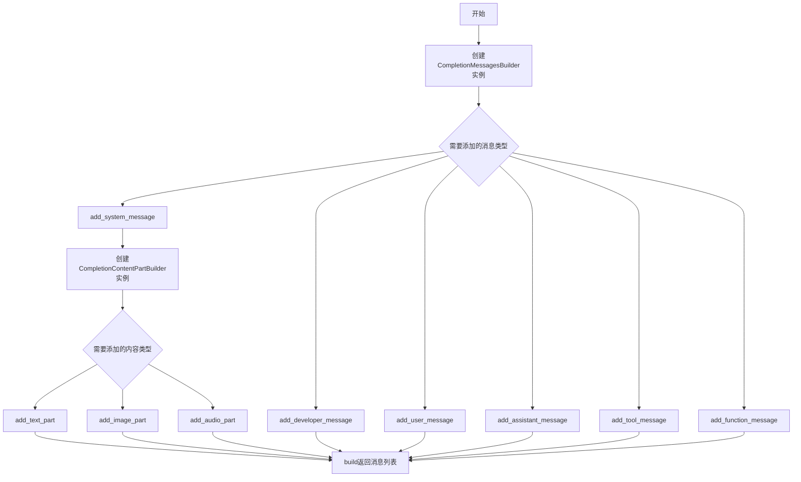

## 类结构

```
CompletionMessagesBuilder (消息构建器类)
└── add_system_message / add_developer_message / add_user_message / add_assistant_message / add_tool_message / add_function_message / build
CompletionContentPartBuilder (内容部分构建器类)
└── add_text_part / add_image_part / add_audio_part / build
```

## 全局变量及字段


### `CompletionMessagesBuilder._messages`
    
存储聊天补全消息的参数列表

类型：`list[ChatCompletionMessageParam]`
    


### `CompletionContentPartBuilder._content_parts`
    
存储聊天内容部分的参数列表

类型：`list[ChatCompletionContentPartParam]`
    
    

## 全局函数及方法


### `CompletionMessagesBuilder.__init__`

初始化 `CompletionMessagesBuilder` 类，创建一个空的消息列表用于存储聊天完成消息参数。

参数：

- （无显式参数，仅包含隐式 `self`）

返回值：`None`，无返回值

#### 流程图

```mermaid
flowchart TD
    A[开始 __init__] --> B[创建空列表赋值给 self._messages]
    B --> C[列表类型为 list[ChatCompletionMessageParam]]
    C --> D[结束]
```

#### 带注释源码

```python
def __init__(self) -> None:
    """Initialize CompletionMessagesBuilder."""
    # 初始化一个空列表，用于存储聊天完成消息参数
    # 列表中的元素类型为 ChatCompletionMessageParam，支持多种消息角色（system、user、assistant、tool等）
    self._messages: list[ChatCompletionMessageParam] = []
```


### `CompletionMessagesBuilder.add_system_message`

向消息列表中添加一条系统消息（system message），支持纯文本或富文本内容，并可选择指定发言者名称。该方法采用建造者模式设计，支持链式调用。

参数：

- `content`：`str | Iterable[ChatCompletionContentPartTextParam]`，系统消息的内容。如果传入 `Iterable[ChatCompletionContentPartTextParam]` 类型，可使用 `CompletionContentPartBuilder` 来构建内容。
- `name`：`str | None`，可选的参与者名称，用于标识系统消息的发送者。

返回值：`CompletionMessagesBuilder`，返回当前 builder 实例本身，以支持链式调用。

#### 流程图

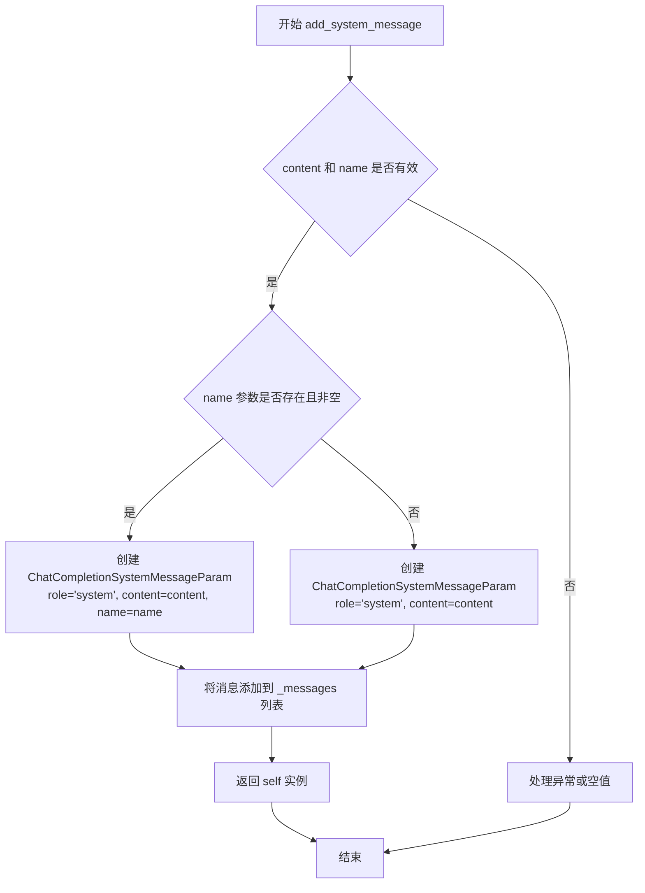

#### 带注释源码

```python
def add_system_message(
    self,
    content: str | Iterable[ChatCompletionContentPartTextParam],
    name: str | None = None,
) -> "CompletionMessagesBuilder":
    """Add system message.

    Parameters
    ----------
    content : str | Iterable[ChatCompletionContentPartTextParam]
        Content of the system message.
        If passing in Iterable[ChatCompletionContentPartTextParam], may use
        `CompletionContentPartBuilder` to build the content.
    name : str | None
        Optional name for the participant.

    Returns
    -------
    None
    """
    # 如果提供了 name 参数，则创建包含 name 的系统消息参数对象
    if name:
        self._messages.append(
            ChatCompletionSystemMessageParam(
                role="system",  # 消息角色固定为 "system"
                content=content,  # 消息内容
                name=name  # 可选的参与者名称
            )
        )
    # 否则创建不包含 name 的系统消息参数对象
    else:
        self._messages.append(
            ChatCompletionSystemMessageParam(role="system", content=content)
        )
    # 返回 self 以支持链式调用（如 builder.add_system_message(...).add_user_message(...)）
    return self
```


### `CompletionMessagesBuilder.add_developer_message`

该方法用于向聊天补全消息列表中添加一条开发者（developer）角色消息，支持纯文本或复杂内容结构，并返回构建器实例以支持链式调用。

参数：

- `content`：`str | Iterable[ChatCompletionContentPartTextParam]`，开发者消息的内容。当传入 `Iterable[ChatCompletionContentPartTextParam]` 时，可使用 `CompletionContentPartBuilder` 构建内容。
- `name`：`str | None`，可选的参与者名称，用于标识消息发送者。

返回值：`CompletionMessagesBuilder`，返回构建器实例本身，支持链式调用。

#### 流程图

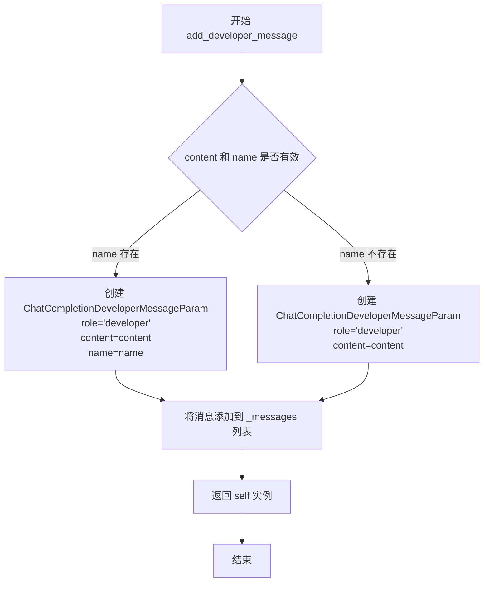

#### 带注释源码

```python
def add_developer_message(
    self,
    content: str | Iterable[ChatCompletionContentPartTextParam],
    name: str | None = None,
) -> "CompletionMessagesBuilder":
    """Add developer message.

    Parameters
    ----------
    content : str | Iterable[ChatCompletionContentPartTextParam]
        Content of the developer message.
        If passing in Iterable[ChatCompletionContentPartTextParam], may use
        `CompletionContentPartBuilder` to build the content.
    name : str | None
        Optional name for the participant.

    Returns
    -------
    CompletionMessagesBuilder
        Returns the builder instance for method chaining.
    """
    # 检查是否提供了 name 参数
    if name:
        # 如果提供了 name，则创建包含 name 的开发者消息参数对象
        # 并添加到内部消息列表中
        self._messages.append(
            ChatCompletionDeveloperMessageParam(
                role="developer", content=content, name=name
            )
        )
    else:
        # 如果没有提供 name，则创建不包含 name 的开发者消息参数对象
        # 并添加到内部消息列表中
        self._messages.append(
            ChatCompletionDeveloperMessageParam(role="developer", content=content)
        )

    # 返回 self 以支持链式调用，例如：
    # builder.add_developer_message(...).add_user_message(...)
    return self
```


### `CompletionMessagesBuilder.add_tool_message`

向消息列表中添加一条工具（tool）消息，用于响应之前的工具调用请求。

参数：

- `content`：`str | Iterable[ChatCompletionContentPartTextParam]`，工具消息的内容。可以是字符串，也可以是文本内容部分的迭代器。
- `tool_call_id`：`str`，对应的工具调用 ID，用于标识该消息响应的是哪一次工具调用。

返回值：`CompletionMessagesBuilder`，返回 self 以支持链式调用。

#### 流程图

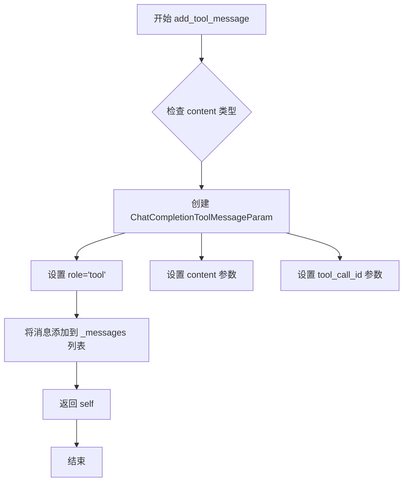

#### 带注释源码

```python
def add_tool_message(
    self,
    content: str | Iterable[ChatCompletionContentPartTextParam],
    tool_call_id: str,
) -> "CompletionMessagesBuilder":
    """Add developer message.

    Parameters
    ----------
    content : str | Iterable[ChatCompletionContentPartTextParam]
        Content of the developer message.
        If passing in Iterable[ChatCompletionContentPartTextParam], may use
        `CompletionContentPartBuilder` to build the content.
    tool_call_id : str
        ID of the tool call that this message is responding to.

    Returns
    -------
    None
    """
    # 将工具消息添加到消息列表中
    # role 固定为 'tool'，表示这是工具返回的消息
    # tool_call_id 指向对应的工具调用请求
    self._messages.append(
        ChatCompletionToolMessageParam(
            role="tool", content=content, tool_call_id=tool_call_id
        )
    )

    # 返回 self 以支持链式调用
    return self
```


### `CompletionMessagesBuilder.add_function_message`

添加函数（function）角色消息到消息列表中，用于构建 ChatCompletion 消息参数。该方法返回一个函数调用的响应消息，支持链式调用。

参数：

- `function_name`：`str`，要调用的函数名称
- `content`：`str | None`，函数消息的内容，可为 None

返回值：`CompletionMessagesBuilder`，返回 self 以支持链式调用

#### 流程图

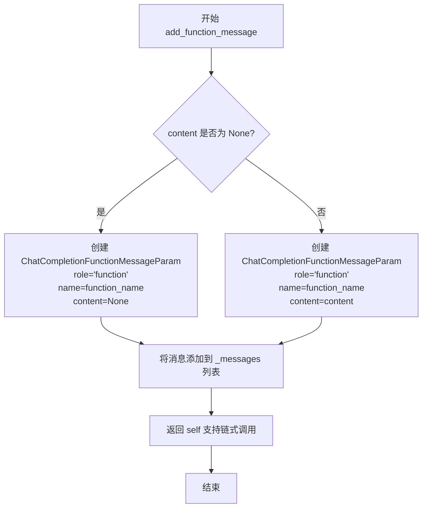

#### 带注释源码

```python
def add_function_message(
    self,
    function_name: str,
    content: str | None = None,
) -> "CompletionMessagesBuilder":
    """Add function message.

    Parameters
    ----------
    function_name : str
        Name of the function to call.
    content : str | None
        Content of the function message.

    Returns
    -------
    None
    """
    # 将函数消息添加到内部消息列表
    # 使用 ChatCompletionFunctionMessageParam 类型
    # role 固定为 'function'，name 为函数名称，content 为消息内容
    self._messages.append(
        ChatCompletionFunctionMessageParam(
            role="function", content=content, name=function_name
        )
    )

    # 返回 self 以支持链式调用（Builder 模式）
    return self
```


### `CompletionMessagesBuilder.add_user_message`

添加用户消息到消息列表中，支持纯文本或复杂内容（包含文本、图像、音频等），并返回构建器实例以支持链式调用。

参数：

- `content`：`str | Iterable[ChatCompletionContentPartParam]`，用户消息的内容。可以是字符串，也可以是使用 `CompletionContentPartBuilder` 构建的复杂内容部分列表。
- `name`：`str | None`，可选的参与者名称。

返回值：`CompletionMessagesBuilder`，返回构建器实例本身，以支持链式方法调用。

#### 流程图

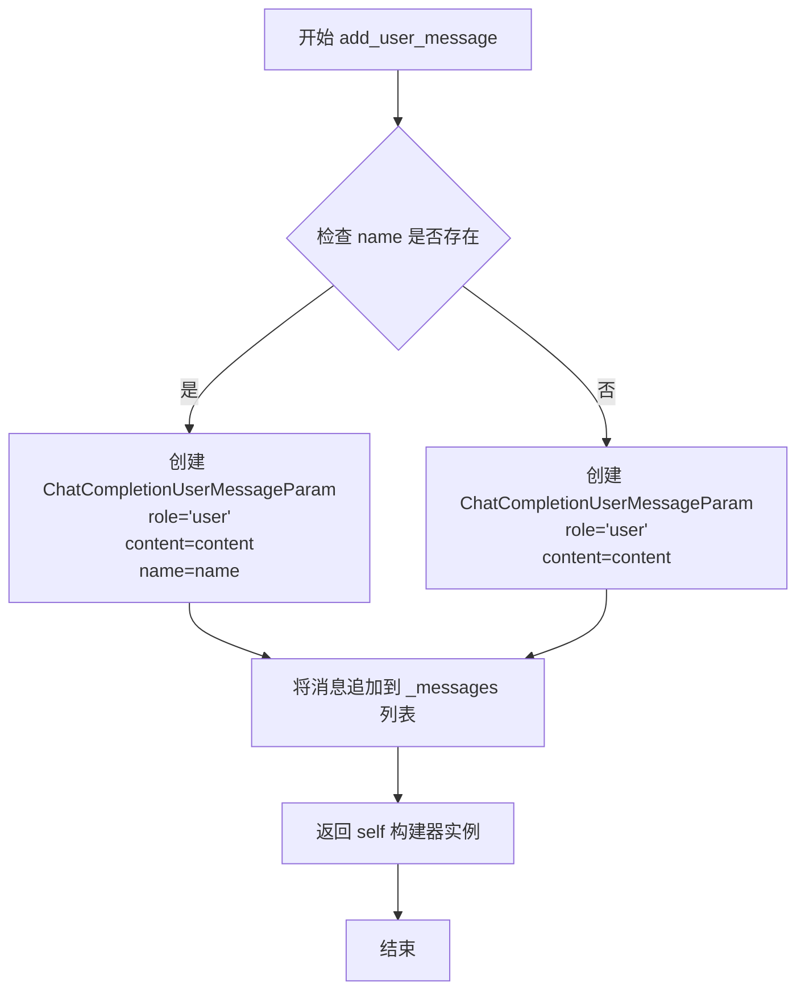

#### 带注释源码

```python
def add_user_message(
    self,
    content: str | Iterable[ChatCompletionContentPartParam],
    name: str | None = None,
) -> "CompletionMessagesBuilder":
    """Add user message.

    Parameters
    ----------
    content : str | Iterable[ChatCompletionContentPartParam]
        Content of the user message.
        If passing in Iterable[ChatCompletionContentPartParam], may use
        `CompletionContentPartBuilder` to build the content.
    name : str | None
        Optional name for the participant.

    Returns
    -------
    None
    """
    # 检查是否提供了参与者名称
    if name:
        # 如果提供了名称，创建包含 name 字段的用户消息参数
        self._messages.append(
            ChatCompletionUserMessageParam(role="user", content=content, name=name)
        )
    else:
        # 如果没有提供名称，创建不包含 name 字段的用户消息参数
        self._messages.append(
            ChatCompletionUserMessageParam(role="user", content=content)
        )

    # 返回 self 以支持链式调用
    return self
```


### `CompletionMessagesBuilder.add_assistant_message`

添加助手消息到消息列表中，支持从字符串或完整的聊天完成消息对象构建助手消息参数，并能保留原始消息中的function_call、tool_calls、audio等扩展信息。

参数：

- `message`：`str | ChatCompletionMessage`，之前的响应消息，可以是字符串内容或完整的ChatCompletionMessage对象
- `name`：`str | None`，可选的参与者名称

返回值：`CompletionMessagesBuilder`，返回实例本身以支持链式调用

#### 流程图

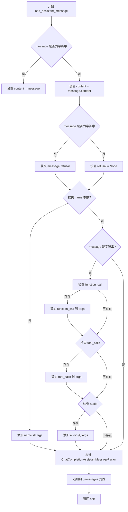

#### 带注释源码

```python
def add_assistant_message(
    self,
    message: str | ChatCompletionMessage,
    name: str | None = None,
) -> "CompletionMessagesBuilder":
    """Add assistant message.

    Parameters
    ----------
    message : ChatCompletionMessage
        Previous response message.
    name : str | None
        Optional name for the participant.

    Returns
    -------
    None
    """
    # 初始化参数字典，包含基本角色和内容
    args = {
        "role": "assistant",
        # 根据message类型确定content：字符串直接使用，否则取message.content
        "content": message if isinstance(message, str) else message.content,
        # refusal字段：字符串类型时为None，否则使用message.refusal
        "refusal": None if isinstance(message, str) else message.refusal,
    }
    
    # 如果提供了可选的name参数，将其添加到参数字典中
    if name:
        args["name"] = name
    
    # 只有当message不是字符串时，才处理其扩展属性
    if not isinstance(message, str):
        # 如果存在function_call，添加到参数中（用于函数调用场景）
        if message.function_call:
            args["function_call"] = message.function_call
        # 如果存在tool_calls，添加到参数中（用于工具调用场景）
        if message.tool_calls:
            args["tool_calls"] = message.tool_calls
        # 如果存在audio，添加到参数中（用于音频响应场景）
        if message.audio:
            args["audio"] = message.audio

    # 使用构建的参数创建ChatCompletionAssistantMessageParam并添加到消息列表
    self._messages.append(ChatCompletionAssistantMessageParam(**args))

    # 返回self以支持链式调用（如builder模式）
    return self
```


### `CompletionMessagesBuilder.build`

该方法用于获取构建后的消息列表，是构建者模式的最终步骤，将内部存储的消息列表（`_messages`）返回给调用者。

参数：

- （无，仅包含隐式参数 `self`）

返回值：`LLMCompletionMessagesParam`，返回构建好的消息列表

#### 流程图

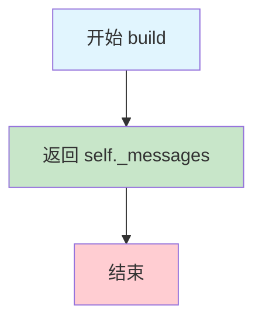

#### 带注释源码

```python
def build(self) -> "LLMCompletionMessagesParam":
    """Get messages.
    
    返回当前构建的消息列表。
    
    Returns
    -------
    LLMCompletionMessagesParam
        消息列表，类型为 list[ChatCompletionMessageParam]
    """
    return self._messages
```


### `CompletionContentPartBuilder.__init__`

初始化 `CompletionContentPartBuilder` 类，创建一个空的内容部分列表用于后续存储文本、图像或音频内容部分。

参数：

- 无（除了隐式的 `self` 参数）

返回值：`None`，无返回值（构造函数）

#### 流程图

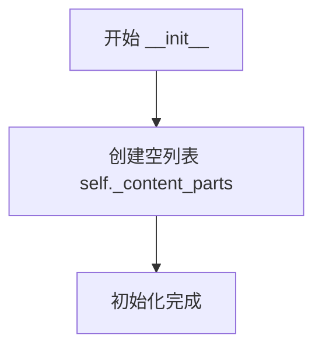

#### 带注释源码

```python
def __init__(self) -> None:
    """Initialize CompletionContentPartBuilder."""
    # 初始化一个空列表，用于存储聊天完成消息的内容部分
    # 类型注解表明列表元素为 ChatCompletionContentPartParam 类型
    self._content_parts: list[ChatCompletionContentPartParam] = []
```


### `CompletionContentPartBuilder.add_text_part`

该方法用于向内容部件列表中添加一个文本部分，通过创建`ChatCompletionContentPartTextParam`对象并将其添加到内部列表中，同时返回`self`以支持链式调用模式。

参数：

- `text`：`str`，要添加的文本内容

返回值：`CompletionContentPartBuilder`，返回当前实例以支持链式调用

#### 流程图

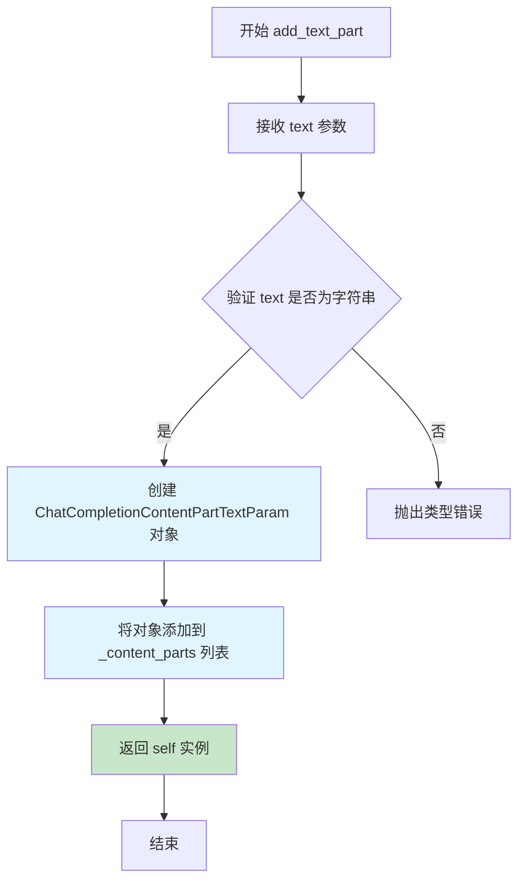

#### 带注释源码

```python
def add_text_part(self, text: str) -> "CompletionContentPartBuilder":
    """Add text part.

    向内容部件列表中添加一个文本部分。该方法是构建多模态消息内容的关键组成部分，
    允许将文本内容与其他类型的内容（如图像、音频）组合在一起。

    Parameters
    ----------
    text : str
        Text content. 要添加的文本内容，不能为空或无效字符串。

    Returns
    -------
    CompletionContentPartBuilder
        返回当前实例（self），以支持链式调用模式。
        调用者可以继续调用其他 add_*_part 方法或 build 方法。
    """
    # 将文本内容包装成符合 OpenAI API 规范的 ChatCompletionContentPartTextParam 对象
    # type="text" 标识这是一个文本内容部分
    self._content_parts.append(
        ChatCompletionContentPartTextParam(text=text, type="text")
    )
    # 返回 self 以支持链式调用，例如 builder.add_text_part("a").add_image_part("...")
    return self
```


### `CompletionContentPartBuilder.add_image_part`

添加图像内容部分到消息构建器中，用于构建包含图像的用户消息内容。

参数：

-  `url`：`str`，图像的 URL 地址或 Base64 编码的图像数据
-  `detail`：`Literal["auto", "low", "high"]`，指定图像的细节层次

返回值：`CompletionContentPartBuilder`，返回构建器实例本身，支持链式调用

#### 流程图

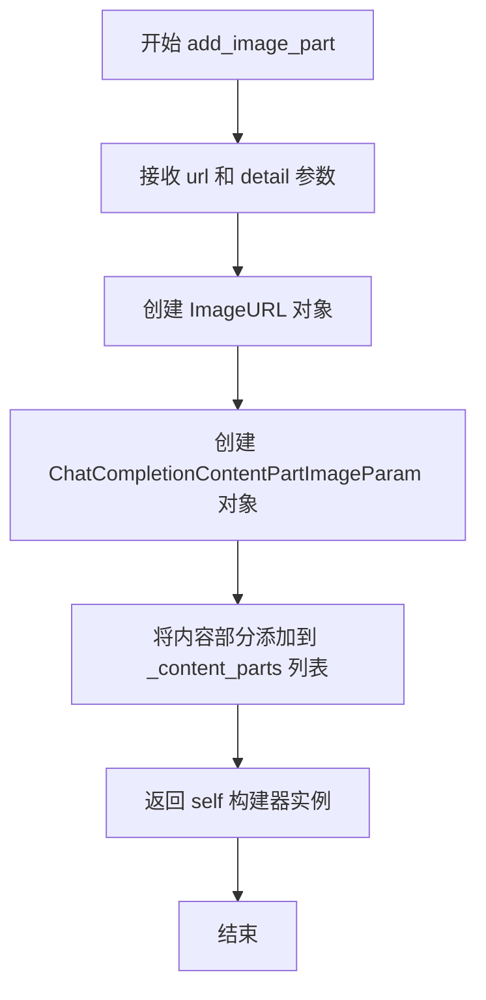

#### 带注释源码

```python
def add_image_part(
    self, url: str, detail: Literal["auto", "low", "high"]
) -> "CompletionContentPartBuilder":
    """Add image part.

    Parameters
    ----------
    url : str
        Either an URL of the image or the base64 encoded image data.
    detail : Literal["auto", "low", "high"]
        Specifies the detail level of the image.

    Returns
    -------
    None
    """
    # 创建一个 ImageURL 对象，包含图像URL和细节级别
    # ImageURL 是 openai 库中的类型，用于表示图像内容
    image_url_obj = ImageURL(url=url, detail=detail)
    
    # 创建图像内容部分参数对象
    # ChatCompletionContentPartImageParam 是 OpenAI API 需要的图像内容参数格式
    image_param = ChatCompletionContentPartImageParam(
        image_url=image_url_obj,  # 传入 ImageURL 对象
        type="image_url"           # 指定类型为 image_url
    )
    
    # 将构建好的图像内容参数添加到内部列表中
    self._content_parts.append(image_param)
    
    # 返回 self 以支持链式调用
    return self
```


### `CompletionContentPartBuilder.add_audio_part`

该方法用于向消息内容中添加音频部分，将Base64编码的音频数据与指定的格式（wav或mp3）封装为OpenAI API兼容的音频内容参数，并支持链式调用。

参数：

-  `data`：`str`，Base64编码的音频数据
-  `_format`：`Literal["wav", "mp3"]`，编码音频数据的格式，目前支持"wav"和"mp3"

返回值：`CompletionContentPartBuilder`，返回self以支持链式调用

#### 流程图

```mermaid
flowchart TD
    A[开始 add_audio_part] --> B[接收 data: str 和 _format: Literal["wav", "mp3"]]
    B --> C[创建 InputAudio 对象<br/>input_audio=InputAudio(data=data, format=_format)]
    C --> D[创建 ChatCompletionContentPartInputAudioParam 对象<br/>type='input_audio']
    D --> E[将内容部分添加到 _content_parts 列表]
    E --> F[返回 self CompletionContentPartBuilder]
    F --> G[结束]
```

#### 带注释源码

```python
def add_audio_part(
    self, data: str, _format: Literal["wav", "mp3"]
) -> "CompletionContentPartBuilder":
    """Add audio part.

    Parameters
    ----------
    data : str
        Base64 encoded audio data.
    _format : Literal["wav", "mp3"]
        The format of the encoded audio data. Currently supports "wav" and "mp3".

    Returns
    -------
    None
    """
    # 创建InputAudio对象，包含base64编码的音频数据和格式
    self._content_parts.append(
        ChatCompletionContentPartInputAudioParam(
            input_audio=InputAudio(data=data, format=_format), type="input_audio"
        )
    )
    # 返回self以支持链式调用
    return self
```


### `CompletionContentPartBuilder.build`

该方法用于构建并返回聊天完成请求的内容部分列表（Content Parts），支持文本、图像和音频等多种内容类型的组合。

参数： 无（仅包含 `self` 参数）

返回值：`list[ChatCompletionContentPartParam]`，返回构建好的内容部分列表，包含所有已添加的文本、图像或音频部分。

#### 流程图

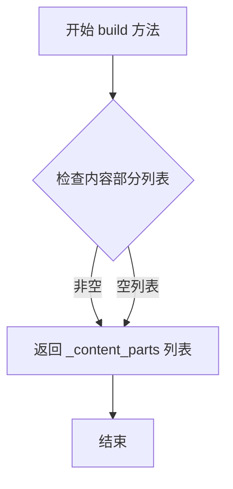

#### 带注释源码

```python
def build(self) -> list[ChatCompletionContentPartParam]:
    """Get content parts.

    Returns
    -------
    list[ChatCompletionContentPartParam]
        List of content parts.
    """
    # 返回内部存储的内容部分列表
    # 该列表包含通过 add_text_part、add_image_part、add_audio_part 方法添加的所有内容
    return self._content_parts
```

## 关键组件


### CompletionMessagesBuilder

负责构建聊天补全消息列表的类，支持添加系统消息、开发者消息、用户消息、助手消息、工具消息和函数消息。采用流式API设计，通过链式调用添加各类消息，最终通过build方法返回消息列表。

### CompletionContentPartBuilder

负责构建消息内容部分的类，支持添加文本部分、图像部分和音频部分。该类同样采用流式API设计，允许链式添加多种类型的内容片段，最终通过build方法返回内容部分列表。

### 消息类型支持

代码支持多种聊天补全消息类型，包括ChatCompletionSystemMessageParam、ChatCompletionDeveloperMessageParam、ChatCompletionUserMessageParam、ChatCompletionAssistantMessageParam、ChatCompletionToolMessageParam和ChatCompletionFunctionMessageParam，覆盖了OpenAI API的完整消息角色体系。

### 内容部分构建

支持三种内容部分类型：文本部分(ChatCompletionContentPartTextParam)、图像部分(ChatCompletionContentPartImageParam)和音频部分(ChatCompletionContentPartInputAudioParam)，实现了对多模态输入的完整支持。

### 链式调用模式

采用Fluent Interface设计模式，所有add方法都返回self引用，支持方法链式调用，使代码更加简洁和可读。

### 工具调用支持

在add_assistant_message方法中完整处理了function_call和tool_calls属性，支持助手消息中携带工具调用信息，实现完整的函数调用链支持。


## 问题及建议


### 已知问题

-   **文档字符串与实际返回值不一致**：`add_system_message`、`add_developer_message`、`add_tool_message`、`add_function_message`、`add_user_message`、`add_assistant_message` 等方法的文档中返回值描述为 "Returns ------- None"，但实际返回的是 `self`（支持链式调用）
-   **文档字符串错误**：`add_tool_message` 方法的文档描述为 "Add developer message"，应更正为 "Add tool message"
-   **方法实现不完整**：`add_developer_message` 方法缺少 `return self` 语句，导致无法支持链式调用（虽然文档说返回 None，但其他类似方法都返回 self 以支持流畅接口）
-   **参数命名不一致**：`add_audio_part` 方法的参数 `_format` 使用下划线前缀表示私有，但在公开 API 中这可能造成困惑；`add_function_message` 的参数名为 `function_name` 而非 `name`，与其他方法（如 `ChatCompletionFunctionMessageParam` 中的 `name`）命名风格不一致
-   **缺少输入验证**：未对 URL 格式、base64 编码数据有效性、tool_call_id 格式等进行验证，可能导致运行时错误
-   **类型注解可优化**：多处使用 `str | None` 而可考虑使用 `Optional[str]` 保持一致性；`_format` 参数应避免使用下划线前缀以保持 API 清晰

### 优化建议

-   修正所有方法的文档字符串，确保返回值描述与实际返回值一致（返回 `CompletionMessagesBuilder` 或 `CompletionContentPartBuilder` 实例）
-   修复 `add_tool_message` 的文档描述
-   为 `add_developer_message` 添加 `return self` 语句以保持 API 一致性
-   考虑将 `_format` 参数重命名为 `format`（或 `audio_format`），避免下划线前缀
-   添加输入验证逻辑，如验证 URL 格式、检查 base64 数据有效性、验证 tool_call_id 不为空等
-   考虑添加类型别名以简化长类型注解，提高代码可读性
-   统一参数命名风格，如 `function_name` 改为 `name` 与其他方法保持一致

## 其它


### 设计目标与约束

**设计目标**：提供流畅的链式API（Fluent API）用于构建符合OpenAI Chat API格式要求的聊天消息，支持系统消息、开发者消息、用户消息、助手消息、工具消息和函数消息等多种消息类型的构建，同时支持多模态内容（文本、图像、音频）的构建。

**设计约束**：必须兼容OpenAI的types库中定义的所有消息参数类型，必须支持链式调用以提升使用体验，必须保持不可变性（每次添加消息返回新实例或保持内部状态一致）。

### 错误处理与异常设计

**参数校验**：当前实现主要依赖Python的类型注解进行静态检查，运行时校验较为有限。建议增加以下运行时校验：content参数不应为空字符串或None（对于必填字段），tool_call_id在add_tool_message中应为非空字符串，function_name在add_function_message中应为非空字符串。

**异常传播**：当前代码未显式定义异常类，错误将通过Python原生异常（如TypeError、KeyError）传播。建议在文档中明确说明可能抛出的异常类型及触发条件。

**边界情况处理**：对于message参数的多种类型处理（str vs ChatCompletionMessage）已通过isinstance检查实现，但对None值的处理未做显式说明。

### 数据流与状态机

**状态转换**：CompletionMessagesBuilder内部维护一个可变列表`_messages`，通过add_*系列方法向列表中添加不同类型的消息，build方法返回当前消息列表的副本。状态转换是单向的，只能添加消息，不能删除或修改已添加的消息。

**内容构建流程**：CompletionContentPartBuilder采用类似的构建者模式，通过add_text_part、add_image_part、add_audio_part方法向_content_parts列表添加内容片段，最终通过build方法返回完整的内容参数列表。

**不可变性保证**：虽然内部使用可变列表存储消息，但build方法返回的是列表引用而非副本，使用者应注意不要修改返回值以避免意外修改构建器内部状态。

### 外部依赖与接口契约

**核心依赖**：openai库提供的类型定义（ChatCompletionMessageParam及各类消息参数类型），graphrag_llm.types中的LLMCompletionMessagesParam类型（用于类型注解）。

**接口契约**：所有add_*方法返回self以支持链式调用，build方法返回最终构建的消息列表。所有方法签名中content参数支持Union[str, Iterable[ChatCompletionContentPartParam]]类型，体现了OpenAI API的灵活性。

### 性能考虑

**内存优化**：当前实现中build方法返回内部列表引用而非深拷贝，对于需要保持构建结果不变的场景可能存在风险。消息内容直接引用传入的参数对象，未进行深拷贝。

**计算效率**：每次add操作都直接向列表append，操作复杂度为O(1)。内容构建部分每次也直接append，效率较高。

### 测试建议

**单元测试覆盖**：应覆盖所有add_*方法的基本功能，链式调用场景，不同content类型（str vs Iterable）的处理，build方法的返回值验证， CompletionContentPartBuilder的各类型内容构建。

**边界条件测试**：空字符串content的处理，None值的各参数处理，极长内容的处理（可能触发API限制）。


    