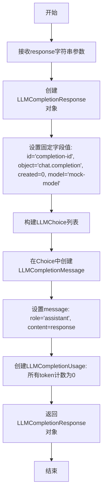
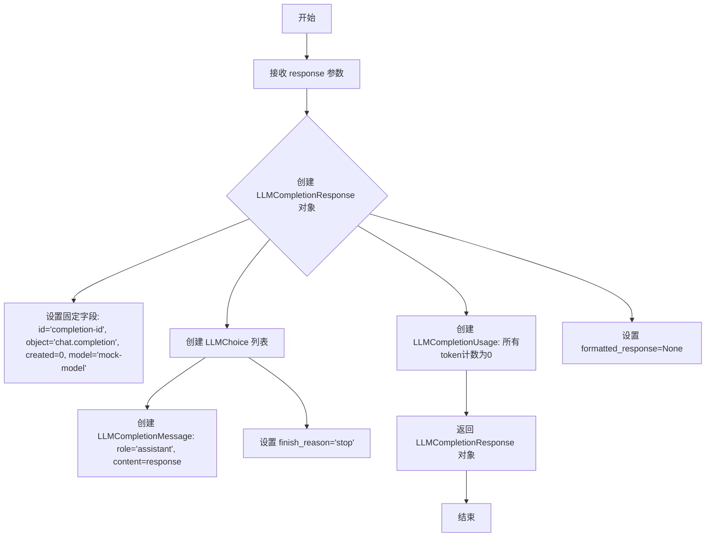
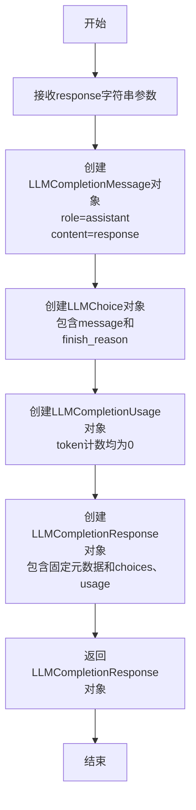

# `graphrag\packages\graphrag-llm\graphrag_llm\utils\create_completion_response.py` 详细设计文档

该代码定义了一个用于创建模拟LLM完成响应对象的工具函数，将字符串响应封装为符合OpenAI聊天完成接口格式的LLMCompletionResponse对象。

## 整体流程



## 类结构

```
无类定义 (该文件仅包含函数)
└── create_completion_response (模块级函数)
```

## 全局变量及字段


    

## 全局函数及方法


### `create_completion_response`

该函数用于根据传入的响应字符串创建一个模拟的 LLM（大型语言模型）完成响应对象，包含预定义的 ID、模型信息、消息角色、内容以及使用统计等字段，常用于测试或模拟 LLM 调用场景。

参数：

- `response`：`str`，待包装成 LLM 完成响应内容的字符串

返回值：`LLMCompletionResponse`，封装好的完整 LLM 完成响应对象，包含消息、用法统计等完整结构

#### 流程图



#### 带注释源码

```python
# 导入所需的类型定义
from graphrag_llm.types import (
    LLMChoice,              # LLM 选项结构
    LLMCompletionMessage,  # LLM 完成消息
    LLMCompletionResponse, # LLM 完成响应
    LLMCompletionUsage,    # LLM 使用统计
)


def create_completion_response(response: str) -> LLMCompletionResponse:
    """Create a completion response object.

    Args:
        response: The completion response string.

    Returns
    -------
        LLMCompletionResponse: The completion response object.
    """
    # 构建并返回完整的 LLM 完成响应对象
    return LLMCompletionResponse(
        id="completion-id",           # 响应唯一标识
        object="chat.completion",     # 响应对象类型
        created=0,                    # 创建时间戳
        model="mock-model",           # 模拟模型名称
        choices=[                     # 选择列表（包含助手回复）
            LLMChoice(
                index=0,              # 选项索引
                message=LLMCompletionMessage(
                    role="assistant", # 消息角色为助手
                    content=response, # 消息内容为传入的响应
                ),
                finish_reason="stop", # 结束原因：正常停止
            )
        ],
        usage=LLMCompletionUsage(     # token 使用统计
            prompt_tokens=0,          # 提示词 token 数量
            completion_tokens=0,      # 完成 token 数量
            total_tokens=0,           # 总 token 数量
        ),
        formatted_response=None,      # 格式化响应（可选）
    )
```

## 关键组件


### create_completion_response 函数

创建模拟的 LLM 完成响应对象，将字符串响应封装为标准化的 OpenAI 格式响应结构

### LLMCompletionResponse 类型

表示完整的聊天完成响应，包含 id、object、created、model、choices、usage 和 formatted_response 字段

### LLMChoice 类型

表示响应中的单个选择项，包含 index、message、finish_reason 字段

### LLMCompletionMessage 类型

表示聊天消息，包含 role 和 content 字段

### LLMCompletionUsage 类型

表示令牌使用统计，包含 prompt_tokens、completion_tokens 和 total_tokens 字段


## 问题及建议


### 已知问题

- 硬编码的响应字段：id、created、model、finish_reason 等字段均为硬编码的固定值（如 "completion-id"、0、"mock-model"、"，导致函数缺乏实际使用灵活性
- Token 使用量全为零：usage 中的 prompt_tokens、completion_tokens、total_tokens 均为 0，无法真实反映实际的 token 消耗情况
- 缺乏输入验证：未对 response 参数进行有效性检查（如空字符串、None 值等）
- formatted_response 字段为 None：该字段被设置为 None 但存在于响应对象中，语义不明确
- finish_reason 固定为 "stop"：不支持其他可能的结束原因（如 "length"、"content_filter" 等）
- 缺乏对多choices的支持：choices 列表固定为单元素，无法生成多个候选响应

### 优化建议

- 将硬编码值改为可选参数：允许调用者通过参数自定义 id、model、created、usage 等字段，提高函数的通用性
- 添加输入验证逻辑：对 response 参数进行非空检查，抛出明确的异常信息
- 支持动态生成 id：使用 uuid 或时间戳生成唯一的响应 ID
- 支持多 choices：添加参数支持生成多个候选响应选项
- 支持自定义 finish_reason：添加参数允许调用者指定结束原因
- 补充 usage 统计逻辑：基于实际 response 长度估算 token 使用量
- 改进类型注解：考虑使用 TypedDict 或 dataclass 替代简单的类型注解，提高代码可读性

## 其它


### 1. 一段话描述

该代码是一个简单的响应构建工具函数，用于将字符串格式的LLM响应转换为符合OpenAI Chat Completion API规范的LLMCompletionResponse对象，主要用于模拟测试或填充接口返回值。

### 2. 整体运行流程

该函数接收一个字符串参数`response`，然后创建一个包含预定义元数据（如固定ID"completion-id"、对象类型"chat.completion"、模型名称"mock-model"等）的LLMCompletionResponse对象，并将输入的字符串作为assistant角色的消息内容返回。整个过程是同步的、无状态的转换操作。

### 3. 类的详细信息

#### 3.1 类字段

由于该代码不包含类定义，仅包含一个函数，因此此处列出相关类型类的字段信息：

- **LLMCompletionResponse类字段**：
  - id: str类型，响应唯一标识符
  - object: str类型，对象类型名称
  - created: int类型，创建时间戳
  - model: str类型，使用的模型名称
  - choices: List[LLMChoice]类型，响应选项列表
  - usage: LLMCompletionUsage类型，token使用情况
  - formatted_response: Any类型，格式化后的响应内容

- **LLMChoice类字段**：
  - index: int类型，选项索引
  - message: LLMCompletionMessage类型，消息对象
  - finish_reason: str类型，完成原因

- **LLMCompletionMessage类字段**：
  - role: str类型，消息角色
  - content: str类型，消息内容

- **LLMCompletionUsage类字段**：
  - prompt_tokens: int类型，输入token数量
  - completion_tokens: int类型，输出token数量
  - total_tokens: int类型，总token数量

#### 3.2 类方法

该代码不包含类方法。

### 4. 全局变量和全局函数

#### 4.1 全局变量

该代码不包含全局变量。

#### 4.2 全局函数

**函数名称**：create_completion_response

**参数**：
- 参数名称：response
- 参数类型：str
- 参数描述：需要包装成LLM完成响应的字符串内容

**返回值类型**：LLMCompletionResponse

**返回值描述**：包含完整响应元数据的LLMCompletionResponse对象，包含固定的模拟值和传入的响应内容

**mermaid流程图**：



**带注释源码**：

```python
def create_completion_response(response: str) -> LLMCompletionResponse:
    """Create a completion response object.

    Args:
        response: The completion response string.

    Returns
    -------
        LLMCompletionResponse: The completion response object.
    """
    # 返回构建好的LLMCompletionResponse对象，包含：
    # - 固定的响应ID、对象类型、创建时间、模型名称
    # - choices列表，包含一条LLMChoice，其中message为assistant角色的响应内容
    # - usage信息，所有token计数为0
    # - formatted_response为None
    return LLMCompletionResponse(
        id="completion-id",
        object="chat.completion",
        created=0,
        model="mock-model",
        choices=[
            LLMChoice(
                index=0,
                message=LLMCompletionMessage(
                    role="assistant",
                    content=response,
                ),
                finish_reason="stop",
            )
        ],
        usage=LLMCompletionUsage(
            prompt_tokens=0,
            completion_tokens=0,
            total_tokens=0,
        ),
        formatted_response=None,
    )
```

### 5. 关键组件信息

- **LLMCompletionResponse类型**：核心返回类型，封装完整的OpenAI风格的聊天完成响应结构
- **LLMChoice类型**：表示响应的单个选项，包含消息内容和完成原因
- **LLMCompletionMessage类型**：表示聊天消息，包含角色和内容
- **LLMCompletionUsage类型**：表示token使用统计信息
- **graphrag_llm.types模块**：提供上述所有类型定义的外部依赖模块

### 6. 设计目标与约束

- **设计目标**：提供一种简单的方式来创建符合标准格式的LLM响应对象，主要用于测试、模拟或填充接口返回值
- **约束条件**：
  - 返回的响应使用硬编码的模拟值（id="completion-id"、model="mock-model"等）
  - token使用量固定为0，不反映实际使用情况
  - 仅支持单选项响应，不支持多选项
  - finish_reason固定为"stop"

### 7. 错误处理与异常设计

- **当前实现**：该函数不包含任何错误处理逻辑
- **潜在问题**：
  - 未对输入参数`response`进行类型检查或空值校验
  - 未处理`response`为None的情况
  - 未处理`response`包含特殊字符或过长的内容
- **改进建议**：添加输入验证，检查response是否为字符串且不为空

### 8. 数据流与状态机

- **数据流**：输入字符串 → LLMCompletionMessage → LLMChoice → LLMCompletionResponse → 返回值
- **状态机**：该函数为纯函数，无状态转换，属于简单的数据转换操作

### 9. 外部依赖与接口契约

- **外部依赖**：
  - graphrag_llm.types模块中的LLMCompletionResponse、LLMChoice、LLMCompletionMessage、LLMCompletionUsage类型
- **接口契约**：
  - 输入：接受一个字符串类型的response参数
  - 输出：返回一个LLMCompletionResponse对象
  - 兼容性：返回的对象结构符合OpenAI Chat Completion API响应格式

### 10. 性能考虑

- **性能特点**：该函数执行简单的对象构造，时间复杂度和空间复杂度均为O(1)
- **优化建议**：当前实现已足够高效，无需优化

### 11. 安全性考虑

- **当前安全性**：无敏感信息处理，函数仅返回模拟数据
- **潜在风险**：无

### 12. 测试策略

- **测试建议**：
  - 测试正常输入字符串的转换
  - 测试空字符串输入
  - 测试特殊字符输入
  - 验证返回对象的各个字段值是否符合预期

### 13. 版本兼容性

- **Python版本**：需Python 3.8+（基于类型注解使用）
- **依赖版本**：需graphrag_llm.types模块支持

### 14. 配置管理

- **当前状态**：无配置选项，所有返回值为硬编码
- **可扩展性**：可通过参数化将id、model等值提取为可选参数以提高灵活性

### 15. 日志与监控

- **当前状态**：无日志记录
- **建议**：如用于生产环境，可添加日志记录响应创建过程

### 16. 潜在的技术债务或优化空间

1. **硬编码值问题**：所有响应元数据（id、model、created等）均为硬编码，建议改为可配置或动态生成
2. **功能单一**：仅支持单选项响应，无法满足多选项场景需求
3. **token统计不真实**：usage字段固定为0，不反映实际使用情况
4. **缺少输入验证**：未对输入参数进行校验
5. **扩展性不足**：无法指定finish_reason、role等可变参数
6. **无异步支持**：仅支持同步调用，如需异步场景需额外封装
7. **测试完整性**：建议增加更全面的单元测试和边界用例测试

### 17. 其它项目

- **使用场景**：主要用于单元测试、mock对象创建、接口填充等场景
- **文档完善度**：函数已有基础docstring，但可增加更多使用示例
- **代码质量**：代码简洁清晰，符合Python风格指南，但可增加类型检查和输入验证

    