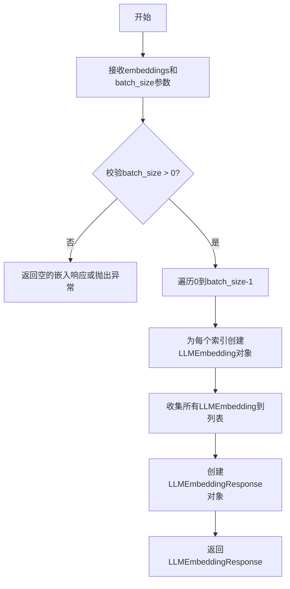
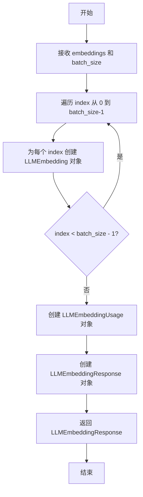

# `graphrag\packages\graphrag-llm\graphrag_llm\utils\create_embedding_response.py` 详细设计文档

该代码是一个嵌入响应创建工具模块，提供create_embedding_response函数，用于将嵌入向量列表封装成标准化的LLMEmbeddingResponse对象，支持批量生成多个嵌入条目并返回符合LLM接口规范的响应格式。

## 整体流程



## 类结构

```
无类定义 (模块级函数)
└── create_embedding_response (全局函数)
```

## 全局变量及字段


### `embeddings`
    
输入的嵌入向量列表

类型：`list[float]`
    


### `batch_size`
    
批处理大小，默认为1

类型：`int`
    


### `embeddings_objects`
    
由嵌入向量转换而成的LLMEmbedding对象列表

类型：`list[LLMEmbedding]`
    


### `index`
    
循环索引，用于标识每个嵌入对象在列表中的位置

类型：`int`
    


    

## 全局函数及方法


### `create_embedding_response`

创建嵌入响应对象的工具函数，用于将嵌入向量列表转换为符合 LLM 嵌入响应格式的 `LLMEmbeddingResponse` 对象。

参数：

- `embeddings`：`list[float]`，嵌入向量列表
- `batch_size`：`int`，批次大小，默认为 1

返回值：`LLMEmbeddingResponse`，创建的嵌入响应对象，包含嵌入向量数据和使用统计信息

#### 流程图



#### 带注释源码

```python
# 导入必要的类型定义
from graphrag_llm.types import LLMEmbedding, LLMEmbeddingResponse, LLMEmbeddingUsage


def create_embedding_response(
    embeddings: list[float], batch_size: int = 1
) -> LLMEmbeddingResponse:
    """Create a CreateEmbeddingResponse object.

    Args:
        embeddings: List of embedding vectors.
        batch_size: The number of embeddings to generate (default: 1).

    Returns
    -------
        An LLMEmbeddingResponse object.
    """
    # 根据 batch_size 创建多个嵌入对象
    embeddings_objects = [
        LLMEmbedding(
            object="embedding",
            embedding=embeddings,
            index=index,
        )
        for index in range(batch_size)
    ]

    # 构建并返回完整的嵌入响应对象
    return LLMEmbeddingResponse(
        object="list",
        data=embeddings_objects,
        model="mock-model",
        usage=LLMEmbeddingUsage(
            prompt_tokens=0,
            total_tokens=0,
        ),
    )
```

## 关键组件


### create_embedding_response 函数

该函数是核心入口，接收嵌入向量列表和批次大小参数，构建并返回标准化的LLMEmbeddingResponse对象，包含嵌入数据、模型标识和使用统计信息。

### LLMEmbedding 对象创建逻辑

通过列表推导式批量生成LLMEmbedding对象，每个对象包含object类型标识、embedding向量、index索引，支持多批次嵌入的序列化管理。

### LLMEmbeddingResponse 对象构建

组装响应数据结构，包含data数组、object类型、model名称和usage使用统计信息，返回符合LLM接口规范的响应对象。

### 批次处理与索引管理

根据batch_size参数动态生成索引序列，实现嵌入向量与批次的映射关系，支持1到N批次的多样化请求处理。


## 问题及建议


### 已知问题

- **参数不一致**：函数签名定义了 `batch_size` 参数，但文档字符串中却描述了 `model` 参数，造成文档与实现不匹配。
- **批次大小与嵌入列表长度脱节**：`batch_size` 参数与实际 `embeddings` 列表长度没有关联，可能导致返回的嵌入对象数量与输入数据不对应。
- **硬编码值缺乏灵活性**：模型名称固定为 `"mock-model"`，使用量（usage）全部为 0，这些值应该由调用者传入或根据实际计算得出。
- **缺少输入验证**：未对 `embeddings` 是否为空、`batch_size` 是否为正数等边界情况进行校验，可能导致运行时错误或不符合预期的行为。

### 优化建议

- **移除或完善文档字符串**：删除文档中提及但未实现的 `model` 参数描述，或在函数签名中添加该参数。
- **根据嵌入列表长度动态计算批次**：使用 `len(embeddings)` 替代 `batch_size` 参数，或确保两者保持一致。
- **参数化硬编码值**：将 `model` 名称和使用量信息作为可选参数传入，使函数更具通用性。
- **添加输入校验逻辑**：在函数开头检查 `embeddings` 非空、`batch_size` 为正整数等约束条件，提升函数健壮性。

## 其它


### 设计目标与约束

本模块旨在为LLM嵌入功能提供标准化的响应对象创建能力，确保返回格式符合行业通用的嵌入API响应规范。设计约束包括：仅支持批量嵌入响应生成，不支持流式响应，不处理实际的嵌入计算逻辑。

### 错误处理与异常设计

当前实现缺少显式的错误处理机制。潜在异常场景包括：embeddings列表为空时的处理、batch_size与embeddings长度不匹配时的行为、类型验证失败时的异常抛出。建议增加输入参数校验，抛出ValueError或TypeError异常，并添加详细的错误信息描述。

### 外部依赖与接口契约

本模块依赖graphrag_llm.types模块中的三个类型：LLMEmbedding、LLMEmbeddingResponse、LLMEmbeddingUsage。接口契约要求：调用方需提供有效的浮点数列表作为embeddings参数，batch_size默认为1，返回值始终为LLMEmbeddingResponse类型对象。

### 性能考虑与优化空间

当前实现使用列表推导式创建嵌入对象，对于大批量场景可能存在性能瓶颈。建议：对于batch_size较大的场景考虑生成器替代列表推导式，缓存常用的model名称和usage对象以减少重复对象创建。

### 配置参数说明

create_embedding_response函数包含两个参数：embeddings (list[float]) - 嵌入向量列表，必填参数；batch_size (int) - 批处理大小，默认值为1，用于控制返回的嵌入对象数量。

### 使用示例与调用约定

基本调用示例：response = create_embedding_response([0.1, 0.2, 0.3])，批量调用示例：response = create_embedding_response([0.1, 0.2, 0.3], batch_size=5)。调用方应确保embeddings参数非空且为浮点数类型。

### 版本信息与变更历史

当前版本：1.0.0，变更说明：初始版本，封装嵌入响应对象创建逻辑，支持单条和批量嵌入响应生成。

### 测试覆盖范围

建议测试用例包括：正常单条嵌入响应生成、批量嵌入响应生成、空嵌入列表处理、无效batch_size处理、embeddings类型验证、返回值结构完整性验证。

### 安全性考虑

当前实现不涉及敏感数据处理，嵌入向量为数值类型。建议在后续扩展中添加输入长度限制检查，防止超大规模嵌入向量导致的内存问题。


    