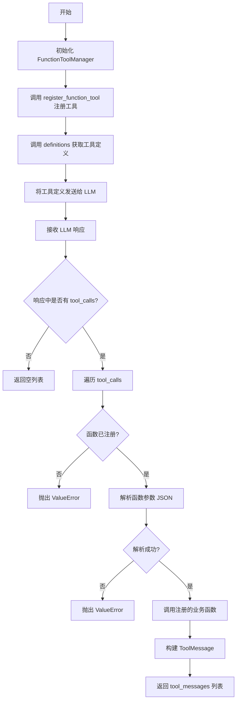
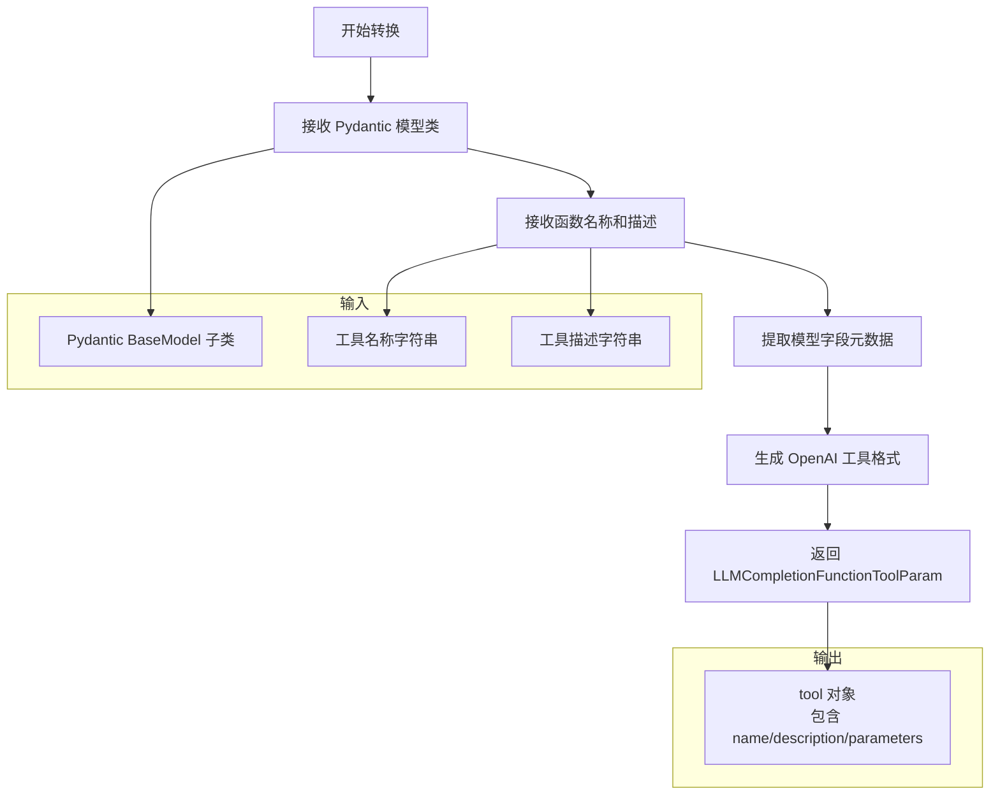
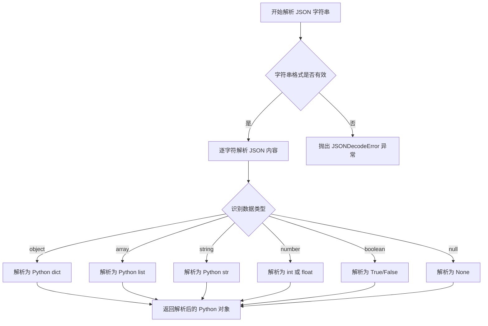
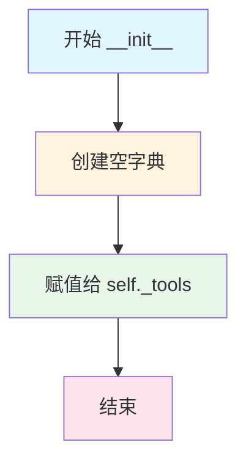
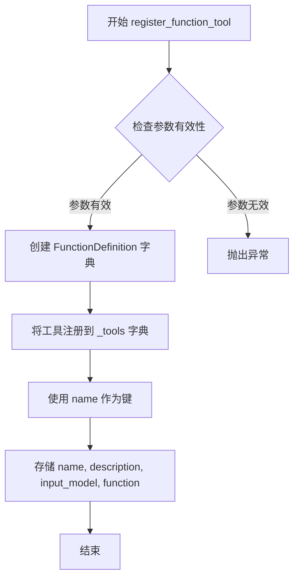
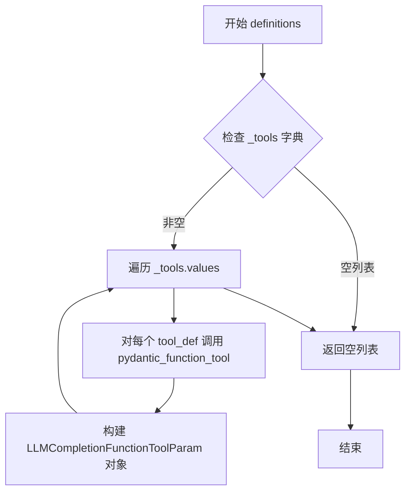

# `graphrag\packages\graphrag-llm\graphrag_llm\utils\function_tool_manager.py` 详细设计文档

这是一个函数工具管理器，用于注册、管理和调用LLM（大型语言模型）的函数工具，支持将Python函数转换为LLM可调用的工具，并处理工具调用的请求和响应。

## 整体流程



## 类结构

```
FunctionDefinition (TypedDict 泛型类)
├── name: str
├── description: str
├── input_model: type[FunctionArgumentModel]
└── function: Callable[[FunctionArgumentModel], str]

ToolMessage (TypedDict)
├── content: str
└── tool_call_id: str

FunctionToolManager (核心管理类)
├── _tools: dict[str, FunctionDefinition[Any]]
├── __init__()
├── register_function_tool()
├── definitions()
└── call_functions()
```

## 全局变量及字段


### `FunctionArgumentModel`
    
类型变量，用于泛型约束必须是 BaseModel 的子类

类型：`TypeVar`
    


### `FunctionDefinition.FunctionDefinition.name`
    
函数工具名称

类型：`str`
    


### `FunctionDefinition.FunctionDefinition.description`
    
函数工具描述

类型：`str`
    


### `FunctionDefinition.FunctionDefinition.input_model`
    
输入参数模型类型

类型：`type[FunctionArgumentModel]`
    


### `FunctionDefinition.FunctionDefinition.function`
    
实际执行的函数

类型：`Callable[[FunctionArgumentModel], str]`
    


### `ToolMessage.ToolMessage.content`
    
函数执行结果内容

类型：`str`
    


### `ToolMessage.ToolMessage.tool_call_id`
    
工具调用ID，用于关联请求和响应

类型：`str`
    


### `FunctionToolManager.FunctionToolManager._tools`
    
存储已注册的函数工具字典

类型：`dict[str, FunctionDefinition[Any]]`
    
    

## 全局函数及方法


### `pydantic_function_tool`

将 Pydantic 模型转换为 OpenAI API 兼容的函数工具定义格式，使得大型语言模型能够调用结构化的函数。

参数：

- `model`：`type[BaseModel]`，Pydantic 模型类，用于定义函数工具的参数模式
- `name`：`str`，函数工具的名称，用于在 LLM 调用时识别
- `description`：`str`，函数工具的描述，帮助 LLM 理解函数的用途

返回值：`LLMCompletionFunctionToolParam`，OpenAI API 兼容的函数工具定义参数对象

#### 流程图



#### 带注释源码

```python
# pydantic_function_tool 是 OpenAI 库提供的工具函数
# 用于将 Pydantic 模型转换为 LLM 可用的函数工具定义

# 在 FunctionToolManager.definitions() 方法中的实际调用方式：
pydantic_function_tool(
    tool_def["input_model"],    # 输入：Pydantic 模型类（type[BaseModel]）
    name=tool_def["name"],       # 输入：工具名称（str）
    description=tool_def["description"],  # 输入：工具描述（str）
)

# 返回值示例结构：
# {
#     "type": "function",
#     "function": {
#         "name": "tool_name",
#         "description": "Tool description",
#         "parameters": {
#             "type": "object",
#             "properties": {
#                 "param1": {"type": "string", "description": "..."}
#             },
#             "required": ["param1"]
#         }
#     }
# }
```


### `json.loads`

`json.loads` 是 Python 标准库 `json` 模块中的函数，用于将 JSON 格式的字符串解析为 Python 对象（如字典、列表、字符串、数字、布尔值或 None）。

参数：

-  `s`：`str`，要解析的 JSON 字符串，包含函数参数的数据
-  `cls`（可选）：`json.JSONDecoder`，自定义 JSON 解码器类
-  `object_hook`（可选）：`Callable`，用于处理解码后的字典对象
-  `parse_float`（可选）：`Callable`，用于解析浮点数字符串
-  `parse_int`（可选）：`Callable`，用于解析整数字符串
-  `object_pairs_hook`（可选）：`Callable`，用于处理键值对列表

返回值：`Any`，返回解析后的 Python 对象，通常是字典（dict）或列表（list），具体类型取决于 JSON 字符串的内容

#### 流程图



#### 带注释源码

```python
# 在 FunctionToolManager.call_functions 方法中使用 json.loads
try:
    # function_args 是从 LLM 响应中获取的 JSON 格式字符串
    # 例如: '{"query": "search for AI", "limit": 10}'
    parsed_args_dict = json.loads(function_args)
    
    # 将解析后的字典解包为 Pydantic 模型的实例
    # input_model 是一个继承自 BaseModel 的类型，用于验证和结构化参数
    input_model_instance = input_model(**parsed_args_dict)
except Exception as e:
    # 如果解析失败（如 JSON 格式错误），抛出明确的错误信息
    msg = f"Failed to parse arguments for function '{function_name}': {e}"
    raise ValueError(msg) from e
```

---

### 上下文：`FunctionToolManager.call_functions` 方法中的使用

在 `FunctionToolManager` 类的 `call_functions` 方法中，`json.loads` 扮演着关键的角色，负责将 LLM 返回的函数参数从 JSON 字符串转换为 Python 字典，以便后续传递给 Pydantic 模型进行验证和实例化。

#### 关键上下文信息

| 项目 | 描述 |
|------|------|
| **调用位置** | `FunctionToolManager.call_functions` 方法内部 |
| **输入数据** | `tool_call.function.arguments` - 来自 LLM 响应的 JSON 字符串 |
| **输出数据** | `parsed_args_dict` - Python 字典，用于实例化 Pydantic 模型 |
| **错误处理** | 捕获异常并重新抛出带有上下文信息的 `ValueError` |


### `FunctionToolManager.__init__`

初始化 FunctionToolManager 实例，创建一个空字典用于存储已注册的工具函数，为后续的工具注册和调用做好准备。

参数：

- `self`：无显式参数，隐含的实例引用，用于访问类的属性和方法

返回值：`None`，该方法仅初始化实例状态，不返回任何值

#### 流程图



#### 带注释源码

```python
def __init__(self) -> None:
    """Initialize FunctionToolManager.
    
    创建一个新的 FunctionToolManager 实例，初始化空的工具字典。
    该方法不接收任何参数（除self外），主要用于设置实例的初始状态。
    
    Args
    ----
        无（除隐含的self参数外）
    
    Returns
    -------
        None
            不返回任何值，仅初始化实例属性
    
    Example
    -------
        >>> manager = FunctionToolManager()
        >>> manager._tools
        {}
    """
    self._tools = {}  # 初始化空字典，用于存储已注册的工具函数
```

---

**补充说明**

该 `__init__` 方法是类的构造函数，在创建 `FunctionToolManager` 实例时自动调用。它完成了以下关键任务：

1. **状态初始化**：将 `_tools` 属性初始化为空字典，为后续的工具注册提供存储结构
2. **类型提示**：明确返回类型为 `None`，符合 Python 初始化方法的惯例
3. **设计简洁性**：该方法遵循了单一职责原则，仅负责初始化，不包含其他逻辑

此方法是整个管理器的基础，所有的工具注册（`register_function_tool`）、定义获取（`definitions`）和函数调用（`call_functions`）都依赖于该方法初始化的 `_tools` 字典。


### `FunctionToolManager.register_function_tool`

注册新的函数工具到工具管理器中，以便后续可以被LLM调用。该方法接收函数工具的名称、描述、输入模型类型和实际执行的函数，将其存储到内部字典中供后续使用。

参数：

- `name`：`str`，函数工具的名称，作为唯一标识符
- `description`：`str`，函数工具的描述，用于向LLM说明工具的用途
- `input_model`：`type[FunctionArgumentModel]`，函数工具的输入参数Pydantic模型类型
- `function`：`Callable[[FunctionArgumentModel], str]`，实际执行的函数，接收模型实例并返回字符串结果

返回值：`None`，该方法不返回任何值，仅执行注册操作

#### 流程图



#### 带注释源码

```python
def register_function_tool(
    self,
    *,
    name: str,
    description: str,
    input_model: type[FunctionArgumentModel],
    function: Callable[[FunctionArgumentModel], str],
) -> None:
    """Register function tool.

    Args
    ----
        name: str
            The name of the function tool.
        description: str
            The description of the function tool.
        input_model: type[T]
            The pydantic model type for the function tool input.
        function: Callable[[T], str]
            The function to call for the function tool.
    """
    # 将函数工具定义存储到内部字典中
    # 键为工具名称，值为包含名称、描述、输入模型和函数的字典
    self._tools[name] = {
        "name": name,                              # 工具名称
        "description": description,                # 工具描述
        "input_model": input_model,                 # Pydantic输入模型类型
        "function": function,                      # 实际执行的回调函数
    }
```


### `FunctionToolManager.definitions`

获取所有已注册函数工具的定义列表，用于向语言模型提供可用的函数工具信息。

参数：

- 无（仅包含 `self` 隐式参数）

返回值：`list["LLMCompletionFunctionToolParam"]`，返回已注册函数工具的定义列表，每个定义包含工具名称、描述和输入模型，可供 LLM 调用。

#### 流程图



#### 带注释源码

```python
def definitions(self) -> list["LLMCompletionFunctionToolParam"]:
    """Get function tool definitions.

    Returns
    -------
        list[LLMCompletionFunctionToolParam]
            List of function tool definitions.
    """
    # 遍历所有已注册的函数工具字典值
    # 使用列表推导式将每个 tool_def 转换为 LLM 兼容的函数工具定义格式
    return [
        # 调用 openai 库的 pydantic_function_tool 函数
        # 将 pydantic 输入模型转换为 LLM 工具调用格式
        pydantic_function_tool(
            tool_def["input_model"],  # 从工具定义中提取输入模型类型
            name=tool_def["name"],     # 从工具定义中提取工具名称
            description=tool_def["description"],  # 从工具定义中提取工具描述
        )
        for tool_def in self._tools.values()  # 遍历 _tools 字典中所有的工具定义值
    ]
```


### `FunctionToolManager.call_functions`

根据LLM响应调用相应的函数工具，遍历响应中的工具调用，解析参数，执行对应的函数，并返回工具执行结果消息列表。

参数：

- `response`：`LLMCompletionResponse`，LLM的完整响应对象，包含工具调用信息

返回值：`list[ToolMessage]`，包含工具执行结果的待添加到消息历史的消息列表

#### 流程图

```mermaid
flowchart TD
    A[开始 call_functions] --> B{response.choices[0].message.tool_calls 是否存在}
    B -->|否| C[返回空列表 []]
    B -->|是| D[初始化空列表 tool_messages]
    D --> E[遍历 tool_calls]
    E --> F{tool_call.type == 'function'}
    F -->|否| G[继续下一个 tool_call]
    F -->|是| H[提取 tool_id, function_name, function_args]
    H --> I{function_name 是否在 _tools 中}
    I -->|否| J[抛出 ValueError: Function not registered]
    I -->|是| K[获取 tool_def, input_model, function]
    K --> L[解析 function_args 为 JSON 字典]
    L --> M[用 input_model 实例化参数]
    M --> N[调用 function(input_model_instance)]
    N --> O[构建 ToolMessage]
    O --> P[添加到 tool_messages]
    P --> Q{是否还有更多 tool_call}
    Q -->|是| E
    Q -->|否| R[返回 tool_messages]
    G --> Q
```

#### 带注释源码

```python
def call_functions(self, response: "LLMCompletionResponse") -> list[ToolMessage]:
    """Call functions based on the response.

    Args
    ----
        response: LLMCompletionResponse
            The LLM completion response.

    Returns
    -------
        list[ToolMessage]
            The list of tool response messages to be added to the message history.
    """
    # 检查响应中是否包含工具调用，如果没有则直接返回空列表
    if not response.choices[0].message.tool_calls:
        return []

    # 初始化工具消息列表，用于存储所有工具执行结果
    tool_messages: list[ToolMessage] = []

    # 遍历响应中的每个工具调用
    for tool_call in response.choices[0].message.tool_calls:
        # 仅处理函数类型的工具调用，跳过其他类型
        if tool_call.type != "function":
            continue
        
        # 提取工具调用的ID、函数名和参数
        tool_id = tool_call.id
        function_name = tool_call.function.name
        function_args = tool_call.function.arguments

        # 检查函数是否已注册，未注册则抛出异常
        if function_name not in self._tools:
            msg = f"Function '{function_name}' not registered."
            raise ValueError(msg)

        # 获取已注册工具的定义、输入模型和执行函数
        tool_def = self._tools[function_name]
        input_model = tool_def["input_model"]
        function = tool_def["function"]

        try:
            # 解析JSON格式的函数参数为字典
            parsed_args_dict = json.loads(function_args)
            # 使用输入模型实例化参数
            input_model_instance = input_model(**parsed_args_dict)
        except Exception as e:
            # 参数解析或模型实例化失败时抛出异常
            msg = f"Failed to parse arguments for function '{function_name}': {e}"
            raise ValueError(msg) from e

        # 执行工具函数并获取结果
        result = function(input_model_instance)
        
        # 构建工具消息并添加到结果列表
        tool_messages.append({
            "content": result,
            "tool_call_id": tool_id,
        })

    # 返回所有工具执行结果
    return tool_messages
```

## 关键组件


### FunctionDefinition (泛型 TypedDict)

用于定义函数工具的结构化类型，包含函数名称、描述、输入模型类型和可调用函数。

### ToolMessage (TypedDict)

工具响应消息的结构化类型，包含工具执行结果内容和对应的工具调用ID。

### FunctionToolManager (核心管理类)

负责注册、定义获取和函数调用的核心管理器，维护内部工具注册表并提供完整的工具生命周期管理。

### register_function_tool (方法)

注册新的函数工具到管理器中，接收名称、描述、pydantic输入模型类型和执行函数。

### definitions (方法)

将已注册的函数工具转换为OpenAI兼容的函数工具定义格式列表。

### call_functions (方法)

解析LLM响应中的工具调用，执行对应的已注册函数，并返回工具响应消息列表。

### 泛型设计 (FunctionArgumentModel TypeVar)

使用协变bound TypeVar实现输入模型的泛型支持，确保类型安全和灵活性。

### JSON 参数解析

在 call_functions 中使用 json.loads 解析函数参数，支持动态参数传递。


## 问题及建议


### 已知问题

- **异常处理过于宽泛且丢失上下文**：在`call_functions`方法中，使用`except Exception as e`捕获所有异常并抛出`ValueError`，这会丢失原始异常的类型信息和堆栈 trace，不利于调试
- **缺乏空值安全检查**：直接访问`response.choices[0].message.tool_calls`，没有检查`choices`是否为空、`message`是否存在、`tool_call.id`是否为`None`
- **JSON解析失败无具体错误类型**：使用`json.loads`解析`function_args`，但未区分JSON格式错误与其他异常，可能导致错误信息不够明确
- **并发访问无保护**：`_tools`字典在多线程环境下被`register_function_tool`和`call_functions`并发访问时存在竞态条件，缺乏线程安全保护
- **TypeVar协变类型使用不当**：`FunctionArgumentModel`声明了`covariant=True`但`bound=BaseModel`，而TypedDict不支持协变，且`FunctionDefinition`中`input_model`是`type[FunctionArgumentModel]`，协变在此场景无意义
- **函数返回值缺乏验证**：`function`执行结果直接作为`ToolMessage`的`content`，没有验证返回值是否为有效字符串，可能导致后续处理失败
- **未使用的导入**：`typing_extensions.TypedDict`在Python 3.11+中可从`typing`导入，`Any`和`Generic`从`typing`导入但有条件导入，可简化
- **工具调用类型检查不完整**：仅检查`tool_call.type != "function"`后跳过，未处理其他可能的类型或记录警告
- **硬编码的错误消息格式**：错误消息使用f-string但未包含有助于调试的参数（如原始参数内容）

### 优化建议

- 引入具体的异常类型区分（如`JSONDecodeError`），并在捕获时保留原始异常信息以提升可调试性
- 添加防御性空值检查，使用`Optional`和`get`方法或可选链式访问避免`IndexError`/`AttributeError`
- 使用`threading.RLock`或`asyncio.Lock`保护`_tools`字典的读写操作，确保线程安全
- 移除不必要的`covariant=True`，或重新评估泛型设计以符合Pydantic和TypedDict的类型系统
- 在`function`执行后添加返回值验证，确保返回有效字符串或抛出明确的业务异常
- 添加日志记录模块，使用`logging`记录关键操作和错误，便于生产环境监控
- 考虑为`call_functions`添加重试机制或超时控制，防止单个函数调用阻塞整体流程

## 其它


### 设计目标与约束

本模块的设计目标是提供一个轻量级、可扩展的函数工具管理器，用于在LLM应用中将Python函数注册为可被LLM调用的工具。设计约束包括：仅支持Pydantic BaseModel作为输入模型类型；工具注册后不可动态注销；函数执行为同步阻塞模式；依赖OpenAI的pydantic_function_tool进行格式转换。

### 错误处理与异常设计

代码中的异常处理主要包含两处：1) 调用未注册的函数时抛出ValueError，错误信息包含函数名；2) 解析函数参数JSON失败时抛出ValueError，并保留原始异常作为cause。异常设计较为简单，缺乏细粒度的自定义异常类型，建议后续引入FunctionToolError基类及子类如FunctionNotFoundError、ArgumentParsingError等。

### 数据流与状态机

数据流遵循以下路径：注册阶段通过register_function_tool将函数信息存储至内部字典_tools；调用阶段通过definitions()将注册的工具转换为LLM兼容格式；执行阶段通过call_functions()接收LLM响应，解析tool_calls，定位对应函数，执行并返回结果。状态机较为简单，主要状态为已注册工具集合和空闲状态，无复杂状态转换。

### 外部依赖与接口契约

本模块依赖以下外部包：openai.pydantic_function_tool用于生成工具定义；pydantic.BaseModel作为输入模型基类；typing_extensions.TypedDict用于类型提示。核心接口契约包括：register_function_tool接受name、description、input_model、function四个参数；call_functions接受LLMCompletionResponse对象并返回ToolMessage列表；definitions返回LLMCompletionFunctionToolParam列表。

### 安全性考虑

当前实现存在以下安全风险：function参数直接执行且无沙箱隔离，恶意注册函数可能导致系统受损；function_args通过json.loads解析，未对解析后的字典进行大小或深度限制，可能导致DoS攻击；错误信息可能泄露内部函数名称。建议后续添加：函数执行超时控制、输入参数白名单校验、函数执行权限验证机制。

### 性能考量

性能瓶颈主要集中在call_functions方法中的串行函数执行，当多个tool_call存在时会依次阻塞执行。json.loads每次调用都会重新解析，建议对相同函数签名的调用进行参数缓存。此外，definitions方法每次调用都重新构建列表，存在重复计算开销，可引入缓存机制。

### 并发与线程安全

_tools字典在多线程环境下非线程安全，当同时调用register_function_tool和call_functions时可能导致数据竞争。建议使用threading.RLock保护临界区，或在文档中明确说明此类非线程安全特性，要求调用方自行保证串行访问。

### 使用示例与典型场景

典型使用场景包括：1) 在RAG应用中将搜索函数注册为LLM工具；2) 在Agent系统中将外部API调用封装为工具；3) 在对话系统中提供数据库查询能力。示例代码略。

### 测试策略建议

建议采用分层测试策略：单元测试覆盖register_function_tool参数校验、definitions输出格式、call_functions正常流程及异常路径；集成测试验证与模拟LLM响应的端到端流程；压力测试评估多工具并发调用性能。

### 版本兼容性与迁移说明

当前代码标注Copyright 2024，依赖openai库的最新pydantic_function_tool特性。Pydantic v1与v2存在API差异，建议在文档中明确支持的版本范围。后续升级时需注意input_model的校验逻辑变化。


    