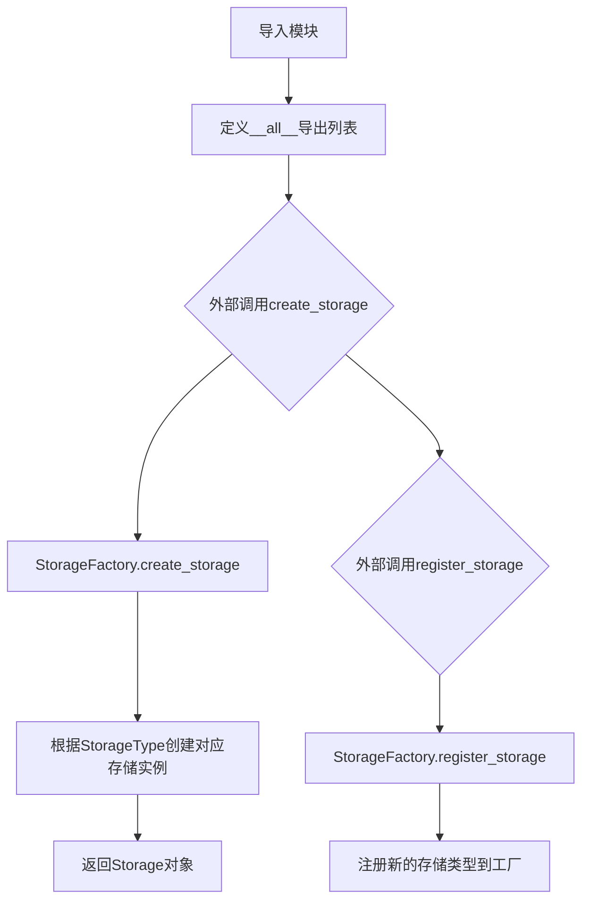
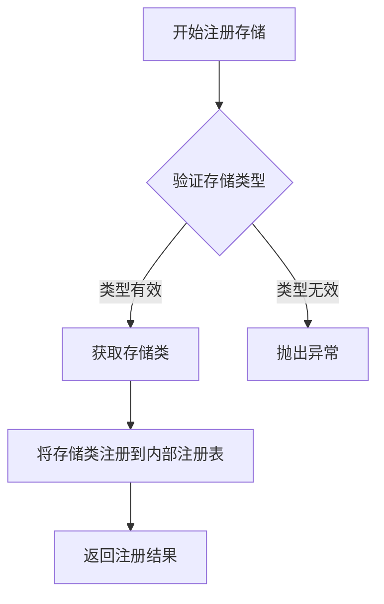

# `graphrag\packages\graphrag-storage\graphrag_storage\__init__.py` 详细设计文档

GraphRAG Storage是一个统一的存储抽象层包，通过工厂模式提供多种存储类型的创建和注册机制，并导出核心的存储接口（Storage）、配置类（StorageConfig）、存储类型枚举（StorageType）和表提供器（TableProvider），为上层应用提供一致的存储操作API。

## 整体流程



## 类结构

```
graphrag_storage (包)
├── storage (模块 - 存储基类)
│   └── Storage (抽象基类)
├── storage_config (模块 - 配置类)
│   └── StorageConfig (配置类)
├── storage_type (模块 - 存储类型枚举)
│   └── StorageType (枚举类)
├── storage_factory (模块 - 工厂)
│   ├── create_storage (全局函数)
│   └── register_storage (全局函数)
└── tables (模块 - 表提供器)
    └── TableProvider (抽象基类)
```

## 全局变量及字段


### `Storage`
    
存储抽象基类，提供了统一的存储操作接口

类型：`class`
    


### `StorageConfig`
    
存储配置类，用于配置存储的各种参数和选项

类型：`class`
    


### `StorageType`
    
存储类型枚举，定义了支持的存储后端类型

类型：`enum/type`
    


### `TableProvider`
    
表提供者抽象类，用于管理数据表的创建和操作

类型：`class`
    


### `create_storage`
    
工厂函数，根据配置创建相应类型的存储实例

类型：`function`
    


### `register_storage`
    
注册函数，用于向系统注册新的存储类型或存储实现

类型：`function`
    


    

## 全局函数及方法


您好！感谢您的任务提供。

我仔细分析了您提供的代码，发现这段代码是 `graphrag_storage` 包的 `__init__.py` 文件。该文件主要用于包的导出声明，导入了 `create_storage` 函数，但**并未包含 `create_storage` 函数的具体实现代码**。

为了能够完整地提取 `create_storage` 的详细信息（参数、返回值、流程图、源码等），我需要您提供 `graphrag_storage/storage_factory.py` 文件的内容。

**目前可获取的信息极为有限：**

1.  **函数名**: `create_storage`
2.  **来源模块**: `graphrag_storage.storage_factory`
3.  **上下文**: 这是一个用于创建存储实例的工厂函数，通常会根据配置创建不同的存储类型（如 `StorageType` 所定义的）。

如果您能提供 `storage_factory.py` 的源代码，我就能为您生成完整的详细设计文档，包括：
*   完整的参数列表和类型
*   返回值类型和描述
*   详细的 Mermaid 流程图
*   带注释的源代码分析

---

**在您提供代码之前，我可以基于常见架构模式提供以下初步推测（仅供参考，必须以实际代码为准）：**

根据导入语句和命名规范推测，`create_storage` 可能具有以下特征：

*   **名称**: `create_storage`
*   **参数**: 很可能包含一个配置对象（如 `StorageConfig` 类型的参数），用于指定存储的类型、连接字符串、路径等。
*   **返回值**: 返回一个 `Storage` 接口的实例或 `TableProvider`。
*   **功能**: 这是一个工厂方法，根据传入的配置参数，创建并返回一个具体的存储实现（如内存存储、文件存储、数据库存储等）。

**请您补充 `graphrag_storage/storage_factory.py` 的源代码，以便我进行准确的提取和分析。**


### `register_storage`

注册存储实例到存储工厂的函数，用于将特定的存储实现注册到系统中，以便通过 `create_storage` 工厂函数进行创建和访问。

参数：

- 由于提供的代码片段仅包含导入语句，未显示 `register_storage` 函数的完整签名。根据函数命名惯例和上下文推测：
  - `storage_type`：`StorageType`，存储类型标识符
  - `storage_class`：存储类实现
- 具体参数需查看 `graphrag_storage/storage_factory.py` 源码确认

返回值：`bool` 或 `None`，返回注册是否成功或创建的对象

#### 流程图



#### 带注释源码

```python
# 该源码基于导入推断，实际定义需查看 graphrag_storage/storage_factory.py

def register_storage(storage_type: StorageType, storage_class: type[Storage]):
    """注册存储实现到工厂
    
    Args:
        storage_type: 存储类型枚举值
        storage_class: 存储实现类
    
    Returns:
        注册是否成功
    """
    # 1. 验证存储类型有效性
    # 2. 将存储类添加到内部注册表
    # 3. 返回注册结果
    pass
```

---

**注意**：提供的代码片段仅包含模块导入和导出语句，未包含 `register_storage` 函数的具体实现。上述信息基于函数命名惯例和 GraphRAG 存储架构的上下文进行合理推断。如需完整的函数签名和实现细节，请提供 `graphrag_storage/storage_factory.py` 文件的实际源码。

## 关键组件


### Storage

主存储抽象类，提供统一的存储接口，用于数据的持久化和检索操作。

### StorageConfig

存储配置类，用于定义和配置存储后端的相关参数，如连接信息、路径、缓存策略等。

### StorageType

存储类型枚举，定义了支持的存储后端类型（如内存存储、文件系统存储、数据库存储等），用于工厂函数创建对应的存储实例。

### TableProvider

表提供者接口，提供了对表格数据的访问和管理能力，包括表的创建、查询、更新等操作的抽象接口。

### create_storage

创建存储实例的工厂函数，根据指定的存储类型和配置参数创建相应的存储对象，是构建存储层的主要入口。

### register_storage

注册存储函数，用于将自定义的存储实现注册到存储工厂系统中，以支持扩展新的存储后端类型。


## 问题及建议


### 已知问题

-   **缺少版本信息**：未定义`__version__`变量，无法快速获取包版本，给版本管理和依赖追踪带来不便
-   **缺少模块级文档**：没有模块级docstring，开发者无法快速了解Storage包的整体用途和使用方式
-   **导入错误无容错能力**：直接导入所有子模块，若任意模块导入失败将导致整个包不可用，缺乏渐进式降级能力
-   **导出粒度不统一**：`Storage`、`StorageConfig`等直接导出，而`create_storage`、`register_storage`从`storage_factory`中转导出，导出方式不一致
-   **无类型提示**：缺少类型注解或TYPE_CHECKING块，不利于静态分析和IDE智能提示
-   **缺乏初始化验证**：未在包初始化时验证依赖完整性或配置有效性，可能导致运行时错误

### 优化建议

-   添加`__version__ = "x.x.x"`和`__author__`等版本信息常量，便于依赖管理和版本追踪
-   在文件顶部添加模块级docstring，说明GraphRAG Storage包的核心职责、适用场景和基本用法
-   使用try-except包装导入语句，提供部分可用功能，或至少抛出更清晰的错误信息
-   统一导出方式，建议所有公共API均通过`__all__`显式声明，避免隐式导出
-   在TYPE_CHECKING块中添加类型注解，提升开发体验和代码可维护性
-   考虑在包初始化时添加自检逻辑，验证核心依赖是否可用，并提供友好的错误提示


## 其它


### 设计目标与约束

本存储包的设计目标是为GraphRAG框架提供统一的存储抽象层，支持多种存储后端（内存、文件系统、数据库等）的灵活切换和扩展。约束包括：必须实现Storage接口规范，配置通过StorageConfig统一管理，支持插件式存储类型注册机制。

### 错误处理与异常设计

存储操作应抛出自定义异常，如StorageException（存储操作基础异常）、StorageNotFoundException（资源不存在）、StorageConnectionException（连接失败）等。异常应包含错误码和详细错误信息，便于问题定位。

### 数据流与状态机

数据流遵循：配置初始化 → 存储实例创建 → 注册到存储管理器 → 数据读写操作。状态转换：UNINITIALIZED → INITIALIZING → READY → ERROR，各状态间转换需记录日志。

### 外部依赖与接口契约

依赖项包括：storage模块（Storage基类）、storage_config模块（配置类）、storage_factory模块（工厂类）、storage_type模块（枚举类）、tables模块（表提供者）。外部契约：Storage类需实现put、get、delete、list等基础方法；TableProvider提供表结构定义能力。

### 使用示例

```python
from graphrag_storage import create_storage, StorageConfig, StorageType

# 方式一：使用工厂创建存储实例
config = StorageConfig(storage_type=StorageType.MEMORY)
storage = create_storage(config)

# 方式二：注册自定义存储类型
from graphrag_storage import register_storage, StorageType
register_storage(StorageType.CUSTOM, CustomStorageClass)
```

### 版本信息

当前版本：基于MIT License的开源项目，版本号需查看pyproject.toml或版本控制记录。

### 配置说明

StorageConfig支持参数：storage_type（存储类型枚举）、connection_string（连接字符串）、options（额外选项字典）。不同存储类型需要不同的配置参数，具体请参考各存储实现类的文档。

    