# `graphrag\packages\graphrag-storage\graphrag_storage\azure_blob_storage.py` 详细设计文档

Azure Blob Storage implementation of Storage interface, providing a cloud-based storage solution for blob data with support for container management, CRUD operations, file pattern matching, and child storage instances using Azure SDK.

## 整体流程

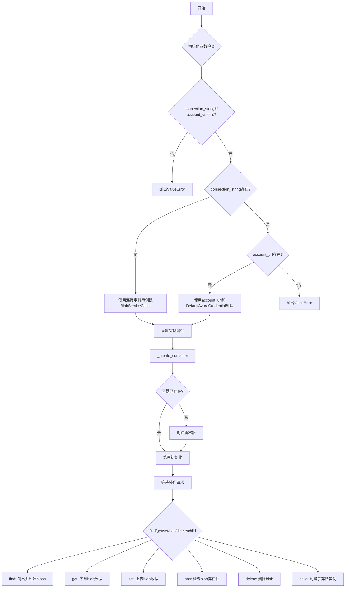

## 类结构

```
Storage (抽象基类)
└── AzureBlobStorage (Azure Blob存储实现)
```

## 全局变量及字段


### `logger`
    
用于记录Azure Blob存储操作日志的模块级logger实例

类型：`logging.Logger`
    


### `AzureBlobStorage._connection_string`
    
Azure存储账户的连接字符串，用于通过连接字符串方式认证

类型：`str | None`
    


### `AzureBlobStorage._container_name`
    
Azure Blob存储的容器名称，用于标识存储空间

类型：`str`
    


### `AzureBlobStorage._base_dir`
    
容器内的基础目录路径，用于模拟目录层级结构

类型：`str | None`
    


### `AzureBlobStorage._encoding`
    
文本数据的默认字符编码格式，默认为utf-8

类型：`str`
    


### `AzureBlobStorage._account_url`
    
Azure存储账户的服务端点URL，用于通过OAuth认证

类型：`str | None`
    


### `AzureBlobStorage._blob_service_client`
    
Azure Blob服务客户端实例，负责与Azure存储服务进行通信

类型：`BlobServiceClient`
    


### `AzureBlobStorage._storage_account_name`
    
Azure存储账户的名称，从account_url中提取用于标识

类型：`str | None`
    
    

## 全局函数及方法


### `_validate_blob_container_name`

验证提供的 Blob 容器名称是否符合 Azure 规则（名称长度 3-63 字符、以字母或数字开头、全小写、仅包含字母/数字/连字符、不允许连续连字符、不能以连字符结尾）。

参数：

- `container_name`：`str`，要验证的 blob 容器名称

返回值：`None`，验证失败时抛出 `ValueError` 异常

#### 流程图

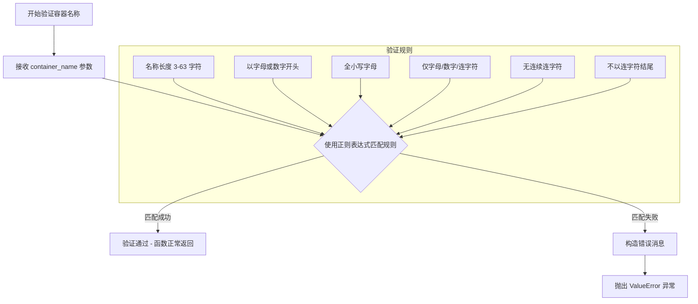

#### 带注释源码

```python
def _validate_blob_container_name(container_name: str) -> None:
    """
    Check if the provided blob container name is valid based on Azure rules.

        - A blob container name must be between 3 and 63 characters in length.
        - Start with a letter or number
        - All letters used in blob container names must be lowercase.
        - Contain only letters, numbers, or the hyphen.
        - Consecutive hyphens are not permitted.
        - Cannot end with a hyphen.

    Args:
    -----
    container_name (str)
        The blob container name to be validated.

    Returns
    -------
        bool: True if valid, False otherwise.
    """
    # 正则表达式验证规则：
    # ^(?:\0-9a-z|(?<!^)-(?!$)){3,63}$
    # - [0-9a-z]: 匹配单个字母或数字
    # - (?!^)-(?!$): 负向预查，确保连字符不在开头或结尾
    # - {3,63}: 名称长度限制
    # - (?:...): 非捕获组
    if not re.match(r"^(?:[0-9a-z]|(?<!^)-(?!$)){3,63}$", container_name):
        # 验证失败，构造详细的错误消息
        msg = f"Container name must be between 3 and 63 characters long and contain only lowercase letters, numbers, or hyphens. Name provided was {container_name}."
        # 抛出 ValueError 异常通知调用者验证失败
        raise ValueError(msg)
```


### AzureBlobStorage.__init__

该方法是 `AzureBlobStorage` 类的构造函数，负责初始化 Azure Blob Storage 存储客户端。它接受容器名称、账户 URL、连接字符串、基础目录和编码格式等参数，验证参数有效性，根据提供的认证信息创建 `BlobServiceClient`，并确保指定的容器已创建。

参数：

- `self`：隐式参数，类的实例本身
- `container_name`：`str`，Azure Blob Storage 的容器名称
- `account_url`：`str | None`，Azure 存储账户的 URL 地址，默认值为 None
- `connection_string`：`str | None`，Azure 连接字符串，默认值为 None
- `base_dir`：`str | None`，用于存储文件的基础目录路径，默认值为 None
- `encoding`：`str`，文件编码格式，默认值为 "utf-8"
- `**kwargs`：`Any`，接收任意额外关键字参数

返回值：`None`，构造函数无返回值

#### 流程图

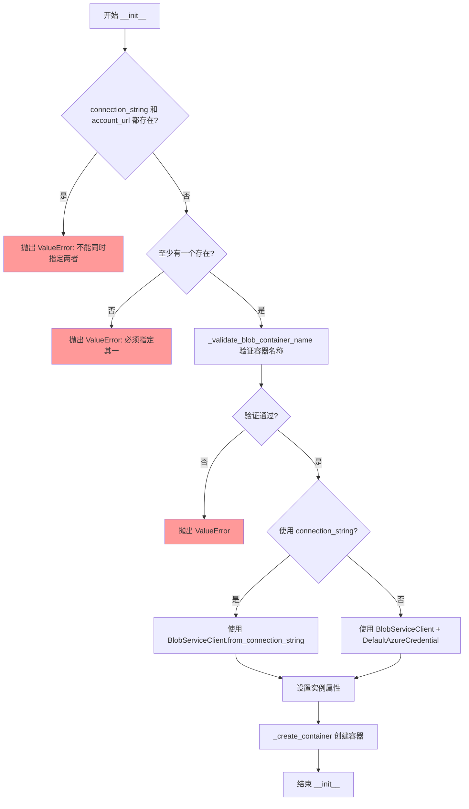

#### 带注释源码

```python
def __init__(
    self,
    container_name: str,
    account_url: str | None = None,
    connection_string: str | None = None,
    base_dir: str | None = None,
    encoding: str = "utf-8",
    **kwargs: Any,
) -> None:
    """Create a new BlobStorage instance."""
    # 检查是否同时提供了 connection_string 和 account_url，这是不允许的
    if connection_string is not None and account_url is not None:
        msg = "AzureBlobStorage requires only one of connection_string or account_url to be specified, not both."
        logger.error(msg)
        raise ValueError(msg)

    # 验证容器名称是否符合 Azure Blob Storage 的命名规则
    # 规则：3-63字符、小写字母/数字/连字符、不能连续连字符、不能以连字符结尾
    _validate_blob_container_name(container_name)

    # 记录创建 Blob 存储的日志信息
    logger.info(
        "Creating blob storage at [%s] and base_dir [%s]",
        container_name,
        base_dir,
    )
    
    # 根据提供的认证方式创建 BlobServiceClient
    if connection_string:
        # 使用连接字符串创建客户端（适用于传统认证方式）
        self._blob_service_client = BlobServiceClient.from_connection_string(
            connection_string
        )
    elif account_url:
        # 使用账户 URL 和 DefaultAzureCredential 创建客户端（适用于 Azure AD 认证）
        self._blob_service_client = BlobServiceClient(
            account_url=account_url,
            credential=DefaultAzureCredential(),
        )
    else:
        # 既没有 connection_string 也没有 account_url，抛出错误
        msg = "AzureBlobStorage requires either a connection_string or account_url to be specified."
        logger.error(msg)
        raise ValueError(msg)

    # 初始化实例属性
    self._encoding = encoding  # 文件编码格式
    self._container_name = container_name  # 容器名称
    self._connection_string = connection_string  # 连接字符串（可能为 None）
    self._base_dir = base_dir  # 基础目录路径
    self._account_url = account_url  # 账户 URL（可能为 None）
    
    # 从 account_url 中提取存储账户名称
    # 例如：https://mystorageaccount.blob.core.windows.net -> mystorageaccount
    self._storage_account_name = (
        account_url.split("//")[1].split(".")[0] if account_url else None
    )
    
    # 调用内部方法创建容器（如果容器不存在）
    self._create_container()
```


### `AzureBlobStorage._create_container`

该方法用于在 Azure Blob Storage 中创建指定的容器（如果该容器尚未存在）。它通过检查容器是否已存在，避免重复创建，并在需要时调用 Azure SDK 创建新容器。

参数：

- 无显式参数（`self` 为实例隐式参数）

返回值：`None`，无返回值描述（该方法仅执行操作，不返回数据）

#### 流程图

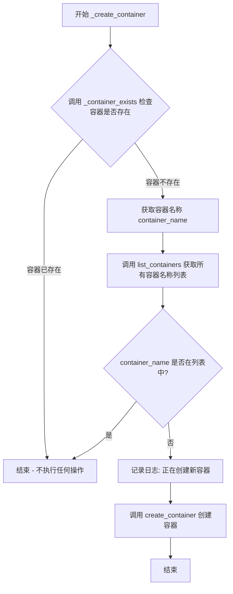

#### 带注释源码

```python
def _create_container(self) -> None:
    """Create the container if it does not exist."""
    # Step 1: 检查容器是否已存在
    if not self._container_exists():
        # 如果容器不存在，获取目标容器名称
        container_name = self._container_name
        
        # Step 2: 列出所有已存在的容器名称
        container_names = [
            container.name
            for container in self._blob_service_client.list_containers()
        ]
        
        # Step 3: 再次确认目标容器不在列表中（双重检查）
        if container_name not in container_names:
            # 记录调试日志
            logger.debug("Creating new container [%s]", container_name)
            # Step 4: 调用 Azure SDK 创建容器
            self._blob_service_client.create_container(container_name)
```


### `AzureBlobStorage._delete_container`

该方法用于删除 Azure Blob Storage 容器。如果容器存在，则调用 Azure Blob Service Client 删除该容器；如果容器不存在，则不执行任何操作。

参数：

- 该方法无参数（仅包含 `self` 参数）

返回值：`None`，无返回值

#### 流程图

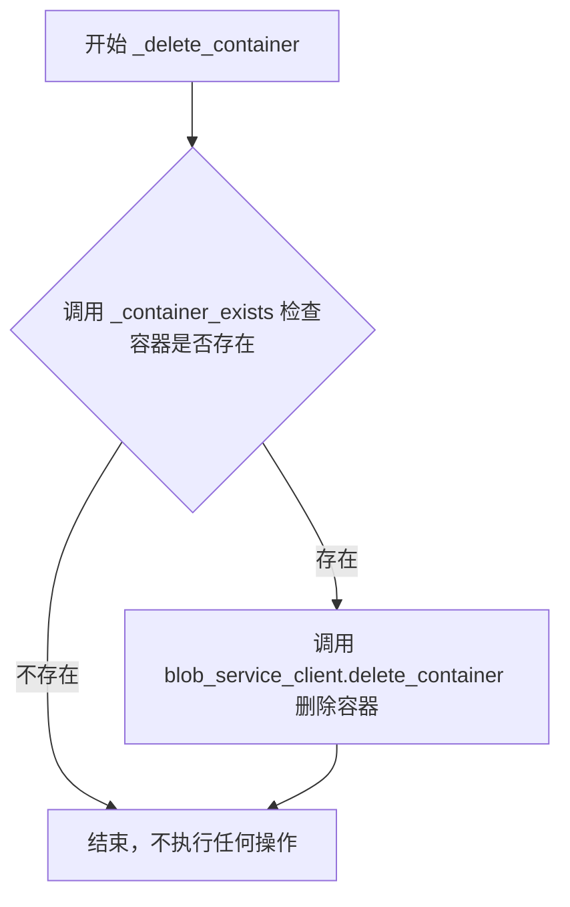

#### 带注释源码

```python
def _delete_container(self) -> None:
    """Delete the container."""
    # 检查容器是否存在
    if self._container_exists():
        # 如果容器存在，则调用 Azure Blob Service Client 的 delete_container 方法删除容器
        self._blob_service_client.delete_container(self._container_name)
```


### `AzureBlobStorage._container_exists`

检查 Azure Blob 存储容器是否已存在。该方法通过列出 Blob 服务中的所有容器，并验证当前容器名称是否在容器列表中来实现。

参数：无需额外参数（仅使用实例属性 `self`）

返回值：`bool`，返回 `True` 表示容器存在，返回 `False` 表示容器不存在

#### 流程图

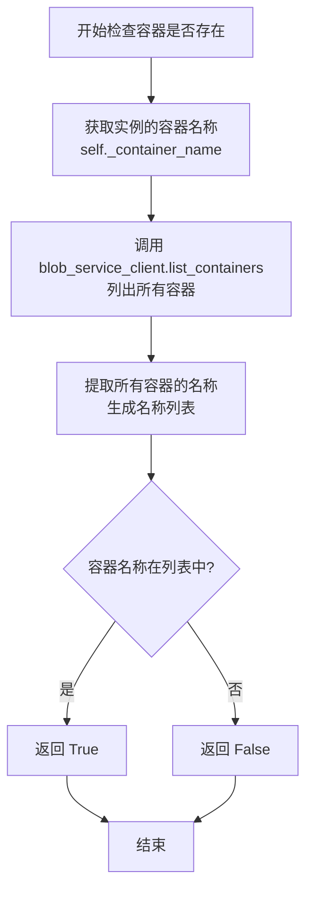

#### 带注释源码

```python
def _container_exists(self) -> bool:
    """Check if the container exists."""
    # 获取当前实例的容器名称
    container_name = self._container_name
    
    # 调用 Azure Blob Service Client 列出所有已存在的容器
    # 并从中提取每个容器的名称组成列表
    container_names = [
        container.name for container in self._blob_service_client.list_containers()
    ]
    
    # 检查目标容器名称是否存在于已获取的容器名称列表中
    # 返回布尔值：True 表示容器存在，False 表示容器不存在
    return container_name in container_names
```


### `AzureBlobStorage.find`

在 Azure Blob Storage 容器中根据给定的正则表达式模式查找匹配的 blob 名称，并返回包含匹配结果的迭代器。

参数：

- `file_pattern`：`re.Pattern[str]` - 用于匹配 blob 名称的正则表达式模式

返回值：`Iterator[str]` - 返回一个迭代器，逐个产出与文件模式匹配的 blob 名称（经过基础目录处理后）

#### 流程图

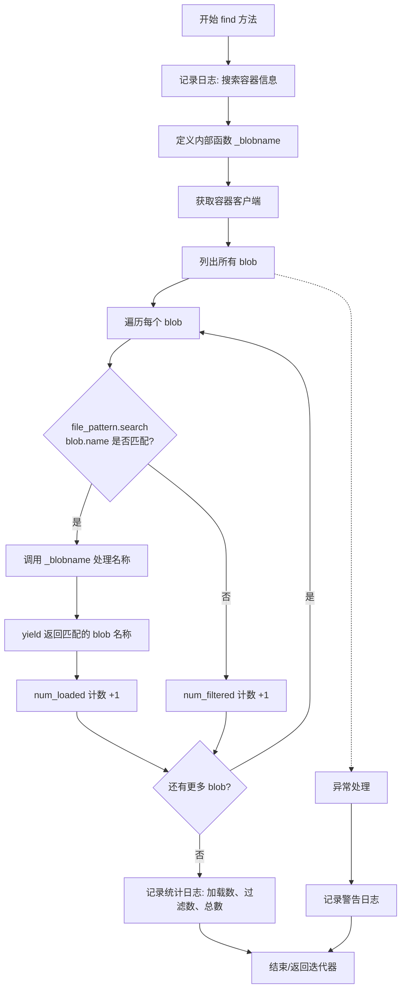

#### 带注释源码

```python
def find(
    self,
    file_pattern: re.Pattern[str],
) -> Iterator[str]:
    """Find blobs in a container using a file pattern.

    Params:
        file_pattern: The file pattern to use.

    Returns
    -------
            An iterator of blob names and their corresponding regex matches.
    """
    # 记录搜索日志，包含容器名、基础目录和正则模式
    logger.info(
        "Search container [%s] in base_dir [%s] for files matching [%s]",
        self._container_name,
        self._base_dir,
        file_pattern.pattern,
    )

    def _blobname(blob_name: str) -> str:
        """内部函数：处理 blob 名称，移除基础目录前缀和前导斜杠."""
        # 如果存在基础目录且 blob 名称以其开头，则移除基础目录
        if self._base_dir and blob_name.startswith(self._base_dir):
            blob_name = blob_name.replace(self._base_dir, "", 1)
        # 移除前导斜杠
        if blob_name.startswith("/"):
            blob_name = blob_name[1:]
        return blob_name

    try:
        # 获取容器客户端
        container_client = self._blob_service_client.get_container_client(
            self._container_name
        )
        # 列出指定基础目录下的所有 blob（转换为列表以获取总数）
        all_blobs = list(container_client.list_blobs(self._base_dir))
        # 调试日志：打印所有 blob 名称
        logger.debug("All blobs: %s", [blob.name for blob in all_blobs])
        
        # 初始化计数器
        num_loaded = 0
        num_total = len(list(all_blobs))  # 注意：这里会重新遍历，注意性能
        num_filtered = 0
        
        # 遍历所有 blob，查找匹配的文件模式
        for blob in all_blobs:
            match = file_pattern.search(blob.name)
            if match:
                # 产出处理后的 blob 名称
                yield _blobname(blob.name)
                num_loaded += 1
            else:
                num_filtered += 1
        
        # 记录统计信息
        logger.debug(
            "Blobs loaded: %d, filtered: %d, total: %d",
            num_loaded,
            num_filtered,
            num_total,
        )
    except Exception:  # noqa: BLE001
        # 异常处理：记录警告日志
        logger.warning(
            "Error finding blobs: base_dir=%s, file_pattern=%s",
            self._base_dir,
            file_pattern,
        )
```


### `AzureBlobStorage.get`

从 Azure Blob Storage 中获取指定键对应的数据内容。

参数：

- `key`：`str`，要获取的blob键名
- `as_bytes`：`bool | None = False`，是否以字节形式返回数据，默认为False（返回字符串）
- `encoding`：`str | None = None`，当不返回字节时的字符编码，默认为实例的编码设置

返回值：`Any`，返回blob的内容，可能是字符串（默认）或字节数据；如果发生错误返回None

#### 流程图

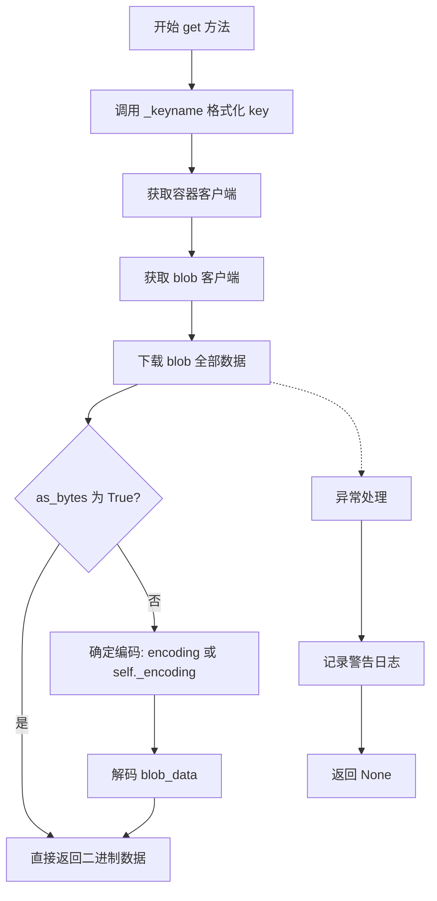

#### 带注释源码

```python
async def get(
    self, key: str, as_bytes: bool | None = False, encoding: str | None = None
) -> Any:
    """Get a value from the blob."""
    try:
        # 格式化键名，添加基础目录前缀
        key = self._keyname(key)
        
        # 获取容器客户端
        container_client = self._blob_service_client.get_container_client(
            self._container_name
        )
        
        # 获取特定的 blob 客户端
        blob_client = container_client.get_blob_client(key)
        
        # 下载 blob 的全部内容
        blob_data = blob_client.download_blob().readall()
        
        # 判断是否需要返回字节数据
        if not as_bytes:
            # 使用提供的编码或默认编码进行解码
            coding = encoding or self._encoding
            blob_data = blob_data.decode(coding)
    except Exception:  # noqa: BLE001
        # 捕获异常并记录警告日志，返回 None
        logger.warning("Error getting key %s", key)
        return None
    else:
        # 正常返回数据
        return blob_data
```


### `AzureBlobStorage.set`

该方法用于将值存储到 Azure Blob Storage 容器中的指定键（key）对应的 blob，支持存储字节数据或字符串数据，并自动处理编码转换。

参数：

- `key`：`str`，要设置的 blob 键名（路径）
- `value`：`Any`，要存储的值，可以是字节数据或字符串
- `encoding`：`str | None`，可选参数，指定字符串编码格式，默认为 None（使用实例的默认编码）

返回值：`None`，该方法无返回值，通过异常处理机制记录错误

#### 流程图

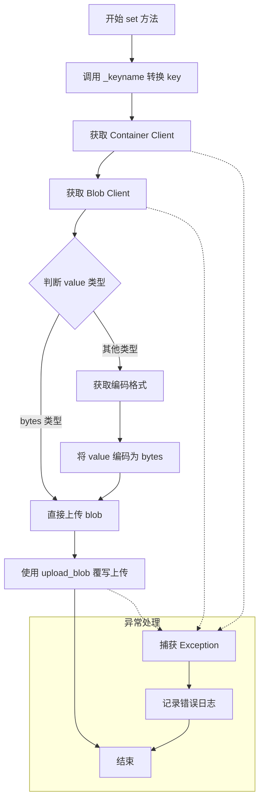

#### 带注释源码

```python
async def set(self, key: str, value: Any, encoding: str | None = None) -> None:
    """Set a value in the blob."""
    try:
        # 使用内部方法 _keyname 处理 key 名称，添加基础目录前缀
        key = self._keyname(key)
        
        # 获取容器客户端，用于操作容器中的 blob
        container_client = self._blob_service_client.get_container_client(
            self._container_name
        )
        
        # 获取特定的 blob 客户端，用于上传数据
        blob_client = container_client.get_blob_client(key)
        
        # 判断 value 是否为字节类型
        if isinstance(value, bytes):
            # 如果是字节数据，直接上传
            blob_client.upload_blob(value, overwrite=True)
        else:
            # 如果是字符串类型，需要先编码为字节
            # 使用传入的 encoding 或实例的默认编码
            coding = encoding or self._encoding
            blob_client.upload_blob(value.encode(coding), overwrite=True)
            
    except Exception:
        # 捕获所有异常，记录错误日志但不影响主流程
        logger.exception("Error setting key %s: %s", key)
```


### `AzureBlobStorage.has`

检查指定的键是否存在于 Blob 存储中。该方法通过获取 blob 客户端并调用其 `exists()` 方法来判断 Blob 对象是否已存在于容器中。

参数：

- `key`：`str`，要检查是否存在的键名（文件路径）

返回值：`bool`，如果指定的键在 Blob 存储中存在则返回 `True`，否则返回 `False`

#### 流程图

```mermaid
flowchart TD
    A[开始] --> B[调用 _keyname 方法处理 key]
    B --> C[获取容器客户端]
    C --> D[获取 Blob 客户端]
    D --> E{调用 blob_client.exists()}
    E -->|True| F[返回 True]
    E -->|False| G[返回 False]
    F --> H[结束]
    G --> H
```

#### 带注释源码

```python
async def has(self, key: str) -> bool:
    """Check if a key exists in the blob."""
    # 使用 _keyname 方法处理键名，如果设置了 base_dir 则拼接完整路径
    key = self._keyname(key)
    
    # 获取容器客户端，用于操作容器内的 Blob
    container_client = self._blob_service_client.get_container_client(
        self._container_name
    )
    
    # 获取特定的 Blob 客户端，用于检查该 Blob 的存在性
    blob_client = container_client.get_blob_client(key)
    
    # 调用 Azure Blob SDK 的 exists() 方法检查 Blob 是否存在
    # 返回 True 表示 Blob 存在，返回 False 表示不存在
    return blob_client.exists()
```


### `AzureBlobStorage.delete`

删除 Azure Blob 存储中指定键对应的 blob 对象。

参数：

- `key`：`str`，要删除的 blob 的键名（key）

返回值：`None`，该方法执行删除操作，不返回任何值

#### 流程图

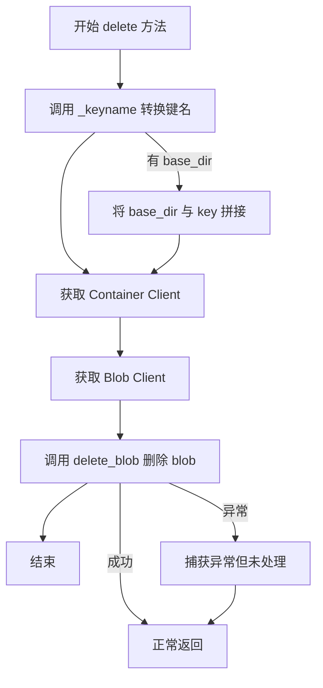

#### 带注释源码

```python
async def delete(self, key: str) -> None:
    """Delete a key from the blob.
    
    删除存储中指定键对应的 blob。
    
    Args:
        key: 要删除的 blob 的键名
    """
    # 调用内部方法 _keyname 对 key 进行处理
    # 如果设置了 base_dir，则将 base_dir 与 key 进行路径拼接
    key = self._keyname(key)
    
    # 通过 BlobServiceClient 获取容器客户端
    # 用于后续操作该容器内的 blob
    container_client = self._blob_service_client.get_container_client(
        self._container_name
    )
    
    # 获取指定键对应的 blob 客户端
    blob_client = container_client.get_blob_client(key)
    
    # 调用 Azure Blob Storage SDK 的 delete_blob 方法
    # 执行实际的删除操作
    # 默认情况下，删除是永久性的（软删除功能未启用时）
    blob_client.delete_blob()
```


### `AzureBlobStorage.clear`

清除 Azure Blob 存储容器中的所有 Blob 数据。该方法为异步方法，当前实现为空（pass），未完成实际功能。

参数：
- 无参数（仅包含 `self` 参数）

返回值：`None`，表示该方法不返回任何值

#### 流程图

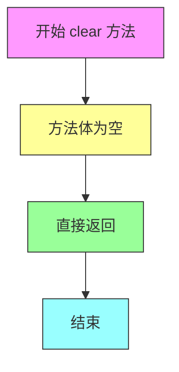

#### 带注释源码

```python
async def clear(self) -> None:
    """Clear the cache."""
    # 该方法目前为空实现，未完成实际功能
    # TODO: 需要实现清除容器中所有 Blob 的逻辑
    # 可能的实现思路：
    # 1. 获取容器客户端
    # 2. 列出所有 Blob
    # 3. 逐个删除或批量删除
    # 注意：需要考虑大容器场景下的性能和错误处理
    pass
```


### `AzureBlobStorage.child`

创建一个子存储实例，用于在 Azure Blob Storage 中支持目录层级的虚拟分区。如果传入的 name 为 None，则返回当前存储实例本身；否则，基于当前实例的配置创建一个新的子存储实例，base_dir 会根据传入的 name 进行扩展。

参数：

- `name`：`str | None`，子存储的名称或路径，用于构建新的 base_dir

返回值：`Storage`，返回一个新的 AzureBlobStorage 实例或当前实例本身

#### 流程图

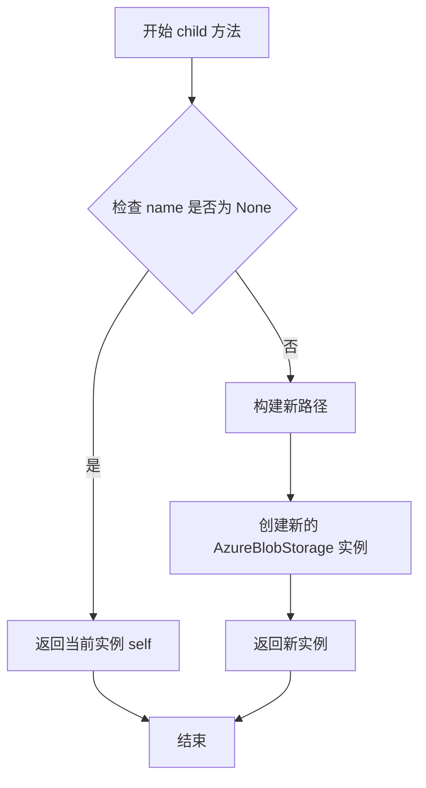

#### 带注释源码

```python
def child(self, name: str | None) -> "Storage":
    """Create a child storage instance."""
    # 如果 name 为 None，直接返回当前实例本身
    if name is None:
        return self
    
    # 根据当前 base_dir 和 name 构建新的路径
    # 如果存在 base_dir，则将 name 作为子目录拼接
    # 否则直接将 name 作为新的 base_dir
    path = str(Path(self._base_dir) / name) if self._base_dir else name
    
    # 使用当前实例的配置创建新的子存储实例
    # 保持连接字符串、容器名称、编码和账户 URL 不变
    # 仅修改 base_dir 为新构建的路径
    return AzureBlobStorage(
        connection_string=self._connection_string,
        container_name=self._container_name,
        encoding=self._encoding,
        base_dir=path,
        account_url=self._account_url,
    )
```


### `AzureBlobStorage.keys`

获取存储中的所有键列表。

参数：

- 无参数（仅包含 `self`）

返回值：`list[str]`，返回存储中的键列表（当前实现中会抛出 `NotImplementedError`）

#### 流程图

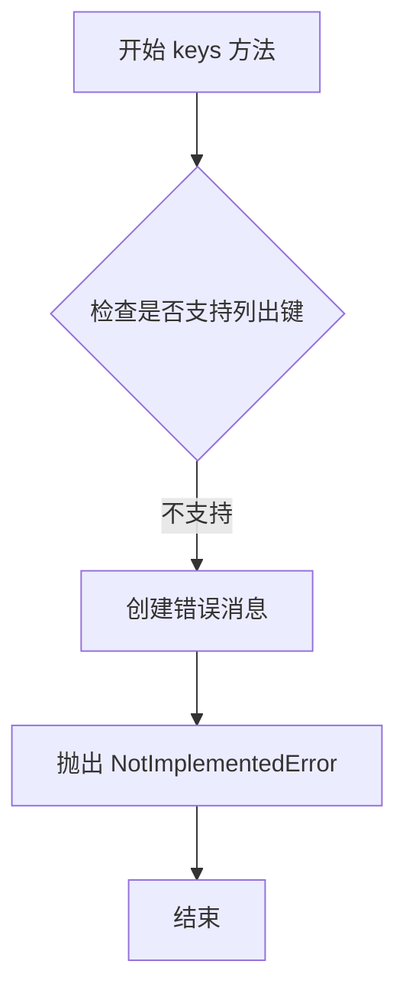

#### 带注释源码

```python
def keys(self) -> list[str]:
    """Return the keys in the storage."""
    # Azure Blob Storage 目前不支持列出容器中的所有键
    # 因此抛出 NotImplementedError 异常
    msg = "Blob storage does yet not support listing keys."
    raise NotImplementedError(msg)
```


### `AzureBlobStorage._keyname`

获取带路径前缀的键名，用于在 Azure Blob Storage 中构建完整的 Blob 键路径。

参数：

- `key`：`str`，需要处理的原始键名

返回值：`str`，处理后的键名（如果设置了 base_dir，则包含 base_dir 前缀）

#### 流程图

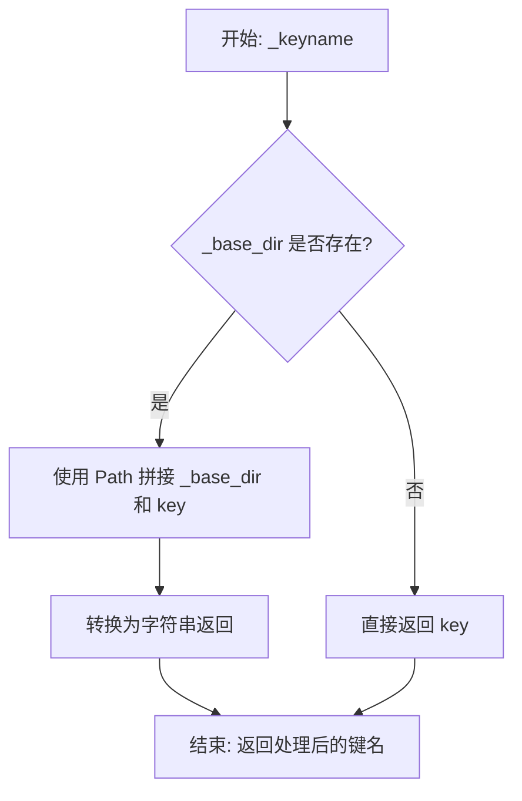

#### 带注释源码

```python
def _keyname(self, key: str) -> str:
    """Get the key name.
    
    如果配置了 base_dir，则将 base_dir 前缀添加到键名之前，
    以支持在容器中创建虚拟目录结构。
    
    Args:
        key: 需要处理的原始键名
        
    Returns:
        str: 处理后的键名，如果设置了 base_dir 则包含目录前缀
    """
    # 如果存在 base_dir，使用 Path 将 base_dir 和 key 拼接成路径
    # 否则直接返回原始 key
    return str(Path(self._base_dir) / key) if self._base_dir else key
```


### `AzureBlobStorage.get_creation_date`

获取指定Blob的创建时间，并将时间格式化为带本地时区的字符串。如果获取失败，返回空字符串。

参数：

- `key`：`str`，要获取创建日期的Blob的键名（Key）

返回值：`str`，格式化后的创建日期字符串（格式：`YYYY-MM-DD HH:MM:SS`），如果发生错误则返回空字符串

#### 流程图

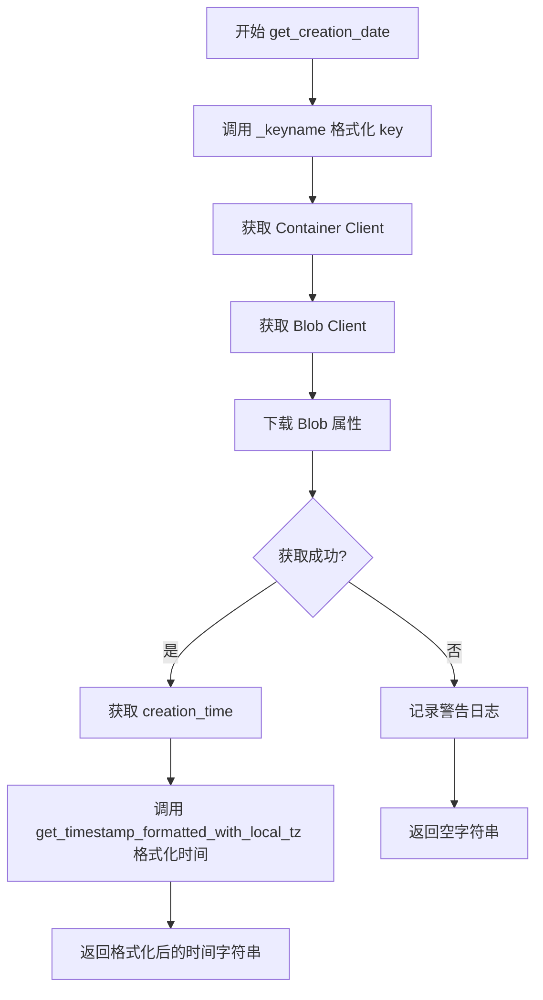

#### 带注释源码

```python
async def get_creation_date(self, key: str) -> str:
    """Get creation date for the blob."""
    try:
        # 使用 _keyname 方法格式化 key，添加 base_dir 前缀（如果存在）
        key = self._keyname(key)
        
        # 获取容器客户端
        container_client = self._blob_service_client.get_container_client(
            self._container_name
        )
        
        # 获取指定的 Blob 客户端
        blob_client = container_client.get_blob_client(key)
        
        # 下载 Blob 并获取其属性中的 creation_time 时间戳
        timestamp = blob_client.download_blob().properties.creation_time
        
        # 调用辅助函数将时间戳格式化为带本地时区的字符串并返回
        return get_timestamp_formatted_with_local_tz(timestamp)
    except Exception:  # noqa: BLE001
        # 捕获异常并记录警告日志，返回空字符串表示获取失败
        logger.warning("Error getting key %s", key)
        return ""
```

## 关键组件


### AzureBlobStorage主类

Azure Blob Storage的实现类，提供完整的云端存储接口，支持连接字符串和Azure Identity两种认证方式，实现文件的CRUD操作、容器管理和子存储创建功能。

### 认证与连接管理组件

支持两种认证方式：连接字符串认证和account_url配合DefaultAzureCredential认证。在__init__方法中根据传入参数初始化BlobServiceClient，并验证不能同时指定两者。

### 容器生命周期管理组件

包含_create_container、_delete_container和_container_exists方法，负责容器的创建、删除和存在性检查。容器创建时遍历已有容器列表，避免重复创建。

### 文件模式匹配与查找组件

find方法实现基于正则表达式的文件搜索功能，支持base_dir过滤，内部定义_blobname辅助函数处理路径前缀，返回匹配的文件名迭代器。

### 键名路径处理组件

_keyname方法处理存储键名，当配置了base_dir时，将键名与base_dir路径拼接，实现类似目录的层次存储结构。

### Blob元数据获取组件

get_creation_date方法获取Blob的创建时间戳，通过blob_client下载属性获取creation_time并格式化为带本地时区的时间字符串。

### 容器名称验证组件

_validate_blob_blob_container_name函数实现Azure容器命名规则验证，确保容器名长度为3-63字符，以字母或数字开头，仅包含小写字母数字和单破折号，且不连续、不以破折号结尾。

### 子存储实例创建组件

child方法创建子目录存储实例，继承父存储的认证信息和容器配置，仅修改base_dir路径，实现存储的层级组织。

### 异常处理与日志组件

所有操作使用try-except捕获异常，记录warning或error级别日志，返回None或空字符串，避免异常向上传播。get和set方法返回类型为Any，has方法返回布尔值。


## 问题及建议


### 已知问题

- **异常处理过于宽泛**：大量使用 `except Exception: # noqa: BLE001` 捕获所有异常，会隐藏真正的错误，导致问题难以排查和诊断。
- **性能问题**：`find` 方法中使用 `list(container_client.list_blobs(self._base_dir))` 一次性加载所有 blobs 到内存，对于大型容器会产生严重的性能问题和内存占用。
- **容器存在性检查低效**：`_container_exists` 和 `_create_container` 方法每次都调用 `list_containers()` 列出所有容器后再判断，效率低下，应使用 `get_container_client` 直接检查。
- **API 返回值不明确**：`get` 方法失败时返回 `None`，无法区分是"键不存在"还是"发生错误"，调用者难以正确处理业务逻辑。
- **未实现的方法**：`clear` 方法是空实现，`keys` 方法抛出 `NotImplementedError`，但类本身未标记为抽象类或提供明确文档说明。
- **资源重复创建**：`child` 方法每次都创建新的 `BlobServiceClient` 实例，未复用连接，且未实现连接池或连接复用机制。
- **数据一致性风险**：`delete` 方法直接删除 blob 未做存在性检查，在并发场景下可能抛出意外异常。
- **编码处理不一致**：部分地方使用 `coding` 变量，部分地方直接使用 `encoding`，代码风格不统一。

### 优化建议

- 将宽泛的异常捕获改为特定异常类型（如 `azure.core.exceptions.AzureError`），并为每种异常提供明确的处理策略。
- 使用生成器模式或分页方式遍历 blobs，避免一次性加载全部数据到内存。
- 使用容器客户端的 `exists()` 方法或捕获特定异常来判断容器是否存在，避免列出所有容器。
- 考虑返回自定义结果类型或使用 Optional 类型，明确区分"不存在"和"错误"状态。
- 实现 `clear` 方法或明确标记为不支持的操作，`keys` 方法可考虑返回空列表而非抛出异常。
- 在 `__init__` 中缓存 `BlobServiceClient`，`child` 方法复用同一客户端实例或实现连接池。
- 在删除前检查 blob 是否存在，或使用 `delete_blob(delete_snapshots="include")` 等参数确保删除成功。
- 统一编码相关的变量命名和处理逻辑，保持代码风格一致性。

## 其它


### 设计目标与约束

本模块的设计目标是提供一个符合Storage接口规范的Azure Blob Storage实现，支持基本的CRUD操作（创建、读取、更新、删除）、文件查找、子存储实例创建等功能。核心约束包括：仅支持connection_string或account_url二选一进行认证；容器名称必须符合Azure命名规范（3-63字符、小写字母数字和连字符）；base_dir用于模拟虚拟目录结构；所有操作均通过azure-storage-blob SDK实现。

### 错误处理与异常设计

本模块采用分层异常处理策略。对于可恢复错误（如文件不存在、网络波动），通过try-except捕获并返回None或空值，同时记录warning级别日志；对于配置错误（如同时指定connection_string和account_url、容器名不合规），抛出ValueError并记录error级别日志；对于未实现功能（如keys方法），抛出NotImplementedError。特别注意：find方法使用裸except捕获所有异常可能导致静默失败；get和set方法使用except Exception吞掉具体异常信息，不利于问题排查。

### 数据流与状态机

**初始化阶段**：传入container_name、account_url/connection_string、base_dir、encoding参数 → 验证参数合法性 → 创建BlobServiceClient → 创建容器（如不存在） → 就绪。**读写阶段**：get操作将key转换为完整路径（包含base_dir）→ 获取container_client → 获取blob_client → 下载数据 → 解码返回；set操作类似，先编码再上传。**查找阶段**：列出所有blob → 正则匹配 → yield符合条件的blob name。状态转换较为简单，无复杂状态机，主要状态包括：未初始化、已初始化、错误状态。

### 外部依赖与接口契约

本模块依赖以下外部包：azure-identity（提供DefaultAzureCredential进行身份验证）、azure-storage-blob（提供BlobServiceClient及相关操作）、pathlib.Path（路径处理）、re（正则匹配）、typing（类型注解）、logging（日志记录）。接口契约方面，本模块实现Storage抽象基类，需满足：get(key, as_bytes, encoding)返回Any、set(key, value, encoding)返回None、has(key)返回bool、delete(key)返回None、clear()返回None、keys()返回list[str]、child(name)返回Storage、find(pattern)返回Iterator[str]、get_creation_date(key)返回str。特别注意：keys()方法本模块未实现，调用会抛出NotImplementedError。

### 性能考虑

当前实现存在性能瓶颈：find方法中list(container_client.list_blobs(self._base_dir))会一次性加载所有blob到内存，对于大型容器可能导致内存溢出；每次get/set操作都重新创建container_client和blob_client，存在重复开销；list_containers()和_container_exists()检查时会列出所有容器，效率较低。优化建议：使用生成器替代list加载；缓存container_client；容器存在性检查使用head_container而非list所有容器。

### 安全考虑

本模块处理敏感数据（存储凭证、 blob内容）。安全考量包括：connection_string包含账户密钥，不应明文日志记录（当前代码仅在错误时记录完整信息）；DefaultAzureCredential默认使用环境变量、托管标识、Visual Studio等多种凭证源，需确保生产环境使用安全凭证机制；blob内容读取后直接解码，未进行额外安全校验；base_dir参数未做路径穿越校验，理论上可通过../../../进行目录遍历攻击（虽然Azure Blob本身不支持路径遍历，但逻辑层应防护）。

### 配置管理

本模块配置通过构造函数参数传入，支持以下配置项：container_name（必需，字符串）、account_url（可选，字符串，用于托管标识认证）、connection_string（可选，字符串，用于密钥认证）、base_dir（可选字符串，默认为None，用于模拟子目录）、encoding（可选字符串，默认utf-8，用于文本编码）。配置验证在__init__阶段完成，非法配置抛出ValueError。

### 并发与异步

本模块使用async def定义所有Storage接口方法，但内部实现大量使用同步调用（blob_client.download_blob().readall()、blob_client.upload_blob()等），这些同步操作会阻塞事件循环。Azure SDK提供异步版本（azure.storage.blob.aio），建议替换为异步客户端以真正实现非阻塞IO，提升并发性能。

    