# `graphrag\packages\graphrag-storage\graphrag_storage\azure_cosmos_storage.py` 详细设计文档

Azure CosmosDB存储实现类，继承自Storage基类，提供与Azure CosmosDB的交互功能，用于存储和检索数据（包括Parquet文件和JSON数据），支持实体数据的特殊处理和基于文件模式匹配的文档查找。

## 整体流程

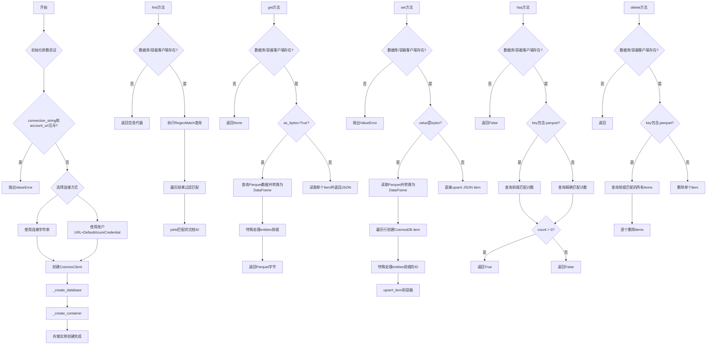

## 类结构

```
Storage (抽象基类)
└── AzureCosmosStorage (Azure CosmosDB存储实现)
```

## 全局变量及字段


### `_DEFAULT_PAGE_SIZE`
    
默认分页大小，用于 CosmosDB 查询的页面大小限制，默认值为 100

类型：`int`
    


### `logger`
    
模块级日志记录器，用于记录 AzureCosmosStorage 类的日志信息

类型：`logging.Logger`
    


### `AzureCosmosStorage._cosmos_client`
    
Azure CosmosDB 客户端实例，用于与 CosmosDB 服务进行通信

类型：`CosmosClient`
    


### `AzureCosmosStorage._database_client`
    
CosmosDB 数据库代理，用于管理数据库级别的操作

类型：`DatabaseProxy | None`
    


### `AzureCosmosStorage._container_client`
    
CosmosDB 容器代理，用于管理容器级别的操作

类型：`ContainerProxy | None`
    


### `AzureCosmosStorage._cosmosdb_account_url`
    
CosmosDB 账户 URL，用于通过 Azure 身份验证连接

类型：`str | None`
    


### `AzureCosmosStorage._connection_string`
    
连接字符串，用于通过连接字符串方式连接 CosmosDB

类型：`str | None`
    


### `AzureCosmosStorage._database_name`
    
数据库名称，指定要连接的 CosmosDB 数据库

类型：`str`
    


### `AzureCosmosStorage._container_name`
    
容器名称，指定要操作的 CosmosDB 容器

类型：`str`
    


### `AzureCosmosStorage._encoding`
    
字符编码，用于数据序列化和反序列化

类型：`str`
    


### `AzureCosmosStorage._no_id_prefixes`
    
无 ID 前缀集合，用于跟踪没有提供 ID 的数据前缀

类型：`set[str]`
    
    

## 全局函数及方法


### `_create_progress_status`

创建一个进度状态对象，用于记录find操作的进度信息。

参数：

- `num_loaded`：`int`，已加载（匹配）的文件数量
- `num_filtered`：`int`，被过滤掉的文件数量
- `num_total`：`int`，总文件数量

返回值：`Progress`，进度状态对象，包含总项目数、已完成项目数和描述信息

#### 流程图

```mermaid
flowchart TD
    A[开始] --> B[接收参数: num_loaded, num_filtered, num_total]
    B --> C[计算已完成项目数: completed_items = num_loaded + num_filtered]
    C --> D[生成描述字符串: "{num_loaded} files loaded ({num_filtered} filtered)"]
    D --> E[创建Progress对象]
    E --> F[返回Progress对象]
```

#### 带注释源码

```python
def _create_progress_status(
    num_loaded: int, num_filtered: int, num_total: int
) -> Progress:
    """创建进度状态对象，用于记录find操作的进度。

    参数:
        num_loaded: 已匹配并加载的文件数量
        num_filtered: 被正则表达式过滤掉的文件数量
        num_total: 查询到的总文件数量

    返回:
        Progress对象，包含进度相关信息
    """
    return Progress(
        total_items=num_total,  # 总项目数
        completed_items=num_loaded + num_filtered,  # 已完成项目数 = 已加载 + 已过滤
        description=f"{num_loaded} files loaded ({num_filtered} filtered)",  # 描述信息
    )
```


### `AzureCosmosStorage.__init__`

初始化 Azure CosmosDB 存储实例，验证连接参数，创建 CosmosDB 客户端，并初始化数据库和容器。

参数：

- `database_name`：`str`，CosmosDB 数据库名称，必填
- `container_name`：`str`，CosmosDB 容器名称，必填
- `connection_string`：`str | None`，连接字符串，与 account_url 二选一
- `account_url`：`str | None`，CosmosDB 账户 URL，与 connection_string 二选一
- `encoding`：`str`，编码格式，默认为 "utf-8"
- `**kwargs`：`Any`，其他可选参数

返回值：`None`，无返回值

#### 流程图

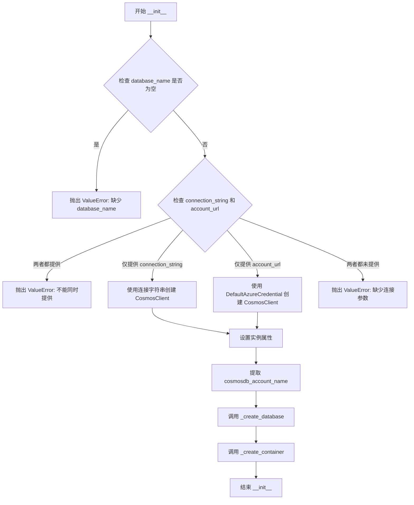

#### 带注释源码

```python
def __init__(
    self,
    database_name: str,
    container_name: str,
    connection_string: str | None = None,
    account_url: str | None = None,
    encoding: str = "utf-8",
    **kwargs: Any,
) -> None:
    """Create a CosmosDB storage instance."""
    logger.info("Creating cosmosdb storage")
    database_name = database_name  # 冗余赋值，实际未使用原值
    # 验证 database_name 不能为空
    if not database_name:
        msg = "CosmosDB Storage requires a base_dir to be specified. This is used as the database name."
        logger.error(msg)
        raise ValueError(msg)

    # 验证 connection_string 和 account_url 不能同时提供
    if connection_string is not None and account_url is not None:
        msg = "CosmosDB Storage requires either a connection_string or cosmosdb_account_url to be specified, not both."
        logger.error(msg)
        raise ValueError(msg)

    # 根据提供的凭据创建 CosmosClient
    if connection_string:
        # 使用连接字符串认证
        self._cosmos_client = CosmosClient.from_connection_string(connection_string)
    elif account_url:
        # 使用 Azure 身份验证（需要 Azure 资源 MSI 或环境变量配置）
        self._cosmos_client = CosmosClient(
            url=account_url,
            credential=DefaultAzureCredential(),
        )
    else:
        # 两者都未提供，抛出错误
        msg = "CosmosDB Storage requires either a connection_string or cosmosdb_account_url to be specified."
        logger.error(msg)
        raise ValueError(msg)

    # 初始化实例属性
    self._encoding = encoding
    self._database_name = database_name
    self._connection_string = connection_string
    self._cosmosdb_account_url = account_url
    self._container_name = container_name
    # 从 account_url 提取账户名称（格式：https://xxx.documents.azure.com:443）
    self._cosmosdb_account_name = (
        account_url.split("//")[1].split(".")[0] if account_url else None
    )
    # 初始化空集合，用于跟踪没有 id 列的 prefix
    self._no_id_prefixes = set()
    
    # 记录调试日志
    logger.debug(
        "Creating cosmosdb storage with account [%s] and database [%s] and container [%s]",
        self._cosmosdb_account_name,
        self._database_name,
        self._container_name,
    )
    
    # 创建数据库和容器
    self._create_database()
    self._create_container()
```


### `AzureCosmosStorage._create_database`

该方法用于在 Azure Cosmos DB 中创建数据库（如果数据库尚不存在），以支持后续的容器创建和数据存储操作。

参数：

- 该方法无参数（仅使用 `self` 实例属性）

返回值：`None`，无返回值，仅执行数据库创建操作

#### 流程图

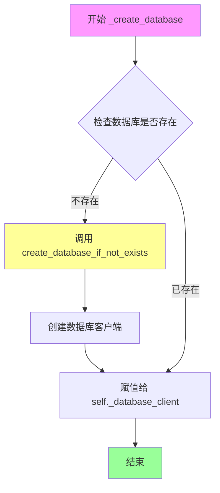

#### 带注释源码

```python
def _create_database(self) -> None:
    """Create the database if it doesn't exist."""
    # 使用 CosmosClient 的 create_database_if_not_exists 方法
    # 该方法会检查数据库是否已存在：
    #   - 若不存在：创建新数据库
    #   - 若已存在：返回现有数据库的引用
    # 参数 id 为数据库名称，来自构造时传入的 database_name
    # 返回值是一个 DatabaseProxy 对象，用于后续的容器操作
    self._database_client = self._cosmos_client.create_database_if_not_exists(
        id=self._database_name
    )
```


### `AzureCosmosStorage._delete_database`

删除 Azure CosmosDB 数据库（如果存在），并清理相关的容器客户端引用。

参数：
- （无参数，仅包含 self）

返回值：`None`，无返回值描述

#### 流程图

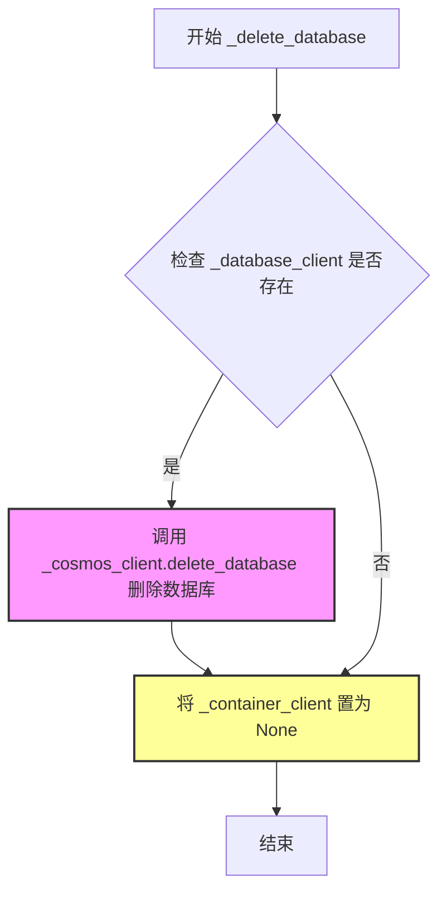

#### 带注释源码

```python
def _delete_database(self) -> None:
    """Delete the database if it exists."""
    # 检查数据库客户端是否已初始化（数据库是否存在）
    if self._database_client:
        # 调用 CosmosClient 的 delete_database 方法删除数据库
        # 这会删除数据库及其所有容器和数据
        self._database_client = self._cosmos_client.delete_database(
            self._database_client
        )
    # 删除数据库后，重置容器客户端为 None
    # 因为容器已随数据库一起被删除
    self._container_client = None
```


### `AzureCosmosStorage._create_container`

创建 Azure Cosmos DB 容器（如果不存在），使用 "/id" 字段作为哈希分区键。

参数： 无

返回值：`None`，无返回值，仅执行副作用操作

#### 流程图

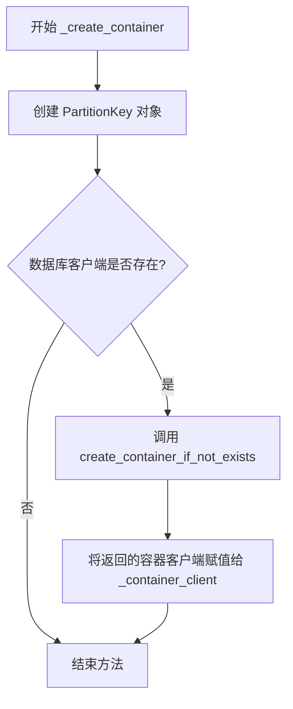

#### 带注释源码

```python
def _create_container(self) -> None:
    """Create a container for the current container name if it doesn't exist."""
    # 创建分区键，指定使用 "/id" 字段进行哈希分区
    # 这决定了 Cosmos DB 如何在物理分区之间分配数据
    partition_key = PartitionKey(path="/id", kind="Hash")
    
    # 仅在数据库客户端已初始化的情况下执行容器创建操作
    # 如果数据库创建失败（如凭据错误），_database_client 可能为 None
    if self._database_client:
        # 使用 create_container_if_not_exists 方法幂差创建容器
        # 如果容器已存在，则返回现有容器的引用，不会重复创建
        # 参数：
        #   - id: 容器名称，来自构造时传入的 _container_name
        #   - partition_key: 分区键配置，控制数据分布和查询效率
        self._container_client = (
            self._database_client.create_container_if_not_exists(
                id=self._container_name,
                partition_key=partition_key,
            )
        )
```


### `AzureCosmosStorage._delete_container`

删除当前容器名称对应的 CosmosDB 容器（如果存在）。

参数： 无

返回值：`None`，表示该方法不返回任何值，仅执行删除操作。

#### 流程图

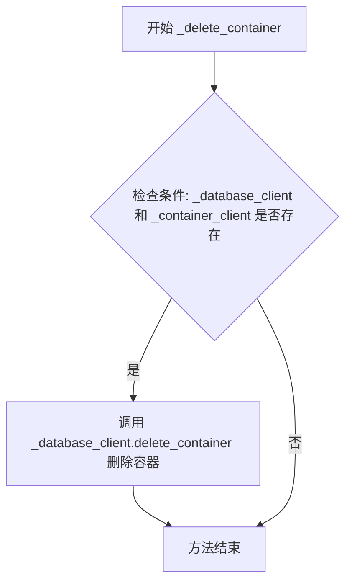

#### 带注释源码

```python
def _delete_container(self) -> None:
    """Delete the container with the current container name if it exists."""
    # 检查数据库客户端和容器客户端是否都已初始化
    if self._database_client and self._container_client:
        # 调用数据库客户端的 delete_container 方法删除当前容器
        # 传入当前容器客户端对象作为参数
        self._container_client = self._database_client.delete_container(
            self._container_client
        )
```


### `AzureCosmosStorage.find`

使用正则表达式模式在 Cosmos DB 容器中查找匹配的文档ID，并返回包含匹配项的迭代器。

参数：

- `file_pattern`：`re.Pattern[str]` - 用于匹配文档ID的正则表达式模式对象

返回值：`Iterator[str]` - 匹配文档ID的迭代器

#### 流程图

```mermaid
flowchart TD
    A[开始 find 方法] --> B{检查数据库和容器客户端是否已初始化}
    B -->|未初始化| C[返回空迭代器]
    B -->|已初始化| D[构建 RegexMatch 查询语句]
    D --> E[设置查询参数: @pattern = file_pattern.pattern]
    E --> F[调用 _query_all_items 执行查询]
    F --> G{检查查询结果数量}
    G -->|结果为0| C
    G -->|结果>0| H[遍历每个查询结果项]
    H --> I{使用 file_pattern.search 匹配 item[id]}
    I -->|匹配成功| J[yield 返回匹配的文档ID]
    I -->|匹配失败| K[增加过滤计数器]
    J --> L{是否还有更多项}
    K --> L
    L -->|是| H
    L -->|否| M[计算进度状态]
    M --> N[记录调试日志]
    N --> O[捕获异常并记录警告]
    O --> P[结束]
    C --> P
```

#### 带注释源码

```python
def find(
    self,
    file_pattern: re.Pattern[str],
) -> Iterator[str]:
    """Find documents in a Cosmos DB container using a file pattern regex.

    该方法通过正则表达式模式在 Cosmos DB 容器中查找匹配的文档。
    它首先使用 Cosmos DB 的 RegexMatch 查询语法进行初步筛选，
    然后在客户端进行二次正则匹配以确保准确性。

    Params:
        file_pattern: 用于匹配文档ID的正则表达式模式对象

    Returns
    -------
        Iterator[str]: 匹配文档ID的迭代器
    """
    # 记录搜索日志，包含容器名和正则模式
    logger.info(
        "Search container [%s] for documents matching [%s]",
        self._container_name,
        file_pattern.pattern,
    )
    
    # 检查数据库和容器客户端是否已初始化
    if not self._database_client or not self._container_client:
        return  # 未初始化则返回空迭代器

    try:
        # 构建 Cosmos DB RegexMatch 查询语句
        # RegexMatch 是 Cosmos DB 的内置函数，用于在服务器端进行正则匹配
        query = "SELECT * FROM c WHERE RegexMatch(c.id, @pattern)"
        parameters: list[dict[str, Any]] = [
            {"name": "@pattern", "value": file_pattern.pattern}
        ]

        # 执行查询获取所有匹配项
        items = self._query_all_items(
            self._container_client,
            query=query,
            parameters=parameters,
        )
        
        # 记录调试日志显示所有查询到的文档ID
        logger.debug("All items: %s", [item["id"] for item in items])
        
        # 初始化计数器
        num_loaded = 0       # 成功加载（匹配）的数量
        num_total = len(items)  # 总查询结果数
        
        # 如果没有查询结果，直接返回
        if num_total == 0:
            return
            
        num_filtered = 0    # 被过滤掉（不匹配）的数量
        
        # 遍历所有查询结果，在客户端进行二次正则匹配
        for item in items:
            # 使用正则表达式搜索匹配文档ID
            match = file_pattern.search(item["id"])
            if match:
                # 匹配成功，yield 返回文档ID
                yield item["id"]
                num_loaded += 1
            else:
                # 客户端匹配失败，增加过滤计数器
                num_filtered += 1

        # 创建进度状态对象用于记录日志
        progress_status = _create_progress_status(
            num_loaded, num_filtered, num_total
        )
        
        # 记录进度调试日志
        logger.debug(
            "Progress: %s (%d/%d completed)",
            progress_status.description,
            progress_status.completed_items,
            progress_status.total_items,
        )
        
    except Exception:  # noqa: BLE001
        # 捕获所有异常并记录警告日志，不向上抛出
        logger.warning(
            "An error occurred while searching for documents in Cosmos DB."
        )
```


### `AzureCosmosStorage.get`

获取Azure Cosmos DB容器中与给定键匹配的所有项，支持Parquet和JSON格式的数据获取。

参数：

- `key`：`str`，要获取的文档键（对于Parquet文件是前缀，如"entities"；对于JSON文件是完整的ID）
- `as_bytes`：`bool | None`，可选参数，指定是否以字节形式返回（用于Parquet格式）。如果为True，返回Parquet编码的DataFrame；如果为False或None，返回JSON字符串
- `encoding`：`str | None`，可选参数，指定编码格式（当前实现中未使用，保留用于接口兼容性）

返回值：`Any`，返回类型根据`as_bytes`参数变化：
- 当`as_bytes=True`时：返回`pd.DataFrame.to_parquet()`生成的字节数据（Parquet格式）
- 当`as_bytes=False`或`None`时：返回JSON字符串
- 当获取失败或数据不存在时：返回`None`

#### 流程图

```mermaid
flowchart TD
    A[开始 get 方法] --> B{数据库或容器客户端是否存在?}
    B -->|否| C[返回 None]
    B -->|是| D{as_bytes == True?}
    
    D -->|是| E[获取键的前缀 prefix]
    E --> F[构建SQL查询: SELECT * FROM c WHERE STARTSWITH(c.id, 'prefix:')]
    F --> G[执行查询获取所有匹配项]
    G --> H{查询结果是否为空?}
    H -->|是| I[记录警告并返回 None]
    H -->|否| J[提取项的ID后缀]
    J --> K[将项列表转为JSON字符串]
    K --> L[使用pandas读取为DataFrame]
    
    L --> M{prefix == 'entities'?}
    M -->|是| N[添加 cosmos_id 列保存原始ID]
    N --> O[处理 human_readable_id 列]
    M -->|否| P{DataFrame是否为空?}
    
    P -->|是| Q[记录警告并返回 None]
    P -->|否| R[返回Parquet格式的DataFrame]
    
    D -->|否| S[使用 read_item 读取单个项]
    S --> T[获取项的 body 内容]
    T --> U[返回JSON序列化的body内容]
    
    C --> V[异常处理: 记录错误日志]
    I --> V
    Q --> V
    R --> V
    U --> V
    
    V --> W[结束]
```

#### 带注释源码

```python
async def get(
    self, key: str, as_bytes: bool | None = None, encoding: str | None = None
) -> Any:
    """Fetch all items in a container that match the given key."""
    try:
        # 检查数据库和容器客户端是否已初始化
        # 如果未初始化（连接失败或未创建），直接返回None
        if not self._database_client or not self._container_client:
            return None

        # ==================== 分支1: as_bytes=True (Parquet格式) ====================
        if as_bytes:
            # 从key提取前缀（如"entities", "text_units"等）
            # key可能是 "entities.parquet" 格式
            prefix = self._get_prefix(key)
            
            # 构建SQL查询，使用STARTSWITH查找所有以 prefix: 开头的文档ID
            # 注意：这里存在SQL注入风险，但因为prefix来自内部key所以相对安全
            query = f"SELECT * FROM c WHERE STARTSWITH(c.id, '{prefix}:')"
            
            # 执行查询获取所有匹配的项
            items_list = self._query_all_items(
                self._container_client,
                query=query,
            )

            # 记录查询结果的日志
            logger.info("Cosmos load prefix=%s count=%d", prefix, len(items_list))

            # 如果没有找到匹配项，记录警告并返回None
            if not items_list:
                logger.warning("No items found for prefix %s (key=%s)", prefix, key)
                return None

            # 移除每项ID中的前缀，保留原始ID部分
            # 例如："entities:123" -> "123"
            for item in items_list:
                item["id"] = item["id"].split(":", 1)[1]

            # 将项列表序列化为JSON字符串
            items_json_str = json.dumps(items_list)
            
            # 使用pandas将JSON字符串读取为DataFrame
            # orient="records" 表示每行一个JSON对象
            items_df = pd.read_json(
                StringIO(items_json_str), orient="records", lines=False
            )

            # 特殊处理 entities 前缀的数据
            if prefix == "entities":
                # 保存原始的Cosmos ID到新列，用于调试和数据迁移
                items_df["cosmos_id"] = items_df["id"]
                
                # 将id列转换为字符串类型
                items_df["id"] = items_df["id"].astype(str)

                # 如果存在human_readable_id列，处理NaN值并转换为int
                if "human_readable_id" in items_df.columns:
                    items_df["human_readable_id"] = (
                        items_df["human_readable_id"]
                        .fillna(items_df["id"])  # 用id填充NaN
                        .astype(int)
                    )
                else:
                    # 首次运行场景：实体可能还没有entity_id
                    # 保持id为cosmos后缀格式
                    logger.info(
                        "Entities loaded without entity_id; leaving id as cosmos suffix."
                    )

            # 检查DataFrame是否为空
            if items_df.empty:
                logger.warning(
                    "No rows returned for prefix %s (key=%s)", prefix, key
                )
                return None
            
            # 将DataFrame转换为Parquet格式的字节数据并返回
            return items_df.to_parquet()
        
        # ==================== 分支2: as_bytes=False (JSON格式) ====================
        # 读取单个文档项
        # Cosmos DB要求item key和partition key相匹配
        item = self._container_client.read_item(item=key, partition_key=key)
        
        # 获取文档的body内容（即实际存储的数据）
        item_body = item.get("body")
        
        # 将body内容JSON序列化后返回
        return json.dumps(item_body)
        
    except Exception:
        # 捕获所有异常，记录错误日志并返回None
        # 这确保了方法的健壮性，不会因为单个项的错误导致整个流程失败
        logger.exception("Error reading item %s", key)
        return None
```


### `AzureCosmosStorage.set`

写入数据到 Azure Cosmos DB。如果值为字节类型（parquet 文件），则将每一行作为单独的项目写入，ID 格式为 `{prefix}:{stable_key_or_index}`；否则将值解析为 JSON 并以 key 为 ID 写入。

参数：

- `key`：`str`，存储键，用于确定数据的前缀和标识
- `value`：`Any`，要存储的值，可以是字节类型（parquet 文件）或 JSON 字符串
- `encoding`：`str | None`，编码格式（可选，当前未使用）

返回值：`None`，无返回值

#### 流程图

```mermaid
flowchart TD
    A[开始 set 方法] --> B{数据库或容器客户端是否存在?}
    B -->|否| C[抛出 ValueError: 数据库或容器未初始化]
    B -->|是| D{value 是否为 bytes 类型?}
    D -->|是| E[获取 key 的前缀 prefix]
    D -->|否| L[构建 cosmosdb_item: {id: key, body: json.loads(value)}]
    L --> M[调用 upsert_item 写入]
    M --> Z[结束]
    
    E --> F[使用 pandas 读取 parquet 为 DataFrame]
    F --> G{DataFrame 是否包含 'id' 列?}
    G -->|是| H[从 _no_id_prefixes 中移除 prefix]
    G -->|否| I[将 prefix 添加到 _no_id_prefixes]
    H --> J[将 DataFrame 转换为 JSON 记录列表]
    I --> J
    J --> K[遍历每条记录]
    
    K --> K1{prefix == 'entities'?}
    K1 -->|是| K2[获取 human_readable_id 作为 stable_key]
    K2 --> K3[构建 cosmos_id = f'{prefix}:{stable_key}']
    K3 --> K4[如果存在 'id' 字段, 存入 entity_id]
    K4 --> K5[将 cosmos_id 设为 item 的 id]
    K1 -->|否| K6{DataFrame 有 'id' 列?}
    K6 -->|是| K7[构建 id = f'{prefix}:{cosmosdb_item[id]}']
    K6 -->|否| K8[构建 id = f'{prefix}:{index}']
    
    K5 --> M
    K7 --> M
    K8 --> M
    
    C --> Z
    D -->|是| E
    
    Z --> N[异常处理: 记录日志]
```

#### 带注释源码

```python
async def set(self, key: str, value: Any, encoding: str | None = None) -> None:
    """Write an item to Cosmos DB. If the value is bytes, we assume it's a parquet file and we write each row as a separate item with id formatted as {prefix}:{stable_key_or_index}."""
    # 检查数据库和容器客户端是否已初始化
    if not self._database_client or not self._container_client:
        error_msg = "Database or container not initialized. Cannot write item."
        raise ValueError(error_msg)
    try:
        # 判断输入值类型：字节（parquet）或其他（JSON 字符串）
        if isinstance(value, bytes):
            # 从 key 中提取前缀（如 entities, claims 等）
            prefix = self._get_prefix(key)
            # 将 parquet 字节数据解析为 pandas DataFrame
            value_df = pd.read_parquet(BytesIO(value))

            # 决定 DataFrame 是否包含 id 列
            df_has_id = "id" in value_df.columns

            # 重要：如果现在有 id，取消之前标记的"无 id"状态
            if df_has_id:
                self._no_id_prefixes.discard(prefix)
            else:
                self._no_id_prefixes.add(prefix)

            # 将 DataFrame 转换为 JSON 记录列表
            cosmosdb_item_list = json.loads(
                value_df.to_json(orient="records", lines=False, force_ascii=False)
            )

            # 遍历每一条记录并写入 Cosmos DB
            for index, cosmosdb_item in enumerate(cosmosdb_item_list):
                if prefix == "entities":
                    # 实体使用 human_readable_id 作为稳定键
                    stable_key = cosmosdb_item.get("human_readable_id", index)
                    cosmos_id = f"{prefix}:{stable_key}"

                    # 如果管道提供了最终 UUID，单独存储
                    if "id" in cosmosdb_item:
                        cosmosdb_item["entity_id"] = cosmosdb_item["id"]

                    # Cosmos 标识必须稳定且永不改变
                    cosmosdb_item["id"] = cosmos_id

                else:
                    # 非实体前缀的处理逻辑
                    if df_has_id:
                        cosmosdb_item["id"] = f"{prefix}:{cosmosdb_item['id']}"
                    else:
                        cosmosdb_item["id"] = f"{prefix}:{index}"

                # 使用 upsert 操作写入 Cosmos DB（存在则更新，不存在则插入）
                self._container_client.upsert_item(body=cosmosdb_item)
        else:
            # 非字节类型：直接解析为 JSON 并写入
            cosmosdb_item = {"id": key, "body": json.loads(value)}
            self._container_client.upsert_item(body=cosmosdb_item)

    except Exception:
        # 捕获异常并记录日志
        logger.exception("Error writing item %s", key)
```


### `AzureCosmosStorage.has`

检查给定的文件名键是否存在于 CosmosDB 存储中。如果键包含 ".parquet"，则使用前缀匹配查询；否则使用精确匹配查询。

参数：

-  `key`：`str`，要检查的键名

返回值：`bool`，如果键存在于存储中返回 True，否则返回 False

#### 流程图

```mermaid
flowchart TD
    A[开始检查键是否存在] --> B{数据库或容器客户端是否已初始化?}
    B -->|否| C[返回 False]
    B -->|是| D{key 是否包含 '.parquet'?}
    D -->|是| E[提取 key 的前缀]
    D -->|否| F[使用精确匹配查询]
    E --> G[执行查询: STARTSWITH(c.id, 'prefix:')]
    F --> H[执行查询: c.id = 'key']
    G --> I[获取计数结果]
    H --> I
    I --> J{计数 > 0?}
    J -->|是| K[返回 True]
    J -->|否| L[返回 False]
```

#### 带注释源码

```python
async def has(self, key: str) -> bool:
    """Check if the contents of the given filename key exist in the cosmosdb storage."""
    # 检查数据库和容器客户端是否已初始化
    if not self._database_client or not self._container_client:
        return False
    
    # 如果键包含 '.parquet'，则使用前缀匹配
    if ".parquet" in key:
        # 提取前缀（例如 'entities'）
        prefix = self._get_prefix(key)
        # 查询以该前缀开头的所有项的计数
        count = self._query_count(
            self._container_client,
            query_filter=f"STARTSWITH(c.id, '{prefix}:')",
        )
        # 如果计数大于 0，表示存在
        return count > 0
    
    # 对于非 parquet 文件，使用精确匹配查询
    count = self._query_count(
        self._container_client,
        query_filter=f"c.id = '{key}'",
    )
    # 计数大于等于 1 表示存在
    return count >= 1
```


### `AzureCosmosStorage._query_all_items`

分页查询所有项目。该方法通过分页机制从 Cosmos DB 查询中获取所有结果，避免了直接调用 `list()` 可能导致的超时或大型结果集返回不完整的问题。

参数：

- `container_client`：`ContainerProxy`，Cosmos DB 容器客户端，用于执行查询
- `query`：`str`，要执行的 SQL 查询字符串
- `parameters`：`list[dict[str, Any]] | None`，可选的查询参数，用于参数化查询
- `page_size`：`int`，每页返回的项目数，默认为 `_DEFAULT_PAGE_SIZE`（100）

返回值：`list[dict[str, Any]]`，包含查询结果的字典列表

#### 流程图

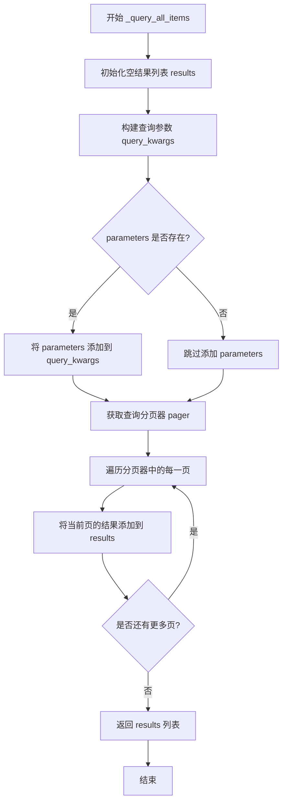

#### 带注释源码

```python
def _query_all_items(
    self,
    container_client: ContainerProxy,
    query: str,
    parameters: list[dict[str, Any]] | None = None,
    page_size: int = _DEFAULT_PAGE_SIZE,
) -> list[dict[str, Any]]:
    """Fetch all items from a Cosmos DB query using pagination.

    This avoids the pitfalls of calling list() on the full pager, which can
    time out or return incomplete results for large result sets.
    """
    # 初始化用于存储查询结果的列表
    results: list[dict[str, Any]] = []
    
    # 构建查询参数字典
    query_kwargs: dict[str, Any] = {
        "query": query,  # SQL 查询语句
        "enable_cross_partition_query": True,  # 启用跨分区查询
        "max_item_count": page_size,  # 设置每页最大项目数
    }
    
    # 如果提供了参数，则添加到查询参数中
    if parameters:
        query_kwargs["parameters"] = parameters

    # 获取查询分页器，通过 by_page() 方法实现分页迭代
    pager = container_client.query_items(**query_kwargs).by_page()
    
    # 遍历每一页结果并将当前页的项目扩展到结果列表中
    for page in pager:
        results.extend(page)
    
    # 返回所有查询结果
    return results
```


### `AzureCosmosStorage._query_count`

查询匹配项数量，无需获取所有项目即可返回符合过滤条件的项目总数。

参数：

- `self`：隐式的 `AzureCosmosStorage` 实例，方法所属的存储对象
- `container_client`：`ContainerProxy`，Cosmos DB 容器客户端，用于执行查询
- `query_filter`：`str`，SQL WHERE 子句（不包含 "WHERE" 关键字），例如 `"STARTSWITH(c.id, 'entities:')"`
- `parameters`：`list[dict[str, Any]] | None`，可选的查询参数列表，用于参数化查询，防止 SQL 注入

返回值：`int`，返回匹配过滤条件的项目数量，如果没有匹配项则返回 0

#### 流程图

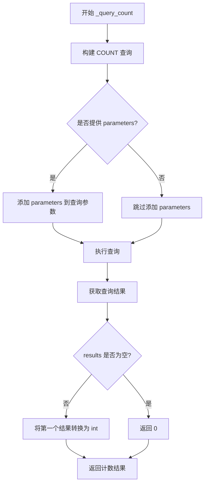

#### 带注释源码

```python
def _query_count(
    self,
    container_client: ContainerProxy,
    query_filter: str,
    parameters: list[dict[str, Any]] | None = None,
) -> int:
    """Return the count of items matching a filter, without fetching them all.

    Parameters
    ----------
    query_filter:
        The WHERE clause (without 'WHERE'), e.g. "STARTSWITH(c.id, 'entities:')".
    """
    # 构建 COUNT 查询语句，SELECT VALUE COUNT(1) 用于只返回计数结果而非完整文档
    count_query = f"SELECT VALUE COUNT(1) FROM c WHERE {query_filter}"  # noqa: S608
    
    # 初始化查询参数，启用跨分区查询以支持大规模数据集
    query_kwargs: dict[str, Any] = {
        "query": count_query,
        "enable_cross_partition_query": True,
    }
    
    # 如果提供了参数，则添加到查询参数中（用于参数化查询）
    if parameters:
        query_kwargs["parameters"] = parameters

    # 执行查询并获取结果
    results = list(container_client.query_items(**query_kwargs))
    
    # 如果有结果则返回第一个结果的整数值，否则返回 0
    return int(results[0]) if results else 0  # type: ignore[arg-type]
```


### `AzureCosmosStorage.delete`

删除 Azure Cosmos DB 中与给定文件名键关联的所有项目。

参数：

- `key`：`str`，要删除的项目标识符，可以是完整键名（如 "entities.parquet"）或单个文档 ID

返回值：`None`，该方法执行删除操作，不返回任何内容

#### 流程图

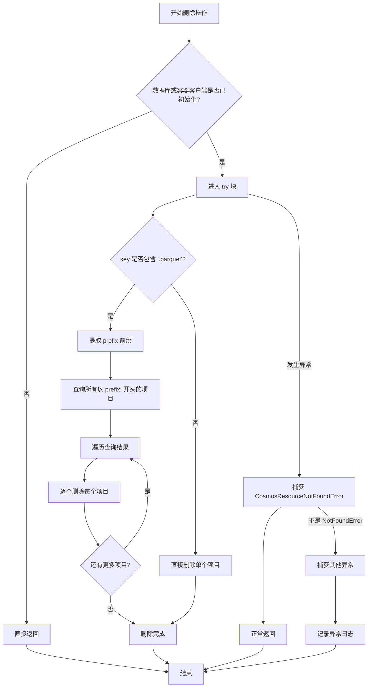

#### 带注释源码

```python
async def delete(self, key: str) -> None:
    """Delete all cosmosdb items belonging to the given filename key."""
    # 检查数据库和容器客户端是否已初始化
    if not self._database_client or not self._container_client:
        return
    try:
        # 如果 key 包含 .parquet，则需要删除所有匹配前缀的项目
        if ".parquet" in key:
            # 从 key 中提取前缀（如 "entities"）
            prefix = self._get_prefix(key)
            # 构建查询语句，查找所有以 prefix: 开头的项目
            query = f"SELECT * FROM c WHERE STARTSWITH(c.id, '{prefix}:')"  # noqa: S608
            # 执行查询获取所有匹配的项目
            items = self._query_all_items(
                self._container_client,
                query=query,
            )
            # 遍历每个项目并逐个删除
            for item in items:
                self._container_client.delete_item(
                    item=item["id"], partition_key=item["id"]
                )
        else:
            # 非 parquet 文件，直接根据 key 删除单个项目
            self._container_client.delete_item(item=key, partition_key=key)
    # 如果项目不存在，CosmosResourceNotFoundError 是正常情况，直接返回
    except CosmosResourceNotFoundError:
        return
    # 捕获其他所有异常并记录日志
    except Exception:
        logger.exception("Error deleting item %s", key)
```


### `AzureCosmosStorage.clear`

清空存储中的所有内容。当前实现通过删除整个数据库（包括其中的所有容器和数据）来达到清空目的。这是一个异步方法，执行后将导致当前存储实例与数据库的连接断开，后续操作可能需要重新初始化。

参数：
- （无参数，仅包含 self）

返回值：`None`，无返回值。该方法执行副作用操作（删除数据库），不返回任何数据。

#### 流程图

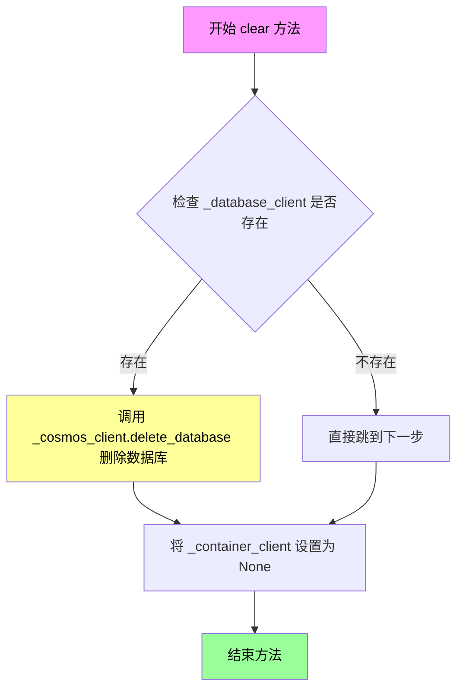

#### 带注释源码

```python
async def clear(self) -> None:
    """Clear all contents from storage.

    # This currently deletes the database, including all containers and data within it.
    # TODO: We should decide what granularity of deletion is the ideal behavior (e.g. delete all items within a container, delete the current container, delete the current database)
    """
    # 调用内部方法 _delete_database 来删除整个数据库
    # 注意：这会删除数据库中的所有容器和所有数据，且此操作不可逆
    self._delete_database()
```


### `AzureCosmosStorage.keys`

返回存储中的键列表。该方法目前未实现，调用时会抛出 `NotImplementedError` 异常，因为 CosmosDB 存储尚不支持列出键的操作。

参数： 无

返回值：`list[str]`，返回键列表

#### 流程图

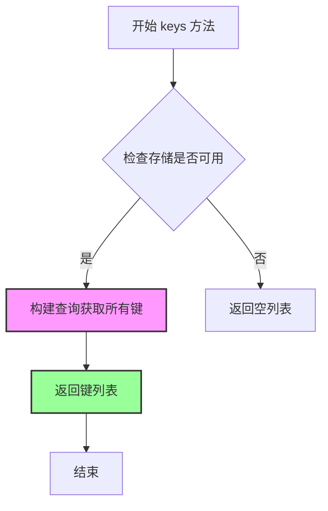

#### 带注释源码

```python
def keys(self) -> list[str]:
    """Return the keys in the storage."""
    # 未实现错误消息
    msg = "CosmosDB storage does yet not support listing keys."
    # 抛出未实现异常
    raise NotImplementedError(msg)
```


### `AzureCosmosStorage.child`

创建一个子存储实例，用于支持存储的层级结构。

参数：

- `name`：`str | None`，子存储的名称，用于标识子存储实例

返回值：`Storage`，返回当前存储实例本身（因为 CosmosDB 不支持真正的子存储分离，当前实现直接返回父实例）

#### 流程图

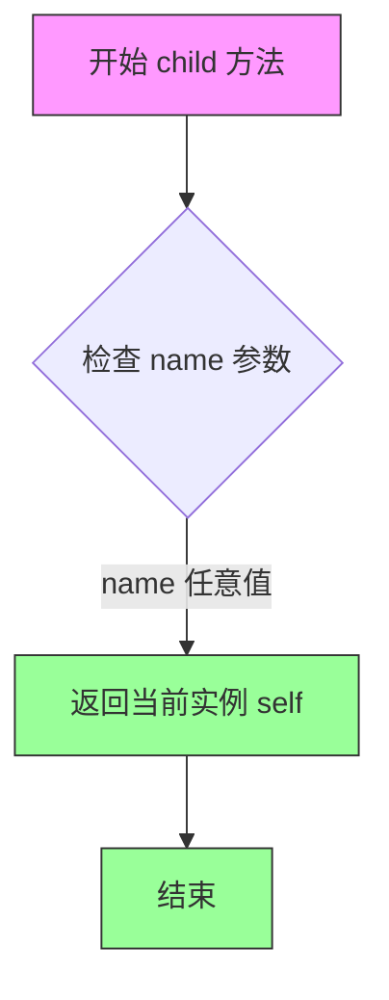

#### 带注释源码

```python
def child(self, name: str | None) -> "Storage":
    """Create a child storage instance.
    
    由于 Azure CosmosDB 存储采用平面结构设计，不支持真正的命名空间或子容器分离，
    因此该方法当前实现为返回当前存储实例本身。
    
    这意味着所有子存储操作实际上都是对同一底层 CosmosDB 容器进行操作。
    
    Params:
        name: 子存储的名称标识（当前未使用）
        
    Returns:
        Storage: 返回当前 AzureCosmosStorage 实例
    """
    return self
```


### `AzureCosmosStorage._get_prefix`

获取文件名前缀，用于从完整的文件名或键中提取前缀部分（例如从 "entities.parquet" 提取 "entities"）。

参数：

- `key`：`str`，文件名键，通常包含文件扩展名（如 "entities.parquet"）

返回值：`str`，返回第一个点之前的前缀字符串

#### 流程图

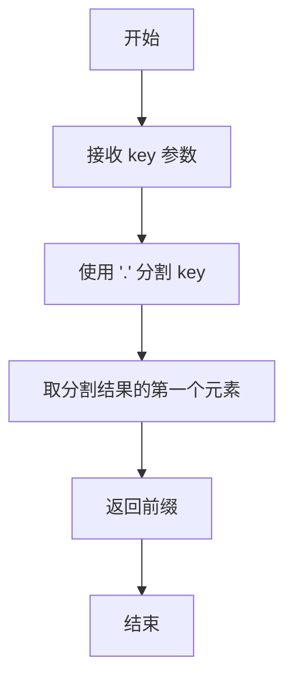

#### 带注释源码

```python
def _get_prefix(self, key: str) -> str:
    """Get the prefix of the filename key."""
    # 使用点号分割键，并返回第一部分作为前缀
    # 例如：key = "entities.parquet" -> 返回 "entities"
    #       key = "reports/summary.json" -> 返回 "reports/summary"
    return key.split(".")[0]
```


### `AzureCosmosStorage.get_creation_date`

获取指定键（key）对应的 Cosmos DB 文档的创建时间戳，并将其格式化为带本地时区的日期时间字符串。

参数：

- `key`：`str`，文档的唯一标识符（ID），用于从 Cosmos DB 容器中查找并读取对应的文档项

返回值：`str`，格式化后的创建时间戳字符串（带本地时区信息）；如果数据库或容器未初始化，或发生任何异常，则返回空字符串

#### 流程图

```mermaid
flowchart TD
    A[开始 get_creation_date] --> B{检查数据库和容器客户端是否已初始化}
    B -->|未初始化| C[返回空字符串 ""]
    B -->|已初始化| D[使用 key 读取 Cosmos DB 项]
    D --> E{读取是否成功}
    E -->|失败| F[记录警告日志并返回空字符串 ""]
    E -->|成功| G[从 item['_ts'] 提取 Unix 时间戳]
    G --> H[将 Unix 时间戳转换为 UTC 时区的 datetime 对象]
    H --> I[调用 get_timestamp_formatted_with_local_tz 格式化为本地时区字符串]
    I --> J[返回格式化后的时间戳字符串]
```

#### 带注释源码

```python
async def get_creation_date(self, key: str) -> str:
    """Get a value from the cache.
    
    从 Cosmos DB 容器中读取指定 key 对应文档的创建时间戳。
    Cosmos DB 自动为每个文档维护 _ts 字段（Unix 时间戳），
    本方法将该时间戳转换为格式化的时间字符串。
    
    Args:
        key: 文档的唯一标识符
        
    Returns:
        格式化后的创建时间字符串（带本地时区），如果读取失败则返回空字符串
    """
    try:
        # 检查数据库和容器客户端是否已初始化
        # 如果未初始化，返回空字符串表示无有效数据
        if not self._database_client or not self._container_client:
            return ""
        
        # 使用 Cosmos DB SDK 读取指定 key 的文档项
        # partition_key 参数用于指定分区键，Cosmos DB 根据此键定位文档
        item = self._container_client.read_item(item=key, partition_key=key)
        
        # item["_ts"] 是 Cosmos DB 自动维护的 Unix 时间戳（秒级）
        # 使用 datetime.fromtimestamp 将其转换为 datetime 对象
        # tz=timezone.utc 确保时间被解释为 UTC 时间
        # 然后调用 get_timestamp_formatted_with_local_tz 转换为本地时区格式
        return get_timestamp_formatted_with_local_tz(
            datetime.fromtimestamp(item["_ts"], tz=timezone.utc)
        )

    except Exception:  # noqa: BLE001
        # 捕获所有异常，记录警告日志并返回空字符串
        # 这种设计使得调用方可以优雅地处理文档不存在等错误情况
        logger.warning("Error getting key %s", key)
        return ""
```

## 关键组件


### AzureCosmosStorage 类

Azure CosmosDB 存储后端实现，提供基于 CosmosDB 的分布式文档存储能力，支持 Parquet 序列化数据存储、JSON 文档操作及基于前缀的实体管理。

### CosmosDB 客户端管理组件

负责 CosmosDB 连接的初始化与管理，支持连接字符串和 Azure AD 身份验证两种认证方式，并维护数据库和容器客户端的生命周期。

### Parquet 序列化组件

处理 Parquet 格式数据的读写转换，将 DataFrame 转换为 CosmosDB 文档格式，支持实体 ID 映射和 Cosmos ID 稳定键生成。

### 查询与分页组件

提供高效的查询接口，通过分页查询避免大结果集超时，支持基于前缀的文档检索和数量统计。

### 前缀与实体管理组件

基于文件名前缀（如 entities:、text_units:）进行数据分区和标识管理，确保实体 ID 的稳定性和可追溯性。

### 错误处理与日志组件

统一的异常捕获机制，记录操作警告和错误日志，提供详细的调试信息。

## 问题及建议


### 已知问题

-   **SQL注入漏洞**：在`get`、`has`、`delete`和`_query_count`方法中，直接使用f-string拼接用户输入构建SQL查询（如`f"SELECT * FROM c WHERE STARTSWITH(c.id, '{prefix}:')"`），存在严重的SQL注入风险。
-   **异常处理过于宽泛**：多处使用裸`except Exception:`捕获所有异常，包括`KeyboardInterrupt`和`SystemExit`，且部分异常被静默吞掉（如`find`方法中的警告日志），导致错误难以追踪调试。
-   **未实现的接口方法**：`keys()`方法直接抛出`NotImplementedError`，导致调用方无法获取存储中的键列表。
-   **资源清理缺失**：未实现`__del__`方法、上下文管理器或连接池管理，可能导致CosmosDB连接泄漏；`_delete_database`和`_delete_container`方法在删除失败时未正确清理客户端状态。
-   **大数据集内存风险**：`_query_all_items`方法将所有查询结果一次性加载到内存列表中，对于大型数据集可能导致`OutOfMemoryError`，应改用生成器模式流式处理。
-   **硬编码分区键**：分区键被硬编码为`/id`，这对某些数据模型（如实体数据）可能不是最优选择，应考虑可配置。
-   **URL解析缺乏健壮性**：`_cosmosdb_account_name`的提取逻辑（`account_url.split("//")[1].split(".")[0]`）未处理异常格式的URL，会导致`IndexError`。
-   **TODO未完成**：`clear()`方法中的TODO指出删除粒度未确定，当前直接删除整个数据库，行为可能不符合预期。
-   **返回值类型不一致**：`get`方法根据`as_bytes`参数返回不同类型（parquet bytes或json字符串），且`as_bytes=None`时的行为定义不清晰。

### 优化建议

-   **修复SQL注入**：使用参数化查询，将用户输入作为参数传递而非字符串拼接，例如使用`{"name": "@prefix", "value": f"{prefix}:"}`。
-   **改进异常处理**：捕获具体异常类型（如`CosmosHttpResponseError`），并在所有catch块中记录完整堆栈信息；考虑向上抛出关键异常而非静默吞掉。
-   **实现keys()方法**：通过查询CosmosDB容器的feed或使用`__items`查询返回所有文档ID。
-   **添加资源管理**：实现`__aenter__`和`__aexit__`方法支持异步上下文管理器，或实现`close()`方法显式释放连接。
-   **流式处理大数据**：将`_query_all_items`改为生成器函数，逐页yield结果而非一次性加载。
-   **配置化分区键**：在构造函数中添加`partition_key_path`参数，允许调用方指定合适的分区键路径。
-   **增强URL解析健壮性**：使用`urllib.parse`模块解析URL，或添加try-except保护避免崩溃。
-   **完善clear()行为**：根据TODO讨论确定合理的删除粒度（删除容器内所有项 vs 删除容器 vs 删除数据库），并在代码中实现。
-   **统一返回类型**：明确定义`get`方法在不同参数组合下的返回类型文档，必要时添加类型转换逻辑。
-   **添加重试机制**：对CosmosDB操作添加重试逻辑，处理临时性网络故障或限流错误。

## 其它


### 设计目标与约束

本模块的设计目标是实现一个基于Azure CosmosDB的分布式存储抽象层，为graphrag项目提供统一的数据持久化能力。核心约束包括：1）必须支持连接字符串和Azure Identity两种认证方式；2）使用"/id"作为分区键以确保数据均匀分布；3）对于Parquet文件格式的数据，需要将每行拆分为独立的CosmosDB文档；4）需要兼容现有的Storage接口抽象。

### 错误处理与异常设计

错误处理采用分层策略：1）构造函数阶段验证参数合法性，不合法则抛出ValueError并记录错误日志；2）数据库和容器创建使用"if_not_exists"模式，避免重复创建失败；3）读写操作捕获Exception并记录详细日志，但返回None而非抛出异常，保证业务流程不中断；4）删除操作对CosmosResourceNotFoundError进行特殊处理，视为成功；5）所有CosmosDB查询使用参数化查询防止SQL注入风险。

### 数据流与状态机

数据写入流程：set方法接收key-value，若value为bytes则识别为Parquet文件，按行拆分为独立文档，为entities类型生成稳定的cosmos_id（格式：prefix:human_readable_id），其他类型使用prefix:id或prefix:index，最后调用upsert_item批量写入。数据读取流程：get方法根据key判断类型，若包含".parquet"则执行前缀查询并将结果转换为Parquet格式返回，否则直接读取单条文档并返回JSON字符串。查询使用分页机制避免大结果集超时，计数操作使用专门的COUNT查询避免加载全部数据。

### 外部依赖与接口契约

核心依赖包括：azure-cosmos提供CosmosDB客户端，azure-identity提供DefaultAzureCredential，pandas处理Parquet转换，graphrag.logger.progress提供进度跟踪，graphrag_storage.storage定义Storage抽象接口。接口契约方面：find返回匹配正则的文档ID迭代器，get返回Parquet bytes或JSON字符串，set接受任意可序列化值，has返回布尔值，delete执行软删除，clear清空整个数据库。PartitionKey固定为"/id"路径和Hash类型，不支持配置。

### 性能考虑

1）查询使用分页迭代器而非一次性加载全部结果，避免大结果集超时；2）使用upsert_item而非create_item，提高重复写入效率；3）计数查询使用专门的COUNT语句而非SELECT *后计数；4）批量写入Parquet时逐条upsert，可考虑改为批量事务；5）find方法在应用层二次过滤正则匹配，存在优化空间。

### 安全性考虑

1）SQL查询使用参数化查询防止注入攻击；2）支持Azure Identity实现无密匙认证，符合最小权限原则；3）连接字符串认证时注意保密；4）CosmosDB文档ID格式设计考虑了特殊字符转义；5）日志中避免记录敏感配置信息。

### 配置管理

配置通过构造函数参数传入，包括database_name（必填）、container_name（必填）、connection_string（二选一）、account_url（二选一）、encoding（默认utf-8）。partition_key配置目前硬编码为"/id"，缺乏灵活性。

### 并发与线程安全

CosmosClient实例在构造函数中创建并复用，属于线程安全对象。ContainerProxy和DatabaseProxy操作非线程安全，在多线程环境下需注意。异步方法（get/set/delete/has）未使用锁机制，可能存在并发写入冲突。

### 测试策略建议

应包含单元测试（各方法独立测试）、集成测试（CosmosDB实际连接）、Mock测试（避免外部依赖）、性能测试（大数据集读写）、错误恢复测试（网络中断场景）。

### 部署与运维注意事项

1）生产环境建议使用Azure Identity而非连接字符串；2）clear方法会删除整个数据库，生产环境需谨慎使用；3）建议监控CosmosDB的RU消耗；4）容器和数据库名称应遵循命名规范；5）需要预先规划分区键策略，当前设计可能导致热点问题。


    