# `graphrag\packages\graphrag-storage\graphrag_storage\file_storage.py` 详细设计文档

一个基于文件系统的存储实现类，提供异步文件读写、查找、删除、清空等存储操作，支持键值对形式的数据持久化，并通过aiofiles库实现非阻塞IO操作。

## 整体流程

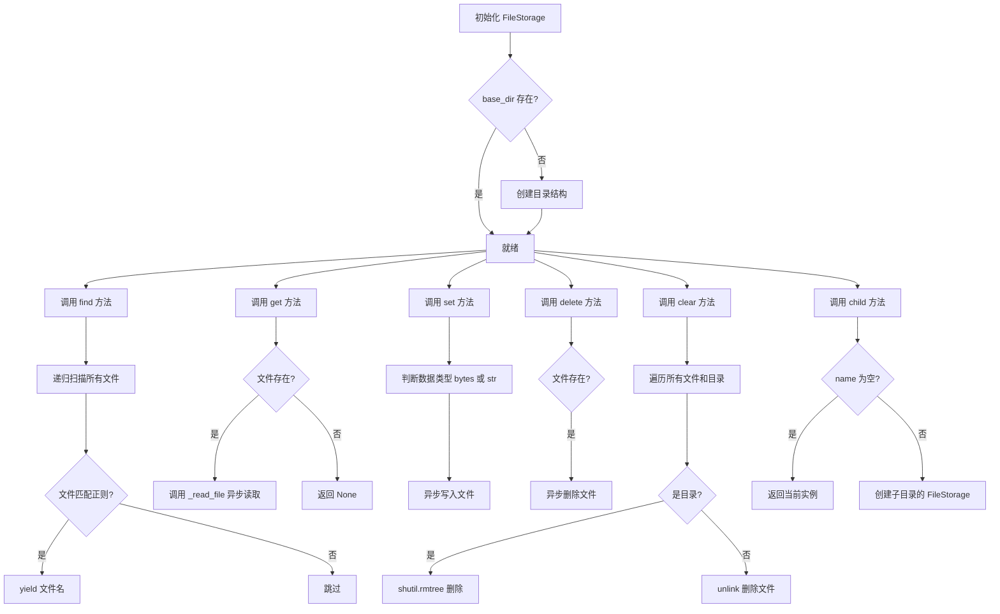

## 类结构

```
Storage (抽象基类 - 外部依赖)
└── FileStorage (文件存储实现)
```

## 全局变量及字段


### `logger`
    
模块级日志记录器，用于记录FileStorage的运行状态和调试信息

类型：`logging.Logger`
    


### `logging`
    
Python标准日志模块，提供日志记录功能

类型：`module`
    


### `os`
    
操作系统接口模块，提供文件系统路径分隔符等

类型：`module`
    


### `re`
    
正则表达式模块，用于文件模式匹配

类型：`module`
    


### `shutil`
    
高级文件操作模块，用于目录树删除

类型：`module`
    


### `datetime`
    
日期时间模块，用于处理文件创建时间

类型：`module`
    


### `pathlib`
    
路径操作模块，提供Path类

类型：`module`
    


### `typing`
    
类型注解模块，提供类型定义支持

类型：`module`
    


### `aiofiles`
    
异步文件操作库，提供异步文件读写功能

类型：`module`
    


### `Path`
    
路径类，用于文件系统路径操作

类型：`Type[Path]`
    


### `Iterator`
    
迭代器抽象基类，用于类型注解

类型：`Type[Iterator]`
    


### `FileStorage._base_dir`
    
存储基础目录路径

类型：`Path`
    


### `FileStorage._encoding`
    
文件编码格式，默认为utf-8

类型：`str`
    
    

## 全局函数及方法


### `_join_path`

跨平台路径拼接函数，用于将基础路径与文件名（含可选子目录）进行拼接，并返回标准化的绝对路径，确保在不同操作系统下路径分隔符的一致性。

参数：

- `file_path`：`Path`，基础目录路径，作为路径拼接的根目录
- `file_name`：`str`，目标文件名，可包含子目录路径（如 `"subdir/file.txt"`）

返回值：`Path`，拼接并解析后的绝对路径对象

#### 流程图

```mermaid
flowchart TD
    A[开始 _join_path] --> B[输入: file_path: Path, file_name: str]
    B --> C[将 file_name 转换为 Path 对象]
    C --> D[提取 file_name 的父目录: Path(file_name).parent]
    C --> E[提取 file_name 的文件名: Path(file_name).name]
    D --> F[拼接路径: file_path / parent / name]
    E --> F
    F --> G[调用 resolve 将路径转换为绝对路径]
    G --> H[返回绝对路径 Path 对象]
```

#### 带注释源码

```python
def _join_path(file_path: Path, file_name: str) -> Path:
    """Join a path and a file. Independent of the OS.
    
    该函数实现了跨平台的文件路径拼接，主要用于文件存储系统中
    将基础目录与相对文件名（含子目录）组合成完整的绝对路径。
    
    Args:
        file_path: 基础目录路径（Path对象）
        file_name: 目标文件名，可包含子目录（如 "subdir/file.txt"）
    
    Returns:
        拼接并解析后的绝对路径对象（Path对象）
    """
    # 使用 Path 对象处理文件名，以支持跨平台的路径分隔符
    # 例如：在 Windows 上 "subdir\\file.txt" 和 Linux 上 "subdir/file.txt" 都能正确处理
    path_obj = Path(file_name)
    
    # 获取文件名的父目录部分（即子目录路径）
    # 例如：file_name = "subdir/file.txt" 时，parent = "subdir"
    #      file_name = "file.txt" 时，parent = "."
    parent_dir = path_obj.parent
    
    # 获取文件名本身（不含父目录）
    # 例如：file_name = "subdir/file.txt" 时，name = "file.txt"
    file_basename = path_obj.name
    
    # 拼接路径：基础路径 / 子目录 / 文件名
    # 使用 Path 对象的 / 操作符进行拼接，自动处理路径分隔符
    joined = file_path / parent_dir / file_basename
    
    # 调用 resolve() 将相对路径转换为绝对路径
    # 同时解析符号链接并规范化路径（如消除多余的 .. 和 .）
    return joined.resolve()
```


### `get_timestamp_formatted_with_local_tz`

该函数是一个外部依赖函数，用于将带时区的 `datetime` 对象格式化为包含本地时区信息的字符串。这是 `graphrag_storage.storage` 模块提供的工具函数，在 `FileStorage` 类中用于获取文件的创建日期并格式化为可读的本地时间字符串。

参数：

- `datetime_obj`：`datetime`，需要格式化的带时区的 `datetime` 对象（调用时传入 `creation_time_utc`，一个 UTC 时区的 `datetime` 对象）

返回值：`str`，格式化后的时间字符串，包含本地时区信息

#### 流程图

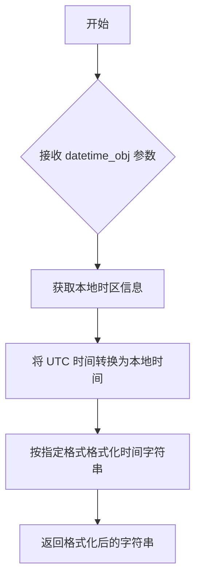

#### 带注释源码

```python
# 该函数为外部依赖，具体实现未在本文件中展示
# 导入来源：from graphrag_storage.storage import get_timestamp_formatted_with_local_tz
# 函数签名（推断）：
# def get_timestamp_formatted_with_local_tz(datetime_obj: datetime) -> str:
#     ...
#
# 在 FileStorage 类中的使用方式：
# async def get_creation_date(self, key: str) -> str:
#     """Get the creation date of a file."""
#     file_path = _join_path(self._base_dir, key)
#
#     creation_timestamp = file_path.stat().st_ctime
#     creation_time_utc = datetime.fromtimestamp(creation_timestamp, tz=timezone.utc)
#
#     # 调用外部依赖函数格式化时间
#     return get_timestamp_formatted_with_local_tz(creation_time_utc)
```


### `FileStorage.__init__`

初始化 FileStorage 实例，设置基础目录和编码格式，并确保存储目录存在。

参数：

- `base_dir`：`str`，文件存储的基础目录路径
- `encoding`：`str` = "utf-8"，文件读写的字符编码格式
- `**kwargs`：`Any`，其他可选关键字参数（用于兼容性）

返回值：`None`，构造函数不返回任何值

#### 流程图

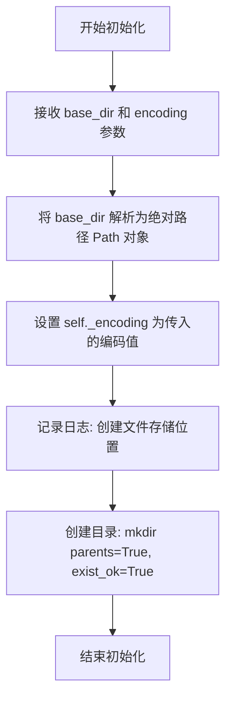

#### 带注释源码

```python
def __init__(self, base_dir: str, encoding: str = "utf-8", **kwargs: Any) -> None:
    """Create a file based storage."""
    # 将传入的 base_dir 字符串解析为绝对路径的 Path 对象
    self._base_dir = Path(base_dir).resolve()
    # 设置文件读写的默认编码格式
    self._encoding = encoding
    # 记录创建文件存储的日志信息，包含存储路径
    logger.info("Creating file storage at [%s]", self._base_dir)
    # 创建基础目录，如果父目录不存在则一并创建，如果已存在则不报错
    self._base_dir.mkdir(parents=True, exist_ok=True)
```


### `FileStorage.find`

根据正则表达式模式在文件存储中查找匹配的文件，返回相对路径的迭代器。

参数：

- `file_pattern`：`re.Pattern[str]`，用于匹配文件名的正则表达式模式

返回值：`Iterator[str]`，返回匹配文件的相对路径迭代器

#### 流程图

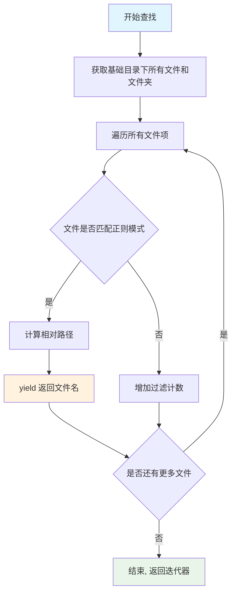

#### 带注释源码

```python
def find(
    self,
    file_pattern: re.Pattern[str],
) -> Iterator[str]:
    """Find files in the storage using a file pattern.
    
    在文件存储中使用文件模式查找文件。
    
    Args:
        file_pattern: 用于匹配文件名的正则表达式模式
        
    Yields:
        匹配正则表达式的文件相对路径
    """
    # 记录搜索开始的日志信息
    logger.info(
        "Search [%s] for files matching [%s]", self._base_dir, file_pattern.pattern
    )
    
    # 使用 rglob("**/*") 递归获取基础目录下的所有文件和文件夹
    all_files = list(self._base_dir.rglob("**/*"))
    
    # 调试日志：打印所有找到的文件和文件夹名称
    logger.debug("All files and folders: %s", [file.name for file in all_files])
    
    # 初始化计数器
    num_loaded = 0    # 匹配并加载的文件数
    num_total = len(all_files)  # 总文件/文件夹数
    num_filtered = 0  # 被过滤掉的文件数
    
    # 遍历所有文件项
    for file in all_files:
        # 使用正则模式搜索文件名的字符串表示
        match = file_pattern.search(f"{file}")
        
        if match:
            # 获取文件的完整路径，并替换掉基础目录部分得到相对路径
            filename = f"{file}".replace(str(self._base_dir), "", 1)
            
            # 如果相对路径以路径分隔符开头，去掉开头的分隔符
            if filename.startswith(os.sep):
                filename = filename[1:]
            
            # 使用 yield 返回匹配文件的相对路径（生成器模式）
            yield filename
            num_loaded += 1
        else:
            # 文件不匹配模式，增加过滤计数
            num_filtered += 1
    
    # 搜索完成后记录统计信息
    logger.debug(
        "Files loaded: %d, filtered: %d, total: %d",
        num_loaded,
        num_filtered,
        num_total,
    )
```


### `FileStorage.get`

异步读取指定键对应的文件内容。首先根据键拼接完整的文件路径，然后检查文件是否存在。若存在，则根据参数以文本或二进制模式读取并返回内容；若不存在，则返回 `None`。

参数：
- `key`：`str`，要读取的文件的键（文件名）。
- `as_bytes`：`bool | None`，是否以二进制模式读取文件。默认为 `False`（文本模式）。
- `encoding`：`str | None`，读取文本时使用的字符编码。默认为 `None`，此时使用实例创建时指定的默认编码。

返回值：`Any`，返回文件内容（文本为 `str`，二进制为 `bytes`），如果文件不存在则返回 `None`。

#### 流程图

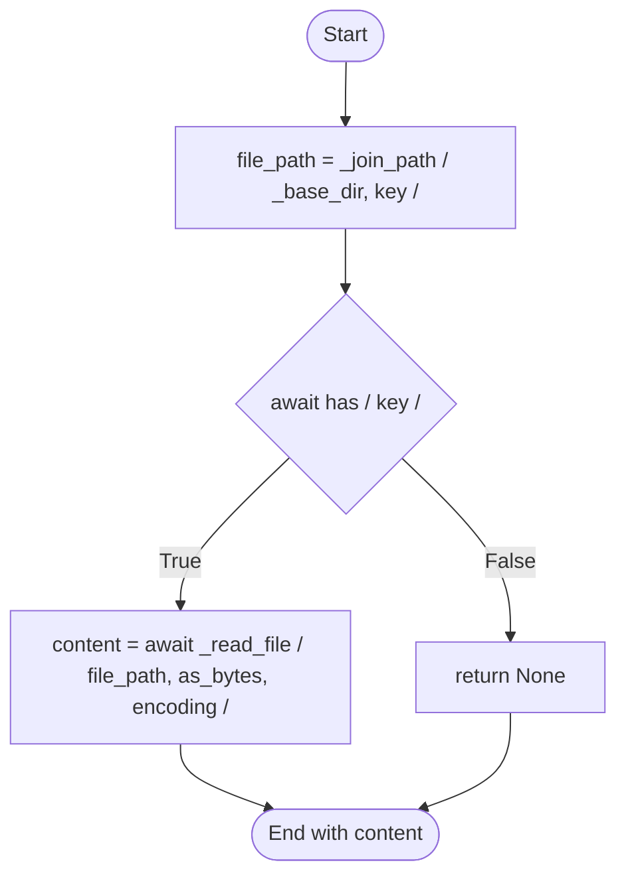

#### 带注释源码

```python
async def get(
    self, key: str, as_bytes: bool | None = False, encoding: str | None = None
) -> Any:
    """Get method definition."""
    # 1. 根据 base_dir 和 key 拼接完整的文件路径
    file_path = _join_path(self._base_dir, key)

    # 2. 异步检查文件是否存在于存储中
    if await self.has(key):
        # 3. 如果文件存在，调用内部方法读取文件内容并返回
        return await self._read_file(file_path, as_bytes, encoding)

    # 4. 如果文件不存在，返回 None
    return None
```


### `FileStorage._read_file`

异步读取文件内容的私有方法。该方法根据 `as_bytes` 参数决定以二进制模式还是文本模式打开文件，并返回文件内容。如果 `as_bytes` 为 True，则以二进制模式读取并返回 bytes；否则以文本模式读取并返回 str。编码方式优先使用传入的 `encoding` 参数，若未指定则使用实例的默认编码。

参数：

- `self`：隐式参数，FileStorage 实例本身
- `path`：`str | Path`，要读取的文件路径，可以是字符串或 Path 对象
- `as_bytes`：`bool | None`，可选参数，指定是否以二进制模式读取文件，默认为 False（文本模式）
- `encoding`：`str | None`，可选参数，指定文本文件的字符编码，默认为 None（使用实例的默认编码 `_encoding`）

返回值：`Any`，返回读取的文件内容。如果 `as_bytes` 为 True，返回 `bytes` 类型；否则返回 `str` 类型。

#### 流程图

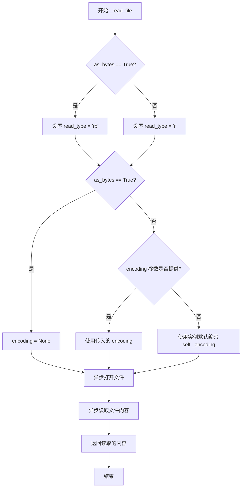

#### 带注释源码

```python
async def _read_file(
    self,
    path: str | Path,
    as_bytes: bool | None = False,
    encoding: str | None = None,
) -> Any:
    """Read the contents of a file."""
    # 根据 as_bytes 参数确定文件打开模式
    # 二进制模式使用 'rb'，文本模式使用 'r'
    read_type = "rb" if as_bytes else "r"
    
    # 如果是二进制模式，encoding 必须为 None
    # 如果是文本模式，使用传入的 encoding 或实例默认编码
    encoding = None if as_bytes else (encoding or self._encoding)

    # 使用 aiofiles 异步打开文件
    # cast("Any", read_type) 用于类型断言，aiofiles 支持这两种模式
    async with aiofiles.open(
        path,
        cast("Any", read_type),
        encoding=encoding,
    ) as f:
        # 异步读取并返回文件内容
        return await f.read()
```


### `FileStorage.set`

该方法是一个异步方法，用于将值写入到指定的键（文件名）对应的文件中，支持字节和字符串两种数据类型的写入，并根据数据类型自动选择合适的写入模式和编码。

参数：

- `key`：`str`，要写入的文件键名（相对于基础目录的路径）
- `value`：`Any`，要写入的值，支持字节（bytes）或字符串类型
- `encoding`：`str | None`，可选参数，字符串写入时的编码格式，默认为 `None`（使用实例的默认编码）

返回值：`None`，该方法不返回任何值

#### 流程图

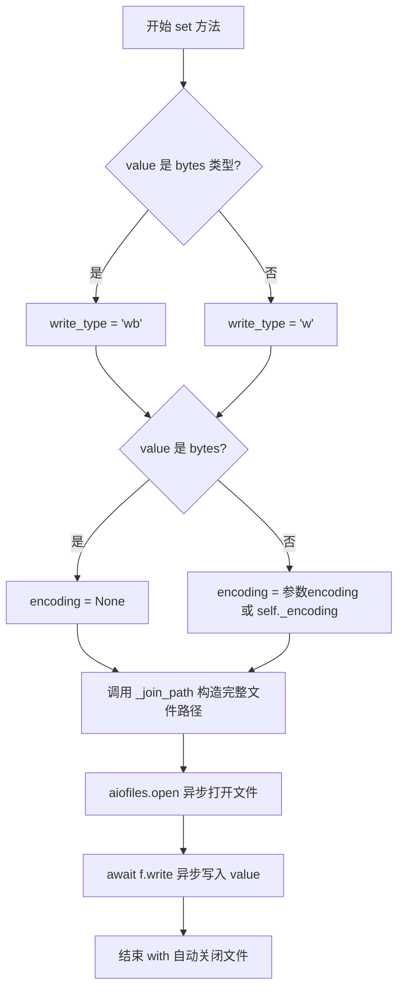

#### 带注释源码

```python
async def set(self, key: str, value: Any, encoding: str | None = None) -> None:
    """Set method definition."""
    # 判断写入的值是否为字节类型
    is_bytes = isinstance(value, bytes)
    # 根据数据类型选择写入模式：'wb' 表示二进制写入，'w' 表示文本写入
    write_type = "wb" if is_bytes else "w"
    # 如果是字节类型，encoding 设为 None；否则使用传入的 encoding 或实例默认编码
    encoding = None if is_bytes else encoding or self._encoding
    # 异步打开文件进行写入
    async with aiofiles.open(
        _join_path(self._base_dir, key),  # 构造完整的文件路径
        cast("Any", write_type),           # 传入写入模式
        encoding=encoding,                # 设置编码
    ) as f:
        # 异步写入值到文件
        await f.write(value)
```


### `FileStorage.has`

检查指定键对应的文件是否存在于存储中。

参数：

- `key`：`str`，要检查存在的文件键（文件名）

返回值：`bool`，如果文件存在返回 `True`，否则返回 `False`

#### 流程图

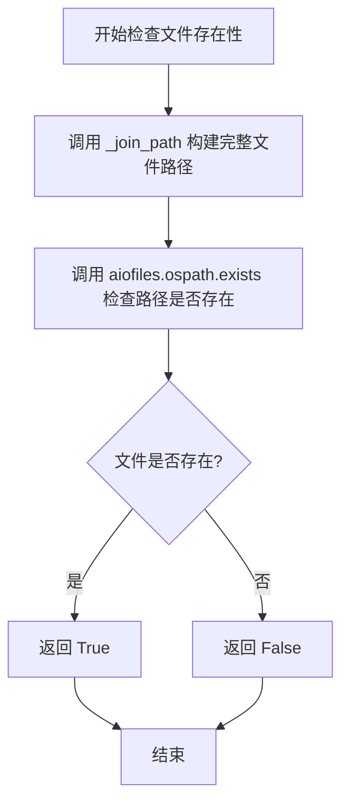

#### 带注释源码

```python
async def has(self, key: str) -> bool:
    """Has method definition."""
    # 使用 _join_path 方法将 base_dir 和 key 组合成完整的文件路径
    # _join_path 会处理路径分隔符和相对路径问题
    full_path = _join_path(self._base_dir, key)
    
    # 调用 aiofiles.ospath.exists 异步检查文件是否存在
    # exists 是一个异步函数，会检查路径指向的文件或目录是否存在
    return await exists(full_path)
```


### `FileStorage.delete`

异步删除文件方法，用于从文件存储中删除指定键对应的文件。

参数：

- `key`：`str`，要删除的文件键（文件标识符）

返回值：`None`，无返回值

#### 流程图

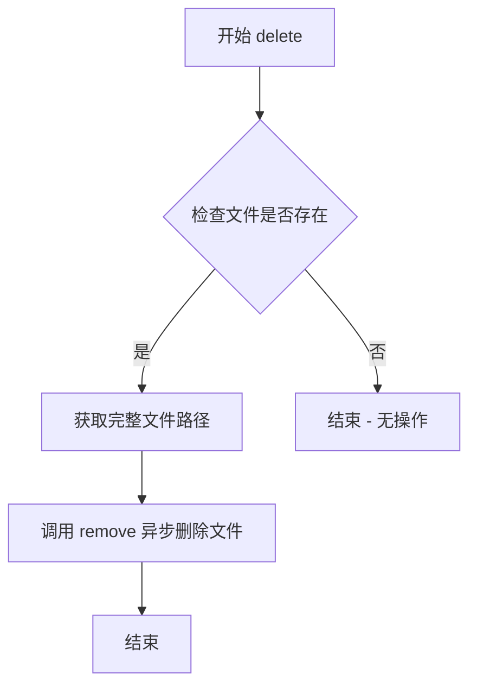

#### 带注释源码

```python
async def delete(self, key: str) -> None:
    """Delete method definition."""
    # 检查指定键对应的文件是否存在于存储中
    if await self.has(key):
        # 如果文件存在，获取完整路径并异步删除文件
        # 使用 aiofiles.os.remove 进行异步文件系统操作
        await remove(_join_path(self._base_dir, key))
```


### `FileStorage.clear`

清空存储目录方法，用于删除基础目录下的所有文件和子目录，但保留基础目录本身。

参数：

- （无参数）

返回值：`None`，表示该方法执行完成后不返回任何值

#### 流程图

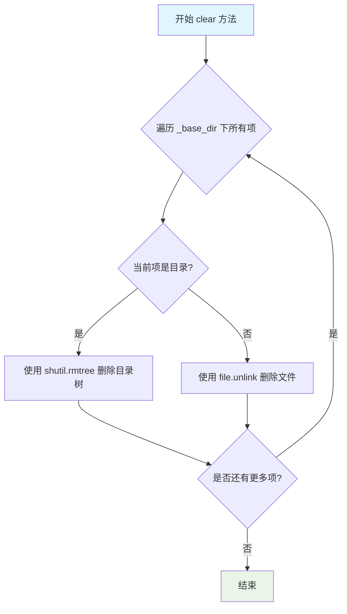

#### 带注释源码

```python
async def clear(self) -> None:
    """Clear method definition."""
    # 使用 glob("*") 获取基础目录下的所有直接子项（不递归）
    for file in self._base_dir.glob("*"):
        # 判断当前项是否为目录
        if file.is_dir():
            # 如果是目录，使用 shutil.rmtree 递归删除整个目录树
            shutil.rmtree(file)
        else:
            # 如果是文件，使用 unlink 方法删除文件
            file.unlink()
```


### `FileStorage.child`

创建子存储实例，用于在当前存储目录下创建嵌套的子存储空间。

参数：

- `name`：`str | None`，子存储的名称。如果为 None，则返回当前存储实例本身

返回值：`Storage`，返回一个新的子存储实例或当前实例（当 name 为 None 时）

#### 流程图

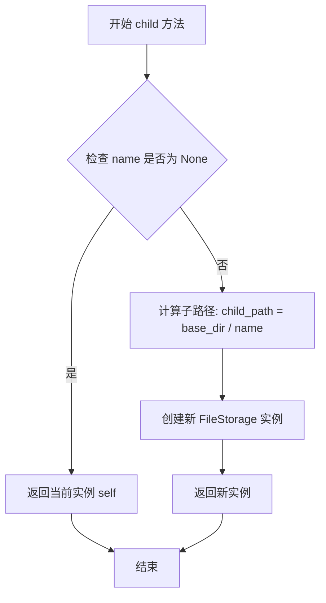

#### 带注释源码

```python
def child(self, name: str | None) -> "Storage":
    """Create a child storage instance.
    
    创建一个子存储实例。如果 name 为 None，则返回当前存储实例；
    否则创建一个新的 FileStorage 实例，其基础目录为当前目录的子目录。
    
    参数:
        name: 子存储的名称
        
    返回:
        存储实例（新创建的子存储或当前实例）
    """
    # 如果名称为空，返回当前实例本身
    if name is None:
        return self
    
    # 拼接子目录路径：当前基础目录 / 子目录名称
    child_path = str(self._base_dir / name)
    
    # 创建新的 FileStorage 实例，继承相同的编码设置
    return FileStorage(base_dir=child_path, encoding=self._encoding)
```


### `FileStorage.keys`

获取存储中所有文件的键名列表

参数：

- （无参数）

返回值：`list[str]`，返回存储目录中所有文件（不含目录）的名称列表

#### 流程图

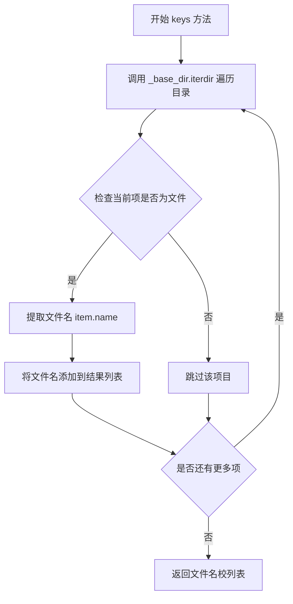

#### 带注释源码

```python
def keys(self) -> list[str]:
    """Return the keys in the storage."""
    # 使用列表推导式遍历基础目录下的所有直接子项
    # iterdir() 返回目录中所有文件和子目录的迭代器
    # is_file() 过滤出仅包含文件的项目，排除目录
    # item.name 获取文件的名称（不含路径）
    return [item.name for item in self._base_dir.iterdir() if item.is_file()]
```


### `FileStorage.get_creation_date`

获取指定键（文件名）的文件创建时间，并将其转换为带本地时区信息的格式化时间字符串。

参数：

- `key`：`str`，文件在存储中的键名（文件名）

返回值：`str`，文件创建时间，格式为带本地时区的字符串（如 "2024-01-15 10:30:00+08:00"）

#### 流程图

```mermaid
flowchart TD
    A[开始] --> B[调用 _join_path 获取文件完整路径]
    B --> C[使用 file_path.stat() 获取文件元数据]
    C --> D[提取 st_ctime 创建时间戳]
    D --> E[datetime.fromtimestamp 转换为 UTC 时区时间]
    E --> F[调用 get_timestamp_formatted_with_local_tz 格式化为本地时区]
    F --> G[返回格式化的时间字符串]
```

#### 带注释源码

```python
async def get_creation_date(self, key: str) -> str:
    """Get the creation date of a file.
    
    通过文件键名获取文件的创建时间，并返回格式化为本地时区的时间字符串。
    
    Args:
        key: 文件在存储中的键名（文件名）
    
    Returns:
        str: 文件创建时间，格式为带本地时区的字符串
    """
    # 调用内部函数 _join_path 将 base_dir 和 key 组合成完整的文件路径
    file_path = _join_path(self._base_dir, key)

    # 使用 pathlib 的 stat() 方法获取文件元数据，st_ctime 是文件的创建时间戳
    # 注意：在不同操作系统中，st_ctime 的含义可能不同（Unix系为元数据修改时间，Windows为创建时间）
    creation_timestamp = file_path.stat().st_ctime
    
    # 将时间戳转换为 datetime 对象，并指定为 UTC 时区
    creation_time_utc = datetime.fromtimestamp(creation_timestamp, tz=timezone.utc)

    # 调用工具函数将 UTC 时间转换为本地时区并格式化为字符串返回
    return get_timestamp_formatted_with_local_tz(creation_time_utc)
```


### `FileStorage.get_path`

获取给定键（文件名）的完整文件路径，用于流式访问文件。

参数：

- `key`：`str`，文件键名/文件名

返回值：`Path`，文件的完整路径对象

#### 流程图

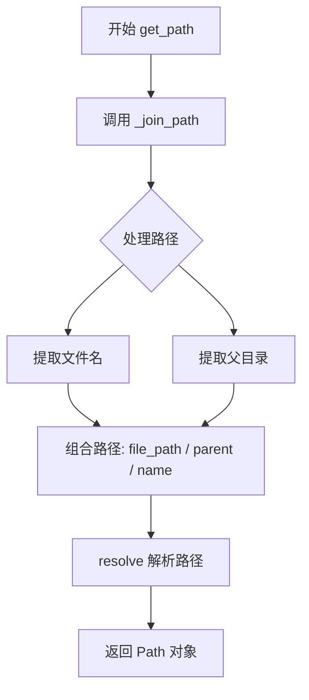

#### 带注释源码

```python
def get_path(self, key: str) -> Path:
    """Get the full file path for a key (for streaming access).
    
    Args:
        key: 文件键名/文件名
        
    Returns:
        Path: 文件的完整路径对象
    """
    # 调用内部函数 _join_path 将基础目录与文件名连接
    return _join_path(self._base_dir, key)
```

---

### 辅助函数 `_join_path`

此函数为模块级辅助函数，用于跨平台拼接路径。

参数：

- `file_path`：`Path`，基础目录路径
- `file_name`：`str`，要连接的文件名

返回值：`Path`，解析后的完整路径

#### 流程图

```mermaid
flowchart TD
    A[开始 _join_path] --> B[Path(file_name).parent 获取父目录]
    B --> C[Path(file_name).name 获取文件名]
    D[file_path 作为基础路径] --> E[组合: file_path / parent / name]
    C --> E
    B --> E
    E --> F[resolve 解析为绝对路径]
    F --> G[返回 Path 对象]
```

#### 带注释源码

```python
def _join_path(file_path: Path, file_name: str) -> Path:
    """Join a path and a file. Independent of the OS.
    
    Args:
        file_path: 基础目录路径
        file_name: 要连接的文件名
        
    Returns:
        Path: 解析后的完整路径
    """
    # 使用 Path 对象的方法进行跨平台路径拼接
    # 1. Path(file_name).parent 获取文件名的父目录部分
    # 2. Path(file_name).name 获取文件名本身（不含父目录）
    # 3. 通过 / 操作符组合: base_dir / parent / name
    # 4. resolve() 解析为绝对路径并规范化
    return (file_path / Path(file_name).parent / Path(file_name).name).resolve()
```

## 关键组件


### FileStorage 类

基于文件系统的存储实现，提供异步文件读写、查找、删除等操作，支持子目录管理和多种编码格式。

### 文件查找组件 (find 方法)

使用正则表达式模式匹配递归搜索存储目录下的所有文件，支持 glob 通配符查找并返回相对路径。

### 异步文件读写组件 (get/set 方法)

支持字节和文本两种模式读取/写入，通过 aiofiles 库实现非阻塞 IO 操作，可指定文件编码。

### 文件存在性检查组件 (has 方法)

异步检查指定键对应的文件是否存在于存储目录中。

### 文件删除与清空组件 (delete/clear 方法)

支持单文件删除和清空整个存储目录（递归删除子目录），使用异步操作避免阻塞。

### 子存储创建组件 (child 方法)

支持创建子目录级别的存储实例，实现存储的层级划分和隔离。

### 路径处理组件 (_join_path 全局函数)

平台无关的路径拼接函数，处理文件路径和文件名的组合，返回解析后的绝对路径。

### 键值列表组件 (keys 方法)

返回存储目录中所有直接子文件的文件名列表，不包含子目录。

### 文件元数据组件 (get_creation_date/get_path 方法)

获取文件的创建时间戳并转换为本地时区格式，返回文件的完整路径用于流式访问。


## 问题及建议


### 已知问题

-   **内存效率问题**：`find` 方法使用 `list(self._base_dir.rglob("**/*"))` 将所有文件和目录一次性加载到内存中，对于大型目录树会导致内存溢出风险。
-   **类型注解不规范**：`get`、`_read_file`、`set` 方法中的 `as_bytes: bool | None = False` 应改为 `bool = False`，因为参数类型不应为 `None`。
-   **竞态条件风险**：`get_creation_date` 方法先通过 `has` 检查文件存在性，再调用 `stat()`，中间存在竞态条件（文件可能在检查后被删除），应直接捕获异常。
-   **路径解析潜在问题**：`_join_path` 函数使用 `.resolve()` 可能在某些文件系统（如网络挂载路径）上导致意外行为，且跨平台兼容性问题未考虑。
-   **编码处理冗余**：`set` 方法中 `encoding = None if is_bytes else encoding or self._encoding` 使用了 `or` 运算符，但 `encoding` 参数本身允许 `None`，逻辑不够清晰。
-   **异步方法缺少异常处理**：所有异步方法（`get`、`set`、`delete`、`clear` 等）均未进行 `try-except` 包装，文件操作异常会直接抛出给上层调用者。
-   **`keys()` 方法与 `find()` 方法不一致**：`keys()` 只返回顶层文件，而 `find()` 递归搜索，行为不统一；`keys()` 也没有异步版本，但其他方法都是异步的。

### 优化建议

-   **改进 `find` 方法**：使用生成器模式替代 `list()`，并在迭代时过滤掉目录项，只处理实际文件。
-   **修复类型注解**：将 `as_bytes: bool | None = False` 改为 `as_bytes: bool = False`，保持类型安全。
-   **添加异常处理**：为所有文件操作添加 `try-except` 捕获 `FileNotFoundError`、`PermissionError` 等异常，并记录日志。
-   **优化路径函数**：移除 `_join_path` 中的 `.resolve()` 调用，或提供选项控制是否需要绝对路径。
-   **统一编码逻辑**：在 `set` 和 `_read_file` 中明确区分 `None` 和空字符串的情况。
-   **添加 `keys()` 异步版本**：为保持 API 一致性，可添加 `async def keys()` 方法或提供同步/异步两版本。
-   **考虑性能优化**：在 `get_creation_date` 中直接调用 `stat()` 并捕获 `FileNotFoundError`，避免竞态条件。

## 其它


### 设计目标与约束

**设计目标**：为graphrag_storage提供一个基于本地文件系统的存储实现，支持异步文件读写、文件搜索、键值对管理等功能，用于在本地文件系统中持久化数据。

**设计约束**：
- 仅支持本地文件系统，不支持分布式存储或网络存储
- 文件路径受限于操作系统文件系统路径长度限制
- 异步操作依赖aiofiles库，必须在异步上下文中使用
- 编码默认为UTF-8，不支持多编码混合存储

### 错误处理与异常设计

**异常处理策略**：
- 文件不存在时，`get()`返回None而不是抛出异常
- `has()`方法使用`aiofiles.ospath.exists()`检查文件存在性
- `delete()`方法先检查文件是否存在再删除，避免删除不存在的文件时出错
- `get_creation_date()`调用`.stat()`时假设文件已存在，调用前应先用`has()`验证

**潜在异常**：
- 文件系统权限不足导致读写失败
- 磁盘空间不足导致写入失败
- 文件被锁定或并发访问冲突
- 无效的key导致路径遍历攻击风险（代码中通过Path处理进行了防护）

### 数据流与状态机

**数据写入流程**：
- 外部调用`set(key, value)` → 判断value类型(bytes/str) → 确定写入模式(wb/w) → 异步写入文件 → 返回None

**数据读取流程**：
- 外部调用`get(key)` → 检查文件是否存在 → 存在则调用`_read_file()`异步读取 → 返回内容或None

**文件搜索流程**：
- 外部调用`find(pattern)` → 使用`rglob`递归获取所有文件 → 正则匹配过滤 → yield符合条件的文件名

**状态管理**：
- 文件存储无复杂状态机，主要状态为文件的存在性（has/not has）
- `child()`方法创建子存储实例，形成目录树结构

### 外部依赖与接口契约

**外部依赖**：
- `aiofiles`：异步文件I/O操作
- `aiofiles.os.remove`：异步删除文件
- `aiofiles.ospath.exists`：异步检查文件存在性
- `graphrag_storage.storage`：基类Storage及工具函数

**接口契约**：
- 实现`Storage`抽象基类
- 必须实现的方法：find, get, set, has, delete, clear, child, keys
- 异步方法：get, set, has, delete, clear, get_creation_date
- 同步方法：find, child, keys, get_path

### 性能考虑与优化建议

**当前实现特点**：
- 使用异步I/O提高并发性能
- `find()`方法中`list(self._base_dir.rglob("**/*"))`会一次性加载所有文件到内存，大目录可能导致性能问题
- `clear()`方法同步删除文件，未使用异步删除

**优化建议**：
- `find()`方法可考虑使用生成器模式避免一次性加载所有文件
- `clear()`方法可改为异步删除
- 可添加缓存层减少频繁的文件系统访问
- 大文件读取建议使用流式处理而非一次性加载

### 安全性考虑

**路径安全**：
- `_join_path()`方法使用`Path`处理路径，防止路径遍历攻击
- 文件名通过Path规范化处理，移除潜在的路径遍历字符

**数据安全**：
- 支持二进制和文本两种存储模式
- 文件编码可配置，默认UTF-8

### 测试建议

**单元测试覆盖点**：
- 各种编码格式的文件读写
- 二进制与文本混合存储
- 子存储(child)的创建和使用
- 文件不存在、权限错误等异常场景
- 大目录下的find性能

**集成测试考虑**：
- 与Storage基类的兼容性测试
- 多实例并发访问测试
- 跨平台路径处理测试


    