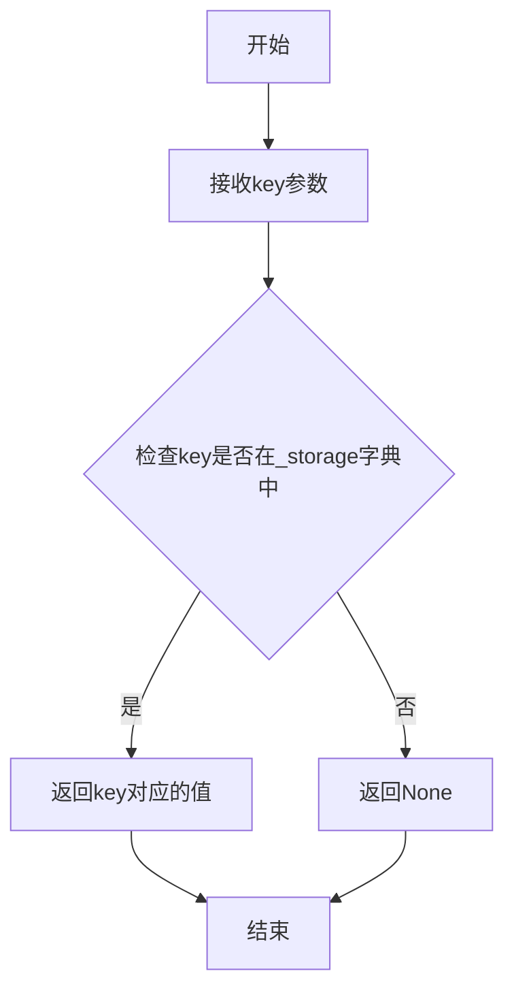
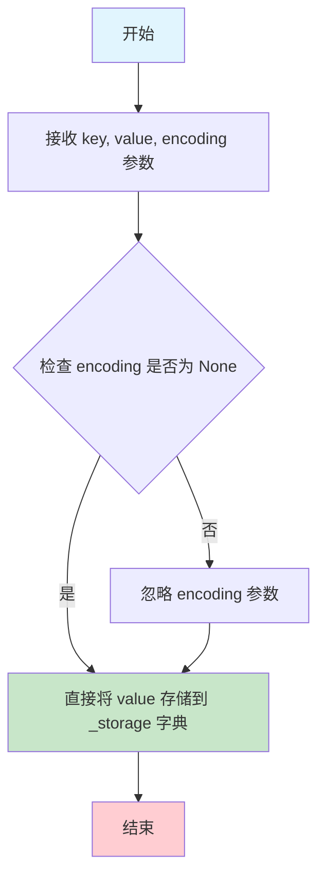
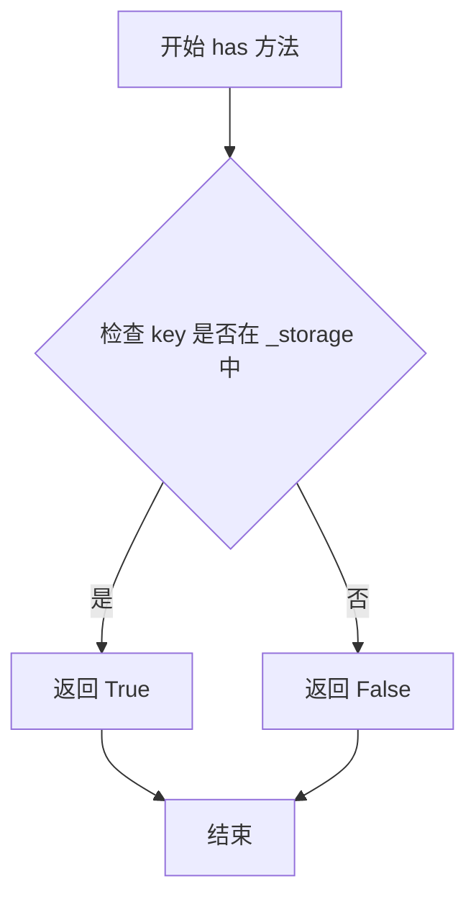
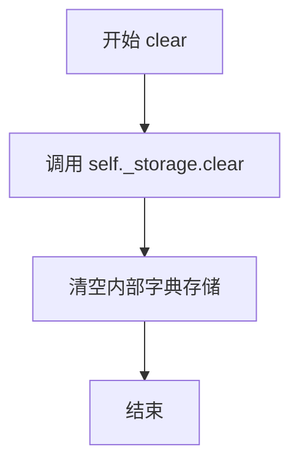
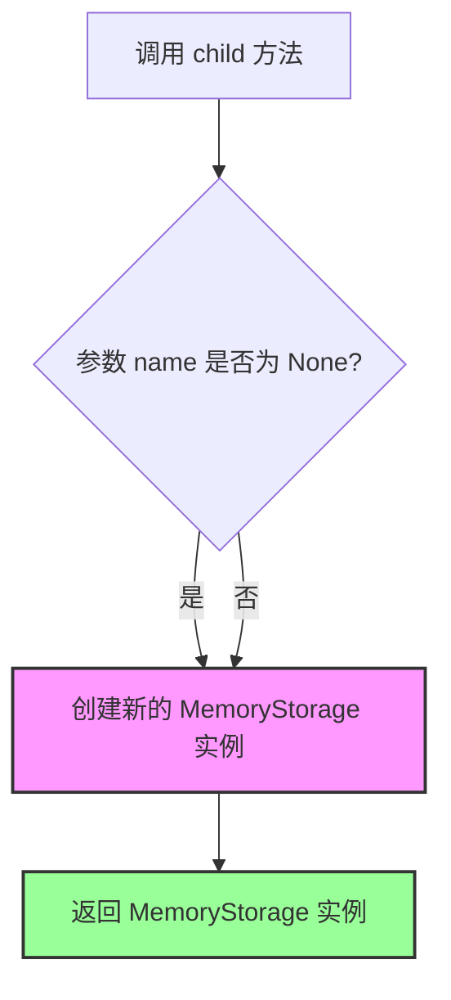
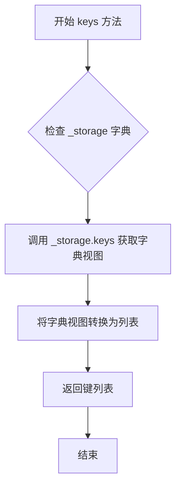
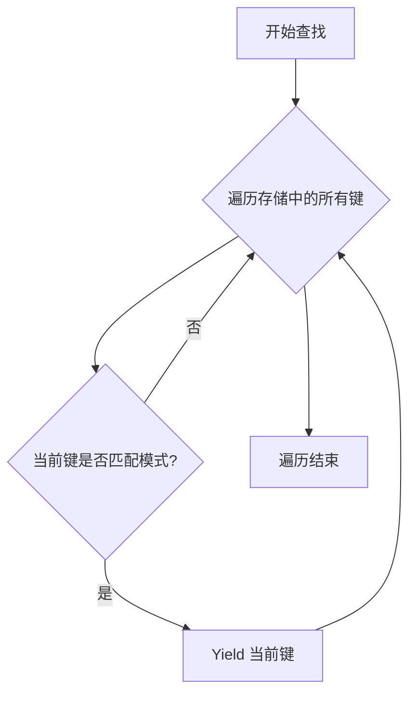

# `graphrag\packages\graphrag-storage\graphrag_storage\memory_storage.py` 详细设计文档

MemoryStorage是一个内存中的键值存储实现类，继承自FileStorage，提供基于字典的CRUD操作（获取、设置、删除、清除）、键查找、模式匹配和子存储实例创建等功能，用于在运行时临时存储和管理数据。

## 整体流程

```mermaid
graph TD
    A[初始化 MemoryStorage] --> B[设置 base_dir 为空字符串]
    B --> C[初始化 _storage 为空字典]
    D[get 方法] --> E{key 存在于 _storage?}
    E -- 是 --> F[返回对应的值]
    E -- 否 --> G[返回 None]
    H[set 方法] --> I[_storage[key] = value]
    J[has 方法] --> K{key in _storage}
    K -- 是 --> L[返回 True]
    K -- 否 --> M[返回 False]
    N[delete 方法] --> O[del _storage[key]]
    P[clear 方法] --> Q[_storage.clear()]
    R[keys 方法] --> S[返回 list(_storage.keys())]
    T[find 方法] --> U[遍历 _storage]
    U --> V{file_pattern.search(key)?}
    V -- 是 --> W[yield key]
    V -- 否 --> X[继续下一个key]
    Y[child 方法] --> Z[返回新的 MemoryStorage 实例]
```

## 类结构

```
FileStorage (基类)
└── MemoryStorage (内存存储实现)
```

## 全局变量及字段


### `re`
    
正则表达式模块，用于模式匹配

类型：`module`
    


### `Iterator`
    
来自collections.abc的迭代器类型

类型：`typing.Iterator`
    


### `TYPE_CHECKING`
    
typing模块的条件导入标识

类型：`bool`
    


### `Any`
    
typing模块的任意类型

类型：`typing.Any`
    


### `FileStorage`
    
从graphrag_storage.file_storage导入的基类

类型：`class`
    


### `Storage`
    
从graphrag_storage.storage导入的类型提示

类型：`typing.Type`
    


### `MemoryStorage._storage`
    
存储键值对的内部字典

类型：`dict[str, Any]`
    
    

## 全局函数及方法


### `MemoryStorage.__init__`

初始化方法，设置 base_dir 为空字符串，清除 kwargs 中的 type 参数，并初始化内部存储字典。

参数：

- `**kwargs`：`Any`，可变关键字参数，用于传递父类 FileStorage 的配置选项

返回值：`None`，无返回值（初始化方法）

#### 流程图

```mermaid
flowchart TD
    A[开始 __init__] --> B[创建 kwargs 字典<br/>base_dir: '' + 展开kwargs]
    B --> C[从 kwargs 中移除 type 参数]
    C --> D[调用 super().__init__**kwargs<br/>初始化父类 FileStorage]
    D --> E[初始化 self._storage = {}<br/>创建空字典作为内存存储]
    E --> F[结束]
```

#### 带注释源码

```python
def __init__(self, **kwargs: Any) -> None:
    """Init method definition."""
    # 1. 构建 kwargs 字典，设置 base_dir 为空字符串
    #    并展开传入的所有关键字参数
    kwargs = {
        "base_dir": "",
        **kwargs,
    }
    # 2. 从 kwargs 中移除 'type' 参数（如果存在）
    #    避免传递给父类造成混淆
    kwargs.pop("type", None)
    # 3. 调用父类 FileStorage 的初始化方法
    super().__init__(**kwargs)
    # 4. 初始化内存存储字典，用于在内存中存储键值对
    self._storage = {}
```


### `MemoryStorage.get`

异步获取指定key的值，从内存存储中返回给定键关联的数据。

参数：

- `self`：隐式参数，MemoryStorage实例
- `key`：`str`，要获取值的键
- `as_bytes`：`bool | None`，是否以字节形式返回值（当前未使用）
- `encoding`：`str | None`，编码方式（当前未使用）

返回值：`Any`，给定键对应的值，如果键不存在则返回`None`

#### 流程图



#### 带注释源码

```python
async def get(
    self, key: str, as_bytes: bool | None = None, encoding: str | None = None
) -> Any:
    """Get the value for the given key.

    Args:
        - key - The key to get the value for.
        - as_bytes - Whether or not to return the value as bytes.

    Returns
    -------
        - output - The value for the given key.
    """
    # 使用字典的get方法安全地获取值
    # 如果key不存在，返回None而不抛出异常
    return self._storage.get(key)
```


### `MemoryStorage.set`

异步设置键值对，将指定的值存储到内存存储的内部字典中，支持可选的编码参数（当前实现中未使用编码参数）。

参数：

- `key`：`str`，要设置的键名
- `value`：`Any`，要存储的值
- `encoding`：`str | None`，可选的编码参数（当前实现中未使用）

返回值：`None`，无返回值

#### 流程图



#### 带注释源码

```python
async def set(self, key: str, value: Any, encoding: str | None = None) -> None:
    """Set the value for the given key.

    Args:
        - key: The key to set the value for.
        - value: The value to set.
        - encoding: Optional encoding parameter (currently unused in implementation).
    """
    # 将值存储到内部的字典中，key 作为键
    # 此操作会覆盖已存在的同名键
    self._storage[key] = value
```


### `MemoryStorage.has`

异步检查key是否存在于内存存储中

参数：

- `key`：`str`，要检查是否存在的键

返回值：`bool`，如果键存在于存储中返回True，否则返回False

#### 流程图



#### 带注释源码

```python
async def has(self, key: str) -> bool:
    """Return True if the given key exists in the storage.

    Args:
        - key: The key to check for.

    Returns
    -------
        - output: True if the key exists in the storage, False otherwise.
    """
    # 使用 Python 的 in 操作符检查 key 是否在字典的键中
    return key in self._storage
```


### `MemoryStorage.delete`

异步删除存储中指定 key 的值。

参数：

- `key`：`str`，要删除的键

返回值：`None`，无返回值

#### 流程图

```mermaid
flowchart TD
    A[开始 delete] --> B{检查 key 是否存在}
    B -->|存在| C[执行 del self._storage[key]]
    B -->|不存在| D[抛出 KeyError 异常]
    C --> E[结束]
    D --> E
```

#### 带注释源码

```python
async def delete(self, key: str) -> None:
    """Delete the given key from the storage.

    Args:
        - key - The key to delete.
    """
    # 从内部字典中删除指定键对应的值
    # 如果键不存在，会抛出 KeyError 异常
    del self._storage[key]
```


### `MemoryStorage.clear`

异步清空内存存储中的所有数据，将内部字典存储重置为空。

参数： 无

返回值：`None`，无返回值描述

#### 流程图



#### 带注释源码

```python
async def clear(self) -> None:
    """Clear the storage."""
    # 调用字典的clear方法清空整个存储
    self._storage.clear()
```


### `MemoryStorage.child`

创建并返回一个新的 MemoryStorage 子实例，用于支持存储层级结构（尽管当前实现忽略了名称参数）。

参数：

- `name`：`str | None`，可选的子存储实例名称，用于标识子存储（但在当前实现中未使用）

返回值：`Storage`，返回新创建的 MemoryStorage 实例

#### 流程图



#### 带注释源码

```python
def child(self, name: str | None) -> "Storage":
    """Create a child storage instance.
    
    创建一个子存储实例。注意：当前实现忽略 name 参数，
    始终返回一个新的独立 MemoryStorage 实例。
    
    Args:
        name: 子存储的名称（当前未使用）
        
    Returns:
        Storage: 新的 MemoryStorage 实例
    """
    return MemoryStorage()
```


### `MemoryStorage.keys`

返回存储中所有键的列表，用于遍历或检查存储中存在的所有数据项。

参数：

- `self`：无，类实例本身

返回值：`list[str]`，返回包含存储中所有键的字符串列表

#### 流程图



#### 带注释源码

```python
def keys(self) -> list[str]:
    """Return the keys in the storage.
    
    返回存储中所有键的列表。
    
    Returns
    -------
        list[str]
            包含所有存储键的列表
    """
    return list(self._storage.keys())
```


### `MemoryStorage.find`

查找内存存储中与给定正则表达式模式匹配的键。

参数：

- `file_pattern`：`re.Pattern[str]`，用于匹配键的正则表达式模式

返回值：`Iterator[str]`，匹配模式的键的迭代器

#### 流程图



#### 带注释源码

```python
def find(self, file_pattern: re.Pattern[str]) -> Iterator[str]:
    """Find keys in memory storage matching the given pattern.

    Args
    ----
        file_pattern: re.Pattern[str]
            Regular expression pattern to match against keys.

    Yields
    ------
        str:
            Keys that match the pattern.
    """
    # 遍历内存存储中的所有键
    for key in self._storage:
        # 使用正则表达式的search方法检查键是否匹配模式
        if file_pattern.search(key):
            # 如果匹配，则生成（yield）该键
            yield key
```

## 关键组件


### MemoryStorage 类

内存存储类的核心实现，继承自 FileStorage，提供基于 Python 字典的内存键值存储功能，支持异步操作。

### _storage 字典

用于存储所有键值对的内部数据结构，类型为 dict[str, Any]，是整个存储系统的核心数据容器。

### get 方法

异步获取方法，根据键名返回对应的值，支持 as_bytes 和 encoding 参数（当前实现未使用这些参数）。

### set 方法

异步设置方法，将键值对存储到内部字典中，支持指定编码（当前实现未使用 encoding 参数）。

### has 方法

异步检查方法，判断指定键是否存在于存储中，返回布尔值。

### delete 方法

异步删除方法，从存储中移除指定的键值对。

### clear 方法

异步清空方法，移除存储中的所有键值对。

### child 方法

创建子存储实例方法，返回新的 MemoryStorage 实例，用于支持存储层级结构。

### keys 方法

同步方法，返回存储中所有键的列表。

### find 方法

基于正则表达式的键查找方法，通过 re.Pattern[str] 模式匹配存储中的键，支持灵活的键搜索功能。


## 问题及建议


### 已知问题

-   **child 方法未使用 name 参数**：方法接收 `name` 参数但完全未使用，返回一个全新的 `MemoryStorage()` 实例而不是创建带有适当命名空间或 base_dir 的子存储，导致无法实现存储层级结构。
-   **get 方法参数未使用**：`as_bytes` 和 `encoding` 参数被定义但在方法体中完全未使用，无法按需返回 bytes 或解码内容，违背了接口设计意图。
-   **set 方法 encoding 参数未使用**：`encoding` 参数定义后未在实现中使用，无法对存储的值进行编码处理。
- **并发安全问题**：使用普通 `dict` 存储数据，在多线程或并发 async 访问时非线程安全，可能导致数据竞争和状态不一致。
- **异常处理不足**：`delete` 方法在 key 不存在时会抛出 `KeyError` 异常，缺乏对边界条件的优雅处理。
- **缺少持久化机制**：虽然继承自 `FileStorage`，但未实现任何数据持久化逻辑，进程终止后数据完全丢失，不符合存储接口的预期行为。

### 优化建议

-   **实现 child 方法**：根据 name 参数创建带有命名空间前缀的子存储实例，例如使用 `name` 作为 key 前缀或创建独立的子字典。
-   **完善 get 方法**：实现 `as_bytes` 和 `encoding` 参数的功能，当 `as_bytes=True` 时返回 bytes 格式，当提供 `encoding` 时对字符串值进行解码。
-   **添加并发控制**：使用 `asyncio.Lock` 或在 `_storage` 上使用线程安全的数据结构（如 `threading.RLock`）来保证并发安全。
-   **改进异常处理**：在 `delete` 方法中先检查 key 是否存在，使用 `self._storage.pop(key, None)` 或 `discard` 方法避免异常。
-   **添加持久化支持**：实现父类要求的持久化方法，如 `save`/`load` 或在 `__init__`/`__del__` 中处理数据序列化。
-   **增强类型标注**：考虑将 `_storage` 的类型从 `dict[str, Any]` 改为更具体的泛型类型，以提升类型安全性。

## 其它


### 设计目标与约束

该MemoryStorage类旨在提供一个轻量级的内存键值存储实现，作为graphrag_storage的底层存储抽象。设计目标包括：1）实现基本的CRUD操作；2）支持子存储实例创建；3）提供正则表达式模式匹配查询能力。约束条件：不支持持久化，数据仅在进程生命周期内有效，不支持分布式场景。

### 错误处理与异常设计

该类的错误处理较为简单，主要通过Python内置异常机制实现。get方法若key不存在返回None而非抛出异常；delete方法若key不存在会抛出KeyError；set方法不支持则抛出相应异常。建议增加更完善的异常类型定义，如StorageKeyNotFoundError、StorageFullError等，并提供统一的错误码体系。

### 并发与线程安全性

当前实现基于Python字典的异步方法，但未实现任何锁机制。在高并发场景下，多个协程同时访问_storage字典可能导致数据竞争问题。建议引入asyncio.Lock或threading.Lock来保护共享状态，确保并发安全。

### 外部依赖与接口契约

该类依赖graphrag_storage.file_storage.FileStorage基类和typing模块。实现了Storage接口约定：get/set/has/delete/clear/keys/find/child方法。as_bytes和encoding参数在当前实现中未被使用但保留用于接口兼容性，体现了对扩展性的考虑。

### 性能考虑与资源管理

内存存储的性能优势在于无I/O开销，但需注意：1）_storage字典会随着数据增长持续消耗内存；2）keys()方法返回完整列表，大数据量时有性能影响；3）find()方法采用线性扫描，无索引优化。建议添加容量限制机制和内存监控接口。

### 容量规划与使用建议

建议文档明确说明：1）适用于小规模临时数据或测试场景；2）大规模数据存储应使用磁盘持久化实现；3）单个实例的key数量建议控制在合理范围内（如不超过10万条）。

### 序列化与反序列化

当前实现使用Python对象直接存储，as_bytes和encoding参数未被实际使用。如需支持字节流存储或跨进程共享，需实现相应的序列化逻辑。ValueError可用于参数校验。

### 测试策略建议

建议包含以下测试用例：1）基本CRUD操作功能测试；2）并发访问压力测试；3）边界条件测试（空key、空value、大量数据）；4）find方法正则匹配测试；5）child方法隔离性测试。

### 监控与可观测性

建议增加存储指标暴露接口，包括：1）当前存储条目数量；2）内存占用估算；3）操作计数统计。便于运行时监控和性能调优。

### 使用示例

提供典型使用场景代码示例，包括：初始化、基础读写、模式匹配查询、子存储创建等操作流程。

    