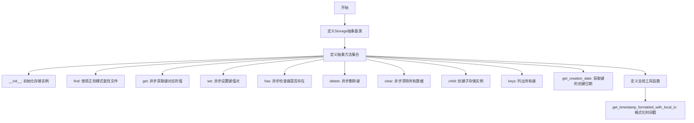
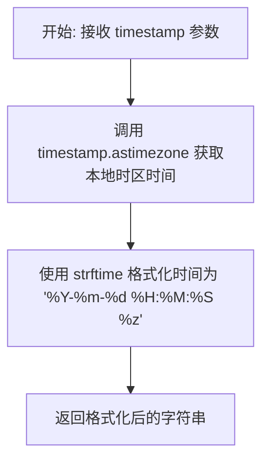
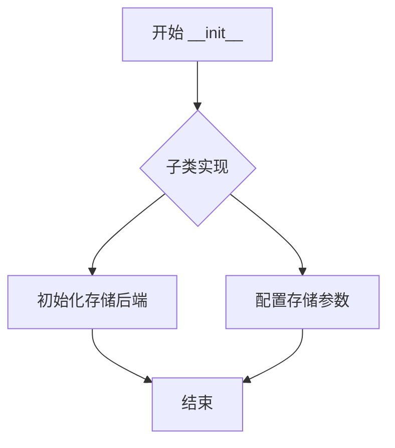
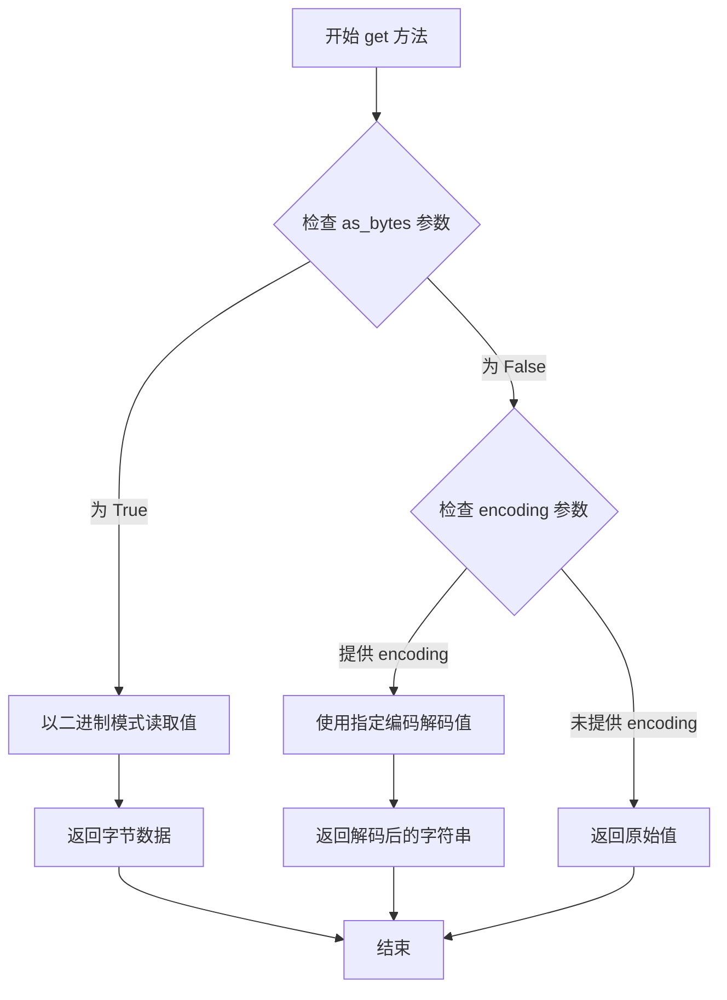
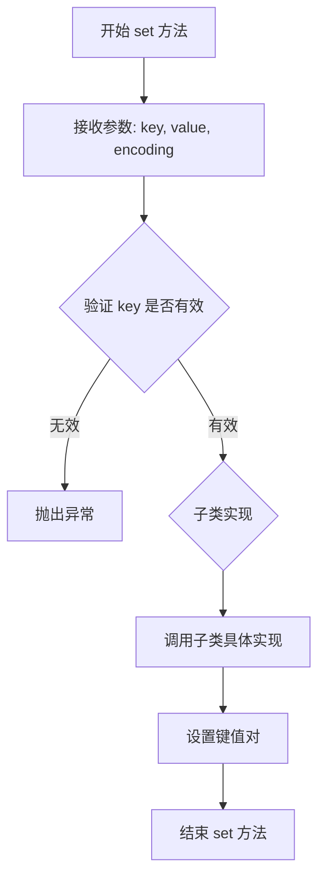
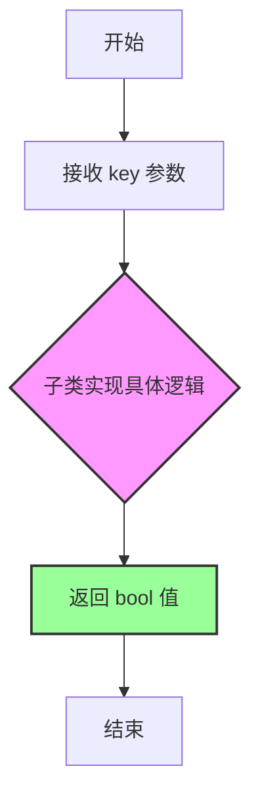
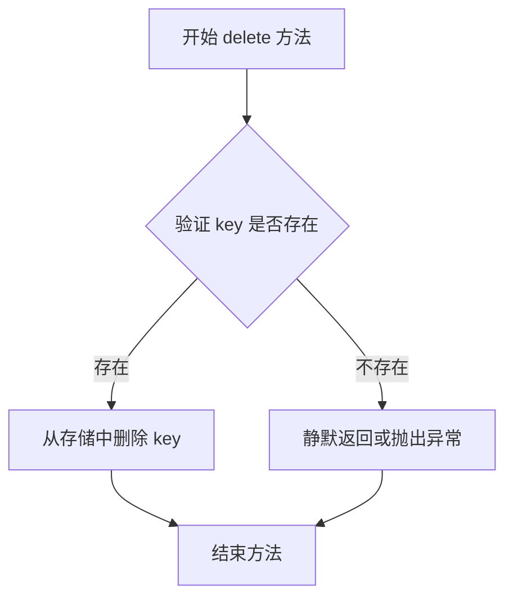
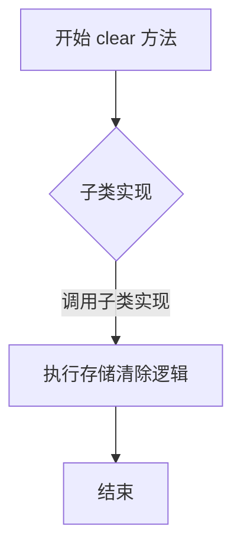
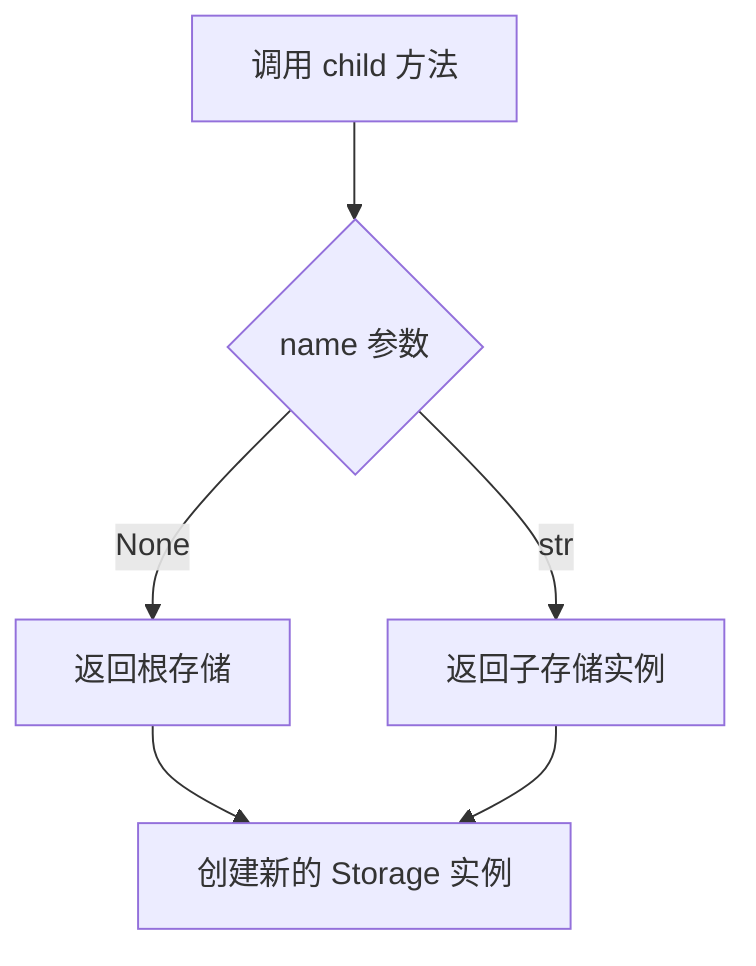
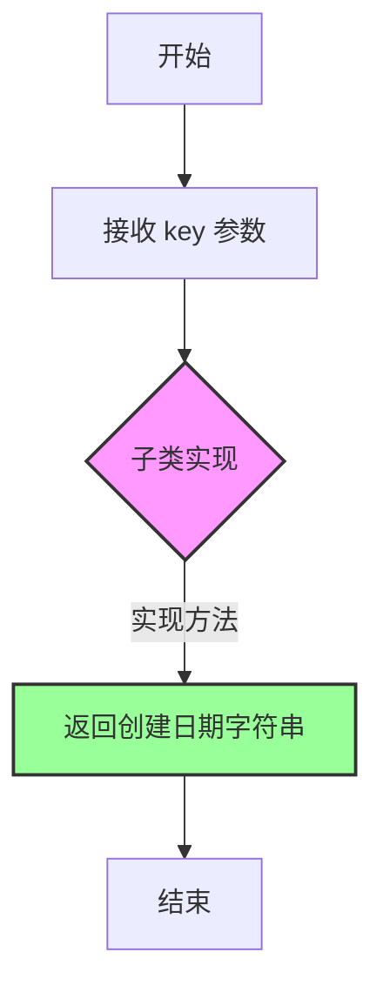

# `graphrag\packages\graphrag-storage\graphrag_storage\storage.py` 详细设计文档

这是一个存储抽象基类（Storage ABC），定义了存储接口的抽象方法，包括文件的查找、键值对的获取、设置、删除、清除操作，以及子存储实例的创建和键的创建日期查询。该模块为具体的存储实现提供了统一的接口规范。

## 整体流程



## 类结构

```
Storage (抽象基类)
├── __init__ (抽象方法)
├── find (抽象方法)
├── get (抽象方法 - 异步)
├── set (抽象方法 - 异步)
├── has (抽象方法 - 异步)
├── delete (抽象方法 - 异步)
├── clear (抽象方法 - 异步)
├── child (抽象方法)
├── keys (抽象方法)
├── get_creation_date (抽象方法 - 异步)
└── get_timestamp_formatted_with_local_tz (全局工具函数)
```

## 全局变量及字段


### `get_timestamp_formatted_with_local_tz`
    
将时间戳格式化为带本地时区的字符串，格式为 YYYY-MM-DD HH:MM:SS ±HHMM

类型：`Callable[[datetime], str]`
    


    

## 全局函数及方法


### `get_timestamp_formatted_with_local_tz`

获取格式化的时间戳字符串，该函数将传入的 datetime 对象转换为本地时区，并格式化为指定的字符串格式。

参数：

- `timestamp`：`datetime`，要格式化的时间戳对象

返回值：`str`，格式化后的时间戳字符串，格式为 "YYYY-MM-DD HH:MM:SS ±HHMM"

#### 流程图



#### 带注释源码

```python
def get_timestamp_formatted_with_local_tz(timestamp: datetime) -> str:
    """Get the formatted timestamp with the local time zone.
    
    将传入的 datetime 对象转换为本地时区，并格式化为可读的时间字符串。
    
    Args:
        timestamp: datetime - 要格式化的 UTC 时间戳对象
        
    Returns:
        str - 格式化后的时间字符串，格式为 "YYYY-MM-DD HH:MM:SS +HHMM"
    """
    # 使用 astimezone() 方法将时间戳转换为本地时区
    # 如果 timestamp 已经是带时区的 datetime，此操作会转换到系统本地时区
    # 如果 timestamp 是 naive datetime（无时区信息），此操作会将其视为本地时间
    creation_time_local = timestamp.astimezone()

    # 使用 strftime 格式化时间
    # %Y - 4位年份
    # %m - 2位月份
    # %d - 2位日期
    # %H - 24小时制小时
    # %M - 分钟
    # %S - 秒
    # %z - 时区偏移量（如 +0800 或 -0500）
    return creation_time_local.strftime("%Y-%m-%d %H:%M:%S %z")
```


### `Storage.__init__`

创建存储实例的抽象方法，由子类实现。

参数：

- `**kwargs`：`Any`，可变关键字参数，用于传递存储初始化所需的配置参数

返回值：`None`，无返回值（构造函数）

#### 流程图



#### 带注释源码

```python
@abstractmethod
def __init__(self, **kwargs: Any) -> None:
    """Create a storage instance.
    
    抽象方法，定义存储实例的基本接口。
    子类需要实现此方法以初始化具体的存储后端。
    
    Args:
        **kwargs: 可变关键字参数，用于传递存储初始化所需的配置参数
                 例如：连接字符串、路径、认证信息等
        
    Returns:
        None: __init__ 方法不返回值
    
    Note:
        - 此方法为抽象方法，具体实现由子类完成
        - 子类应该调用父类 __init__ 并传递必要参数
        - 应确保初始化失败时抛出适当的异常
    """
```


### `Storage.find`

查找使用指定文件模式匹配的文件，并返回一个迭代器。

参数：

- `file_pattern`：`re.Pattern[str]`，用于匹配文件的核心模式

返回值：`Iterator[str]`，匹配文件键的迭代器

#### 流程图

```mermaid
flowchart TD
    A[开始] --> B[接收 file_pattern 参数]
    B --> C{子类实现}
    C --> D[返回 Iterator[str]]
    D --> E[结束]
    
    style C fill:#f9f,stroke:#333,stroke-width:2px
    style D fill:#9f9,stroke:#333,stroke-width:2px
```

#### 带注释源码

```python
@abstractmethod
def find(
    self,
    file_pattern: re.Pattern[str],
) -> Iterator[str]:
    """Find files in the storage using a file pattern.

    Args
    ----
        - file_pattern: re.Pattern[str]
            The file pattern to use for finding files.

    Returns
    -------
        Iterator[str]:
            An iterator over the found file keys.

    """
```


### `Storage.get`

获取给定键的值。

参数：

- `key`：`str`，要获取值的键
- `as_bytes`：`bool | None`，可选（默认=None），是否以字节形式返回值
- `encoding`：`str | None`，可选（默认=None），解码值时使用的编码

返回值：`Any`，给定键的值

#### 流程图



#### 带注释源码

```python
@abstractmethod
async def get(
    self, key: str, as_bytes: bool | None = None, encoding: str | None = None
) -> Any:
    """Get the value for the given key.

    Args
    ----
        - key: str
            The key to get the value for.
        - as_bytes: bool | None, optional (default=None)
            Whether or not to return the value as bytes.
        - encoding: str | None, optional (default=None)
            The encoding to use when decoding the value.

    Returns
    -------
        Any:
            The value for the given key.
    """
    # 注意：这是一个抽象方法，具体实现由子类提供
    # 子类需要根据 as_bytes 和 encoding 参数决定返回值的格式
    # 如果 as_bytes 为 True，应返回字节类型
    # 如果提供了 encoding，应返回解码后的字符串
    # 否则返回原始值（可能是任意类型）
    pass
```


### `Storage.set`

设置给定键的值。

参数：

- `self`：存储实例本身
- `key`：`str`，要设置的键
- `value`：`Any`，要设置的值
- `encoding`：`str | None`，可选参数，用于编码值

返回值：`None`，无返回值描述

#### 流程图



#### 带注释源码

```python
@abstractmethod
async def set(self, key: str, value: Any, encoding: str | None = None) -> None:
    """Set the value for the given key.

    Args
    ----
        - key: str
            The key to set the value for.
        - value: Any
            The value to set.
        - encoding: str | None, optional
            The encoding to use when storing the value.
    """
    # 这是一个抽象方法，具体实现由子类完成
    # 子类需要实现将 key-value 对存储到具体存储介质中
    # encoding 参数允许指定值的编码方式（可选）
    pass
```


### `Storage.has`

检查存储中是否存在指定的键。

参数：

- `key`：`str`，要检查的键

返回值：`bool`，如果键存在于存储中返回 True，否则返回 False

#### 流程图



#### 带注释源码

```python
@abstractmethod
async def has(self, key: str) -> bool:
    """Return True if the given key exists in the storage.

    Args
    ----
        - key: str
            The key to check for.

    Returns
    -------
        bool:
            True if the key exists in the storage, False otherwise.
    """
```


### `Storage.delete`

删除存储中指定键对应的值。

参数：

-  `key`：`str`，要删除的键

返回值：`None`，无返回值

#### 流程图



#### 带注释源码

```python
@abstractmethod
async def delete(self, key: str) -> None:
    """Delete the given key from the storage.

    Args
    ----
        - key: str
            The key to delete.

    Returns
    -------
        None: 该方法没有返回值
    """
    # 注意：这是一个抽象方法，具体实现由子类提供
    # 子类实现时应该：
    # 1. 验证 key 参数的有效性（如非空、符合特定格式等）
    # 2. 从存储介质中删除该 key 对应的数据
    # 3. 如果 key 不存在，可以选择静默返回或抛出异常
    # 4. 确保操作的原子性，特别是在分布式存储场景下
    pass
```


### `Storage.clear`

清除存储中的所有数据。

参数：无（仅包含 `self` 参数）

返回值：`None`，清除存储操作不返回任何值

#### 流程图



#### 带注释源码

```python
@abstractmethod
async def clear(self) -> None:
    """Clear the storage.
    
    该方法为抽象方法，由子类实现具体的数据清除逻辑。
    通常用于清空整个存储中的所有键值对。
    """
```


### `Storage.child`

创建一个子存储实例，用于实现存储的命名空间或路径隔离。

参数：

- `name`：`str | None`，子存储的名称，用于标识子存储的路径或命名空间

返回值：`Storage`，返回创建后的子存储实例

#### 流程图



#### 带注释源码

```python
@abstractmethod
def child(self, name: str | None) -> "Storage":
    """Create a child storage instance.

    该方法是一个抽象方法，用于创建子存储实例。
    子存储通常用于实现路径隔离或命名空间分割，
    例如将不同项目或不同模块的数据存储在不同的子存储中。

    Args
    ----
        - name: str | None
            子存储的名称。如果为 None，则返回根存储本身。
            名称通常用作存储路径的前缀或命名空间标识。

    Returns
    -------
        Storage
            子存储实例。该实例应该继承自 Storage 基类，
            并实现所有抽象方法。

    """
    # 抽象方法，由子类实现具体逻辑
    pass
```


### `Storage.keys`

列出存储中的所有键。

参数： 无（`self` 为隐式参数）

返回值：`list[str]`，返回存储中所有键的列表

#### 流程图

```mermaid
flowchart TD
    A[开始] --> B[调用 keys 方法]
    B --> C{实现类是否提供具体实现?}
    C -->|是| D[返回键列表 list[str]]
    C -->|否| E[由子类实现]
    D --> F[结束]
    E --> F
```

#### 带注释源码

```python
@abstractmethod
def keys(self) -> list[str]:
    """List all keys in the storage.
    
    这是一个抽象方法，由子类实现具体逻辑。
    返回当前存储中所有存在的键。
    
    Returns
    -------
        list[str]:
            包含所有键的列表
    """
```


### `Storage.get_creation_date`

获取给定键的创建日期。

参数：

- `key`：`str`，要获取创建日期的键

返回值：`str`，给定键的创建日期

#### 流程图



#### 带注释源码

```python
@abstractmethod
async def get_creation_date(self, key: str) -> str:
    """Get the creation date for the given key.

    Args
    ----
        - key: str
            The key to get the creation date for.

    Returns
    -------
        str:
            The creation date for the given key.
    """
    # 注意：这是一个抽象方法，具体实现由子类提供
    # 子类需要实现以下逻辑：
    # 1. 根据 key 查找对应的存储项
    # 2. 获取该项的创建时间戳
    # 3. 将时间戳格式化为字符串并返回
    pass
```

---

### 补充说明

**方法类型**：这是一个异步抽象方法（`async` + `@abstractmethod`），定义在 `Storage` 抽象基类中。

**设计意图**：该方法为存储系统提供统一的接口，用于获取存储项的创建时间。由于是抽象方法，具体的时间获取和格式化逻辑由子类实现类提供。

**相关函数**：代码中包含一个辅助函数 `get_timestamp_formatted_with_local_tz(timestamp: datetime) -> str`，用于将时间戳格式化为本地时区的字符串，子类实现该方法时可调用此函数进行格式化。

## 关键组件


### Storage 抽象基类

提供存储接口的抽象基类，定义了存储操作的标准API，包括文件查找、键值存取、删除、清空、子存储创建、键列表获取和创建日期查询等核心功能。

### get_timestamp_formatted_with_local_tz 全局函数

将 datetime 对象转换为带本地时区的格式化字符串（"%Y-%m-%d %H:%M:%S %z"），用于存储中创建时间的显示。


## 问题及建议


### 已知问题

-   **抽象方法参数类型过于宽泛**：`set` 方法的 `value: Any` 缺乏具体类型约束，`get` 方法返回 `Any` 导致类型安全性不足
-   **混合同步/异步方法设计不一致**：类中同时存在同步方法（`find`, `keys`）和异步方法（`get`, `set`, `has`, `delete`, `clear`, `get_creation_date`），这种混合设计可能导致使用混淆
-   **文档字符串不完整**：`keys()` 方法缺少参数和返回值说明，部分方法缺少默认值的描述
-   **缺少上下文管理器支持**：未实现 `__enter__` 和 `__exit__` 方法，不支持 `with` 语句
-   **缺少双下划线方法**：`__contains__`（支持 `in` 操作符）和 `__len__`（支持 `len()` 函数）方法缺失
-   **参数关联性不明确**：`get` 方法的 `as_bytes` 和 `encoding` 参数相互关联但缺乏约束逻辑（如 `as_bytes=True` 时 `encoding` 应为 `None`）
-   **全局函数归属不当**：`get_timestamp_formatted_with_local_tz` 作为全局函数与 Storage 类强相关，应归类为静态方法或工具类
-   **返回值设计效率问题**：`keys()` 返回 `list[str]` 对于大规模存储可能效率低下，应考虑返回迭代器

### 优化建议

-   引入泛型类型参数定义更精确的 value 类型约束，如 `Storage[V]`
-   统一方法设计模式，全部采用异步方法或提供同步适配器
-   补充完整的文档字符串，包括所有方法的参数默认值说明
-   实现上下文管理器协议以支持资源自动释放
-   添加 `__contains__` 和 `__len__` 方法提升 Pythonic 体验
-   在 `get` 方法中添加参数验证逻辑或使用 `typing overload` 区分不同返回类型
-   将时间戳格式化函数重构为 `Storage` 类的静态方法或单独的工具模块
-   将 `keys()` 方法改为返回 `Iterator[str]` 以支持大规模键的遍历


## 其它


### 设计目标与约束

本抽象存储类旨在定义统一的存储接口规范，为具体的存储实现（如文件存储、内存存储、云存储等）提供抽象基类。所有子类必须实现以下约束：1）支持键值对的基本CRUD操作；2）支持通过正则表达式模式查找文件；3）支持层级存储（child方法）；4）支持获取元数据（创建日期）。设计遵循依赖倒置原则，调用方依赖于抽象接口而非具体实现。

### 错误处理与异常设计

由于本类为抽象基类，具体异常处理由子类实现。建议子类遵循以下异常设计原则：1）键不存在时，`get`方法应抛出`KeyError`或返回默认值；2）`delete`方法对不存在的键应静默处理或返回布尔值；3）文件查找失败时返回空迭代器而非抛出异常；4）编码相关错误应捕获并包装为`UnicodeError`或其子类；5）异步方法应确保异常可被awaiter捕获。

### 数据流与状态机

存储数据流遵循以下状态转换：1）**初始化状态**：Storage实例创建，可接受配置参数；2）**就绪状态**：存储可接受读写操作；3）**操作状态**：执行get/set/delete/clear等操作；4）**子存储状态**：通过child方法创建命名空间隔离的子存储。状态转换均为同步操作，无长期持久化状态。`find`方法产生迭代器，不改变存储状态；`keys`方法返回当前所有键的快照。

### 外部依赖与接口契约

本模块依赖以下外部组件：1）`re`模块：用于文件模式匹配；2）`abc`模块：定义抽象基类；3）`datetime`：时间处理；4）`typing`：类型注解。接口契约规定：1）`find`返回的迭代器应为非阻塞的；2）`get`方法的`as_bytes`和`encoding`参数互斥，当`as_bytes=True`时应忽略`encoding`；3）`set`方法应自动处理字符串编码；4）`child`方法返回的子存储应继承父存储的配置。

### 使用场景与示例

典型使用场景包括：1）配置管理：从存储中读取应用配置；2）缓存系统：作为分布式缓存的抽象接口；3）文件索引：使用`find`方法按模式搜索文件；4）层级配置：使用`child`方法实现多租户或模块级配置隔离。示例用法：```python\n# 伪代码示例\nstorage = ConcreteStorage(root_path="/data")\nfiles = storage.find(re.compile(r"\\.json$"))\nfor f in files:\n    data = await storage.get(f)\n    await storage.set(f"{f}.backup", data)\n```

### 线程安全与并发考量

本抽象类本身不包含线程安全机制，具体实现需考虑：1）对于异步方法，应确保内部状态一致性；2）`keys`方法返回列表快照，调用方需注意时效性；3）`find`返回的迭代器在多线程环境下可能存在竞态条件；4）建议子类实现时使用锁或异步锁保护共享状态；5）文档中应明确标注线程安全性。

### 性能考量与基准

性能设计考虑：1）`find`方法使用迭代器避免一次性加载所有文件；2）`get`和`set`方法设计为异步以支持IO优化；3）`keys`方法返回列表可能对大规模存储有性能影响，建议文档标注复杂度；4）`child`方法应为轻量级操作，不应触发实际数据迁移。

### 扩展性设计

扩展性设计要点：1）子类可通过重写`get`和`set`方法实现自定义序列化/反序列化；2）`child`方法支持创建命名空间隔离的子存储，便于实现多租户或模块化配置；3）可添加新方法如`exists`、`rename`、`copy`等扩展接口；4）建议使用mixin类添加额外功能（如事务支持、监控）。

### 安全性考量

安全设计建议：1）`key`参数应进行输入校验，防止路径遍历攻击；2）敏感数据存储应支持加密选项；3）`get`和`set`方法应考虑速率限制防滥用；4）文档应警告潜在的敏感信息泄露风险。

### 版本兼容性

本代码使用Python 3.11+特性（`str | None`语法），需要Python 3.11及以上版本。如需兼容更低版本，需将类型注解改为`Optional[str]`形式并使用`from __future__ import annotations`。


    