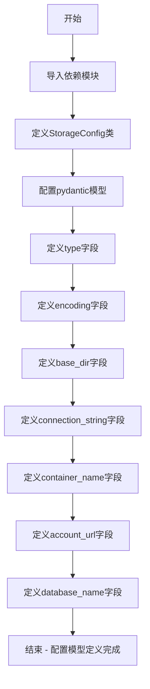
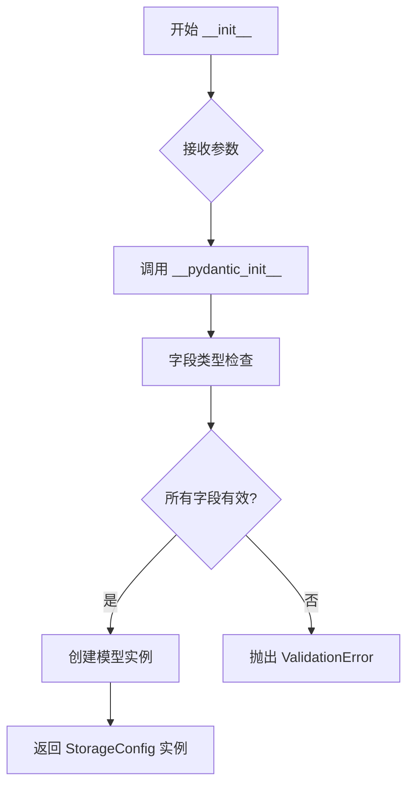
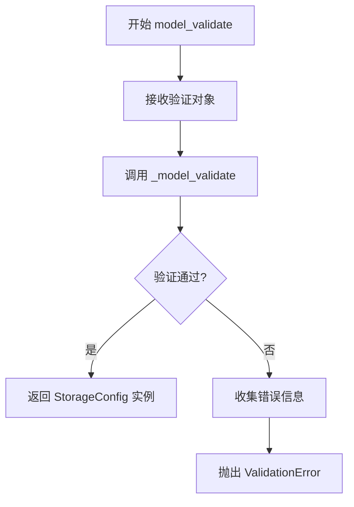
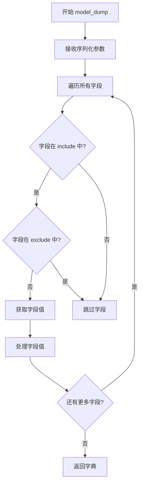
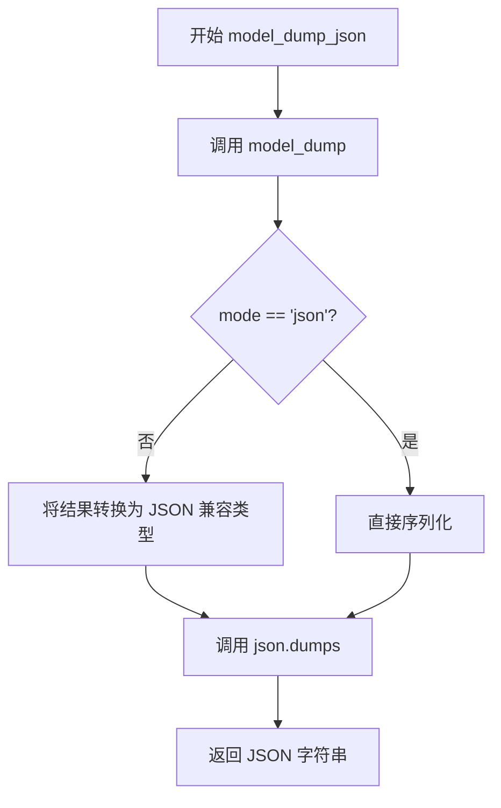
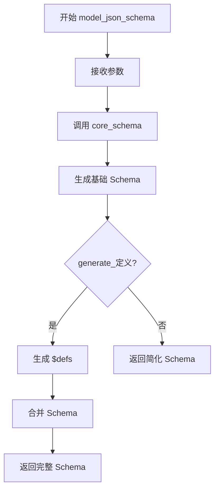

# `graphrag\packages\graphrag-storage\graphrag_storage\storage_config.py` 详细设计文档

这是一个存储配置模型定义文件，使用Pydantic框架定义存储后端的配置结构，支持File、AzureBlob、AzureCosmos等多种存储类型的配置参数，包括编码、基础目录、连接字符串、容器名称、账户URL和数据库名称等配置项。

## 整体流程



## 类结构

```
StorageConfig (Pydantic BaseModel)
└── 字段列表:
    ├── type: 存储类型
    ├── encoding: 编码格式
    ├── base_dir: 基础目录
    ├── connection_string: 连接字符串
    ├── container_name: 容器名称
    ├── account_url: 账户URL
    └── database_name: 数据库名称
```

## 全局变量及字段


### `StorageType`
    
存储类型枚举，用于指定存储后端类型

类型：`Enum (from graphrag_storage.storage_type)`
    


### `StorageConfig.type`
    
存储类型（File/AzureBlob/AzureCosmos）

类型：`str`
    


### `StorageConfig.encoding`
    
文件编码格式

类型：`str | None`
    


### `StorageConfig.base_dir`
    
文件或Blob存储的基础目录

类型：`str | None`
    


### `StorageConfig.connection_string`
    
远程服务的连接字符串

类型：`str | None`
    


### `StorageConfig.container_name`
    
Azure Blob或CosmosDB容器名称

类型：`str | None`
    


### `StorageConfig.account_url`
    
Azure服务的账户URL

类型：`str | None`
    


### `StorageConfig.database_name`
    
数据库名称

类型：`str | None`
    
    

## 全局函数及方法


# StorageConfig 类 Pydantic 自动生成方法文档

由于 `StorageConfig` 是一个 Pydantic `BaseModel` 类，它自动继承并生成了多个验证和序列化方法。以下是主要的自动生成方法的详细信息。

---

### StorageConfig.__init__

Pydantic 模型自动生成的构造函数，用于创建 StorageConfig 实例并进行字段验证。

参数：

- `__pydantic_self__`：`Self`，Pydantic 内部使用的 self 参数
- `type`：`str | None`，存储类型，默认为 `StorageType.File`
- `encoding`：`str | None`，文件存储编码，默认为 `None`
- `base_dir`：`str | None`，文件或 AzureBlob 存储的基础目录，默认为 `None`
- `connection_string`：`str | None`，远程服务的连接字符串，默认为 `None`
- `container_name`：`str | None`，Azure Blob 或 CosmosDB 容器名称，默认为 `None`
- `account_url`：`str | None`，Azure 服务账户 URL，默认为 `None`
- `database_name`：`str | None`，数据库名称，默认为 `None`

返回值：`StorageConfig`，返回验证后的 StorageConfig 实例

#### 流程图



#### 带注释源码

```python
def __init__(self, **data: Any) -> None:
    """
    Pydantic 自动生成的构造函数。
    
    接收任意关键字参数，根据字段定义进行验证后创建实例。
    使用 model_config 中的 extra='allow' 配置，允许额外字段。
    
    Args:
        **data: 关键字参数，包含所有模型字段
        
    Returns:
        StorageConfig: 验证后的配置实例
        
    Raises:
        ValidationError: 当字段验证失败时抛出
    """
    return self.__pydantic_init__(**data)
```

---

### StorageConfig.model_validate

类方法（`@classmethod`），用于从字典或类似字典的对象验证并创建 StorageConfig 实例。

参数：

- `cls`：`type[StorageConfig]`，类本身
- `obj`：`Any`，要验证的对象（字典、JSON 字符串等）
- `strict`：`bool | None`，是否严格模式，默认为 `None`
- `from_attributes`：`bool | None`，是否从对象属性读取，默认为 `None`
- `context`：`Any | None`，验证上下文，默认为 `None`

返回值：`StorageConfig`，返回验证后的 StorageConfig 实例

#### 流程图



#### 带注释源码

```python
@classmethod
def model_validate(
    cls,
    obj: Any,
    *,
    strict: bool | None = None,
    from_attributes: bool | None = None,
    context: Any | None = None,
) -> "StorageConfig":
    """
    类方法：从字典或其他对象验证并创建 StorageConfig 实例。
    
    支持从字典、JSON 字符串、带有属性的对象等多种来源验证数据。
    
    Args:
        cls: 类本身（Pydantic 自动传递）
        obj: 要验证的数据源（字典、JSON 字符串等）
        strict: 是否启用严格模式（不接受额外字段）
        from_attributes: 是否从对象属性读取字段
        context: 验证上下文，可用于自定义验证器
        
    Returns:
        StorageConfig: 验证通过的配置实例
        
    Raises:
        ValidationError: 验证失败时抛出，包含详细错误信息
    """
    return cls._model_validate(
        obj,
        strict=strict,
        from_attributes=from_attributes,
        context=context,
    )
```

---

### StorageConfig.model_dump

实例方法，将 StorageConfig 实例序列化为字典。

参数：

- `self`：`StorageConfig`，模型实例
- `mode`：`str | None`，序列化模式，默认为 `"python"`
- `include`：`set[str] | None`，需要包含的字段，默认为 `None`
- `exclude`：`set[str] | None`，需要排除的字段，默认为 `None`
- `context`：`Any | None`，序列化上下文，默认为 `None`

返回值：`dict[str, Any]`，返回包含所有字段值的字典

#### 流程图



#### 带注释源码

```python
def model_dump(
    self,
    *,
    mode: str | None = "python",
    include: set[str] | None = None,
    exclude: set[str] | None = None,
    context: Any | None = None,
) -> dict[str, Any]:
    """
    将模型实例序列化为字典。
    
    根据 mode 参数可以输出不同格式：
    - 'python': Python 原生类型（dict, list 等）
    - 'json': JSON 兼容类型（str, int, float, bool, list, dict）
    
    Args:
        self: 模型实例
        mode: 序列化模式 ('python' 或 'json')
        include: 只包含指定的字段集合
        exclude: 排除指定的字段集合
        context: 序列化上下文
        
    Returns:
        dict[str, Any]: 字段名到值的字典
    """
    return self._model_dump(
        mode=mode,
        include=include,
        exclude=exclude,
        context=context,
        # model_config 中设置了 extra="allow"，允许额外字段
    )
```

---

### StorageConfig.model_dump_json

实例方法，将 StorageConfig 实例序列化为 JSON 字符串。

参数：

- `self`：`StorageConfig`，模型实例
- `mode`：`str | None`，序列化模式，默认为 `"python"`
- `include`：`set[str] | None`，需要包含的字段，默认为 `None`
- `exclude`：`set[str] | None`，需要排除的字段，默认为 `None`
- `context`：`Any | None`，序列化上下文，默认为 `None`
- `**dumps_kwargs`：传递给 json.dumps 的额外参数

返回值：`str`，返回 JSON 格式的字符串

#### 流程图



#### 带注释源码

```python
def model_dump_json(
    self,
    *,
    mode: str | None = "python",
    include: set[str] | None = None,
    exclude: set[str] | None = None,
    context: Any | None = None,
    **dumps_kwargs: Any,
) -> str:
    """
    将模型实例序列化为 JSON 字符串。
    
    底层调用 model_dump 获取字典，然后使用 json.dumps 转换为字符串。
    支持自定义 JSON 编码器通过 dumps_kwargs 传递。
    
    Args:
        self: 模型实例
        mode: 序列化模式
        include: 只包含指定的字段
        exclude: 排除指定的字段
        context: 序列化上下文
        **dumps_kwargs: 传递给 json.dumps 的额外参数（如 indent, ensure_ascii 等）
        
    Returns:
        str: JSON 格式的字符串
    """
    # 序列化前的处理
    return self._model_dump_json(
        mode=mode,
        include=include,
        exclude=exclude,
        context=context,
        **dumps_kwargs,
    )
```

---

### StorageConfig.model_json_schema

类方法，生成 Pydantic 模型的 JSON Schema。

参数：

- `cls`：`type[StorageConfig]`，类本身
- `mode`：`str | None`，模式类型，默认为 `"validation"`
- `title`：`str | None`，schema 标题，默认为 `None`
- `generate_定义`：`bool | None`，是否生成定义，默认为 `True`

返回值：`dict[str, Any]`，返回 JSON Schema 字典

#### 流程图



#### 带注释源码

```python
@classmethod
def model_json_schema(
    cls,
    mode: str | None = "validation",
    title: str | None = None,
    generate_定义: bool | None = True,
) -> dict[str, Any]:
    """
    生成模型的 JSON Schema。
    
    用于：
    - API 文档自动生成
    - 数据验证
    - 与其他系统集成时的接口定义
    
    Args:
        cls: 类本身
        mode: schema 模式 ('validation' 或 'serialization')
        title: 自定义标题，默认为类名
        generate_定义: 是否在 schema 中包含 $defs 定义
        
    Returns:
        dict[str, Any]: JSON Schema 字典
    """
    # 字段定义示例：
    # type: str = Field(default=StorageType.File, description="存储类型")
    # encoding: str | None = Field(default=None, description="文件编码")
    # base_dir: str | None = Field(default=None, description="基础目录")
    # connection_string: str | None = Field(default=None, description="连接字符串")
    # container_name: str | None = Field(default=None, description="容器名称")
    # account_url: str | None = Field(default=None, description="账户URL")
    # database_name: str | None = Field(default=None, description="数据库名称")
    return cls._generate_json_schema(
        core_schema,
        mode=mode,
        title=title,
        generate_定义=generate_定义,
    )
```

---

### 关键组件信息

| 组件名称 | 一句话描述 |
|---------|-----------|
| `BaseModel` | Pydantic 基类，提供自动验证和序列化功能 |
| `ConfigDict` | Pydantic 配置字典，用于配置模型行为 |
| `Field` | Pydantic 字段装饰器，用于定义字段元数据 |
| `StorageType.File` | 枚举值，默认的文件存储类型 |

---

### 潜在的技术债务或优化空间

1. **字段验证不足**：当前仅使用基础类型提示，缺少自定义验证器（如连接字符串格式验证）
2. **缺少默认值处理**：某些字段的 `None` 默认值可能导致运行时错误
3. **文档可改进**：可以添加更多关于各存储类型特定配置需求的说明

---

### 其他项目

#### 设计目标与约束

- **设计目标**：提供统一的存储配置抽象，支持多种存储后端
- **约束**：`model_config = ConfigDict(extra="allow")` 允许自定义存储实现添加额外字段

#### 错误处理

- Pydantic 自动抛出 `ValidationError`，包含详细的字段验证错误信息
- 建议在实例化时使用 `try/except` 捕获验证错误

## 关键组件


### StorageConfig 类

存储配置模型类，继承自 Pydantic BaseModel，用于定义不同存储后端（文件存储、Azure Blob 存储、Azure CosmosDB）的配置参数。

### StorageType 枚举

存储类型枚举，定义支持的存储后端类型，包括 File、AzureBlob 和 AzureCosmos。

### type 字段

字符串类型字段，表示要使用的存储类型，默认值为 StorageType.File，用于区分不同的存储实现。

### encoding 字段

可选字符串字段，指定文件存储使用的字符编码，默认值为 None。

### base_dir 字段

可选字符串字段，指定文件存储或 Azure Blob 存储的输出基础目录，默认值为 None。

### connection_string 字段

可选字符串字段，用于远程服务（Azure）的连接字符串，默认值为 None。

### container_name 字段

可选字符串字段，指定 Azure Blob Storage 容器名称或 CosmosDB 容器名称，默认值为 None。

### account_url 字段

可选字符串字段，指定 Azure 服务的账户 URL，默认值为 None。

### database_name 字段

可选字符串字段，指定要使用的数据库名称，默认值为 None。


## 问题及建议


### 已知问题

-   **类型不一致**：字段 `type` 声明为 `str` 类型，但默认值使用了 `StorageType.File`（可能是枚举值），存在类型不匹配风险
-   **缺乏字段验证**：对于不同存储类型（如 File、AzureBlob、AzureCosmos），缺少必要的条件验证逻辑，例如选择 File 类型时 `base_dir` 应为必填项
-   **敏感信息暴露**：未对 `connection_string` 等敏感字段进行脱敏处理或加密提示
-   **默认值模糊**：`encoding` 字段描述未明确说明 `None` 时的默认编码行为

### 优化建议

-   考虑使用 `Literal` 类型或枚举来限制 `type` 字段的可选值，增强类型安全性
-   添加 Pydantic 验证器（`model_validator`）实现跨字段约束，根据不同的 `type` 值验证必填字段
-   为 `connection_string` 等敏感字段添加字段描述或加密提示注释
-   明确 `encoding` 字段为 `None` 时的默认编码行为（如 UTF-8）并补充到描述中
-   考虑为不同存储类型设计更细化的配置模式（可继承基类或使用 discriminated union）

## 其它


### 设计目标与约束

本模块的设计目标是提供一个统一的存储配置模型，用于配置不同类型存储后端（File、AzureBlob、AzureCosmos）的参数。约束包括：1）必须继承自Pydantic的BaseModel以支持数据验证；2）支持动态配置扩展（通过extra="allow"）；3）配置项大多为可选，以适应不同存储类型的配置需求。

### 错误处理与异常设计

本模型主要依赖Pydantic进行数据验证，当配置值不符合预期类型或约束时，会抛出ValidationError。StorageType需要从graphrag_storage.storage_type导入，若导入失败或类型不匹配会导致模型验证失败。建议在应用层捕获ValidationError并提供友好的错误提示。

### 外部依赖与接口契约

本模型依赖以下外部组件：1）pydantic库（BaseModel、ConfigDict、Field）；2）graphrag_storage.storage_type模块中的StorageType枚举。StorageType必须定义File、AzureBlob、AzureCosmos三种类型，其他模块通过实例化StorageConfig并传入相应参数来配置存储后端。

### 配置验证规则

type字段必须为有效存储类型字符串；encoding字段需为有效的字符编码名称；base_dir、connection_string、container_name、account_url、database_name均为可选字段但需符合对应存储类型的验证规则（如Azure存储需要connection_string和container_name）。

### 使用示例

```python
# 文件存储配置
file_config = StorageConfig(
    type="File",
    encoding="utf-8",
    base_dir="./data"
)

# Azure Blob存储配置
blob_config = StorageConfig(
    type="AzureBlob",
    connection_string="DefaultEndpointsProtocol=...",
    container_name="mycontainer",
    base_dir="output"
)

# Azure CosmosDB配置
cosmos_config = StorageConfig(
    type="AzureCosmos",
    account_url="https://xxx.documents.azure.com",
    database_name="mydb",
    container_name="mycontainer"
)
```

### 版本兼容性

本代码基于Python 3.10+的类型注解语法（str | None），需要Pydantic v2.x版本支持（使用ConfigDict而非原来的class Config）。

### 安全性考虑

存储配置可能包含敏感信息如连接字符串（connection_string），建议：1）避免在代码中硬编码敏感配置；2）使用环境变量或密钥管理系统存储敏感信息；3）在日志中避免输出完整的连接字符串。

    