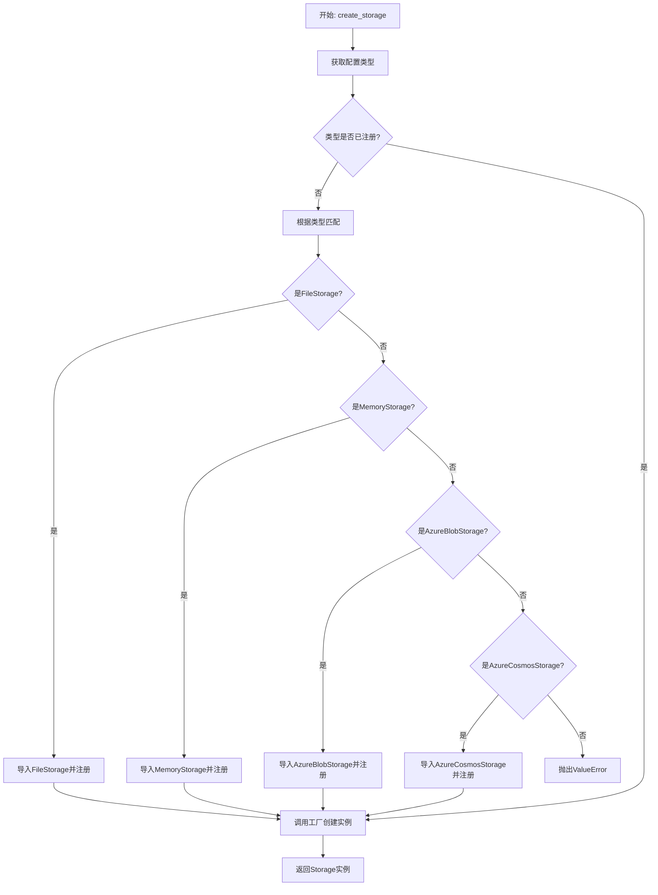
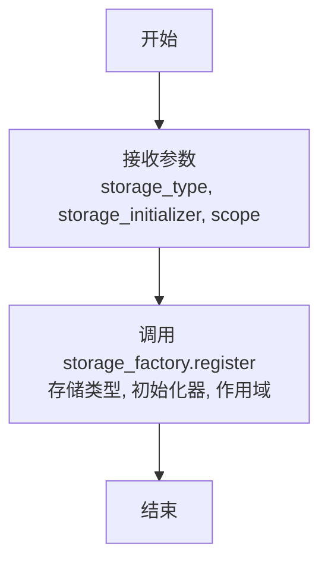
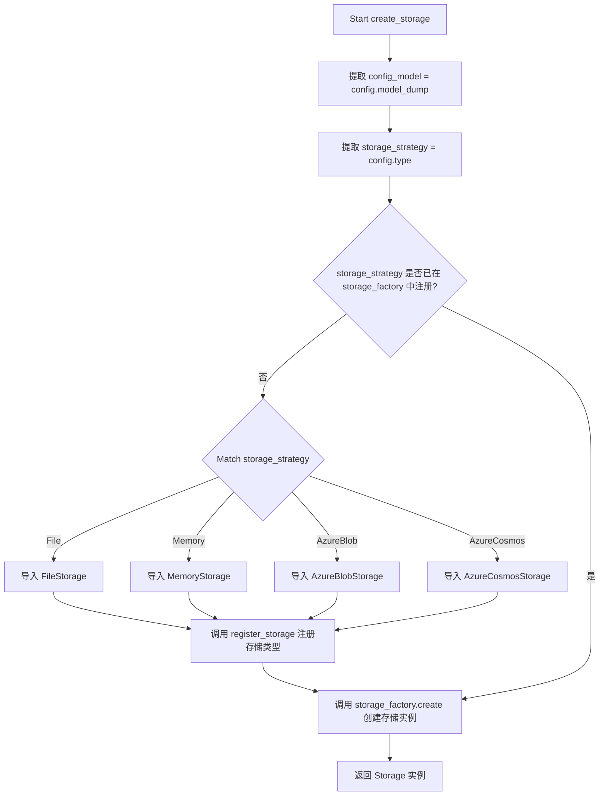

# `graphrag\packages\graphrag-storage\graphrag_storage\storage_factory.py` 详细设计文档

这是一个存储工厂实现，用于根据配置动态创建不同类型的存储实例（如文件存储、内存存储、Azure Blob、Azure Cosmos等），支持自定义存储实现的注册和按需加载。

## 整体流程



## 类结构

```
Factory<T> (泛型基类)
└── StorageFactory (存储工厂实现)
```

## 全局变量及字段


### `storage_factory`
    
全局存储工厂实例，用于注册和创建各种存储实现（如文件存储、内存存储、Azure Blob等）

类型：`StorageFactory`
    


    

## 全局函数及方法


### `register_storage`

注册自定义存储实现到存储工厂。

参数：

- `storage_type`：`str`，要注册的存储类型标识符
- `storage_initializer`：`Callable[..., Storage]`，存储初始化器，用于创建存储实例
- `scope`：`ServiceScope`（默认值为 `"transient"`），服务作用域，指定存储的生命周期

返回值：`None`，无返回值

#### 流程图



#### 带注释源码

```python
def register_storage(
    storage_type: str,                      # 存储类型标识符，用于唯一标识存储实现
    storage_initializer: Callable[..., Storage],  # 存储初始化器函数，用于创建存储实例
    scope: ServiceScope = "transient",      # 服务作用域，默认瞬态模式
) -> None:
    """Register a custom storage implementation.

    Args
    ----
        - storage_type: str
            The storage id to register.
        - storage_initializer: Callable[..., Storage]
            The storage initializer to register.
    """
    # 调用存储工厂的注册方法，将存储类型和初始化器注册到工厂中
    storage_factory.register(storage_type, storage_initializer, scope)
```


### `create_storage`

该函数根据提供的存储配置动态创建相应的存储实例，支持文件存储、内存存储、Azure Blob 存储和 Azure Cosmos 存储等多种类型，并在首次使用时自动注册未知的存储类型。

参数：

- `config`：`StorageConfig`，存储配置对象，包含存储类型和相关配置参数

返回值：`Storage`，创建完成的存储实现实例

#### 流程图



#### 带注释源码

```python
def create_storage(config: StorageConfig) -> Storage:
    """Create a storage implementation based on the given configuration.

    Args
    ----
        - config: StorageConfig
            The storage configuration to use.

    Returns
    -------
        Storage
            The created storage implementation.
    """
    # 将配置对象转换为字典，用于传递给存储初始化器
    config_model = config.model_dump()
    # 从配置中获取存储类型策略
    storage_strategy = config.type

    # 检查该存储类型是否已在工厂中注册
    if storage_strategy not in storage_factory:
        # 根据存储类型进行匹配，动态导入并注册相应的存储实现
        match storage_strategy:
            case StorageType.File:
                from graphrag_storage.file_storage import FileStorage
                # 注册文件存储类型
                register_storage(StorageType.File, FileStorage)
            case StorageType.Memory:
                from graphrag_storage.memory_storage import MemoryStorage
                # 注册内存存储类型
                register_storage(StorageType.Memory, MemoryStorage)
            case StorageType.AzureBlob:
                from graphrag_storage.azure_blob_storage import AzureBlobStorage
                # 注册 Azure Blob 存储类型
                register_storage(StorageType.AzureBlob, AzureBlobStorage)
            case StorageType.AzureCosmos:
                from graphrag_storage.azure_cosmos_storage import AzureCosmosStorage
                # 注册 Azure Cosmos 存储类型
                register_storage(StorageType.AzureCosmos, AzureCosmosStorage)
            case _:
                # 存储类型未匹配，抛出明确的错误信息
                msg = f"StorageConfig.type '{storage_strategy}' is not registered in the StorageFactory. Registered types: {', '.join(storage_factory.keys())}."
                raise ValueError(msg)

    # 使用工厂模式创建存储实例，传入配置参数
    return storage_factory.create(storage_strategy, config_model)
```

## 关键组件


### StorageFactory 类

工厂类的泛型实现，用于根据配置创建不同的存储实现，采用工厂模式管理存储实例的生命周期。

### storage_factory 全局变量

全局单例工厂实例，提供存储创建的入口点，负责管理所有已注册的存储类型。

### register_storage 函数

动态注册自定义存储实现的函数，支持将存储类型与初始化器绑定，并指定服务作用域（transient/singleton）。

### create_storage 函数

核心创建函数，根据 StorageConfig 配置动态创建存储实例。包含按需导入和注册存储类型的机制，支持 File、Memory、AzureBlob、AzureCosmos 四种存储类型。

### 动态存储类型注册机制

在 create_storage 中实现惰性加载模式，当请求的存储类型未注册时，根据类型匹配自动导入对应模块并注册，实现延迟初始化和依赖解耦。

### 存储策略匹配逻辑

使用 Python match-case 语法进行存储类型匹配，将配置中的 storage_strategy 映射到具体的 StorageType 枚举值，并进行异常处理。


## 问题及建议


### 已知问题

-   **违反开闭原则**：新增存储类型需要修改 `create_storage` 函数中的 `match-case` 语句，不符合开闭原则
-   **职责混淆**：注册逻辑放在 `create_storage` 函数内部，违反了单一职责原则，导致函数承担了创建和注册双重职责
-   **重复导入开销**：每次调用 `create_storage` 时都会检查存储类型是否已注册，若未注册则执行导入和注册操作，首次调用存在性能开销
-   **缺乏输入验证**：未对 `config` 参数进行空值校验，`config.model_dump()` 可能抛出异常
-   **全局状态竞争**：`storage_factory` 作为全局单例，在多线程并发调用 `register_storage` 时可能存在竞态条件
-   **类型提示不完整**：`register_storage` 函数的 `scope` 参数默认值使用字符串字面量而非 `ServiceScope` 枚举类型

### 优化建议

-   将内置存储类型的注册逻辑移至模块初始化阶段或单独的注册函数中，使用统一的注册机制
-   使用注册表模式，通过配置文件或插件机制动态发现和注册存储类型，消除 `match-case` 的硬编码
-   在 `create_storage` 函数入口添加 `config` 的空值检查和类型验证
-   考虑为 `storage_factory` 添加线程锁或在模块级别预先注册所有支持的存储类型
-   统一 `scope` 参数的类型提示，使用 `ServiceScope` 枚举类型替代字符串字面量
-   添加日志记录以便追踪存储类型的注册和创建过程，提高可调试性

## 其它


### 设计目标与约束

本代码的设计目标是提供一个统一的存储抽象工厂，支持多种存储类型（文件、内存、Azure Blob、Azure Cosmos）的动态注册和创建。核心约束包括：1）依赖抽象工厂模式实现解耦；2）存储类型需实现Storage接口；3）配置驱动创建过程；4）支持瞬态和单例作用域。

### 错误处理与异常设计

主要异常场景：1）未注册的存储类型抛出ValueError，包含可用类型列表；2）存储初始化失败向上传播原始异常；3）配置模型验证失败由pydantic处理。异常处理原则：快速失败、提供清晰错误信息、保留堆栈跟踪。

### 数据流与状态机

数据流：StorageConfig → model_dump() → 工厂查询 → 动态导入 → 实例化 → 返回Storage。状态转换：未注册 → 自动注册（首次） → 已注册 → create() → 实例。无复杂状态机，仅有注册表状态管理。

### 外部依赖与接口契约

核心依赖：1）graphrag_common.factory提供Factory基类；2）graphrag_storage定义Storage接口和配置模型；3）各存储实现类（FileStorage、MemoryStorage等）。接口契约：所有存储实现必须实现Storage抽象接口，提供统一的数据操作方法。

### 安全性考虑

代码本身无直接安全风险，但需注意：1）动态导入需验证来源；2）配置中的凭据需安全存储；3）Azure存储需遵循云安全最佳实践。建议添加存储实现签名验证机制。

### 性能考虑

性能特点：1）首次创建存在动态导入开销；2）注册表查找为O(1)；3）瞬态作用域每次创建新实例。单例作用域可复用实例减少开销。建议：对高频场景使用单例scope，避免重复初始化。

### 配置管理

配置通过StorageConfig传递，包含type字段指定存储策略。配置模型使用pydantic验证，支持序列化为字典传递。推荐配置外部化，通过环境变量或配置文件管理敏感信息。

### 测试策略

测试覆盖：1）单元测试验证register和create流程；2）集成测试覆盖各存储类型；3）Mock测试验证工厂行为。关键测试点：未知存储类型错误处理、配置传递正确性、作用域行为。

### 扩展性设计

扩展方式：1）新增存储类型实现Storage接口并注册；2）通过register_storage支持运行时自定义存储；3）可扩展ServiceScope支持更多生命周期管理。设计遵循开闭原则，对扩展开放。

    