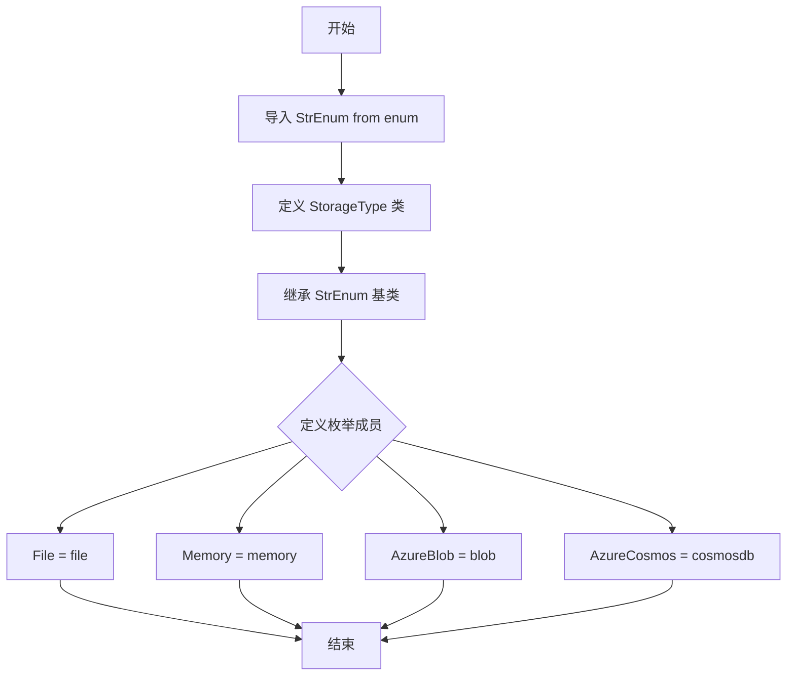
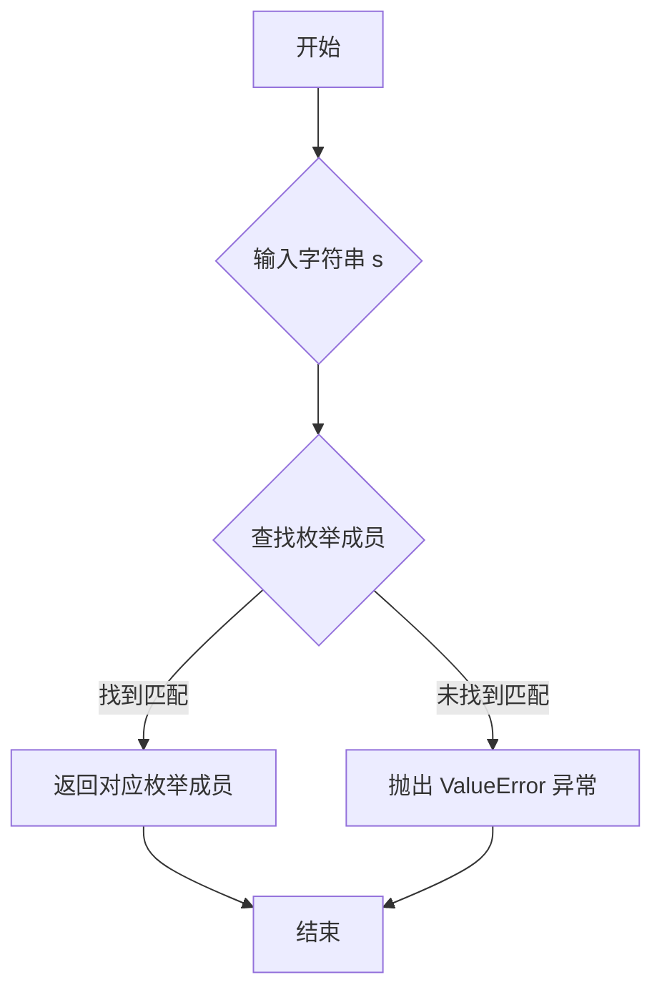
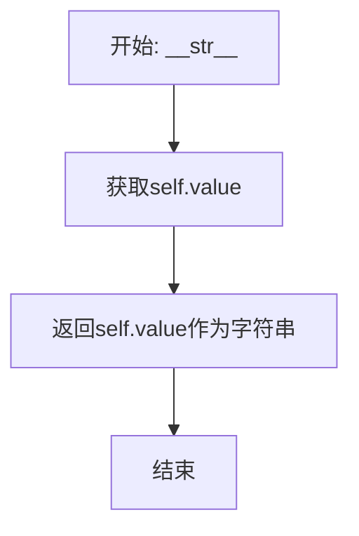
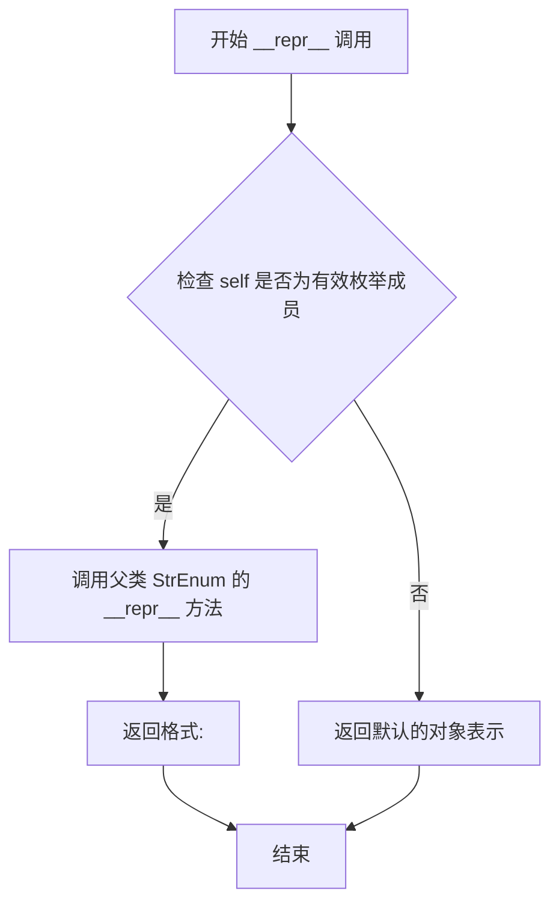

# `graphrag\packages\graphrag-storage\graphrag_storage\storage_type.py` 详细设计文档

定义了一个存储类型枚举类，用于标识和支持不同的存储后端实现，包括文件存储、内存存储、Azure Blob存储和Azure Cosmos DB存储。

## 整体流程



## 类结构

```
StrEnum (Python内置枚举基类)
└── StorageType (自定义存储类型枚举)
    ├── File
    ├── Memory
    ├── AzureBlob
    └── AzureCosmos
```

## 全局变量及字段


### `StorageType.name`
    
枚举成员名称

类型：`str`
    


### `StorageType.value`
    
枚举成员对应的存储类型字符串值

类型：`str`
    
    

## 全局函数及方法


### `StorageType.from_str()`

将字符串转换为 `StorageType` 枚举成员的方法，继承自 `StrEnum` 基类，用于根据字符串值查找并返回对应的存储类型枚举值。

参数：

- `s`：`str`，要转换的字符串值（如 "file"、"memory"、"blob"、"cosmosdb"）

返回值：`StorageType`，返回与输入字符串匹配的枚举成员

#### 流程图



#### 带注释源码

```python
# StorageType 继承自 StrEnum，StrEnum 提供了 from_str 类方法
# 该方法用于将字符串转换为对应的枚举成员

class StorageType(StrEnum):
    """Enum for storage types."""

    File = "file"
    Memory = "memory"
    AzureBlob = "blob"
    AzureCosmos = "cosmosdb"

# from_str 方法的内部实现逻辑（来自 StrEnum 基类）
# def from_str(cls, s: str) -> Self:
#     """
#     Retrieve the member of `cls` with name `s`.
#     
#     Parameters
#     ----------
#     s : str
#         The name of the member to retrieve.
#     
#     Returns
#     -------
#     Self
#         The corresponding enum member.
#     
#     Raises
#     ------
#     ValueError
#         If the input string does not match any enum member name.
#     """
#     return cls._member_map_[s]  # 通过成员名称查找并返回枚举成员
#
# 使用示例：
# StorageType.from_str("file")   # 返回 StorageType.File
# StorageType.from_str("memory") # 返回 StorageType.Memory
# StorageType.from_str("blob")   # 返回 StorageType.AzureBlob
# StorageType.from_str("cosmosdb") # 返回 StorageType.AzureCosmos
```


### `StorageType.__str__`

返回枚举成员的字符串表示，即枚举成员对应的值（value）。

参数：

- `self`：`StorageType`，代表枚举成员实例本身

返回值：`str`，返回枚举成员的字符串值（如 "file"、"memory" 等）

#### 流程图



#### 带注释源码

```python
def __str__(self) -> str:
    """
    返回枚举成员的字符串表示。
    
    对于StrEnum，__str__返回枚举成员的值(value)，
    而非成员名称(name)。
    
    例如：
        StorageType.File.__str__()  -> "file"
        StorageType.Memory.__str__() -> "memory"
    
    Returns:
        str: 枚举成员对应的字符串值
    """
    # StrEnum继承自str，__str__方法返回成员的value值
    return self.value
```


### `StorageType.__repr__`

返回枚举成员的官方表示形式，用于调试和日志输出。

参数：

- `self`：`StorageType`，枚举成员实例本身

返回值：`str`，返回枚举成员的官方表示形式，格式为 `<枚举类名.成员名: '成员值'>`

#### 流程图



#### 带注释源码

```python
def __repr__(self) -> str:
    """
    返回枚举成员的官方表示形式。
    
    在 Python 的枚举系统中，__repr__ 方法由 Enum 元类自动提供，
    无需在类定义中显式声明。该方法继承自 StrEnum -> str -> Enum 的 MRO。
    
    Returns:
        str: 返回格式为 '<StorageType.成员名: '成员值'>' 的字符串，
             例如: <StorageType.File: 'file'>
    """
    # 调用父类 (StrEnum/Enum) 的 __repr__ 方法
    # Python 自动处理，无需手动实现
    return super().__repr__()
    
    # 实际返回示例:
    # >>> StorageType.File.__repr__()
    # '<StorageType.File: 'file'>'
    #
    # >>> StorageType.Memory.__repr__()
    # '<StorageType.Memory: 'memory'>'
```

> **注意**：由于 `StorageType` 继承自 `StrEnum`（而 `StrEnum` 继承自 `str` 和 `Enum`），`__repr__` 方法是隐式继承的，而非显式定义在代码中。该方法由 Python 枚举框架自动提供，用于返回枚举成员的规范字符串表示形式。

## 关键组件


### StorageType

枚举类，定义了系统支持的存储类型，包括文件存储、内存存储、Azure Blob 存储和 Azure Cosmos DB 存储

### File

文件存储类型，用于基于文件系统的持久化存储

### Memory

内存存储类型，用于基于内存的临时存储

### AzureBlob

Azure Blob 存储类型，用于微软 Azure 平台的 blob 对象存储

### AzureCosmos

Azure Cosmos DB 存储类型，用于微软 Azure 的 NoSQL 数据库存储


## 问题及建议


### 已知问题

- 枚举类文档注释过于简单，未说明各存储类型的具体用途和业务场景
- 枚举成员缺少详细的注释说明，无法帮助开发者理解何时使用哪种存储类型
- 未提供验证机制，无法检查存储类型是否有效或已实现
- 缺少工厂方法或创建器模式，需要在其他地方手动实例化不同存储类型的实现类
- 枚举值采用缩写形式（如"blob"、"cosmosdb"），可能影响可读性和维护性
- 未定义存储类型的优先级、兼容性或依赖关系
- 缺少与其他模块（如配置管理、连接池）的接口契约定义

### 优化建议

- 为每个枚举成员添加详细的文档注释，说明其适用场景、配置要求和注意事项
- 添加验证方法（如`is_valid()`或`is_available()`）来检查存储类型是否可用
- 考虑实现工厂方法或静态创建器，统一管理不同存储类型的实例化逻辑
- 使用更清晰的枚举值命名（如"azure_blob_storage"、"azure_cosmos_db"）或添加别名支持
- 定义存储类型的元数据接口，包含默认值、超时配置、连接参数等信息
- 考虑添加存储类型的分组或层级结构（如云存储、本地存储、内存存储）
- 与配置管理模块集成，定义存储类型的配置Schema和验证规则
- 添加单元测试覆盖，验证枚举的完整性和边界条件处理

## 其它


### 设计目标与约束

本模块的设计目标是定义一组标准化的存储类型枚举，供上层存储实现模块选择对应的存储后端。约束条件包括：1）必须继承StrEnum以支持字符串比较和序列化；2）存储类型名称应与实际存储服务名称保持一致；3）新增存储类型需确保向后兼容。

### 错误处理与异常设计

本模块为纯枚举定义，不涉及业务逻辑，理论上无需运行时错误处理。若遇到非法的存储类型值，应在上层调用处抛出ValueError异常，并建议捕获该异常后提示用户使用合法的StorageType枚举值。

### 数据流与状态机

本模块不涉及数据流处理或状态机逻辑。StorageType枚举仅作为静态配置标识符被其他模块引用，用于决定使用哪种存储后端实现。

### 外部依赖与接口契约

本模块无外部依赖，仅依赖Python标准库enum. StrEnum（Python 3.11+）。接口契约：任何使用StorageType的模块应导入此类并通过枚举成员（如StorageType.File）进行引用，避免直接使用字符串字面量，以确保类型安全和IDE支持。

### 性能考虑

由于是纯枚举定义，不存在运行时性能开销。枚举成员在模块加载时即被创建，引用开销可忽略不计。

### 安全性考虑

本模块不涉及敏感数据处理或权限控制，安全性风险较低。但需确保存储类型名称（如AzureBlob、AzureCosmos）不泄露云服务商的敏感标识信息，当前实现符合要求。

### 可扩展性设计

本模块采用开放封闭原则设计，新增存储类型只需在枚举中增加新的成员，无需修改现有代码。扩展建议：1）可在文档中标注各存储类型的适用场景；2）未来可考虑将存储类型与具体实现类进行映射注册。

### 版本兼容性

本模块依赖Python 3.11引入的StrEnum特性，需确保运行时Python版本不低于3.11。对于低版本Python，可考虑继承enum.Enum并实现__str__方法作为替代方案。

### 配置管理

StorageType枚举通常通过配置文件或环境变量进行外部化配置。建议在配置层面对枚举值进行校验，确保传入的字符串值与枚举成员名称匹配。

### 测试策略

测试重点应包括：1）验证所有枚举成员值正确；2）验证枚举继承自StrEnum；3）验证枚举支持字符串比较；4）验证枚举可被序列化/反序列化。单元测试示例：assert StorageType.File == "file"。


    