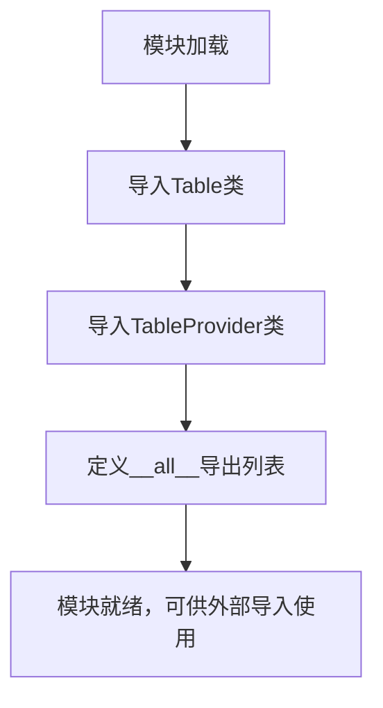

# `graphrag\packages\graphrag-storage\graphrag_storage\tables\__init__.py` 详细设计文档

GraphRAG存储模块的表提供程序包初始化文件，用于导出Table和TableProvider两个核心类，为GraphRAG系统提供表格数据存储和访问能力

## 整体流程



## 类结构

```
Table Provider Module
├── Table (表数据模型类)
└── TableProvider (表提供程序类)
```

## 全局变量及字段


### `__all__`
    
定义了模块的公共API，指定了Table和TableProvider为公开接口

类型：`list`
    


    

## 全局函数及方法


## 关键组件


### Table 类

表格数据结构的定义，提供表格数据的存储和操作能力，是GraphRAG存储层的核心数据结构。

### TableProvider 类

表格提供者接口，负责创建和管理Table实例，是GraphRAG存储层的抽象工厂模式实现。

### 模块导出机制

通过__all__显式定义公共API，控制模块的导入接口，确保API的稳定性和封装性。


## 问题及建议


### 已知问题

-   **缺少模块级文档字符串**：当前文件没有模块级别的docstring，无法直接了解该模块的整体用途和GraphRAG存储层的设计意图
-   **无版本控制信息**：作为公共API模块，缺少`__version__`或`__api_version__`等版本标识，不利于依赖方进行版本管理
-   **暴露内部实现细节**：直接重新导出`Table`和`TableProvider`两个具体类，暴露了存储层的内部实现细节，降低了后续重构的灵活性
-   **缺乏类型导出**：未导出相关的类型别名（TypeAlias）或协议（Protocol），不利于类型注解和静态检查
-   **无错误处理机制**：子模块导入失败时会导致整个包不可用，缺乏graceful degradation或明确的错误提示

### 优化建议

-   **添加模块文档**：在文件开头添加模块级docstring，说明这是GraphRAG的表存储提供者模块，描述其职责和主要组件
-   **版本信息管理**：添加`__version__`或`__api_version__`变量，与包的版本保持一致，便于依赖方适配
-   **抽象接口导出**：考虑导出抽象基类或Protocol，而非具体实现类，提高API稳定性
-   **类型支持**：添加类型相关的`__all__`或使用`from __future__ import annotations`提升类型支持
-   **条件导入优化**：如有必要，可考虑延迟导入（lazy import）或提供导入失败的友好提示
-   **添加README或文档注释**：说明Table和TableProvider的使用场景和关系，帮助开发者理解设计意图

## 其它


### 设计目标与约束

本模块作为GraphRAG存储层的表提供者接口抽象层，旨在解耦数据存储实现与业务逻辑，提供统一的Table和TableProvider接口。设计约束包括：遵循Python包结构规范，通过__all__明确导出公共API，保持最小化的模块复杂度，仅作为接口聚合和重新导出的角色。

### 错误处理与异常设计

本模块本身不涉及具体业务逻辑，错误处理由具体的TableProvider实现类负责。模块级错误主要可能出现在导入时，如依赖的table.py或table_provider.py文件缺失时会抛出ImportError。建议调用方在导入时进行异常捕获，并确保依赖的Table和TableProvider实现类已正确安装。

### 数据流与状态机

数据流方向：外部调用者 → TableProvider接口 → Table实例 → 底层存储。TableProvider负责创建和管理Table实例的生命周期，Table负责具体的数据操作如读取、写入、查询等。状态转换由TableProvider的实现类控制，本模块不维护任何状态。

### 外部依赖与接口契约

本模块依赖两个核心接口类：Table（表操作接口）和TableProvider（表提供者接口）。TableProvider需实现create_table()方法返回Table实例；Table需实现get()、put()、delete()、query()等基本CRUD操作接口。具体实现细节由下游的具体provider实现类（如Azure Table Storage、Cosmos DB等）提供。

### 配置与参数说明

本模块作为接口聚合模块，不直接接受配置参数。具体的TableProvider实现类可能需要配置参数（如连接字符串、容器名称、分区键等），这些参数应在具体实现类的构造函数或初始化方法中定义。

### 性能考量

本模块作为轻量级接口层，不涉及性能瓶颈。具体性能特性取决于TableProvider和Table的具体实现。设计时应注意避免在接口层引入不必要的抽象层次，以减少方法调用开销。

### 安全考虑

本模块本身不涉及敏感数据处理或认证授权。安全相关的内容（如API密钥管理、访问控制、数据加密等）应由具体的TableProvider实现类负责实现。调用方需确保配置信息的安全存储。

### 测试策略

本模块的测试主要验证导入正确性和__all__导出完整性。建议编写单元测试验证：1) Table和TableProvider可正确导入；2) __all__包含正确的导出项；3) 具体的TableProvider实现可通过接口契约测试。

### 版本兼容性

本模块遵循语义化版本管理。主版本号变更可能意味着接口契约的重大变化。需确保GraphRAG核心框架版本与具体TableProvider实现版本兼容。当前代码标记为2024年Microsoft Corporation，遵循MIT开源许可证。

    