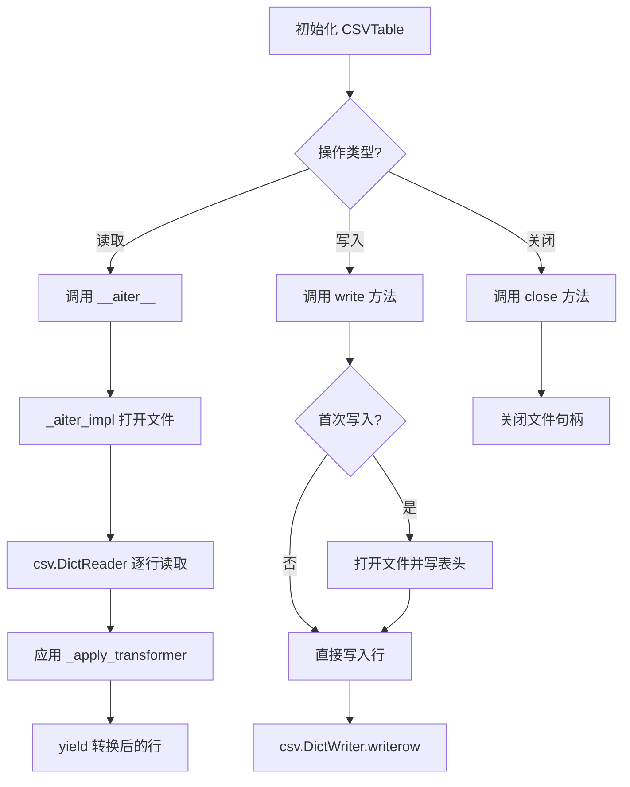
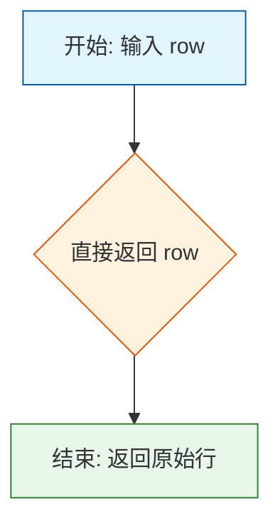
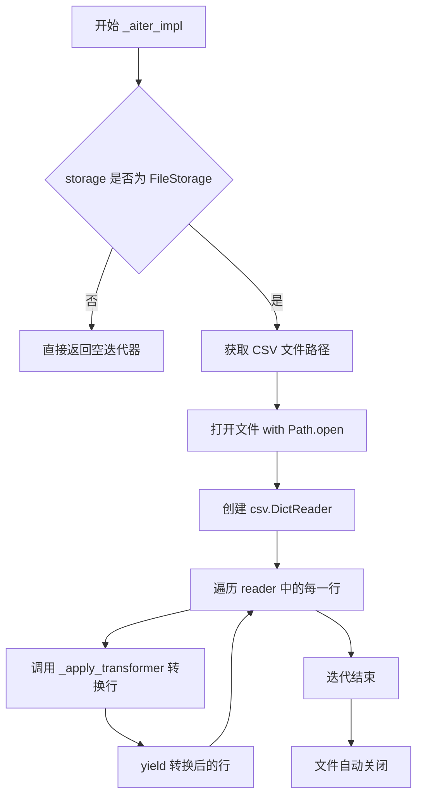
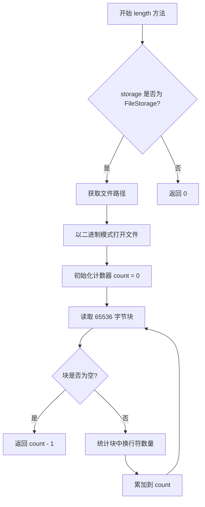
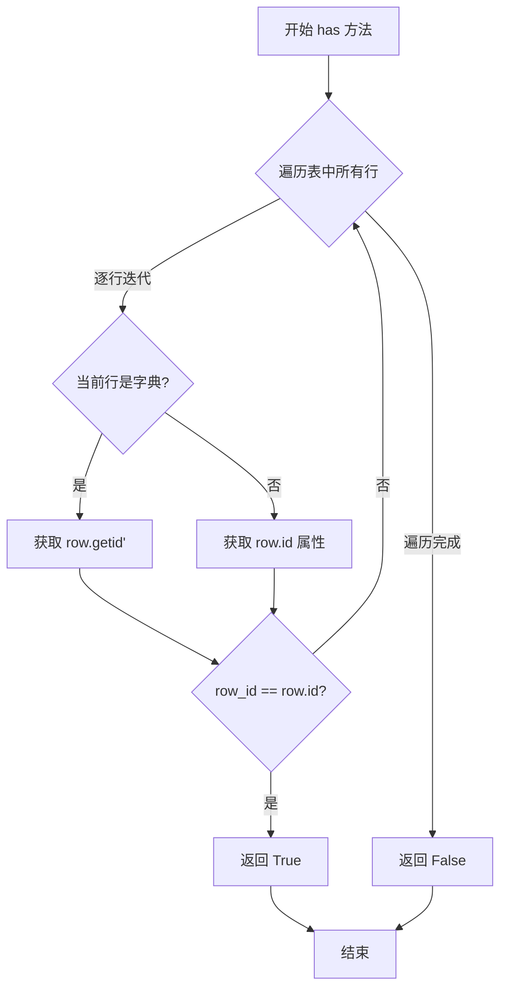
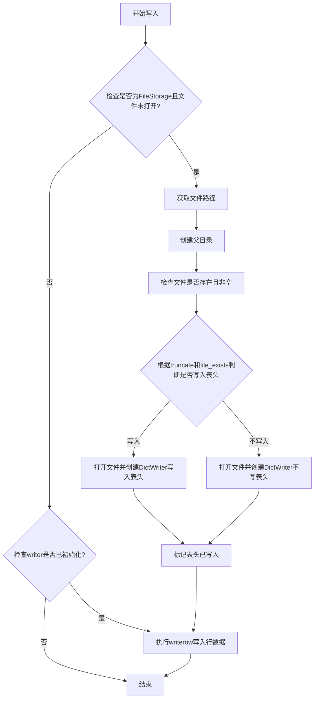
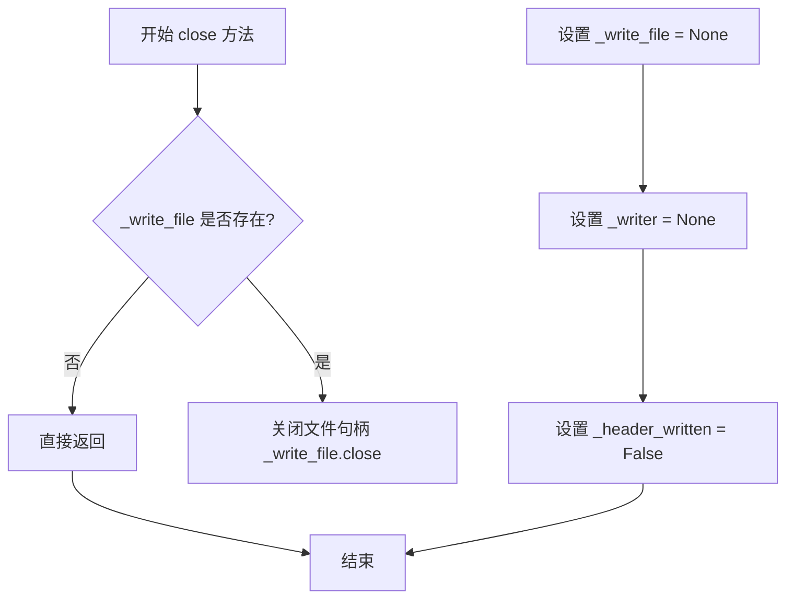

# `graphrag\packages\graphrag-storage\graphrag_storage\tables\csv_table.py` 详细设计文档

该文件实现了基于CSV的Table抽象接口，提供流式读写CSV表格数据的功能，支持可选的行转换器（可以是函数或Pydantic模型），通过异步迭代器实现高效的逐行读取，并支持截断/追加模式写入。

## 整体流程



## 类结构

```
Table (抽象基类)
└── CSVTable (CSV表格实现)
```

## 全局变量及字段


### `_identity`
    
返回行 unchanged 的默认转换器函数

类型：`Callable[[dict[str, Any]], Any]`
    


### `_apply_transformer`
    
应用转换器到行的辅助函数，处理可调用对象和类

类型：`Callable[[RowTransformer, dict[str, Any]], Any]`
    


### `csv.field_size_limit`
    
设置CSV字段大小限制为系统最大值

类型：`function`
    


### `CSVTable._storage`
    
存储后端实例（File, Blob, 或 Cosmos）

类型：`Storage`
    


### `CSVTable._table_name`
    
表的名称标识符

类型：`str`
    


### `CSVTable._file_key`
    
CSV文件的完整键名（表名.csv）

类型：`str`
    


### `CSVTable._transformer`
    
可选的行转换器，用于转换每行数据

类型：`RowTransformer`
    


### `CSVTable._truncate`
    
控制写入时是否截断/覆盖文件

类型：`bool`
    


### `CSVTable._encoding`
    
CSV文件的字符编码格式

类型：`str`
    


### `CSVTable._write_file`
    
写入模式的文件句柄引用

类型：`TextIOWrapper | None`
    


### `CSVTable._writer`
    
CSV字典写入器实例

类型：`csv.DictWriter | None`
    


### `CSVTable._header_written`
    
标记CSV头部是否已写入文件

类型：`bool`
    
    

## 全局函数及方法


### `_identity`

这是一个简单的身份转换函数，作为 CSV 表的默认行转换器，在不需要对行数据进行任何转换时使用。它直接返回输入的字典，不做任何修改。

参数：

- `row`：`dict[str, Any]`，输入的行数据字典

返回值：`Any`，未经修改的原始行数据（与输入相同）

#### 流程图



#### 带注释源码

```python
def _identity(row: dict[str, Any]) -> Any:
    """Return row unchanged (default transformer).
    
    这是一个身份转换函数，作为 CSV 表的默认行转换器。
    当没有指定自定义 transformer 时使用此函数，确保行数据
    保持原样返回，不进行任何转换处理。
    
    Args:
        row: 输入的行数据字典，包含 CSV 文件中的一行数据
        
    Returns:
        Any: 未经任何修改的原始行数据字典
    """
    return row
```


### `_apply_transformer`

该函数是 CSV 表格模块的核心转换工具，负责将转换器应用于每一行数据。它智能地处理两种类型的转换器：如果是类（如 Pydantic 模型），则使用解包的字典调用；如果是普通可调用对象，则直接传入行字典作为参数。

参数：

- `transformer`：`RowTransformer`，用于转换行数据的可调用对象（可以是函数或类如 Pydantic 模型）
- `row`：`dict[str, Any]，待转换的 CSV 行数据，以字典形式呈现

返回值：`Any`，返回转换后的数据（当 transformer 是类时返回类实例，否则返回转换后的字典）

#### 流程图

```mermaid
flowchart TD
    A[开始 _apply_transformer] --> B{transformer 是类吗?}
    B -->|是| C[使用 **row 解包调用 transformer]
    B -->|否| D[直接调用 transformer(row)]
    C --> E[返回类实例]
    D --> F[返回转换后的数据]
    E --> G[结束]
    F --> G
```

#### 带注释源码

```python
def _apply_transformer(transformer: RowTransformer, row: dict[str, Any]) -> Any:
    """Apply transformer to row, handling both callables and classes.

    If transformer is a class (e.g., Pydantic model), calls it with **row.
    Otherwise calls it with row as positional argument.
    
    Args:
        transformer: 可调用对象或类，用于转换行数据。
                     若是类（如 Pydantic 模型），用字典解包后的参数实例化；
                     若是函数/lambda，直接传入行字典调用。
        row: CSV 读取的原始行数据，类型为字典。
    
    Returns:
        转换后的数据。若 transformer 是类，返回类的实例；
        否则返回 transformer 的返回值。
    """
    # 使用 inspect.isclass 检查 transformer 是否为类（而非函数/lambda）
    if inspect.isclass(transformer):
        # 若是类（例如 Pydantic 模型），使用 **row 将字典展开为关键字参数
        # 这允许 Pydantic 模型验证并转换数据
        return transformer(**row)
    # 若是普通可调用对象（函数、lambda 等），直接以行字典为参数调用
    return transformer(row)
```


### CSVTable.__init__

初始化CSVTable实例，配置存储后端、表名、行转换器、截断模式和字符编码，为后续的CSV表读写操作做好准备。

参数：

- `storage`：`Storage`，存储实例（File、Blob或Cosmos）
- `table_name`：`str`，表的名称（如"documents"）
- `transformer`：`RowTransformer | None`，可选的可调用对象，在yield每行之前进行转换，接收dict，返回转换后的dict，默认为identity（无转换）
- `truncate`：`bool`，如果为True（默认），在首次写入时截断文件；如果为False，则追加到现有文件
- `encoding`：`str`，读写CSV文件的字符编码，默认为"utf-8"

返回值：`None`，`__init__`方法不返回任何值

#### 流程图

```mermaid
flowchart TD
    A[开始 __init__] --> B[接收参数: storage, table_name, transformer, truncate, encoding]
    B --> C[设置 self._storage = storage]
    C --> D[设置 self._table_name = table_name]
    D --> E[设置 self._file_key = f"{table_name}.csv"]
    E --> F{transformer is None?}
    F -->|是| G[使用 _identity 作为默认转换器]
    F -->|否| H[使用提供的 transformer]
    G --> I[设置 self._transformer]
    H --> I
    I --> J[设置 self._truncate = truncate]
    J --> K[设置 self._encoding = encoding]
    K --> L[初始化 self._write_file = None]
    L --> M[初始化 self._writer = None]
    M --> N[初始化 self._header_written = False]
    N --> O[结束 __init__]
```

#### 带注释源码

```python
def __init__(
    self,
    storage: Storage,
    table_name: str,
    transformer: RowTransformer | None = None,
    truncate: bool = True,
    encoding: str = "utf-8",
):
    """Initialize with storage backend and table name.

    Args:
        storage: Storage instance (File, Blob, or Cosmos)
        table_name: Name of the table (e.g., "documents")
        transformer: Optional callable to transform each row before
            yielding. Receives a dict, returns a transformed dict.
            Defaults to identity (no transformation).
        truncate: If True (default), truncate file on first write.
            If False, append to existing file.
        encoding: Character encoding for reading/writing CSV files.
            Defaults to "utf-8".
    """
    # 存储后端实例，用于后续的文件操作
    self._storage = storage
    # 表名，用于构建文件名
    self._table_name = table_name
    # 构建CSV文件名：表名 + .csv 扩展名
    self._file_key = f"{table_name}.csv"
    # 如果提供了transformer则使用，否则使用默认的_identity函数（不做任何转换）
    self._transformer = transformer or _identity
    # 控制文件写入模式：True=覆盖写入，False=追加写入
    self._truncate = truncate
    # CSV文件的字符编码，默认UTF-8
    self._encoding = encoding
    # 文件写入句柄，初始为None，在write时打开
    self._write_file: TextIOWrapper | None = None
    # CSV DictWriter实例，用于写入CSV数据
    self._writer: csv.DictWriter | None = None
    # 标记是否已写入CSV头部（列名行），避免重复写入
    self._header_written = False
```


### `CSVTable.__aiter__`

这是一个异步迭代器方法，用于逐行迭代CSV表格数据。该方法返回一个异步迭代器，可以配合 `async for` 语句使用，在迭代过程中对每一行应用指定的转换器（如果有）。

参数：此方法无显式参数（除隐式 self 参数外）

返回值：`AsyncIterator[Any]`，返回一个异步迭代器，用于遍历CSV表格的每一行。每一行可能是原始字典类型，也可能是经过转换器转换后的类型（如Pydantic模型实例）。

#### 流程图

```mermaid
flowchart TD
    A[调用 __aiter__] --> B[返回 _aiter_impl 异步迭代器]
    
    subgraph "_aiter_impl 内部逻辑"
        C{检查 storage 类型} -->|是 FileStorage| D[获取 CSV 文件路径]
        C -->|否| E[返回空迭代器]
        D --> F[打开文件并创建 csv.DictReader]
        F --> G[遍历 CSV reader 中的每一行]
        G --> H[调用 _apply_transformer 应用转换器]
        H --> I{yield 当前行]
        I --> G
    end
    
    B --> C
```

#### 带注释源码

```python
def __aiter__(self) -> AsyncIterator[Any]:
    """Iterate through rows one at a time.

    The transformer is applied to each row before yielding.
    If transformer is a Pydantic model, yields model instances.

    Yields
    ------
        Any:
            Each row as dict or transformed type (e.g., Pydantic model).
    """
    # 直接返回内部实现方法产生的异步迭代器
    # 实际的文件读取和转换逻辑在 _aiter_impl 方法中
    return self._aiter_impl()
```


### `CSVTable._aiter_impl`

实现对CSV表行的异步迭代，通过文件存储读取CSV文件并逐行 yield 经过 transformer 转换后的数据。

参数：

- `self`：`CSVTable` 实例，隐式参数，包含存储后端、表名、编码等配置

返回值：`AsyncIterator[Any]`，异步迭代器，逐行产出 CSV 数据（经过 transformer 转换）

#### 流程图



#### 带注释源码

```python
async def _aiter_impl(self) -> AsyncIterator[Any]:
    """Implement async iteration over rows."""
    # 判断存储类型是否为本地文件存储
    if isinstance(self._storage, FileStorage):
        # 从存储后端获取 CSV 文件的完整路径
        file_path = self._storage.get_path(self._file_key)
        # 以文本模式打开文件（按指定编码）
        with Path.open(file_path, "r", encoding=self._encoding) as f:
            # 创建 CSV 字典读取器，将每行转换为字典
            reader = csv.DictReader(f)
            # 遍历 CSV 文件中的每一行
            for row in reader:
                # 应用行转换器（可以是 identity 或自定义转换函数/类）
                # 如果是 Pydantic 模型则通过 **row 解包参数实例化
                yield _apply_transformer(self._transformer, row)
```


### `CSVTable.length`

该方法用于获取CSV表格中的行数，通过统计文件中换行符的数量来计算（减去表头行）。

参数： 无

返回值：`int`，返回CSV表格的行数（不包括表头行），如果不是FileStorage类型则返回0。

#### 流程图



#### 带注释源码

```python
async def length(self) -> int:
    """Return the number of rows in the table."""
    # 检查存储后端是否为 FileStorage 类型
    if isinstance(self._storage, FileStorage):
        # 获取 CSV 文件的完整路径
        file_path = self._storage.get_path(self._file_key)
        # 初始化行计数器
        count = 0
        # 以二进制模式异步打开文件
        async with aiofiles.open(file_path, "rb") as f:
            # 循环读取文件块直到文件结束
            while True:
                # 每次读取 64KB 的数据块
                chunk = await f.read(65536)
                # 如果读取到空块，说明已到达文件末尾
                if not chunk:
                    break
                # 统计当前块中换行符的数量并累加
                count += chunk.count(b"\n")
        # 返回行数减1（减去CSV表头行）
        return count - 1
    # 非 FileStorage 类型时返回0
    return 0
```


### `CSVTable.has`

检查 CSV 表中是否存在指定 ID 的行。通过异步迭代逐行比对行数据的 `id` 字段（支持字典和对象两种形式），找到匹配项时立即返回 `True`，遍历完所有行仍未匹配则返回 `False`。

参数：

-  `row_id`：`str`，要查找的行 ID

返回值：`bool`，如果存在指定 ID 的行则返回 `True`，否则返回 `False`

#### 流程图



#### 带注释源码

```python
async def has(self, row_id: str) -> bool:
    """Check if row with given ID exists."""
    # 使用异步迭代器遍历表中的每一行
    async for row in self:
        # 处理字典形式的行数据（如原始 CSV 数据）
        if isinstance(row, dict):
            # 从字典中获取 id 字段并与目标 row_id 比较
            if row.get("id") == row_id:
                return True  # 找到匹配行，返回 True
        # 处理对象形式的行数据（如 Pydantic 模型实例）
        elif getattr(row, "id", None) == row_id:
            return True  # 找到匹配行，返回 True
    # 遍历完所有行仍未找到匹配，返回 False
    return False
```


### `CSVTable.write`

写入单行数据到CSV文件。在首次写入时打开文件，若truncate=True则覆盖现有文件并写入表头，若truncate=False则追加到现有文件（若文件已存在则跳过表头）。

参数：

- `row`：`dict[str, Any]`，表示要写入的单个行数据字典

返回值：`None`，无返回值，执行写入操作后直接返回

#### 流程图



#### 带注释源码

```python
async def write(self, row: dict[str, Any]) -> None:
    """Write a single row to the CSV file.

    On first write, opens the file. If truncate=True, overwrites any existing
    file and writes header. If truncate=False, appends to existing file
    (skips header if file exists).

    Args
    ----
        row: Dictionary representing a single row to write.
    """
    # 检查是否为FileStorage存储且文件尚未打开
    if isinstance(self._storage, FileStorage) and self._write_file is None:
        # 获取CSV文件路径
        file_path = self._storage.get_path(self._file_key)
        # 确保父目录存在，不存在则创建
        file_path.parent.mkdir(parents=True, exist_ok=True)
        # 检查文件是否存在且有内容
        file_exists = file_path.exists() and file_path.stat().st_size > 0
        # 根据truncate参数决定写入模式：覆盖或追加
        mode = "w" if self._truncate else "a"
        # 判断是否需要写入表头：truncate为True或文件不存在/为空时写入
        write_header = self._truncate or not file_exists
        # 以指定编码和newline=""打开文件（避免CSV双换行问题）
        self._write_file = Path.open(
            file_path, mode, encoding=self._encoding, newline=""
        )
        # 创建DictWriter，使用row的键作为字段名
        self._writer = csv.DictWriter(self._write_file, fieldnames=list(row.keys()))
        # 如果需要写入表头，则写入CSV表头
        if write_header:
            self._writer.writeheader()
        # 记录表头是否已写入的状态
        self._header_written = write_header

    # 如果writer已初始化，则写入行数据
    if self._writer is not None:
        self._writer.writerow(row)
```


### `CSVTable.close`

关闭CSV表文件句柄，刷新缓冲的写入操作并释放相关资源。

参数：

- 此方法无显式参数（`self` 为隐式参数）

返回值：`None`，无返回值描述（该方法仅用于资源清理）

#### 流程图



#### 带注释源码

```python
async def close(self) -> None:
    """Flush buffered writes and release resources.

    Closes the file handle if writing was performed.
    """
    # 检查是否存在已打开的文件句柄（只有在执行过写入操作时才会存在）
    if self._write_file is not None:
        # 关闭文件句柄，刷新所有缓冲的写入数据
        self._write_file.close()
        # 释放文件句柄引用
        self._write_file = None
        # 重置 CSV DictWriter 实例
        self._writer = None
        # 重置表头写入标志位
        self._header_written = False
```

## 关键组件


### CSVTable

CSV表格的流式读写实现类，继承自Table抽象类，提供异步迭代器接口逐行读取CSV数据，支持自定义行转换器（callable或Pydantic模型），通过FileStorage后端进行文件操作。

### RowTransformer

行数据转换器接口，可接收callable函数或Pydantic模型类，用于在迭代时对每行数据进行类型转换或业务处理，实现`_apply_transformer`函数根据类型自动选择调用方式。

### 异步迭代器实现

通过`__aiter__`和`_aiter_impl`方法实现异步迭代协议，支持流式逐行读取CSV文件，应用transformer后yield数据，避免一次性加载整个文件到内存。

### 延迟文件打开机制

`write`方法采用延迟打开策略，仅在首次写入时才打开文件，支持truncate（覆盖）或append（追加）模式，根据`truncate`标志和文件是否存在决定是否写入表头。

### 换行符计数长度计算

`length`方法通过分块读取文件并统计换行符数量来估算行数（总行数减1），采用异步分块读取避免大文件内存问题，但无法处理非标准换行符情况。

### 行ID存在性检查

`has`方法通过异步迭代遍历所有行检查是否存在指定ID的记录，同时支持dict类型和对象类型（如Pydantic模型）的ID字段获取，时间复杂度为O(n)。

### 资源管理与close方法

`close`方法负责flush缓冲区并关闭文件句柄，重置writer和header标志位，确保写入数据落盘并释放系统资源，实现了上下文管理器协议的清理逻辑。

### 编码与CSV字段大小处理

构造函数接收encoding参数（默认utf-8）用于读写编码，模块级通过`csv.field_size_limit(sys.maxsize)`扩展CSV字段大小限制，捕获OverflowError时设置合理上限。

### FileStorage后端绑定

当前实现仅支持FileStorage类型，通过`isinstance(self._storage, FileStorage)`进行类型检查，非FileStorage后端的length返回0、迭代不执行任何操作。


## 问题及建议


### 已知问题

- **length()方法存在逻辑缺陷**：通过简单计算换行符数量来估算行数，无法正确处理CSV文件中带引号换行的字段；字节块分割可能在多字节字符（如UTF-8中文字符）中间截断导致计数错误；返回count-1假设第一行是header，但未考虑空文件或仅header的情况
- **_aiter_impl()实现非真正异步**：使用同步的`Path.open`进行文件读取，阻塞事件循环，无法实现真正的异步流式处理
- **write()方法静默失败**：当storage不是FileStorage类型时，方法静默返回而不抛出异常或记录日志，可能导致数据丢失
- **has()方法效率极低**：每次调用都需遍历整个CSV文件，时间复杂度O(n)，且无任何索引机制
- **缺乏并发写入控制**：多个CSVTable实例可同时打开同一文件写入，缺乏文件锁机制，可能导致数据竞争和文件损坏
- **transformer缺乏错误处理**：_apply_transformer函数未捕获transformer执行中的异常，异常会直接向上传播
- **资源管理不完整**：未实现__aenter__/__aexit__上下文管理器协议，调用者容易忘记调用close()导致资源泄漏
- **编码处理不一致**：读取时使用encoding参数，但写入时通过newline=""可能受系统默认编码影响

### 优化建议

- 重写length()方法为真正遍历计数或维护行数缓存；或添加注释说明此为近似值
- 将_aiter_impl()改为使用aiofiles进行异步文件读取
- 在write()等方法中添加storage类型检查，非FileStorage时抛出NotImplementedError或明确的ValueError
- 考虑添加基于内存的索引机制（如dict缓存id到行号的映射）或使用数据库替代
- 添加文件锁或写入队列机制防止并发写入冲突
- 在_apply_transformer中添加try-except并提供错误回调或日志记录
- 实现异步上下文管理器协议，确保资源正确释放
- 统一编码处理，确保读写使用一致的encoding参数

## 其它


### 设计目标与约束

本模块旨在提供一个基于CSV文件的Table抽象实现，支持流式行访问。设计目标包括：1）提供异步迭代器接口以支持流式读取，避免一次性加载整个文件到内存；2）支持自定义行转换器（RowTransformer），允许在读取时将字典转换为Pydantic模型或其他类型；3）支持读写操作，写入时可根据truncate参数决定是覆盖还是追加；4）仅支持FileStorage后端，其他存储类型（Blob、Cosmos）仅提供基础框架。

### 错误处理与异常设计

文件未找到时：CSVTable的_iter_impl方法直接使用Path.open()，若文件不存在会抛出FileNotFoundError，建议在读取前检查文件是否存在。编码错误：__init__接受encoding参数，默认"utf-8"，若CSV文件编码不匹配会抛出UnicodeDecodeError，建议捕获并提供更友好的错误信息。写入时磁盘空间不足：写入操作未捕获OSError，建议在write方法中添加异常处理。transformer异常：_apply_transformer方法若transformer抛出异常会中断迭代，建议捕获并记录日志后跳过该行或继续处理。异步上下文错误：所有异步方法未处理asyncio.CancelledError，建议添加清理逻辑。

### 数据流与状态机

读取流程：1）调用__aiter__返回迭代器；2）首次迭代时调用_aiter_impl；3）打开CSV文件并创建csv.DictReader；4）逐行读取并应用transformer；5）yield转换后的行。写入流程：1）首次调用write时打开文件（根据truncate决定模式）；2）写入header（若需要）；3）后续write直接调用writer.writerow。状态转换：初始状态（_write_file=None）→写入打开文件（_write_file不为None）→关闭（close调用后重置为None）。

### 外部依赖与接口契约

主要依赖：aiofiles（异步文件IO）、csv（标准库）、pathlib.Path、graphrag_storage.file_storage.FileStorage、graphrag_storage.tables.table.Table基类、graphrag_storage.tables.table.RowTransformer类型。接口契约：Storage参数必须是FileStorage实例才能执行读写操作；table_name用于生成CSV文件名；transformer可以是callable或class（若为class则使用**row解包调用）；row参数必须是dict类型。

### 性能考虑

读取优化：length方法使用分块读取（65536字节）统计行数，避免加载整个文件；但未考虑已有CSV文件可能已有缓存或索引。写入优化：write方法在首次调用时打开文件并保持打开状态，通过close显式刷新，未实现自动flush的上下文管理器。内存占用：流式读取保证内存占用与文件大小无关，但transformer若返回大型对象仍可能导致内存压力。

### 并发与线程安全

写入并发：多个协程同时调用write可能产生竞态条件，csv.DictWriter非线程安全，建议添加asyncio.Lock保护写入操作。读取并发：多个迭代器可以安全并发读取同一文件（操作系统层面支持）。状态共享：_write_file、_writer、_header_written为实例状态，非协程安全。

### 资源管理

文件句柄管理：通过close()方法显式释放资源，未实现__aenter__/__aexit__上下文管理器协议。建议添加：async def __aenter__(self): return self; async def __aexit__(self, exc_type, exc_val, exc_tb): await self.close()。异常安全：write或aiter过程中发生异常时，文件句柄可能未正确关闭，建议使用try/finally确保清理。

### 安全性考虑

路径遍历：table_name未经过滤直接拼接为f"{table_name}.csv"，若table_name包含"../"可能导致路径遍历攻击，建议添加验证。CSV注入：写入的row值未经过滤，若包含=、@、+等CSV公式字符可能导致CSV注入，建议对值进行转义或清理。文件权限：创建文件时未指定特定权限，依赖系统默认umask。

### 配置与可扩展性

可配置参数：truncate（默认True）、encoding（默认utf-8）、transformer（可选）。扩展点：transformer机制支持自定义转换逻辑；write方法可扩展支持批量写入（writerows）；可添加索引支持以优化has方法（当前为O(n)扫描）。

### 兼容性考虑

Python版本：使用__future__ annotations支持类型提示的延迟求值，兼容Python 3.9+。CSV格式：使用csv.DictReader/DictWriter，遵循RFC 4180标准。异步生态：使用asyncio和aiofiles，兼容主流异步框架（asyncio、aiohttp、FastAPI）。

### 测试策略建议

单元测试：测试_identity和_apply_transformer函数；测试CSVTable初始化和各类字段；测试write/read流程；测试transformer应用。集成测试：测试与FileStorage的集成；测试文件不存在场景；测试编码问题；测试并发写入。边界测试：测试空CSV文件；测试只有header的CSV；测试超大文件流式读取；测试特殊字符和转义。

    