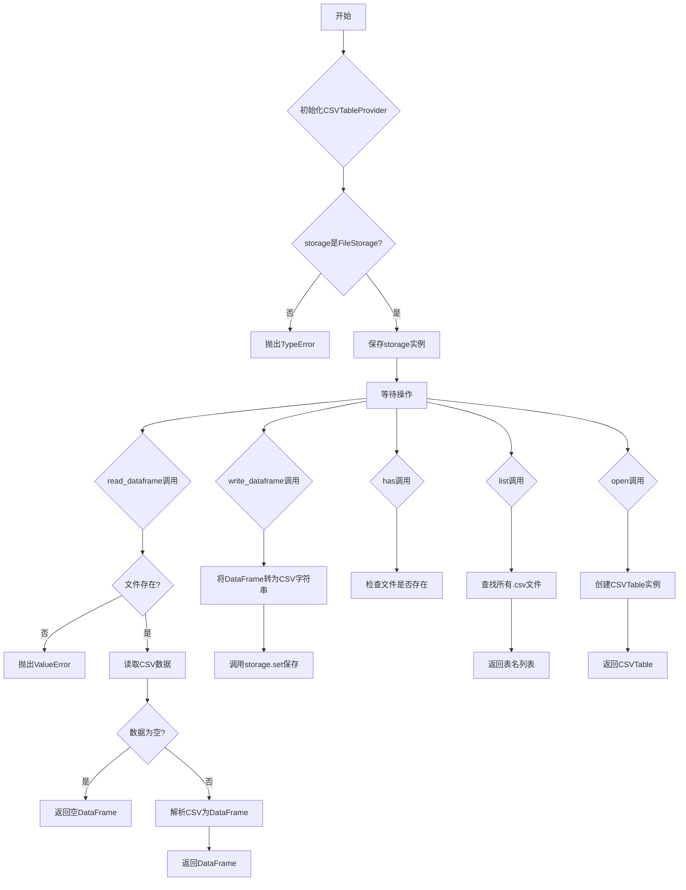
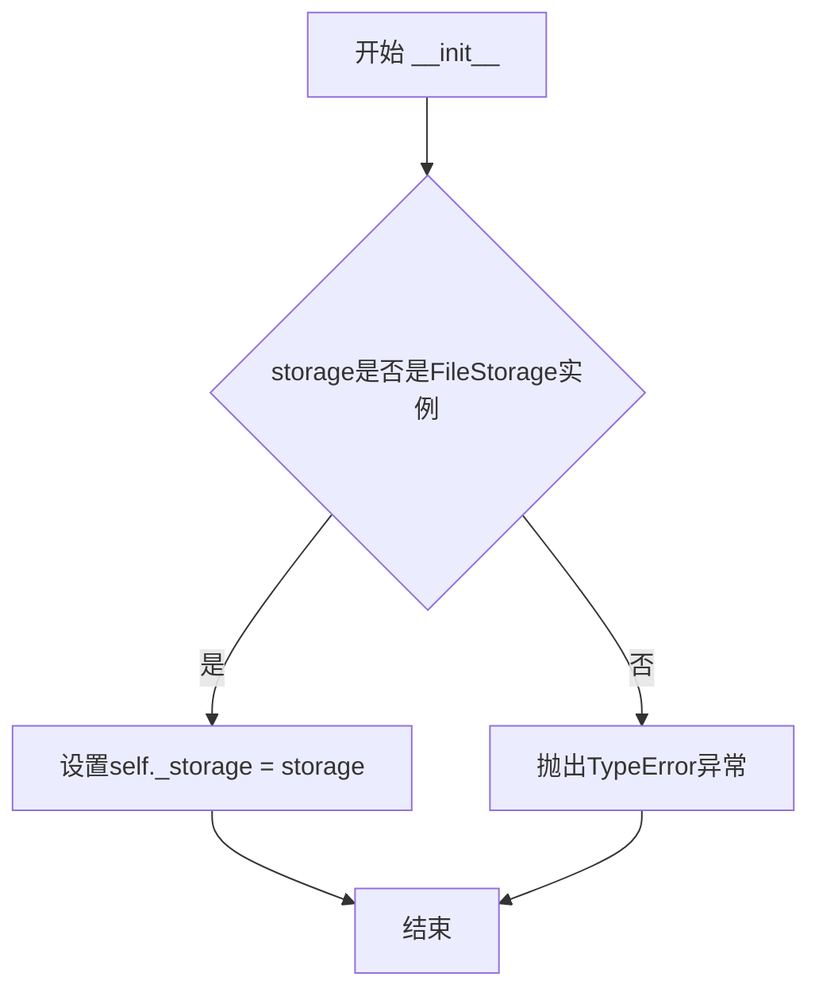
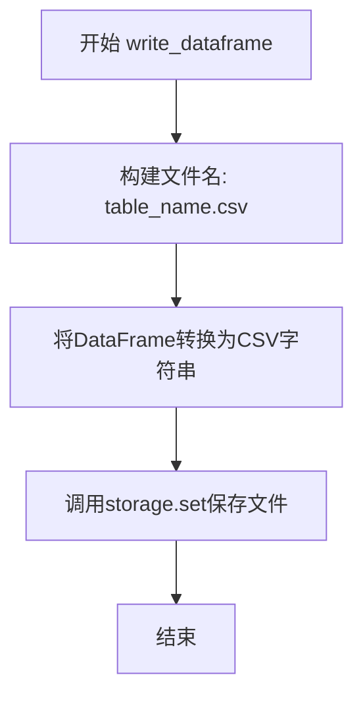
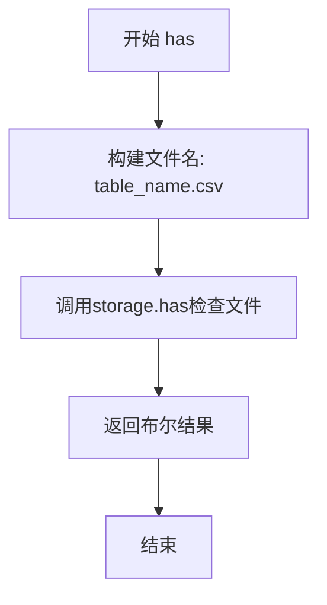
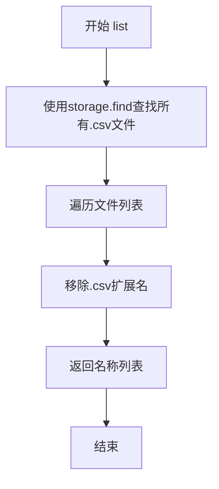
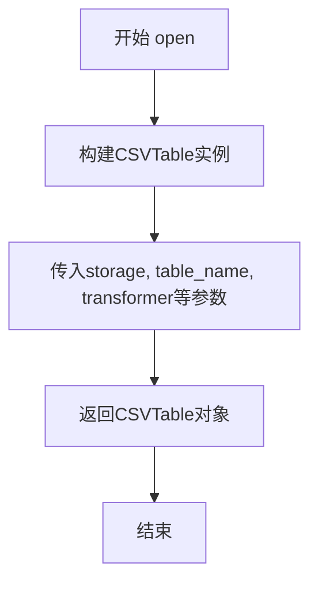
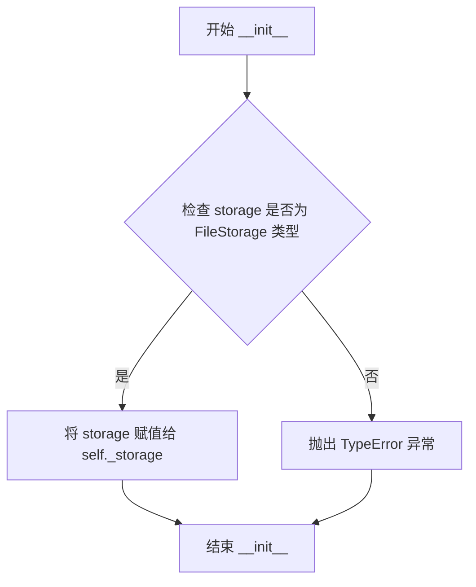
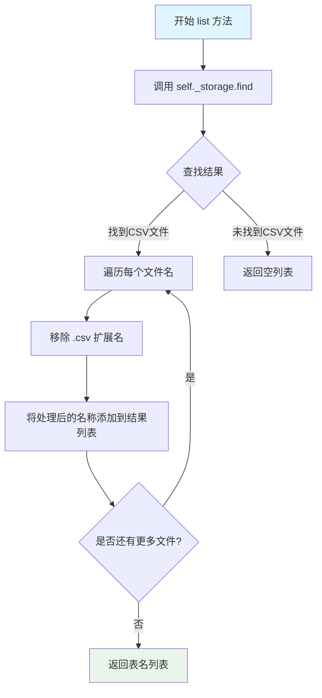
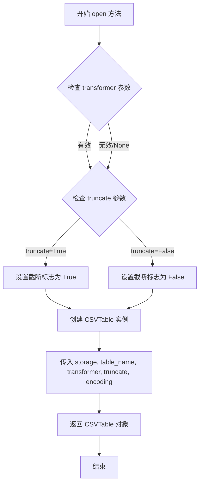

# `graphrag\packages\graphrag-storage\graphrag_storage\tables\csv_table_provider.py` 详细设计文档

CSV表格提供者实现类，负责将表格数据以CSV格式存储在底层存储后端中，支持DataFrame和流式两种读写方式。

## 整体流程



## 类结构

```
TableProvider (抽象基类)
└── CSVTableProvider (CSV表格提供者实现类)
```

## 全局变量及字段


### `logger`
    
模块级日志记录器，用于记录CSVTableProvider的操作日志

类型：`logging.Logger`
    


### `CSVTableProvider._storage`
    
底层存储实例，用于读写CSV文件

类型：`Storage`
    
    

## 全局函数及方法


## 设计文档：CSVTableProvider

### CSVTableProvider

CSVTableProvider是一个基于CSV文件的表格提供者实现类，继承自TableProvider基类。该类使用底层的Storage实例来读写CSV格式的表格数据，支持与pandas DataFrame之间的双向转换，并提供流式访问CSV表的能力。

#### 类字段

- `_storage`：`Storage`，底层存储实例，用于CSV文件的读写操作

#### 类方法

- `__init__`
- `read_dataframe`
- `write_dataframe`
- `has`
- `list`
- `open`

---

### CSVTableProvider.__init__

初始化CSVTableProvider实例，接受一个Storage实例作为底层存储。

参数：

- `storage`：`Storage`，存储实例，用于读取和写入CSV文件
- `**kwargs`：`Any`，额外关键字参数（当前未使用）

返回值：`None`，构造函数无返回值

#### 流程图



#### 带注释源码

```python
def __init__(self, storage: Storage, **kwargs) -> None:
    """Initialize the CSV table provider with an underlying storage instance.

    Args
    ----
        storage: Storage
            The storage instance to use for reading and writing csv files.
        **kwargs: Any
            Additional keyword arguments (currently unused).
    """
    # 检查storage是否为FileStorage类型，因为CSVTableProvider目前仅支持FileStorage后端
    if not isinstance(storage, FileStorage):
        msg = "CSVTableProvider only works with FileStorage backends for now. "
        raise TypeError(msg)
    # 保存底层存储实例供后续方法使用
    self._storage = storage
```

---

### CSVTableProvider.read_dataframe

从存储中读取表格并返回为pandas DataFrame对象。

参数：

- `table_name`：`str`，要读取的表格名称，文件将以'{table_name}.csv'形式访问

返回值：`pd.DataFrame`，从CSV文件加载的表格数据

异常：

- `ValueError`：如果表格文件在存储中不存在
- `Exception`：如果读取或解析CSV文件时发生错误

#### 流程图

```mermaid
flowchart TD
    A[开始 read_dataframe] --> B[构建文件名: table_name.csv]
    B --> C{storage.has(filename)?}
    C -->|否| D[抛出ValueError: 文件不存在]
    C -->|是| E[调用storage.get获取CSV数据]
    F{csv_data是否为空?}
    F -->|是| G[返回空DataFrame]
    F -->|否| H[使用pandas解析CSV]
    I[返回DataFrame]
    D --> J[结束]
    E --> F
    G --> J
    H --> I
    I --> J
```

#### 带注释源码

```python
async def read_dataframe(self, table_name: str) -> pd.DataFrame:
    """Read a table from storage as a pandas DataFrame.

    Args
    ----
        table_name: str
            The name of the table to read. The file will be accessed as '{table_name}.csv'.

    Returns
    -------
        pd.DataFrame:
            The table data loaded from the csv file.

    Raises
    ------
        ValueError:
            If the table file does not exist in storage.
        Exception:
            If there is an error reading or parsing the csv file.
    """
    # 构造完整的CSV文件名
    filename = f"{table_name}.csv"
    # 检查文件是否存在，不存在则抛出ValueError
    if not await self._storage.has(filename):
        msg = f"Could not find {filename} in storage!"
        raise ValueError(msg)
    try:
        logger.info("reading table from storage: %s", filename)
        # 从存储中获取CSV数据，as_bytes=False表示返回字符串格式
        csv_data = await self._storage.get(filename, as_bytes=False)
        # 处理空CSV（pandas无法解析没有列的文件）
        if not csv_data or csv_data.strip() == "":
            return pd.DataFrame()
        # 使用StringIO将字符串转换为文件对象，keep_default_na=False保留空字符串为空值
        return pd.read_csv(StringIO(csv_data), keep_default_na=False)
    except Exception:
        logger.exception("error loading table from storage: %s", filename)
        raise
```

---

### CSVTableProvider.write_dataframe

将pandas DataFrame写入存储为CSV文件。

参数：

- `table_name`：`str`，要写入的表格名称，文件将保存为'{table_name}.csv'
- `df`：`pd.DataFrame`，要写入存储的DataFrame

返回值：`None`，该方法无返回值

#### 流程图



#### 带注释源码

```python
async def write_dataframe(self, table_name: str, df: pd.DataFrame) -> None:
    """Write a pandas DataFrame to storage as a CSV file.

    Args
    ----
        table_name: str
            The name of the table to write. The file will be saved as '{table_name}.csv'.
        df: pd.DataFrame
            The DataFrame to write to storage.
    """
    # 将DataFrame转换为CSV字符串（index=False表示不写入行索引）
    # 然后通过storage.set方法异步保存到存储中
    await self._storage.set(f"{table_name}.csv", df.to_csv(index=False))
```

---

### CSVTableProvider.has

检查表格是否存在于存储中。

参数：

- `table_name`：`str`，要检查的表格名称

返回值：`bool`，如果表格存在返回True，否则返回False

#### 流程图



#### 带注释源码

```python
async def has(self, table_name: str) -> bool:
    """Check if a table exists in storage.

    Args
    ----
        table_name: str
            The name of the table to check.

    Returns
    -------
        bool:
            True if the table exists, False otherwise.
    """
    # 检查对应CSV文件是否存在于存储中
    return await self._storage.has(f"{table_name}.csv")
```

---

### CSVTableProvider.list

列出存储中所有表格名称。

参数：

- 无

返回值：`list[str]`，表格名称列表（不含.csv扩展名）

#### 流程图



#### 带注释源码

```python
def list(self) -> list[str]:
    """List all table names in storage.

    Returns
    -------
        list[str]:
            List of table names (without .csv extension).
    """
    # 使用正则表达式查找所有以.csv结尾的文件
    # 然后移除扩展名返回纯表格名称列表
    return [
        file.replace(".csv", "")
        for file in self._storage.find(re.compile(r"\.csv$"))
    ]
```

---

### CSVTableProvider.open

打开表格进行流式读写操作。

参数：

- `table_name`：`str`，要打开的表格名称
- `transformer`：`RowTransformer | None`，可选的行转换器，用于转换每一行数据
- `truncate`：`bool`，如果为True，首次写入时截断文件，默认为True
- `encoding`：`str`，读写CSV文件的字符编码，默认为"utf-8"

返回值：`CSVTable`，返回CSVTable实例用于流式操作

#### 流程图



#### 带注释源码

```python
def open(
    self,
    table_name: str,
    transformer: RowTransformer | None = None,
    truncate: bool = True,
    encoding: str = "utf-8",
) -> CSVTable:
    """Open table for streaming.

    Args:
        table_name: Name of the table to open
        transformer: Optional callable to transform each row
        truncate: If True, truncate file on first write
        encoding: Character encoding for reading/writing CSV files.
            Defaults to "utf-8".
    """
    # 创建并返回一个CSVTable实例，用于对CSV文件进行流式读写
    # CSVTable封装了底层的storage操作，提供迭代器式的访问方式
    return CSVTable(
        self._storage,
        table_name,
        transformer=transformer,
        truncate=truncate,
        encoding=encoding,
    )
```

---

## 关键组件信息

| 组件名称 | 描述 |
|---------|------|
| CSVTableProvider | CSV表格提供者实现类，负责CSV文件与DataFrame之间的转换 |
| Storage | 底层存储抽象接口，提供文件读写能力 |
| FileStorage | 文件存储实现类，CSVTableProvider要求使用FileStorage |
| CSVTable | CSV表格流式访问类，提供迭代器方式读写CSV数据 |
| pandas (pd) | 数据处理库，用于DataFrame与CSV格式的相互转换 |

---

## 潜在技术债务与优化空间

1. **存储类型限制**：当前CSVTableProvider仅支持FileStorage，限制了其在其他存储后端（如blob、cosmos）的使用

2. **错误处理粒度**：read_dataframe方法捕获所有异常并重新抛出，缺乏细粒度的错误分类处理

3. **编码处理**：虽然open方法支持encoding参数，但read_dataframe和write_dataframe方法未暴露编码选项

4. **性能优化**：write_dataframe方法每次都进行完整的DataFrame到CSV转换，大文件场景可以考虑流式写入

5. **缺少异步批量操作**：当前没有提供批量读取/写入多个表的方法

---

## 其他项目

### 设计目标与约束

- **核心目标**：提供基于CSV文件的表格存储抽象，统一DataFrame与CSV格式的转换接口
- **约束**：仅支持FileStorage作为底层存储后端

### 错误处理与异常设计

- 使用ValueError表示文件不存在的业务逻辑错误
- 使用TypeError在初始化时约束存储类型
- 底层异常通过logger.exception记录后重新抛出，保留完整堆栈信息

### 数据流与状态机

- **读取流程**：storage.get → StringIO转换 → pandas.read_csv → DataFrame
- **写入流程**：DataFrame.to_csv → storage.set → CSV文件
- **列表流程**：storage.find → 正则过滤 → 名称提取

### 外部依赖与接口契约

- 依赖`graphrag_storage.storage.Storage`抽象接口
- 依赖`graphrag_storage.tables.table_provider.TableProvider`基类
- 依赖`pandas`库进行数据处理
- 依赖`FileStorage`具体实现类


### `CSVTableProvider.__init__`

初始化 CSV 表格提供者，使用底层存储实例。该方法验证传入的存储对象是否为 FileStorage 类型，并将其存储为内部属性供后续操作使用。

参数：

- `storage`：`Storage`，用于读写 CSV 文件的存储实例
- `**kwargs`：`Any`，额外的关键字参数（当前未使用）

返回值：`None`，无返回值

#### 流程图



#### 带注释源码

```python
def __init__(self, storage: Storage, **kwargs) -> None:
    """Initialize the CSV table provider with an underlying storage instance.

    Args
    ----
        storage: Storage
            The storage instance to use for reading and writing csv files.
        **kwargs: Any
            Additional keyword arguments (currently unused).
    """
    # 验证 storage 参数是否为 FileStorage 类型
    # CSVTableProvider 当前仅支持 FileStorage 后端
    if not isinstance(storage, FileStorage):
        msg = "CSVTableProvider only works with FileStorage backends for now. "
        raise TypeError(msg)
    # 将验证通过的 storage 实例保存为内部属性
    # 供后续 read_dataframe、write_dataframe 等方法使用
    self._storage = storage
```


### `CSVTableProvider.read_dataframe`

该方法通过底层存储接口异步读取指定名称的 CSV 文件，并将其解析为 pandas DataFrame 返回，同时处理文件不存在和空文件等边界情况。

参数：

- `table_name`：`str`，要读取的表格名称，实际访问的文件为 `{table_name}.csv`

返回值：`pd.DataFrame`，从 CSV 文件加载的表格数据

#### 流程图

```mermaid
flowchart TD
    A[开始 read_dataframe] --> B[构建文件名: table_name + '.csv']
    B --> C{存储中是否存在该文件?}
    C -->|否| D[抛出 ValueError: 文件不存在]
    C -->|是| E[调用 storage.get 读取文件内容]
    E --> F{文件内容是否为空?}
    F -->|是| G[返回空 DataFrame: pd.DataFrame()]
    F -->|否| H[使用 pd.read_csv 解析 CSV 数据]
    H --> I[返回解析后的 DataFrame]
    
    D --> J[结束]
    G --> J
    I --> J
    
    style D fill:#ffcccc
    style G fill:#ccffcc
    style I fill:#ccffcc
```

#### 带注释源码

```python
async def read_dataframe(self, table_name: str) -> pd.DataFrame:
    """Read a table from storage as a pandas DataFrame.

    Args
    ----
        table_name: str
            The name of the table to read. The file will be accessed as '{table_name}.csv'.

    Returns
    -------
        pd.DataFrame:
            The table data loaded from the csv file.

    Raises
    ------
        ValueError:
            If the table file does not exist in storage.
        Exception:
            If there is an error reading or parsing the csv file.
    """
    # 步骤1: 根据表名构造CSV文件名
    filename = f"{table_name}.csv"
    
    # 步骤2: 检查文件是否存在于存储中
    if not await self._storage.has(filename):
        # 文件不存在时抛出 ValueError
        msg = f"Could not find {filename} in storage!"
        raise ValueError(msg)
    
    try:
        # 步骤3: 记录日志信息
        logger.info("reading table from storage: %s", filename)
        
        # 步骤4: 异步读取文件内容（as_bytes=False 返回字符串）
        csv_data = await self._storage.get(filename, as_bytes=False)
        
        # 步骤5: 处理空CSV文件（pandas无法解析无列的空文件）
        if not csv_data or csv_data.strip() == "":
            return pd.DataFrame()
        
        # 步骤6: 使用 StringIO 将字符串转为文件对象，解析为 DataFrame
        # keep_default_na=False 保持空字符串而非转为 NaN
        return pd.read_csv(StringIO(csv_data), keep_default_na=False)
        
    except Exception:
        # 步骤7: 捕获异常，记录日志后重新抛出
        logger.exception("error loading table from storage: %s", filename)
        raise
```


### `CSVTableProvider.write_dataframe`

将 pandas DataFrame 对象以 CSV 格式写入底层存储的异步方法，通过将 DataFrame 转换为 CSV 字符串并调用存储后端的 set 方法实现数据的持久化。

参数：

- `table_name`：`str`，目标表的名称，文件将以 `{table_name}.csv` 的形式存储
- `df`：`pd.DataFrame`，要写入存储的 pandas DataFrame 对象

返回值：`None`，该方法不返回任何值

#### 流程图

```mermaid
flowchart TD
    A[开始 write_dataframe] --> B[拼接文件名<br/>filename = f"{table_name}.csv"]
    B --> C[将DataFrame转换为CSV字符串<br/>csv_data = df.to_csv(index=False)]
    C --> D[调用存储后端set方法<br/>await self._storage.set]
    D --> E{是否成功}
    E -->|成功| F[结束 - 数据已写入]
    E -->|失败| G[抛出异常]
```

#### 带注释源码

```python
async def write_dataframe(self, table_name: str, df: pd.DataFrame) -> None:
    """Write a pandas DataFrame to storage as a CSV file.

    Args
    ----
        table_name: str
            The name of the table to write. The file will be saved as '{table_name}.csv'.
        df: pd.DataFrame
            The DataFrame to write to storage.
    """
    # 将表名与.csv后缀拼接形成完整文件名
    # 调用存储后层的set方法写入数据
    # df.to_csv(index=False) 将DataFrame转换为CSV字符串，其中index=False表示不写入pandas的行索引
    await self._storage.set(f"{table_name}.csv", df.to_csv(index=False))
```


### `CSVTableProvider.has`

检查指定表是否存在于存储中，通过构造CSV文件名并调用底层存储的has方法来判断文件是否存在。

参数：

- `table_name`：`str`，要检查的表名称（不含.csv扩展名）

返回值：`bool`，如果表存在于存储中返回True，否则返回False

#### 流程图

```mermaid
flowchart TD
    A[开始检查表是否存在] --> B[接收table_name参数]
    B --> C[构造文件名: table_name + '.csv']
    C --> D{调用_storage.has(filename)}
    D -->|文件存在| E[返回True]
    D -->|文件不存在| F[返回False]
    E --> G[结束]
    F --> G
```

#### 带注释源码

```python
async def has(self, table_name: str) -> bool:
    """Check if a table exists in storage.

    Args
    ----
        table_name: str
            The name of the table to check.

    Returns
    -------
        bool:
            True if the table exists, False otherwise.
    """
    # 构造CSV文件名：表名 + .csv扩展名
    # 然后委托给底层存储后端检查该文件是否存在
    return await self._storage.has(f"{table_name}.csv")
```


### `CSVTableProvider.list()`

列出存储中所有CSV表格的名称（不含扩展名）。该方法通过底层存储的查找功能获取所有以`.csv`结尾的文件，并移除扩展名后返回表名列表。

参数：

- `self`：`CSVTableProvider` 自身实例，无需显式传递

返回值：`list[str]`，返回存储中所有CSV表格名称的列表（不含 `.csv` 扩展名）

#### 流程图



#### 带注释源码

```python
def list(self) -> list[str]:
    """List all table names in storage.

    Returns
    -------
        list[str]:
            List of table names (without .csv extension).
    """
    # 使用正则表达式匹配所有以 .csv 结尾的文件
    # re.compile(r"\.csv$") 创建正则表达式，$ 表示字符串结尾
    # find 方法返回所有匹配的文件名列表
    csv_files = self._storage.find(re.compile(r"\.csv$"))
    
    # 列表推导式：遍历所有CSV文件名，移除扩展名
    # 例如："users.csv" -> "users", "products.csv" -> "products"
    return [
        file.replace(".csv", "")  # 移除 .csv 扩展名
        for file in csv_files     # 遍历存储中找到的所有CSV文件
    ]
```


### `CSVTableProvider.open`

打开CSV表进行流式读写操作。该方法返回一个`CSVTable`实例，允许对CSV文件进行流式读取和写入，支持可选的行转换器、文件截断选项和字符编码配置。

参数：

- `table_name`：`str`，要打开的表的名称
- `transformer`：`RowTransformer | None`，可选的可调用对象，用于转换每一行数据，默认为`None`
- `truncate`：`bool`，如果为`True`，则在首次写入时截断文件内容，默认为`True`
- `encoding`：`str`，读写CSV文件时使用的字符编码，默认为`"utf-8"`

返回值：`CSVTable`，返回一个CSVTable实例，用于流式操作CSV表数据

#### 流程图



#### 带注释源码

```python
def open(
    self,
    table_name: str,
    transformer: RowTransformer | None = None,
    truncate: bool = True,
    encoding: str = "utf-8",
) -> CSVTable:
    """Open table for streaming.

    Args:
        table_name: Name of the table to open
        transformer: Optional callable to transform each row
        truncate: If True, truncate file on first write
        encoding: Character encoding for reading/writing CSV files.
            Defaults to "utf-8".
    """
    # 创建一个CSVTable实例，传入存储后端、表名、转换器、截断标志和编码
    return CSVTable(
        self._storage,          # 底层存储后端（FileStorage实例）
        table_name,             # CSV文件名（不含.csv扩展名）
        transformer=transformer,  # 行转换器回调函数
        truncate=truncate,        # 是否截断文件标志
        encoding=encoding,        # 字符编码格式
    )
```

## 关键组件


### CSVTableProvider 类

CSV表格提供者，负责将表格数据存储为CSV文件格式，通过底层的FileStorage实例进行读写操作，支持DataFrame与CSV格式之间的双向转换。

### 存储后端集成

通过FileStorage接口与各种存储后端（文件、blob、cosmos等）集成，只支持FileStorage类型的存储实例，并在初始化时进行类型检查。

### DataFrame 转换器

使用pandas库将DataFrame转换为CSV格式（to_csv），以及从CSV数据解析为DataFrame（read_csv），并处理空CSV文件的情况。

### 表操作接口

提供完整的表操作能力：read_dataframe（读取表为DataFrame）、write_dataframe（写入DataFrame为CSV）、has（检查表是否存在）、list（列出所有表）、open（打开表进行流式处理）。

### 异步I/O支持

所有存储操作都采用async/await异步模式，包括has、get、set等操作，提高I/O效率。

### CSVTable 流式处理

通过open方法返回CSVTable实例，支持流式读取/写入，可以配合RowTransformer进行行级别数据转换，并支持文件截断和字符编码设置。

### 文件名映射规则

表名自动映射为CSV文件名（table_name.csv），list方法返回时移除.csv后缀，保持表名与文件名的对应关系。

### 错误处理机制

在读取数据时捕获异常并记录日志，抛出ValueError表示文件不存在，抛出其他异常表示读取或解析错误。


## 问题及建议


### 已知问题

-   **存储类型限制过严**：`__init__` 方法强制要求 `FileStorage` 类型，但类文档说明支持 file、blob、cosmos 等多种后端，存在文档与实现不一致的问题
-   **异步一致性缺失**：`list()` 方法为同步方法，而其他方法（`read_dataframe`、`write_dataframe`、`has`）均为异步方法，API 风格不统一
-   **异常处理不一致**：`read_dataframe` 方法有完整的异常捕获和日志记录，而 `write_dataframe`、`has`、`list` 方法缺少错误处理
-   **编码参数未完全使用**：`read_dataframe` 方法未使用 `encoding` 参数，而 `open()` 方法使用了，造成 API 不对称
-   **缺少输入验证**：未对 `table_name` 参数进行安全校验，存在潜在的路径遍历风险（如 `table_name = "../../../etc/passwd"`）
-   **空 DataFrame 写入处理**：`write_dataframe` 方法未处理空 DataFrame 写入的场景，可能产生空 CSV 文件
-   **配置参数未使用**：`__init__` 接收 `**kwargs` 参数但完全未使用

### 优化建议

-   移除 `FileStorage` 类型强制约束，或更新文档说明当前仅支持 FileStorage，或实现对其他存储类型的支持
-   将 `list()` 方法改为异步方法，与其他方法保持一致的异步风格
-   为 `write_dataframe`、`has`、`list` 方法添加统一的异常处理和日志记录
-   在 `read_dataframe` 方法中添加 `encoding` 参数支持，或移除 `open()` 方法的 `encoding` 参数以保持一致
-   添加 `table_name` 参数验证逻辑，过滤非法字符或路径遍历模式
-   在 `write_dataframe` 中添加空 DataFrame 判断逻辑，根据业务需求决定是否写入空文件
-   移除未使用的 `**kwargs` 参数，或将其用于传递存储配置选项（如缓存策略、连接池参数等）

## 其它


### 设计目标与约束

本模块的设计目标是提供一个基于CSV文件的表格存储抽象层，将pandas DataFrame与底层存储后端解耦，支持文件、Blob、Cosmos等多种存储类型。主要约束包括：仅支持FileStorage类型后端（构造函数中强制检查）、依赖pandas库进行CSV解析、CSV文件命名必须以.table_name.csv格式存储、不支持事务性操作、写入操作会覆盖整个文件。

### 错误处理与异常设计

错误处理采用分层设计：构造函数中TypeError（存储类型不匹配）、read_dataframe中ValueError（文件不存在）和通用Exception（读取/解析失败）、write_dataframe中隐式传递Storage层的异常。所有异常均通过logger.exception记录完整堆栈信息后重新抛出，由上层调用者处理。空CSV文件被特殊处理为返回空DataFrame而非抛出解析错误。

### 数据流与状态机

数据流遵循"调用方→CSVTableProvider→Storage→文件系统"的单向流动。read_dataframe执行"文件名构造→存在性检查→读取原始数据→空值处理→CSV解析→DataFrame返回"的流程。write_dataframe执行"文件名构造→DataFrame序列化→存储写入"的流程。状态机主要体现在文件句柄管理：CSVTable实例通过open()方法创建，提供流式读写能力，truncate参数控制写入模式（截断或追加）。

### 外部依赖与接口契约

核心依赖包括：pandas（DataFrame操作与CSV解析）、graphrag_storage.storage.Storage（抽象存储层）、graphrag_storage.tables.table_provider.TableProvider（基类接口）、graphrag_storage.tables.csv_table.CSVTable（流式表格实现）、graphrag_storage.tables.table.RowTransformer（行转换器）。接口契约规定：所有async方法必须等待Storage操作完成、table_name参数自动拼接.csv后缀、list()方法返回不含扩展名的表名、open()返回CSVTable实例而非直接操作数据。

### 性能考量与限制

读取性能受制于Storage后端和网络延迟，整文件加载到内存后由pandas解析。写入性能取决于DataFrame规模，to_csv()操作在内存中完成。无法处理超大CSV文件（受限于内存），list()方法返回完整表名列表无分页机制。truncate=True时open()会清空文件内容，可能导致数据丢失风险。

### 线程安全与并发模型

本类非线程安全，async方法设计用于单线程事件循环环境。多个并发读操作理论上安全（Storage后端需保证），写操作需外部同步以避免竞态条件。CSVTable流式写入无内置锁机制，多线程场景下需使用者自行保护。

### 配置与扩展性

构造函数接受**kwargs但未使用，保留用于未来配置如缓存策略、压缩选项等。编码参数在open()方法中暴露（默认UTF-8），支持多语言CSV文件。RowTransformer允许自定义行级数据转换逻辑，提供扩展点。未来可通过继承TableProvider实现其他格式（如JSON、Parquet）的表格提供者。

### 安全性考量

未实现输入 sanitization，table_name直接拼接到文件名存在路径遍历风险（依赖Storage层防护）。CSV解析未限制文件大小，可能导致内存耗尽（DoS风险）。敏感数据存储需依赖底层Storage的加密能力，本层无额外保护机制。

    