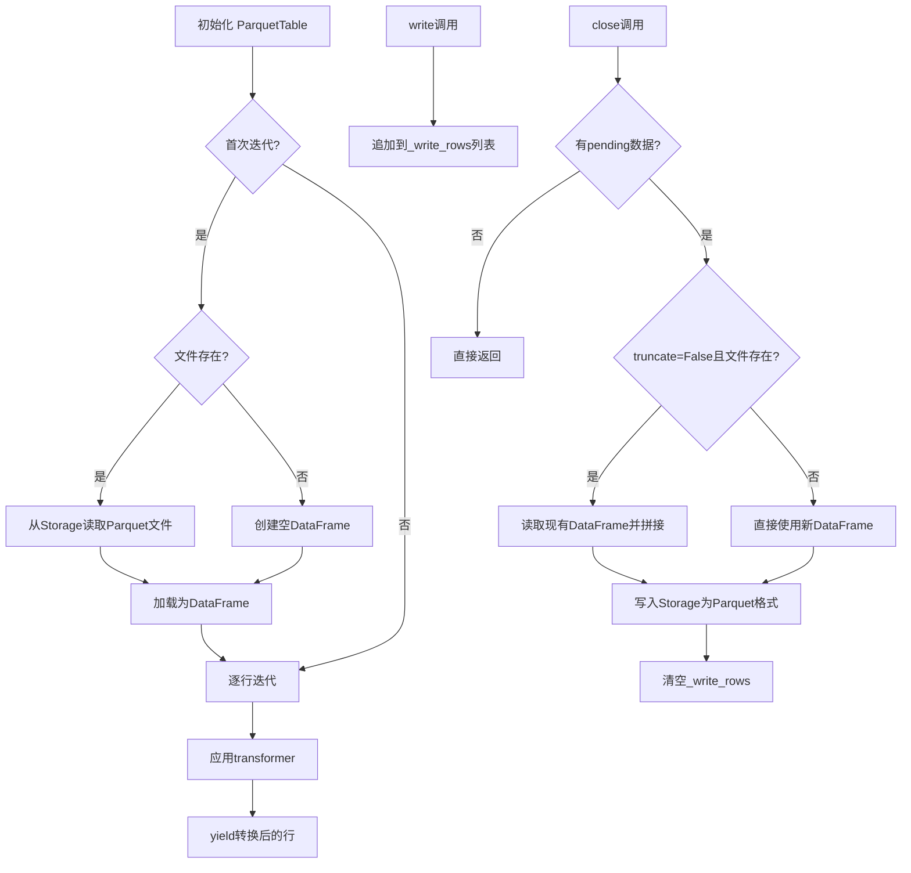
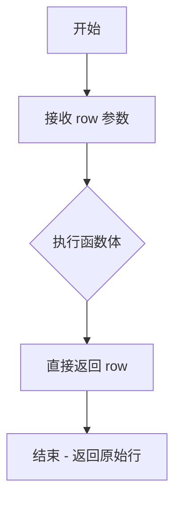
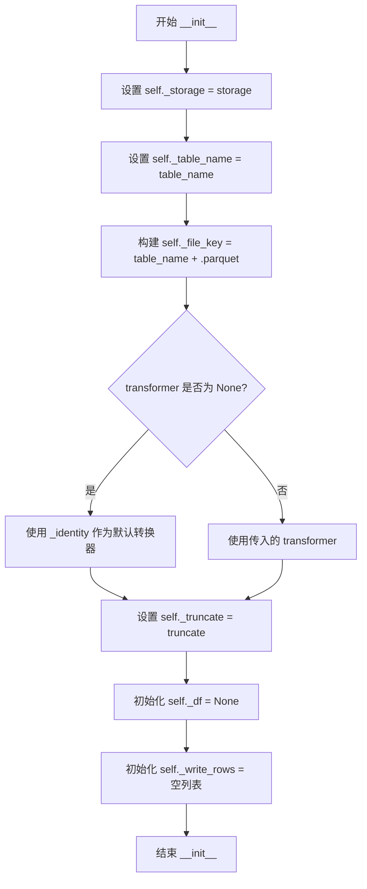
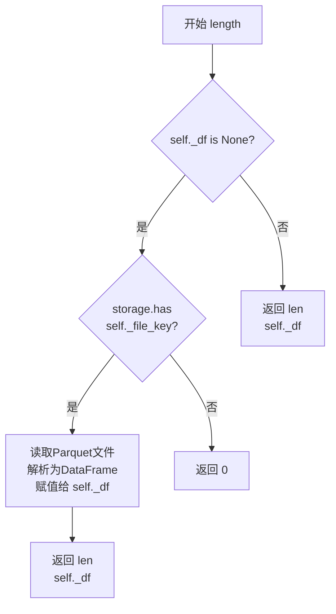
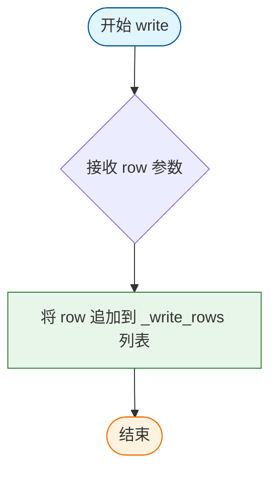
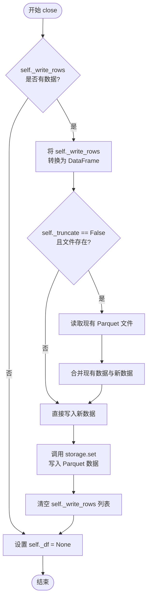

```mermaid
flowchart TD
    A([开始]) --> B[遍历表格中的所有行]
    B --> C{是否遍历完成?}
    C -->|是| D[返回 False]
    C -->|否| E{当前行是字典类型?}
    E -->|是| F{row.get&#40;'id'&#41; == row_id?}
    E -->|否| G{getattr&#40;row, 'id', None&#41; == row_id?}
    F -->|是| H[返回 True]
    F -->|否| B
    G -->|是| H
    G -->|否| B
    D --> I([结束])
    H --> I
```

# `graphrag\packages\graphrag-storage\graphrag_storage\tables\parquet_table.py` 详细设计文档

ParquetTable类提供了一个基于Parquet格式的表抽象模拟流式接口，通过内存DataFrame实现行级迭代和批量写入，支持可选的RowTransformer进行数据转换，同时保持Parquet格式对大规模数据的高效处理特性。

## 整体流程



## 类结构

```
Table (抽象基类)
└── ParquetTable (Parquet格式表实现)
```

## 全局变量及字段


### `_identity`
    
返回行不变的默认转换器函数

类型：`Callable[[dict[str, Any]], Any]`
    


### `_apply_transformer`
    
应用转换器到行的函数，支持callable和类类型

类型：`Callable[[RowTransformer, dict[str, Any]], Any]`
    


### `ParquetTable`
    
基于Parquet格式的Table抽象实现，通过模拟流式接口提供读写功能

类型：`class`
    


### `ParquetTable._storage`
    
存储后端实例，用于文件读写操作

类型：`Storage`
    


### `ParquetTable._table_name`
    
表名称，标识数据表的名称

类型：`str`
    


### `ParquetTable._file_key`
    
Parquet文件键名，包含表名和扩展名

类型：`str`
    


### `ParquetTable._transformer`
    
行转换器，用于在读写时转换行数据

类型：`RowTransformer | None`
    


### `ParquetTable._truncate`
    
是否覆盖写入，True表示覆盖，False表示追加

类型：`bool`
    


### `ParquetTable._df`
    
缓存的DataFrame，用于存储加载的Parquet数据

类型：`pd.DataFrame | None`
    


### `ParquetTable._write_rows`
    
待写入的行列表，用于批量写入前累积数据

类型：`list[dict[str, Any]]`
    
    

## 全局函数及方法


### `_identity`

该函数是一个恒等转换函数，接收一行字典数据后直接返回原数据，不做任何处理，作为默认的转换器使用。

参数：

-  `row`：`dict[str, Any]`，待转换的输入行数据

返回值：`Any`，返回与输入相同的行数据，未做任何修改

#### 流程图



#### 带注释源码

```python
def _identity(row: dict[str, Any]) -> Any:
    """Return row unchanged (default transformer).
    
    这是一个恒等转换函数，作为默认的转换器使用。
    当用户未指定自定义转换器时，系统会使用此函数，
    确保数据行在读取或写入过程中保持原样不变。
    
    Args:
        row: 输入的行数据字典，键为字符串，值为任意类型
        
    Returns:
        返回与输入完全相同的行数据字典，不进行任何转换
    """
    return row
```


### `_apply_transformer(transformer: RowTransformer, row: dict[str, Any]) -> Any`

将转换器应用到单行数据，根据转换器类型（类或可调用对象）采用不同的调用方式，支持 Pydantic 模型等类的实例化场景。

参数：

- `transformer`：`RowTransformer`，转换器实例，可以是 callable（函数）或 class（如 Pydantic 模型）
- `row`：`dict[str, Any]`，待转换的行数据字典

返回值：`Any`，转换后的数据，类型取决于转换器的返回类型

#### 流程图

```mermaid
flowchart TD
    A[开始: _apply_transformer] --> B{transformer 是否为类?}
    B -->|是| C[使用 **row 解包调用: transformer\*\*row]
    B -->|否| D[直接调用: transformer(row)]
    C --> E[返回实例化对象]
    D --> F[返回转换结果]
    E --> G[结束]
    F --> G
```

#### 带注释源码

```python
def _apply_transformer(transformer: RowTransformer, row: dict[str, Any]) -> Any:
    """Apply transformer to row, handling both callables and classes.

    If transformer is a class (e.g., Pydantic model), calls it with **row.
    Otherwise calls it with row as positional argument.

    Args:
        transformer: 转换器，可以是 callable 或 class 类型
        row: 行数据字典

    Returns:
        转换后的数据，类型由 transformer 决定
    """
    # 使用 inspect.isclass 检查 transformer 是否为类
    if inspect.isclass(transformer):
        # 如果是类（如 Pydantic 模型），将 row 字典解包为关键字参数传递
        # 例如: class Model(id: str, name: str); row = {'id': '1', 'name': 'test'}
        # 调用: Model(id='1', name='test')
        return transformer(**row)
    # 如果是 callable（函数或其他可调用对象），直接将 row 作为位置参数传递
    return transformer(row)
```


### `ParquetTable.__init__`

该方法用于初始化 ParquetTable 实例，配置存储后端、表名、行转换器及文件截断策略，同时初始化内部状态变量以支持后续的读写操作。

**参数：**

- `storage`：`Storage`，存储实例（File、Blob 或 Cosmos）
- `table_name`：`str`，表名（例如 "documents"）
- `transformer`：`RowTransformer | None`，可选的行转换器，接收字典并返回转换后的对象，默认为恒等函数
- `truncate`：`bool`，若为 True（默认），关闭时覆盖文件；为 False 时追加到现有文件

**返回值：** `None`，无返回值（`__init__` 方法）

#### 流程图



#### 带注释源码

```python
def __init__(
    self,
    storage: Storage,
    table_name: str,
    transformer: RowTransformer | None = None,
    truncate: bool = True,
):
    """Initialize with storage backend and table name.

    Args:
        storage: Storage instance (File, Blob, or Cosmos)
        table_name: Name of the table (e.g., "documents")
        transformer: Optional callable to transform each row before
            yielding. Receives a dict, returns a transformed dict.
            Defaults to identity (no transformation).
        truncate: If True (default), overwrite file on close.
            If False, append to existing file.
    """
    # 存储后端实例，用于后续的文件读写操作
    self._storage = storage
    # 表名标识
    self._table_name = table_name
    # 构建完整的 Parquet 文件键名（包含扩展名）
    self._file_key = f"{table_name}.parquet"
    # 若未提供转换器，则使用默认的恒等函数（不做任何转换）
    self._transformer = transformer or _identity
    # 文件截断策略：True 表示覆盖，False 表示追加
    self._truncate = truncate
    # 缓存已加载的 DataFrame，初始为 None（延迟加载）
    self._df: pd.DataFrame | None = None
    # 内存中的写缓冲队列，累积待写入的行数据
    self._write_rows: list[dict[str, Any]] = []
```


### ParquetTable.__aiter__

这是 `ParquetTable` 类的异步迭代器方法，提供逐行遍历 Parquet 表数据的能力。由于 Parquet 格式本身不支持真正的流式读取，该实现通过先将整个文件加载为 DataFrame，再使用 `iterrows()` 模拟流式访问，同时支持自定义行转换器（transformer）来转换每行数据。

参数：

- `self`：`ParquetTable`，对当前 `ParquetTable` 实例的引用，无需显式传递

返回值：`AsyncIterator[Any]`，异步迭代器对象，每次迭代 yield 一个行数据（字典或经过 transformer 转换后的类型，如 Pydantic 模型）

#### 流程图

```mermaid
flowchart TD
    Start[开始 __aiter__] --> CallImpl[调用 _aiter_impl 方法]
    
    subgraph _aiter_impl["_aiter_impl 实现"]
        CheckDF{self._df 是否为 None?}
        
        CheckFile{storage 是否有 parquet 文件?}
        
        ReadFile[读取文件为字节流]
        LoadDF[pd.read_parquet 加载为 DataFrame]
        CreateEmptyDF[创建空的 DataFrame]
        AssignDF[保存到 self._df]
        
        CheckDF -->|是| CheckFile
        CheckFile -->|是| ReadFile
        ReadFile --> LoadDF
        LoadDF --> AssignDF
        
        CheckFile -->|否| CreateEmptyDF
        CreateEmptyDF --> AssignDF
        
        CheckDF -->|否| UseExistingDF[使用已缓存的 self._df]
        AssignDF --> UseExistingDF
        
        Iterate[for _, row in self._df.iterrows]
        UseExistingDF --> Iterate
        
        ConvertDict[cast 将 row 转为 dict[str, Any]]
        Iterate --> ConvertDict
        
        ApplyTransformer{是否有 transformer?}
        ConvertDict --> ApplyTransformer
        
        YesTransform[调用 _apply_transformer 转换行]
        NoTransform[返回原始 row_dict]
        ApplyTransformer -->|是| YesTransform
        ApplyTransformer -->|否| NoTransform
        
        YieldRow[yield 转换后的行]
        YesTransform --> YieldRow
        NoTransform --> YieldRow
        
        HasMore{是否还有更多行?}
        YieldRow --> HasMore
        HasMore -->|是| Iterate
        HasMore -->|否| End[结束]
    end
    
    CallImpl --> ReturnIter[返回异步迭代器]
    ReturnIter --> End
```

#### 带注释源码

```python
def __aiter__(self) -> AsyncIterator[Any]:
    """Iterate through rows one at a time.

    Loads the entire DataFrame on first iteration, then yields rows
    one at a time with the transformer applied.

    Yields
    ------
        Any:
            Each row as dict or transformed type (e.g., Pydantic model).
    """
    # 直接返回异步生成器对象，实现惰性迭代
    # 实际的迭代逻辑在 _aiter_impl 中实现
    return self._aiter_impl()

async def _aiter_impl(self) -> AsyncIterator[Any]:
    """Implement async iteration over rows."""
    # 首次迭代时加载 DataFrame，后续迭代复用已加载的数据
    if self._df is None:
        # 检查 Parquet 文件是否存在于存储中
        if await self._storage.has(self._file_key):
            # 从存储获取文件内容（字节流）
            data = await self._storage.get(self._file_key, as_bytes=True)
            # 使用 pandas 读取 Parquet 格式到 DataFrame
            self._df = pd.read_parquet(BytesIO(data))
        else:
            # 文件不存在时创建空 DataFrame
            self._df = pd.DataFrame()

    # 遍历 DataFrame 的每一行（模拟流式读取）
    # iterrows 返回 (index, row) 元组，这里用 _ 忽略 index
    for _, row in self._df.iterrows():
        # 将 pandas Series 转换为 Python 字典
        row_dict = cast("dict[str, Any]", row.to_dict())
        # 应用行转换器（如果有），支持字典或 Pydantic 模型
        yield _apply_transformer(self._transformer, row_dict)
```


### `ParquetTable._aiter_impl`

实现异步迭代器，通过加载整个 Parquet 文件到内存的 DataFrame 中，然后逐行遍历并应用转换器返回每一行。

参数：

- `self`：隐式参数，表示 `ParquetTable` 实例本身

返回值：`AsyncIterator[Any]`，异步生成器，逐行yield转换后的数据

#### 流程图

```mermaid
flowchart TD
    A[开始 _aiter_impl] --> B{self._df 是否为 None?}
    B -->|是| C{storage 中是否存在 self._file_key?}
    C -->|是| D[从 storage 获取文件数据]
    D --> E[使用 pd.read_parquet 读取为 DataFrame]
    E --> F[赋值给 self._df]
    C -->|否| G[创建空的 pd.DataFrame]
    G --> F
    B -->|否| H[直接使用已加载的 self._df]
    F --> H
    H --> I[遍历 self._df.iterrows]
    I --> J[将每行转换为 dict]
    J --> K{transformer 是否为类?}
    K -->|是| L[调用 transformer(**row_dict)]
    K -->|否| M[调用 transformer(row_dict)]
    L --> N[yield 转换后的行]
    M --> N
    N --> O{还有更多行?}
    O -->|是| I
    O -->|否| P[结束]
```

#### 带注释源码

```python
async def _aiter_impl(self) -> AsyncIterator[Any]:
    """Implement async iteration over rows."""
    # 检查 DataFrame 是否已加载；若未加载则从存储读取
    if self._df is None:
        # 检查 Parquet 文件是否存在于存储中
        if await self._storage.has(self._file_key):
            # 从存储获取文件内容（字节流）
            data = await self._storage.get(self._file_key, as_bytes=True)
            # 使用 pandas 读取 Parquet 数据到 DataFrame
            self._df = pd.read_parquet(BytesIO(data))
        else:
            # 文件不存在时创建空 DataFrame
            self._df = pd.DataFrame()

    # 遍历 DataFrame 的每一行（iterrows 返回索引和行对象）
    for _, row in self._df.iterrows():
        # 将 pandas Series 转换为 Python 字典
        row_dict = cast("dict[str, Any]", row.to_dict())
        # 应用 transformer（如果是类则解包字典调用，否则直接传参）
        yield _apply_transformer(self._transformer, row_dict)
```


### `ParquetTable.length`

返回表格中的行数。如果数据尚未加载，则从存储中读取Parquet文件并加载为DataFrame后返回行数；如果文件不存在则返回0。

参数：

- `self`：`ParquetTable` 实例，隐式参数，表示当前表格对象

返回值：`int`，表格中的行数

#### 流程图



#### 带注释源码

```python
async def length(self) -> int:
    """Return the number of rows in the table."""
    # 检查DataFrame是否已加载到内存
    if self._df is None:
        # DataFrame未加载，检查Parquet文件是否存在于存储中
        if await self._storage.has(self._file_key):
            # 文件存在，从存储获取文件内容（字节形式）
            data = await self._storage.get(self._file_key, as_bytes=True)
            # 使用pandas将字节数据解析为Parquet格式的DataFrame
            self._df = pd.read_parquet(BytesIO(data))
        else:
            # 文件不存在，说明表格为空，返回0
            return 0
    # DataFrame已加载，返回其行数
    return len(self._df)
```


### `ParquetTable.has`

检查是否存在指定 ID 的行

参数：

-  `row_id`：`str`，要检查的行 ID

返回值：`bool`，如果存在指定 ID 的行则返回 True，否则返回 False

#### 流程图



#### 带注释源码

```python
async def has(self, row_id: str) -> bool:
    """Check if row with given ID exists.
    
    遍历表格中的所有行，检查是否存在行的 id 字段
    与给定 row_id 匹配。兼容字典类型行和具有 id 属性的对象。
    
    Args:
        row_id: 要查找的行 ID
        
    Returns:
        bool: 如果找到匹配的行返回 True，否则返回 False
    """
    # 异步遍历表格中的每一行（使用 __aiter__ 和 _aiter_impl）
    async for row in self:
        # 判断当前行是否为字典类型
        if isinstance(row, dict):
            # 字典类型：通过 get 方法获取 'id' 字段并比较
            if row.get("id") == row_id:
                return True  # 找到匹配，返回 True
        else:
            # 非字典类型（如 Pydantic 模型）：通过 getattr 获取 id 属性并比较
            if getattr(row, "id", None) == row_id:
                return True  # 找到匹配，返回 True
    # 遍历完成未找到匹配，返回 False
    return False
```


### `ParquetTable.write`

将单行数据追加到内存缓冲区，等待后续批量写入 Parquet 文件。该方法采用"先积累后刷新"的设计模式，行数据暂存于内存列表中，直至调用 `close()` 方法时才将所有累积的行批量写入存储。

参数：

- `row`：`dict[str, Any]`，表示要写入的单行数据，以字典形式传递

返回值：`None`，无返回值

#### 流程图



#### 带注释源码

```python
async def write(self, row: dict[str, Any]) -> None:
    """Accumulate a single row for later batch write.

    Rows are stored in memory and written to Parquet format
    when close() is called.

    Args
    ----
        row: Dictionary representing a single row to write.
    """
    # 将接收到的行字典追加到内部缓冲区 _write_rows
    # 实际持久化操作延迟到 close() 方法执行
    self._write_rows.append(row)
```


### `ParquetTable.close`

该方法用于将内存中累积的行数据刷新到 Parquet 文件中，并释放相关资源。它会检查是否有待写入的行，如果有则将其转换为 DataFrame 并根据 `truncate` 配置决定是覆盖还是追加到现有文件，最后清空内部状态以释放内存。

参数： 无

返回值：`None`，无返回值

#### 流程图



#### 带注释源码

```python
async def close(self) -> None:
    """Flush accumulated rows to Parquet file and release resources.

    Converts all accumulated rows to a DataFrame and writes
    to storage as a Parquet file. If truncate=False and file exists,
    appends to existing data.
    """
    # 检查是否有待写入的行数据
    if self._write_rows:
        # 将累积的行字典列表转换为 pandas DataFrame
        new_df = pd.DataFrame(self._write_rows)
        
        # 如果不是截断模式（append模式）且文件已存在
        if not self._truncate and await self._storage.has(self._file_key):
            # 从存储中获取现有的 Parquet 文件数据
            existing_data = await self._storage.get(self._file_key, as_bytes=True)
            # 读取为 DataFrame
            existing_df = pd.read_parquet(BytesIO(existing_data))
            # 将新数据追加到现有数据后面，重置索引
            new_df = pd.concat([existing_df, new_df], ignore_index=True)
        
        # 将 DataFrame 转换为 Parquet 格式并写入存储
        await self._storage.set(self._file_key, new_df.to_parquet())
        # 清空待写入的行列表，释放内存
        self._write_rows = []

    # 释放 DataFrame 资源，设为 None 以便垃圾回收
    self._df = None
```

## 关键组件


### ParquetTable 类

Parquet格式表的流式接口模拟实现，通过加载整个DataFrame后使用iterrows()逐行迭代，模拟行级流式读取；写入时先将行累积在内存中，调用close()时批量写入Parquet文件，实现与CSVTable的API兼容性同时保持Parquet的批量操作性能优势。

### 惰性加载机制

通过`_df`成员变量实现，仅在首次迭代或调用length()、has()时才从存储加载DataFrame，避免不必要的I/O操作，提升初始化速度和内存使用效率。

### 行转换器（Row Transformer）支持

支持通过transformer参数指定行转换函数或类（如Pydantic模型），内部通过`_apply_transformer`函数处理：如果是类则解包字典为关键字参数调用，否则直接将行字典作为参数传递，实现灵活的数据转换能力。

### 模拟流式读取

由于Parquet不支持单行流式读取，本实现采用折中方案：先将整个文件加载为DataFrame，再通过`iterrows()`逐行yield，提供与真正流式表（如CSVTable）一致的异步迭代器接口。

### 批量写入与累积机制

`write()`方法仅将行追加到`_write_rows`列表，不执行实际写入；`close()`时将累积的所有行转换为DataFrame，若truncate=False且文件存在则与现有数据合并，最后一次性序列化为Parquet格式并写入存储。

### 存储后端集成

通过`Storage`接口的has()、get()、set()方法与底层存储（File、Blob或Cosmos）交互，数据传输使用BytesIO包装的字节流，Parquet格式利用其列式存储优势提升批量读写性能。

### 异步迭代器实现

类实现`__aiter__`方法返回异步迭代器，`_aiter_impl`协程方法执行实际迭代逻辑，支持在异步上下文中使用`async for`遍历表行。

### 截断与追加模式

通过`truncate`参数控制写入行为：True时覆盖现有文件，False时将新数据追加到现有数据末尾，提供灵活的文件操作策略。

### 长度计算与存在性检查

`length()`方法返回DataFrame行数；`has()`方法通过遍历行检查是否存在指定id的记录，两者均会触发惰性加载。


## 问题及建议


### 已知问题

-   **`has()` 方法时间复杂度为 O(n)**：该方法通过遍历整个 DataFrame 检查 row_id 是否存在，对于大型表性能极差，且每次调用都会重新迭代。
-   **DataFrame 重复加载**：`length()` 和 `has()` 方法都会独立检查并加载 DataFrame，当调用 `length()` 后再调用 `has()` 时，会因为 `close()` 将 `_df` 设为 None 而导致重复加载。
-   **写入时未应用转换器**：数据在 `write()` 时直接存储原始字典，而在读取时才应用 transformer，这可能导致写入和读取的数据格式不一致。
-   **内存占用风险**：所有待写入的行存储在 `_write_rows` 列表中，对于大规模数据写入场景可能导致内存溢出。
-   **使用低效的 `iterrows()`**：`iterrows()` 是 pandas 中性能最低的迭代方式，每行都创建新的 Series 对象。
-   **缺乏资源管理接口**：未实现 `__aenter__` 和 `__aexit__` 方法，不支持 `async with` 上下文管理器，可能导致资源泄漏。
-   **类型转换开销**：在 `has()` 方法中同时处理 dict 和对象属性访问，使用 `isinstance` 和 `getattr` 增加运行时开销。
-   **异常处理缺失**：文件读取和写入操作没有 try-except 捕获，可能导致未处理的异常。
-   **truncate=False 时行为不一致**：当文件不存在且 truncate=False 时，会创建一个新文件而非追加，与预期行为不符。

### 优化建议

-   **为 `has()` 方法添加索引机制**：在加载 DataFrame 时构建 ID 到行索引的映射，将查询时间复杂度从 O(n) 降低到 O(1)。
-   **优化 DataFrame 加载逻辑**：在 `close()` 后保留 `_df` 的引用或使用缓存机制，避免重复加载。考虑使用 `itertuples()` 替代 `iterrows()` 提升迭代性能。
-   **统一转换器应用时机**：在 `write()` 时也应用 transformer，确保写入和读取的数据格式一致。
-   **实现分批写入机制**：当 `_write_rows` 累积超过阈值时自动刷新到磁盘，避免内存溢出。
-   **添加上下文管理器支持**：实现 `__aenter__`、`__aexit__` 或继承 `AsyncContextManager`，确保资源正确释放。
-   **优化类型检查逻辑**：在 `has()` 方法中预先判断数据类型，避免在循环中重复进行类型检查。
-   **增加异常处理**：为文件读写操作添加 try-except 捕获，记录日志并提供有意义的错误信息。
-   **明确 truncate 语义**：当 truncate=False 且文件不存在时，抛出明确的异常或创建新文件后给出提示。
-   **考虑增量写入**：对于超大型数据集，可以考虑实现增量写入而非一次性加载所有数据。


## 其它


### 设计目标与约束

本模块的设计目标是提供一种基于Parquet格式的Table抽象实现，同时模拟流式接口以保持与其它Table实现（如CSVTable）的API兼容性。核心约束包括：Parquet格式本身不支持真正的行级流式写入和读取，因此采用内存累积+批量写入的模拟方案；读取时需将整个DataFrame加载到内存，无法处理超大规模数据集；写入操作在close()时批量提交，不支持实时持久化。

### 错误处理与异常设计

代码中未显式定义异常类，主要依赖底层Storage和pandas的异常传播。潜在错误场景包括：Storage.get()失败时抛出异常导致迭代中断；pd.read_parquet()在文件损坏时抛出ParseError；并发调用write()和迭代可能引发状态不一致。建议增加自定义异常类（如ParquetTableError）包装常见错误场景，并在关键操作处添加try-except保护。

### 数据流与状态机

该类具有三种主要状态：**初始化态**（_df和_write_rows均为空）、**就绪态**（已加载DataFrame或累积了待写入行）、**已关闭态**（close()调用后资源释放）。状态转换路径：初始化→首次迭代或写入→就绪态；调用close()→已关闭态。迭代过程中状态管理存在边界情况：close()后再次迭代会重新加载文件。

### 外部依赖与接口契约

核心依赖包括：pandas库用于DataFrame操作和Parquet编解码；Storage抽象接口（需实现has/get/set方法）；Table基类定义统一接口。外部契约方面，transformer参数接受可调用对象或类（若是类则解包dict为关键字参数），Storage.get()需返回bytes类型数据，Storage.set()接受bytes类型数据。

### 性能考虑与优化策略

当前实现的性能瓶颈包括：iterrows()遍历DataFrame效率较低（建议改用itertuples()或to_dict('records')）；每次调用length()和has()都可能重新加载文件（建议缓存DataFrame引用）；write()累积所有行在内存中，大数据集可能导致OOM。建议优化点：使用to_dict('records')批量转换；增加缓存标志位避免重复加载；支持分批flush而非全量close时写入。

### 并发与线程安全

代码未提供任何并发保护机制。潜在风险包括：多个协程同时调用write()可能导致_write_rows竞争条件；迭代过程中调用close()可能引发状态不一致；多次迭代时_df可能被意外修改。若在异步多任务环境下使用，建议添加asyncio.Lock保护共享状态，或提供线程安全版本。

### 资源管理与生命周期

资源管理采用显式close()模式：调用close()时执行数据持久化并释放DataFrame引用。但存在资源泄漏风险：若未调用close()直接销毁对象，累积的写入行会丢失；迭代器未完全消耗时close()可能导致数据不一致。建议实现__aenter__/__aexit__上下文管理器协议，或使用__del__钩子提醒用户关闭资源。

### 配置与参数说明

主要配置参数包括：storage（Storage实例，必需）、table_name（字符串，表名用于生成文件名）、transformer（可选，默认为_identity函数，用于行转换）、truncate（布尔值，默认True覆盖写入，False时追加）。文件键名格式为"{table_name}.parquet"，需确保table_name不包含路径分隔符。

### 使用示例

```python
# 基本写入流程
table = ParquetTable(storage, "users", truncate=True)
await table.write({"id": "1", "name": "Alice"})
await table.write({"id": "2", "name": "Bob"})
await table.close()

# 读取流程
table = ParquetTable(storage, "users")
async for row in table:
    print(row)

# 使用transformer
class UserModel:
    def __init__(self, id: str, name: str):
        self.id = id
        self.name = name

table = ParquetTable(storage, "users", transformer=UserModel)
```

### 扩展性设计

当前架构支持通过继承Table基类扩展新存储格式。扩展方向包括：支持压缩算法（snappy/gzip）；支持分区写入（按日期/ID哈希）；支持列式投影（减少读取数据量）；支持模式验证（schema enforcement）。建议将ParquetWriter的配置项（compression, engine, row_group_size）暴露为初始化参数。

### 事务处理与一致性

当前实现不支持事务语义。write()累积操作非原子性，close()失败时数据可能部分持久化。若需要事务支持，建议引入write-ahead log（WAL）机制：先写入临时文件，成功后原子重命名；或提供commit()/rollback()方法显式控制提交时机。对于追加模式（truncate=False），并发写入可能导致数据竞争，需外部加锁。

    