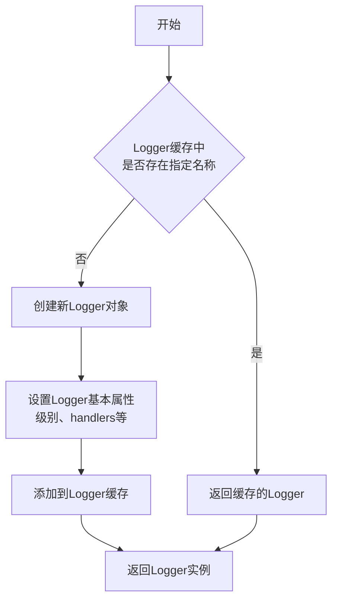
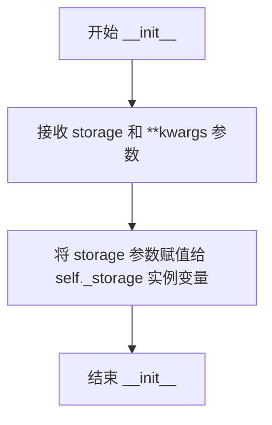
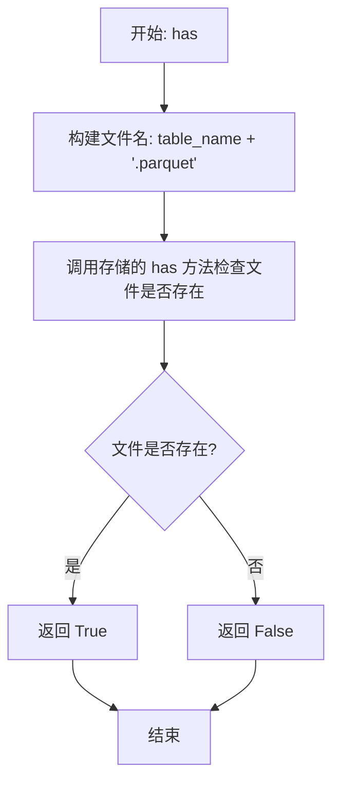
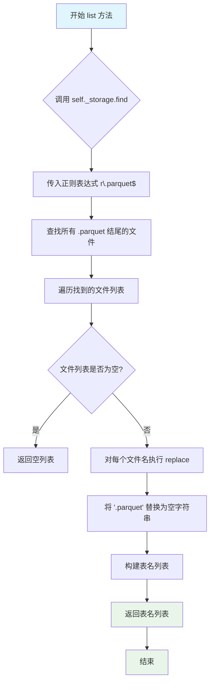
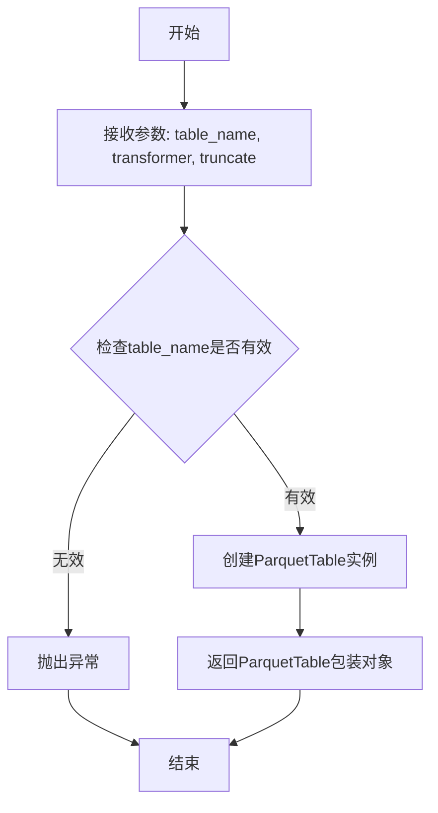

# `graphrag\packages\graphrag-storage\graphrag_storage\tables\parquet_table_provider.py` 详细设计文档

ParquetTableProvider是基于Parquet文件的表提供者实现，通过底层Storage实例将pandas DataFrames与Parquet格式进行双向转换，支持表的读取、写入、存在性检查、列表查询和流式行操作。

## 整体流程

```mermaid
graph TD
    A[开始] --> B[初始化 ParquetTableProvider]
B --> C{操作类型}
C --> D[read_dataframe]
C --> E[write_dataframe]
C --> F[has]
C --> G[list]
C --> H[open]
D --> D1{文件是否存在?}
D1 -- 否 --> D2[抛出 ValueError]
D1 -- 是 --> D3[从Storage读取Parquet文件]
D3 --> D4[转换为DataFrame返回]
E --> E1[将DataFrame转为Parquet格式]
E1 --> E2[调用Storage.set保存]
F --> F1[检查Storage中是否存在{table_name}.parquet]
F1 --> F2[返回布尔值]
G --> G1[使用正则查找所有.parquet文件]
G1 --> G2[去除扩展名返回表名列表]
H --> H1[创建ParquetTable实例]
H1 --> H2[返回Table接口]
```

## 类结构

```
TableProvider (抽象基类)
└── ParquetTableProvider (Parquet表提供者实现)
```

## 全局变量及字段


### `logger`
    
用于记录日志的模块级日志记录器实例

类型：`logging.Logger`
    


### `ParquetTableProvider._storage`
    
底层存储实例，用于读写 Parquet 文件

类型：`Storage`
    
    

## 全局函数及方法


### `logging.getLogger`

获取指定名称的日志记录器实例，如果该名称的记录器不存在则创建新的记录器。这是 Python `logging` 模块的核心函数，用于获取或创建模块级别的日志记录器，以便在代码中进行日志输出。

参数：

- `name`：`str`，日志记录器的名称，通常传入 `__name__` 变量，表示当前模块的完全限定名称

返回值：`logging.Logger`，返回对应的日志记录器实例，用于记录日志信息

#### 流程图



#### 带注释源码

```python
# 导入logging模块
import logging

# 获取当前模块的logger实例
# __name__ 是Python内置变量，表示当前模块的完全限定名称
# 例如：对于文件 graphrag_storage/tables/parquet_table_provider.py
# __name__ 的值是 'graphrag_storage.tables.parquet_table_provider'
logger = logging.getLogger(__name__)
```

#### 上下文使用说明

在给定的代码中，`logging.getLogger(__name__)` 用于创建一个模块级别的日志记录器，其作用如下：

| 项目 | 说明 |
|------|------|
| **使用位置** | 模块顶层（第15行） |
| **Logger 名称** | `graphrag_storage.tables.parquet_table_provider` |
| **日志输出** | 通过 `logger.info()` 和 `logger.exception()` 输出操作日志 |
| **日志内容** | 读取表、写入表、错误信息等操作记录 |


### `ParquetTableProvider.__init__`

使用底层存储实例初始化 Parquet 表提供者。

参数：

-  `storage`：`Storage`，用于读写 Parquet 文件的存储实例
-  `**kwargs`：`Any`，额外的关键字参数（当前未使用）

返回值：`None`，构造函数不返回任何值

#### 流程图



#### 带注释源码

```python
def __init__(self, storage: Storage, **kwargs) -> None:
    """Initialize the Parquet table provider with an underlying storage instance.

    Args
    ----
        storage: Storage
            The storage instance to use for reading and writing Parquet files.
        **kwargs: Any
            Additional keyword arguments (currently unused).
    """
    # 将传入的 Storage 实例保存为实例变量，供后续 read_dataframe、write_dataframe 等方法使用
    self._storage = storage
```


### `ParquetTableProvider.read_dataframe`

该方法从底层存储中读取指定的 Parquet 文件，并将其内容转换为 pandas DataFrame 返回。首先构造文件名，然后检查文件是否存在，若不存在则抛出 ValueError；若存在则尝试读取并解析 Parquet 文件，读取失败时记录异常日志并重新抛出。

参数：

- `table_name`：`str`，要读取的表格名称，实际访问的文件名为 `{table_name}.parquet`

返回值：`pd.DataFrame`，从 Parquet 文件加载的表格数据

#### 流程图

```mermaid
flowchart TD
    A[开始读取DataFrame] --> B[构造文件名: {table_name}.parquet]
    B --> C{storage.has filename?}
    C -->|否| D[抛出ValueError: 文件不存在]
    C -->|是| E[调用storage.get获取文件字节]
    E --> F[将字节数据包装为BytesIO]
    F --> G[pd.read_parquet读取为DataFrame]
    G --> H[返回DataFrame]
    
    G -.->|异常| I[记录异常日志]
    I --> J[重新抛出异常]
    
    D --> K[结束]
    H --> K
    J --> K
```

#### 带注释源码

```python
async def read_dataframe(self, table_name: str) -> pd.DataFrame:
    """Read a table from storage as a pandas DataFrame.

    Args
    ----
        table_name: str
            The name of the table to read. The file will be accessed as '{table_name}.parquet'.

    Returns
    -------
        pd.DataFrame:
            The table data loaded from the Parquet file.

    Raises
    ------
        ValueError:
            If the table file does not exist in storage.
        Exception:
            If there is an error reading or parsing the Parquet file.
    """
    # 构造完整的 Parquet 文件名
    filename = f"{table_name}.parquet"
    
    # 检查文件是否存在于存储中
    if not await self._storage.has(filename):
        # 文件不存在时抛出 ValueError
        msg = f"Could not find {filename} in storage!"
        raise ValueError(msg)
    
    try:
        # 记录读取日志
        logger.info("reading table from storage: %s", filename)
        
        # 从存储获取文件字节内容，转换为 BytesIO 后使用 pandas 读取
        return pd.read_parquet(
            BytesIO(await self._storage.get(filename, as_bytes=True))
        )
    except Exception:
        # 捕获读取或解析过程中的异常，记录日志后重新抛出
        logger.exception("error loading table from storage: %s", filename)
        raise
```


### `ParquetTableProvider.write_dataframe`

将 pandas DataFrame 异步写入存储为 Parquet 文件的方法，通过底层存储实例将 DataFrame 转换为 Parquet 格式并保存。

参数：

- `table_name`：`str`，要写入的表名，文件将保存为 `'{table_name}.parquet'`
- `df`：`pd.DataFrame`，要写入存储的 DataFrame

返回值：`None`，无返回值，该方法执行异步写入操作

#### 流程图

```mermaid
flowchart TD
    A[开始 write_dataframe] --> B[接收 table_name 和 df]
    B --> C[构造文件名: f"{table_name}.parquet"]
    C --> D[调用 df.to_parquet 将 DataFrame 转换为 Parquet 格式]
    D --> E[异步调用 self._storage.set 保存数据]
    E --> F[结束]
```

#### 带注释源码

```python
async def write_dataframe(self, table_name: str, df: pd.DataFrame) -> None:
    """Write a pandas DataFrame to storage as a Parquet file.

    Args
    ----
        table_name: str
            The name of the table to write. The file will be saved as '{table_name}.parquet'.
        df: pd.DataFrame
            The DataFrame to write to storage.
    """
    # 将 DataFrame 转换为 Parquet 格式的字节数据
    # 然后异步调用存储后端的 set 方法写入文件
    await self._storage.set(f"{table_name}.parquet", df.to_parquet())
```


### `ParquetTableProvider.has`

检查指定表名在存储中是否存在（通过检查对应的 Parquet 文件）。

参数：

-  `table_name`：`str`，要检查的表名（不含文件扩展名）

返回值：`bool`，如果表（Parquet 文件）存在则返回 `True`，否则返回 `False`

#### 流程图



#### 带注释源码

```python
async def has(self, table_name: str) -> bool:
    """Check if a table exists in storage.

    Args
    ----
        table_name: str
            The name of the table to check.

    Returns
    -------
        bool:
            True if the table exists, False otherwise.
    """
    # 1. 将表名转换为 Parquet 文件名（添加 .parquet 后缀）
    # 2. 调用底层存储的异步 has 方法检查文件是否存在
    # 3. 返回布尔值结果
    return await self._storage.has(f"{table_name}.parquet")
```


### `ParquetTableProvider.list`

列出存储中所有表的名字（不含 `.parquet` 扩展名）。该方法通过正则表达式匹配查找所有 Parquet 文件，并去除扩展名后返回表名列表。

参数：
- 无（仅使用实例属性 `self`）

返回值：`list[str]`，返回存储中所有 Parquet 表的名称列表（不包含 `.parquet` 扩展名）

#### 流程图



#### 带注释源码

```python
def list(self) -> list[str]:
    """List all table names in storage.

    Returns
    -------
        list[str]:
            List of table names (without .parquet extension).
    """
    # 使用存储的 find 方法查找所有匹配 .parquet 结尾的文件
    # re.compile(r"\.parquet$") 创建正则表达式，匹配以 .parquet 结尾的文件名
    # find 方法返回所有匹配的文件名列表
    return [
        # 列表推导式：对每个文件名去除 .parquet 扩展名
        file.replace(".parquet", "")
        # 遍历存储中所有 .parquet 文件
        for file in self._storage.find(re.compile(r"\.parquet$"))
    ]
```


### `ParquetTableProvider.open`

打开指定名称的 Parquet 表，返回一个支持流式行操作的 ParquetTable 实例，可选择性地对读取的行进行转换，并支持截断或追加写入模式。

参数：

- `table_name`：`str`，要打开的表的名称
- `transformer`：`RowTransformer | None`，可选的行转换器，用于在读取时转换每一行
- `truncate`：`bool`，如果为 `True`（默认值），关闭时覆盖现有文件；如果为 `False`，向现有文件追加新行

返回值：`Table`，返回一个用于逐行访问的 ParquetTable 实例

#### 流程图



#### 带注释源码

```python
def open(
    self,
    table_name: str,
    transformer: RowTransformer | None = None,
    truncate: bool = True,
) -> Table:
    """Open a table for streaming row operations.

    Returns a ParquetTable that simulates streaming by loading the
    DataFrame and iterating rows, or accumulating writes for batch output.

    Args
    ----
        table_name: str
            The name of the table to open.
        transformer: RowTransformer | None
            Optional callable to transform each row on read.
        truncate: bool
            If True (default), overwrite existing file on close.
            If False, append new rows to existing file.

    Returns
    -------
        Table:
            A ParquetTable instance for row-by-row access.
    """
    # 创建一个 ParquetTable 实例，传入存储后端、表名、行转换器和截断标志
    # ParquetTable 内部会处理实际的读写逻辑
    return ParquetTable(self._storage, table_name, transformer, truncate=truncate)
```

## 关键组件


### ParquetTableProvider

表提供者主类，负责通过底层Storage实例以Parquet格式存储和读取表数据，支持DataFrame的读写操作以及表的查询和管理。

### Storage抽象层

底层存储后端接口，提供文件系统的读取、写入、存在性检查和文件查找功能，支持多种存储后端（文件、blob、cosmos等）。

### read_dataframe方法

异步方法，从存储中读取指定名称的表文件（.parquet），将其解析为pandas DataFrame返回，支持错误处理和日志记录。

### write_dataframe方法

异步方法，将pandas DataFrame转换为Parquet格式并写入存储，文件名自动添加.parquet扩展名。

### has方法

异步方法，检查指定表名的Parquet文件是否存在于存储中，返回布尔值。

### list方法

同步方法，通过正则表达式查找所有.parquet文件并返回表名列表（不含扩展名）。

### open方法

打开表并返回ParquetTable实例，支持可选的RowTransformer进行行转换，以及truncate参数控制覆盖或追加行为。

### ParquetTable

流式表实现类，用于逐行读取或累积写入操作，通过DataFrame加载和迭代模拟流式访问。


## 问题及建议


### 已知问题

-   **write_dataframe 缺少异常处理**：写入操作没有 try-except 包裹，若存储失败只会默默失败，无法得知具体错误原因
-   **异步/同步方法不一致**：list() 方法是同步的，但其他方法都是异步的，可能导致调用方处理混乱
-   **内存效率问题**：open() 方法注释表明 "simulates streaming by loading the DataFrame"，大数据集可能一次性加载到内存导致 OOM
-   **truncate 语义不直观**：默认 truncate=True 覆盖文件，False 追加，但追加模式下数据重复风险较高
-   **transformer 不可序列化**：RowTransformer 是可选 callable 对象，无法跨进程持久化或传输
-   **缺乏重试机制**：网络存储可能出现瞬时故障，当前实现没有重试逻辑
-   **列式存储配置缺失**：无法配置 Parquet 压缩算法、行组大小、列编码等优化参数

### 优化建议

-   **为 write_dataframe 添加异常处理**：参考 read_dataframe 的错误处理模式，记录日志并抛出异常
-   **统一异步接口**：将 list() 改为 async def list()，与整体异步设计保持一致
-   **实现真正的流式处理**：对于大文件，考虑使用 pandas 的 chunksize 或 pyarrow 的流式 API 避免全量加载
-   **暴露 Parquet 配置选项**：在构造函数或 write_dataframe 中添加 compression、use_dictionary 等参数
-   **添加写入重试逻辑**：使用 tenacity 或手动实现指数退避重试，捕获临时性网络错误
-   **考虑实现上下文管理器**：使 ParquetTable 支持 with 语句，自动管理资源
-   **增强日志覆盖**：在 write_dataframe、has、list 等方法中添加适当的日志记录


## 其它


### 设计目标与约束

本模块的设计目标是提供一个统一的表（Table）抽象，使用Parquet作为底层存储格式，通过适配器模式支持多种存储后端。核心约束包括：1）必须兼容TableProvider抽象接口；2）所有I/O操作必须为异步；3）数据以Parquet格式持久化，需支持列式存储的压缩和分片优势；4）需支持流式写入模式以处理大规模数据集。

### 错误处理与异常设计

异常处理策略采用分层设计：1）ValueError用于表文件不存在的业务异常；2）通用Exception用于底层I/O或Parquet解析错误；3）所有异常均通过logger.exception记录完整堆栈信息；4）调用方需捕获异常并实现重试逻辑（尤其是存储后端临时不可用场景）。当前实现中write_dataframe未对DataFrame的Parquet序列化失败做特定处理。

### 数据流与状态机

读取数据流：Storage.get → BytesIO解包 → pd.read_parquet → DataFrame返回。写入数据流：DataFrame.to_parquet → bytes → Storage.set。列表操作：Storage.find(正则匹配.parquet) → 文件名清洗。状态转换：has检查文件存在性 → read_dataframe加载数据 → write_dataframe覆盖或创建，无显式状态机。

### 外部依赖与接口契约

核心依赖包括：1）pandas库（DataFrame操作和Parquet编解码）；2）Storage抽象（需实现has/get/set/find方法）；3）ParquetTable类（用于流式操作）。Storage接口契约：get方法需返回bytes或支持as_bytes=True参数；set方法需接受bytes或支持pandas DataFrame直接写入；find方法需返回文件名字符串列表。

### 性能考虑

当前实现将整个DataFrame一次性加载到内存，大数据场景存在OOM风险。优化方向：1）支持分块读取（chunked reading）；2）write_dataframe可考虑流式写入而非全量序列；3）列表操作使用Storage的迭代器而非一次性加载所有文件名。Parquet的列式存储和压缩可显著降低网络传输量。

### 安全性考虑

当前实现无内置安全机制：1）表名未做输入验证（需防路径遍历攻击如../../../etc/passwd）；2）Storage后端需自行实现访问控制；3）Parquet文件本身无加密，需依赖底层存储实现。建议添加表名白名单验证和Storage级别的权限检查。

### 配置参数说明

构造函数接收storage: Storage实例（必需）和**kwargs（预留扩展）。write_dataframe无压缩参数配置（默认使用pandas的parquet引擎设置）。open方法的truncate参数控制覆盖/追加语义，默认截断（覆盖）。

### 使用示例

```python
# 初始化
provider = ParquetTableProvider(FileStorage("./data"))

# 写入DataFrame
df = pd.DataFrame({"a": [1,2,3], "b": ["x","y","z"]})
await provider.write_dataframe("my_table", df)

# 读取DataFrame
df = await provider.read_dataframe("my_table")

# 检查存在
exists = await provider.has("my_table")

# 列表
tables = provider.list()

# 流式操作
table = provider.open("my_table", truncate=False)
async for row in table:
    print(row)
await table.close()
```

### 版本兼容性

代码明确依赖Python 3.10+的类型提示语法（| 联合类型），pandas版本需支持to_parquet和read_parquet方法，Storage接口需兼容异步实现。建议运行时检查：pandas>=1.5.0, pyarrow>=7.0.0。

### 测试策略

单元测试应覆盖：1）正常读写流程（内存Storage mock）；2）文件不存在抛ValueError；3）Parquet解析失败抛Exception；4）list方法的正则过滤；5）has方法的存在性检查。集成测试需覆盖不同Storage后端（本地文件系统、云存储等）。

### 部署注意事项

部署时需确保：1）Storage后端实现已正确初始化；2）Python环境已安装pandas和pyarrow依赖；3）目录/容器权限正确（Storage初始化时创建必要的路径）；4）大规模数据场景需监控内存使用。Parquet格式的平台无关性利于跨语言互操作。


    