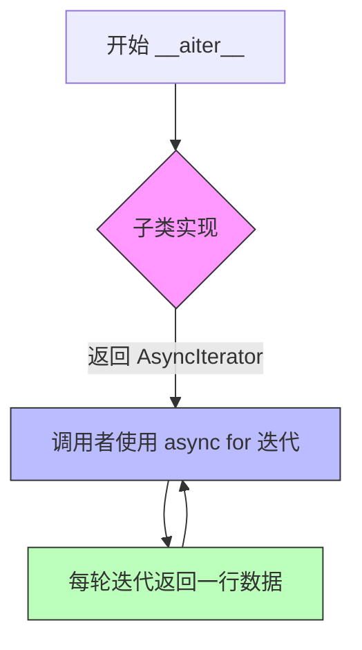
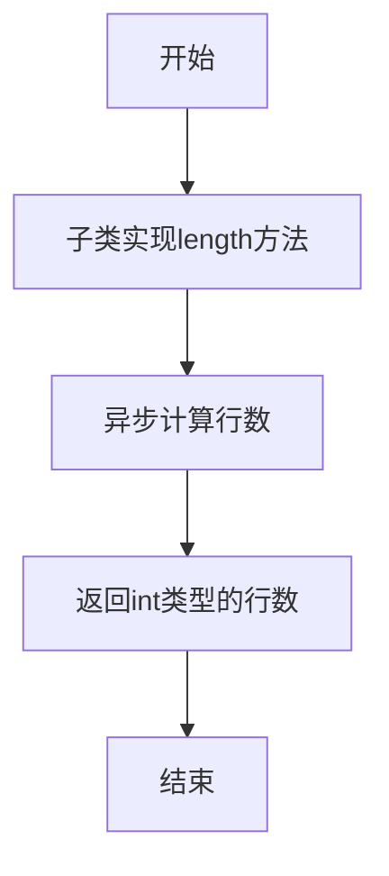
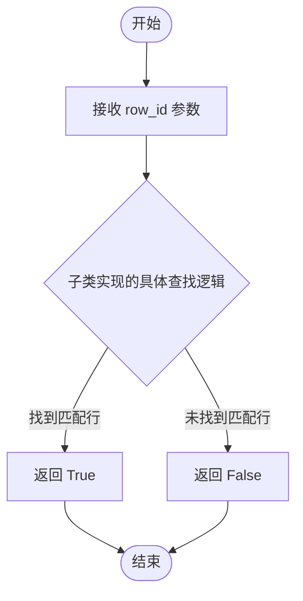
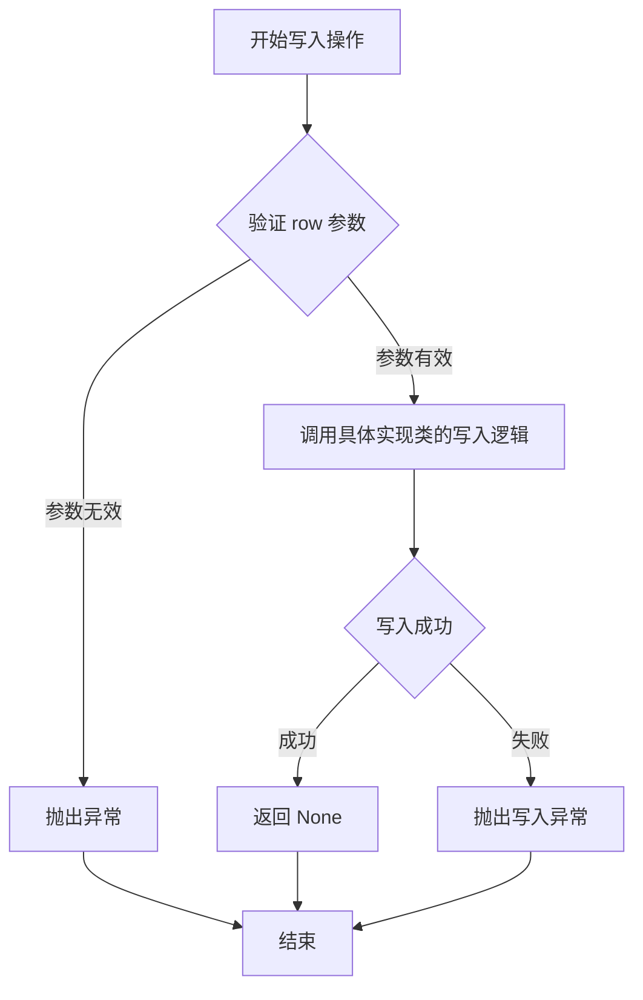
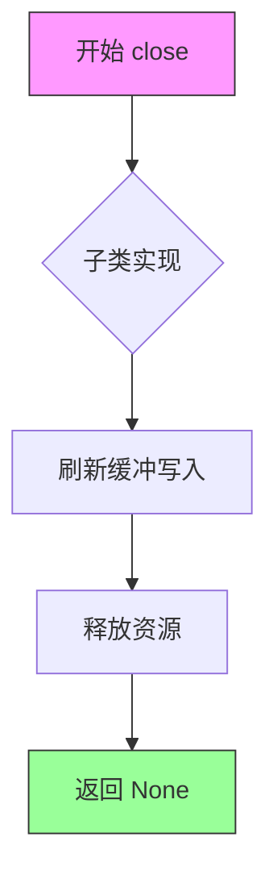
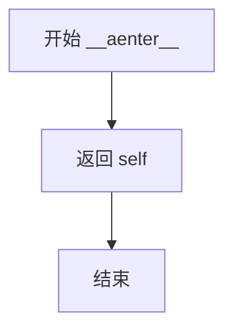
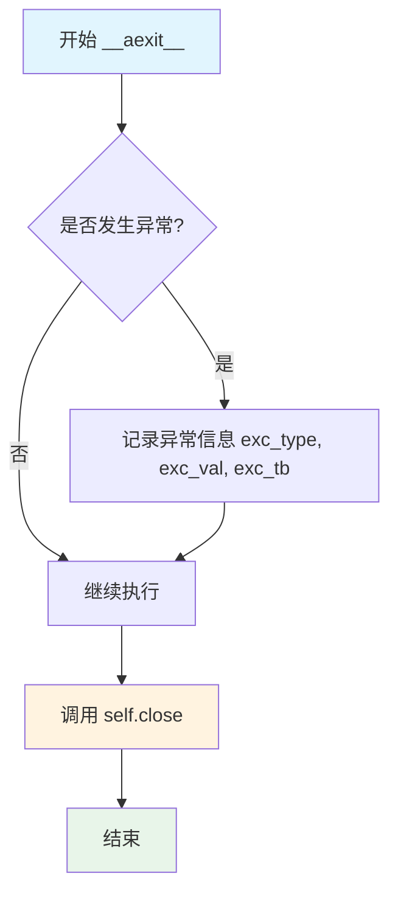

# `graphrag\packages\graphrag-storage\graphrag_storage\tables\table.py` 详细设计文档

这是一个用于流式逐行访问表格数据的抽象基类，提供异步迭代、写入、长度查询、存在性检查等功能，支持异步上下文管理器协议以实现资源的自动清理，适用于大数据集的内存高效处理。

## 整体流程

```mermaid
graph TD
    A[开始] --> B[创建Table实例]
B --> C[进入异步上下文管理器 __aenter__]
C --> D[__aiter__ 返回异步迭代器]
D --> E{是否还有更多行?}
E -- 是 --> F[yield 当前行（可选transformer转换）]
F --> E
E -- 否 --> G[退出异步上下文管理器 __aexit__]
G --> H[调用 close 方法]
H --> I[刷新缓冲写入并释放资源]
I --> J[结束]

---

graph TD
    K[调用 write 方法] --> L[写入单行数据]
L --> M{数据源类型?}
M -- 内存 --> N[直接写入]
M -- 远程 --> O[添加到缓冲区]

---

graph TD
    P[调用 length 方法] --> Q[异步查询行数]
Q --> R[返回 int]

---

graph TD
    S[调用 has 方法] --> T[异步查询 row_id 是否存在]
T --> U[返回 bool]
```

## 类结构

```
Table (抽象基类)
└── 具体实现类（需继承并实现所有抽象方法）
```

## 全局变量及字段


### `RowTransformer`
    
类型别名，表示一个将字典[str, Any]转换为任意类型数据的可调用函数，用于行数据的转换

类型：`Callable[[dict[str, Any]], Any]`
    


    

## 全局函数及方法


### `Table.__aiter__`

异步迭代器方法，用于逐行异步遍历表格数据。如果在打开表格时提供了 transformer（如 Pydantic 模型），则返回转换后的类型；否则返回原始字典类型。

参数：

- （无显式参数，隐式参数 `self` 表示 Table 实例）

返回值：`AsyncIterator[Any]`，异步迭代器对象，用于在 async for 循环中逐行产生数据，每行可以是字典或转换后的类型（如 Pydantic 模型实例）。

#### 流程图



#### 带注释源码

```python
@abstractmethod
def __aiter__(self) -> AsyncIterator[Any]:
    """Yield rows asynchronously, transformed if transformer provided.

    Yields
    ------
        Any:
            Each row, either as dict or transformed type (e.g., Pydantic model).
    """
    ...
```


### `Table.length`

返回表中的行数，以异步方式获取。

参数：

- `self`：`Table`，隐式参数，Table类的实例本身

返回值：`int`，表中行数

#### 流程图



#### 带注释源码

```python
@abstractmethod
async def length(self) -> int:
    """Return number of rows asynchronously.

    Returns
    -------
        int:
            Number of rows in the table.
    """
    # 这是一个抽象方法，由子类实现
    # 子类需要实现具体的异步行数统计逻辑
    # 返回值必须是int类型，表示表中总行数
    ...
```


### `Table.has`

检查是否存在指定 ID 的行记录

参数：

- `row_id`：`str`，要查找的行的 ID 值

返回值：`bool`，如果存在匹配 ID 的行则返回 True

#### 流程图



#### 带注释源码

```python
@abstractmethod
async def has(self, row_id: str) -> bool:
    """Check if a row with the given ID exists.

    Args
    ----
        row_id: The ID value to search for.

    Returns
    -------
        bool:
            True if a row with matching ID exists.
    """
    ...
```


### `Table.write`

将单行数据以字典形式写入表格的异步抽象方法，由具体实现类提供逻辑，用于支持流式数据写入场景。

参数：

- `self`：Table，调用该方法的实例本身（隐式参数）
- `row`：`dict[str, Any]`，表示要写入的单行数据的字典对象，键为列名，值为对应的数据

返回值：`None`，无返回值

#### 流程图



#### 带注释源码

```python
@abstractmethod
async def write(self, row: dict[str, Any]) -> None:
    """Write a single row to the table.

    Args
    ----
        row: Dictionary representing a single row to write.
    """
    # 参数 row: dict[str, Any]
    #   - 传入的字典类型参数，包含要写入的列名和对应值
    # 返回值: None
    #   - 该方法为抽象方法，具体实现由子类完成
    #   - 子类实现时通常会将数据写入缓冲区或直接写入存储后端
```


### `Table.close`

刷新缓冲的写入操作并释放资源。该方法在退出异步上下文管理器时自动调用，但也可以显式调用。

**注意**：由于 `close` 是一个抽象方法（`@abstractmethod`），其具体实现逻辑取决于子类。以下文档基于基类中定义的接口行为。

参数：

- 无参数（`self` 为隐式参数）

返回值：`None`，无返回值

#### 流程图



#### 带注释源码

```python
@abstractmethod
async def close(self) -> None:
    """Flush buffered writes and release resources.

    This method is called automatically when exiting the async context
    manager, but can also be called explicitly.

    Note
    ----
        此方法为抽象方法，具体实现由子类提供。
        通常包括：
        1. 刷新所有缓冲的写入数据
        2. 关闭底层资源（如文件句柄、数据库连接等）
        3. 清理临时资源
    """
    # 子类需要重写此方法以实现具体的资源释放逻辑
    ...
```

#### 关联上下文

该方法与异步上下文管理器协议紧密相关：

```python
# 在 Table.__aexit__ 中自动调用
async def __aexit__(
    self,
    exc_type: type[BaseException] | None,
    exc_val: BaseException | None,
    exc_tb: TracebackType | None,
) -> None:
    """Exit async context manager, ensuring close() is called."""
    await self.close()
```

#### 设计意图

1. **资源管理**：确保流式写入的数据被正确刷新到底层存储
2. **自动清理**：通过 `__aexit__` 实现自动资源释放，无需手动调用
3. **显式调用支持**：允许在需要时显式调用以立即释放资源


### `Table.__aenter__`

进入异步上下文管理器，允许对象在 `async with` 语句中使用。返回实例自身以支持上下文管理协议。

参数：

- `self`：`Table`，隐式参数，当前 Table 实例

返回值：`Self`，返回 Table 实例本身，用于上下文管理器 usage

#### 流程图



#### 带注释源码

```python
async def __aenter__(self) -> Self:
    """Enter async context manager.

    Returns
    -------
        Table:
            Self for context manager usage.
    """
    # 返回当前实例，使对象可以在 async with 语句中使用
    # 配合 __aexit__ 实现资源的自动管理
    return self
```


### `Table.__aexit__`

退出异步上下文管理器，确保资源被正确释放。即使发生异常，也会调用 `close()` 方法来刷新缓冲的写入操作并释放资源。

参数：

- `exc_type`：`type[BaseException] | None`，如果发生异常则为异常类型，否则为 `None`
- `exc_val`：`BaseException | None`，如果发生异常则为异常实例，否则为 `None`
- `exc_tb`：`TracebackType | None`，如果发生异常则为异常追溯，否则为 `None`

返回值：`None`，无返回值（方法返回 `None`）

#### 流程图



#### 带注释源码

```python
async def __aexit__(
    self,
    exc_type: type[BaseException] | None,  # 异常类型，如发生异常则为异常类，否则为 None
    exc_val: BaseException | None,         # 异常值，如发生异常则为异常实例，否则为 None
    exc_tb: TracebackType | None,          # 异常追溯，如发生异常则为 traceback 对象，否则为 None
) -> None:
    """Exit async context manager, ensuring close() is called.

    Args
    ----
        exc_type: Exception type if an exception occurred
        exc_val: Exception value if an exception occurred
        exc_tb: Exception traceback if an exception occurred
    """
    # 无论是否发生异常，都调用 close() 方法确保资源释放
    # 这是异步上下文管理器协议的关键部分
    await self.close()
```

## 关键组件


### Table (抽象基类)

提供内存高效的大数据集流式处理的抽象基类，支持行迭代和写入操作，支持异步上下文管理器协议进行自动资源清理。

### 异步迭代器协议 (__aiter__)

抽象方法，定义异步迭代接口，允许逐行异步生成数据，支持可选的转换器将字典行转换为其他类型（如Pydantic模型）。

### 异步上下文管理器

通过 `__aenter__` 和 `__aexit__` 实现异步上下文管理器协议，确保资源在使用后自动释放，包含异常处理时的资源清理逻辑。

### RowTransformer 类型别名

定义行转换器的函数类型签名 `Callable[[dict[str, Any]], Any]`，用于将原始字典行转换为目标类型（如Pydantic模型）。

### 长度查询 (length)

抽象异步方法 `length() -> int`，返回表中的行数，用于了解数据集规模。

### 行存在性检查 (has)

抽象异步方法 `has(row_id: str) -> bool`，检查指定ID的行是否存在，支持按ID快速查询。

### 行写入 (write)

抽象异步方法 `write(row: dict[str, Any]) -> None`，将单行数据写入表，支持流式数据写入场景。

### 资源释放 (close)

抽象异步方法 `close() -> None`，刷新缓冲写入并释放资源，确保数据完整性和系统资源正确回收。


## 问题及建议


### 已知问题

-   **抽象类设计不完整**：`Table` 抽象基类缺少 `transformer` 字段的定义和使用机制，文档示例中展示了 transformer 功能但基类未实现
-   **类型提示不够精确**：`__aiter__` 方法返回 `AsyncIterator[Any]`，未体现 transformed 类型的泛型支持
-   **缺少错误处理机制**：`write`、`close` 等异步方法没有异常处理和重试逻辑
-   **功能缺失严重**：缺少批量读写、事务支持、连接池管理、索引查询等生产级功能
-   **无资源管理策略**：没有实现连接超时配置、缓冲大小控制等资源管理参数
-   **上下文管理器实现冗余**：`__aexit__` 仅调用 `close()`，可以直接让子类实现 close 逻辑，简化继承结构

### 优化建议

-   添加泛型支持：使用 `Generic[T]` 让 `Table` 支持 `Table[Entity]` 形式的类型声明
-   在基类中定义可选的 `transformer` 字段，并提供默认实现或抽象方法
-   添加批量操作方法：`write_batch`、`read_batch` 以提升性能
-   引入配置对象：添加 `TableConfig` 类管理超时、缓冲大小、重试次数等参数
-   增强 `close()` 方法的错误处理，确保资源释放的可靠性
-   添加异步迭代器的 `__anext__` 方法实现，支持更细粒度的迭代控制


## 其它


### 设计目标与约束

本模块旨在提供一种内存高效的流式表格访问抽象，支持异步逐行迭代和写入操作，适用于大数据集处理场景。设计约束包括：仅支持异步上下文管理器模式；写入操作均为单行模式；所有操作均为异步；依赖外部provider进行具体实现。

### 错误处理与异常设计

代码本身未显式定义异常类，异常处理遵循Python异步上下文管理器协议。当`__aexit__`被调用时，无论是否有异常发生，都会调用`close()`方法进行资源清理。子类实现时应在`close()`方法中妥善处理可能出现的异常，确保资源最终被释放。

### 外部依赖与接口契约

核心依赖包括：`abc`模块提供抽象基类支持；`typing_extensions`提供`Self`类型注解支持（Python 3.11+可使用标准库版本）；`collections.abc`提供异步迭代器类型提示。外部contract：子类必须实现所有抽象方法；`__aiter__`必须返回`AsyncIterator`；`write()`方法接收字典类型行数据；长度和存在性检查使用字符串类型的row_id。

### 性能考虑

本设计针对大数据集的内存高效处理进行了优化，采用流式迭代而非一次性加载全量数据。写入操作设计为单行模式，支持批量缓冲。性能优化建议：子类可实现行数据的延迟加载和缓存机制；write方法可考虑批量写入以减少IO次数；length()方法在某些实现中可能产生较高开销，应谨慎使用。

### 使用示例

代码已在类docstring中提供了两个使用示例，分别展示了：1）读取行数据为字典格式；2）配合Pydantic模型进行类型化转换。使用要点：必须使用async with语法进入上下文；迭代操作完全异步化；可通过传入transformer参数实现行数据转换。

### 线程安全性

本抽象类本身不涉及线程相关操作，所有操作均为异步单线程执行模式。线程安全性的保证依赖于具体子类实现。子类在实现时应避免在异步操作中引入阻塞性操作，以免影响并发性能。

### 版本兼容性

代码使用了`typing_extensions.Self`以兼容Python 3.7+（该版本标准库尚未包含Self类型）。当目标Python版本升级至3.11+时，可移除对typing_extensions的依赖，直接使用标准库的Self类型。类型注解使用了`Any`以提供最大灵活性。

    