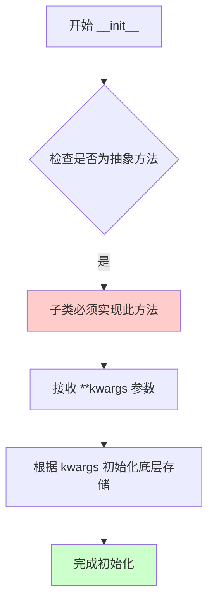
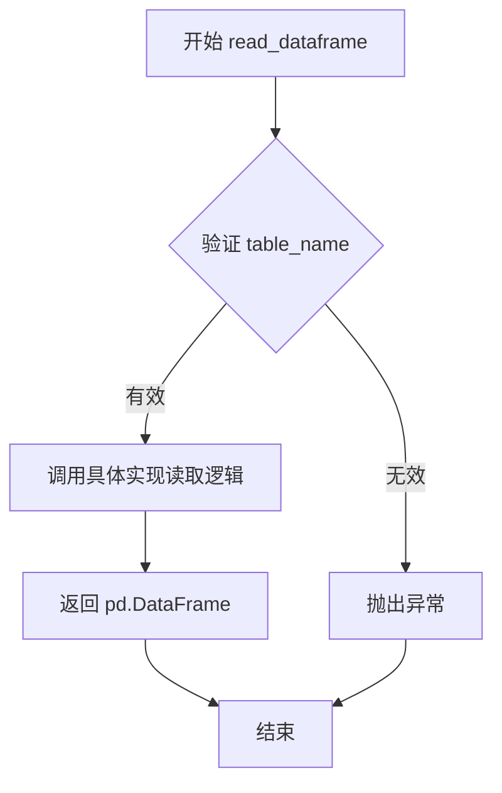
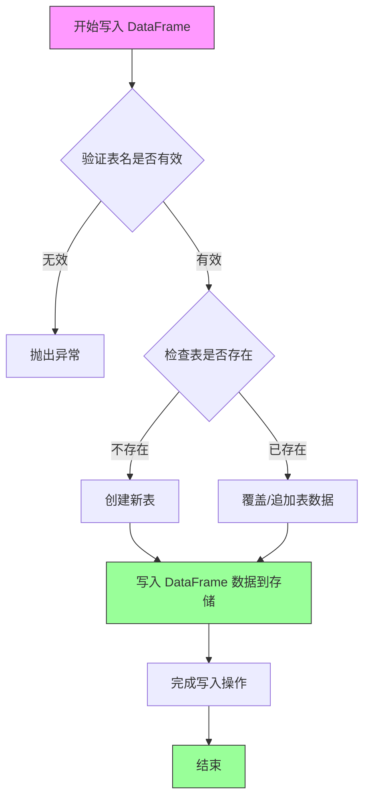
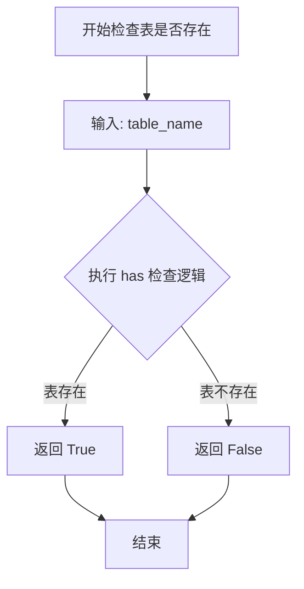
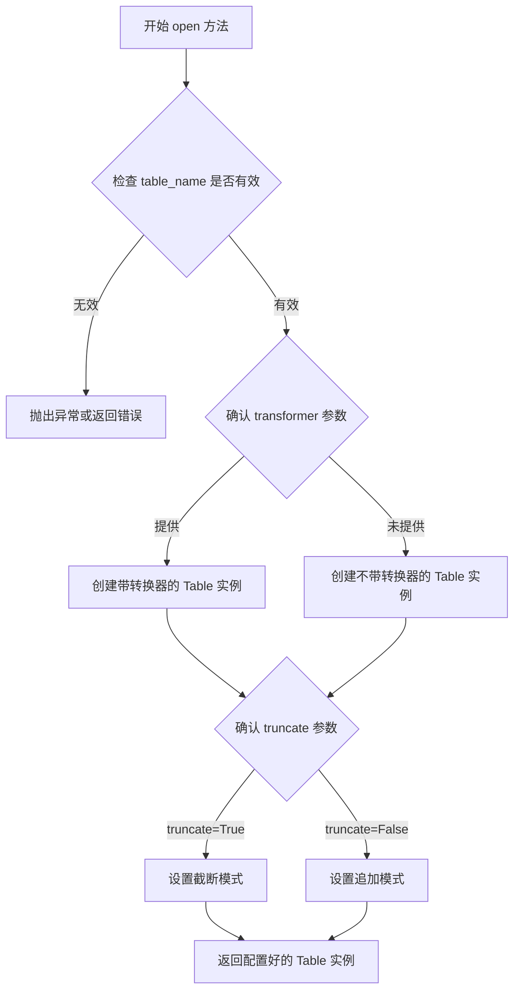

# `graphrag\packages\graphrag-storage\graphrag_storage\tables\table_provider.py` 详细设计文档

这是一个抽象基类，定义了基于表的存储接口规范，支持DataFrame和行字典的读写操作，用于为不同存储后端（如文件、数据库等）提供统一的表格数据访问抽象。

## 整体流程

```mermaid
graph TD
    A[开始] --> B[客户端调用TableProvider]
B --> C{选择操作类型}
C --> D[read_dataframe: 读取整个表为DataFrame]
C --> E[write_dataframe: 写入DataFrame到表]
C --> F[has: 检查表是否存在]
C --> G[list: 列出所有表名]
C --> H[open: 打开表进行流式操作]
D --> I[返回pd.DataFrame]
E --> J[写入成功/失败]
F --> K[返回bool]
G --> L[返回list[str]]
H --> M[返回Table实例]
```

## 类结构

```
TableProvider (抽象基类)
└── [实现类待后续定义]
```

## 全局变量及字段


    

## 全局函数及方法


### `TableProvider.__init__`

创建表格提供程序实例的抽象方法，用于初始化 TableProvider 子类。该方法接受可变关键字参数，允许传入底层存储实例或其他配置参数。

参数：

- `kwargs`：`Any`，关键字参数，用于初始化，可能包含底层 Storage 实例或其他配置选项

返回值：`None`，无返回值（构造函数）

#### 流程图



#### 带注释源码

```python
@abstractmethod
def __init__(self, **kwargs: Any) -> None:
    """Create a table provider instance.

    Args
    ----
        **kwargs: Any
            Keyword arguments for initialization, may include underlying Storage instance.
    """
    # 抽象方法，不能直接调用
    # 子类必须实现此方法以提供具体的初始化逻辑
    # kwargs 可能包含：
    # - storage: 底层存储实例
    # - connection_string: 数据库连接字符串
    # - base_path: 基础路径
    # - 其他自定义配置参数
    pass
```

#### 备注说明

| 项目 | 说明 |
|------|------|
| **设计目标** | 定义表格提供程序的通用初始化接口，支持多种底层存储实现 |
| **约束** | 该方法为抽象方法，子类必须实现；使用 `**kwargs` 实现参数灵活性 |
| **错误处理** | 具体的错误处理由子类实现 |
| **外部依赖** | 可能依赖传入的 Storage 实例或其他配置 |


### `TableProvider.read_dataframe`

异步抽象方法，定义从表中读取全部数据并以 pandas DataFrame 形式返回的接口，供具体实现类重写。

参数：

- `table_name`：`str`，要读取的表的名称

返回值：`pd.DataFrame`，表数据作为 DataFrame

#### 流程图



*注：由于是抽象方法，流程图展示的是调用者视角的通用流程，具体实现由子类提供。*

#### 带注释源码

```python
@abstractmethod
async def read_dataframe(self, table_name: str) -> pd.DataFrame:
    """Read entire table as a pandas DataFrame.

    Args
    ----
        table_name: str
            The name of the table to read.

    Returns
    -------
        pd.DataFrame:
            The table data as a DataFrame.
    """
    # 抽象方法，由子类实现具体读取逻辑
    # 此处仅定义接口契约，不做具体实现
    pass
```


### `TableProvider.write_dataframe`

将整个 DataFrame 数据写入为指定的表，提供异步写入能力。

参数：

- `table_name`：`str`，要写入的表的名称
- `df`：`pd.DataFrame`，要写入表中的 DataFrame 数据

返回值：`None`，无返回值

#### 流程图



#### 带注释源码

```python
@abstractmethod
async def write_dataframe(self, table_name: str, df: pd.DataFrame) -> None:
    """Write entire table from a pandas DataFrame.

    此方法为抽象方法，具体实现由子类完成。
    负责将完整的 DataFrame 数据写入到指定的表中。

    Args
    ----
        table_name: str
            要写入的表的名称，用于标识目标表
        df: pd.DataFrame
            要写入表的 DataFrame 数据，包含行和列

    Returns
    -------
        None
            无返回值，异步写入操作完成后直接返回
    """
    # 抽象方法，无具体实现
    # 子类需实现以下逻辑：
    # 1. 验证 table_name 参数的有效性
    # 2. 根据存储后端将 DataFrame 转换为可存储格式
    # 3. 执行实际的写入操作
    # 4. 处理可能的异常情况
    pass
```


### `TableProvider.has`

检查指定名称的表是否存在于存储提供者中。

参数：

- `table_name`：`str`，要检查的表的名称

返回值：`bool`，如果表存在则返回 `True`，否则返回 `False`

#### 流程图



#### 带注释源码

```python
@abstractmethod
async def has(self, table_name: str) -> bool:
    """Check if a table exists in the provider.

    Args
    ----
        table_name: str
            The name of the table to check.

    Returns
    -------
        bool:
            True if the table exists, False otherwise.
    """
    # 注意：这是一个抽象方法，具体实现由子类提供
    # 子类需要实现具体的表存在性检查逻辑
    # 可能涉及文件系统检查、数据库查询或其他存储机制的验证
    pass
```


### `TableProvider.list`

列出 TableProvider 中所有表的名称，返回不带文件扩展名的表名列表。

参数：

- （无参数，仅包含隐式 self）

返回值：`list[str]`，返回表中所有表名（不含文件扩展名）

#### 流程图

```mermaid
flowchart TD
    A[开始] --> B{调用 list 方法}
    B --> C[返回表名列表 list[str]]
    C --> D[结束]
    
    note[注：list 为抽象方法，由子类实现具体逻辑]
```

#### 带注释源码

```python
@abstractmethod
def list(self) -> list[str]:
    """List all table names in the provider.

    Returns
    -------
        list[str]:
            List of table names (without file extensions).
    """
    # 抽象方法，由子类实现
    # 该方法用于获取当前存储提供者中所有表的名称列表
    # 返回的表名不包含文件扩展名（如 .csv, .parquet 等）
    # 子类需要实现具体的表名枚举逻辑
```


### `TableProvider.open`

打开一个表以进行逐行流式操作，返回一个 Table 实例用于流式行读写操作。该方法支持可选的行转换器（RowTransformer）和截断/追加写入模式。

参数：

- `self`：`TableProvider`，TableProvider 实例本身
- `table_name`：`str`，要打开的表的名称
- `transformer`：`RowTransformer | None`，可选的行转换函数，用于对每行数据进行处理
- `truncate`：`bool`，如果为 True（默认值），在首次写入时截断现有文件；如果为 False，则向现有文件追加行（类似数据库行为）

返回值：`Table`，用于流式行操作的 Table 实例

#### 流程图



#### 带注释源码

```python
@abstractmethod
def open(
    self,
    table_name: str,
    transformer: RowTransformer | None = None,
    truncate: bool = True,
) -> Table:  # Returns Table instance
    """Open a table for row-by-row streaming operations.

    Args
    ----
        table_name: str
            The name of the table to open.
        transformer: RowTransformer | None
            Optional transformer function to apply to each row.
        truncate: bool
            If True (default), truncate existing file on first write.
            If False, append rows to existing file (DB-like behavior).

    Returns
    -------
        Table:
            A Table instance for streaming row operations.
    """
    # 注意：这是一个抽象方法，具体实现由子类提供
    # 子类需要实现以下逻辑：
    # 1. 验证 table_name 参数的有效性
    # 2. 根据 transformer 参数决定是否应用行转换
    # 3. 根据 truncate 参数设置文件的写入模式
    # 4. 创建并返回一个配置好的 Table 实例
    pass
```

## 关键组件


### TableProvider

提供基于表的存储接口的抽象基类，支持DataFrame和行字典的流式操作。

### 抽象方法 __init__

初始化表提供程序实例的抽象方法，支持传入底层存储实例的关键字参数。

### 抽象方法 read_dataframe

异步读取整个表为pandas DataFrame的方法，接收表名作为参数，返回pd.DataFrame类型的数据。

### 抽象方法 write_dataframe

异步将pandas DataFrame写入表的方法，接收表名和DataFrame作为参数，无返回值。

### 抽象方法 has

检查表是否存在于提供程序中的异步方法，接收表名作为参数，返回布尔值。

### 抽象方法 list

列出提供程序中所有表名的同步方法，返回字符串列表（不含文件扩展名）。

### 抽象方法 open

打开表进行逐行流式操作的同步方法，支持可选的行转换器和截断/追加模式，返回Table实例。

### RowTransformer 类型

用于在读取或写入时转换每行的可选函数类型，是Table类的相关类型。

### Table 类型

用于流式行操作的表实例类型，通过open方法返回，支持逐行读写。


## 问题及建议


### 已知问题

-   抽象类中定义抽象 `__init__` 方法会导致子类必须显式调用父类初始化，设计上存在歧义且容易引发初始化问题
-   `list()` 方法为同步方法，与其他方法的异步模式不一致，可能导致阻塞 I/O 操作
-   `open()` 方法的 `truncate` 参数语义与其他存储系统常见的事务语义不匹配，缺乏 rollback/commit 机制
-   缺少错误处理和自定义异常类，调用方无法区分不同类型的错误
-   抽象方法中大量使用 `**kwargs: Any` 传递参数，缺乏显式接口契约，子类实现时无法获得 IDE 自动补全和类型检查支持
-   `has()` 方法仅返回布尔值，未提供表元数据（如创建时间、大小等）查询能力

### 优化建议

-   将 `__init__` 改为非抽象方法，在抽象基类中提供默认实现，子类可选择性覆盖
-   将 `list()` 方法改为异步方法 `async def list()` 以保持异步模式一致性
-   考虑添加事务管理接口（如 `commit()`、`rollback()`）或明确的事务语义
-   定义自定义异常类（如 `TableNotFoundError`、`WriteError`）以支持细粒度错误处理
-   为各抽象方法明确定义 kwargs 的具体参数类型，而非使用 `Any` 通配符
-   添加表元数据查询接口（如 `get_metadata(table_name) -> TableMetadata`）

## 其它


### 设计目标与约束

本抽象基类（TableProvider）旨在为表格存储提供统一的抽象接口，使得上层业务逻辑能够以统一的方式操作不同的底层存储实现（如文件系统、数据库、云存储等）。设计约束包括：1）所有子类必须实现所有抽象方法；2）支持异步读写操作以提高性能；3）必须支持 DataFrame 和流式行操作两种模式；4）必须维护表名列表且不包含文件扩展名；5）write_dataframe 和 open 方法的 truncate 参数行为必须一致。

### 错误处理与异常设计

错误处理采用 Python 异常机制，子类实现时需要处理以下异常场景：1）表不存在时 has 方法返回 False 而非抛出异常；2）read_dataframe 在表不存在时应抛出 FileNotFoundError 或自定义 TableNotFoundError；3）write_dataframe 在写入失败时应抛出 IOError 或自定义 TableWriteError；4）open 方法在表不存在时可选择创建新表或抛出异常；5）list 方法在存储不可访问时应抛出 StorageAccessError。建议定义自定义异常类 TableProviderError 作为基类，包含 TableNotFoundError、TableWriteError、TableReadError、StorageAccessError 等子类。

### 数据流与状态机

数据流分为两类：1）批量数据流：write_dataframe 写入整个 DataFrame → 内部转换为行数据 → 存储；read_dataframe 从存储读取全部数据 → 转换为 DataFrame 返回。2）流式数据流：open 方法返回 Table 对象 → 通过 Table 的迭代器逐行读取或写入。状态机方面：Table 对象存在三种状态 - 初始状态（刚打开，未操作）、读取状态（正在迭代读取）、写入状态（正在写入）、关闭状态（close 调用后）。truncate 参数决定写入时的状态转换：True 时先清空文件再写入，False 时追加写入。

### 外部依赖与接口契约

外部依赖包括：1）pandas 库 - 用于 DataFrame 操作，版本要求 >= 1.0；2）abc 模块 - 用于抽象基类定义；3）typing 模块 - 用于类型提示；4）graphrag_storage.tables.table 模块 - 定义了 Table 和 RowTransformer 接口。接口契约：1）read_dataframe/write_dataframe 必须为异步方法；2）has/list/open 为同步方法；3）list 返回的列表不包含文件扩展名；4）open 方法的 transformer 参数接受 None 或可调用对象；5）Table 对象必须实现上下文管理器协议（__enter__/__exit__）或迭代器协议（__iter__/__next__）。

### 并发与线程安全性

由于采用异步方法设计，read_dataframe 和 write_dataframe 支持异步并发调用。子类实现时需注意：1）如果底层存储支持并发写入，需实现适当的锁机制或使用数据库事务；2）如果底层存储为文件系统，建议在写入时使用文件锁或原子写入操作；3）list 方法在并发场景下可能返回不一致的结果，需说明其快照特性。线程安全要求：1）has 方法必须是线程安全的；2）open 方法返回的 Table 对象必须是线程安全的或明确说明非线程安全。

### 性能考量

性能优化方向：1）read_dataframe 应尽可能使用底层存储的批量读取能力，避免逐行读取；2）write_dataframe 在写入大量数据时可考虑分批写入或使用底层存储的批量写入 API；3）list 方法如果开销较大，可考虑缓存表名列表或提供刷新机制；4）对于流式操作，Table 对象应支持生成器模式以减少内存占用。建议在文档中说明各方法的预期时间复杂度和空间复杂度。

### 配置参数

抽象基类本身不定义配置参数，但通过 __init__ 的 **kwargs 接受子类特定的配置。常见配置项包括：1）storage底层存储实例；2）base_path 存储根目录；3）encoding 文件编码格式；4）compression 是否启用压缩；5）cache_enabled 是否启用缓存。建议子类在文档中明确声明支持的配置参数及其默认值。

### 子类实现指南

实现 TableProvider 的子类需要：1）继承 ABC 并实现所有 6 个抽象方法；2）正确处理 table_name 参数，进行路径安全检查防止目录遍历攻击；3）在 write_dataframe 中正确处理空 DataFrame 的情况；4）在 list 方法中过滤掉临时文件或系统文件；5）在 open 方法中根据 truncate 参数决定文件操作模式；6）确保异步方法的实现符合 asyncio 规范，不阻塞事件循环。

### 版本兼容性考虑

当前代码无版本特定依赖，但需考虑：1）Python 版本要求至少 3.9（支持类型注解语法）；2）pandas 版本变化可能影响 DataFrame 序列化的兼容性；3）未来可能添加新方法，子类实现应预留扩展性。建议在文档中声明最低 Python 版本要求和推荐的 pandas 版本。

### 使用示例与典型工作流

典型工作流一（批量操作）：检查表是否存在(has) → 读取现有数据(read_dataframe) → 处理数据 → 写入新数据(write_dataframe)。典型工作流二（流式操作）：打开表(open) → 遍历行(iter) → 处理每行 → 关闭表(close)。典型工作流三（元数据操作）：列出所有表(list) → 遍历每个表 → 检查表属性。示例代码应展示完整的异常处理和资源清理流程。


    