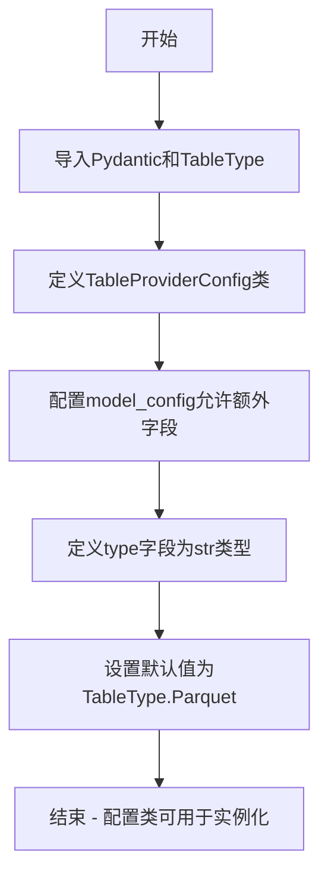
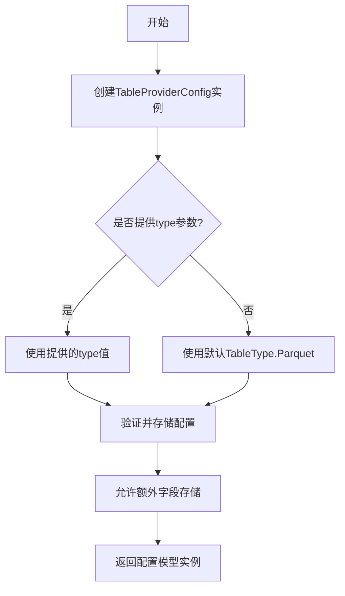
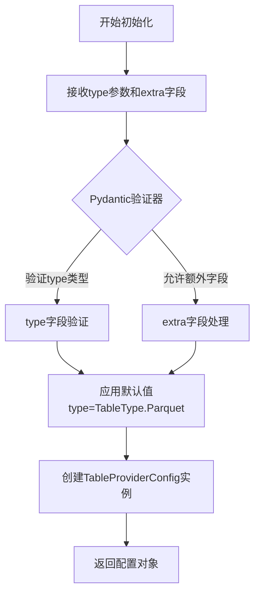
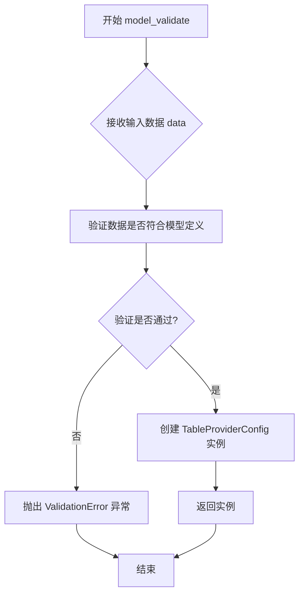
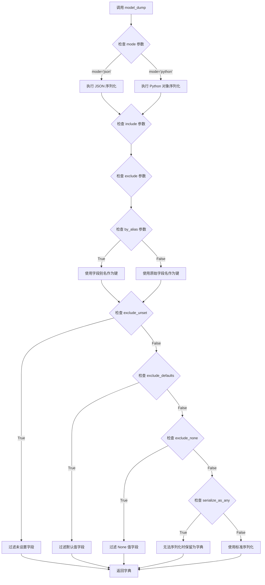

# `graphrag\packages\graphrag-storage\graphrag_storage\tables\table_provider_config.py` 详细设计文档

这是一个存储配置模型文件，定义了表格提供商（Table Provider）的配置结构，使用Pydantic框架实现配置验证和类型提示，支持自定义表格类型（默认为Parquet格式），并允许额外的自定义字段以支持扩展。

## 整体流程



## 类结构

```
BaseModel (Pydantic基类)
└── TableProviderConfig (表格提供商配置模型)
```

## 全局变量及字段


### `TableType`
    
枚举类，定义表类型选项（如 Parquet 等）

类型：`Enum Class (from graphrag_storage.tables.table_type)`
    


### `BaseModel`
    
Pydantic 的基类，提供数据验证和序列化功能

类型：`Pydantic Base Class`
    


### `ConfigDict`
    
Pydantic 配置字典类，用于定义模型配置选项

类型：`Pydantic Configuration Class`
    


### `Field`
    
Pydantic 字段定义类，用于定义模型字段的元数据

类型：`Pydantic Field Definition Class`
    


### `TableProviderConfig.model_config`
    
类属性，配置 Pydantic 模型行为，允许额外字段以支持自定义表提供者实现

类型：`ClassAttribute (ConfigDict)`
    


### `TableProviderConfig.type`
    
实例字段，指定要使用的表类型，默认值为 TableType.Parquet

类型：`Instance Field (str)`
    
    

## 全局函数及方法


### `TableProviderConfig`

这是一个Pydantic基础模型类，用于配置表提供程序的设置，支持额外的自定义字段以适应不同的表提供者实现，默认使用Parquet作为表类型。

字段：

- `model_config`：`ConfigDict`，Pydantic模型配置，支持额外的字段以允许自定义表提供者实现
- `type`：`str`，指定要使用的表类型，默认为`TableType.Parquet`

返回值：`None`，此类为配置模型，不返回任何值

#### 流程图



#### 带注释源码

```python
# 版权声明和模块说明
# Copyright (c) 2024 Microsoft Corporation.
# Licensed under the MIT License

"""Storage configuration model."""

# 从pydantic导入基础模型类、配置字典和字段装饰器
from pydantic import BaseModel, ConfigDict, Field

# 从graphrag_storage.tables.table_type导入表类型枚举
from graphrag_storage.tables.table_type import TableType


class TableProviderConfig(BaseModel):
    """The default configuration section for table providers."""

    # 模型配置：允许额外字段以支持自定义表提供者实现
    model_config = ConfigDict(extra="allow")
    """Allow extra fields to support custom table provider implementations."""

    # 表类型字段：默认为Parquet类型
    type: str = Field(
        description="The table type to use.",  # 字段描述：使用的表类型
        default=TableType.Parquet,             # 默认值：Parquet表类型
    )
```


### TableProviderConfig.__init__

这是 Pydantic BaseModel 的初始化方法，用于创建表提供者配置对象，支持默认字段和自定义额外字段的初始化。

参数：

- `type`：可选参数，默认为 `TableType.Parquet`，表类型配置，指定要使用的表类型
- `**extra`：动态参数，支持任意额外字段，用于扩展配置以适应自定义表提供者实现

返回值：`TableProviderConfig`，返回配置对象实例，包含验证后的配置属性

#### 流程图



#### 带注释源码

```python
def __init__(self, **data: Any) -> None:
    """
    TableProviderConfig 的初始化方法，继承自 Pydantic BaseModel。
    
    该方法由 Pydantic 框架自动生成和处理，负责：
    1. 接收并验证所有传入的字段数据
    2. 应用字段的默认值（type字段默认为TableType.Parquet）
    3. 根据 model_config 中的 extra="allow" 配置，允许额外的自定义字段
    4. 创建并返回经验证的配置对象实例
    
    参数:
        **data: 动态关键字参数，包含:
            - type: str, 可选, 表类型, 默认值为 TableType.Parquet
            - **extra: 支持任意额外的自定义字段
            
    返回:
        TableProviderConfig: 经验证后的配置对象实例
    """
    # Pydantic 内部调用，参数由模型字段定义决定
    # 此方法的具体实现由 pydantic 框架自动生成
    super().__init__(**data)
```


### `TableProviderConfig.model_validate`

这是 Pydantic BaseModel 的类方法，用于验证输入数据并创建 TableProviderConfig 实例。

参数：

- `cls`：类型，类本身（类方法隐式参数）
- `data`：`Any`，要验证的数据（字典或其他可映射对象）

返回值：`TableProviderConfig`，验证通过后返回的模型实例

#### 流程图



#### 带注释源码

```python
@classmethod
def model_validate(cls, data: Any, **kwargs) -> Self:
    """
    验证输入数据并创建模型实例。
    
    这是 Pydantic v2 中的方法，相当于 v1 中的 parse_obj。
    它会：
    1. 接收任意格式的输入数据（通常是字典）
    2. 根据模型字段定义验证数据类型和值
    3. 应用字段默认值（如果未提供）
    4. 处理 extra 字段（因为 model_config 设置了 extra="allow"）
    5. 返回验证后的模型实例
    
    Args:
        data: 要验证的数据，通常是字典类型
        **kwargs: 其他可选参数，如 context、strict 等
    
    Returns:
        验证通过的 TableProviderConfig 实例
    
    Raises:
        ValidationError: 当数据不符合模型定义时抛出
    """
    # 内部调用 Pydantic 的验证逻辑
    return cls._model_validate(data, **kwargs)
```


### `TableProviderConfig.model_dump`

将 Pydantic 模型实例序列化为字典格式的方法，继承自 Pydantic BaseModel。该方法将当前配置对象的所有字段（包含继承的 model_config 和自定义字段）转换为 Python 字典形式，用于序列化存储或配置传递。

参数：

- `mode`：可选的 `str | None`，指定序列化模式（"python"、"json"等），默认为 None
- `include`：可选的 `AbstractSet[int | str] | Mapping[int | str, Any] | None`，指定需要包含的字段集合，默认为 None
- `exclude`：可选的 `AbstractSet[int | str] | Mapping[int | str, Any] | None`，指定需要排除的字段集合，默认为 None
- `context`：可选的 `Any | None`，序列化上下文，默认为 None
- `by_alias`：可选的 `bool`，是否使用字段别名进行序列化，默认为 False
- `exclude_unset`：可选的 `bool`，是否排除未显式设置的字段，默认为 False
- `exclude_defaults`：可选的 `bool`，是否排除具有默认值的字段，默认为 False
- `exclude_none`：可选的 `bool`，是否排除值为 None 的字段，默认为 False
- `serialize_as_any`：可选的 `bool`，是否在无法序列化时回退到字典形式，默认为 False

返回值：`dict[str, Any]`，返回包含模型所有字段的字典对象

#### 流程图



#### 带注释源码

```python
# 定义表提供者配置类，继承自 Pydantic BaseModel
class TableProviderConfig(BaseModel):
    """
    表提供者的默认配置段。
    
    允许额外字段以支持自定义表提供者实现。
    """
    
    # Pydantic v2 配置：允许额外的字段
    model_config = ConfigDict(extra="allow")
    
    # 表类型字段，默认为 Parquet
    type: str = Field(
        description="The table type to use.",  # 使用的表类型描述
        default=TableType.Parquet,              # 默认值为 Parquet 类型
    )

# ============================================================
# 继承自 BaseModel 的 model_dump 方法说明：
# ============================================================

# 调用示例：
# config = TableProviderConfig(type=TableType.Parquet)
# result = config.model_dump()  # 返回 {'type': 'Parquet'}

# 常用参数组合示例：
# 1. 排除未设置的字段：
#    config.model_dump(exclude_unset=True)
# 2. 排除默认值字段：
#    config.model_dump(exclude_defaults=True)
# 3. 排除 None 值字段：
#    config.model_dump(exclude_none=True)
# 4. 使用 JSON 兼容格式：
#    config.model_dump(mode='json')
# 5. 指定包含特定字段：
#    config.model_dump(include={'type'})

# 方法内部实现逻辑（Pydantic 框架提供）：
# - 遍历模型的所有字段定义
# - 根据 include/exclude 过滤字段
# - 应用 by_alias、exclude_unset、exclude_defaults、exclude_none 等选项
# - 将字段值序列化为目标格式（Python dict 或 JSON 兼容对象）
# - 返回最终的字典对象
```

#### 关键组件信息

| 组件名称 | 一句话描述 |
|---------|-----------|
| `TableProviderConfig` | 继承自 Pydantic BaseModel 的配置类，用于存储表提供者相关配置 |
| `model_dump` | Pydantic BaseModel 内置的模型序列化方法，将模型实例转换为字典 |
| `model_config` | Pydantic 模型配置对象，此处设置为允许额外字段（extra="allow"） |
| `Field` | Pydantic 字段定义装饰器，用于描述字段元数据和验证规则 |

#### 潜在技术债务或优化空间

1. **默认值硬编码**：当前 `type` 字段直接引用 `TableType.Parquet` 作为默认值，如果 `TableType` 枚举值变化可能导致潜在问题，建议添加配置验证
2. **配置验证缺失**：虽然使用了 Pydantic，但缺少对 `type` 字段值的枚举验证（可使用 `Literal` 或 `Enum` 类型约束）
3. **文档注释不足**：`model_dump` 方法的注释可以更详细地说明特定业务场景下的使用方式

#### 其它项目

**设计目标与约束**：
- 目标：提供一个灵活的配置模型，支持自定义表提供者实现
- 约束：通过 `ConfigDict(extra="allow")` 允许动态扩展字段

**错误处理与异常设计**：
- Pydantic 会自动验证字段类型和必填项，验证失败时抛出 `ValidationError`
- `model_dump` 本身不会抛出异常，但在序列化过程中如果遇到不可序列化的对象可能抛出相关异常

**数据流与状态机**：
- 数据流：配置对象创建 → 字段验证 → 模型实例化 → 调用 model_dump → 序列化字典
- 状态：对象创建时为"未验证"状态，验证通过后为"有效"状态，序列化后为"字典"状态

**外部依赖与接口契约**：
- 依赖：`pydantic` (>=2.0)、`graphrag_storage.tables.table_type`
- 接口契约：返回符合 `dict[str, Any]` 格式的字典，可被 JSON 序列化


## 关键组件


### TableProviderConfig 类

表提供者配置模型类，用于定义表提供者的配置信息，继承自Pydantic的BaseModel，支持动态添加额外字段。

### type 字段

表类型字段，字符串类型，用于指定要使用的表类型，默认为Parquet类型，支持从TableType枚举中选择。

### TableType 枚举

表类型枚举，从graphrag_storage.tables.table_type模块导入，定义了支持的表类型（如Parquet等）。

### ConfigDict 配置

Pydantic模型配置对象，设置extra="allow"以支持自定义表提供者实现时添加额外配置字段。

### Field 描述对象

Pydantic字段定义对象，用于为type字段提供描述信息，确保配置文档的清晰性。


## 问题及建议


### 已知问题

-   类文档字符串过于简单，未能充分说明该配置类的用途和使用场景
-   `type` 字段虽然使用了 `TableType` 枚举，但未对其进行验证（可通过 `Field` 的 `enum` 参数增强类型安全）
-   缺少对 `TableType` 枚举值的导入路径注释，新开发者可能不清楚 `TableType` 的来源
-   `model_config` 配置了 `extra="allow"`，但未提供任何关于允许哪些额外字段的文档说明
-   缺少默认配置值的示例或说明文档
-   未对 `type` 字段设置合理的约束条件（如非空、长度限制等）

### 优化建议

-   完善类文档字符串，说明该配置类在图存储系统中的作用和生命周期
-   为 `type` 字段添加更严格的验证：`type: TableType = Field(default=TableType.Parquet, description="...")`
-   在模块顶部添加 `TableType` 来源的注释：`# from graphrag_storage.tables.table_type import TableType`
-   考虑添加更多常用配置字段，如 `path`、`compression`、`partition` 等，形成更完整的默认配置
-   为 `model_config` 的 `extra="allow"` 策略添加说明注释，解释为何允许自定义字段
-   添加 `model_validator` 或 `field_validator` 以验证配置组合的有效性
-   考虑添加 `__repr__` 或 `model_dump` 的示例用法到文档中


## 其它


### 设计目标与约束

本模块旨在提供一种类型安全、可扩展的配置方式来定义表提供者的相关配置。通过Pydantic的BaseModel实现自动验证和序列化，确保配置的有效性。设计约束包括必须支持默认表类型、可扩展字段以适应自定义实现、遵循MIT开源许可协议。

### 错误处理与异常设计

由于本模块为配置模型，错误处理主要依赖Pydantic的内置验证机制。当提供无效的type值或缺少必需字段时，将抛出ValidationError。建议调用方使用try-except捕获pydantic.ValidationError，并提供友好的错误信息展示。对于自定义表提供者，应在实现类中进行额外的参数验证。

### 数据流与配置模型

配置数据流遵循以下路径：外部配置文件(YAML/JSON) → Pydantic模型解析 → TableProviderConfig实例 → 传递给具体的表提供者实现类。TableType枚举定义了支持的表存储类型，当前默认使用Parquet类型。配置模型支持动态扩展字段，通过extra="allow"允许添加自定义配置项。

### 外部依赖与接口契约

本模块依赖以下外部包：pydantic>=2.0用于数据验证和配置管理，graphrag_storage.tables.table_type模块提供TableType枚举定义。接口契约方面，type字段必须返回与TableType枚举相匹配的字符串值，或者在自定义表提供者中返回自定义类型标识符。调用方应确保传入的type值被相应的表提供者实现所支持。

### 性能考虑

由于仅涉及配置模型解析，性能开销主要在于Pydantic的字段验证过程。建议在应用启动时一次性解析配置并缓存实例，避免重复解析。对于大规模配置场景，可考虑使用Pydantic的model_cache或自定义缓存机制。配置解析属于轻量级操作，通常不会成为性能瓶颈。

### 安全性考虑

配置模型本身不直接涉及敏感数据处理，但需要注意：允许额外字段(extra="allow")可能引入配置注入风险，建议在生产环境对自定义字段进行白名单验证。type字段应限制为已知的安全值，防止执行任意代码或加载未授权的提供者实现。

### 可扩展性设计

通过extra="allow"配置支持自定义表提供者实现，第三方可通过扩展TableType枚举或添加自定义字段来支持新的存储后端。设计遵循开放封闭原则，对扩展开放，对修改封闭。未来的扩展点包括：添加新的配置选项(如连接池大小、超时设置)、支持配置继承和覆盖机制、集成配置版本控制。

### 测试策略

建议包含以下测试用例：验证默认值的正确性、测试有效和无效的type值输入、验证额外字段的存储和检索、测试配置序列化/反序列化(round-trip)、测试与不同TableType枚举值的兼容性、边界条件测试(如空字符串、特殊字符)。

### 版本兼容性

当前代码基于Pydantic v2.0+设计，使用ConfigDict替代旧版本的Config类。确保项目依赖的pydantic版本>=2.0。TableType枚举来自graphrag_storage.tables.table_type模块，需保持API稳定性。建议在项目依赖管理中明确指定版本范围，避免因枚举定义变化导致兼容性问题。

### 日志与监控

由于本模块为配置模型，自身不产生业务日志。建议在调用方添加配置加载日志，记录配置来源、解析状态和加载时间。对于配置验证失败的情况，应记录详细的错误信息以便问题排查。可集成Python标准logging模块，支持可配置的日志级别和输出格式。

### 部署与配置管理

部署时需确保graphrag_storage包正确安装，且table_type模块可用。配置文件建议使用YAML格式，支持环境变量覆盖。生产环境应验证配置文件的访问权限，防止未授权读取。配置模型支持从多种来源加载(环境变量、文件、环境变量文件)，建议统一使用配置加载器进行管理。

### 最佳实践

使用此配置模型时，推荐遵循以下最佳实践：始终显式指定TableType而非依赖默认值以提高代码可读性、利用Pydantic的Field描述文档化配置意图、对于复杂配置考虑拆分为多个配置模型类、在单元测试中模拟配置对象而非读取真实配置文件、保持配置与代码版本同步更新。


    