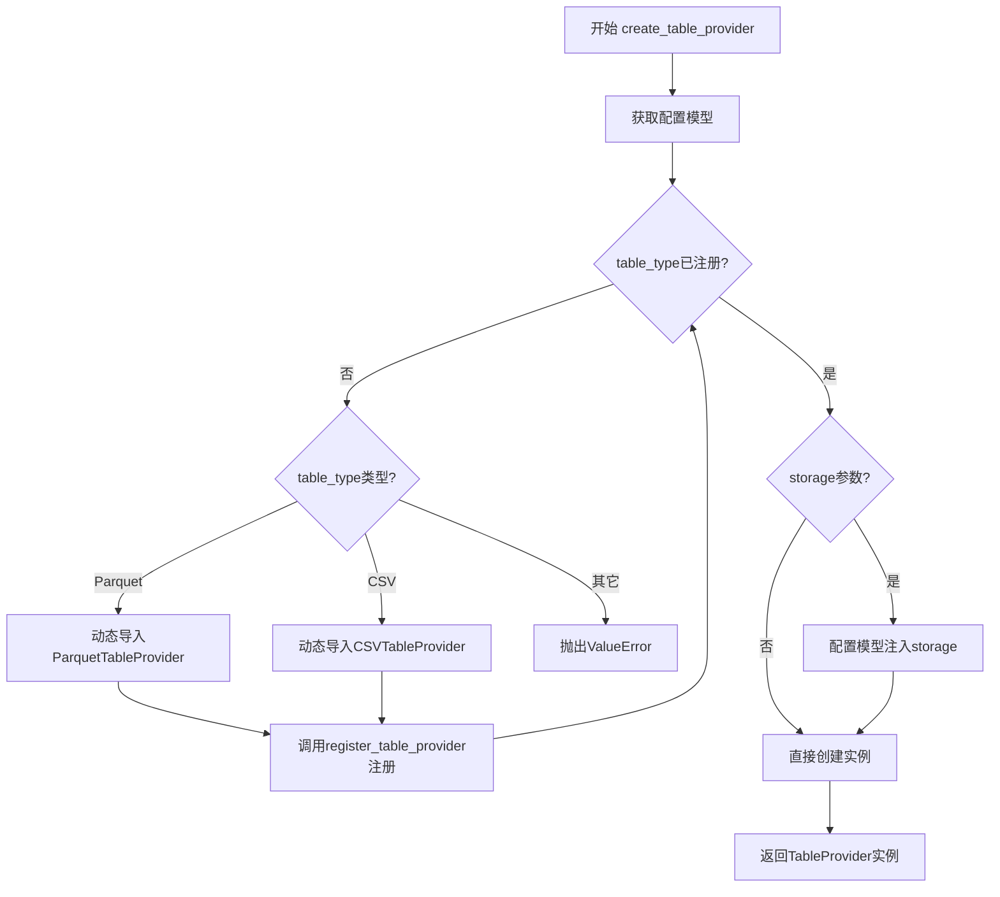
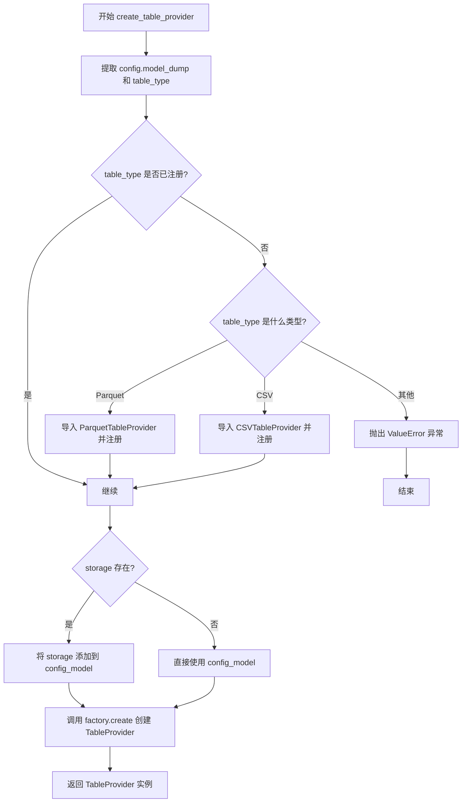
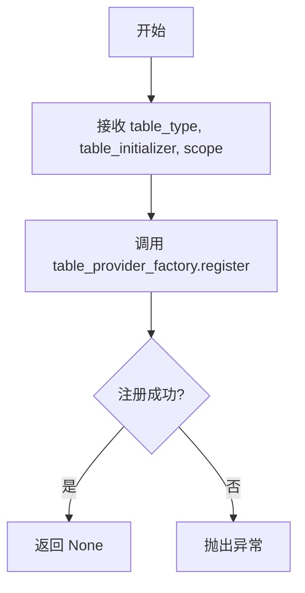
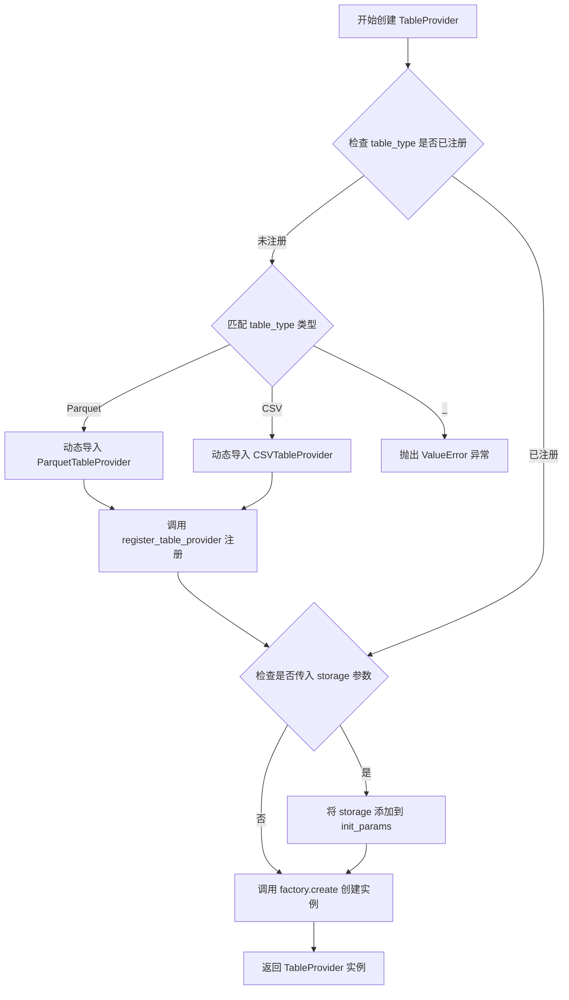
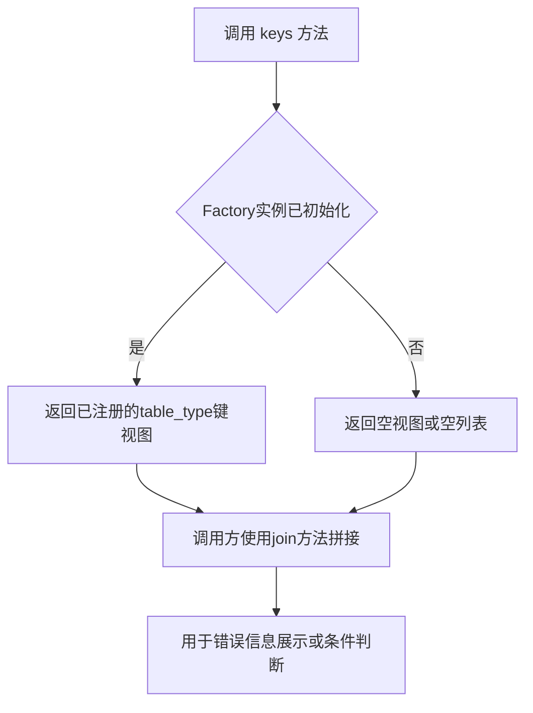

# `graphrag\packages\graphrag-storage\graphrag_storage\tables\table_provider_factory.py` 详细设计文档

一个表存储实现的工厂类，用于动态注册和创建不同类型的表提供者（如Parquet、CSV等），支持基于配置文件的插件式存储后端扩展

## 整体流程



## 类结构

```
Factory<T> (泛型抽象基类)
└── TableProviderFactory (表提供者工厂实现)
```

## 全局变量及字段


### `table_provider_factory`
    
全局工厂实例，用于注册和创建表存储提供者（如Parquet、CSV等）

类型：`TableProviderFactory`
    


    

## 全局函数及方法


### `register_table_provider`

该函数用于将自定义的表存储实现注册到全局的 `TableProviderFactory` 工厂中，使得后续可以通过工厂创建对应的表提供者实例。

参数：

- `table_type`：`str`，要注册的表类型标识符
- `table_initializer`：`Callable[..., TableProvider]`，用于创建 TableProvider 实例的可调用对象
- `scope`：`ServiceScope`，服务作用域，默认为 `"transient"`（瞬态）

返回值：`None`，无返回值

#### 流程图

```mermaid
flowchart TD
    A[开始 register_table_provider] --> B[接收参数 table_type, table_initializer, scope]
    B --> C{检查 scope 是否提供}
    C -->|未提供| D[使用默认值 "transient"]
    C -->|已提供| E[使用传入的 scope]
    D --> F[调用 table_provider_factory.register]
    E --> F
    F --> G[在工厂中注册 table_type 与 table_initializer 的映射关系]
    G --> H[结束]
```

#### 带注释源码

```python
def register_table_provider(
    table_type: str,  # 表类型标识符，如 "Parquet", "CSV" 等
    table_initializer: Callable[..., TableProvider],  # 创建 TableProvider 的可调用对象
    scope: ServiceScope = "transient",  # 服务作用域，默认为瞬态
) -> None:
    """Register a custom storage implementation.

    Args
    ----
        - table_type: str
            The table type id to register.
        - table_initializer: Callable[..., TableProvider]
            The table initializer to register.
    """
    # 调用工厂的 register 方法将表类型和初始化器注册到全局工厂中
    table_provider_factory.register(table_type, table_initializer, scope)
```


### `create_table_provider`

根据给定的配置创建一个表提供者（TableProvider）实例。如果配置中指定的表类型（Parquet 或 CSV）尚未在工厂中注册，则自动导入并注册相应的提供者，最后调用工厂方法创建并返回表提供者实例。

参数：

- `config`：`TableProviderConfig`，表提供者配置，包含表类型和其他配置信息
- `storage`：`Storage | None`，可选的存储实现，用于基于文件的表提供者（如 Parquet 和 CSV）

返回值：`TableProvider`，创建好的表提供者实例

#### 流程图



#### 带注释源码

```python
def create_table_provider(
    config: TableProviderConfig, storage: Storage | None = None
) -> TableProvider:
    """Create a table provider implementation based on the given configuration.

    Args
    ----
        - config: TableProviderConfig
            The table provider configuration to use.
        - storage: Storage | None
            The storage implementation to use for file-based TableProviders such as Parquet and CSV.

    Returns
    -------
        TableProvider
            The created table provider implementation.
    """
    # 从配置对象中提取模型数据字典
    config_model = config.model_dump()
    # 获取表类型
    table_type = config.type

    # 检查表类型是否已在工厂中注册
    if table_type not in table_provider_factory:
        # 根据不同的表类型进行匹配处理
        match table_type:
            case TableType.Parquet:
                # 动态导入 Parquet 表提供者实现
                from graphrag_storage.tables.parquet_table_provider import (
                    ParquetTableProvider,
                )
                # 注册 Parquet 表提供者
                register_table_provider(TableType.Parquet, ParquetTableProvider)
            case TableType.CSV:
                # 动态导入 CSV 表提供者实现
                from graphrag_storage.tables.csv_table_provider import (
                    CSVTableProvider,
                )
                # 注册 CSV 表提供者
                register_table_provider(TableType.CSV, CSVTableProvider)
            case _:
                # 表类型未注册，抛出错误
                msg = f"TableProviderConfig.type '{table_type}' is not registered in the TableProviderFactory. Registered types: {', '.join(table_provider_factory.keys())}."
                raise ValueError(msg)

    # 如果提供了存储对象，将其注入到配置模型中
    if storage:
        config_model["storage"] = storage

    # 使用工厂创建表提供者实例并返回
    return table_provider_factory.create(table_type, config_model)
```


### `register_table_provider`

该函数是表提供者工厂的注册接口，用于将自定义的表类型及其初始化器注册到全局工厂实例中，支持按需加载和动态扩展表提供者实现。

参数：

- `table_type`：`str`，要注册的表类型标识符，用于唯一标识一种表格式（如 "parquet"、"csv" 等）
- `table_initializer`：`Callable[..., TableProvider]`，表提供者初始化器函数，用于创建具体的表提供者实例
- `scope`：`ServiceScope`，服务作用域，默认为 "transient"，用于控制服务实例的生命周期管理

返回值：`None`，该函数无返回值，仅执行注册操作

#### 流程图



#### 带注释源码

```python
def register_table_provider(
    table_type: str,
    table_initializer: Callable[..., TableProvider],
    scope: ServiceScope = "transient",
) -> None:
    """Register a custom storage implementation.

    Args
    ----
        - table_type: str
            The table type id to register.
        - table_initializer: Callable[..., TableProvider]
            The table initializer to register.
    """
    # 将表类型和初始化器注册到全局的 table_provider_factory 实例中
    # scope 参数控制服务实例的生命周期（transient/singleton 等）
    table_provider_factory.register(table_type, table_initializer, scope)
```


### `TableProviderFactory.create`

继承自基类 `Factory` 的核心方法，用于根据表类型和配置模型动态创建表提供者实例。

参数：

- `table_type`：`str`，表类型标识符（如 "parquet"、"csv" 等）
- `init_params`：`dict`，包含表提供者初始化参数的字典模型

返回值：`TableProvider`，创建的表提供者实例

#### 流程图



#### 带注释源码

```python
# 假设这是 Factory 基类中 create 方法的逻辑实现
# 此方法继承自 Factory[TableProvider] 基类

def create(self, table_type: str, init_params: dict) -> TableProvider:
    """根据表类型和初始化参数创建 TableProvider 实例。
    
    参数:
        table_type: str - 表类型标识符
        init_params: dict - 初始化参数字典
        
    返回:
        TableProvider - 表提供者实例
    """
    # 1. 从注册表中获取对应的类或工厂函数
    entry = self._registry.get(table_type)
    
    if entry is None:
        # 2. 如果未找到，抛出 KeyError 或 ValueError
        raise ValueError(f"Table type '{table_type}' not registered")
    
    # 3. 根据 scope 创建实例（transient/shared/singleton）
    # transient: 每次创建新实例
    # shared: 共享实例
    # singleton: 单例模式
    return self._create_instance(entry, init_params)
```


### `table_provider_factory.keys`

获取当前已注册的所有表提供程序类型的键集合。该方法继承自 `Factory` 基类，用于在创建表提供程序时检查是否有可用的实现，或在错误信息中列出已注册的表类型。

参数： 无

返回值：`KeysView[str]` 或 `list[str]`，已注册的表提供程序类型标识符集合

#### 流程图



#### 带注释源码

```python
# 该方法是 TableProviderFactory 类继承自 Factory 基类的方法
# 以下是代码中使用 keys() 的上下文示例：

# 在 create_table_provider 函数中检查 table_type 是否已注册
if table_provider_factory:  # 实际使用中可能通过 __contains__ 检查
    # ... 创建逻辑

# 错误消息中获取已注册的键列表
msg = f"TableProviderConfig.type '{table_type}' is not registered in the TableProviderFactory. Registered types: {', '.join(table_provider_factory.keys())}."
raise ValueError(msg)

# keys() 方法的基类实现思路（来自 Factory 类）
# def keys(self) -> KeysView[str]:
#     """Return registered keys."""
#     return self._factories.keys()
```

## 关键组件


### TableProviderFactory

工厂类，继承自 Factory<TableProvider>，用于管理和创建不同类型的表提供者实现。

### register_table_provider 函数

全局注册函数，用于将自定义表提供者实现注册到工厂中，支持瞬态作用域管理。

### create_table_provider 函数

核心创建函数，根据配置动态创建表提供者实现，支持按需延迟导入 Parquet 和 CSV 提供者。

### table_provider_factory 全局变量

表提供者工厂的单例实例，用于存储和管理所有已注册的表提供者类型。

### TableType 枚举

表类型标识符定义，用于区分不同的表格式（Parquet、CSV 等）。

### TableProviderConfig 配置类

表提供者配置模型，包含表类型和其他相关配置参数。

### Storage 接口

文件存储抽象，用于 Parquet 和 CSV 等基于文件的表提供者。


## 问题及建议


### 已知问题

-   **重复的导入与注册逻辑**：每次调用 `create_table_provider` 时，如果 `table_type` 不在工厂中，都会执行导入和注册逻辑，即使该类型刚刚被注册过，仍然会重复进入 match-case 分支进行判断，缺乏缓存机制。
-   **内部导入（Import Inside Function）**：`ParquetTableProvider` 和 `CSVTableProvider` 的导入放在函数内部，每次调用都会触发导入检查，影响性能且不符合最佳实践。
-   **缺乏线程安全保护**：`register_table_provider` 和工厂的注册操作没有加锁，在多线程环境下可能导致竞态条件。
- **类型注册与错误处理耦合**：新增表格类型时需要修改 `create_table_provider` 函数的 match-case 逻辑，违反开闭原则。
- **无日志记录**：代码中没有任何日志输出，难以追踪问题，特别是动态注册失败或配置错误时。
- **硬编码的默认值处理**：对 `storage` 参数的处理直接修改 `config_model` 字典，可能导致配置状态被意外修改。

### 优化建议

-   **预注册与模块级导入**：在模块初始化时预先注册内置的 TableProvider，或使用延迟导入 + 缓存标志位避免重复检查。
-   **引入线程锁**：在注册和创建操作中使用 `threading.Lock` 或 `asyncio.Lock` 保证并发安全。
-   **插件化架构**：将 TableProvider 的注册逻辑外部化或使用装饰器模式，减少对主函数的修改。
-   **添加日志记录**：使用 `logging` 模块记录注册、创建和错误信息，提升可调试性。
-   **防御性复制**：对 `config_model` 进行深拷贝后再修改，避免原始配置对象被污染。

## 其它


### 设计目标与约束

本模块的设计目标是提供一个统一的表存储抽象工厂，支持动态注册和创建不同类型的表提供者（如 Parquet、CSV 等），实现存储层的可插拔架构。约束条件包括：必须继承自 Factory 基类、注册的类型需实现 TableProvider 接口、仅支持配置的 TableType 枚举值、storage 参数仅对文件型表提供者有效。

### 错误处理与异常设计

当传入的 table_type 未在工厂中注册时，create_table_provider 函数会检查是否为内置类型（Parquet 或 CSV），若是则自动导入并注册；若仍不存在则抛出 ValueError 并附带已注册类型列表。register_table_provider 函数本身不进行参数校验，假设调用者传入合法的 table_type 和初始化器。Config 模型验证失败时由 Pydantic 自动抛出 ValidationError。

### 数据流与状态机

数据流为：调用方传入 TableProviderConfig → 提取 type 字段 → 检查工厂是否已注册 → 未注册则尝试动态导入内置类型并注册 → 合并 storage 参数到配置模型 → 调用工厂 create 方法创建实例。状态转换仅有两种：未注册 → 已注册（首次调用时自动完成）和已注册 → 实例创建成功。

### 外部依赖与接口契约

主要依赖包括：graphrag_common.factory.Factory（工厂基类）、graphrag_common.constants.ServiceScope（作用域枚举）、graphrag_storage.storage.Storage（存储接口）、graphrag_storage.tables.table_provider.TableProvider（表提供者接口）、graphrag_storage.tables.table_provider_config.TableProviderConfig（配置模型）、graphrag_storage.tables.table_type.TableType（表类型枚举）。调用方需保证 config 参数非空且 type 字段合法，storage 参数仅在表类型为文件型时有效。

### 模块初始化与加载时行为

table_provider_factory 在模块加载时创建为空实例，register_table_provider 负责填充工厂注册表。create_table_provider 首次调用时若遇到未知类型会触发延迟导入和自动注册，存在一定的时间开销但保证了模块加载速度。内置的 Parquet 和 CSV 提供者采用延迟导入策略以避免不必要的依赖。

### 线程安全与并发考量

Factory 基类通常实现线程安全的注册和创建方法，但本模块未显式声明线程安全保证。若在多线程环境下使用，建议在应用启动阶段完成所有自定义类型的注册，运行期间避免并发修改工厂注册表。

### 配置模型与序列化

TableProviderConfig.model_dump() 返回的字典会作为关键字参数传递给表提供者构造函数，因此配置字段必须与对应提供者的初始化参数匹配。当前实现假设所有配置字段均可序列化，若包含不可序列化的对象（如函数引用），会导致后续调用失败。

### 可扩展性设计

模块通过 register_table_provider 函数暴露注册接口，允许使用者添加自定义表提供者类型而无需修改核心代码。扩展时需保证新类型实现 TableProvider 接口并在 config 中提供必要的初始化参数。该设计遵循开闭原则，但对扩展者的约束较弱（无接口校验机制）。

    