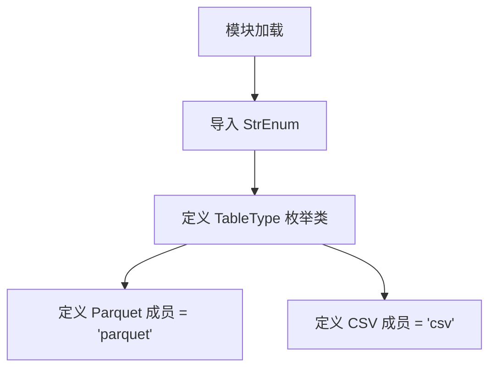
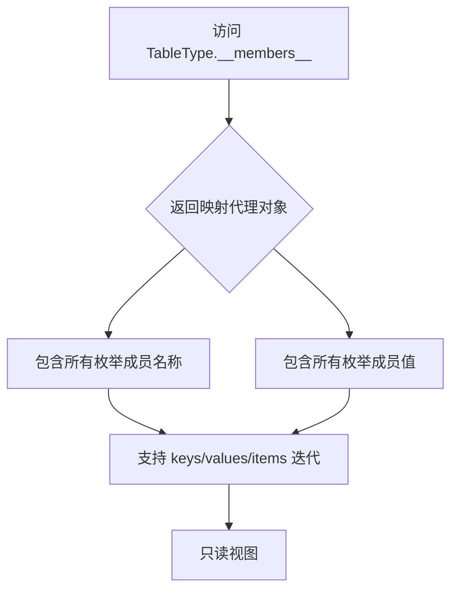
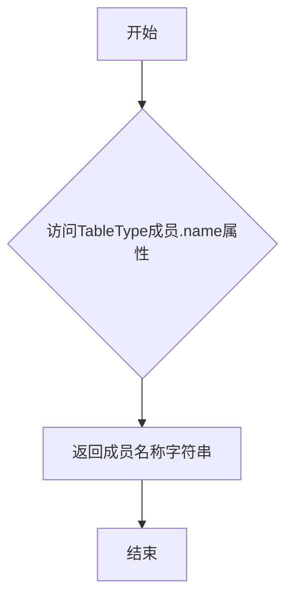
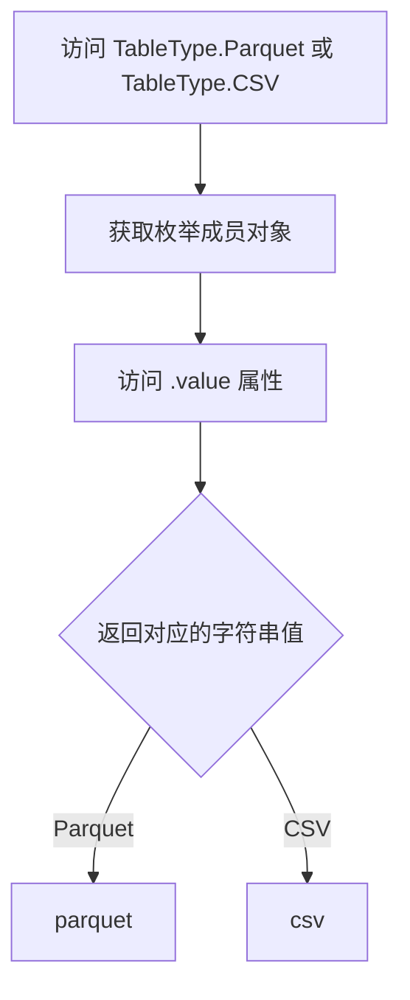

# `graphrag\packages\graphrag-storage\graphrag_storage\tables\table_type.py` 详细设计文档

该代码定义了一个简单的枚举类 TableType，用于表示内置的表存储实现类型，支持 Parquet 和 CSV 两种格式。该枚举继承自 Python 标准库的 StrEnum，提供类型安全的字符串枚举功能。

## 整体流程



## 类结构

```
StrEnum (Python 标准库)
└── TableType (自定义枚举类)
    ├── Parquet = 'parquet'
    └── CSV = 'csv'
```

## 全局变量及字段


### `TableType.Parquet`
    
表存储类型，表示使用Parquet文件格式存储表格数据

类型：`TableType`
    


### `TableType.CSV`
    
表存储类型，表示使用CSV文件格式存储表格数据

类型：`TableType`
    
    

## 全局函数及方法


### `TableType.__members__`

`TableType.__members__` 是 Python Enum 类的特殊属性，返回一个映射代理对象（mappingproxy），包含枚举类中所有成员名称到成员值的映射关系，可用于枚举成员的迭代、查找和 introspection 操作。

参数：无（这是一个属性访问，而非方法）

返回值：`mappingproxy`，返回成员名称到成员值的只读字典映射（例如：`{'Parquet': <TableType.Parquet: 'parquet'>, 'CSV': <TableType.CSV: 'csv'>}`）

#### 流程图



#### 带注释源码

```python
# TableType 类的定义
class TableType(StrEnum):
    """Enum for table storage types."""
    # 定义两个枚举成员
    Parquet = "parquet"  # Parquet 存储类型
    CSV = "csv"          # CSV 存储类型

# 访问 __members__ 属性
# 这不是代码中显式定义的，而是 Python Enum 类的内置属性
# 返回值类型: mappingproxy (字典的只读视图)
members = TableType.__members__

# members 的结构:
# mappingproxy({
#     'Parquet': <TableType.Parquet: 'parquet'>, 
#     'CSV': <TableType.CSV: 'csv'>
# })

# 用途示例:
# - 迭代所有成员名称: for name in TableType.__members__
# - 获取所有成员值: list(TableType.__members__.values())
# - 检查成员是否存在: 'Parquet' in TableType.__members__
```

#### 关键组件信息

- **TableType**：StrEnum 枚举类，用于表示表存储类型
- **Parquet**：枚举成员，代表 Parquet 文件格式存储
- **CSV**：枚举成员，代表 CSV 文件格式存储

#### 潜在技术债务或优化空间

1. **枚举成员描述缺失**：缺少 docstring 对各成员的具体用途进行说明
2. **功能单一**：目前仅支持两种存储类型，可能需要扩展更多类型（如 JSON、ORC 等）

#### 其它说明

- **设计目标**：通过 StrEnum 提供类型安全的表存储类型标识
- **约束**：成员值必须为字符串（StrEnum 特性）
- **错误处理**：非法成员访问会抛出 `ValueError`
- **外部依赖**：Python 3.11+ 内置的 `StrEnum`


### `TableType.name`

这是Python枚举的内置属性，用于获取枚举成员的名称。

参数：

- （无参数）

返回值：`str`，返回枚举成员的名称字符串

#### 流程图



#### 带注释源码

```python
# name是Python枚举的内置属性，不是自定义方法
# 以下展示name属性的使用方式和返回结果

# 访问枚举成员的name属性
# TableType.Parquet.name 返回字符串 "Parquet"
# TableType.CSV.name 返回字符串 "csv"

# 示例代码：
member = TableType.Parquet
member_name = member.name  # 返回 "Parquet"

# name属性返回的是枚举定义时的成员名称（区分大小写）
# 而value属性返回的是枚举的实际值（可能不同）
```


### `TableType.value`

描述枚举成员所关联的底层值。在 `StrEnum` 中，`value` 属性返回枚举成员对应的字符串值。

参数：此为枚举属性，不接受任何参数。

返回值：`str`，返回枚举成员所关联的字符串值（例如，`TableType.Parquet.value` 返回 `"parquet"`，`TableType.CSV.value` 返回 `"csv"`）。

#### 流程图



#### 带注释源码

```python
# 定义一个基于字符串的枚举类，继承自 StrEnum
class TableType(StrEnum):
    """Enum for table storage types."""
    
    # 定义两个枚举成员：Parquet 和 CSV
    # 每个成员都关联一个字符串值
    # 当访问 TableType.Parquet.value 时，返回字符串 "parquet"
    # 当访问 TableType.CSV.value 时，返回字符串 "csv"
    
    Parquet = "parquet"  # Parquet 文件格式类型
    CSV = "csv"         # CSV 文件格式类型
```

#### 补充说明

`value` 是 Python `Enum` 类（特别是 `StrEnum`）的内置属性，而非自定义方法。在 `StrEnum` 中：

- 每个枚举成员都绑定一个字符串值
- 通过 `.value` 可以获取该字符串值
- `StrEnum` 自动使枚举成员支持字符串操作（如比较、拼接等）


## 关键组件


### TableType 枚举类

用于表示表格存储实现类型的枚举类，定义了支持的存储格式类型。

### Parquet 枚举成员

表示 Parquet 文件格式的表格存储类型。

### CSV 枚举成员

表示 CSV 文件格式的表格存储类型。


## 问题及建议


### 已知问题

-   **功能不完整**：代码仅定义了一个空枚举类，缺少实际存储实现逻辑，与"Builtin table storage implementation types"的文档描述不符
-   **文档不充分**：类文档字符串过于简单，枚举成员缺少注释说明具体用途
-   **可扩展性差**：仅支持 Parquet 和 CSV 两种格式，未预留其他存储类型扩展（如 JSON、SQL、Delta Lake 等）
-   **缺少配套抽象**：仅有 TableType 枚举，缺少对应的接口定义或抽象基类来约束实现
-   **Python 版本依赖**：使用了 `StrEnum`（Python 3.11+ 新特性），但代码未声明最低 Python 版本要求

### 优化建议

-   补充完整的表存储实现类（如 `ParquetTableStorage`、`CSVTableStorage`），与枚举形成配套
-   添加接口抽象层（ABC 或 Protocol），定义统一的表存储方法签名
-   为枚举成员添加文档注释，说明每种存储格式的适用场景
-   在 `pyproject.toml` 或 `setup.py` 中明确声明 `python_requires = ">=3.11"`
-   考虑将 `TableType` 改为更灵活的枚举模式，或提供运行时注册机制以支持自定义存储类型

## 其它


### 设计目标与约束

定义一个类型安全的枚举类，用于表示不同的表格存储格式，支持Parquet和CSV两种格式，采用StrEnum确保字符串类型的值，便于配置和类型检查。

### 外部依赖与接口契约

依赖Python 3.11+的StrEnum枚举基类，提供字符串枚举值的支持。该枚举类作为配置接口被其他模块引用，调用方应使用TableType枚举值而非硬编码字符串。

### 使用场景与用例

该枚举类主要用于：1) 数据处理管道中选择输出格式；2) 配置文件定义存储类型；3) 动态加载不同格式的数据源；4) 类型安全的API参数定义。

### 扩展性设计

当前支持Parquet和CSV两种格式，未来可通过继承TableType枚举添加新类型，如JSON、Excel等。添加新类型时需确保值与实际存储实现对应。

### 版本兼容性说明

使用StrEnum需要Python 3.11及以上版本。在较低版本Python中需使用enum.Enum配合str类型实现。

### 类型安全与验证

由于继承StrEnum，枚举值自动具备字符串类型特性，可直接用于字符串比较和格式化操作，无需额外类型转换。

### 测试策略建议

应测试枚举值的字符串表示、枚举成员访问、不同格式值的正确性，以及与其他模块集成时的类型兼容性。

### 潜在风险与限制

当前设计为纯配置定义，未包含文件读写实现逻辑；枚举值与实际存储操作之间缺乏运行时验证机制。


    