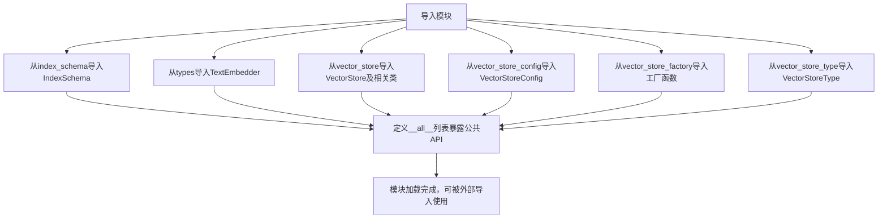
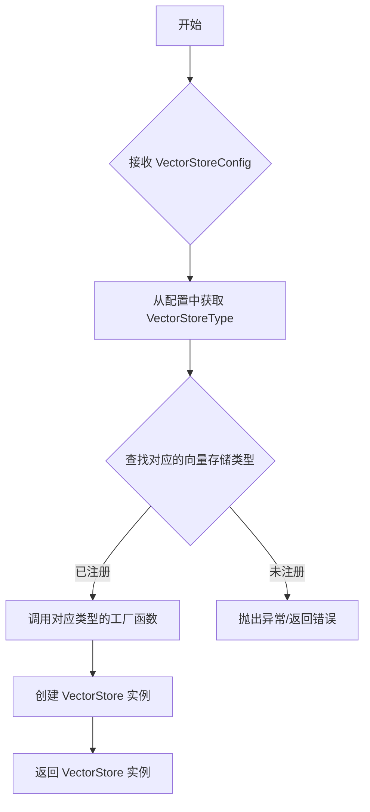
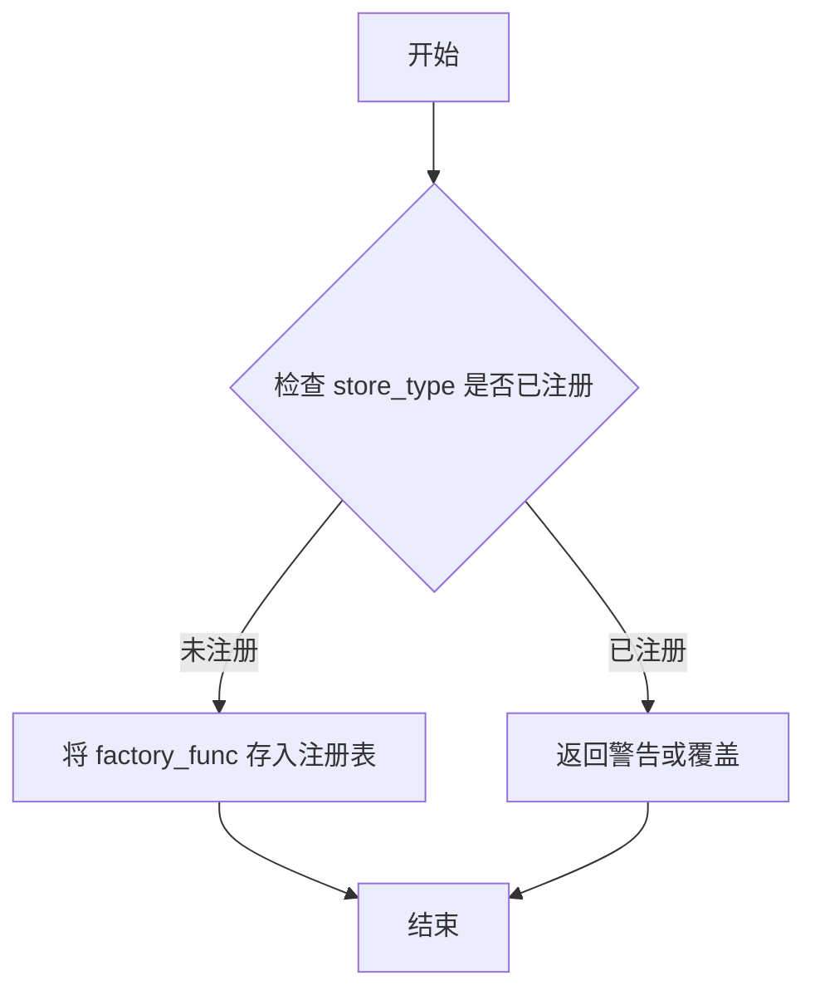
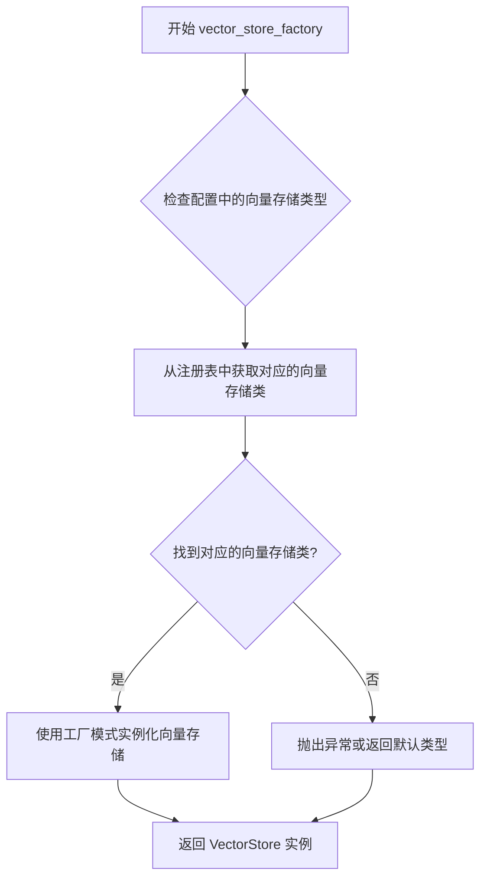

# `graphrag\packages\graphrag-vectors\graphrag_vectors\__init__.py` 详细设计文档

GraphRAG向量存储模块的公共API入口文件，通过重新导出内部子模块的核心类和函数，为外部使用者提供统一的向量存储接口抽象，包括向量存储基类、文档模型、搜索结果、配置类、工厂函数以及向量存储类型枚举等完整的功能集合。

## 整体流程



## 类结构

```
graphrag_vectors (包)
└── __init__.py (入口模块)
    ├── IndexSchema (从index_schema导入)
    ├── TextEmbedder (从types导入)
    ├── VectorStore (从vector_store导入)
    ├── VectorStoreDocument (从vector_store导入)
    ├── VectorStoreSearchResult (从vector_store导入)
    ├── VectorStoreConfig (从vector_store_config导入)
    ├── VectorStoreFactory (从vector_store_factory导入)
    ├── VectorStoreType (从vector_store_type导入)
    ├── create_vector_store (从vector_store_factory导入)
    ├── register_vector_store (从vector_store_factory导入)
    └── vector_store_factory (从vector_store_factory导入)
```

## 全局变量及字段


### `IndexSchema`
    
Defines the schema structure for the vector index, typically mapping to column definitions.

类型：`Class`
    


### `TextEmbedder`
    
Defines the interface (Protocol) for text embedding models used by the vector store.

类型：`Protocol`
    


### `VectorStore`
    
Abstract base class defining the core interface for vector storage and retrieval operations.

类型：`Class`
    


### `VectorStoreConfig`
    
Configuration class used to initialize and configure VectorStore instances.

类型：`Class`
    


### `VectorStoreDocument`
    
Data class representing a document entity within the vector store.

类型：`Class`
    


### `VectorStoreFactory`
    
Factory class responsible for instantiating specific VectorStore implementations based on configuration.

类型：`Class`
    


### `VectorStoreSearchResult`
    
Data class encapsulating the results returned from a vector search query.

类型：`Class`
    


### `VectorStoreType`
    
Enumeration defining the supported backend types for vector storage (e.g., LanceDB, Faiss).

类型：`Enum`
    


### `create_vector_store`
    
Helper function to simplify the creation and initialization of a VectorStore instance.

类型：`Function`
    


### `register_vector_store`
    
Function to register a custom vector store implementation with the global factory.

类型：`Function`
    


### `vector_store_factory`
    
Global singleton instance of the VectorStoreFactory used for registry and lookup.

类型：`Variable`
    


    

## 全局函数及方法


### `create_vector_store`

该函数是 GraphRAG 向量存储的工厂函数，用于根据配置创建相应类型的向量存储实例。它接收配置参数，实例化对应的向量存储类型，并返回统一的 VectorStore 接口实例。

参数：

- `config`：`VectorStoreConfig`，向量存储的配置对象，包含存储类型、连接参数、索引配置等信息

返回值：`VectorStore`，返回创建的向量存储实例，提供统一的向量存储操作接口

#### 流程图



#### 带注释源码

```
# 该函数定义在 graphrag_vectors.vector_store_factory 模块中
# 此处展示从 __init__.py 导出的接口声明

from graphrag_vectors.vector_store_factory import (
    VectorStoreFactory,
    create_vector_store,  # 核心工厂函数
    register_vector_store,
    vector_store_factory,
)

# 导出列表
__all__ = [
    ...
    "create_vector_store",
    ...
]
```

**注意**：当前提供的代码为 `__init__.py` 导入模块文件，`create_vector_store` 的实际实现位于 `graphrag_vectors.vector_store_factory` 模块中。从代码结构推测，该函数应该是一个工厂函数，根据传入的 `VectorStoreConfig` 配置参数，创建并返回对应类型的 `VectorStore` 实例。


### `register_vector_store`

该函数用于将自定义的向量存储类型注册到全局的向量存储工厂系统中，使得后续可以通过 `create_vector_store` 或 `vector_store_factory` 创建对应类型的向量存储实例。

**注意**：提供的代码仅为导入语句，未包含 `register_vector_store` 的实际实现代码。以下信息基于函数名称、导入上下文及常见工厂模式的合理推断。

#### 参数

- `store_type`：`VectorStoreType` 或 `str`，向量存储的类型标识符
- `factory_func`：`Callable`，用于创建对应类型向量存储实例的工厂函数

#### 返回值

- `None` 或 `bool`，通常返回 `None` 表示注册成功，或返回 `True`/`False` 表示是否注册成功

#### 流程图



#### 带注释源码

```
# 推断的实现方式（基于常见工厂模式）
from typing import Callable, Dict, Optional

# 全局注册表
_vector_store_registry: Dict[str, Callable] = {}

def register_vector_store(
    store_type: str,  # 向量存储类型标识
    factory_func: Callable[..., VectorStore]  # 创建向量存储的工厂函数
) -> None:
    """
    注册向量存储类型到全局工厂
    
    Args:
        store_type: 向量存储的唯一标识符（如 "azure_ai_search", "chromadb" 等）
        factory_func: 接收 VectorStoreConfig 参数并返回 VectorStore 实例的函数
    
    Raises:
        ValueError: 如果 store_type 已注册
    """
    if store_type in _vector_store_registry:
        # 可选择覆盖或抛出异常
        raise ValueError(f"Vector store type '{store_type}' is already registered")
    
    _vector_store_registry[store_type] = factory_func
```

#### 备注

由于原始代码仅包含导入语句，未提供 `register_vector_store` 的实际实现。若需获取准确的函数签名、参数类型和实现细节，建议查看 `graphrag_vectors/vector_store_factory.py` 源文件。


### `vector_store_factory`

这是一个工厂函数，用于根据配置创建相应的向量存储（VectorStore）实例。它是 GraphRAG 向量存储系统的核心工厂方法，支持不同类型的向量存储实现。

参数：

- `config`：`VectorStoreConfig`，用于配置向量存储的类型、连接参数和其他选项
- `text_embedder`：`TextEmbedder`（可选），文本嵌入器，用于将文本转换为向量

返回值：`VectorStore`，返回创建的向量存储实例

#### 流程图



#### 带注释源码

```python
# 这是一个从 graphrag_vectors.vector_store_factory 模块重新导出的函数
# 源文件位置: graphrag_vectors/vector_store_factory.py
# 该模块导出以下组件:
# - VectorStoreFactory: 工厂类
# - create_vector_store: 创建向量存储的便捷函数
# - register_vector_store: 注册新的向量存储类型
# - vector_store_factory: 核心工厂函数

from graphrag_vectors.vector_store_factory import (
    VectorStoreFactory,
    create_vector_store,
    register_vector_store,
    vector_store_factory,
)

# 该函数在源模块中的典型签名可能是:
# def vector_store_factory(
#     config: VectorStoreConfig,
#     text_embedder: Optional[TextEmbedder] = None
# ) -> VectorStore:
#     """根据配置创建向量存储实例"""
#     ...
```

---

### 补充说明

由于提供的代码只是一个**重新导出模块**（re-export module），并未包含 `vector_store_factory` 的实际实现，以上信息是基于以下推断：

1. **推断依据**：
   - 函数名称遵循工厂模式命名约定（`xxx_factory`）
   - 导入了相关的配置类 `VectorStoreConfig` 和接口类 `VectorStore`
   - 从同一模块导入了 `create_vector_store` 和 `register_vector_store` 等相关函数

2. **设计模式**：
   - 该函数很可能采用**工厂模式**（Factory Pattern）
   - 可能支持通过 `VectorStoreType` 枚举注册不同的向量存储实现（如 LanceDB、Azure AI Search 等）

3. **如需获取完整实现**，请参考 `graphrag_vectors/vector_store_factory.py` 源文件

## 关键组件


### IndexSchema

索引模式定义类，用于定义向量存储的索引结构，包含索引字段类型、维度等信息。

### TextEmbedder

文本嵌入器类型定义，定义文本到向量嵌入的接口或类型，用于将文本转换为向量表示。

### VectorStore

向量存储抽象基类，定义向量存储的标准接口，包括添加文档、搜索、删除等核心操作。

### VectorStoreConfig

向量存储配置类，包含向量存储的初始化参数，如维度、距离度量方式、索引类型等配置信息。

### VectorStoreDocument

向量存储文档模型，表示存储在向量数据库中的文档对象，包含文本内容、向量嵌入、元数据等属性。

### VectorStoreFactory

向量存储工厂类，负责根据配置创建不同类型向量存储实例的工厂模式实现。

### VectorStoreSearchResult

向量存储搜索结果类，包含搜索返回的文档列表、相似度分数、排名等搜索结果信息。

### VectorStoreType

向量存储类型枚举，定义支持的向量存储后端类型，如LanceDB、Faiss、Milvus等。

### create_vector_store

全局函数，用于根据配置创建向量存储实例的便捷函数入口。

### register_vector_store

全局函数，用于将自定义向量存储实现注册到工厂系统中，支持扩展新的向量存储后端。

### vector_store_factory

全局变量/单例，指向默认的向量存储工厂实例，提供标准化的向量存储创建接口。


## 问题及建议


### 已知问题

- **紧耦合的模块依赖结构**：代码直接从内部子模块（如 `index_schema`、`types`、`vector_store` 等）导入，这种方式创建了强耦合，一旦内部模块结构变化，导入语句需要大规模修改。
- **缺乏版本信息**：模块级别未定义 `__version__` 属性，无法直接获取包版本信息。
- **无导入错误处理**：任何子模块导入失败都会导致整个包无法加载，缺少优雅的错误处理和降级机制。
- **潜在的循环依赖风险**：由于直接导入所有子模块，如果未来某个子模块依赖当前模块，会导致循环导入问题。
- **缺乏模块级文档和类型注解**：模块本身没有 docstring 和类型注解，对外暴露的接口契约不够明确。
- **`__all__` 列表冗余**：直接导出所有子模块的公共接口，未经过滤或抽象，可能暴露不必要的内部实现细节。

### 优化建议

- **添加模块级 docstring**：为包编写清晰的文档，说明其用途、版本和主要组件。
- **定义 `__version__` 属性**：在模块级别添加版本信息，方便外部调用。
- **实现导入错误处理**：使用 try-except 包装导入语句，提供更有意义的错误信息或延迟导入。
- **添加类型注解和类型检查**：为模块级变量添加类型注解，提高类型安全性和 IDE 支持。
- **重构为更抽象的接口层**：考虑通过工厂函数或代理类封装导入逻辑，减少直接暴露子模块细节。
- **审查 `__all__` 列表**：确保只导出必要的公共接口，隐藏内部实现细节。


## 其它


### 设计目标与约束

本模块作为GraphRAG向量存储的统一接口层，旨在提供抽象化的向量存储实现，允许用户通过配置灵活切换不同的向量存储后端（如Azure AI Search、FAISS等）。设计约束包括：必须实现VectorStore基类接口；所有向量存储实现必须支持基本的CRUD操作和相似度搜索；配置通过VectorStoreConfig统一管理；工厂模式解耦具体实现与调用逻辑。

### 错误处理与异常设计

模块定义了向量存储操作可能抛出的异常类型，包括：连接失败异常（VectorStoreConnectionError）、配置错误异常（VectorStoreConfigError）、文档处理异常（VectorStoreDocumentError）、搜索结果异常（VectorStoreSearchError）。所有异常继承自基类VectorStoreException，异常消息应包含足够的上下文信息便于调试。工厂函数在创建失败时应返回有意义的错误信息。

### 外部依赖与接口契约

本模块依赖graphrag_vectors内部包定义的接口契约：VectorStore定义CRUD和搜索的标准接口；IndexSchema定义索引字段结构；TextEmbedder定义文本嵌入转换接口；VectorStoreConfig定义配置参数结构。调用方需保证传入的VectorStoreConfig包含必要字段（如vector_store_type、api_key等），返回的VectorStoreDocument必须包含id、text、vector等核心字段。

### 性能考虑

向量存储操作性能瓶颈主要集中在：大规模向量检索的相似度计算、批量文档插入的网络开销、嵌入向量的内存占用。建议实现方支持批量操作（batch insert/search）、连接池复用、异步接口支持。工厂应缓存已创建的向量存储实例避免重复初始化。

### 安全性考虑

配置中的敏感信息（如API Key、连接字符串）应通过环境变量或安全配置中心获取，避免硬编码。建议实现方支持TLS加密连接、访问令牌认证、审计日志记录。搜索结果应进行权限过滤，防止未授权数据泄露。

### 使用示例

```python
from graphrag_vectors import create_vector_store, VectorStoreConfig

# 通过配置创建向量存储
config = VectorStoreConfig(
    vector_store_type=VectorStoreType.AZURE_AI_SEARCH,
    api_key="your-api-key",
    index_name="your-index"
)
store = create_vector_store(config)

# 文档操作
doc = VectorStoreDocument(id="1", text="sample text", vector=[0.1, 0.2])
store.insert(doc)

# 相似度搜索
results = store.search(query_vector=[0.1, 0.2], top_k=10)
```

### 版本兼容性

本模块遵循语义化版本规范。当前版本需兼容graphrag_vectors 1.x系列接口。VectorStore基类接口变更将作为主版本升级发布。register_vector_store允许第三方扩展，但需遵守接口契约否则可能导致运行时错误。

    