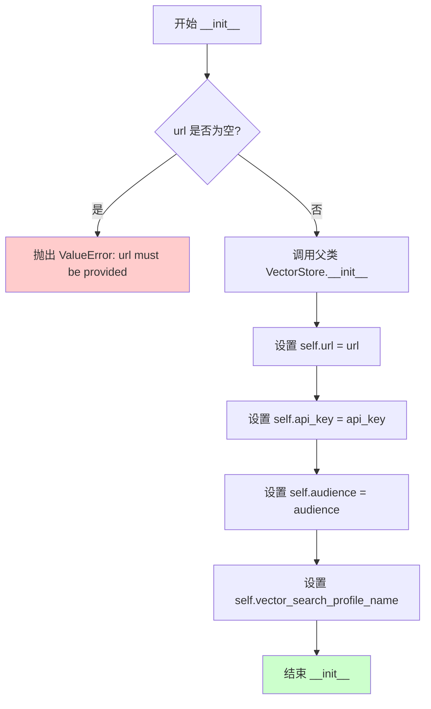
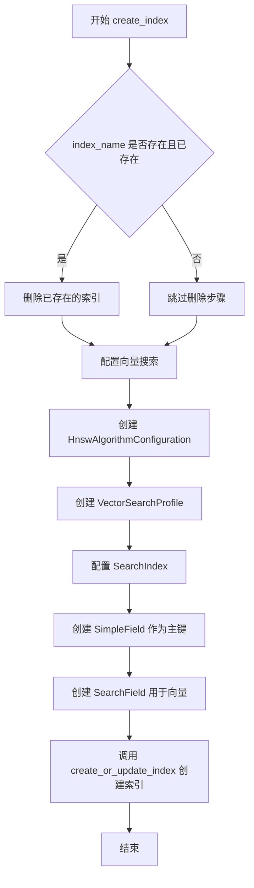
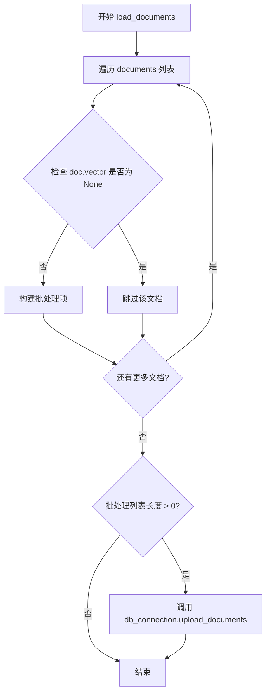
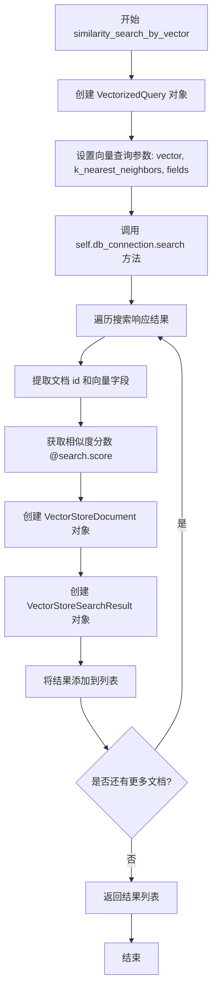
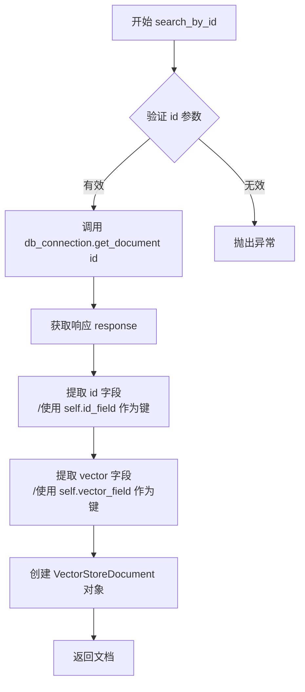

# `graphrag\packages\graphrag-vectors\graphrag_vectors\azure_ai_search.py` 详细设计文档

这是一个Azure AI Search向量存储实现类，继承自VectorStore基类，提供了向量索引创建、文档加载、向量相似度搜索和按ID搜索等功能，用于在Azure AI Search服务中存储和检索向量数据。

## 整体流程

```mermaid
graph TD
A[初始化 AzureAISearchVectorStore] --> B[调用 connect() 方法]
B --> C{是否提供 api_key?}
C -- 是 --> D[使用 AzureKeyCredential]
C -- 否 --> E[使用 DefaultAzureCredential]
D --> F[创建 SearchClient 和 SearchIndexClient]
E --> F
F --> G[调用 create_index() 创建向量索引]
G --> H[调用 load_documents() 加载文档]
H --> I{查询请求}
I --> J[similarity_search_by_vector 向量搜索]
I --> K[search_by_id 按ID搜索]
```

## 类结构

```
VectorStore (抽象基类/父类)
└── AzureAISearchVectorStore (实现类)
```

## 全局变量及字段


### `AzureAISearchVectorStore.index_client`
    
索引客户端，用于管理Azure AI Search索引的创建、删除等操作

类型：`SearchIndexClient`
    


### `AzureAISearchVectorStore.url`
    
Azure AI Search服务URL

类型：`str`
    


### `AzureAISearchVectorStore.api_key`
    
API密钥，用于认证访问Azure AI Search服务

类型：`str | None`
    


### `AzureAISearchVectorStore.audience`
    
认证受众，指定令牌的目标受众

类型：`str | None`
    


### `AzureAISearchVectorStore.vector_search_profile_name`
    
向量搜索配置文件名称，用于配置向量搜索算法

类型：`str`
    


### `AzureAISearchVectorStore.db_connection`
    
数据库连接，用于执行文档搜索和上传操作（继承自VectorStore）

类型：`SearchClient`
    


### `AzureAISearchVectorStore.index_name`
    
索引名称，Azure AI Search中索引的唯一标识符（继承自VectorStore）

类型：`str`
    


### `AzureAISearchVectorStore.id_field`
    
ID字段名，用于存储文档唯一标识符的字段名称（继承自VectorStore）

类型：`str`
    


### `AzureAISearchVectorStore.vector_field`
    
向量字段名，用于存储文档向量的字段名称（继承自VectorStore）

类型：`str`
    


### `AzureAISearchVectorStore.vector_size`
    
向量维度，嵌入向量的维度大小（继承自VectorStore）

类型：`int`
    
    

## 全局函数及方法


### `AzureAISearchVectorStore.__init__`

初始化 Azure AI Search 向量存储客户端，配置连接参数和向量搜索配置文件的名称。该构造函数继承自 VectorStore 基类，验证 URL 必填参数，并存储用于连接 Azure AI Search 服务的认证信息和搜索配置文件名。

参数：

- `url`：`str`，Azure AI Search 服务的端点 URL，必填参数
- `api_key`：`str | None`，可选的 API 密钥，用于 Azure Key Credential 身份验证
- `audience`：`str | None`，可选的令牌 audience，用于 DefaultAzureCredential 身份验证
- `vector_search_profile_name`：`str`，向量搜索配置文件的名称，默认为 "vectorSearchProfile"
- `**kwargs`：`Any`，继承自父类 VectorStore 的额外关键字参数

返回值：`None`，构造函数不返回值，仅初始化实例属性

#### 流程图



#### 带注释源码

```python
def __init__(
    self,
    url: str,
    api_key: str | None = None,
    audience: str | None = None,
    vector_search_profile_name: str = "vectorSearchProfile",
    **kwargs: Any,
):
    """
    初始化 AzureAISearchVectorStore 实例。
    
    参数:
        url: Azure AI Search 服务的端点 URL
        api_key: 可选的 API 密钥，用于密钥认证
        audience: 可选的令牌 audience，用于默认 Azure 凭据认证
        vector_search_profile_name: 向量搜索配置文件名称
        kwargs: 传递给父类的额外参数
    """
    # 调用父类 VectorStore 的构造函数
    super().__init__(**kwargs)
    
    # 验证必填参数 url
    if not url:
        msg = "url must be provided for Azure AI Search."
        raise ValueError(msg)
    
    # 存储 Azure AI Search 端点 URL
    self.url = url
    
    # 存储可选的 API 密钥
    self.api_key = api_key
    
    # 存储可选的 audience 参数
    self.audience = audience
    
    # 存储向量搜索配置文件名称
    self.vector_search_profile_name = vector_search_profile_name
```


### `AzureAISearchVectorStore.connect`

该方法用于建立与 Azure AI Search 服务的连接，初始化 SearchClient 和 SearchIndexClient 实例，以便后续进行向量存储操作。

参数：

- `self`：隐式参数，类型为 `AzureAISearchVectorStore` 实例，表示当前向量存储对象本身

返回值：`Any`，无具体返回值，仅初始化 `self.db_connection` 和 `self.index_client` 属性

#### 流程图

```mermaid
flowchart TD
    A[开始 connect] --> B{self.audience 存在且 self.api_key 不存在?}
    B -->|是| C[创建 audience_arg = {'audience': self.audience}]
    B -->|否| D[创建 audience_arg = {}]
    C --> E[创建 SearchClient]
    D --> E
    E --> F[使用 AzureKeyCredential 或 DefaultAzureCredential]
    F --> G[创建 SearchIndexClient]
    G --> H[结束 connect]
```

#### 带注释源码

```python
def connect(self) -> Any:
    """Connect to AI search vector storage."""
    # 根据条件构建 audience 参数
    # 如果设置了 audience 且没有使用 API key 认证，则传递 audience
    # 否则使用空字典
    audience_arg = (
        {"audience": self.audience} if self.audience and not self.api_key else {}
    )
    
    # 创建 SearchClient 用于搜索操作
    # endpoint: Azure AI Search 服务 URL
    # index_name: 索引名称
    # credential: 根据是否有 api_key 决定认证方式
    #   - 有 api_key: 使用 AzureKeyCredential
    #   - 无 api_key: 使用 DefaultAzureCredential (Managed Identity 等)
    self.db_connection = SearchClient(
        endpoint=self.url,
        index_name=self.index_name,
        credential=(
            AzureKeyCredential(self.api_key)
            if self.api_key
            else DefaultAzureCredential()
        ),
        **audience_arg,  # 传递 audience 参数（如果存在）
    )
    
    # 创建 SearchIndexClient 用于索引管理操作
    # 使用与 SearchClient 相同的认证方式
    self.index_client = SearchIndexClient(
        endpoint=self.url,
        credential=(
            AzureKeyCredential(self.api_key)
            if self.api_key
            else DefaultAzureCredential()
        ),
        **audience_arg,  # 传递 audience 参数（如果存在）
    )
```


### `AzureAISearchVectorStore.create_index`

该方法用于在 Azure AI Search 服务中创建或重新创建向量索引。它首先检查索引是否已存在，若存在则删除旧索引，然后配置 HNSW 向量搜索算法和配置文件，最后定义索引字段结构（包括 ID 字段和向量字段）并创建或更新索引。

参数： 无

返回值：`None`，无返回值描述

#### 流程图



#### 带注释源码

```python
def create_index(self) -> None:
    """Load documents into an Azure AI Search index."""
    # 检查索引是否已存在，若存在则先删除旧索引以支持重新创建
    if (
        self.index_name is not None
        and self.index_name in self.index_client.list_index_names()
    ):
        self.index_client.delete_index(self.index_name)

    # 配置向量搜索配置，使用 HNSW 算法和余弦相似度
    vector_search = VectorSearch(
        algorithms=[
            HnswAlgorithmConfiguration(
                name="HnswAlg",
                parameters=HnswParameters(
                    metric=VectorSearchAlgorithmMetric.COSINE  # 使用余弦相似度作为度量
                ),
            )
        ],
        profiles=[
            VectorSearchProfile(
                name=self.vector_search_profile_name,
                algorithm_configuration_name="HnswAlg",
            )
        ],
    )
    # 配置索引的字段结构
    index = SearchIndex(
        name=self.index_name,
        fields=[
            # 字符串类型的主键字段，用于唯一标识文档
            SimpleField(
                name=self.id_field,
                type=SearchFieldDataType.String,
                key=True,
            ),
            # 向量字段，用于存储嵌入向量，支持向量搜索
            SearchField(
                name=self.vector_field,
                type=SearchFieldDataType.Collection(SearchFieldDataType.Single),
                searchable=True,
                hidden=False,  # DRIFT needs to return the vector for client-side similarity
                vector_search_dimensions=self.vector_size,  # 向量维度
                vector_search_profile_name=self.vector_search_profile_name,
            ),
        ],
        vector_search=vector_search,
    )
    # 在 Azure AI Search 中创建或更新索引
    self.index_client.create_or_update_index(
        index,
    )
```


### `AzureAISearchVectorStore.load_documents`

将文档列表加载到 Azure AI Search 索引中，通过构建批处理数据并调用 Azure Search 客户端的 upload_documents 方法实现向量化存储。

参数：

- `documents`：`list[VectorStoreDocument]` - 要加载到索引中的文档列表，每个文档包含 ID 和向量数据

返回值：`None`，该方法无返回值，通过副作用完成文档上传

#### 流程图



#### 带注释源码

```python
def load_documents(self, documents: list[VectorStoreDocument]) -> None:
    """Load documents into an Azure AI Search index."""
    # 遍历文档列表，筛选出包含向量的文档，并构建批处理格式
    batch = [
        {
            self.id_field: doc.id,          # 文档的唯一标识符字段
            self.vector_field: doc.vector,   # 文档的向量嵌入字段
        }
        for doc in documents                 # 遍历输入的文档列表
        if doc.vector is not None           # 过滤掉向量为 None 的文档
    ]

    # 仅当批处理中存在有效文档时才执行上传操作
    if len(batch) > 0:
        # 调用 Azure Search 客户端的批量上传方法
        self.db_connection.upload_documents(batch)
```


### `AzureAISearchVectorStore.similarity_search_by_vector`

执行基于向量的相似性搜索，通过查询向量在 Azure AI Search 索引中查找最相似的文档。

参数：

- `query_embedding`：`list[float]` ，用于搜索的查询向量嵌入
- `k`：`int` = 10，要返回的最近邻数量，默认为 10

返回值：`list[VectorStoreSearchResult]` ，包含相似文档及其相似度分数的列表

#### 流程图



#### 带注释源码

```python
def similarity_search_by_vector(
    self, query_embedding: list[float], k: int = 10
) -> list[VectorStoreSearchResult]:
    """Perform a vector-based similarity search."""
    # 创建向量查询对象，配置查询向量、返回数量和搜索字段
    vectorized_query = VectorizedQuery(
        vector=query_embedding,      # 查询向量嵌入
        k_nearest_neighbors=k,       # 要返回的最近邻数量
        fields=self.vector_field     # 要搜索的向量字段名
    )

    # 调用 Azure AI Search 的搜索接口执行向量搜索
    # 支持混合搜索场景
    response = self.db_connection.search(
        vector_queries=[vectorized_query],
    )

    # 将搜索响应转换为 VectorStoreSearchResult 对象列表
    # 遍历每个返回的文档，提取 id、向量和相似度分数
    return [
        VectorStoreSearchResult(
            document=VectorStoreDocument(
                id=doc.get(self.id_field, ""),      # 文档唯一标识符
                vector=doc.get(self.vector_field, []),  # 文档向量
            ),
            # 相似度分数，范围 0.333 到 1.000（余弦相似度）
            # 参考文档: https://learn.microsoft.com/en-us/azure/search/hybrid-search-ranking#scores-in-a-hybrid-search-results
            score=doc["@search.score"],
        )
        for doc in response
    ]
```


### `AzureAISearchVectorStore.search_by_id`

按ID在Azure AI Search向量存储中搜索并返回对应的文档对象。

参数：

- `id`：`str`，要搜索的文档的唯一标识符

返回值：`VectorStoreDocument`，包含文档ID和向量数据的文档对象

#### 流程图



#### 带注释源码

```python
def search_by_id(self, id: str) -> VectorStoreDocument:
    """Search for a document by id.
    
    Args:
        id: The unique identifier of the document to retrieve.
        
    Returns:
        VectorStoreDocument: The document with the specified ID.
        
    Raises:
        azure.core.exceptions.ResourceNotFoundError: If no document with the given ID exists.
    """
    # 调用Azure Search客户端的get_document方法获取指定ID的文档
    # self.db_connection 是 SearchClient 实例
    response = self.db_connection.get_document(id)
    
    # 从响应中提取文档ID和向量数据
    # self.id_field 和 self.vector_field 是从父类VectorStore继承的配置字段
    # 使用 .get() 方法提供默认值，防止字段缺失导致错误
    return VectorStoreDocument(
        id=response.get(self.id_field, ""),
        vector=response.get(self.vector_field, []),
    )
```

## 关键组件


### 向量存储核心类 (AzureAISearchVectorStore)

Azure AI Search向量存储的实现类，继承自VectorStore基类，负责与Azure AI Search服务交互以实现向量的存储、索引创建、文档加载和相似度搜索功能。

### 索引管理组件 (create_index)

负责在Azure AI Search中创建或更新搜索索引，包含HNSW向量搜索算法配置和向量搜索配置文件，支持余弦相似度度量。

### 文档加载组件 (load_documents)

将VectorStoreDocument对象批量上传到Azure AI Search索引，仅处理包含向量的文档，跳过vector为None的文档。

### 向量相似度搜索组件 (similarity_search_by_vector)

执行基于向量的相似度搜索，使用Azure AI Search的VectorizedQuery进行k近邻搜索，返回包含文档和相似度分数的搜索结果。

### ID查询组件 (search_by_id)

根据文档ID从Azure AI Search索引中检索单个文档，返回包含ID和向量的VectorStoreDocument对象。

### 连接管理组件 (connect)

建立与Azure AI Search的连接，同时创建SearchClient和SearchIndexClient，支持API Key和DefaultAzureCredential两种认证方式。

### HNSW算法配置

使用HNSW（Hierarchical Navigable Small World）算法进行向量索引和搜索，配置余弦相似度作为距离度量。

### 向量字段配置

在索引中定义向量字段，包含维度设置、搜索配置和可返回向量选项，hidden=False允许返回向量供客户端相似度计算使用。


## 问题及建议


### 已知问题

-   **索引删除风险**：`create_index()` 方法在创建新索引前会无条件删除同名索引，可能导致意外数据丢失，缺乏确认机制
-   **缺少异常处理**：所有 Azure SDK 调用（`connect`、`create_index`、`load_documents`、`similarity_search_by_vector`、`search_by_id`）均未捕获可能的网络、认证或服务端错误
-   **重复凭证逻辑**：`connect()` 方法中重复创建 `AzureKeyCredential` 或 `DefaultAzureCredential` 对象，可提取为私有方法
-   **类型注解不完整**：`db_connection` 字段无类型注解，`connect()` 返回 `Any` 而非具体类型
-   **配置硬编码**：向量搜索算法配置（HnswAlgorithmConfiguration、HnswParameters 的 metric）内部硬编码，不支持灵活配置不同的相似度度量
-   **文档过滤无反馈**：`load_documents()` 静默过滤掉 `vector is None` 的文档，调用者无法得知哪些文档被跳过
-   **方法参数命名**：`search_by_id(self, id: str)` 参数名 `id` 与 Python 内置类型冲突，虽合法但不是最佳实践

### 优化建议

-   在 `create_index()` 前增加索引存在性检查和可选的删除确认逻辑，或提供 `if_exists` 参数控制行为
-   为所有 Azure SDK 调用添加 try-except 包装，定义自定义异常类或使用 `azure-core` 的 `HttpResponseError`
-   提取 `get_credential()` 私有方法，避免 `connect()` 中的重复代码
-   为 `db_connection` 添加类型注解 `SearchClient`，为 `connect()` 返回类型标注 `None`
-   将 `HnswParameters` 的 `metric` 和算法配置开放为构造函数可选参数
-   在 `load_documents()` 中记录被过滤文档的数量或返回过滤结果摘要
-   考虑将 `search_by_id` 的参数名改为 `doc_id` 以避免歧义
-   添加日志记录（使用 `logging` 模块），便于生产环境调试和问题追踪

## 其它


### 设计目标与约束

本模块旨在提供Azure AI Search作为向量存储后端的实现，支持向量嵌入的存储和检索。设计目标包括：1) 与VectorStore基类完全兼容；2) 支持API Key和DefaultAzureCredential两种认证方式；3) 使用HNSW算法实现高效的向量相似度搜索；4) 支持混合搜索（向量+关键词）。主要约束包括：依赖Azure云服务、需提前配置Azure AI Search资源、向量维度需预先确定。

### 错误处理与异常设计

代码中的错误处理主要包括：1) __init__方法中对url参数的校验，url为空时抛出ValueError；2) create_index方法先删除已存在索引再创建；3) load_documents方法过滤掉vector为None的文档；4) similarity_search_by_vector和search_by_id方法使用get方法提供默认值。潜在异常：网络连接失败、认证失败、索引操作超时、文档上传失败、查询超时等。建议增加：重试机制、详细错误日志、具体异常类型定义、连接状态检查。

### 数据流与状态机

数据流：1) 初始化阶段：创建AzureAISearchVectorStore实例，配置url、api_key、audience等参数；2) 连接阶段：调用connect()方法，创建SearchClient和SearchIndexClient；3) 索引创建阶段：调用create_index()方法，创建SearchIndex并配置向量搜索参数；4) 文档加载阶段：调用load_documents()方法，将VectorStoreDocument转换为字典格式并上传到Azure AI Search；5) 搜索阶段：调用similarity_search_by_vector()方法，执行向量相似度搜索并返回结果。状态转换：未连接 -> 已连接（connect后）-> 索引存在（create_index后）-> 可搜索。

### 外部依赖与接口契约

外部依赖：1) azure-identity: DefaultAzureCredential用于无API Key认证；2) azure-search-documents: SearchClient和SearchIndexClient用于索引和文档操作；3) azure-search-documents-indexes: 索引管理；4) graphrag_vectors.vector_store: VectorStore基类及数据模型。接口契约：1) VectorStore抽象基类定义的标准接口（connect, create_index, load_documents, similarity_search_by_vector, search_by_id）；2) VectorStoreDocument数据结构（id, vector字段）；3) VectorStoreSearchResult返回值结构（document, score字段）；4) Azure AI Search REST API契约。

### 性能考虑

当前实现性能考虑：1) 批量上传文档使用upload_documents而非单个提交；2) 使用HNSW算法和COSINE度量优化向量搜索；3) search返回结果时使用生成器迭代。建议优化：1) 大批量文档加载时分批处理（建议每批1000条）；2) 考虑使用异步操作（async/await）；3) 添加搜索结果缓存机制；4) 索引创建考虑字段类型优化；5) 向量维度较大时可调整HnswParameters参数（m, efConstruction等）。

### 安全性考虑

安全相关实现：1) 支持API Key和DefaultAzureCredential两种认证方式；2) audience参数用于指定受众群体。建议增加：1) API Key应从环境变量或密钥Vault获取，避免硬编码；2) 敏感信息日志脱敏；3) TLS/SSL连接验证；4) 审计日志记录敏感操作；5) 索引访问控制配置。

### 配置管理

当前配置通过构造函数参数传入：url（必需）、api_key（可选）、audience（可选）、vector_search_profile_name（默认"vectorSearchProfile"）。建议增加：1) 从环境变量读取默认配置；2) 配置文件支持（YAML/JSON）；3) 配置验证和默认值处理；4) 运行时配置更新能力。

### 并发和线程安全性

当前代码未显式处理并发问题。潜在风险：1) 多个线程同时调用connect可能导致资源竞争；2) create_index和delete_index操作可能冲突；3) 批量文档上传建议串行执行。线程安全建议：1) 添加线程锁保护共享资源；2) 每个线程使用独立的client实例；3) 或使用连接池。

### 资源管理

资源管理：1) SearchClient和SearchIndexClient作为实例属性管理；2) db_connection和index_client在connect时创建。资源清理建议：1) 添加close()或disconnect()方法显式关闭连接；2) 实现上下文管理器接口（__enter__, __exit__）；3) 使用弱引用避免循环引用。

### 监控和日志

当前代码无显式日志和监控。建议增加：1) 操作成功/失败日志；2) 性能指标记录（索引创建耗时、搜索耗时、文档加载数量）；3) 错误追踪和告警；4) Azure Application Insights集成；5) 关键指标：索引文档数量、搜索延迟、向量维度、相似度分数分布。

### 兼容性考虑

兼容性设计：1) Python类型注解使用str | None（Python 3.10+）；2) 依赖azure-search-documents库的版本兼容性；3) BaseVectorStore接口稳定性。建议：1) 明确Python版本支持范围；2) 明确azure-*依赖的版本范围；3) 向后兼容性测试；4) 使用pydantic进行数据验证。

### 测试策略

测试建议：1) 单元测试：各方法独立测试，mock Azure SDK；2) 集成测试：使用Azure SDK的mock或test resources；3) 端到端测试：连接真实Azure AI Search资源（需CI/CD环境）；4) 边界测试：空输入、超大向量、特殊字符等；5) 性能测试：大规模向量数据搜索性能基准。测试覆盖重点：create_index的索引结构正确性、load_documents的数据转换、similarity_search_by_vector的查询构造、异常场景处理。

    