# `graphrag\packages\graphrag-vectors\graphrag_vectors\cosmosdb.py` 详细设计文档

这是Azure CosmosDB的向量存储实现，提供了向量文档的存储、加载、相似度搜索和按ID查询功能，支持通过连接字符串或URL+DefaultAzureCredential连接到CosmosDB，并实现了容器创建、索引管理和数据清理等完整生命周期管理。

## 整体流程

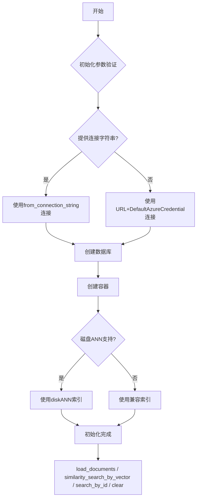

## 类结构

```
VectorStore (抽象基类)
└── CosmosDBVectorStore (Azure CosmosDB向量存储实现)
```

## 全局变量及字段


### `CosmosDBVectorStore._cosmos_client`
    
Azure CosmosDB客户端实例，用于与CosmosDB服务进行通信

类型：`CosmosClient`
    


### `CosmosDBVectorStore._database_client`
    
Azure CosmosDB数据库客户端代理，用于操作数据库

类型：`DatabaseProxy`
    


### `CosmosDBVectorStore._container_client`
    
Azure CosmosDB容器客户端代理，用于操作容器中的文档

类型：`ContainerProxy`
    


### `CosmosDBVectorStore.database_name`
    
CosmosDB数据库名称，指定要连接或创建的数据库

类型：`str`
    


### `CosmosDBVectorStore.connection_string`
    
CosmosDB连接字符串，用于通过连接字符串方式认证

类型：`str | None`
    


### `CosmosDBVectorStore.url`
    
CosmosDB服务URL地址，用于通过URL和默认凭据认证

类型：`str | None`
    


### `CosmosDBVectorStore.id_field`
    
文档ID字段名称，CosmosDB要求必须为'id'

类型：`str (继承)`
    


### `CosmosDBVectorStore.vector_field`
    
向量字段名称，存储文档的向量嵌入

类型：`str (继承)`
    


### `CosmosDBVectorStore.vector_size`
    
向量维度大小，指定向量嵌入的维度数

类型：`int (继承)`
    


### `CosmosDBVectorStore.index_name`
    
索引/容器名称，CosmosDB中的容器名

类型：`str (继承)`
    
    

## 全局函数及方法


### `cosine_similarity`

该内部函数用于计算两个向量的余弦相似度。当向量范数乘积为零时返回 0.0，否则返回点积除以两个向量范数的乘积。

参数：

- `a`：`list[float]`，第一个输入向量
- `b`：`list[float]`，第二个输入向量

返回值：`float`，返回两个向量之间的余弦相似度值，范围为 [-1, 1]，当向量范数为零时返回 0.0

#### 流程图

```mermaid
flowchart TD
    A[开始计算余弦相似度] --> B{检查向量范数乘积是否为零}
    B -->|是| C[返回 0.0]
    B -->|否| D[计算点积 dot]
    D --> E[计算范数 norm]
    E --> F[返回 dot / (norm_a * norm_b)]
    C --> G[结束]
    F --> G
```

#### 带注释源码

```python
def cosine_similarity(a, b):
    """计算两个向量的余弦相似度。
    
    参数:
        a: 第一个向量 (list[float])
        b: 第二个向量 (list[float])
    
    返回:
        float: 余弦相似度值，范围 [-1, 1]
    """
    # 如果两个向量的范数乘积为零，说明至少有一个向量是零向量
    # 余弦相似度未定义，返回 0.0
    if norm(a) * norm(b) == 0:
        return 0.0
    
    # 计算余弦相似度 = 点积 / (范数a * 范数b)
    # 这等价于 cos(theta)，其中 theta 是两个向量之间的夹角
    return dot(a, b) / (norm(a) * norm(b))
```

#### 上下文说明

该函数是 `CosmosDBVectorStore.similarity_search_by_vector` 方法的内部辅助函数，仅在 CosmosDB emulator 或测试环境中因不支持 `VectorDistance` 函数时被调用。它用于在客户端本地计算查询向量与存储向量之间的相似度。


### `CosmosDBVectorStore.__init__`

该方法是 `CosmosDBVectorStore` 类的构造函数，用于初始化 Azure CosmosDB 向量存储的实例。它接受数据库名称和连接参数，验证必需的配置，并将参数存储在实例属性中。

参数：

- `database_name`：`str`，Azure CosmosDB 数据库的名称
- `connection_string`：`str | None`，Azure CosmosDB 的连接字符串（可选，与 url 二选一）
- `url`：`str | None`，Azure CosmosDB 账户的 URL 端点（可选，与 connection_string 二选一）
- `**kwargs`：关键字参数，传递给父类 `VectorStore` 的初始化参数

返回值：`None`，无返回值（构造函数）

#### 流程图

```mermaid
flowchart TD
    A[开始 __init__] --> B[调用父类 super().__init__]
    B --> C{self.id_field == 'id'?}
    C -->|否| D[抛出 ValueError: CosmosDB requires id_field to be 'id']
    C -->|是| E{connection_string 或 url 已提供?}
    E -->|否| F[抛出 ValueError: 需要提供 connection_string 或 url]
    E -->|是| G[设置实例属性]
    G --> H[self.database_name = database_name]
    H --> I[self.connection_string = connection_string]
    I --> J[self.url = url]
    J --> K[结束 __init__]
    
    D --> K
    F --> K
```

#### 带注释源码

```python
def __init__(
    self,
    database_name: str,              # Azure CosmosDB 数据库名称
    connection_string: str | None = None,  # 连接字符串（可选）
    url: str | None = None,          # 账户 URL（可选）
    **kwargs,                        # 传递给父类的关键字参数
):
    """初始化 CosmosDB 向量存储实例。
    
    参数:
        database_name: Azure CosmosDB 数据库名称
        connection_string: Azure CosmosDB 连接字符串
        url: Azure CosmosDB 账户 URL
        **kwargs: 父类 VectorStore 的配置参数
    
    异常:
        ValueError: 如果 id_field 不是 'id' 或未提供连接参数
    """
    # 调用父类 VectorStore 的初始化方法
    # VectorStore 基类会验证 kwargs 中的参数（如 vector_field, vector_size 等）
    super().__init__(**kwargs)
    
    # CosmosDB 要求 id 字段必须命名为 'id'
    # 这是因为分区键必须使用 '/id' 路径
    if self.id_field != "id":
        msg = "CosmosDB requires the id_field to be 'id'."
        raise ValueError(msg)
    
    # 必须提供连接字符串或 URL（通过 DefaultAzureCredential 认证）
    # 两者都未提供则抛出错误
    if not connection_string and not url:
        msg = "Either connection_string or url must be provided for CosmosDB."
        raise ValueError(msg)

    # 存储连接配置到实例属性
    # 这些属性将在 connect() 方法中使用来建立连接
    self.database_name = database_name
    self.connection_string = connection_string
    self.url = url
```


### `CosmosDBVectorStore.connect`

该方法负责初始化并建立与 Azure CosmosDB 的连接，根据是否提供连接字符串分别使用连接字符串或 URL + DefaultAzureCredential 方式创建 CosmosClient，随后创建数据库和容器客户端。

参数：

- （无显式参数，仅隐式 `self`）

返回值：`Any`，无显式返回值（方法执行完成后实例获得 `_cosmos_client`、`_database_client`、`_container_client` 属性）

#### 流程图

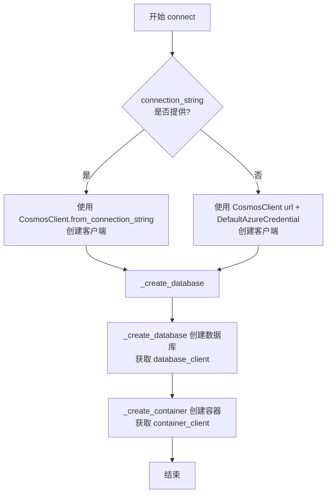

#### 带注释源码

```python
def connect(self) -> Any:
    """Connect to CosmosDB vector storage."""
    # 判断是否使用连接字符串方式连接
    if self.connection_string:
        # 使用连接字符串方式初始化 CosmosClient
        self._cosmos_client = CosmosClient.from_connection_string(
            self.connection_string
        )
    else:
        # 使用 URL + Azure 托管标识凭据方式初始化 CosmosClient
        self._cosmos_client = CosmosClient(
            url=self.url, credential=DefaultAzureCredential()
        )

    # 创建数据库（若不存在则创建）
    self._create_database()
    # 创建容器（若不存在则创建）
    self._create_container()
```


### `CosmosDBVectorStore._create_database`

创建Azure CosmosDB数据库（如果不存在），并初始化数据库客户端以供后续操作使用。

参数：

- （无显式参数，使用隐式 `self`）

返回值：`None`，无返回值（方法执行完成后返回None）

#### 流程图

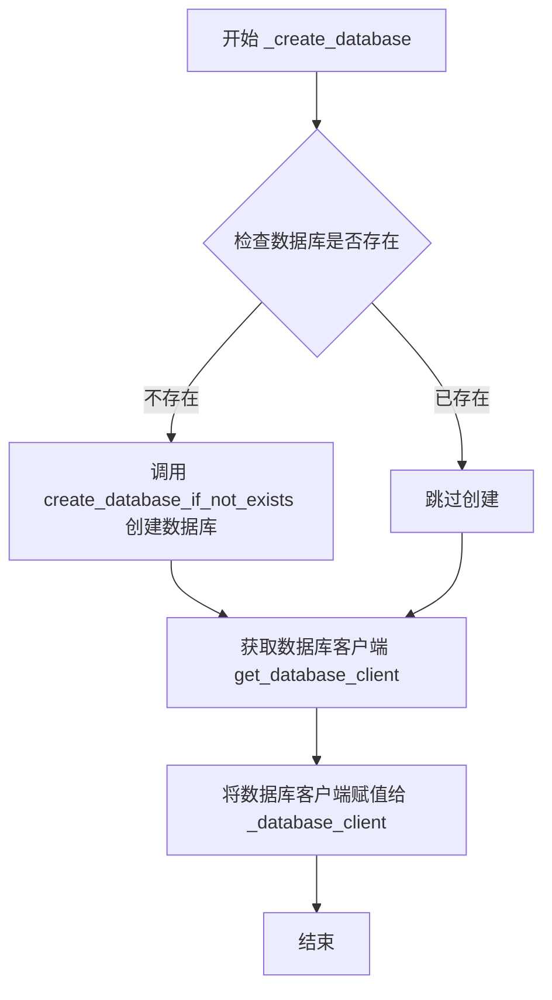

#### 带注释源码

```python
def _create_database(self) -> None:
    """Create the database if it doesn't exist."""
    # 使用cosmos_client的create_database_if_not_exists方法
    # 如果数据库不存在则创建，存在则直接返回已有数据库
    # 参数id为self.database_name，即传入的数据库名称
    self._cosmos_client.create_database_if_not_exists(id=self.database_name)
    
    # 创建完成后，通过cosmos_client获取该数据库的客户端代理对象
    # 用于后续对数据库进行容器操作（如创建容器、查询等）
    # 这里将返回的DatabaseProxy对象赋值给实例变量_database_client
    self._database_client = self._cosmos_client.get_database_client(
        self.database_name
    )
```


### `CosmosDBVectorStore._delete_database`

删除 Azure CosmosDB 数据库（如果存在）。

参数：

- 无（仅包含 `self` 隐式参数）

返回值：`None`，无返回值描述（该方法仅执行删除操作，不返回任何数据）

#### 流程图

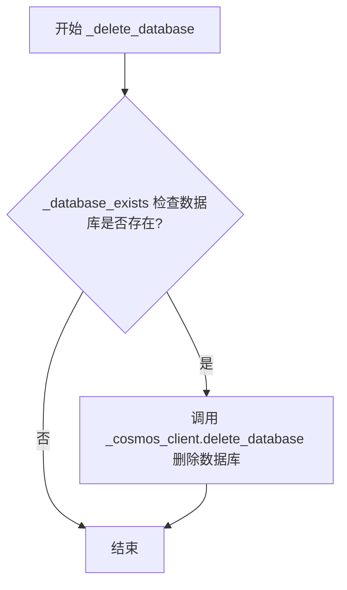

#### 带注释源码

```python
def _delete_database(self) -> None:
    """Delete the database if it exists."""
    # 调用 _database_exists() 检查目标数据库是否已存在
    if self._database_exists():
        # 如果数据库存在，使用 CosmosClient 删除该数据库
        # 删除操作会级联删除数据库中的所有容器和数据
        self._cosmos_client.delete_database(self.database_name)
```


### `CosmosDBVectorStore._database_exists`

该方法用于检查 Azure CosmosDB 数据库是否已存在。它通过调用 CosmosDB 客户端的 `list_databases` 方法获取所有现有数据库的名称列表，然后检查当前实例的 `database_name` 是否在该列表中。

参数：
- （无参数）

返回值：`bool`，返回 `True` 表示数据库已存在，返回 `False` 表示数据库不存在。

#### 流程图

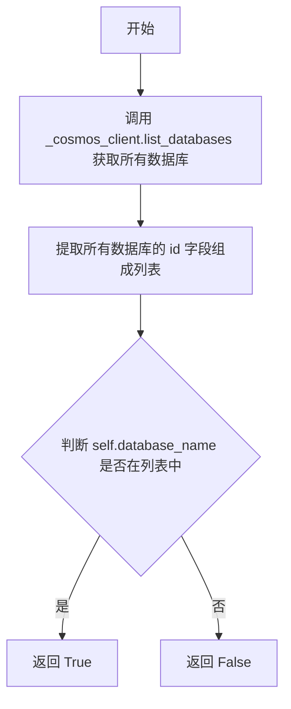

#### 带注释源码

```
def _database_exists(self) -> bool:
    """Check if the database exists."""
    # 从 CosmosDB 客户端获取所有数据库的列表
    # list_databases() 返回一个迭代器,每个元素包含数据库信息字典
    existing_database_names = [
        database["id"] for database in self._cosmos_client.list_databases()
    ]
    # 检查当前实例的 database_name 是否在已存在的数据库名称列表中
    return self.database_name in existing_database_names
```


### CosmosDBVectorStore._create_container

该方法负责在 Azure CosmosDB 中创建向量存储容器，配置分区键、向量嵌入策略和索引策略，并支持回退机制以兼容不支持 diskANN 索引的 CosmosDB 模拟器。

参数：

- 无显式参数（方法仅使用实例属性如 `self.id_field`、`self.vector_field`、`self.vector_size`、`self.index_name`）

返回值：`None`，无返回值

#### 流程图

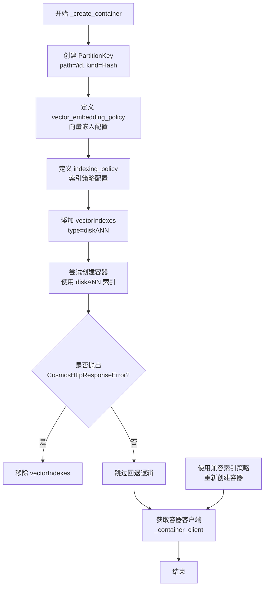

#### 带注释源码

```python
def _create_container(self) -> None:
    """Create the container if it doesn't exist."""
    # 创建分区键，使用 id 字段作为分区键，Hash 类型的分区策略
    partition_key = PartitionKey(path=f"/{self.id_field}", kind="Hash")

    # 定义容器向量嵌入策略
    # 配置向量字段、数据类型、距离函数和维度
    vector_embedding_policy = {
        "vectorEmbeddings": [
            {
                "path": f"/{self.vector_field}",  # 向量字段路径
                "dataType": "float32",  # 向量数据类型
                "distanceFunction": "cosine",  # 距离函数使用余弦相似度
                "dimensions": self.vector_size,  # 向量维度
            }
        ]
    }

    # 定义向量索引策略
    # 使用一致性索引模式，自动索引，包含所有路径
    indexing_policy = {
        "indexingMode": "consistent",
        "automatic": True,
        "includedPaths": [{"path": "/*"}],  # 包含所有路径
        "excludedPaths": [  # 排除特定路径
            {"path": "/_etag/?"},  # 排除 etag
            {"path": f"/{self.vector_field}/*"},  # 排除向量字段路径
        ],
    }

    # 目前 CosmosDB 模拟器不支持 diskANN 策略
    # 需要捕获异常并进行回退处理
    try:
        # 首先尝试使用标准 diskANN 索引策略
        indexing_policy["vectorIndexes"] = [
            {"path": f"/{self.vector_field}", "type": "diskANN"}
        ]

        # 创建容器和容器客户端
        # 如果容器已存在则跳过创建
        self._database_client.create_container_if_not_exists(
            id=self.index_name,
            partition_key=partition_key,
            indexing_policy=indexing_policy,
            vector_embedding_policy=vector_embedding_policy,
        )
    except CosmosHttpResponseError:
        # 如果 diskANN 失败（可能是模拟器环境），移除向量索引后重试
        # 使用兼容的索引策略重新创建容器
        indexing_policy.pop("vectorIndexes", None)

        # 使用兼容的索引策略创建容器
        self._database_client.create_container_if_not_exists(
            id=self.index_name,
            partition_key=partition_key,
            indexing_policy=indexing_policy,
            vector_embedding_policy=vector_embedding_policy,
        )

    # 获取容器客户端供后续操作使用
    self._container_client = self._database_client.get_container_client(
        self.index_name
    )
```


### `CosmosDBVectorStore._delete_container`

删除向量存储容器（如果存在）。

参数：

- 无

返回值：`None`，无返回值描述

#### 流程图

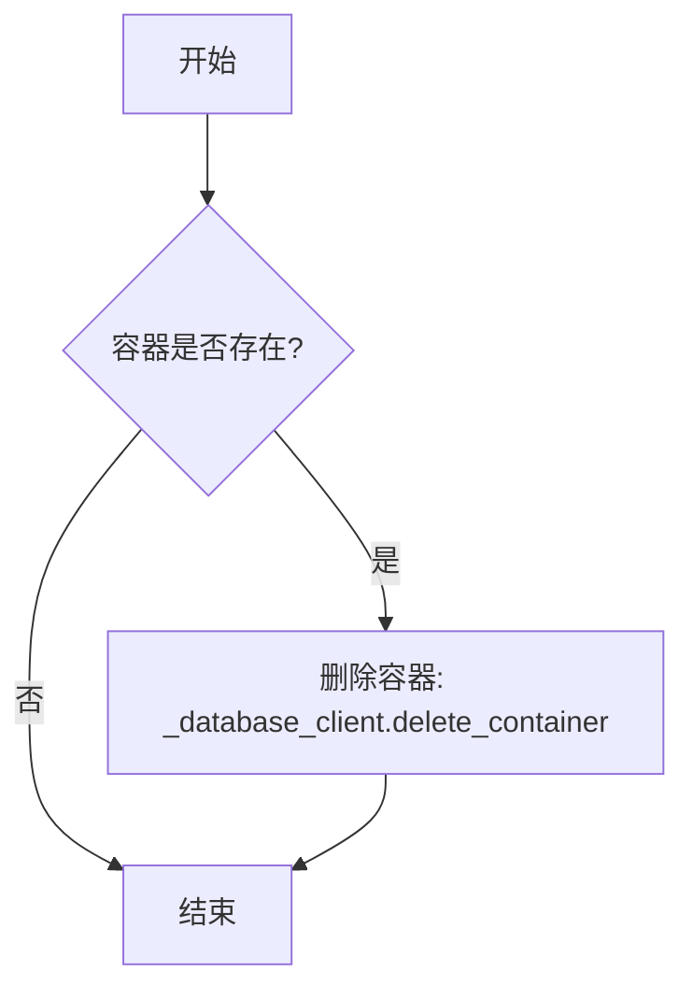

#### 带注释源码

```python
def _delete_container(self) -> None:
    """Delete the vector store container in the database if it exists."""
    # 检查容器是否存在，如果存在则删除
    if self._container_exists():
        # 使用数据库客户端删除指定名称的容器
        self._database_client.delete_container(self.index_name)
```


### CosmosDBVectorStore._container_exists

检查容器名称是否存在于数据库中。

参数：

- （无参数，仅 `self` 隐式参数）

返回值：`bool`，返回容器是否存在的布尔值结果。

#### 流程图

```mermaid
flowchart TD
    A[开始] --> B[调用 _database_client.list_containers 获取所有容器]
    B --> C[从容器列表中提取 container['id'] 形成容器名称列表]
    C --> D{判断 index_name 是否在列表中}
    D -->|是| E[返回 True]
    D -->|否| F[返回 False]
    E --> G[结束]
    F --> G
```

#### 带注释源码

```python
def _container_exists(self) -> bool:
    """Check if the container name exists in the database."""
    # 获取数据库中所有容器的列表
    existing_container_names = [
        container["id"] for container in self._database_client.list_containers()
    ]
    # 判断当前容器的索引名称是否在现有容器名称列表中
    return self.index_name in existing_container_names
```


### `CosmosDBVectorStore.create_index`

该方法用于在 CosmosDB 中创建向量存储的索引，通过先删除已存在的容器再创建新容器来实现索引的重建或覆盖。

参数：
- 无

返回值：`None`，无返回值，仅执行容器创建操作

#### 流程图

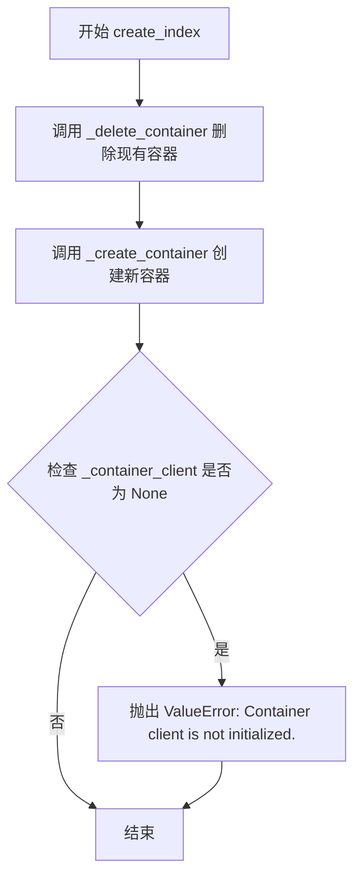

#### 带注释源码

```python
def create_index(self) -> None:
    """Load documents into CosmosDB."""
    # Create a CosmosDB container on overwrite
    # 步骤1: 删除已存在的容器，以确保创建全新的索引
    self._delete_container()
    
    # 步骤2: 创建新容器，配置向量嵌入策略和索引策略
    self._create_container()

    # 步骤3: 验证容器客户端是否成功初始化
    if self._container_client is None:
        msg = "Container client is not initialized."
        raise ValueError(msg)
```


### `CosmosDBVectorStore.load_documents`

该方法负责将文档列表中的向量数据批量上传到 Azure CosmosDB 容器中，通过遍历每个文档并使用 upsert 操作将向量及其 ID 存储到数据库。

参数：

- `documents`：`list[VectorStoreDocument]` - 要加载到 CosmosDB 的文档列表，每个文档包含 ID 和向量数据

返回值：`None`，该方法不返回任何值

#### 流程图

```mermaid
flowchart TD
    A[开始 load_documents] --> B{遍历 documents}
    B -->|每个文档 doc| C{doc.vector is not None}
    C -->|是| D[构建 doc_json]
    D --> E[提取 doc.id]
    E --> F[提取 doc.vector]
    F --> G[构建 JSON 对象<br/>{id_field: doc.id<br/>vector_field: doc.vector}]
    G --> H[调用 _container_client.upsert_item]
    H --> I{继续遍历}
    C -->|否| I
    I --> B
    B -->|遍历完成| J[结束]
```

#### 带注释源码

```python
def load_documents(self, documents: list[VectorStoreDocument]) -> None:
    """Load documents into CosmosDB."""
    # 遍历传入的文档列表
    for doc in documents:
        # 只处理包含向量数据的文档
        if doc.vector is not None:
            # 构建要存储的 JSON 对象
            doc_json = {
                self.id_field: doc.id,          # 文档的唯一标识符
                self.vector_field: doc.vector,   # 文档的向量嵌入数据
            }
            # 使用 upsert 操作将文档写入 CosmosDB
            # 如果文档已存在则更新，不存在则插入
            self._container_client.upsert_item(doc_json)
```


### `CosmosDBVectorStore.similarity_search_by_vector`

执行基于向量的相似性搜索，从 CosmosDB 向量存储中检索与给定查询向量最相似的 Top-K 文档。

参数：

- `self`：`CosmosDBVectorStore`，当前向量存储实例
- `query_embedding`：`list[float]`，查询向量_embedding，用于计算与存储向量的相似度
- `k`：`int`，返回的相似结果数量，默认为 10

返回值：`list[VectorStoreSearchResult]`，返回按相似度降序排列的搜索结果列表，每个结果包含文档和相似度分数

#### 流程图

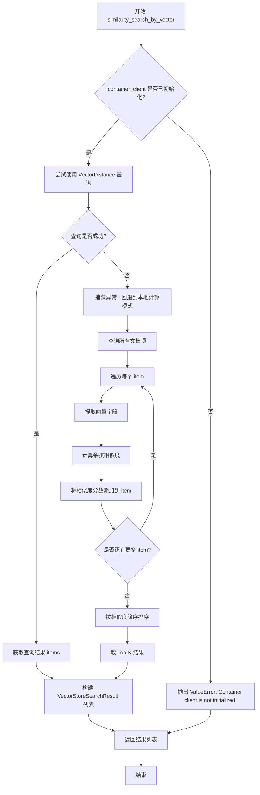

#### 带注释源码

```python
def similarity_search_by_vector(
    self, query_embedding: list[float], k: int = 10
) -> list[VectorStoreSearchResult]:
    """Perform a vector-based similarity search."""
    # 检查容器客户端是否已初始化，若未初始化则抛出异常
    if self._container_client is None:
        msg = "Container client is not initialized."
        raise ValueError(msg)

    try:
        # -------------------- 模式1: 使用 CosmosDB VectorDistance 函数 --------------------
        # 构建 SQL 查询语句，使用 VectorDistance 计算向量距离
        # TOP k 限制返回结果数量，ORDER BY VectorDistance 实现按相似度排序
        query = f"SELECT TOP {k} c.{self.id_field}, c.{self.vector_field}, VectorDistance(c.{self.vector_field}, @embedding) AS SimilarityScore FROM c ORDER BY VectorDistance(c.{self.vector_field}, @embedding)"  # noqa: S608
        
        # 定义查询参数，将查询向量作为参数传入以避免 SQL 注入
        query_params = [{"name": "@embedding", "value": query_embedding}]
        
        # 执行跨分区查询（enable_cross_partition_query=True）
        # list() 强制立即执行查询并获取所有结果
        items = list(
            self._container_client.query_items(
                query=query,
                parameters=query_params,
                enable_cross_partition_query=True,
            )
        )
        
    except (CosmosHttpResponseError, ValueError):
        # -------------------- 模式2: 回退到本地计算（CosmosDB Emulator 不支持 VectorDistance） --------------------
        # 当 VectorDistance 函数不可用时（如在模拟器或测试环境），从服务端获取所有文档
        # 然后在客户端本地计算余弦相似度
        
        # 查询所有文档项（不指定 TOP 限制）
        query = f"SELECT c.{self.id_field}, c.{self.vector_field} FROM c"  # noqa: S608
        items = list(
            self._container_client.query_items(
                query=query,
                enable_cross_partition_query=True,
            )
        )

        # -------------------- 本地余弦相似度计算 --------------------
        # 导入 numpy 用于向量运算
        from numpy import dot
        from numpy.linalg import norm

        def cosine_similarity(a, b):
            """计算两个向量的余弦相似度"""
            # 处理零向量情况，避免除零错误
            if norm(a) * norm(b) == 0:
                return 0.0
            # 余弦相似度 = 点积 / (范数1 * 范数2)
            return dot(a, b) / (norm(a) * norm(b))

        # -------------------- 遍历计算每个文档的相似度分数 --------------------
        # 计算分数并添加到每个 item 中
        for item in items:
            # 获取向量字段，若不存在则默认为空列表
            item_vector = item.get(self.vector_field, [])
            # 计算查询向量与当前文档向量的余弦相似度
            similarity = cosine_similarity(query_embedding, item_vector)
            # 将相似度分数添加到 item 字典中
            item["SimilarityScore"] = similarity

        # -------------------- 排序并取 Top-K --------------------
        # 按相似度分数降序排序（相似度越高越靠前），然后取前 k 个结果
        items = sorted(
            items, key=lambda x: x.get("SimilarityScore", 0.0), reverse=True
        )[:k]

    # -------------------- 构建返回值 --------------------
    # 将查询结果转换为 VectorStoreSearchResult 对象列表
    # 每个结果包含 VectorStoreDocument（包含 id 和 vector）和 score
    return [
        VectorStoreSearchResult(
            document=VectorStoreDocument(
                id=item.get(self.id_field, ""),
                vector=item.get(self.vector_field, []),
            ),
            score=item.get("SimilarityScore", 0.0),
        )
        for item in items
    ]
```


### `CosmosDBVectorStore.search_by_id`

根据给定的 ID 在 Azure CosmosDB 向量存储中查找并返回对应的文档。

参数：

- `id`：`str`，要搜索的文档的唯一标识符

返回值：`VectorStoreDocument`，包含文档 ID 和向量数据的文档对象

#### 流程图

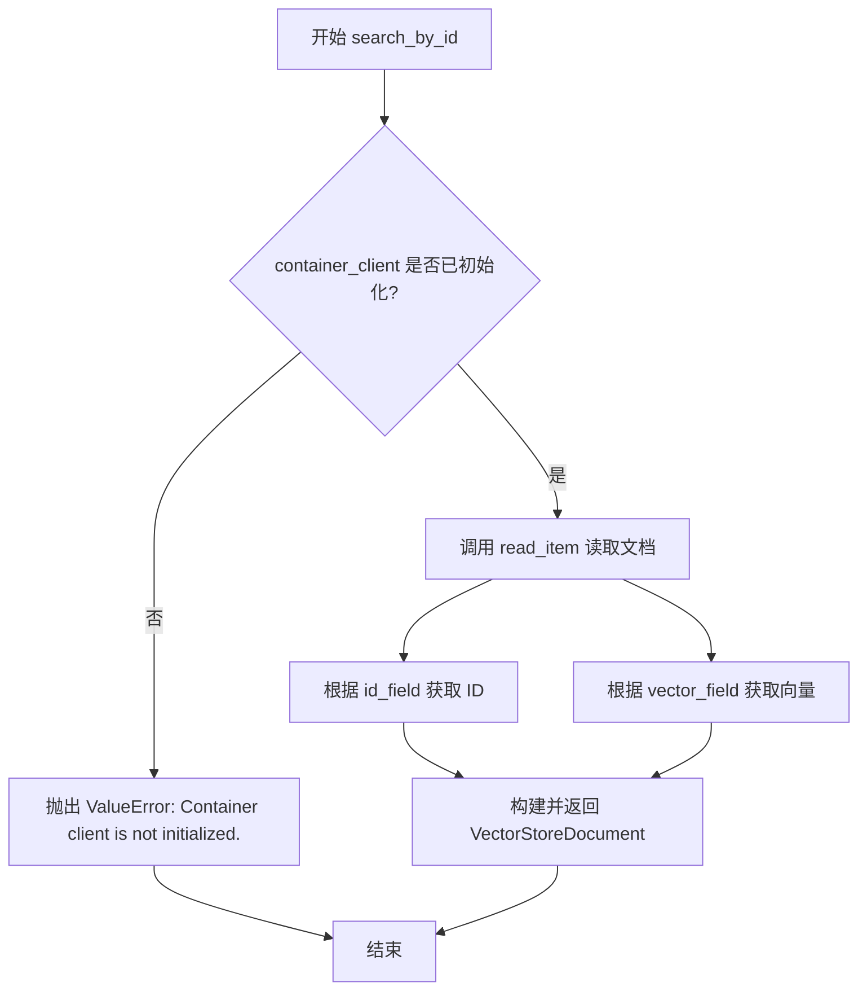

#### 带注释源码

```python
def search_by_id(self, id: str) -> VectorStoreDocument:
    """Search for a document by id.
    
    根据给定的唯一标识符在 CosmosDB 容器中查找文档。
    
    Args:
        id: 文档的唯一标识符
        
    Returns:
        VectorStoreDocument: 包含文档 ID 和向量数据的对象
        
    Raises:
        ValueError: 如果容器客户端未初始化
    """
    # 检查容器客户端是否已初始化
    if self._container_client is None:
        msg = "Container client is not initialized."
        raise ValueError(msg)

    # 使用 read_item 方法通过 ID 和分区键读取文档
    # CosmosDB 使用 ID 作为分区键进行文档检索
    item = self._container_client.read_item(item=id, partition_key=id)
    
    # 从读取的 item 中提取 id_field 和 vector_field 的值
    # 使用 .get() 方法提供默认值，防止键不存在时出错
    return VectorStoreDocument(
        id=item.get(self.id_field, ""),
        vector=item.get(self.vector_field, []),
    )
```


### `CosmosDBVectorStore.clear`

清除向量存储，删除 CosmosDB 中的容器和数据库。

参数：此方法无参数（除 `self` 隐式参数外）。

返回值：`None`，无返回值描述。

#### 流程图

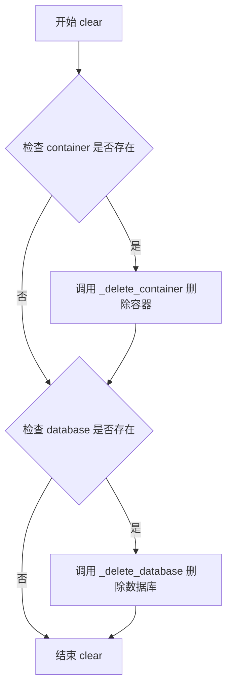

#### 带注释源码

```python
def clear(self) -> None:
    """Clear the vector store."""
    # 删除向量存储容器
    self._delete_container()
    # 删除数据库
    self._delete_database()
```

## 关键组件


### CosmosDBVectorStore

Azure CosmosDB 向量存储的核心实现类，继承自 VectorStore 基类，提供向量存储、检索和管理功能。

### 连接管理

通过 connection_string 或 url + DefaultAzureCredential 两种方式连接 CosmosDB，支持数据库和容器的自动创建。

### 数据库与容器创建

_create_database() 方法在数据库不存在时创建数据库；_create_container() 方法创建向量容器，配置向量嵌入策略和索引策略，并兼容 CosmosDB 模拟器的限制。

### 向量索引策略

使用 diskANN 向量索引类型，支持 cosine 距离函数，为向量字段配置 float32 数据类型和指定维度。

### 文档加载

load_documents() 方法将 VectorStoreDocument 对象批量上传到 CosmosDB，使用 upsert_item 实现增量更新。

### 向量相似度搜索

similarity_search_by_vector() 方法使用 VectorDistance 函数执行向量相似度搜索，返回 top-k 最相似的结果。

### 模拟器兼容处理

针对 CosmosDB 模拟器不支持 VectorDistance 函数的情况，实现本地余弦相似度计算作为回退方案，确保开发环境可用。

### 索引管理

create_index() 方法通过删除并重建容器来实现索引覆盖；clear() 方法清理整个向量存储包括数据库。

### ID 字段约束验证

__init__ 方法强制要求 id_field 必须为 "id"，与 CosmosDB 的分区键设计保持一致。


## 问题及建议


### 已知问题

- **错误处理过于宽泛**：在 `similarity_search_by_vector` 方法中，使用 `except (CosmosHttpResponseError, ValueError)` 捕获所有异常并静默降级到本地计算，会隐藏真实的业务错误，导致问题难以调试和追踪
- **相似度计算逻辑错误**：本地计算时使用 `cosine_similarity`（点积/模长），返回值范围为 [-1,1]，而 CosmosDB 的 `VectorDistance` 返回的是距离值，两者语义不一致，应使用 `1 - cosine_similarity` 或直接计算 cosine distance
- **资源管理不完善**：缺少 `close()` 方法和上下文管理器支持，无法显式释放 CosmosDB 连接资源，可能导致连接泄漏
- **性能效率低下**：`load_documents` 方法逐个调用 `upsert_item`，没有使用批量操作；`_database_exists` 和 `_container_exists` 通过列举所有数据库/容器再判断，O(n) 复杂度
- **本地向量搜索内存问题**：当 VectorDistance 不支持时，会将所有文档加载到内存进行计算，大数据量时可能导致内存溢出
- **硬编码配置**：partition_key 的 path 固定为 `/{self.id_field}`，indexing policy 和 vector_embedding_policy 多项参数硬编码，缺乏灵活性
- **参数校验不足**：`vector_size` 和 `index_name` 等必需参数未在 `__init__` 中校验，使用时可能抛出难以理解的空引用异常
- **测试覆盖困难**：异常处理路径（如 emulator 降级逻辑）难以通过单元测试验证，缺乏日志记录

### 优化建议

- 分离异常类型，为不同错误场景提供具体处理策略，并添加日志记录以便问题追踪
- 修正本地相似度计算逻辑，统一使用距离值或相似度值的语义
- 实现 `close()` 方法和 `__enter__`/`__exit__` 上下文管理器协议
- 使用 `upsert_items` 批量操作替代循环 upsert
- 使用 `read_many` 或分页查询替代一次性加载所有向量
- 将索引策略、向量策略等配置参数化，支持运行时配置
- 在 `__init__` 中添加必需参数校验，提供清晰的错误信息
- 为降级路径添加日志或指标采集，便于监控和优化

## 其它


### 设计目标与约束

**设计目标**：
1. 实现Azure CosmosDB作为向量存储后端，支持向量相似度搜索
2. 提供与VectorStore基类一致的接口，便于集成到现有graphrag系统中
3. 支持Azure CosmosDB的向量索引功能（diskANN）和传统索引
4. 兼容Azure CosmosDB Emulator环境

**约束条件**：
1. id_field必须为"id"，这是CosmosDB的主键要求
2. 必须提供connection_string或url其中之一
3. 向量字段类型为float32，维度由vector_size指定
4. 距离函数仅支持cosine（余弦相似度）
5. 分区键必须基于id字段

### 错误处理与异常设计

**异常类型**：
1. **ValueError**：当id_field不为"id"、未提供连接参数、容器客户端未初始化时抛出
2. **CosmosHttpResponseError**：CosmosDB服务返回HTTP错误时抛出，用于检测emulator兼容性
3. **连接错误**：CosmosClient初始化失败时由azure-cosmos库抛出

**错误处理策略**：
1. 配置错误在构造函数中立即验证并抛出ValueError
2. 连接错误在connect()方法中传播，由调用方处理
3. diskANN索引创建失败时自动降级到传统索引（兼容emulator）
4. VectorDistance函数不支持时自动切换到本地计算余弦相似度

### 数据流与状态机

**主要数据流**：
1. **初始化流程**：构造器接收配置 → connect()建立连接 → _create_database()创建数据库 → _create_container()创建容器
2. **文档加载流程**：load_documents()接收文档列表 → 转换为JSON格式 → upsert_item()批量写入CosmosDB
3. **相似度搜索流程**：similarity_search_by_vector()接收查询向量 → 构造SQL查询 → 执行查询 → 返回结果列表
4. **清理流程**：clear()调用_delete_container()和_delete_database()删除资源

**状态转换**：
- 未连接 → 已连接（调用connect()后）
- 已连接 → 已创建索引（调用create_index()后）
- 任何状态 → 已清除（调用clear()后）

### 外部依赖与接口契约

**外部依赖**：
1. **azure.cosmos**：CosmosDB SDK，提供数据库和容器操作
2. **azure.identity**：DefaultAzureCredential，用于URL方式的认证
3. **numpy**：用于本地计算余弦相似度（emulator模式）
4. **graphrag_vectors.vector_store**：基类VectorStore及相关数据模型

**接口契约**：
1. **VectorStore基类**：必须实现create_index()、load_documents()、similarity_search_by_vector()、search_by_id()、clear()方法
2. **VectorStoreDocument**：包含id和vector字段的数据模型
3. **VectorStoreSearchResult**：包含document和score字段的搜索结果模型

### 配置与参数

**构造函数参数**：
- database_name (str)：CosmosDB数据库名称，必填
- connection_string (str | None)：连接字符串，与url二选一
- url (str | None)：CosmosDB端点URL，与connection_string二选一
- **kwargs：传递给父类VectorStore的参数，包括index_name、vector_field、id_field、vector_size等

**可配置属性**：
- index_name：继承自VectorStore，默认为"vectors"
- vector_field：向量字段名，默认为"vector"
- id_field：主键字段，**必须为"id"**

### 性能考量

**成本优化**：
1. 容器操作（创建/删除）应尽量减少，create_index()每次调用都会删除重建容器
2. upsert_item()支持单文档原子操作，避免事务开销

**搜索性能**：
1. 使用CosmosDB的VectorDistance函数进行服务端向量计算，性能优于本地计算
2. diskANN索引提供更高效的向量搜索
3. 本地计算余弦相似度仅在emulator环境下使用，作为降级方案

### 安全与隐私

**认证方式**：
1. 连接字符串方式：使用预设的密钥进行认证
2. URL方式：使用DefaultAzureCredential，支持Azure AD身份验证

**数据安全**：
1. 向量数据以二进制形式存储在CosmosDB中
2. etag字段被排除在索引之外，避免不必要的版本控制开销
3. 生产环境建议使用Azure AD认证，避免在代码中硬编码连接字符串

### 版本兼容性

**Azure CosmosDB版本要求**：
1. 需要支持向量索引的CosmosDB版本（通常为较新版本）
2. diskANN索引需要Cosmos DB for NoSQL账户
3. VectorDistance函数需要较新的API版本

**Emulator兼容性**：
1. 不支持diskANN索引，已实现降级处理
2. 不支持VectorDistance函数，已实现本地计算作为备选

### 测试策略

**单元测试**：
1. 构造函数参数验证测试
2. connect()方法连接测试
3. 文档加载和搜索功能测试

**集成测试**：
1. 使用CosmosDB Emulator进行完整流程测试
2. 测试降级方案（无向量索引）的正确性
3. 测试异常情况下的错误处理

### 监控与可观测性

**可观测性要点**：
1. CosmosHttpResponseError异常包含HTTP状态码和错误信息
2. 容器创建失败时的重试逻辑有日志记录（通过异常捕获）
3. 搜索结果包含SimilarityScore，便于评估搜索质量

**运维建议**：
1. 监控容器创建/删除操作的频率，避免频繁操作
2. 监控向量搜索的响应时间，特别是降级到本地计算的情况
3. 记录CosmosDB请求单位（RU）消耗


    