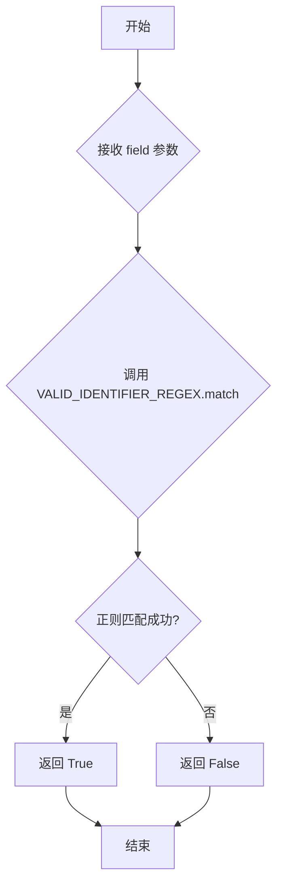
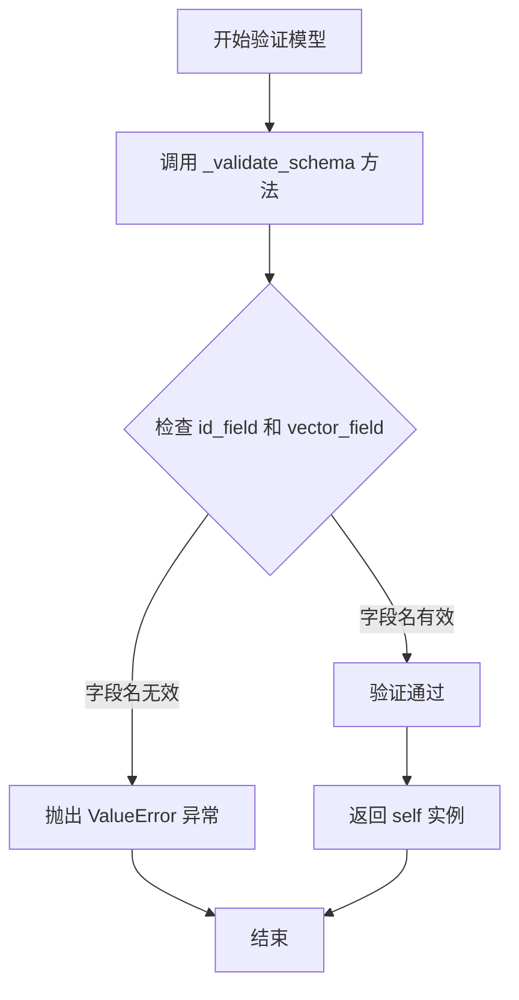

# `graphrag\packages\graphrag-vectors\graphrag_vectors\index_schema.py` 详细设计文档

这是一个配置参数化模块，定义了向量存储（Vector Store）的默认索引模式配置，包含索引名称、ID字段、向量字段、向量大小等参数，并提供了基于正则表达式的字段名验证功能，确保配置符合CosmosDB的命名规范。

## 整体流程

```mermaid
graph TD
A[开始] --> B[创建IndexSchema实例]
B --> C[Pydantic基础验证：类型检查]
C --> D[调用model_validator(mode='after')]
D --> E[_validate_model方法]
E --> F[_validate_schema方法]
F --> G{is_valid_field_name(id_field)?}
G -- 否 --> H[抛出ValueError]
G -- 是 --> I{is_valid_field_name(vector_field)?}
I -- 否 --> H
I -- 是 --> J[验证通过，返回实例]
H --> K[终止：字段名不符合规范]
```

## 类结构

```
IndexSchema (pydantic.BaseModel)
├── index_name: str (索引名)
├── id_field: str (ID字段)
├── vector_field: str (向量字段)
├── vector_size: int (向量大小)
└── _validate_schema() (私有验证方法)
```

## 全局变量及字段


### `DEFAULT_VECTOR_SIZE`
    
全局常量，默认向量大小3072

类型：`int`
    


### `VALID_IDENTIFIER_REGEX`
    
全局常量，标识符验证正则表达式r'^[A-Za-z_][A-Za-z0-9_]*$'

类型：`re.Pattern`
    


### `is_valid_field_name`
    
全局函数，检查字段名是否符合CosmosDB命名规范

类型：`Callable[[str], bool]`
    


### `IndexSchema.IndexSchema.index_name`
    
索引名称，默认'vector_index'

类型：`str`
    


### `IndexSchema.IndexSchema.id_field`
    
ID字段名，默认'id'

类型：`str`
    


### `IndexSchema.IndexSchema.vector_field`
    
向量字段名，默认'vector'

类型：`str`
    


### `IndexSchema.IndexSchema.vector_size`
    
向量维度，默认3072

类型：`int`
    


### `IndexSchema.IndexSchema._validate_schema`
    
验证id_field和vector_field是否符合命名规范

类型：`Callable[[], None]`
    


### `IndexSchema.IndexSchema._validate_model`
    
Pydantic模型验证器，在实例创建后触发验证流程

类型：`Callable[[], Self]`
    
    

## 全局函数及方法


### `is_valid_field_name`

检查字段名是否符合CosmosDB命名规范，确保字段名以字母或下划线开头，后续字符为字母、数字或下划线。

参数：

- `field`：`str`，待验证的字段名

返回值：`bool`，如果字段名符合CosmosDB命名规范返回`True`，否则返回`False`

#### 流程图



#### 带注释源码

```python
# 预编译的正则表达式：匹配有效的标识符
# 规则：必须以字母(A-Z, a-z)或下划线(_)开头，后续字符可以是字母、数字或下划线
VALID_IDENTIFIER_REGEX = re.compile(r"^[A-Za-z_][A-Za-z0-9_]*$")


def is_valid_field_name(field: str) -> bool:
    """Check if a field name is valid for CosmosDB."""
    # 使用正则表达式匹配字段名
    # re.match 从字符串开头进行匹配
    # 返回匹配对象或None
    # bool() 将结果转换为布尔值：匹配成功为True，匹配失败为None转为False
    return bool(VALID_IDENTIFIER_REGEX.match(field))
```


### `IndexSchema._validate_schema`

该方法用于验证 `IndexSchema` 类中的 `id_field` 和 `vector_field` 字段名称是否符合 CosmosDB 的命名规范（必须以字母或下划线开头，且只能包含字母、数字和下划线），若不符合则抛出 `ValueError` 异常。

参数：
- 无参数（仅包含 `self` 隐式参数）

返回值：`None`，无返回值描述（通过抛出异常表示验证失败）

#### 流程图

```mermaid
flowchart TD
    A[开始 _validate_schema] --> B{检查 id_field 是否有效}
    B -->|是| C{检查 vector_field 是否有效}
    B -->|否| D[抛出 ValueError: Unsafe or invalid field name: {id_field}]
    C -->|是| E[验证通过，结束]
    C -->|否| F[抛出 ValueError: Unsafe or invalid field name: {vector_field}]
    D --> G[异常终止]
    F --> G
    E --> G
```

#### 带注释源码

```python
def _validate_schema(self) -> None:
    """Validate the schema.
    
    验证 id_field 和 vector_field 字段名称是否符合命名规范。
    使用 is_valid_field_name 函数检查每个字段名称，
    如果不符合规范则抛出 ValueError 异常。
    """
    # 遍历需要验证的字段列表：id_field 和 vector_field
    for field in [
        self.id_field,
        self.vector_field,
    ]:
        # 调用 is_valid_field_name 检查字段名称是否合法
        if not is_valid_field_name(field):
            # 如果字段名称不合法，构造错误消息并抛出 ValueError
            msg = f"Unsafe or invalid field name: {field}"
            raise ValueError(msg)
```


### `IndexSchema._validate_model`

Pydantic 模型验证器，在实例创建后触发验证流程，检查 `id_field` 和 `vector_field` 是否符合有效字段名规范（必须以字母或下划线开头，且只能包含字母、数字和下划线），若验证失败则抛出 `ValueError` 异常。

参数：

- `self`：`IndexSchema`，当前模型实例本身

返回值：`IndexSchema`，验证通过后返回模型实例本身

#### 流程图



#### 带注释源码

```python
@model_validator(mode="after")
def _validate_model(self):
    """Validate the model.
    
    这是一个 Pydantic 模型验证器，在模型实例创建后自动调用。
    它内部调用 _validate_schema 方法来验证字段名的有效性。
    
    Returns:
        IndexSchema: 验证通过后返回模型实例本身
    """
    self._validate_schema()  # 调用内部验证方法检查字段名
    return self  # 返回验证后的实例
```

## 关键组件


### DEFAULT_VECTOR_SIZE

全局常量，定义默认向量维度为 3072，用于向量存储的向量字段大小。

### VALID_IDENTIFIER_REGEX

全局正则表达式变量，编译后的正则表达式用于验证字段名称是否符合 CosmosDB 的命名规范（以字母或下划线开头，可包含字母、数字和下划线）。

### is_valid_field_name

全局验证函数，接受字段名称字符串参数，使用正则表达式验证字段名称是否为合法的标识符，返回布尔值。

### IndexSchema

Pydantic 数据模型类，定义向量存储索引的默认配置模式，包含索引名称、ID 字段、向量字段和向量大小等配置项，并提供模型验证器确保配置的有效性。

### 字段验证机制

基于 Pydantic 的 model_validator 实现的验证组件，在模型实例化后自动校验字段名称的合法性，确保不符合规范的字段名称被拒绝。


## 问题及建议


### 已知问题

-   **默认值重复定义**：DEFAULT_VECTOR_SIZE 定义为 3072，但在 IndexSchema 类的 vector_size 字段默认值中又硬编码了 3072，两处默认值不一致会导致未来维护困难
-   **验证范围不完整**：只验证了 id_field 和 vector_field，但未验证 index_name（可能包含非法字符）和 vector_size（应该验证为正整数）
-   **缺乏配置灵活性**：IndexSchema 只包含4个字段，无法支持更复杂的向量存储配置需求，如索引类型、度量方式、分区等
-   **正则表达式未充分利用**：VALID_IDENTIFIER_REGEX 已编译但只在 is_valid_field_name 函数中使用，可以考虑直接作为类常量或模块级验证工具
-   **错误信息可读性**：当验证失败时，错误信息较为简单，缺少具体的约束说明，不利于用户定位问题

### 优化建议

-   将 vector_size 的默认值改为引用 DEFAULT_VECTOR_SIZE，或使用 Field(default_factory=...) 方式动态获取
-   扩展验证逻辑：index_name 应检查是否符合命名规范，vector_size 应验证大于0且在合理范围内（如1-10000）
-   考虑将 IndexSchema 设计为可扩展的配置类，添加可选字段如 index_type、metric、partition_key 等
-   提供更友好的验证错误信息，包含约束条件和当前值，便于开发者调试
-   考虑添加类级别的 validator 或 root_validator 来集中处理跨字段验证逻辑

## 其它


### 设计目标与约束

本模块的设计目标是提供一个标准化的向量存储索引配置方案，通过预定义默认值和严格的验证机制，确保向量索引配置的健壮性和一致性。主要约束包括：必须使用有效的标识符作为字段名称，向量大小默认为3072维，且配置模型基于Pydantic实现，必须符合其数据验证规范。

### 错误处理与异常设计

代码中实现了两种主要的错误处理机制。第一种是在字段名称验证失败时抛出ValueError异常，错误消息格式为"Unsafe or invalid field name: {field_name}"，用于阻止不安全的字段名称进入系统。第二种是Pydantic框架自动触发的模型验证错误，当数据类型或必填字段不符合要求时，Pydantic会生成相应的验证错误。所有验证逻辑在模型实例化时同步执行，采用fail-fast策略。

### 外部依赖与接口契约

本模块依赖两个外部包：re标准库用于正则表达式编译和匹配，pydantic库提供BaseModel、Field和model_validator等数据建模组件。模块对外暴露的主要接口包括：is_valid_field_name函数（接收字符串参数field，返回布尔值），以及IndexSchema类（可实例化为配置对象）。IndexSchema类的属性均可通过构造参数或默认值进行初始化，序列化后兼容JSON格式。

### 配置初始化与校验流程

IndexSchema实例化时自动触发完整的校验流程。首先，Pydantic根据Field装饰器的description和default参数完成基础类型校验。随后，model_validator装饰器的mode="after"模式确保在所有字段解析完成后执行_validate_schema方法，该方法遍历id_field和vector_field，使用正则表达式进行标识符合规性检查。整个校验过程无需显式调用，任何配置不合规的情况都将在对象创建时立即暴露。

### 扩展性考虑

当前设计支持两种扩展方式：一是继承IndexSchema类并重写_validate_schema方法以实现自定义验证逻辑；二是通过修改DEFAULT_VECTOR_SIZE常量或VALID_IDENTIFIER_REGEX正则表达式来适应不同版本的向量数据库要求。模型采用Pydantic的Field装饰器，支持在子类中通过Field(override=...)方式覆盖父类的字段定义。索引名称字段目前仅做字符串类型约束，未包含格式验证，可根据实际需求扩展。

    