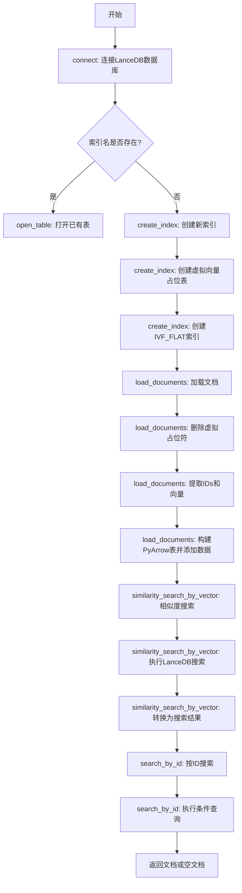
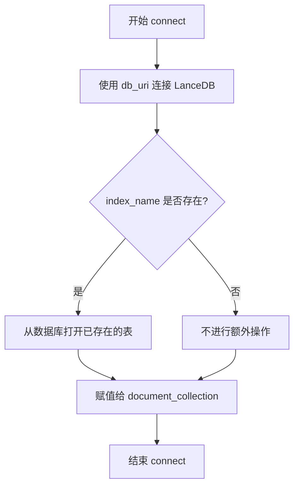
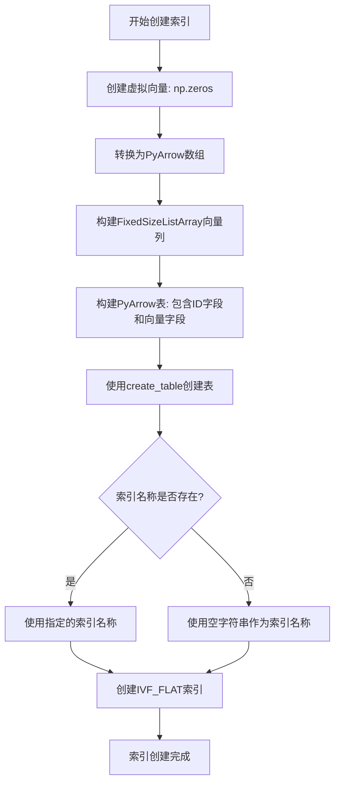
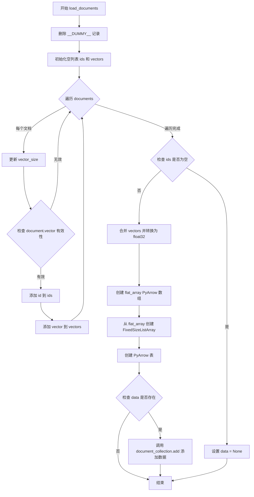

# `graphrag\packages\graphrag-vectors\graphrag_vectors\lancedb.py` 详细设计文档

该代码实现了基于LanceDB的向量存储功能，提供向量嵌入的存储、索引创建和相似性搜索能力，是graphrag_vectors项目中的向量数据库适配器，支持文档加载、按向量相似度和ID搜索等核心操作。

## 整体流程



## 类结构

```
VectorStore (抽象基类/接口)
└── LanceDBVectorStore (LanceDB实现类)
```

## 全局变量及字段


### `LanceDBVectorStore.db_uri`
    
LanceDB数据库连接URI

类型：`str`
    


### `LanceDBVectorStore.db_connection`
    
LanceDB数据库连接对象

类型：`Any`
    


### `LanceDBVectorStore.document_collection`
    
文档集合表对象

类型：`Any`
    


### `LanceDBVectorStore.index_name`
    
索引名称(继承自VectorStore)

类型：`str`
    


### `LanceDBVectorStore.vector_size`
    
向量维度(继承自VectorStore)

类型：`int`
    


### `LanceDBVectorStore.id_field`
    
ID字段名(继承自VectorStore)

类型：`str`
    


### `LanceDBVectorStore.vector_field`
    
向量字段名(继承自VectorStore)

类型：`str`
    
    

## 全局函数及方法


### `LanceDBVectorStore.__init__`

构造函数，初始化 LanceDB 向量存储的数据库URI，并调用父类构造函数进行基类初始化。

参数：

- `db_uri`：`str`，数据库连接URI，默认为"lancedb"，用于指定LanceDB数据库的存储路径
- `**kwargs`：`Any`，可变关键字参数，用于传递给父类 `VectorStore` 的初始化参数

返回值：`None`，构造函数不返回任何值

#### 流程图

```mermaid
flowchart TD
    A[开始 __init__] --> B[接收 db_uri 和 kwargs 参数]
    B --> C[调用父类 VectorStore.__init__(**kwargs)]
    C --> D[将 db_uri 赋值给 self.db_uri]
    E[结束 __init__]
    D --> E
```

#### 带注释源码

```python
def __init__(self, db_uri: str = "lancedb", **kwargs: Any):
    """初始化 LanceDBVectorStore 实例。
    
    参数:
        db_uri: str, LanceDB 数据库的 URI 地址，默认为 "lancedb"
        **kwargs: Any, 传递给父类 VectorStore 的关键字参数
    """
    # 调用父类 VectorStore 的构造函数，传入 kwargs 参数
    # 父类会初始化如 vector_size, id_field, vector_field, index_name 等属性
    super().__init__(**kwargs)
    
    # 将传入的 db_uri 参数保存为实例变量
    # 用于后续 connect() 方法中建立数据库连接
    self.db_uri = db_uri
```


### `LanceDBVectorStore.connect()`

连接到 LanceDB 向量存储。如果指定的索引名称已存在于数据库中，则打开该表；否则仅建立数据库连接，等待后续创建索引操作。

参数：

- `self`：隐式参数，`LanceDBVectorStore` 实例本身

返回值：`Any`，无显式返回值（返回 `None`）

#### 流程图



#### 带注释源码

```python
def connect(self) -> Any:
    """Connect to the vector storage."""
    # 使用配置的数据库 URI 建立与 LanceDB 的连接
    # self.db_uri 在 __init__ 中被设置为默认 "lancedb"
    self.db_connection = lancedb.connect(self.db_uri)

    # 检查是否指定了索引名称，且该索引名称已存在于数据库中
    # 如果表已存在，则打开它以便后续操作
    if self.index_name and self.index_name in self.db_connection.table_names():
        # 打开已存在的表并赋值给 document_collection
        # 后续的 similarity_search、load_documents 等操作都依赖此属性
        self.document_collection = self.db_connection.open_table(self.index_name)
```


### `LanceDBVectorStore.create_index`

该方法用于在 LanceDB 向量存储中创建向量索引。首先创建一个虚拟向量（dummy vector）用于初始化表结构和索引，然后通过 PyArrow 构建包含虚拟数据的表，最后在该表上创建 IVF_FLAT 类型的向量索引。

参数： 无

返回值：`None`，无返回值描述

#### 流程图



#### 带注释源码

```python
def create_index(self) -> None:
    """Create index."""
    # Step 1: 创建虚拟向量（全零向量），用于初始化索引结构
    # vector_size 是从父类继承的属性，表示向量的维度
    dummy_vector = np.zeros(self.vector_size, dtype=np.float32)
    
    # Step 2: 将numpy数组转换为PyArrow数组
    # 使用float32类型以保持与向量存储的一致性
    flat_array = pa.array(dummy_vector, type=pa.float32())
    
    # Step 3: 构建固定大小列表数组（FixedSizeListArray）
    # 这是LanceDB存储向量所需的格式，self.vector_size定义了每个向量的维度
    vector_column = pa.FixedSizeListArray.from_arrays(flat_array, self.vector_size)

    # Step 4: 创建PyArrow表
    # 包含两个字段：id字段（存储文档ID）和vector字段（存储向量）
    # 使用"__DUMMY__"作为虚拟文档ID，后续在load_documents时会被删除
    data = pa.table({
        self.id_field: pa.array(["__DUMMY__"], type=pa.string()),
        self.vector_field: vector_column,
    })

    # Step 5: 创建LanceDB表
    # 使用overwrite模式确保如果表已存在则覆盖
    # 传入schema以确保表结构正确
    self.document_collection = self.db_connection.create_table(
        self.index_name if self.index_name else "",  # 如果没有指定索引名称则使用空字符串
        data=data,
        mode="overwrite",
        schema=data.schema,
    )

    # Step 6: 在已创建的表上创建IVF_FLAT索引
    # IVF_FLAT是一种基于倒排文件（IVF）的索引类型，适用于向量相似度搜索
    # 可以显著加速大规模向量数据的相似度查询
    self.document_collection.create_index(
        vector_column_name=self.vector_field, 
        index_type="IVF_FLAT"
    )
```


### `LanceDBVectorStore.load_documents`

将一组 `VectorStoreDocument` 对象加载到 LanceDB 向量存储中，包括删除虚拟记录、准备数据列、处理空情况、构建 PyArrow 表并添加到集合中。

参数：

- `documents`：`list[VectorStoreDocument]`，要加载到向量存储的文档列表

返回值：`None`，该方法不返回任何值

#### 流程图



#### 带注释源码

```python
def load_documents(self, documents: list[VectorStoreDocument]) -> None:
    """Load documents into vector storage."""
    # Step 0: 删除预先创建的虚拟记录，确保向量存储从空状态开始
    self.document_collection.delete(f"{self.id_field} = '__DUMMY__'")

    # Step 1: 准备数据列手动构建
    # 初始化用于存储文档 ID 和向量的列表
    ids = []
    vectors = []

    # 遍历每个文档，验证并收集有效的 ID 和向量
    for document in documents:
        # 根据文档向量长度更新向量维度（如果文档有向量）
        self.vector_size = (
            len(document.vector) if document.vector else self.vector_size
        )
        # 仅当向量存在且维度匹配时才添加该文档
        if document.vector is not None and len(document.vector) == self.vector_size:
            ids.append(document.id)
            # 将向量转换为 numpy float32 数组
            vectors.append(np.array(document.vector, dtype=np.float32))

    # Step 2: 处理空情况 - 当没有有效文档时
    if len(ids) == 0:
        data = None
    else:
        # Step 3: 展平向量并手动构建 FixedSizeListArray
        # 将所有向量合并为一个连续的 float32 数组
        flat_vector = np.concatenate(vectors).astype(np.float32)
        # 从展平数组创建 PyArrow 数组
        flat_array = pa.array(flat_vector, type=pa.float32())
        # 创建固定大小列表数组，表示向量列
        vector_column = pa.FixedSizeListArray.from_arrays(
            flat_array, self.vector_size
        )

        # Step 4: 创建 PyArrow 表（让模式自动推断）
        # 构建包含 ID 列和向量列的 PyArrow 表
        data = pa.table({
            self.id_field: pa.array(ids, type=pa.string()),
            self.vector_field: vector_column,
        })

        # 如果数据有效，则添加到文档集合
        if data:
            self.document_collection.add(data)
```


### `LanceDBVectorStore.similarity_search_by_vector`

执行基于向量的相似度搜索，根据给定的查询向量在向量存储中查找最相似的k个文档，并返回包含文档和相似度分数的搜索结果列表。

参数：

-  `query_embedding`：`list[float] | np.ndarray`，查询向量，可以是Python列表或NumPy数组
-  `k`：`int`，返回结果的数量，默认为10

返回值：`list[VectorStoreSearchResult]`，搜索结果列表，每个结果包含文档和相似度分数

#### 流程图

```mermaid
flowchart TD
    A[开始 similarity_search_by_vector] --> B[将 query_embedding 转换为 numpy.float32 数组]
    B --> C[调用 document_collection.search 方法执行向量搜索]
    C --> D[使用 .limit 方法限制返回 k 个结果]
    D --> E[调用 .to_list 方法获取结果列表]
    E --> F[遍历搜索结果列表]
    F --> G[为每个结果创建 VectorStoreDocument 对象]
    G --> H[计算相似度分数: score = 1 - abs{_distance}]
    H --> I[创建 VectorStoreSearchResult 对象]
    I --> J[返回结果列表]
    J --> K[结束]
```

#### 带注释源码

```python
def similarity_search_by_vector(
    self, query_embedding: list[float] | np.ndarray, k: int = 10
) -> list[VectorStoreSearchResult]:
    """Perform a vector-based similarity search.
    
    根据给定的查询向量执行相似度搜索，返回最相似的k个文档。
    
    参数:
        query_embedding: 查询向量，支持list或np.ndarray类型
        k: 返回结果的数量，默认值为10
    
    返回:
        包含VectorStoreSearchResult对象的列表，每个结果包含文档和相似度分数
    """
    # Step 1: 将查询向量转换为NumPy数组，确保数据类型为float32
    # 这是为了与存储的向量格式保持一致
    query_embedding = np.array(query_embedding, dtype=np.float32)

    # Step 2: 执行向量搜索
    # 使用LanceDB的search API，指定查询向量和向量字段名
    docs = (
        self.document_collection
        .search(query=query_embedding, vector_column_name=self.vector_field)
        .limit(k)  # 限制返回前k个最相似的结果
        .to_list()  # 将结果转换为Python列表
    )

    # Step 3: 处理搜索结果，构建返回对象列表
    # LanceDB返回的_distance表示向量距离，需要转换为相似度分数
    # 距离越小越相似，因此相似度 = 1 - 距离
    return [
        VectorStoreSearchResult(
            document=VectorStoreDocument(
                id=doc[self.id_field],      # 从结果中提取文档ID
                vector=doc[self.vector_field],  # 从结果中提取向量
            ),
            # 计算相似度分数：距离越接近0，相似度越接近1
            # 使用abs确保距离为非负值
            score=1 - abs(float(doc["_distance"])),
        )
        for doc in docs
    ]
```


### `LanceDBVectorStore.search_by_id`

根据指定的文档ID在向量存储中查找对应的文档记录，并返回包含ID和向量的文档对象，若未找到则返回ID不变但向量为None的空文档。

参数：

- `id`：`str`，要搜索的文档唯一标识符

返回值：`VectorStoreDocument`，返回匹配到的文档对象，包含文档ID和向量数据；若未找到对应ID的文档，则返回一个ID为输入值且vector为None的VectorStoreDocument对象。

#### 流程图

```mermaid
flowchart TD
    A[开始 search_by_id] --> B[接收 id 参数]
    B --> C[调用 document_collection.search]
    C --> D[使用 where 过滤条件: id_field == id, prefilter=True]
    D --> E[执行 to_list 获取结果列表]
    E --> F{判断结果列表是否为空}
    F -->|是| G[创建 VectorStoreDocument id=输入id, vector=None]
    F -->|否| H[从结果中提取第一条文档数据]
    H --> I[创建 VectorStoreDocument id=doc[0][id_field], vector=doc[0][vector_field]]
    G --> J[返回 VectorStoreDocument]
    I --> J
    J --> K[结束]
```

#### 带注释源码

```python
def search_by_id(self, id: str) -> VectorStoreDocument:
    """Search for a document by id.
    
    根据文档ID在LanceDB集合中查找对应的文档记录。
    
    Args:
        id: 要搜索的文档唯一标识符
        
    Returns:
        VectorStoreDocument: 找到的文档对象，若未找到则返回id为给定值且vector为None的文档
    """
    # 使用LanceDB的search API，通过where子句进行预过滤搜索
    doc = (
        self.document_collection
        .search()
        .where(f"{self.id_field} == '{id}'", prefilter=True)  # 使用预过滤提升查询性能
        .to_list()  # 将查询结果转换为列表
    )
    
    # 检查是否找到匹配的文档
    if doc:
        # 找到文档，提取ID和向量字段构建返回对象
        return VectorStoreDocument(
            id=doc[0][self.id_field],           # 从结果中获取文档ID
            vector=doc[0][self.vector_field],   # 从结果中获取文档向量
        )
    
    # 未找到匹配文档，返回一个空的文档对象（ID保持不变，vector设为None）
    return VectorStoreDocument(id=id, vector=None)
```

## 关键组件


### LanceDB 连接管理

负责建立和维护与 LanceDB 数据库的连接，通过 URI 配置连接到数据库实例，并在连接时尝试打开已存在的索引表。

### 向量索引创建

使用 IVF_FLAT 索引类型创建向量索引，首先创建包含虚拟向量的表以定义模式，然后基于指定的向量列构建索引。

### 文档加载与向量化

将文档集合批量加载到向量存储中，包括向量维度验证、numpy 数组转换、PyArrow FixedSizeListArray 构建以及批量插入操作。

### 向量相似度搜索

基于给定的查询向量执行相似度搜索，使用 LanceDB 的 search API 进行向量最近邻查找，并计算余弦相似度分数。

### ID 索引搜索

根据文档 ID 从向量存储中检索特定文档，支持预过滤以提高查询性能。

### 向量数据处理

处理向量数据的类型转换和数组结构构建，包括 numpy 数组到 PyArrow 格式的转换以及扁平化向量与固定大小列表数组的构建。


## 问题及建议


### 已知问题

-   **异常处理缺失**：`connect()`、`create_index()`、`load_documents()`、`similarity_search_by_vector()` 和 `search_by_id()` 方法均未进行异常处理，数据库连接失败或操作异常时会导致程序直接崩溃
-   **硬编码魔法字符串**：多处使用 `"__DUMMY__"`、`"IVF_FLAT"`、`"_distance"` 等硬编码字符串，应提取为常量以提高可维护性
-   **状态管理不当**：`self.vector_size` 在 `load_documents()` 方法中被动态修改，这违反了封装原则，可能导致状态不一致
-   **空值检查缺失**：`self.document_collection` 在 `connect()` 中可能为 None（当表不存在时），但后续方法直接使用而未进行空值检查
-   **资源管理缺失**：未实现 `close()` 方法或上下文管理器协议，数据库连接无法显式释放
-   **数据验证不足**：`load_documents()` 未验证输入文档的有效性（如 vector 为空、维度不匹配），`k` 参数未检查是否为正数
-   **类型注解不完整**：`connect()` 方法返回 `Any` 类型，应使用更具体的类型；部分方法缺少参数类型注解
-   **search_by_id 效率低下**：使用 `search().where()` 而非直接查询，对于按 ID 查找这种基础操作性能较差

### 优化建议

-   为所有数据库操作添加 try-except 异常处理，捕获并妥善处理可能的连接超时、权限错误、模式不匹配等异常情况
-   将魔法字符串提取为类常量或配置项，如 `DUMMY_ID = "__DUMMY__"`、`DEFAULT_INDEX_TYPE = "IVF_FLAT"`
-   在 `__init__` 或 `connect()` 中确保 `vector_size` 被正确初始化，避免在 `load_documents()` 中动态修改
-   在所有使用 `self.document_collection` 的方法开头添加空值检查或断言
-   实现 `close()` 方法实现资源清理，并可考虑实现 `__enter__` 和 `__exit__` 方法支持上下文管理器
-   添加输入参数验证逻辑，确保 `k > 0`，文档 vector 维度与预期一致
-   完善类型注解，使用 Optional 类型明确表示可能为 None 的返回值
-   优化 `search_by_id()` 实现直接通过表查询获取记录，避免使用向量搜索 API

## 其它


### 设计目标与约束

本模块旨在提供基于LanceDB的向量存储实现，继承VectorStore抽象类，实现向量数据的持久化存储、索引创建和相似度搜索功能。设计约束包括：必须兼容VectorStore接口规范；向量维度需要在运行时动态确定；依赖LanceDB作为底层存储引擎。

### 错误处理与异常设计

代码中错误处理较为薄弱，存在以下改进空间：
- `connect()`方法未检查db_uri有效性或连接失败情况
- `create_index()`方法未处理索引创建失败、vector_size未初始化等异常场景
- `load_documents()`方法在documents为空或vector_size为0时可能导致后续操作失败
- `search_by_id()`方法当table不存在或查询失败时未抛出明确异常
- 建议添加try-except块捕获LanceDB相关异常，并定义模块特定的异常类

### 数据流与状态机

数据流遵循以下路径：
1. 初始化阶段：__init__()设置db_uri和基类参数
2. 连接阶段：connect()建立LanceDB连接，打开或创建表
3. 索引创建阶段：create_index()创建虚拟表结构和IVF_FLAT索引
4. 文档加载阶段：load_documents()将VectorStoreDocument转换为PyArrow格式并写入
5. 查询阶段：similarity_search_by_vector()和search_by_id()执行向量或标量查询
状态转换：disconnected -> connected -> indexed -> loaded

### 外部依赖与接口契约

主要外部依赖包括：
- lancedb：底层向量数据库，提供连接、表管理和搜索功能
- numpy：向量数据转换和处理
- pyarrow：构建Arrow格式数据用于LanceDB写入
- graphrag_vectors.vector_store：定义VectorStore抽象基类及VectorStoreDocument、VectorStoreSearchResult数据模型

接口契约：
- VectorStoreDocument必须包含id和vector字段
- vector应为浮点数列表或numpy数组
- 返回的VectorStoreSearchResult包含document和score字段
- 所有方法需遵循基类定义的签名规范

### 配置参数说明

- db_uri：LanceDB连接URI，默认为"lancedb"（本地文件模式）
- index_name：表名，用于标识向量集合
- vector_size：向量维度，在load_documents时动态确定
- id_field：文档ID字段名（继承自基类）
- vector_field：向量字段名（继承自基类）

### 性能考虑与优化空间

潜在性能问题：
- create_index()使用零向量创建虚拟索引，后续需要重新索引
- load_documents()每次调用都执行delete操作删除dummy记录，效率较低
- similarity_search未使用预计算的索引参数（如nprobes）
- search_by_id使用全表扫描而非直接主键查询

优化建议：
- 考虑使用LanceDB的remap或merge功能更新数据
- 添加连接池或缓存机制
- 对于大规模数据，支持批量索引构建
- search_by_id可直接使用table对象的主键查询

### 线程安全性

当前实现未考虑线程安全：
- db_connection和document_collection为实例级共享资源
- 多线程并发写入可能导致数据竞争
建议添加锁机制或提供线程安全的连接管理

### 资源管理与生命周期

资源管理问题：
- 未提供disconnect()或close()方法释放连接
- 未实现上下文管理器接口（__enter__/__exit__）
- document_collection可能因连接断开变为无效状态
建议添加显式的资源清理方法

### 兼容性考虑

- 向量类型固定为float32，可能不兼容其他精度需求
- 依赖特定版本的lancedb、numpy和pyarrow
- IVF_FLAT索引类型选择适合中等规模数据，大规模场景可能需考虑HNSW

### 测试策略建议

建议补充以下测试用例：
- 空数据库连接场景
- vector_size为0或未初始化时的边界情况
- 并发写入和查询的线程安全测试
- 大规模向量数据（如10000+条）的性能基准测试
- 网络异常或数据库不可用时的错误处理测试

    