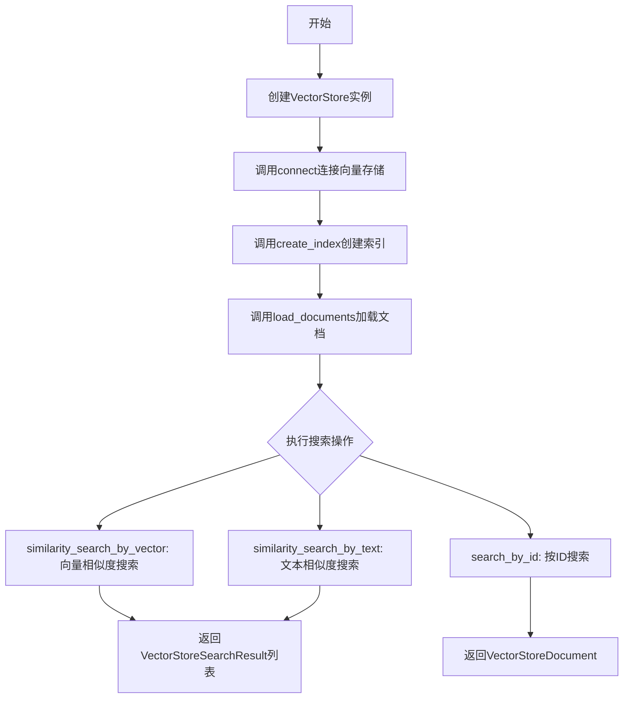
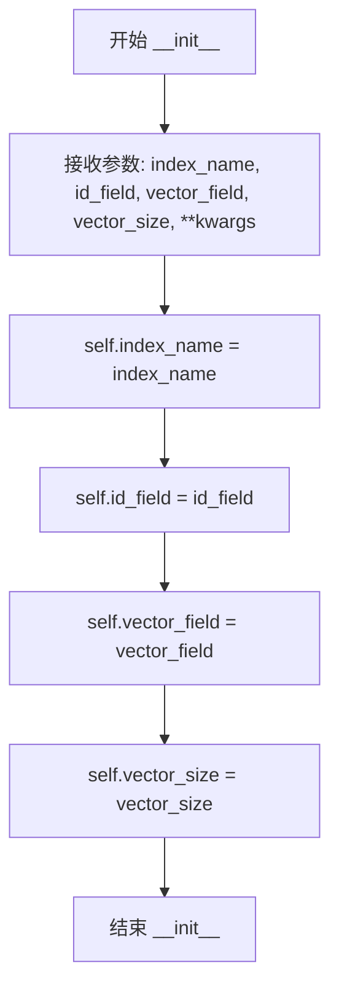
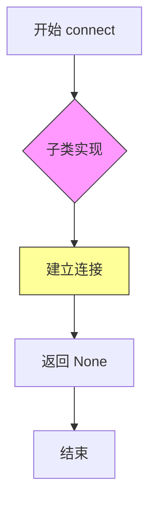
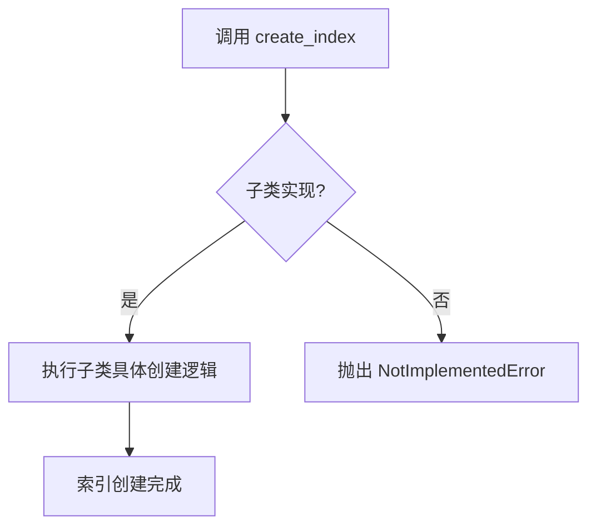
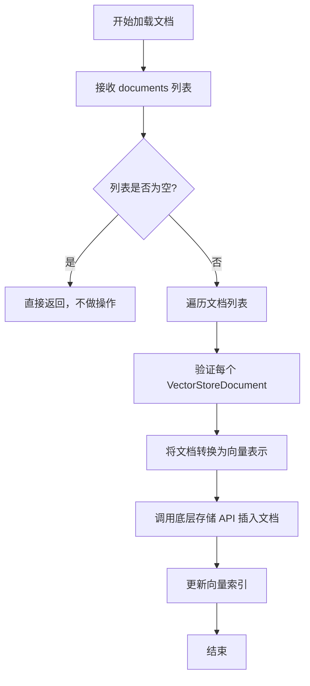
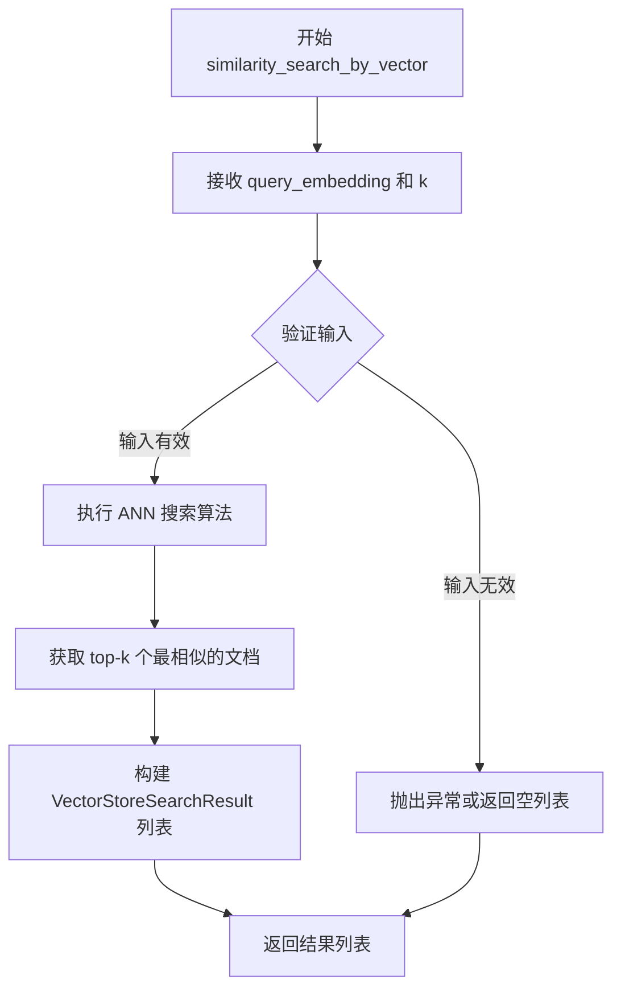
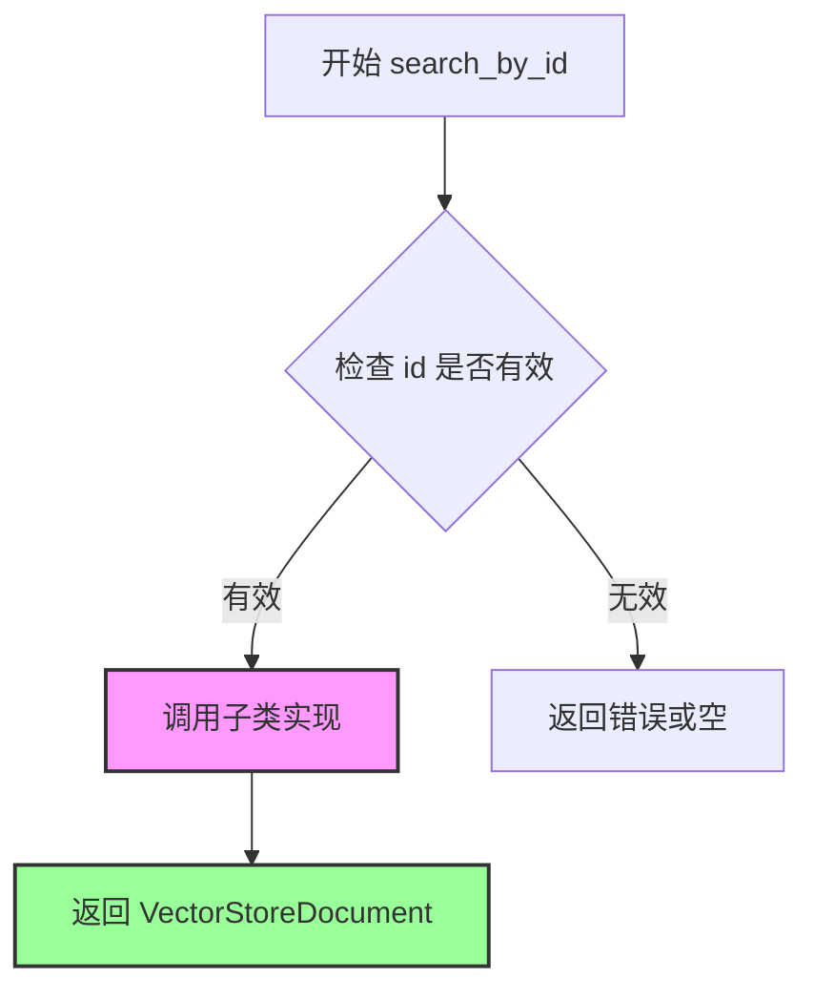

# `graphrag\packages\graphrag-vectors\graphrag_vectors\vector_store.py` 详细设计文档

这是一个向量存储（Vector Store）的抽象基类模块，定义了向量存储的标准接口和数据结构，包括文档存储模型、搜索结果模型以及向量相似度搜索、文本相似度搜索和按ID搜索等核心操作的抽象方法，为具体的向量存储实现（如Faiss、Milvus、Qdrant等）提供统一的抽象基类。

## 整体流程



## 类结构

```
VectorStoreDocument (数据类)
VectorStoreSearchResult (数据类)
VectorStore (抽象基类)
    ├── index_name: str
    ├── id_field: str
    ├── vector_field: str
    └── vector_size: int
```

## 全局变量及字段


### `TextEmbedder`
    
文本嵌入器类型，用于将文本转换为向量表示

类型：`type (from graphrag_vectors.types)`
    


### `VectorStoreDocument.id`
    
文档的唯一标识符

类型：`str | int`
    


### `VectorStoreDocument.vector`
    
文档的向量嵌入

类型：`list[float] | None`
    


### `VectorStoreSearchResult.document`
    
搜索到的文档

类型：`VectorStoreDocument`
    


### `VectorStoreSearchResult.score`
    
相似度分数，范围-1到1

类型：`float`
    


### `VectorStore.index_name`
    
索引名称，默认'vector_index'

类型：`str`
    


### `VectorStore.id_field`
    
ID字段名，默认'id'

类型：`str`
    


### `VectorStore.vector_field`
    
向量字段名，默认'vector'

类型：`str`
    


### `VectorStore.vector_size`
    
向量维度，默认3072

类型：`int`
    
    

## 全局函数及方法


### `VectorStore.__init__`

初始化向量存储库的配置参数，包括索引名称、文档ID字段、向量字段和向量维度大小，并将这些参数存储为实例属性。

参数：

- `index_name`：`str`，索引名称，默认为 "vector_index"
- `id_field`：`str`，文档ID字段名，默认为 "id"
- `vector_field`：`str`，向量字段名，默认为 "vector"
- `vector_size`：`int`，向量维度大小，默认为 3072
- `**kwargs`：`Any`，其他可变参数，用于向后兼容或传递额外配置

返回值：`None`，无返回值（构造函数）

#### 流程图



#### 带注释源码

```python
def __init__(
    self,
    index_name: str = "vector_index",
    id_field: str = "id",
    vector_field: str = "vector",
    vector_size: int = 3072,
    **kwargs: Any,
):
    """初始化 VectorStore 实例的配置参数。

    Args:
        index_name: 索引名称，用于标识向量存储索引，默认为 "vector_index"
        id_field: 文档ID字段名，指定存储文档时使用的ID属性，默认为 "id"
        vector_field: 向量字段名，指定存储向量数据时使用的属性名，默认为 "vector"
        vector_size: 向量维度大小，指定向量的维度，默认为 3072（OpenAI text-embedding-ada-002 的维度）
        **kwargs: 额外的关键字参数，用于向后兼容或传递特定实现的配置
    """
    # 设置索引名称
    self.index_name = index_name
    # 设置ID字段名
    self.id_field = id_field
    # 设置向量字段名
    self.vector_field = vector_field
    # 设置向量维度大小
    self.vector_size = vector_size
```


### `VectorStore.connect`

建立与向量存储服务的连接。该方法为抽象方法，由子类实现具体的连接逻辑，用于初始化与向量数据库的连接通道。

参数：

- （无显式参数，隐式参数 `self` 为 VectorStore 实例）

返回值：`None`，表示连接操作完成，无返回值。

#### 流程图



#### 带注释源码

```python
@abstractmethod
def connect(self) -> None:
    """Connect to vector storage."""
```

**说明**：
- 该方法使用 `@abstractmethod` 装饰器，定义为抽象方法，要求子类必须实现具体的连接逻辑
- 返回类型为 `None`，表示连接操作不返回任何数据，仅执行副作用（建立连接）
- 方法文档字符串简洁描述其功能为"连接到向量存储"
- 具体的连接实现（如主机地址、端口、认证等）通过构造函数的 `**kwargs` 参数传入，并在子类实现中使用


### `VectorStore.create_index`

创建向量索引的抽象方法，由子类实现具体的索引创建逻辑。

参数：
- 无（仅包含 `self` 参数，但 `self` 是实例本身，不需要列出）

返回值：`None`，表示该方法不返回任何值，执行创建索引的副作用操作

#### 流程图



#### 带注释源码

```python
@abstractmethod
def create_index(self) -> None:
    """Create index."""
    # 抽象方法，由子类实现具体逻辑
    # 子类需要重写此方法以创建具体的向量索引
    # 例如：创建 FAISS 索引、Milvus 索引等
    pass
```


### `VectorStore.load_documents`

将文档列表加载到向量存储中的抽象方法，由子类实现具体逻辑。

参数：

- `self`：VectorStore，VectorStore 类实例本身
- `documents`：`list[VectorStoreDocument]`，要加载到向量存储中的文档列表

返回值：`None`，无返回值

#### 流程图



#### 带注释源码

```python
@abstractmethod
def load_documents(self, documents: list[VectorStoreDocument]) -> None:
    """Load documents into the vector-store.
    
    这是一个抽象方法，需要子类实现具体的加载逻辑。
    典型的实现步骤包括：
    1. 验证输入的文档列表
    2. 将每个文档的文本转换为向量表示
    3. 调用底层向量数据库的批量插入 API
    4. 确保索引已创建（如未创建则先创建索引）
    
    Args:
        documents: VectorStoreDocument 对象列表，每个对象包含 id 和 vector 属性
        
    Returns:
        None
        
    Note:
        - 该方法为抽象方法，具体实现由子类提供
        - 子类应处理批量插入以提高性能
        - 应考虑事务或批量操作的原子性
    """
    pass
```


### `VectorStore.similarity_search_by_vector`

执行基于向量的近似最近邻（ANN）搜索，返回与查询向量最相似的top-k个文档。

参数：

- `self`：`VectorStore` 实例，调用该方法的向量存储实例本身
- `query_embedding`：`list[float]`，查询向量，用于进行相似度匹配
- `k`：`int`，返回结果的数量，默认为10

返回值：`list[VectorStoreSearchResult]` - 包含相似文档及其相似度分数的结果列表

#### 流程图



#### 带注释源码

```python
@abstractmethod
def similarity_search_by_vector(
    self, query_embedding: list[float], k: int = 10
) -> list[VectorStoreSearchResult]:
    """Perform ANN search by vector."""
    # 注意：这是一个抽象方法，具体实现由子类提供
    # 参数 query_embedding: 查询向量，表示要搜索的嵌入向量
    # 参数 k: 返回的最近邻数量，默认为10
    # 返回: VectorStoreSearchResult 对象列表，包含匹配的文档和相似度分数
    pass
```


### `VectorStore.similarity_search_by_text`

该方法执行基于文本的相似性搜索，将文本通过文本嵌入器转换为向量，然后在向量存储中搜索最相似的文档。

参数：

- `self`：`VectorStore`，向量存储实例本身
- `text`：`str`，要搜索的文本内容
- `text_embedder`：`TextEmbedder`，文本嵌入器，用于将文本转换为向量表示
- `k`：`int` = 10，返回最相似的文档数量，默认为10

返回值：`list[VectorStoreSearchResult]` ，返回与查询文本最相似的文档列表，包含文档及其相似度分数

#### 流程图

```mermaid
flowchart TD
    A[开始 similarity_search_by_text] --> B[调用 text_embedder(text) 获取查询向量]
    B --> C{query_embedding 是否存在?}
    C -->|是| D[调用 similarity_search_by_vector query_embedding, k]
    D --> E[返回搜索结果列表]
    C -->|否| F[返回空列表 []]
    E --> G[结束]
    F --> G
```

#### 带注释源码

```python
def similarity_search_by_text(
    self, text: str, text_embedder: TextEmbedder, k: int = 10
) -> list[VectorStoreSearchResult]:
    """Perform a text-based similarity search.
    
    该方法首先使用提供的文本嵌入器将文本查询转换为向量表示，
    然后利用该向量在向量存储中执行相似性搜索。
    
    参数:
        text: 要搜索的文本内容
        text_embedder: 文本嵌入器实例，用于将文本转换为向量
        k: 返回的最近邻数量，默认为10
        
    返回:
        包含VectorStoreSearchResult对象的列表，每个结果包含匹配的文档和相似度分数
        如果文本嵌入失败或返回空向量，则返回空列表
    """
    # 步骤1: 使用文本嵌入器将输入文本转换为向量表示
    query_embedding = text_embedder(text)
    
    # 步骤2: 检查是否成功获取到查询向量
    if query_embedding:
        # 步骤3: 如果向量存在，调用基于向量的相似性搜索方法
        return self.similarity_search_by_vector(
            query_embedding=query_embedding, k=k
        )
    
    # 步骤4: 如果嵌入失败或返回空值，返回空结果列表
    return []
```


### `VectorStore.search_by_id`

通过文档的唯一标识符在向量存储中检索对应的文档。

参数：

- `id`：`str`，要搜索的文档的唯一标识符

返回值：`VectorStoreDocument`，找到的文档对象，如果未找到则由子类实现决定

#### 流程图



#### 带注释源码

```python
@abstractmethod
def search_by_id(self, id: str) -> VectorStoreDocument:
    """Search for a document by id.
    
    这是一个抽象方法，需要子类实现具体的搜索逻辑。
    
    参数:
        id: 文档的唯一标识符，用于在向量存储中查找文档
        
    返回值:
        VectorStoreDocument: 返回找到的文档对象，如果未找到则由子类实现决定行为
    """
```

## 关键组件


### VectorStoreDocument

用于表示存储在向量存储中的文档的数据类，包含文档唯一标识和对应的向量嵌入表示。

### VectorStoreSearchResult

用于表示向量存储搜索结果的数据类，包含匹配的文档和相似度分数。

### VectorStore

向量存储的抽象基类，定义了向量存储的标准接口，包含索引配置、文档加载、向量搜索等核心操作。

### index_name

索引名称配置，默认为"vector_index"，用于标识向量存储中的索引实体。

### id_field

文档ID字段名称，默认为"id"，用于指定存储文档唯一标识的字段。

### vector_field

向量字段名称，默认为"vector"，用于指定存储文档向量的字段。

### vector_size

向量维度大小，默认为3072，定义了向量嵌入的维度。

### connect

连接到向量存储服务的抽象方法。

### create_index

创建向量索引的抽象方法。

### load_documents

将文档列表加载到向量存储的抽象方法。

### similarity_search_by_vector

通过向量进行近似最近邻（ANN）搜索的抽象方法。

### similarity_search_by_text

通过文本进行相似度搜索的方法，首先使用TextEmbedder将文本转换为向量，再调用向量搜索。

### search_by_id

根据文档ID查询文档的抽象方法。

### TextEmbedder

从graphrag_vectors.types导入的文本嵌入器类型，用于将文本转换为向量表示。


## 问题及建议


### 已知问题

-   **缺少断开连接接口**：`VectorStore` 基类只有 `connect()` 方法，但没有对应的 `disconnect()` 或 `close()` 方法，可能导致资源泄漏
-   **异常处理不完善**：所有抽象方法都未定义可能抛出的异常，调用者无法得知错误类型，难以进行针对性的错误处理
-   **类型注解不够精确**：`VectorStoreSearchResult.score` 注释说明范围是 -1 到 1，但类型注解仅为 `float`，缺少约束
-   **缺少批量操作方法**：只提供了 `load_documents` 加载文档，但缺少 `upsert`（更新或插入）、`delete` 等常见操作接口
-   **索引生命周期管理缺失**：只有 `create_index()`，缺少 `delete_index()`、`index_exists()` 等索引管理方法
-   **文本嵌入器调用可能返回空**：`similarity_search_by_text` 方法中 `text_embedder(text)` 的返回值未明确文档说明，调用方需要自行处理边界情况
-   **未使用的参数**：`__init__` 中接收 `**kwargs: Any` 但从未使用，造成接口冗余
-   **抽象方法缺少前置条件文档**：如 `load_documents` 未说明文档列表是否可为空、`search_by_id` 未说明 id 不存在时的行为

### 优化建议

-   添加 `disconnect()` 抽象方法，并在基类提供默认空实现
-   定义 `VectorStoreException` 异常类体系，具体化各方法可能抛出的异常
-   使用 `typing.Final` 或 ` Annotated` 对 `score` 字段的范围进行约束
-   增加 `upsert_documents()`、`delete_documents()`、`delete_index()`、`index_exists()` 等方法
-   将 `**kwargs` 改为具体的可选配置参数，或在文档中明确其用途
-   为 `search_by_id` 方法添加返回值说明（是否返回 None、是否抛出异常）
-   考虑添加上下文管理器（`__enter__`/`__exit__`）支持，便于资源自动管理

## 其它


### 设计目标与约束

本模块的设计目标是提供一套统一的向量存储抽象接口，使得上层应用能够在不了解具体向量存储实现细节的情况下，进行向量数据的存取和搜索操作。设计约束包括：1）必须继承ABC实现抽象类，以保证不同向量存储实现的接口一致性；2）向量维度默认设置为3072，与主流文本嵌入模型（如text-embedding-3-large）输出维度兼容；3）搜索结果按相似度分数降序排列，分数范围为-1到1。

### 错误处理与异常设计

本模块采用抽象方法定义接口，具体异常由实现类自行抛出。connect()方法应在连接失败时抛出连接异常；create_index()方法应在索引创建失败时抛出索引创建异常；load_documents()方法应在文档加载失败时抛出数据加载异常；similarity_search_by_vector()和search_by_id()方法应在搜索失败时抛出搜索异常。所有异常应继承自基异常类，并包含有意义的错误信息。search_by_text方法在text_embedder返回None或空列表时返回空列表，而非抛出异常。

### 数据流与状态机

VectorStore的生命周期包含三个主要状态：未连接（Disconnected）、已连接（Connected）、索引已创建（IndexCreated）。初始状态为未连接，调用connect()后进入已连接状态，调用create_index()后进入索引已创建状态。数据流方面：文档数据通过load_documents()从外部导入；查询流程为文本→TextEmbedder→向量→similarity_search_by_vector→返回结果；按ID查询直接通过search_by_id()返回单条文档记录。

### 外部依赖与接口契约

本模块依赖graphrag_vectors.types中的TextEmbedder接口，要求实现类提供可调用的__call__方法，输入字符串返回list[float]类型向量。VectorStoreDocument的id字段支持str或int类型；vector字段支持list[float]或None（用于仅存储元数据场景）。实现类必须实现所有抽象方法，且必须保持与基类相同的方法签名。搜索结果按score降序排列，k参数指定返回结果数量上限。

### 性能考虑与优化

默认向量大小3072维，每个float64占用8字节，单条向量占用约24KB内存。实现类应考虑：1）批量加载文档时使用批处理减少IO次数；2）相似度搜索使用近似最近邻（ANN）算法提升大规模数据检索性能；3）对于频繁查询场景考虑缓存机制；4）load_documents方法未定义批量大小参数，实现类应根据实际情况分批处理以避免内存溢出。

### 安全性考虑

本模块为纯数据访问层，不直接涉及敏感数据处理。但实现类应注意：1）连接字符串和凭证信息不应硬编码，应通过配置或环境变量传递；2）索引名称和字段名称应进行输入验证，防止注入攻击；3）如果向量数据包含敏感信息，实现类应提供加密存储选项。

### 配置说明

VectorStore构造函数支持以下配置参数：index_name（索引名称，默认"vector_index"）、id_field（ID字段名，默认"id"）、vector_field（向量字段名，默认"vector"）、vector_size（向量维度，默认3072）、**kwargs（传递给具体实现的额外参数）。建议实现类通过kwargs接收特定存储引擎的配置，如连接池大小、超时时间、索引参数等。

### 使用示例

```python
# 定义具体实现类
class MyVectorStore(VectorStore):
    def connect(self) -> None:
        # 实现连接逻辑
        pass
    
    def create_index(self) -> None:
        # 实现索引创建
        pass
    
    def load_documents(self, documents: list[VectorStoreDocument]) -> None:
        # 实现文档加载
        pass
    
    def similarity_search_by_vector(self, query_embedding: list[float], k: int = 10) -> list[VectorStoreSearchResult]:
        # 实现向量搜索
        pass
    
    def search_by_id(self, id: str) -> VectorStoreDocument:
        # 实现ID查询
        pass

# 使用示例
store = MyVectorStore(index_name="my_index", vector_size=1536)
store.connect()
store.create_index()

# 加载文档
docs = [
    VectorStoreDocument(id="1", vector=[0.1] * 1536),
    VectorStoreDocument(id="2", vector=[0.2] * 1536),
]
store.load_documents(docs)

# 向量搜索
results = store.similarity_search_by_vector(query_embedding=[0.1] * 1536, k=5)

# 文本搜索（需要TextEmbedder实现）
# results = store.similarity_search_by_text("query text", embedder, k=5)
```

### 版本历史

| 版本 | 日期 | 变更说明 |
|------|------|----------|
| 1.0.0 | 2024 | 初始版本，包含VectorStore基类及相关数据类 |


    