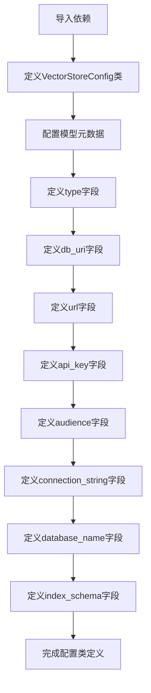

# `graphrag\packages\graphrag-vectors\graphrag_vectors\vector_store_config.py` 详细设计文档

定义向量存储库的默认配置参数，支持多种向量存储类型（LanceDB、Azure AI Search、CosmosDB），通过Pydantic模型提供配置验证和类型提示。

## 整体流程



## 类结构

```
VectorStoreConfig (Pydantic BaseModel)
└── 配置字段: type, db_uri, url, api_key, audience, connection_string, database_name, index_schema
```

## 全局变量及字段


### `VectorStoreConfig.type`
    
向量存储类型，默认为LanceDB

类型：`str`
    


### `VectorStoreConfig.db_uri`
    
LanceDB数据库URI

类型：`str | None`
    


### `VectorStoreConfig.url`
    
Azure AI Search或CosmosDB的URL

类型：`str | None`
    


### `VectorStoreConfig.api_key`
    
Azure AI Search的API密钥

类型：`str | None`
    


### `VectorStoreConfig.audience`
    
Azure AI Search的受众

类型：`str | None`
    


### `VectorStoreConfig.connection_string`
    
CosmosDB连接字符串

类型：`str | None`
    


### `VectorStoreConfig.database_name`
    
CosmosDB数据库名称

类型：`str | None`
    


### `VectorStoreConfig.index_schema`
    
索引模式字典

类型：`dict[str, IndexSchema]`
    
    

## 全局函数及方法


## 关键组件


### VectorStoreConfig

主配置类，用于定义向量存储的默认配置参数，继承自 Pydantic BaseModel，支持额外字段以适配自定义向量实现。

### type 字段

指定要使用的向量存储类型，默认为 LanceDB，通过 VectorStoreType 枚举定义支持的存储类型。

### db_uri 字段

数据库 URI，仅用于 LanceDB 内置存储，默认为 None，支持自定义数据库路径或连接地址。

### url 字段

数据库 URL，当类型为 azure_ai_search 或 cosmosdb 时使用，用于指定云服务的端点地址。

### api_key 字段

数据库 API 密钥，当类型为 azure_ai_search 时使用，用于身份验证和访问控制。

### audience 字段

数据库受众，当类型为 azure_ai_search 时使用，用于 Azure AD 令牌的身份验证。

### connection_string 字段

连接字符串，当类型为 cosmosdb 时使用，提供完整的数据库连接配置信息。

### database_name 字段

数据库名称，当类型为 cosmosdb 时使用，指定要连接或创建的数据库实例名称。

### index_schema 字段

索引模式字典，键为字符串，值为 IndexSchema 类型，定义向量数据的索引结构和字段映射关系。


## 问题及建议


### 已知问题

-   `index_schema` 字段缺少 `description`，文档不完整，影响配置的可读性和可维护性
-   `type` 字段使用 `str` 类型而非 `VectorStoreType` 枚举类型，无法利用枚举的类型安全和自动补全功能
-   混合了多种向量存储（LanceDB、Azure AI Search、CosmosDB）的配置参数于单一模型中，配置结构混乱且容易产生无效组合（如同时设置 `db_uri` 和 `url`）
-   `extra="allow"` 允许任意额外字段，可能导致运行时配置错误难以发现
-   缺少配置验证逻辑，无法确保必需字段的存在或字段之间的互斥关系

### 优化建议

-   为 `index_schema` 字段添加 `Field(description="...")` 描述
-   将 `type` 字段改为 `VectorStoreType` 枚举类型，并使用 `Field(default=VectorStoreType.LanceDB)`
-   考虑使用 Pydantic 的 discriminated union 模式，为不同向量存储类型创建独立的配置子模型
-   添加 `model_validator` 或 `field_validator` 来验证互斥字段（如 `db_uri` 与 `url` 不能同时存在）
-   将 `extra` 设置为 `"forbid"` 或明确列出所有支持的可选字段，以提高配置的类型安全性


## 其它


### 一段话描述

VectorStoreConfig 是一个 Pydantic 配置类，用于定义向量存储库的各种参数配置，支持 LanceDB、Azure AI Search 和 CosmosDB 等多种向量存储类型的连接参数、认证信息和索引模式配置。

### 整体运行流程

该模块作为配置定义模块，在应用启动时被导入并用于验证和解析向量存储相关的配置参数。具体流程如下：1) 应用读取配置文件或环境变量；2) Pydantic 自动验证配置值的类型和合法性；3) 生成包含所有配置项的 VectorStoreConfig 实例；4) 该实例被传递给向量存储初始化代码以创建具体的数据库连接。

### 类字段详细信息

| 字段名称 | 类型 | 描述 |
|---------|------|------|
| type | str | 向量存储类型，默认为 LanceDB |
| db_uri | str \| None | 数据库 URI，仅用于 LanceDB 内置存储 |
| url | str \| None | Azure AI Search 或 CosmosDB 的数据库 URL |
| api_key | str \| None | Azure AI Search 的 API 密钥 |
| audience | str \| None | Azure AI Search 的认证受众 |
| connection_string | str \| None | CosmosDB 的连接字符串 |
| database_name | str \| None | CosmosDB 的数据库名称 |
| index_schema | dict[str, IndexSchema] | 索引模式定义字典 |

### 类方法详细信息

该类继承自 Pydantic BaseModel，继承的方法包括：
- model_validate(): 验证配置字典并返回模型实例
- model_dump(): 将模型实例转换为字典
- model_dump_json(): 将模型实例转换为 JSON 字符串
- model_validate_json(): 从 JSON 字符串验证并创建实例

由于是配置类，核心方法由 Pydantic 框架提供，无需自定义业务逻辑方法。

### 全局变量和全局函数

无独立的全局变量或全局函数定义。所有配置通过 VectorStoreConfig 类的字段体现。

### 关键组件信息

| 组件名称 | 描述 |
|---------|------|
| VectorStoreConfig | 核心配置类，封装所有向量存储配置参数 |
| IndexSchema | 索引模式类型定义，定义向量索引的数据结构 |
| VectorStoreType | 向量存储类型枚举，定义支持的存储类型 |
| ConfigDict | Pydantic 配置字典，用于配置模型行为 |

### 潜在的技术债务或优化空间

1. **配置验证不足**: 当前配置类缺少更细粒度的验证逻辑，例如当 type 为 Azure AI Search 时，url 和 api_key 应为必填字段；当 type 为 LanceDB 时，db_uri 应为必填。
2. **缺乏默认值文档**: 缺少对每个配置项默认值产生条件和使用场景的详细说明。
3. **索引模式定义不完整**: index_schema 字段为空字典，缺少对 IndexSchema 类型的实际定义和使用示例。
4. **缺少配置迁移文档**: 未提供配置版本管理和升级迁移的说明。

### 设计目标与约束

- **设计目标**: 提供统一的向量存储配置抽象，支持多种向量存储后端的灵活配置
- **设计约束**: 
  - 必须继承自 Pydantic BaseModel 以支持配置验证
  - 配置项必须支持从环境变量或 YAML/JSON 配置文件加载
  - 需要保持向后兼容，允许 extra="allow" 以支持自定义向量实现

### 错误处理与异常设计

- Pydantic 自动验证配置类型，当类型不匹配时抛出 ValidationError
- 缺少必需字段时的错误信息由 Pydantic 自动生成
- 可通过自定义验证器增强特定类型组合的校验逻辑

### 外部依赖与接口契约

- **依赖库**: pydantic (>=2.0) - 用于配置模型定义和验证
- **内部依赖**: graphrag_vectors.index_schema.IndexSchema - 索引模式类型；graphrag_vectors.vector_store_type.VectorStoreType - 存储类型枚举
- **接口契约**: 
  - 输入：字典或关键字参数形式提供配置
  - 输出：VectorStoreConfig 实例，包含所有验证后的配置项
  - 使用方：向量存储初始化模块通过实例化此类获取配置参数

    