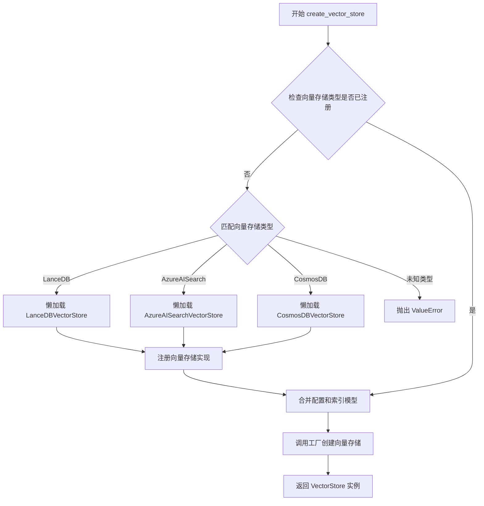
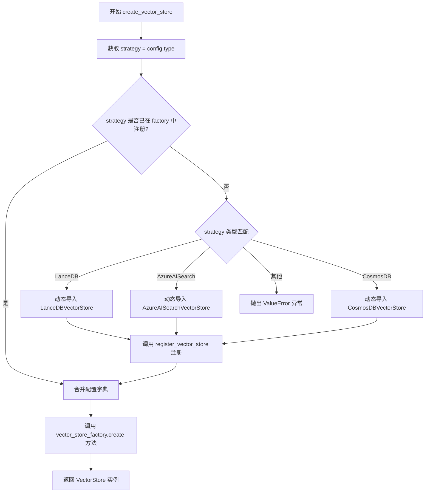
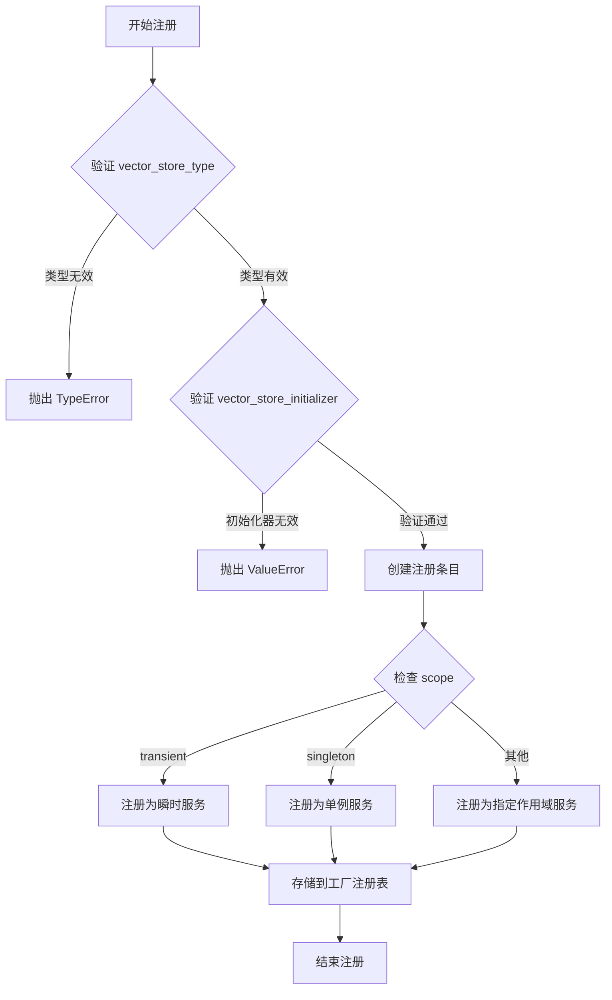
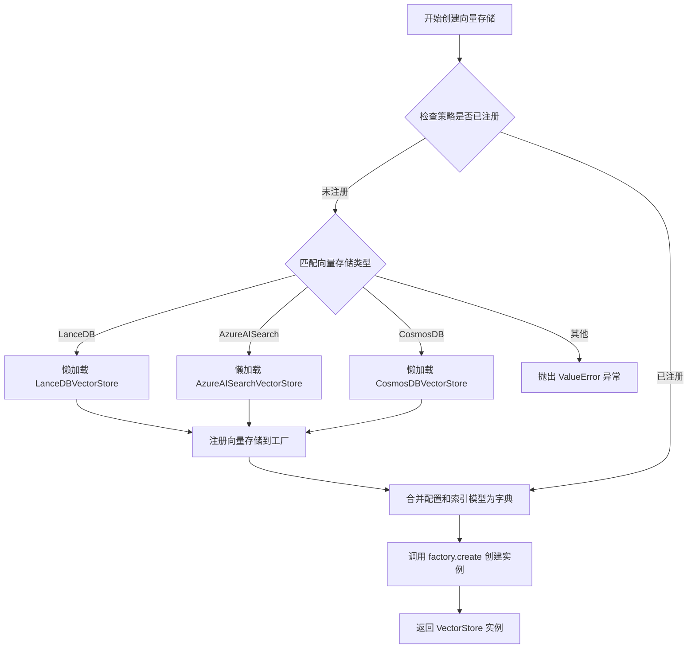
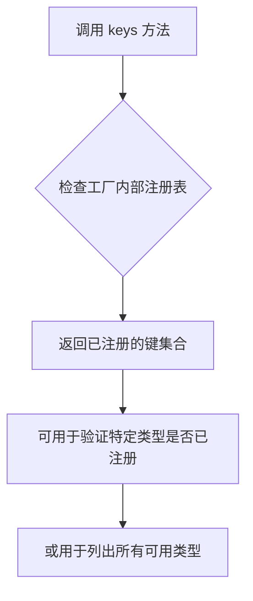

# `graphrag\packages\graphrag-vectors\graphrag_vectors\vector_store_factory.py` 详细设计文档

该模块实现了向量存储工厂模式，提供统一的接口来创建和注册不同类型的向量存储实现（如LanceDB、Azure AI Search、CosmosDB），支持懒加载内置实现并允许用户注册自定义向量存储。

## 整体流程



## 类结构

```
VectorStoreFactory (工厂类)
└── Factory[VectorStore] (泛型基类)
```

## 全局变量及字段


### `vector_store_factory`
    
向量存储工厂单例实例，用于注册和创建不同类型的向量存储实现

类型：`VectorStoreFactory[VectorStore]`
    


    

## 全局函数及方法


### `register_vector_store`

注册一个自定义的向量存储实现到向量存储工厂中，允许用户在运行时添加自定义的向量存储类型。

参数：

- `vector_store_type`：`str`，要注册的向量存储类型标识符
- `vector_store_initializer`：`Callable[..., VectorStore]`，用于创建向量存储实例的初始化函数
- `scope`：`ServiceScope`，服务作用域，默认为 "transient"（瞬态）

返回值：`None`，无返回值

#### 流程图

```mermaid
flowchart TD
    A[开始 register_vector_store] --> B[接收参数: vector_store_type, vector_store_initializer, scope]
    B --> C{scope 参数}
    C -->|使用默认值 "transient"| D[调用 vector_store_factory.register]
    C -->|使用传入值| D
    D --> E[在工厂中注册向量存储类型]
    E --> F[结束函数, 返回 None]
```

#### 带注释源码

```python
def register_vector_store(
    vector_store_type: str,
    vector_store_initializer: Callable[..., VectorStore],
    scope: ServiceScope = "transient",
) -> None:
    """Register a custom vector store implementation.

    Args
    ----
        - vector_store_type: str
            The vector store id to register.
        - vector_store_initializer: Callable[..., VectorStore]
            The vector store initializer to register.
        - scope: ServiceScope
            The service scope for the vector store (default: "transient").
    """
    # 调用工厂实例的 register 方法，将自定义向量存储注册到工厂中
    # vector_store_type: 作为注册键，用于后续通过 create_vector_store 创建实例
    # vector_store_initializer: 实际的向量存储类或工厂函数
    # scope: 控制服务生命周期，"transient" 表示每次请求创建新实例
    vector_store_factory.register(vector_store_type, vector_store_initializer, scope)
```


### `create_vector_store`

该函数用于根据配置创建一个向量存储（VectorStore）实例。它首先检查指定的向量存储类型是否已注册到工厂中，若未注册则按需动态导入并注册内置实现（ LanceDB、AzureAISearch 或 CosmosDB），最后将基础配置与索引模式合并后调用工厂方法创建具体的向量存储实例。

参数：

- `config`：`VectorStoreConfig`，基础向量存储配置，包含类型等参数
- `index_schema`：`IndexSchema`，向量存储实例的索引模式配置，用于指定具体的表读写配置

返回值：`VectorStore`，创建好的向量存储实现实例

#### 流程图



#### 带注释源码

```python
def create_vector_store(
    config: VectorStoreConfig, index_schema: IndexSchema
) -> VectorStore:
    """Create a vector store implementation based on the given type and configuration.

    Args
    ----
        - config: VectorStoreConfig
            The base vector store configuration.
        - index_schema: IndexSchema
            The index schema configuration for the vector store instance - i.e., for the specific table we are reading/writing.

    Returns
    -------
        VectorStore
            The created vector store implementation.
    """
    # 从配置中获取向量存储类型策略
    strategy = config.type

    # 如果策略未注册，则按需动态导入并注册内置实现
    if strategy not in vector_store_factory:
        # 使用 match-case 根据类型匹配并动态导入对应的向量存储类
        match strategy:
            case VectorStoreType.LanceDB:
                # 延迟导入 LanceDB 向量存储实现
                from graphrag_vectors.lancedb import LanceDBVectorStore

                # 将 LanceDB 实现注册到工厂
                register_vector_store(VectorStoreType.LanceDB, LanceDBVectorStore)
            case VectorStoreType.AzureAISearch:
                # 延迟导入 Azure AI Search 向量存储实现
                from graphrag_vectors.azure_ai_search import AzureAISearchVectorStore

                # 将 Azure AI Search 实现注册到工厂
                register_vector_store(
                    VectorStoreType.AzureAISearch, AzureAISearchVectorStore
                )
            case VectorStoreType.CosmosDB:
                # 延迟导入 CosmosDB 向量存储实现
                from graphrag_vectors.cosmosdb import CosmosDBVectorStore

                # 将 CosmosDB 实现注册到工厂
                register_vector_store(VectorStoreType.CosmosDB, CosmosDBVectorStore)
            case _:
                # 类型不匹配时抛出详细错误信息
                msg = f"Vector store type '{strategy}' is not registered in the VectorStoreFactory. Registered types: {', '.join(vector_store_factory.keys())}."
                raise ValueError(msg)

    # 将基础配置和索引模式配置合并为单一字典
    # 使用 model_dump() 将 Pydantic 模型转换为字典
    config_model = config.model_dump()
    index_model = index_schema.model_dump()
    
    # 使用字典解包合并两个配置字典，index_model 会覆盖 config_model 中的重复键
    # 调用工厂的 create 方法创建向量存储实例，传入合并后的初始化参数
    return vector_store_factory.create(
        strategy, init_args={**config_model, **index_model}
    )
```


### VectorStoreFactory.register

注册一个自定义向量存储实现到工厂注册表中，允许通过类型标识符动态创建特定的向量存储实例。

参数：

- `vector_store_type`：`str`，向量存储的唯一标识符（类型名称），用于后续通过 `create` 方法检索对应的向量存储实现
- `vector_store_initializer`：`Callable[..., VectorStore]`，向量存储的初始化函数或类构造函数，接受配置参数并返回 VectorStore 实例
- `scope`：`ServiceScope`，服务作用域，默认为 `"transient"`，控制向量存储实例的生命周期（transient/singleton 等）

返回值：`None`，无返回值，仅执行注册操作

#### 流程图



#### 带注释源码

```python
# 该方法继承自 Factory 基类，此处为基于调用方式和工厂模式的推断实现
# 实际实现位于 graphrag_common.factory.Factory 类中

def register(
    self,
    vector_store_type: str,  # 向量存储类型标识符，如 "lancedb"
    vector_store_initializer: Callable[..., VectorStore],  # 可调用的初始化器
    scope: ServiceScope = "transient"  # 服务作用域，默认为瞬时模式
) -> None:
    """Register a vector store implementation.
    
    This method registers a vector store type with its initializer function
    into the factory's internal registry, allowing dynamic creation later.
    
    Args:
        vector_store_type: Unique identifier for the vector store type
        vector_store_initializer: Callable that returns a VectorStore instance
        scope: Service lifecycle scope (transient/singleton/etc)
    """
    # 注册逻辑（在基类 Factory 中实现）
    # 1. 验证 vector_store_type 字符串非空
    # 2. 验证 vector_store_initializer 可调用
    # 3. 根据 scope 参数创建对应的服务描述符
    # 4. 将类型标识符和初始化器存储到内部注册表中
    #    self._registry[vector_store_type] = (vector_store_initializer, scope)
    
    pass  # 基类实现
```


# VectorStoreFactory.create 方法详细设计文档

## 1. 核心功能概述

`VectorStoreFactory.create` 是向量存储工厂的核心方法，负责根据配置动态创建相应的向量存储实例，支持懒加载内置实现（ LanceDB、AzureAISearch、CosmosDB），并将基础配置和索引配置合并后传递给具体的向量存储初始化器。

---

## 2. 方法详细信息

### `VectorStoreFactory.create`

基于配置创建向量存储实例的工厂方法，从 `Factory` 基类继承而来。

**参数：**

- `strategy`：`str`，向量存储类型标识符，用于从已注册的向量存储中选择具体的实现
- `init_args`：`dict[str, Any]`，包含配置模型和索引模型的合并字典，作为初始化参数传递给向量存储的初始化函数

**返回值：**`VectorStore`，返回创建的具体向量存储实现实例

---

### `create_vector_store` (公开接口函数)

这是代码中实际调用的公开函数，内部委托给 `vector_store_factory.create`。

**参数：**

- `config`：`VectorStoreConfig`，基础向量存储配置对象，包含向量存储类型等基本配置
- `index_schema`：`IndexSchema`，索引模式配置，描述向量存储实例对应的表结构

**返回值：**`VectorStore`，创建完成的向量存储实例

---

## 3. 流程图



---

## 4. 带注释源码

```python
# 从 config 获取向量存储类型策略
strategy = config.type

# 懒加载内置实现：检查该策略是否已注册
if strategy not in vector_store_factory:
    # 使用 match-case 根据类型匹配并动态导入对应的向量存储类
    match strategy:
        case VectorStoreType.LanceDB:
            # 动态导入 LanceDB 向量存储实现
            from graphrag_vectors.lancedb import LanceDBVectorStore
            # 注册到工厂，scope 默认为 transient（瞬时）
            register_vector_store(VectorStoreType.LanceDB, LanceDBVectorStore)
        
        case VectorStoreType.AzureAISearch:
            # 动态导入 Azure AI Search 向量存储实现
            from graphrag_vectors.azure_ai_search import AzureAISearchVectorStore
            # 注册到工厂
            register_vector_store(VectorStoreType.AzureAISearch, AzureAISearchVectorStore)
        
        case VectorStoreType.CosmosDB:
            # 动态导入 CosmosDB 向量存储实现
            from graphrag_vectors.cosmosdb import CosmosDBVectorStore
            # 注册到工厂
            register_vector_store(VectorStoreType.CosmosDB, CosmosDBVectorStore)
        
        case _:
            # 策略不匹配任何已知类型，抛出详细错误信息
            msg = f"Vector store type '{strategy}' is not registered in the VectorStoreFactory. Registered types: {', '.join(vector_store_factory.keys())}."
            raise ValueError(msg)

# 将基础配置和索引配置展开为字典并合并
# config_model: 包含基础配置（如连接字符串、凭据等）
# index_model: 包含特定表的索引配置（如字段映射、索引参数等）
config_model = config.model_dump()
index_model = index_schema.model_dump()

# 调用工厂的 create 方法创建向量存储实例
# 传入策略名称和合并后的初始化参数
return vector_store_factory.create(
    strategy, 
    init_args={**config_model, **index_model}
)
```

---

## 5. 关键组件信息

| 组件名称 | 描述 |
|---------|------|
| `VectorStoreFactory` | 泛型工厂类，继承自 `Factory[VectorStore]`，管理向量存储的注册和创建 |
| `vector_store_factory` | 工厂单例实例，用于注册和创建向量存储 |
| `register_vector_store` | 注册函数，将自定义向量存储实现注册到工厂 |
| `VectorStoreType` | 枚举类型，定义支持的向量存储类型 |
| `VectorStoreConfig` | 向量存储的基础配置类 |
| `IndexSchema` | 索引模式配置类，定义表的结构 |

---

## 6. 潜在技术债务与优化空间

1. **动态导入耦合**：match-case 语句硬编码了各向量存储类型的导入路径，可考虑使用插件式架构解耦
2. **错误信息暴露内部细节**：异常信息暴露了 `vector_store_factory.keys()`，可能泄露注册信息
3. **配置合并覆盖风险**：使用字典展开合并配置时，若 `config_model` 和 `index_model` 存在相同键，后者的值会覆盖前者，缺乏冲突检测
4. **缺乏重试机制**：工厂创建实例失败时没有重试或降级策略
5. **类型提示不完整**：`init_args` 使用 `dict` 而非 `dict[str, Any]`，类型安全可增强

---

## 7. 其它项目说明

### 设计目标与约束

- **目标**：提供统一的向量存储创建接口，支持运行时动态注册和懒加载
- **约束**：仅支持继承自 `VectorStore` 基类的实现

### 错误处理与异常设计

- 抛出 `ValueError` 当请求的向量存储类型未注册时
- 错误信息包含当前已注册的向量存储类型列表，便于调试

### 数据流

```
用户配置 → VectorStoreConfig → index_schema → 
config.model_dump() + index_schema.model_dump() → 
合并为 init_args → vector_store_factory.create() → 
返回具体 VectorStore 实现实例
```

### 外部依赖

- `graphrag_common.factory.Factory`：基础工厂实现
- `graphrag_vectors.vector_store.VectorStore`：向量存储基类
- 各向量存储实现模块（lancedb, azure_ai_search, cosmosdb）


### `VectorStoreFactory.keys`

该方法继承自 `Factory` 基类，用于获取当前已注册在工厂中的所有向量存储类型的键（标识符）列表。

参数：

- `self`：隐式参数，`VectorStoreFactory` 实例本身，无需显式传递

返回值：`KeysView[str]`，返回一个视图对象，包含所有已注册向量化存储类型的键，可用于迭代或成员检查

#### 流程图



#### 带注释源码

```
# keys 方法定义于 Factory 基类中
# 此处为 VectorStoreFactory 继承自 Factory 的 keys 方法调用

# 使用示例（代码中的实际调用位置）：
if strategy not in vector_store_factory:
    # ... 省略其他代码 ...
    case _:
        msg = f"Vector store type '{strategy}' is not registered in the VectorStoreFactory. Registered types: {', '.join(vector_store_factory.keys())}."
        raise ValueError(msg)

# 方法说明：
# - keys() 方法返回一个 KeysView 对象，包含当前已注册的所有 vector_store_type 键
# - 在代码中用于：
#   1. 检查某个策略是否已注册（通过 `in` 操作符）
#   2. 在错误信息中列出所有已注册的向量存储类型，供用户参考
# - 该方法支持延迟加载机制：只有当某类型首次被请求且未注册时，才会尝试导入并注册内置实现
```

## 关键组件


### VectorStoreFactory 类

工厂类，继承自泛型 Factory，用于管理和创建向量存储实例，支持注册自定义实现和按需实例化。

### vector_store_factory 全局变量

类型：VectorStoreFactory，单例模式的工厂实例，用于存储所有已注册的向量存储初始化器。

### register_vector_store 函数

类型：Callable，用于注册自定义向量存储实现，支持指定服务作用域（transient/singleton）。

### create_vector_store 函数

类型：Callable，根据配置和索引模式创建向量存储实例，实现惰性加载内置实现并合并配置参数。

### 惰性加载机制

在 create_vector_store 中通过 match-case 动态导入向量存储实现，避免启动时加载所有依赖。

### VectorStoreType 枚举

定义支持的向量存储类型，包括 LanceDB、AzureAISearch、CosmosDB 三种内置实现。

### 配置合并逻辑

将 base config 和 index schema 的模型字典合并为单一参数字典传递给初始化器。


## 问题及建议


### 已知问题

- **动态导入缺乏错误处理**：在 `create_vector_store` 函数中动态导入向量存储实现（如 LanceDBVectorStore 等），如果导入失败只会抛出通用的 ModuleNotFoundError，缺乏具体的错误提示和fallback机制
- **重复注册逻辑风险**：`register_vector_store` 在每次 `create_vector_store` 调用时都会被触发检查，即使工厂已包含该类型也会执行 `not in` 检查，存在潜在的重复注册风险（虽然 Factory.register 可能已处理覆盖逻辑）
- **配置字典合并覆盖风险**：`{**config_model, **index_model}` 直接合并两个字典，如果存在相同的键值，`index_model` 会覆盖 `config_model`，可能导致意外的优先级问题且难以调试
- **全局可变状态缺乏隔离机制**：`vector_store_factory` 作为全局单例缺乏重置/清理接口，在单元测试场景下容易因状态污染导致测试间相互影响
- **类型注解不够精确**：`Callable[..., VectorStore]` 作为初始化器类型过于宽泛，应使用 `Type[VectorStore]` 或 `Callable[[], VectorStore]` 等更具体的类型定义
- **硬编码字符串依赖**：ServiceScope 默认值 `"transient"` 使用字符串而非枚举常量（如 `ServiceScope.TRANSIENT`），依赖方若枚举定义变化会导致运行时错误
- **缺少日志记录**：整个模块没有任何日志输出，调试时难以追踪工厂注册和创建的内部流程

### 优化建议

- 在动态导入处添加 try-except 包装，提供包含具体向量存储类型信息的友好错误提示
- 考虑将内置向量存储的注册移至模块初始化阶段或提供显式的初始化方法，避免在运行时重复检查注册状态
- 引入配置冲突检测机制，在合并字典前检查是否存在重复键并发出警告或抛出明确的异常
- 为工厂添加 `reset()` 或 `clear()` 方法用于测试隔离，或提供 `create_vector_store_factory()` 工厂函数替代全局单例
- 修正类型注解为 `Type[VectorStore]`，并确保 ServiceScope 使用枚举常量赋值
- 在关键路径添加结构化日志（logging 模块），记录向量存储类型注册和创建过程
- 考虑添加配置验证步骤，在创建向量存储前对 config 和 index_schema 进行合法性检查

## 其它


### 设计目标与约束

本模块采用工厂模式实现向量存储的动态创建，支持用户注册自定义向量存储实现。设计目标包括：1）解耦向量存储创建逻辑与业务代码；2）支持多种向量存储后端（LanceDB、AzureAI Search、CosmosDB）；3）通过延迟加载减少初始依赖；4）提供灵活的配置传递机制。约束条件包括：需要与graphrag_common的Factory基类配合使用；注册的向量存储必须实现VectorStore接口；配置通过model_dump()传递需要支持Pydantic模型序列化。

### 错误处理与异常设计

代码中包含两处异常处理：1）当指定的vector_store_type未注册且不是内置类型时，抛出ValueError并列出已注册的向量存储类型，便于调试；2）create_vector_store方法可能抛出工厂创建过程中的异常。当前设计缺陷是：缺少对register_vector_store重复注册的校验；create_vector_store中config.model_dump()和index_schema.model_dump()失败时未提供上下文信息；建议添加自定义异常类VectorStoreFactoryError以区分不同错误场景。

### 外部依赖与接口契约

核心依赖包括：1）graphrag_common.factory.Factory - 工厂基类，提供register和create方法；2）graphrag_common.factory.ServiceScope - 服务作用域枚举（transient/singleton等）；3）graphrag_vectors.vector_store.VectorStore - 向量存储抽象接口；4）graphrag_vectors.vector_store_config.VectorStoreConfig - 配置模型；5）graphrag_vectors.index_schema.IndexSchema - 索引模式模型；6）各向量存储实现类（LanceDBVectorStore等）。接口契约要求：自定义向量存储初始化器必须返回VectorStore实例；config和index_schema必须实现model_dump()方法。

### 数据流与状态机

数据流如下：1）调用create_vector_store(config, index_schema)入口；2）获取config.type作为策略键；3）检查工厂是否已注册该策略，未注册则根据类型动态导入并注册内置实现；4）将config和index_schema的字典形式合并为init_args；5）调用factory.create(strategy, init_args)创建实例；6）返回VectorStore实例。状态机包含：未注册 -> 已注册（延迟加载后） -> 已创建实例，状态转换由首次create_vector_store调用触发。

### 并发与线程安全性

根据代码分析，工厂本身的操作（register、create）由基类Factory管理，存在潜在线程安全问题：1）多线程同时调用create_vector_store可能导致重复注册；2）动态导入模块时的竞态条件。建议：1）在工厂级别添加线程锁保护；2）或使用Python的importlib确保模块只加载一次；3）当前设计适合单线程初始化后多线程使用场景。

### 配置管理

配置通过VectorStoreConfig和IndexSchema两个Pydantic模型传递，在create_vector_store中通过model_dump()序列化为字典后合并。这种设计的优势是：配置结构清晰、类型安全、可验证；不足是：配置嵌套层级多时可能导致性能开销。建议：1）添加配置缓存机制避免重复序列化；2）考虑使用dataclass或简化配置结构以提升性能。

### 扩展性分析

本模块支持两种扩展方式：1）内置扩展 - 在create_vector_store的match-case中添加新类型分支；2）用户自定义扩展 - 通过register_vector_store注册自定义实现。扩展限制：需要确保自定义实现与VectorStore接口兼容；scope参数影响实例生命周期管理。建议：提供扩展文档说明如何添加新的向量存储类型；考虑使用插件机制自动发现注册。

### 性能考虑

当前设计包含以下性能特性：1）延迟加载 - 内置向量存储实现仅在首次使用时导入；2）配置合并 - 每次create都会重新序列化配置；3）无缓存 - 相同配置会重复创建实例。优化建议：1）对transient scope的实例可添加缓存池；2）配置序列化结果可缓存；3）考虑添加factory级别的实例缓存机制。

### 序列化与反序列化

代码依赖Pydantic的model_dump()进行配置序列化，需要注意：1）所有配置字段必须是Pydantic兼容类型；2）嵌套模型需确保正确递归序列化；3）敏感信息（如API密钥）需额外处理避免泄露。推荐：1）添加serialize_config方法封装序列化逻辑；2）考虑使用model_dump(json=True)获得JSON字符串便于传输。

### 版本兼容性

需要关注：1）Factory基类的接口变化可能影响本模块；2）VectorStore接口版本兼容性；3）各向量存储实现与后端SDK版本的兼容性。建议在文档中标注各依赖的版本范围要求。


    