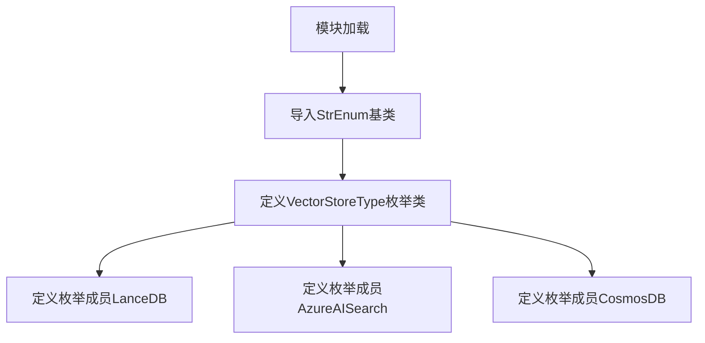
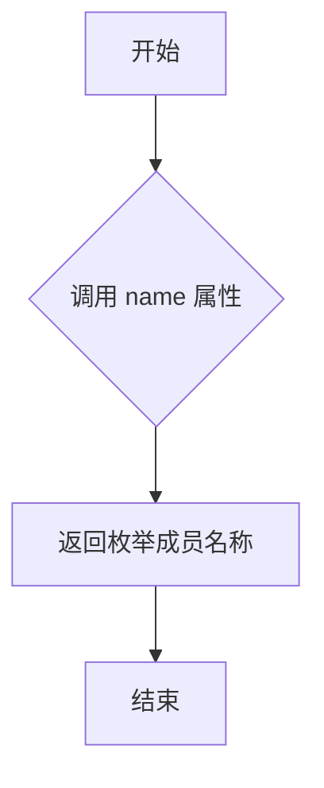
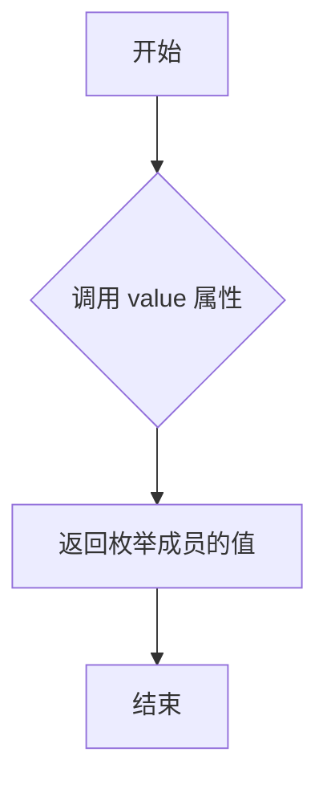
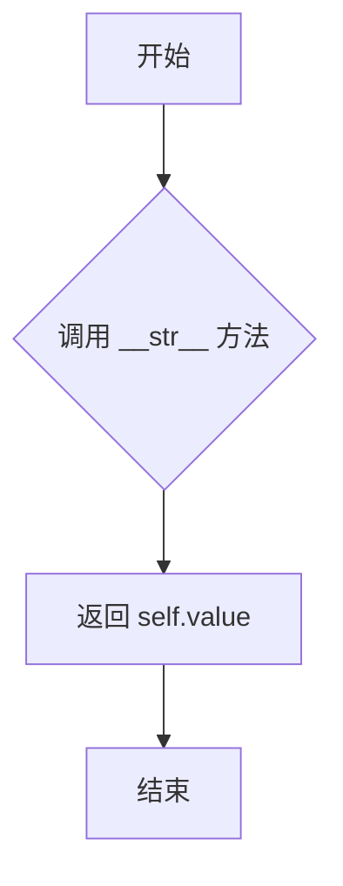
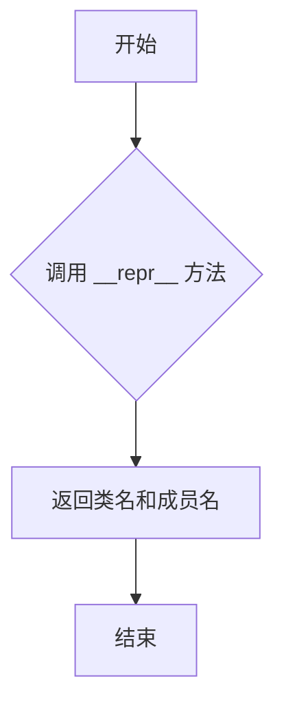
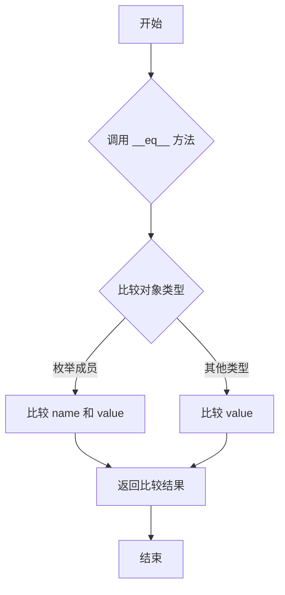
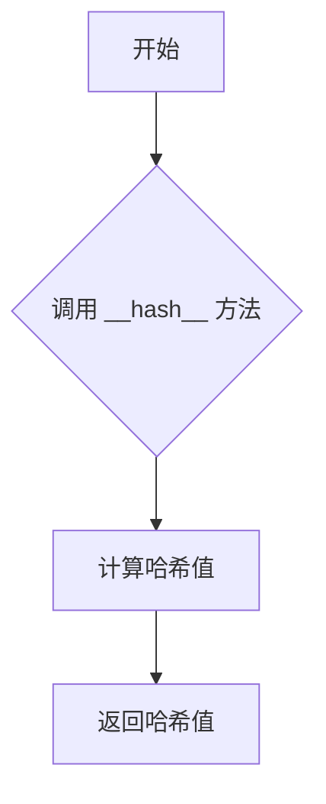
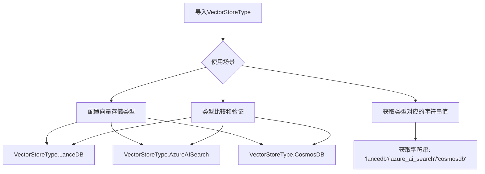

# `graphrag\packages\graphrag-vectors\graphrag_vectors\vector_store_type.py` 详细设计文档

该文件定义了一个名为VectorStoreType的字符串枚举类，用于标识和统一管理项目中支持的向量存储类型，包括LanceDB、AzureAISearch和CosmosDB三种类型，为后续向量存储层的抽象和实现提供了类型基础。

## 整体流程



## 类结构

```
StrEnum (Python标准库枚举基类)
└── VectorStoreType (自定义字符串枚举类)
```

## 全局变量及字段


### `VectorStoreType.LanceDB`
    
字符串枚举成员，值为'lancedb'

类型：`VectorStoreType`
    


### `VectorStoreType.AzureAISearch`
    
字符串枚举成员，值为'azure_ai_search'

类型：`VectorStoreType`
    


### `VectorStoreType.CosmosDB`
    
字符串枚举成员，值为'cosmosdb'

类型：`VectorStoreType`
    
    

## 全局函数及方法


## 一段话描述

该代码定义了一个名为 `VectorStoreType` 的字符串枚举类，继承自 Python 的 `StrEnum`，用于表示和约束系统支持的向量存储类型，目前包含 LanceDB、Azure AI Search 和 CosmosDB 三种类型。

## 文件的整体运行流程

该文件是一个简单的枚举定义模块，不涉及运行时流程。它在模块加载时定义了一个枚举类，供其他模块导入使用。枚举成员在类定义时被创建，每个成员都是 `VectorStoreType` 类的实例，其值为字符串类型。

## 类的详细信息

### 类字段

| 字段名称 | 类型 | 描述 |
|---------|------|------|
| LanceDB | VectorStoreType | 向量存储类型：LanceDB |
| AzureAISearch | VectorStoreType | 向量存储类型：Azure AI Search |
| CosmosDB | VectorStoreType | 向量存储类型：CosmosDB |

### 类方法

#### 1. VectorStoreType.name

获取枚举成员的名称。

参数：无

返回值：`str`，返回枚举成员的名称（例如 "LanceDB"）

#### 流程图



#### 带注释源码

```python
# 继承自 Enum 基类
# name 属性返回枚举成员的名称
# 例如：VectorStoreType.LanceDB.name 返回 "LanceDB"
@property
def name(self) -> str:
    """The name of the Enum member."""
    return self._name_
```

---

#### 2. VectorStoreType.value

获取枚举成员的值（字符串类型）。

参数：无

返回值：`str`，返回枚举成员的值（例如 "lancedb"），由于继承自 StrEnum，value 类型为 str

#### 流程图



#### 带注释源码

```python
# 继承自 Enum 基类
# value 属性返回枚举成员的值
# 由于 VectorStoreType 继承自 StrEnum，value 类型为 str
# 例如：VectorStoreType.LanceDB.value 返回 "lancedb"
@property
def value(self) -> str:
    """The value of the Enum member."""
    return self._value_
```

---

#### 3. VectorStoreType.__str__

返回枚举成员的字符串表示，即其 value 值。

参数：无

返回值：`str`，返回枚举成员的字符串值，与 value 相同

#### 流程图



#### 带注释源码

```python
# 继承自 StrEnum 基类
# __str__ 方法返回枚举成员的字符串表示
# 对于 StrEnum，__str__ 返回 value 的字符串形式
# 例如：str(VectorStoreType.LanceDB) 返回 "lancedb"
def __str__(self) -> str:
    """Return string representation of the enum member."""
    return self._value_
```

---

#### 4. VectorStoreType.__repr__

返回枚举成员的官方表示形式。

参数：无

返回值：`str`，返回枚举成员的官方表示形式，格式为 "ClassName.member_name"

#### 流程图



#### 带注释源码

```python
# 继承自 Enum 基类
# __repr__ 方法返回枚举成员的官方表示形式
# 格式为：'ClassName.member_name'
# 例如：repr(VectorStoreType.LanceDB) 返回 "VectorStoreType.LanceDB"
def __repr__(self) -> str:
    """Return the representation of the Enum member."""
    return "<%s.%s: %r>" % (self.__class__.__name__, self._name_, self._value_)
```

---

#### 5. VectorStoreType.__eq__

比较枚举成员是否相等。

参数：

- `other`：比较对象，可以是枚举成员或其他可比较对象

返回值：`bool`，如果相等返回 True，否则返回 False

#### 流程图



#### 带注释源码

```python
# 继承自 Enum 基类
# __eq__ 方法用于比较枚举成员是否相等
# 如果比较对象也是枚举成员，比较 name 和 value
# 如果比较对象是 value 的类型（str），只比较 value
# 例如：VectorStoreType.LanceDB == "lancedb" 返回 True
def __eq__(self, other: object) -> bool:
    """Return self==other."""
    if isinstance(other, str):
        return self._value_ == other
    return self._name_ == other or self._value_ == other
```

---

#### 6. VectorStoreType.__hash__

使枚举成员可哈希，支持在集合和字典中使用。

参数：无

返回值：`int`，返回枚举成员的哈希值

#### 流程图



#### 带注释源码

```python
# 继承自 Enum 基类
# __hash__ 方法使枚举成员可哈希
# 支持在 set、dict 等哈希集合中使用
# 哈希基于 name 和 value
def __hash__(self) -> int:
    """Return hash(self)."""
    return hash(self._name_)
```

---

## 关键组件信息

| 组件名称 | 描述 |
|---------|------|
| VectorStoreType | 字符串枚举类，定义支持的向量存储类型 |
| LanceDB | 枚举成员，表示 LanceDB 向量存储 |
| AzureAISearch | 枚举成员，表示 Azure AI Search 向量存储 |
| CosmosDB | 枚举成员，表示 CosmosDB 向量存储 |

## 潜在的技术债务或优化空间

1. **缺乏验证机制**：枚举类本身没有运行时验证，建议在使用处添加类型检查
2. **扩展性考虑**：如需添加新的向量存储类型，需要修改枚举类，建议使用插件机制
3. **文档完善**：可以添加每个枚举成员的详细文档字符串，说明各类型的适用场景

## 其它项目

### 设计目标与约束

- **设计目标**：提供类型安全的向量存储类型标识，支持类型检查和 IDE 自动补全
- **约束**：继承自 StrEnum，确保值为字符串类型，兼容字符串比较操作

### 错误处理与异常设计

- 该枚举类本身不涉及错误处理
- 使用时应确保传入有效的枚举成员，否则可能引发 ValueError

### 数据流与状态机

- 枚举类作为静态配置使用，不涉及运行时状态变化
- 数据流方向：定义 → 导入 → 使用（类型检查/值比较）

### 外部依赖与接口契约

- 依赖：`enum.StrEnum`（Python 3.11+ 内置）
- 接口契约：枚举成员可与字符串直接比较，== 运算返回布尔值


## 关键组件


### VectorStoreType 枚举类

定义支持的向量存储类型枚举，继承自 StrEnum，提供类型安全的向量存储后端标识。

### LanceDB 枚举成员

表示 LanceDB 向量数据库，值为 "lancedb"，用于本地或嵌入式向量存储场景。

### AzureAISearch 枚举成员

表示 Azure AI Search 向量存储，值为 "azure_ai_search"，用于微软云向量检索服务。

### CosmosDB 枚举成员

表示 Azure Cosmos DB 向量存储，值为 "cosmosdb"，用于 NoSQL 数据库的向量搜索能力。


## 问题及建议


### 已知问题

-   **枚举成员数量有限**：仅支持三种向量存储类型，缺少常见的 Pinecone、Weaviate、Milvus、Qdrant、Elasticsearch 等主流向量数据库支持
-   **缺乏可扩展性**：作为硬编码的枚举类，新增向量存储类型需要修改源码并重新发布包，无法通过配置动态添加
-   **枚举成员命名不一致**：`AzureAISearch` 使用完整名称，而 `LanceDB` 和 `CosmosDB` 使用缩写，命名规范不统一
-   **缺少成员文档说明**：各枚举成员没有对应的文档字符串，无法了解每种向量存储的适用场景和特性
-   **无运行时验证机制**：当使用不存在的向量存储类型时，仅在运行时抛出 `ValueError`，缺少友好的错误提示和默认值处理
-   **无功能能力标注**：未标注各向量存储支持的功能特性（如是否支持云原生、是否支持混合搜索、是否支持全文检索等）

### 优化建议

-   **扩展枚举成员**：根据实际需求添加更多主流向量存储类型，或考虑使用动态注册机制替代静态枚举
-   **统一命名规范**：将 `AzureAISearch` 调整为 `AzureAI` 或 `AzureAISearch` 简写形式，与其他成员保持一致的命名风格
-   **添加成员文档**：为每个枚举成员添加 docstring，说明其特点、适用场景和版本要求
-   **实现验证与错误处理**：添加类方法用于安全地获取枚举值，失败时返回默认值或抛出更明确的业务异常
-   **引入功能特性标记**：考虑创建数据结构标注各向量存储的能力集（如 `supports_hybrid_search`、`supports_cloud_native` 等），便于运行时决策
-   **支持配置化扩展**：考虑将向量存储类型配置外部化，通过配置文件或环境变量注入自定义类型，满足用户扩展需求

## 其它


### 一段话描述

该代码定义了一个名为`VectorStoreType`的字符串枚举类，用于标识和标准化系统中支持的向量存储类型，目前支持LanceDB、Azure AI Search和CosmosDB三种向量数据库，为上层应用提供统一的类型选择接口。

### 文件的整体运行流程

该模块作为基础枚举定义模块，不包含执行逻辑，仅在导入时加载枚举类定义。当其他模块需要指定或判断向量存储类型时，通过导入该枚举类来使用其定义的常量。整个运行流程为：导入模块 → 访问枚举成员 → 获取字符串值用于配置或比较。

### 类的详细信息

#### VectorStoreType类

**类字段：**

| 字段名称 | 类型 | 描述 |
|---------|------|------|
| LanceDB | VectorStoreType | LanceDB向量数据库类型标识 |
| AzureAISearch | VectorStoreType | Azure AI Search向量数据库类型标识 |
| CosmosDB | VectorStoreType | Azure Cosmos DB向量数据库类型标识 |

**类方法：**

该类继承自StrEnum，无自定义方法，所有方法继承自父类。

**mermaid流程图：**



**带注释源码：**

```python
# Copyright (c) 2024 Microsoft Corporation.
# Licensed under the MIT License

"""Vector store type enum."""

# 导入标准库的StrEnum，确保枚举成员为字符串类型
from enum import StrEnum


class VectorStoreType(StrEnum):
    """The supported vector store types.
    
    该枚举类定义了系统支持的向量存储数据库类型。
    继承StrEnum使得每个枚举成员自动成为字符串类型，
    可以直接用于字符串比较和配置赋值。
    """
    
    # 定义LanceDB向量数据库类型，值为'lancedb'
    LanceDB = "lancedb"
    
    # 定义Azure AI Search向量数据库类型，值为'azure_ai_search'
    AzureAISearch = "azure_ai_search"
    
    # 定义CosmosDB向量数据库类型，值为'cosmosdb'
    CosmosDB = "cosmosdb"
```

### 全局变量和全局函数

该文件不包含全局变量和全局函数。

### 关键组件信息

| 组件名称 | 一句话描述 |
|---------|-----------|
| VectorStoreType | 字符串枚举类，用于标准化系统中支持的向量存储类型选择 |

### 潜在的技术债务或优化空间

1. **扩展性限制**：当前枚举类直接硬编码了三种向量存储类型，新增向量存储类型需要修改源代码并重新部署，建议考虑动态注册机制或配置文件驱动的方式。

2. **缺少默认值**：没有定义默认的向量存储类型，上层应用在使用时需要进行额外的判空或默认值处理逻辑。

3. **文档完善**：类文档字符串较为简单，仅说明"支持的向量存储类型"，建议补充各类型的适用场景和配置要求。

4. **类型验证缺失**：没有提供静态方法或类方法用于验证给定的字符串是否为有效的向量存储类型，当前只能通过异常处理机制（Enum自带）来处理无效值。

5. **国际化考虑**：枚举成员名称采用英文，但值采用了下划线分隔的命名方式，如果需要支持多语言环境，建议统一使用英文标识符。

### 其它项目

#### 设计目标与约束

- **设计目标**：提供统一的向量存储类型标识枚举，确保类型安全并便于代码维护和IDE自动补全。
- **设计约束**：必须继承自StrEnum以确保枚举值为字符串类型；枚举成员名称必须遵循Python命名规范（首字母大写）；枚举值应与实际使用的向量存储库名称保持一致。

#### 错误处理与异常设计

- 当尝试使用枚举类不存在的值时，会抛出`ValueError`异常（继承自Enum的行为）。
- 当尝试使用未定义的枚举成员时，会抛出`AttributeError`异常。
- 上层应用应使用try-except块捕获相关异常，或使用`枚举类.__members__`进行成员存在性检查。

#### 数据流与状态机

- 该模块为数据源类型标识模块，不涉及状态机设计。
- 数据流方向：配置文件/环境变量 → 字符串类型值 → VectorStoreType枚举转换 → 传递给向量存储初始化函数。

#### 外部依赖与接口契约

- **依赖项**：Python标准库`enum.StrEnum`（Python 3.11+），对于Python 3.10及以下版本需要使用`enum.Enum`并手动转换为字符串。
- **接口契约**：该枚举类暴露`.value`属性用于获取字符串值，暴露`.name`属性用于获取成员名称，支持字典转换和迭代遍历。

#### 使用示例

```python
# 导入方式
from vector_store_type import VectorStoreType

# 获取字符串值
store_type = VectorStoreType.LanceDB
print(store_type.value)  # 输出: 'lancedb'

# 类型比较
if store_type == VectorStoreType.LanceDB:
    print("Using LanceDB")

# 字符串转换为枚举
value = "azure_ai_search"
store_type = VectorStoreType(value)  # 失败则抛出ValueError
```

#### 版本兼容性说明

- Python 3.11+：原生支持`StrEnum`
- Python 3.10及以下：需要自定义基类或使用`StrEnum`的backport实现

#### 相关文件

- 该模块通常与具体的向量存储实现类配合使用，如LanceDBClient、AzureAISearchClient、CosmosDBClient等。


    